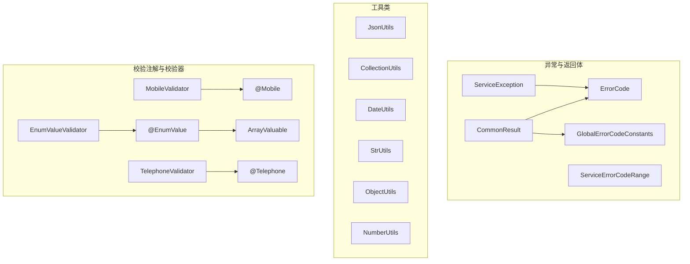
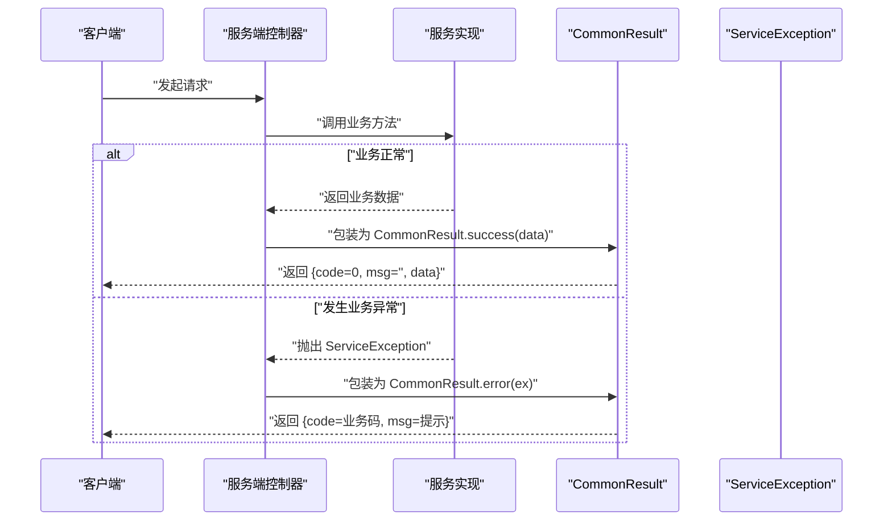
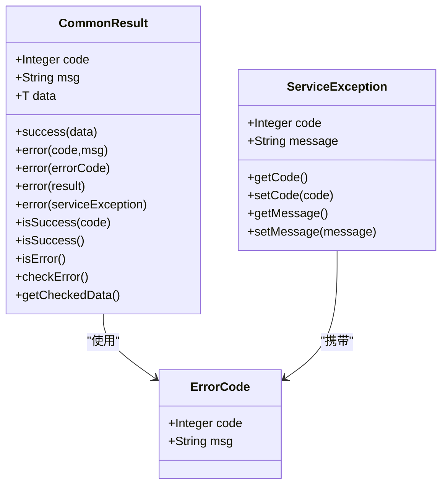
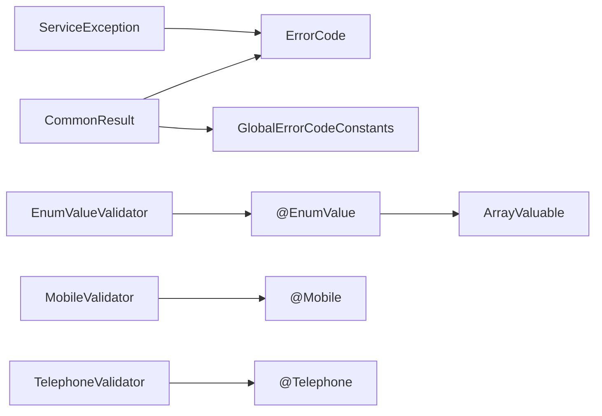

# API 参考

<cite>
**本文引用的文件**
- [ErrorCode.java](file://pandora-framework/pandora-common/src/main/java/net/ittimeline/pandora/framework/common/exception/ErrorCode.java)
- [ServiceException.java](file://pandora-framework/pandora-common/src/main/java/net/ittimeline/pandora/framework/common/exception/ServiceException.java)
- [CommonResult.java](file://pandora-framework/pandora-common/src/main/java/net/ittimeline/pandora/framework/common/pojo/CommonResult.java)
- [GlobalErrorCodeConstants.java](file://pandora-framework/pandora-common/src/main/java/net/ittimeline/pandora/framework/common/exception/enums/GlobalErrorCodeConstants.java)
- [ServiceErrorCodeRange.java](file://pandora-framework/pandora-common/src/main/java/net/ittimeline/pandora/framework/common/exception/enums/ServiceErrorCodeRange.java)
- [JsonUtils.java](file://pandora-framework/pandora-common/src/main/java/net/ittimeline/pandora/framework/common/util/web/json/JsonUtils.java)
- [CollectionUtils.java](file://pandora-framework/pandora-common/src/main/java/net/ittimeline/pandora/framework/common/util/foundational/collection/CollectionUtils.java)
- [DateUtils.java](file://pandora-framework/pandora-common/src/main/java/net/ittimeline/pandora/framework/common/util/foundational/date/DateUtils.java)
- [StrUtils.java](file://pandora-framework/pandora-common/src/main/java/net/ittimeline/pandora/framework/common/util/foundational/string/StrUtils.java)
- [ObjectUtils.java](file://pandora-framework/pandora-common/src/main/java/net/ittimeline/pandora/framework/common/util/foundational/object/ObjectUtils.java)
- [NumberUtils.java](file://pandora-framework/pandora-common/src/main/java/net/ittimeline/pandora/framework/common/util/foundational/number/NumberUtils.java)
- [Mobile.java](file://pandora-framework/pandora-common/src/main/java/net/ittimeline/pandora/framework/common/validation/Mobile.java)
- [Telephone.java](file://pandora-framework/pandora-common/src/main/java/net/ittimeline/pandora/framework/common/validation/Telephone.java)
- [EnumValue.java](file://pandora-framework/pandora-common/src/main/java/net/ittimeline/pandora/framework/common/validation/EnumValue.java)
- [EnumValueValidator.java](file://pandora-framework/pandora-common/src/main/java/net/ittimeline/pandora/framework/common/validation/EnumValueValidator.java)
- [MobileValidator.java](file://pandora-framework/pandora-common/src/main/java/net/ittimeline/pandora/framework/common/validation/MobileValidator.java)
- [TelephoneValidator.java](file://pandora-framework/pandora-common/src/main/java/net/ittimeline/pandora/framework/common/validation/TelephoneValidator.java)
- [ArrayValuable.java](file://pandora-framework/pandora-common/src/main/java/net/ittimeline/pandora/framework/common/core/ArrayValuable.java)
</cite>

## 目录
1. [简介](#简介)
2. [项目结构](#项目结构)
3. [核心组件](#核心组件)
4. [架构总览](#架构总览)
5. [详细组件分析](#详细组件分析)
6. [依赖分析](#依赖分析)
7. [性能考虑](#性能考虑)
8. [故障排查指南](#故障排查指南)
9. [结论](#结论)
10. [附录](#附录)

## 简介
本文件为 Pandora Cloud 框架中“公共基础能力”模块的完整 API 参考，覆盖以下主题：
- 异常与统一返回体：ErrorCode、ServiceException、CommonResult、全局错误码常量与业务错误码区间
- 工具类 API：JsonUtils、CollectionUtils、DateUtils、StrUtils、ObjectUtils、NumberUtils
- 校验注解与校验器：@Mobile、@Telephone、@EnumValue 及对应校验器
- 每个 API 的参数说明、返回值类型、使用示例与注意事项
- 按功能分类组织，便于开发者快速定位与使用

## 项目结构
公共基础能力位于 pandora-framework/pandora-common 模块，按职责划分为：
- exception：异常与统一返回体
- pojo：通用返回模型
- util：各类工具类（集合、日期、字符串、对象、数字、JSON、Web 工具等）
- validation：校验注解与校验器
- core：基础接口（如 ArrayValuable）

图表来源
- [CommonResult.java:14-122](file://pandora-framework/pandora-common/src/main/java/net/ittimeline/pandora/framework/common/pojo/CommonResult.java#L14-L122)
- [ErrorCode.java:17-32](file://pandora-framework/pandora-common/src/main/java/net/ittimeline/pandora/framework/common/exception/ErrorCode.java#L17-L32)
- [ServiceException.java:13-63](file://pandora-framework/pandora-common/src/main/java/net/ittimeline/pandora/framework/common/exception/ServiceException.java#L13-L63)
- [GlobalErrorCodeConstants.java:16-41](file://pandora-framework/pandora-common/src/main/java/net/ittimeline/pandora/framework/common/exception/enums/GlobalErrorCodeConstants.java#L16-L41)
- [ServiceErrorCodeRange.java:31-47](file://pandora-framework/pandora-common/src/main/java/net/ittimeline/pandora/framework/common/exception/enums/ServiceErrorCodeRange.java#L31-L47)
- [JsonUtils.java:34-304](file://pandora-framework/pandora-common/src/main/java/net/ittimeline/pandora/framework/common/util/web/json/JsonUtils.java#L34-L304)
- [CollectionUtils.java:23-374](file://pandora-framework/pandora-common/src/main/java/net/ittimeline/pandora/framework/common/util/foundational/collection/CollectionUtils.java#L23-L374)
- [DateUtils.java:16-150](file://pandora-framework/pandora-common/src/main/java/net/ittimeline/pandora/framework/common/util/foundational/date/DateUtils.java#L16-L150)
- [StrUtils.java:20-107](file://pandora-framework/pandora-common/src/main/java/net/ittimeline/pandora/framework/common/util/foundational/string/StrUtils.java#L20-L107)
- [ObjectUtils.java:17-74](file://pandora-framework/pandora-common/src/main/java/net/ittimeline/pandora/framework/common/util/foundational/object/ObjectUtils.java#L17-L74)
- [NumberUtils.java:17-78](file://pandora-framework/pandora-common/src/main/java/net/ittimeline/pandora/framework/common/util/foundational/number/NumberUtils.java#L17-L78)
- [Mobile.java:14-35](file://pandora-framework/pandora-common/src/main/java/net/ittimeline/pandora/framework/common/validation/Mobile.java#L14-L35)
- [Telephone.java:14-35](file://pandora-framework/pandora-common/src/main/java/net/ittimeline/pandora/framework/common/validation/Telephone.java#L14-L35)
- [EnumValue.java:15-39](file://pandora-framework/pandora-common/src/main/java/net/ittimeline/pandora/framework/common/validation/EnumValue.java#L15-L39)
- [EnumValueValidator.java:18-48](file://pandora-framework/pandora-common/src/main/java/net/ittimeline/pandora/framework/common/validation/EnumValueValidator.java#L18-L48)
- [MobileValidator.java:14-29](file://pandora-framework/pandora-common/src/main/java/net/ittimeline/pandora/framework/common/validation/MobileValidator.java#L14-L29)
- [TelephoneValidator.java:14-30](file://pandora-framework/pandora-common/src/main/java/net/ittimeline/pandora/framework/common/validation/TelephoneValidator.java#L14-L30)
- [ArrayValuable.java:10-15](file://pandora-framework/pandora-common/src/main/java/net/ittimeline/pandora/framework/common/core/ArrayValuable.java#L10-L15)

章节来源
- [CommonResult.java:14-122](file://pandora-framework/pandora-common/src/main/java/net/ittimeline/pandora/framework/common/pojo/CommonResult.java#L14-L122)
- [ErrorCode.java:17-32](file://pandora-framework/pandora-common/src/main/java/net/ittimeline/pandora/framework/common/exception/ErrorCode.java#L17-L32)
- [ServiceException.java:13-63](file://pandora-framework/pandora-common/src/main/java/net/ittimeline/pandora/framework/common/exception/ServiceException.java#L13-L63)
- [JsonUtils.java:34-304](file://pandora-framework/pandora-common/src/main/java/net/ittimeline/pandora/framework/common/util/web/json/JsonUtils.java#L34-L304)
- [CollectionUtils.java:23-374](file://pandora-framework/pandora-common/src/main/java/net/ittimeline/pandora/framework/common/util/foundational/collection/CollectionUtils.java#L23-L374)
- [DateUtils.java:16-150](file://pandora-framework/pandora-common/src/main/java/net/ittimeline/pandora/framework/common/util/foundational/date/DateUtils.java#L16-L150)
- [StrUtils.java:20-107](file://pandora-framework/pandora-common/src/main/java/net/ittimeline/pandora/framework/common/util/foundational/string/StrUtils.java#L20-L107)
- [ObjectUtils.java:17-74](file://pandora-framework/pandora-common/src/main/java/net/ittimeline/pandora/framework/common/util/foundational/object/ObjectUtils.java#L17-L74)
- [NumberUtils.java:17-78](file://pandora-framework/pandora-common/src/main/java/net/ittimeline/pandora/framework/common/util/foundational/number/NumberUtils.java#L17-L78)
- [Mobile.java:14-35](file://pandora-framework/pandora-common/src/main/java/net/ittimeline/pandora/framework/common/validation/Mobile.java#L14-L35)
- [Telephone.java:14-35](file://pandora-framework/pandora-common/src/main/java/net/ittimeline/pandora/framework/common/validation/Telephone.java#L14-L35)
- [EnumValue.java:15-39](file://pandora-framework/pandora-common/src/main/java/net/ittimeline/pandora/framework/common/validation/EnumValue.java#L15-L39)
- [EnumValueValidator.java:18-48](file://pandora-framework/pandora-common/src/main/java/net/ittimeline/pandora/framework/common/validation/EnumValueValidator.java#L18-L48)
- [MobileValidator.java:14-29](file://pandora-framework/pandora-common/src/main/java/net/ittimeline/pandora/framework/common/validation/MobileValidator.java#L14-L29)
- [TelephoneValidator.java:14-30](file://pandora-framework/pandora-common/src/main/java/net/ittimeline/pandora/framework/common/validation/TelephoneValidator.java#L14-L30)
- [ArrayValuable.java:10-15](file://pandora-framework/pandora-common/src/main/java/net/ittimeline/pandora/framework/common/core/ArrayValuable.java#L10-L15)

## 核心组件
本节对异常与统一返回体、工具类、校验注解进行概览性说明。

- 异常与统一返回体
  - ErrorCode：封装错误码与错误消息
  - ServiceException：业务异常，携带错误码与消息
  - CommonResult<T>：统一返回体，包含 code、msg、data，提供 success/error/checkError/getCheckedData 等静态与实例方法
  - GlobalErrorCodeConstants：全局错误码常量（HTTP 语义化）
  - ServiceErrorCodeRange：业务异常错误码区间划分（10 位编号段）

- 工具类
  - JsonUtils：JSON 序列化/反序列化、树解析、类型转换、对象转换、泛型转换、判断 JSON 类型
  - CollectionUtils：集合/分页/映射/去重/扁平化/差异对比/最大/最小/求和/查找首元素等
  - DateUtils：LocalDateTime<Date> 互转、时间加减、过期判断、构建指定时间、比较、是否今日/昨日
  - StrUtils：截断、前缀匹配、拆分转 Long/Set、移除包含某子串的行、拼接方法参数（过滤 Web 对象）
  - ObjectUtils：克隆忽略 ID、默认值、相等性判断、非空判断
  - NumberUtils：数字解析、是否全部为数字、地理距离计算、乘法（含 null 安全）

- 校验注解与校验器
  - @Mobile：手机号格式校验
  - @Telephone：固话/手机号格式校验
  - @EnumValue：值必须在指定枚举范围内（实现 ArrayValuable）
  - 校验器：MobileValidator、TelephoneValidator、EnumValueValidator（支持单值与集合）

章节来源
- [CommonResult.java:14-122](file://pandora-framework/pandora-common/src/main/java/net/ittimeline/pandora/framework/common/pojo/CommonResult.java#L14-L122)
- [ErrorCode.java:17-32](file://pandora-framework/pandora-common/src/main/java/net/ittimeline/pandora/framework/common/exception/ErrorCode.java#L17-L32)
- [ServiceException.java:13-63](file://pandora-framework/pandora-common/src/main/java/net/ittimeline/pandora/framework/common/exception/ServiceException.java#L13-L63)
- [GlobalErrorCodeConstants.java:16-41](file://pandora-framework/pandora-common/src/main/java/net/ittimeline/pandora/framework/common/exception/enums/GlobalErrorCodeConstants.java#L16-L41)
- [ServiceErrorCodeRange.java:31-47](file://pandora-framework/pandora-common/src/main/java/net/ittimeline/pandora/framework/common/exception/enums/ServiceErrorCodeRange.java#L31-L47)
- [JsonUtils.java:34-304](file://pandora-framework/pandora-common/src/main/java/net/ittimeline/pandora/framework/common/util/web/json/JsonUtils.java#L34-L304)
- [CollectionUtils.java:23-374](file://pandora-framework/pandora-common/src/main/java/net/ittimeline/pandora/framework/common/util/foundational/collection/CollectionUtils.java#L23-L374)
- [DateUtils.java:16-150](file://pandora-framework/pandora-common/src/main/java/net/ittimeline/pandora/framework/common/util/foundational/date/DateUtils.java#L16-L150)
- [StrUtils.java:20-107](file://pandora-framework/pandora-common/src/main/java/net/ittimeline/pandora/framework/common/util/foundational/string/StrUtils.java#L20-L107)
- [ObjectUtils.java:17-74](file://pandora-framework/pandora-common/src/main/java/net/ittimeline/pandora/framework/common/util/foundational/object/ObjectUtils.java#L17-L74)
- [NumberUtils.java:17-78](file://pandora-framework/pandora-common/src/main/java/net/ittimeline/pandora/framework/common/util/foundational/number/NumberUtils.java#L17-L78)
- [Mobile.java:14-35](file://pandora-framework/pandora-common/src/main/java/net/ittimeline/pandora/framework/common/validation/Mobile.java#L14-L35)
- [Telephone.java:14-35](file://pandora-framework/pandora-common/src/main/java/net/ittimeline/pandora/framework/common/validation/Telephone.java#L14-L35)
- [EnumValue.java:15-39](file://pandora-framework/pandora-common/src/main/java/net/ittimeline/pandora/framework/common/validation/EnumValue.java#L15-L39)
- [EnumValueValidator.java:18-48](file://pandora-framework/pandora-common/src/main/java/net/ittimeline/pandora/framework/common/validation/EnumValueValidator.java#L18-L48)
- [MobileValidator.java:14-29](file://pandora-framework/pandora-common/src/main/java/net/ittimeline/pandora/framework/common/validation/MobileValidator.java#L14-L29)
- [TelephoneValidator.java:14-30](file://pandora-framework/pandora-common/src/main/java/net/ittimeline/pandora/framework/common/validation/TelephoneValidator.java#L14-L30)
- [ArrayValuable.java:10-15](file://pandora-framework/pandora-common/src/main/java/net/ittimeline/pandora/framework/common/core/ArrayValuable.java#L10-L15)

## 架构总览
统一返回体 CommonResult 与异常体系协同工作，配合全局与业务错误码常量，形成一致的错误表达与传播机制。工具类为上层业务提供高效、安全的数据处理能力；校验注解与校验器确保输入数据的有效性。

图表来源
- [CommonResult.java:74-121](file://pandora-framework/pandora-common/src/main/java/net/ittimeline/pandora/framework/common/pojo/CommonResult.java#L74-L121)
- [ServiceException.java:13-63](file://pandora-framework/pandora-common/src/main/java/net/ittimeline/pandora/framework/common/exception/ServiceException.java#L13-L63)

## 详细组件分析

### 异常与统一返回体

#### ErrorCode
- 作用：封装错误码与错误消息
- 字段
  - code: 整数错误码
  - msg: 错误消息
- 构造
  - 构造函数接收 code 与 message

章节来源
- [ErrorCode.java:17-32](file://pandora-framework/pandora-common/src/main/java/net/ittimeline/pandora/framework/common/exception/ErrorCode.java#L17-L32)

#### ServiceException
- 作用：业务异常，继承 RuntimeException
- 字段
  - code: 错误码
  - message: 错误消息
- 构造
  - 无参构造（反序列化兼容）
  - 接收 ErrorCode 或 (code, message)
- 方法
  - getCode()/setCode()
  - getMessage()/setMessage()

章节来源
- [ServiceException.java:13-63](file://pandora-framework/pandora-common/src/main/java/net/ittimeline/pandora/framework/common/exception/ServiceException.java#L13-L63)

#### CommonResult<T>
- 作用：统一返回体
- 字段
  - code: 错误码
  - msg: 错误消息
  - data: 泛型数据
- 静态方法
  - success(data): 成功返回
  - error(code, message): 错误返回
  - error(errorCode): 错误返回（支持格式化）
  - error(result): 错误返回（从已有结果转换）
  - error(serviceException): 从 ServiceException 转换
  - isSuccess(code): 判断是否成功
- 实例方法
  - isSuccess(): 判断是否成功
  - isError(): 判断是否错误
  - checkError(): 若失败则抛出 ServiceException
  - getCheckedData(): 若失败则抛异常，否则返回 data

图表来源
- [CommonResult.java:14-122](file://pandora-framework/pandora-common/src/main/java/net/ittimeline/pandora/framework/common/pojo/CommonResult.java#L14-L122)
- [ErrorCode.java:17-32](file://pandora-framework/pandora-common/src/main/java/net/ittimeline/pandora/framework/common/exception/ErrorCode.java#L17-L32)
- [ServiceException.java:13-63](file://pandora-framework/pandora-common/src/main/java/net/ittimeline/pandora/framework/common/exception/ServiceException.java#L13-L63)

章节来源
- [CommonResult.java:14-122](file://pandora-framework/pandora-common/src/main/java/net/ittimeline/pandora/framework/common/pojo/CommonResult.java#L14-L122)

#### 全局错误码常量 GlobalErrorCodeConstants
- 作用：定义全局错误码（0-999），采用 HTTP 语义
- 示例常量
  - SUCCESS、BAD_REQUEST、UNAUTHORIZED、FORBIDDEN、NOT_FOUND、METHOD_NOT_ALLOWED、LOCKED、TOO_MANY_REQUESTS、INTERNAL_SERVER_ERROR、NOT_IMPLEMENTED、ERROR_CONFIGURATION、REPEATED_REQUESTS、DEMO_DENY、UNKNOWN

章节来源
- [GlobalErrorCodeConstants.java:16-41](file://pandora-framework/pandora-common/src/main/java/net/ittimeline/pandora/framework/common/exception/enums/GlobalErrorCodeConstants.java#L16-L41)

#### 业务错误码区间 ServiceErrorCodeRange
- 作用：定义业务异常错误码区间划分（10 位编号段），避免模块间冲突
- 说明：提供区间注释示例，指导模块分配

章节来源
- [ServiceErrorCodeRange.java:31-47](file://pandora-framework/pandora-common/src/main/java/net/ittimeline/pandora/framework/common/exception/enums/ServiceErrorCodeRange.java#L31-L47)

### 工具类 API

#### JsonUtils
- 初始化
  - init(ObjectMapper): 注入 Spring 管理的 ObjectMapper
- 序列化
  - toJsonString(Object)/toJsonByte(Object): 序列化为字符串或字节数组
  - toJsonPrettyString(Object): 美化输出
- 反序列化
  - parseObject(String, Class)/parseObject(String, Type)/parseObject(byte[], Class)/parseObject(String, TypeReference)
  - parseObject(String, String path, Class): 按路径提取节点再反序列化
  - parseObject2(String, Class): 兼容 @JsonTypeInfo 场景
  - parseObjectQuietly(...): 解析失败返回 null
- 解析树
  - parseTree(String/byte[]): 解析为 JsonNode
- 判断
  - isJson(String)/isJsonObject(String): 判断是否为 JSON/JSON 对象
- 转换
  - convertObject(Object, Class/TypeReference): 对象转目标类型
  - convertList(Object, Class): 对象转 List
- 注意事项
  - 反序列化异常会抛出运行时异常；parseObjectQuietly 可静默失败返回 null

章节来源
- [JsonUtils.java:34-304](file://pandora-framework/pandora-common/src/main/java/net/ittimeline/pandora/framework/common/util/web/json/JsonUtils.java#L34-L304)

#### CollectionUtils
- 列表/集合
  - filterList(from, predicate)
  - anyMatch(from, predicate)
  - containsAny(from, targets)/containsAny(from, candidates)
  - isAnyEmpty(...)
  - getFirst(from)/findFirst(from, predicate[, func])
- 映射与去重
  - distinct(from, keyMapper[, cover])
  - convertMap(from, keyFunc[, valueFunc][, mergeFunction][, supplier])
  - convertMultiMap(from, keyFunc[, valueFunc])
  - convertImmutableMap(from, keyFunc)
- 转换
  - convertList(from, func[, filter])
  - convertListByFlatMap(from, func[, mapper, func2])
  - convertSet/convertSetByFlatMap(...)
  - convertPage(PageResult<T>, func) -> PageResult<U>
  - convertList(newArrayList(list))
- 比较与差异
  - diffList(oldList, newList, sameFunc) -> [新增, 修改, 删除]
- 其他
  - addIfNotNull(coll, item)
  - singleton(obj)
  - toLinkedHashSet(elementType, value)
  - dfs(node, graph): 检测环（图算法）

章节来源
- [CollectionUtils.java:23-374](file://pandora-framework/pandora-common/src/main/java/net/ittimeline/pandora/framework/common/util/foundational/collection/CollectionUtils.java#L23-L374)

#### DateUtils
- 常量
  - TIME_ZONE_DEFAULT、SECOND_MILLIS、FORMAT_YEAR_MONTH_DAY、FORMAT_YEAR_MONTH_DAY_HOUR_MINUTE_SECOND
- 转换
  - of(LocalDateTime) -> Date
  - of(Date) -> LocalDateTime
- 时间运算
  - addTime(Duration) -> Date
  - isExpired(LocalDateTime) -> boolean
- 构建
  - buildTime(year, month, day[, hour, minute, second]) -> Date
- 比较
  - max(Date/LocalDateTime, Date/LocalDateTime)
- 日期判断
  - isToday(LocalDateTime)
  - isYesterday(LocalDateTime)

章节来源
- [DateUtils.java:16-150](file://pandora-framework/pandora-common/src/main/java/net/ittimeline/pandora/framework/common/util/foundational/date/DateUtils.java#L16-L150)

#### StrUtils
- 截断与匹配
  - maxLength(CharSequence, int)
  - startWithAny(String, Collection<String>)
- 拆分
  - splitToLong(value, separator) -> List<Long>
  - splitToLongSet(value[, separator]) -> Set<Long>
  - splitToInteger(value, separator) -> List<Integer>
- 文本处理
  - removeLineContains(content, sequence) -> String
- 参数拼接
  - joinMethodArgs(joinPoint) -> String（自动过滤 Web/Servlet 类型参数）

章节来源
- [StrUtils.java:20-107](file://pandora-framework/pandora-common/src/main/java/net/ittimeline/pandora/framework/common/util/foundational/string/StrUtils.java#L20-L107)

#### ObjectUtils
- 克隆与忽略 ID
  - cloneIgnoreId(object, consumer) -> T
- 比较与默认值
  - max(obj1, obj2)
  - defaultIfNull(obj...)
  - equalsAny/notEqualsAny(obj, array...)
- 非空判断
  - isNotAllEmpty(objs...)

章节来源
- [ObjectUtils.java:17-74](file://pandora-framework/pandora-common/src/main/java/net/ittimeline/pandora/framework/common/util/foundational/object/ObjectUtils.java#L17-L74)

#### NumberUtils
- 解析
  - parseLong(str) -> Long
  - parseInt(str) -> Integer
- 判断
  - isAllNumber(values) -> boolean
- 计算
  - getDistance(lat1, lng1, lat2, lng2) -> double（单位：千米）
  - mul(BigDecimal...) -> BigDecimal（含 null 安全）

章节来源
- [NumberUtils.java:17-78](file://pandora-framework/pandora-common/src/main/java/net/ittimeline/pandora/framework/common/util/foundational/number/NumberUtils.java#L17-L78)

### 校验注解与校验器

#### @Mobile
- 位置：字段、方法、参数、构造函数、注解类型、类型使用
- 属性
  - message: 默认提示
  - groups/payload: 分组与负载
- 校验器：MobileValidator
  - 空值默认通过；否则调用 ValidationUtils.isMobile

章节来源
- [Mobile.java:14-35](file://pandora-framework/pandora-common/src/main/java/net/ittimeline/pandora/framework/common/validation/Mobile.java#L14-L35)
- [MobileValidator.java:14-29](file://pandora-framework/pandora-common/src/main/java/net/ittimeline/pandora/framework/common/validation/MobileValidator.java#L14-L29)

#### @Telephone
- 位置：字段、方法、参数、构造函数、注解类型、类型使用
- 属性
  - message: 默认提示
  - groups/payload: 分组与负载
- 校验器：TelephoneValidator
  - 空值默认通过；否则调用 PhoneUtil.isTel/isPhone

章节来源
- [Telephone.java:14-35](file://pandora-framework/pandora-common/src/main/java/net/ittimeline/pandora/framework/common/validation/Telephone.java#L14-L35)
- [TelephoneValidator.java:14-30](file://pandora-framework/pandora-common/src/main/java/net/ittimeline/pandora/framework/common/validation/TelephoneValidator.java#L14-L30)

#### @EnumValue
- 位置：字段、方法、参数、构造函数、注解类型、类型使用
- 属性
  - value: 实现 ArrayValuable 的枚举类
  - message: 默认提示（包含 {value} 占位）
  - groups/payload: 分组与负载
- 校验器：EnumValueValidator（单值）与 EnumValueCollectionValidator（集合）
  - 空值默认通过
  - 校验失败时替换默认提示中的 {value} 为允许值列表

章节来源
- [EnumValue.java:15-39](file://pandora-framework/pandora-common/src/main/java/net/ittimeline/pandora/framework/common/validation/EnumValue.java#L15-L39)
- [EnumValueValidator.java:18-48](file://pandora-framework/pandora-common/src/main/java/net/ittimeline/pandora/framework/common/validation/EnumValueValidator.java#L18-L48)
- [ArrayValuable.java:10-15](file://pandora-framework/pandora-common/src/main/java/net/ittimeline/pandora/framework/common/core/ArrayValuable.java#L10-L15)

## 依赖分析
- 统一返回体 CommonResult 依赖 ErrorCode 与全局错误码常量，用于成功/失败判定与异常抛出
- ServiceException 依赖 ErrorCode，用于携带业务错误码
- 校验注解与校验器之间存在一对一/一对多关系：@EnumValue 对应单值与集合两个校验器
- 工具类之间无直接耦合，均基于第三方库（Hutool、Jackson、Guava 等）实现

图表来源
- [CommonResult.java:14-122](file://pandora-framework/pandora-common/src/main/java/net/ittimeline/pandora/framework/common/pojo/CommonResult.java#L14-L122)
- [ErrorCode.java:17-32](file://pandora-framework/pandora-common/src/main/java/net/ittimeline/pandora/framework/common/exception/ErrorCode.java#L17-L32)
- [ServiceException.java:13-63](file://pandora-framework/pandora-common/src/main/java/net/ittimeline/pandora/framework/common/exception/ServiceException.java#L13-L63)
- [EnumValue.java:15-39](file://pandora-framework/pandora-common/src/main/java/net/ittimeline/pandora/framework/common/validation/EnumValue.java#L15-L39)
- [EnumValueValidator.java:18-48](file://pandora-framework/pandora-common/src/main/java/net/ittimeline/pandora/framework/common/validation/EnumValueValidator.java#L18-L48)
- [ArrayValuable.java:10-15](file://pandora-framework/pandora-common/src/main/java/net/ittimeline/pandora/framework/common/core/ArrayValuable.java#L10-L15)
- [MobileValidator.java:14-29](file://pandora-framework/pandora-common/src/main/java/net/ittimeline/pandora/framework/common/validation/MobileValidator.java#L14-L29)
- [TelephoneValidator.java:14-30](file://pandora-framework/pandora-common/src/main/java/net/ittimeline/pandora/framework/common/validation/TelephoneValidator.java#L14-L30)

章节来源
- [CommonResult.java:14-122](file://pandora-framework/pandora-common/src/main/java/net/ittimeline/pandora/framework/common/pojo/CommonResult.java#L14-L122)
- [ServiceException.java:13-63](file://pandora-framework/pandora-common/src/main/java/net/ittimeline/pandora/framework/common/exception/ServiceException.java#L13-L63)
- [EnumValueValidator.java:18-48](file://pandora-framework/pandora-common/src/main/java/net/ittimeline/pandora/framework/common/validation/EnumValueValidator.java#L18-L48)

## 性能考虑
- JsonUtils
  - 避免多次序列化/反序列化：优先使用 convertObject/convertList 减少中间字符串开销
  - parseObject2 适用于缺少 @JsonTypeInfo 的场景，减少错误风险
- CollectionUtils
  - 使用流式 API 与收集器时注意数据规模，必要时分批处理
  - convertMap/convertMultiMap 使用合并策略时，选择合适的 Supplier 以控制内存
- DateUtils
  - LocalDateTime<Date> 互转涉及时区转换，批量处理时尽量复用 ZoneId
- StrUtils
  - joinMethodArgs 会过滤大对象参数，避免日志过大
- NumberUtils
  - getDistance 使用三角函数计算，大数据量时可缓存中间结果

## 故障排查指南
- 统一返回体
  - 使用 isSuccess(code) 判断是否成功；若失败，可通过 checkError() 抛出 ServiceException，便于上层统一捕获
  - getCheckedData() 在失败时抛异常，成功时返回 data
- JSON 解析
  - parseObject/parseTree 抛出运行时异常时，检查输入是否为合法 JSON；可改用 parseObjectQuietly 获取 null
  - 当遇到 @JsonTypeInfo 缺失 class 属性时，使用 parseObject2
- 校验失败
  - @EnumValue 校验失败时，提示中包含允许值列表，根据提示修正输入
  - @Mobile/@Telephone 空值默认通过，若期望必填，请结合其他约束（如 @NotBlank）

章节来源
- [CommonResult.java:82-121](file://pandora-framework/pandora-common/src/main/java/net/ittimeline/pandora/framework/common/pojo/CommonResult.java#L82-L121)
- [JsonUtils.java:75-102](file://pandora-framework/pandora-common/src/main/java/net/ittimeline/pandora/framework/common/util/web/json/JsonUtils.java#L75-L102)
- [EnumValueValidator.java:32-47](file://pandora-framework/pandora-common/src/main/java/net/ittimeline/pandora/framework/common/validation/EnumValueValidator.java#L32-L47)
- [MobileValidator.java:20-28](file://pandora-framework/pandora-common/src/main/java/net/ittimeline/pandora/framework/common/validation/MobileValidator.java#L20-L28)
- [TelephoneValidator.java:20-28](file://pandora-framework/pandora-common/src/main/java/net/ittimeline/pandora/framework/common/validation/TelephoneValidator.java#L20-L28)

## 结论
本参考文档系统梳理了 Pandora Cloud 公共基础能力中的异常与统一返回体、工具类与校验注解 API。通过统一的错误码体系与返回体设计，结合高效的工具类与严谨的输入校验，能够显著提升开发效率与系统稳定性。建议在团队内统一使用这些 API，以保证一致性与可维护性。

## 附录

### 使用示例与注意事项（摘要）
- 统一返回体
  - 成功：CommonResult.success(data)
  - 失败：CommonResult.error(code, message) 或 CommonResult.error(errorCode)
  - 异常抛出：result.checkError()；获取数据：result.getCheckedData()
- JSON
  - 序列化：toJsonString(obj)
  - 反序列化：parseObject(json, Class)；parseObject(json, TypeReference)
  - 转换：convertObject(obj, Class/TypeReference)
- 集合
  - 过滤：filterList(list, pred)
  - 转换：convertList(list, func)
  - 去重：distinct(list, keyMapper)
  - 差异：diffList(oldList, newList, sameFunc)
- 日期
  - 互转：of(LocalDateTime/Date)
  - 判断：isToday/isYesterday
- 字符串
  - 拼接参数：joinMethodArgs(joinPoint)
- 数字
  - 距离：getDistance(lat1, lng1, lat2, lng2)
- 校验
  - @Mobile/@Telephone：手机号/固话格式
  - @EnumValue：值必须在枚举范围内（实现 ArrayValuable）

章节来源
- [CommonResult.java:74-121](file://pandora-framework/pandora-common/src/main/java/net/ittimeline/pandora/framework/common/pojo/CommonResult.java#L74-L121)
- [JsonUtils.java:60-102](file://pandora-framework/pandora-common/src/main/java/net/ittimeline/pandora/framework/common/util/web/json/JsonUtils.java#L60-L102)
- [CollectionUtils.java:36-100](file://pandora-framework/pandora-common/src/main/java/net/ittimeline/pandora/framework/common/util/foundational/collection/CollectionUtils.java#L36-L100)
- [DateUtils.java:37-148](file://pandora-framework/pandora-common/src/main/java/net/ittimeline/pandora/framework/common/util/foundational/date/DateUtils.java#L37-L148)
- [StrUtils.java:89-105](file://pandora-framework/pandora-common/src/main/java/net/ittimeline/pandora/framework/common/util/foundational/string/StrUtils.java#L89-L105)
- [NumberUtils.java:49-77](file://pandora-framework/pandora-common/src/main/java/net/ittimeline/pandora/framework/common/util/foundational/number/NumberUtils.java#L49-L77)
- [Mobile.java:28-35](file://pandora-framework/pandora-common/src/main/java/net/ittimeline/pandora/framework/common/validation/Mobile.java#L28-L35)
- [Telephone.java:28-35](file://pandora-framework/pandora-common/src/main/java/net/ittimeline/pandora/framework/common/validation/Telephone.java#L28-L35)
- [EnumValue.java:28-39](file://pandora-framework/pandora-common/src/main/java/net/ittimeline/pandora/framework/common/validation/EnumValue.java#L28-L39)