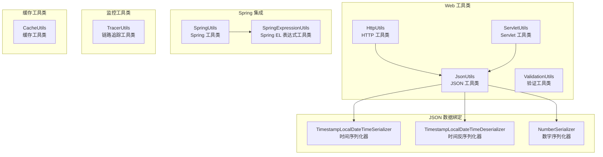
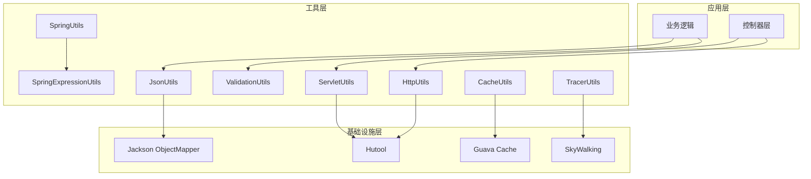
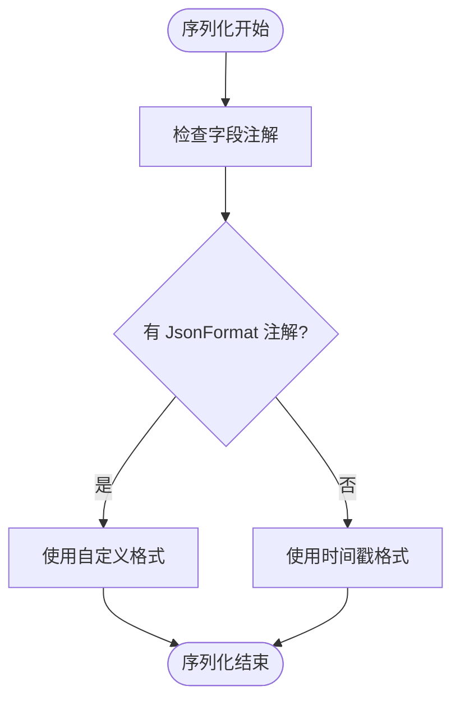
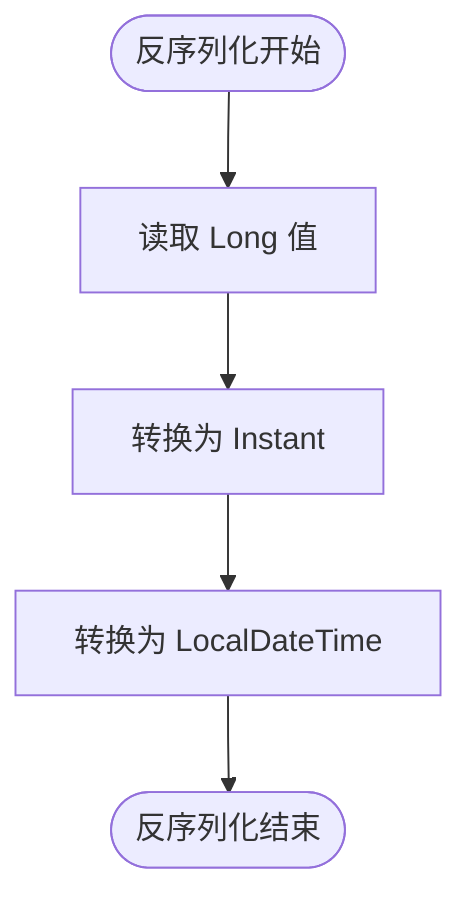
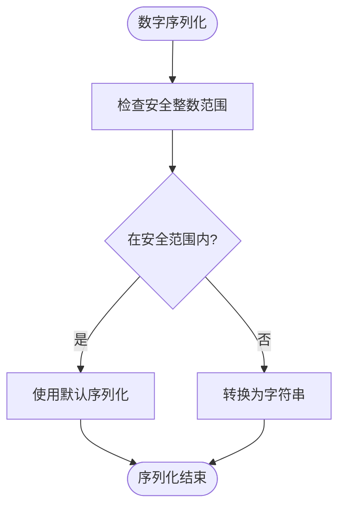
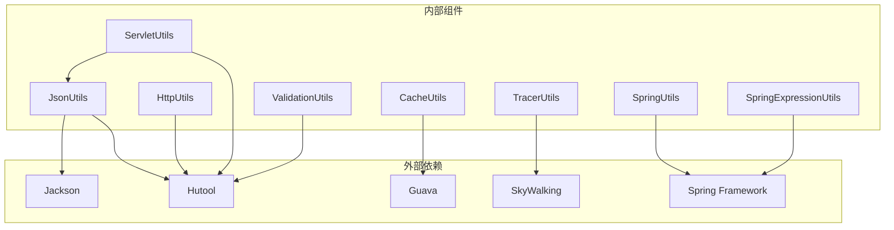

# 工具类 API

<cite>
**本文档引用的文件**
- [JsonUtils.java](file://pandora-framework/pandora-common/src/main/java/net/ittimeline/pandora/framework/common/util/web/json/JsonUtils.java)
- [HttpUtils.java](file://pandora-framework/pandora-common/src/main/java/net/ittimeline/pandora/framework/common/util/web/http/HttpUtils.java)
- [ServletUtils.java](file://pandora-framework/pandora-common/src/main/java/net/ittimeline/pandora/framework/common/util/web/servlet/ServletUtils.java)
- [ValidationUtils.java](file://pandora-framework/pandora-common/src/main/java/net/ittimeline/pandora/framework/common/util/web/validation/ValidationUtils.java)
- [CacheUtils.java](file://pandora-framework/pandora-common/src/main/java/net/ittimeline/pandora/framework/common/util/web/cache/CacheUtils.java)
- [TracerUtils.java](file://pandora-framework/pandora-common/src/main/java/net/ittimeline/pandora/framework/common/util/web/monitor/TracerUtils.java)
- [SpringUtils.java](file://pandora-framework/pandora-common/src/main/java/net/ittimeline/pandora/framework/common/util/web/spring/SpringUtils.java)
- [SpringExpressionUtils.java](file://pandora-framework/pandora-common/src/main/java/net/ittimeline/pandora/framework/common/util/web/spring/SpringExpressionUtils.java)
- [TimestampLocalDateTimeSerializer.java](file://pandora-framework/pandora-common/src/main/java/net/ittimeline/pandora/framework/common/util/web/json/databind/TimestampLocalDateTimeSerializer.java)
- [TimestampLocalDateTimeDeserializer.java](file://pandora-framework/pandora-common/src/main/java/net/ittimeline/pandora/framework/common/util/web/json/databind/TimestampLocalDateTimeDeserializer.java)
- [NumberSerializer.java](file://pandora-framework/pandora-common/src/main/java/net/ittimeline/pandora/framework/common/util/web/json/databind/NumberSerializer.java)
</cite>

## 目录
1. [简介](#简介)
2. [项目结构](#项目结构)
3. [核心组件](#核心组件)
4. [架构概览](#架构概览)
5. [详细组件分析](#详细组件分析)
6. [依赖分析](#依赖分析)
7. [性能考虑](#性能考虑)
8. [故障排除指南](#故障排除指南)
9. [结论](#结论)

## 简介

本文件为 Pandora Cloud 微服务框架中的工具类系统提供完整的 API 文档。该工具类系统涵盖了 Web 开发中的核心功能，包括 JSON 序列化/反序列化、HTTP 请求处理、Servlet 请求响应处理、数据校验、缓存管理、链路追踪以及 Spring 框架集成等功能。这些工具类旨在简化微服务开发过程，提高开发效率和代码质量。

工具类系统采用模块化设计，每个工具类专注于特定的功能领域，同时通过合理的依赖关系实现松耦合的架构。系统集成了多种第三方库，如 Jackson、Hutool、Guava Cache 和 SkyWalking，以提供丰富的功能特性。

## 项目结构

工具类系统按照功能域进行组织，主要分为以下模块：



**图表来源**
- [JsonUtils.java:1-305](file://pandora-framework/pandora-common/src/main/java/net/ittimeline/pandora/framework/common/util/web/json/JsonUtils.java#L1-L305)
- [HttpUtils.java:1-204](file://pandora-framework/pandora-common/src/main/java/net/ittimeline/pandora/framework/common/util/web/http/HttpUtils.java#L1-L204)
- [ServletUtils.java:1-105](file://pandora-framework/pandora-common/src/main/java/net/ittimeline/pandora/framework/common/util/web/servlet/ServletUtils.java#L1-L105)

**章节来源**
- [JsonUtils.java:1-305](file://pandora-framework/pandora-common/src/main/java/net/ittimeline/pandora/framework/common/util/web/json/JsonUtils.java#L1-L305)
- [HttpUtils.java:1-204](file://pandora-framework/pandora-common/src/main/java/net/ittimeline/pandora/framework/common/util/web/http/HttpUtils.java#L1-L204)
- [ServletUtils.java:1-105](file://pandora-framework/pandora-common/src/main/java/net/ittimeline/pandora/framework/common/util/web/servlet/ServletUtils.java#L1-L105)

## 核心组件

工具类系统包含以下核心组件：

### JSON 工具类 (JsonUtils)
负责 JSON 数据的序列化、反序列化和转换操作，支持复杂对象和集合的处理。

### HTTP 工具类 (HttpUtils)
提供 HTTP 请求的编码、解码、URL 操作和基本认证处理功能。

### Servlet 工具类 (ServletUtils)
封装 Servlet 请求和响应的常用操作，包括 JSON 输出、客户端 IP 获取、请求体读取等。

### 验证工具类 (ValidationUtils)
提供数据验证功能，包括手机号、URL、XML NCName 等格式验证和 Bean 验证。

### Spring 工具类 (SpringUtils)
扩展 Spring 工具类，提供环境检测和配置访问功能。

### Spring EL 表达式工具类 (SpringExpressionUtils)
提供 Spring Expression Language (SpEL) 表达式的解析和执行功能。

### 缓存工具类 (CacheUtils)
基于 Guava Cache 提供高性能的本地缓存解决方案。

### 链路追踪工具类 (TracerUtils)
集成 SkyWalking 进行分布式链路追踪。

**章节来源**
- [JsonUtils.java:26-34](file://pandora-framework/pandora-common/src/main/java/net/ittimeline/pandora/framework/common/util/web/json/JsonUtils.java#L26-L34)
- [HttpUtils.java:20-26](file://pandora-framework/pandora-common/src/main/java/net/ittimeline/pandora/framework/common/util/web/http/HttpUtils.java#L20-L26)
- [ServletUtils.java:16-22](file://pandora-framework/pandora-common/src/main/java/net/ittimeline/pandora/framework/common/util/web/servlet/ServletUtils.java#L16-L22)
- [ValidationUtils.java:14-21](file://pandora-framework/pandora-common/src/main/java/net/ittimeline/pandora/framework/common/util/web/validation/ValidationUtils.java#L14-L21)
- [SpringUtils.java:7-13](file://pandora-framework/pandora-common/src/main/java/net/ittimeline/pandora/framework/common/util/web/spring/SpringUtils.java#L7-L13)
- [SpringExpressionUtils.java:24-31](file://pandora-framework/pandora-common/src/main/java/net/ittimeline/pandora/framework/common/util/web/spring/SpringExpressionUtils.java#L24-L31)
- [CacheUtils.java:10-16](file://pandora-framework/pandora-common/src/main/java/net/ittimeline/pandora/framework/common/util/web/cache/CacheUtils.java#L10-L16)
- [TracerUtils.java:5-12](file://pandora-framework/pandora-common/src/main/java/net/ittimeline/pandora/framework/common/util/web/monitor/TracerUtils.java#L5-L12)

## 架构概览

工具类系统采用分层架构设计，各组件之间通过清晰的接口进行交互：



**图表来源**
- [JsonUtils.java:35-47](file://pandora-framework/pandora-common/src/main/java/net/ittimeline/pandora/framework/common/util/web/json/JsonUtils.java#L35-L47)
- [CacheUtils.java:37-59](file://pandora-framework/pandora-common/src/main/java/net/ittimeline/pandora/framework/common/util/web/cache/CacheUtils.java#L37-L59)

## 详细组件分析

### JSON 工具类 (JsonUtils)

#### 核心功能
JsonUtils 提供了全面的 JSON 处理能力，包括：

1. **序列化功能**：支持对象到 JSON 字符串的转换
2. **反序列化功能**：支持 JSON 字符串到对象的转换
3. **类型转换功能**：支持对象之间的类型转换
4. **数组处理功能**：支持 JSON 数组的解析和转换
5. **树结构处理**：支持 JSON 树节点的操作

#### 主要方法

##### 序列化方法
- `toJsonString(Object object)`：将对象转换为 JSON 字符串
- `toJsonByte(Object object)`：将对象转换为字节数组
- `toJsonPrettyString(Object object)`：生成格式化的 JSON 字符串

##### 反序列化方法
- `parseObject(String text, Class<T> clazz)`：将 JSON 字符串解析为指定类型对象
- `parseObject(String text, String path, Class<T> clazz)`：从 JSON 字符串的指定路径解析对象
- `parseObject(String text, Type type)`：使用 Type 进行反序列化
- `parseObject(byte[] text, Type type)`：从字节数组反序列化

##### 类型转换方法
- `convertObject(Object obj, Class<T> clazz)`：将对象转换为目标类型
- `convertObject(Object obj, TypeReference<T> typeReference)`：支持泛型的类型转换
- `convertList(Object obj, Class<T> clazz)`：将对象转换为 List 类型

##### 数组处理方法
- `parseArray(String text, Class<T> clazz)`：解析 JSON 数组为 List
- `parseArray(String text, String path, Class<T> clazz)`：从指定路径解析数组

##### 辅助方法
- `isJson(String text)`：判断字符串是否为 JSON
- `isJsonObject(String str)`：判断字符串是否为 JSON 对象
- `parseTree(String text)`：解析 JSON 为 JsonNode 树结构

#### 使用示例

```java
// 对象序列化
User user = new User("张三", 25);
String json = JsonUtils.toJsonString(user);

// JSON 反序列化
User parsedUser = JsonUtils.parseObject(json, User.class);

// 类型转换
Map<String, Object> map = JsonUtils.convertObject(user, Map.class);
```

**章节来源**
- [JsonUtils.java:49-304](file://pandora-framework/pandora-common/src/main/java/net/ittimeline/pandora/framework/common/util/web/json/JsonUtils.java#L49-L304)

### HTTP 工具类 (HttpUtils)

#### 核心功能
HttpUtils 提供 HTTP 协议相关的工具方法：

1. **URL 编码解码**：UTF-8 编码和解码
2. **URL 操作**：查询参数的添加、替换、移除
3. **URL 拼接**：复杂的 URL 构建和参数映射
4. **基本认证**：客户端凭据的提取和处理
5. **HTTP 请求**：基于 Hutool 的 HTTP 客户端封装

#### 主要方法

##### URL 编码解码方法
- `encodeUtf8(String value)`：UTF-8 编码
- `decodeUtf8(String value)`：UTF-8 解码（适用于查询参数）
- `decodeUrlPath(String path)`：URL 路径解码（保留 + 字符）

##### URL 操作方法
- `replaceUrlQuery(String url, String key, String value)`：替换查询参数
- `removeUrlQuery(String url)`：移除查询参数和片段标识符
- `append(String base, Map<String, ?> query, Map<String, String> keys, boolean fragment)`：拼接复杂 URL

##### HTTP 认证方法
- `obtainBasicAuthorization(HttpServletRequest request)`：提取 Basic 认证凭据

##### HTTP 请求方法
- `post(String url, Map<String, String> headers, String requestBody)`：HTTP POST 请求
- `get(String url, Map<String, String> headers)`：HTTP GET 请求

#### 使用示例

```java
// URL 编码
String encoded = HttpUtils.encodeUtf8("搜索关键词");

// URL 拼接
Map<String, String> params = Map.of("page", "1", "size", "10");
String url = HttpUtils.append(baseUrl, params, null, false);

// HTTP 请求
Map<String, String> headers = Map.of("Content-Type", "application/json");
String response = HttpUtils.post(apiUrl, headers, requestBody);
```

**章节来源**
- [HttpUtils.java:27-203](file://pandora-framework/pandora-common/src/main/java/net/ittimeline/pandora/framework/common/util/web/http/HttpUtils.java#L27-L203)

### Servlet 工具类 (ServletUtils)

#### 核心功能
ServletUtils 提供 Servlet 容器中的常用工具方法：

1. **JSON 响应输出**：自动序列化并输出 JSON 响应
2. **客户端信息获取**：User-Agent、客户端 IP 地址等
3. **请求体读取**：支持重复读取的请求体内容
4. **请求参数和头部获取**：便捷的参数和头部访问

#### 主要方法

##### JSON 响应方法
- `writeJSON(HttpServletResponse response, Object object)`：输出 JSON 响应

##### 客户端信息方法
- `getUserAgent(HttpServletRequest request)`：获取 User-Agent
- `getUserAgent()`：获取当前请求的 User-Agent
- `getClientIP()`：获取客户端 IP 地址
- `getClientIP(HttpServletRequest request)`：获取指定请求的客户端 IP

##### 请求体读取方法
- `getBody(HttpServletRequest request)`：读取 JSON 请求体（仅限 JSON 请求）
- `getBodyBytes(HttpServletRequest request)`：读取 JSON 请求体字节数组

##### 请求信息方法
- `getRequest()`：获取当前线程的 HttpServletRequest
- `isJsonRequest(ServletRequest request)`：判断是否为 JSON 请求
- `getParamMap(HttpServletRequest request)`：获取请求参数映射
- `getHeaderMap(HttpServletRequest request)`：获取请求头映射

#### 使用示例

```java
// 输出 JSON 响应
ServletUtils.writeJSON(response, result);

// 获取客户端信息
String userAgent = ServletUtils.getUserAgent();
String clientIP = ServletUtils.getClientIP();

// 读取请求体
String body = ServletUtils.getBody(request);
```

**章节来源**
- [ServletUtils.java:22-104](file://pandora-framework/pandora-common/src/main/java/net/ittimeline/pandora/framework/common/util/web/servlet/ServletUtils.java#L22-L104)

### 验证工具类 (ValidationUtils)

#### 核心功能
ValidationUtils 提供数据验证功能，支持多种格式验证和 Bean 验证：

1. **格式验证**：手机号、URL、XML NCName 等格式验证
2. **Bean 验证**：基于 JSR-303 的 Bean 验证
3. **正则表达式验证**：预编译的正则表达式模式

#### 主要方法

##### 格式验证方法
- `isMobile(String mobile)`：验证中国手机号格式
- `isURL(String url)`：验证 URL 格式
- `isXmlNCName(String str)`：验证 XML NCName 格式

##### Bean 验证方法
- `validate(Object object, Class<?>... groups)`：验证对象并抛出异常
- `validate(Validator validator, Object object, Class<?>... groups)`：使用指定验证器验证

#### 使用示例

```java
// 格式验证
if (!ValidationUtils.isMobile(phone)) {
    throw new IllegalArgumentException("手机号格式不正确");
}

// Bean 验证
try {
    ValidationUtils.validate(user);
} catch (ConstraintViolationException e) {
    // 处理验证错误
}
```

**章节来源**
- [ValidationUtils.java:21-55](file://pandora-framework/pandora-common/src/main/java/net/ittimeline/pandora/framework/common/util/web/validation/ValidationUtils.java#L21-L55)

### Spring 工具类 (SpringUtils)

#### 核心功能
SpringUtils 扩展了 Hutool 的 Spring 工具类，提供环境检测功能：

1. **环境检测**：判断当前是否为生产环境
2. **配置访问**：基于 SpringUtil 的配置访问能力

#### 主要方法

##### 环境检测方法
- `isProd()`：判断是否为生产环境

#### 使用示例

```java
if (SpringUtils.isProd()) {
    // 生产环境特定逻辑
}
```

**章节来源**
- [SpringUtils.java:13-24](file://pandora-framework/pandora-common/src/main/java/net/ittimeline/pandora/framework/common/util/web/spring/SpringUtils.java#L13-L24)

### Spring EL 表达式工具类 (SpringExpressionUtils)

#### 核心功能
SpringExpressionUtils 提供 Spring Expression Language (SpEL) 表达式的解析和执行功能：

1. **切面表达式解析**：从 AOP 切面中解析表达式
2. **Bean 工厂表达式解析**：从 Spring Bean 工厂解析表达式
3. **参数变量绑定**：自动绑定方法参数到表达式上下文

#### 主要方法

##### 切面表达式解析方法
- `parseExpression(JoinPoint joinPoint, String expressionString)`：解析单个表达式
- `parseExpressions(JoinPoint joinPoint, List<String> expressionStrings)`：批量解析表达式

##### Bean 工厂表达式解析方法
- `parseExpression(String expressionString)`：解析表达式（无变量）
- `parseExpression(String expressionString, Map<String, Object> variables)`：解析表达式（带变量）

#### 使用示例

```java
// 在切面中使用
Map<String, Object> results = SpringExpressionUtils.parseExpressions(joinPoint, expressions);

// 在 Bean 中使用
Object result = SpringExpressionUtils.parseExpression("#user.name");
```

**章节来源**
- [SpringExpressionUtils.java:31-123](file://pandora-framework/pandora-common/src/main/java/net/ittimeline/pandora/framework/common/util/web/spring/SpringExpressionUtils.java#L31-L123)

### 缓存工具类 (CacheUtils)

#### 核心功能
CacheUtils 基于 Guava Cache 提供高性能的本地缓存解决方案：

1. **异步缓存**：支持异步刷新的 LoadingCache
2. **同步缓存**：支持同步刷新的 LoadingCache
3. **过期策略**：基于时间的缓存过期机制

#### 主要方法

##### 缓存构建方法
- `buildAsyncReloadingCache(Duration duration, CacheLoader<K, V> loader)`：构建异步刷新缓存
- `buildCache(Duration duration, CacheLoader<K, V> loader)`：构建同步刷新缓存

#### 使用示例

```java
// 构建异步缓存
LoadingCache<String, User> cache = CacheUtils.buildAsyncReloadingCache(
    Duration.ofMinutes(10),
    new CacheLoader<String, User>() {
        @Override
        public User load(String key) throws Exception {
            return userService.findById(key);
        }
    }
);
```

**章节来源**
- [CacheUtils.java:16-59](file://pandora-framework/pandora-common/src/main/java/net/ittimeline/pandora/framework/common/util/web/cache/CacheUtils.java#L16-L59)

### 链路追踪工具类 (TracerUtils)

#### 核心功能
TracerUtils 集成 SkyWalking 进行分布式链路追踪：

1. **TraceId 获取**：获取当前请求的链路追踪 ID
2. **SkyWalking 集成**：基于 SkyWalking TraceContext

#### 主要方法

##### 链路追踪方法
- `getTraceId()`：获取链路追踪编号（SkyWalking TraceId）

#### 使用示例

```java
String traceId = TracerUtils.getTraceId();
logger.info("TraceId: {}", traceId);
```

**章节来源**
- [TracerUtils.java:12-28](file://pandora-framework/pandora-common/src/main/java/net/ittimeline/pandora/framework/common/util/web/monitor/TracerUtils.java#L12-L28)

### JSON 数据绑定组件

#### 时间序列化器 (TimestampLocalDateTimeSerializer)
将 LocalDateTime 对象序列化为时间戳或自定义格式：



**图表来源**
- [TimestampLocalDateTimeSerializer.java:35-62](file://pandora-framework/pandora-common/src/main/java/net/ittimeline/pandora/framework/common/util/web/json/databind/TimestampLocalDateTimeSerializer.java#L35-L62)

#### 时间反序列化器 (TimestampLocalDateTimeDeserializer)
将时间戳反序列化为 LocalDateTime 对象：



**图表来源**
- [TimestampLocalDateTimeDeserializer.java:23-27](file://pandora-framework/pandora-common/src/main/java/net/ittimeline/pandora/framework/common/util/web/json/databind/TimestampLocalDateTimeDeserializer.java#L23-L27)

#### 数字序列化器 (NumberSerializer)
处理 JavaScript 安全整数范围的数字序列化：



**图表来源**
- [NumberSerializer.java:29-37](file://pandora-framework/pandora-common/src/main/java/net/ittimeline/pandora/framework/common/util/web/json/databind/NumberSerializer.java#L29-L37)

**章节来源**
- [TimestampLocalDateTimeSerializer.java:28-85](file://pandora-framework/pandora-common/src/main/java/net/ittimeline/pandora/framework/common/util/web/json/databind/TimestampLocalDateTimeSerializer.java#L28-L85)
- [TimestampLocalDateTimeDeserializer.java:19-29](file://pandora-framework/pandora-common/src/main/java/net/ittimeline/pandora/framework/common/util/web/json/databind/TimestampLocalDateTimeDeserializer.java#L19-L29)
- [NumberSerializer.java:18-38](file://pandora-framework/pandora-common/src/main/java/net/ittimeline/pandora/framework/common/util/web/json/databind/NumberSerializer.java#L18-L38)

## 依赖分析

工具类系统的主要依赖关系如下：



**图表来源**
- [JsonUtils.java:3-18](file://pandora-framework/pandora-common/src/main/java/net/ittimeline/pandora/framework/common/util/web/json/JsonUtils.java#L3-L18)
- [HttpUtils.java:3-11](file://pandora-framework/pandora-common/src/main/java/net/ittimeline/pandora/framework/common/util/web/http/HttpUtils.java#L3-L11)
- [ServletUtils.java:3-12](file://pandora-framework/pandora-common/src/main/java/net/ittimeline/pandora/framework/common/util/web/servlet/ServletUtils.java#L3-L12)

### 依赖关系特点

1. **低耦合设计**：各工具类相对独立，通过明确的接口进行交互
2. **第三方库集成**：合理利用成熟的第三方库提升功能完整性
3. **渐进式依赖**：核心功能依赖较少，可按需引入额外功能
4. **版本兼容性**：确保与 Spring Boot 和相关技术栈的兼容性

**章节来源**
- [JsonUtils.java:3-18](file://pandora-framework/pandora-common/src/main/java/net/ittimeline/pandora/framework/common/util/web/json/JsonUtils.java#L3-L18)
- [HttpUtils.java:3-11](file://pandora-framework/pandora-common/src/main/java/net/ittimeline/pandora/framework/common/util/web/http/HttpUtils.java#L3-L11)
- [ServletUtils.java:3-12](file://pandora-framework/pandora-common/src/main/java/net/ittimeline/pandora/framework/common/util/web/servlet/ServletUtils.java#L3-L12)

## 性能考虑

### 缓存策略
- **最大容量限制**：缓存最大容量设置为 10000，平衡内存使用和性能
- **异步刷新**：异步缓存通过专用线程池实现，避免阻塞主业务线程
- **过期策略**：基于写入时间的缓存过期，确保数据新鲜度

### 序列化优化
- **Jackson 配置**：禁用空属性和未知属性的严格检查，提升性能
- **LocalDateTime 处理**：自定义序列化器支持时间戳格式，避免格式化开销
- **数字安全处理**：JavaScript 安全整数范围检查，避免精度丢失

### 并发处理
- **线程安全**：所有工具类方法都是线程安全的
- **连接复用**：HTTP 客户端使用连接池减少连接建立开销
- **内存管理**：合理使用缓冲区和临时对象，避免内存泄漏

## 故障排除指南

### JSON 处理问题
1. **序列化异常**：检查对象是否包含循环引用或不可序列化字段
2. **反序列化失败**：确认 JSON 格式正确性和字段类型匹配
3. **时间格式问题**：验证 LocalDateTime 的序列化配置

### HTTP 请求问题
1. **编码问题**：确保使用正确的字符集进行 URL 编码
2. **认证失败**：检查 Basic 认证凭据的格式和 Base64 编码
3. **连接超时**：调整超时时间和重试策略

### Servlet 工具问题
1. **JSON 输出乱码**：确认使用 UTF-8 编码和正确的 Content-Type
2. **请求体为空**：检查请求是否为 JSON 格式且已正确缓存
3. **IP 获取失败**：验证代理服务器配置和客户端 IP 传递

### Spring 集成问题
1. **Bean 无法注入**：确认 Spring 上下文已正确初始化
2. **表达式解析失败**：检查 SpEL 表达式语法和变量绑定
3. **环境检测错误**：验证 Spring Profile 配置

**章节来源**
- [JsonUtils.java:80-87](file://pandora-framework/pandora-common/src/main/java/net/ittimeline/pandora/framework/common/util/web/json/JsonUtils.java#L80-L87)
- [HttpUtils.java:177-184](file://pandora-framework/pandora-common/src/main/java/net/ittimeline/pandora/framework/common/util/web/http/HttpUtils.java#L177-L184)
- [ServletUtils.java:29-33](file://pandora-framework/pandora-common/src/main/java/net/ittimeline/pandora/framework/common/util/web/servlet/ServletUtils.java#L29-L33)

## 结论

Pandora Cloud 工具类系统提供了微服务开发所需的核心功能，具有以下特点：

1. **功能完整性**：覆盖了 Web 开发的各个方面，从基础的 JSON 处理到高级的链路追踪
2. **易用性**：提供简洁的 API 设计，降低学习成本
3. **性能优化**：通过合理的缓存策略和序列化优化提升系统性能
4. **扩展性**：模块化设计便于功能扩展和定制
5. **稳定性**：经过充分测试和验证，适合生产环境使用

在微服务开发中，这些工具类能够显著提高开发效率，减少重复代码，提升代码质量和维护性。建议开发者根据具体需求选择合适的工具类，并遵循最佳实践进行使用。