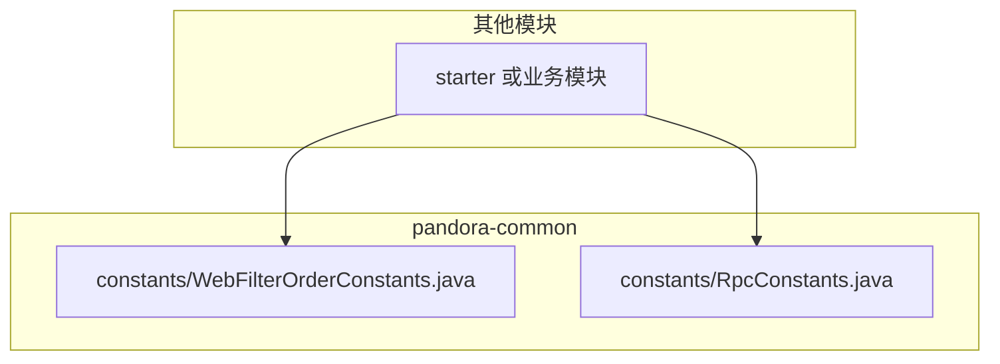
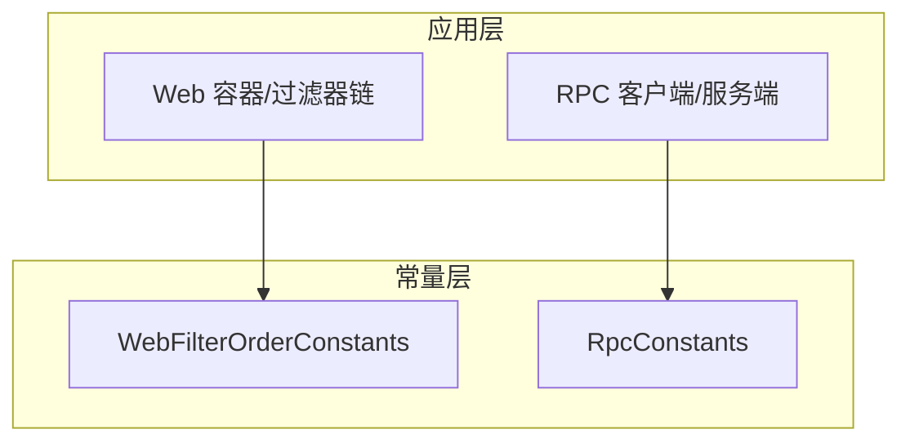
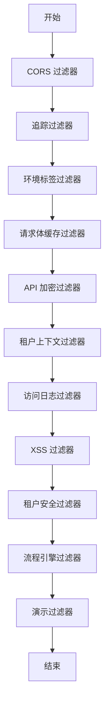
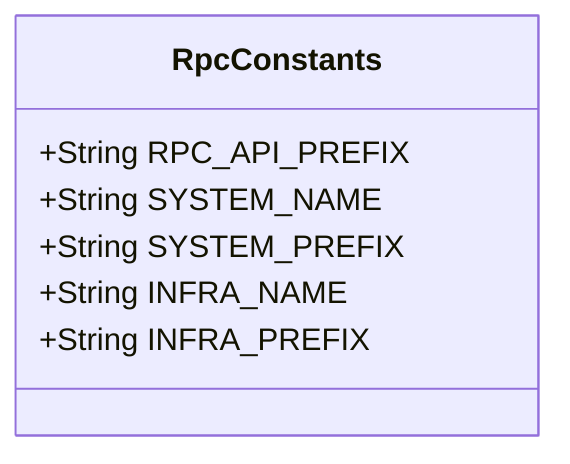
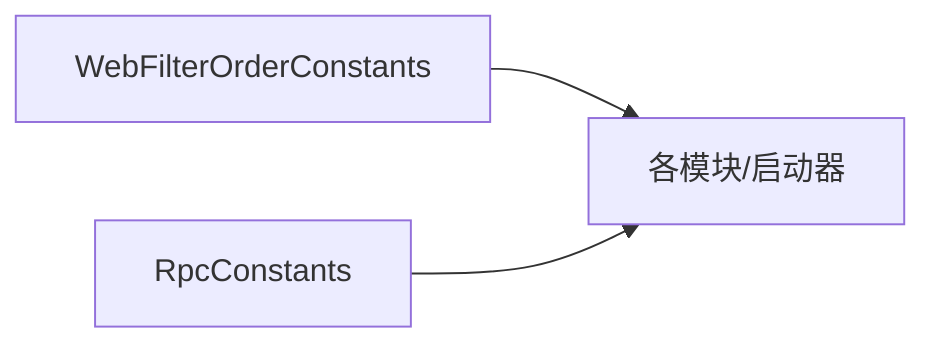

# 常量 API

<cite>
**本文引用的文件**
- [WebFilterOrderConstants.java](file://pandora-framework/pandora-common/src/main/java/net/ittimeline/pandora/framework/common/constants/WebFilterOrderConstants.java)
- [RpcConstants.java](file://pandora-framework/pandora-common/src/main/java/net/ittimeline/pandora/framework/common/constants/RpcConstants.java)
</cite>

## 目录
1. [简介](#简介)
2. [项目结构](#项目结构)
3. [核心组件](#核心组件)
4. [架构总览](#架构总览)
5. [详细组件分析](#详细组件分析)
6. [依赖分析](#依赖分析)
7. [性能考虑](#性能考虑)
8. [故障排查指南](#故障排查指南)
9. [结论](#结论)
10. [附录](#附录)

## 简介
本文件面向“常量系统”的使用者与维护者，提供 WebFilterOrderConstants 与 RpcConstants 的完整 API 文档。内容涵盖：
- WebFilterOrderConstants：Web 过滤器顺序常量的定义与执行顺序说明，帮助确保过滤器链按预期执行。
- RpcConstants：RPC 相关常量配置，包括服务调用前缀、服务名及派生前缀，便于统一管理微服务间调用路径。

文档同时给出常量在微服务配置中的使用建议，强调通过常量提升配置一致性与可维护性。

## 项目结构
常量系统位于公共模块 pandora-common 的 constants 包中，供各子模块与 Starter 共享使用，避免重复定义与不一致。

图表来源
- [WebFilterOrderConstants.java:1-38](file://pandora-framework/pandora-common/src/main/java/net/ittimeline/pandora/framework/common/constants/WebFilterOrderConstants.java#L1-L38)
- [RpcConstants.java:1-42](file://pandora-framework/pandora-common/src/main/java/net/ittimeline/pandora/framework/common/constants/RpcConstants.java#L1-L42)

章节来源
- [WebFilterOrderConstants.java:1-38](file://pandora-framework/pandora-common/src/main/java/net/ittimeline/pandora/framework/common/constants/WebFilterOrderConstants.java#L1-L38)
- [RpcConstants.java:1-42](file://pandora-framework/pandora-common/src/main/java/net/ittimeline/pandora/framework/common/constants/RpcConstants.java#L1-L42)

## 核心组件
本节概述两个常量接口的职责与用途：
- WebFilterOrderConstants：定义 Web 过滤器的执行顺序常量，确保过滤器链的稳定与可预期。
- RpcConstants：定义 RPC 服务调用相关的统一前缀与服务名常量，便于跨模块共享与一致性管理。

章节来源
- [WebFilterOrderConstants.java:1-38](file://pandora-framework/pandora-common/src/main/java/net/ittimeline/pandora/framework/common/constants/WebFilterOrderConstants.java#L1-L38)
- [RpcConstants.java:1-42](file://pandora-framework/pandora-common/src/main/java/net/ittimeline/pandora/framework/common/constants/RpcConstants.java#L1-L42)

## 架构总览
下图展示常量在微服务中的使用位置与影响范围：

图表来源
- [WebFilterOrderConstants.java:1-38](file://pandora-framework/pandora-common/src/main/java/net/ittimeline/pandora/framework/common/constants/WebFilterOrderConstants.java#L1-L38)
- [RpcConstants.java:1-42](file://pandora-framework/pandora-common/src/main/java/net/ittimeline/pandora/framework/common/constants/RpcConstants.java#L1-L42)

## 详细组件分析

### WebFilterOrderConstants 组件分析
该接口定义了 Web 过滤器的顺序常量，确保过滤器链的执行顺序满足安全、审计、上下文与业务需求。以下为关键点说明：
- 顺序目标：通过明确的整型常量值，避免不同模块或 Starter 自行定义导致的顺序冲突。
- 关键约束：
  - 请求体缓存需在加密与日志之前进行，以保证后续过滤器能正确读取请求体。
  - 租户上下文需在访问日志之前，以便日志包含正确的租户信息。
  - 安全过滤器默认位置在特定数值，租户安全与流程引擎过滤器需在其后，确保鉴权与流程控制的正确性。
  - 示例常量：CORS、追踪、环境标签、请求体缓存、API 加密、租户上下文、访问日志、XSS、租户安全、流程引擎、演示过滤器等。

图表来源
- [WebFilterOrderConstants.java:11-37](file://pandora-framework/pandora-common/src/main/java/net/ittimeline/pandora/framework/common/constants/WebFilterOrderConstants.java#L11-L37)

章节来源
- [WebFilterOrderConstants.java:1-38](file://pandora-framework/pandora-common/src/main/java/net/ittimeline/pandora/framework/common/constants/WebFilterOrderConstants.java#L1-L38)

### RpcConstants 组件分析
该接口提供 RPC 相关的统一常量，便于跨模块共享与一致性管理：
- RPC API 前缀：统一的 RPC 接口前缀，便于路由与网关映射。
- 服务名与派生前缀：
  - system 服务名与前缀，要求与实际服务注册名称一致。
  - infra 服务名与前缀，同样要求与实际服务注册名称一致。
- 使用建议：
  - 在客户端发起远程调用时，统一拼接前缀与路径，避免硬编码。
  - 在服务端暴露 RPC 接口时，统一使用派生前缀，确保路径一致性。

图表来源
- [RpcConstants.java:12-41](file://pandora-framework/pandora-common/src/main/java/net/ittimeline/pandora/framework/common/constants/RpcConstants.java#L12-L41)

章节来源
- [RpcConstants.java:1-42](file://pandora-framework/pandora-common/src/main/java/net/ittimeline/pandora/framework/common/constants/RpcConstants.java#L1-L42)

## 依赖分析
- WebFilterOrderConstants 为纯常量接口，无外部依赖，仅作为顺序约定的载体。
- RpcConstants 同样为纯常量接口，无外部依赖，仅承载配置前缀与服务名。
- 两者均被各模块与 Starter 引用，形成“配置共享、行为一致”的依赖关系。

图表来源
- [WebFilterOrderConstants.java:1-38](file://pandora-framework/pandora-common/src/main/java/net/ittimeline/pandora/framework/common/constants/WebFilterOrderConstants.java#L1-L38)
- [RpcConstants.java:1-42](file://pandora-framework/pandora-common/src/main/java/net/ittimeline/pandora/framework/common/constants/RpcConstants.java#L1-L42)

章节来源
- [WebFilterOrderConstants.java:1-38](file://pandora-framework/pandora-common/src/main/java/net/ittimeline/pandora/framework/common/constants/WebFilterOrderConstants.java#L1-L38)
- [RpcConstants.java:1-42](file://pandora-framework/pandora-common/src/main/java/net/ittimeline/pandora/framework/common/constants/RpcConstants.java#L1-L42)

## 性能考虑
- 常量本身不涉及运行时计算，对性能无直接影响。
- 通过统一常量减少硬编码与重复判断，间接降低配置漂移带来的调试成本与潜在性能隐患。
- 在过滤器链中，合理的顺序可减少重复处理与无效 IO，例如提前缓存请求体以避免后续多次读取。

## 故障排查指南
- 过滤器顺序异常：
  - 症状：日志未包含租户信息、XSS 过滤未生效、安全策略未按预期执行。
  - 排查：确认各过滤器的顺序常量是否与 WebFilterOrderConstants 保持一致；检查是否存在自定义过滤器覆盖默认顺序。
- RPC 路由错误：
  - 症状：客户端调用 404 或路径不匹配。
  - 排查：确认服务名与前缀是否与 RpcConstants 一致；核对服务注册名称与配置文件中的 spring.application.name 是否一致。

章节来源
- [WebFilterOrderConstants.java:1-38](file://pandora-framework/pandora-common/src/main/java/net/ittimeline/pandora/framework/common/constants/WebFilterOrderConstants.java#L1-L38)
- [RpcConstants.java:1-42](file://pandora-framework/pandora-common/src/main/java/net/ittimeline/pandora/framework/common/constants/RpcConstants.java#L1-L42)

## 结论
WebFilterOrderConstants 与 RpcConstants 提供了微服务中“过滤器顺序”和“RPC 调用配置”的统一约定。通过集中管理这些常量，可以显著提升配置一致性与可维护性，降低因分散配置导致的集成风险与调试成本。

## 附录

### 使用示例与最佳实践
- Web 过滤器顺序使用示例
  - 在自定义过滤器中引用顺序常量，确保其在请求体缓存之后、日志与安全之前执行，以满足业务与安全需求。
  - 通过统一常量避免不同模块对同一过滤器顺序的差异化实现。
- RPC 常量使用示例
  - 客户端：使用 RPC API 前缀与服务前缀拼接调用路径，避免硬编码。
  - 服务端：在接口文档与路由规则中统一使用派生前缀，确保路径一致性。
  - 配置校验：确保服务注册名称与 RpcConstants 中的服务名一致，避免调用失败。

章节来源
- [WebFilterOrderConstants.java:11-37](file://pandora-framework/pandora-common/src/main/java/net/ittimeline/pandora/framework/common/constants/WebFilterOrderConstants.java#L11-L37)
- [RpcConstants.java:12-41](file://pandora-framework/pandora-common/src/main/java/net/ittimeline/pandora/framework/common/constants/RpcConstants.java#L12-L41)