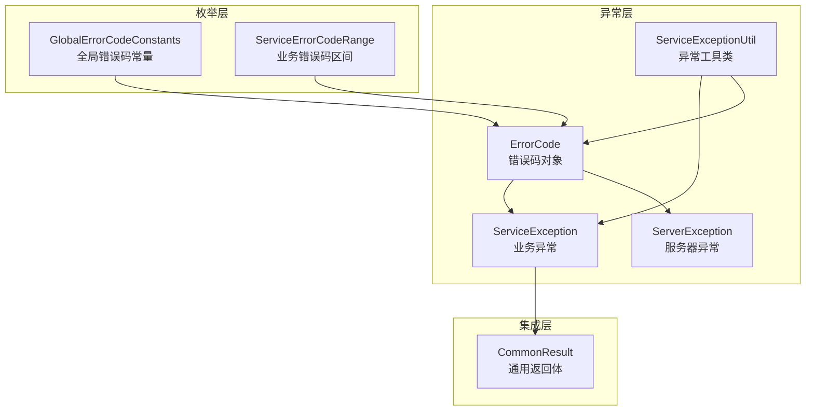
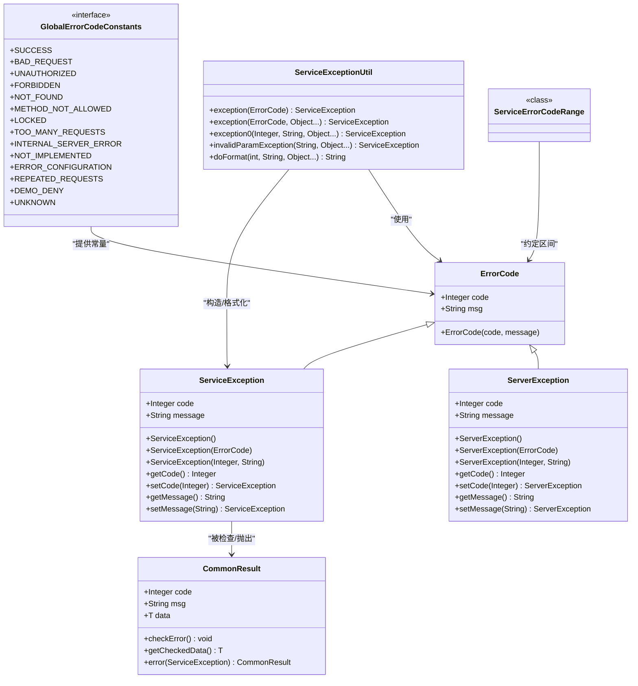
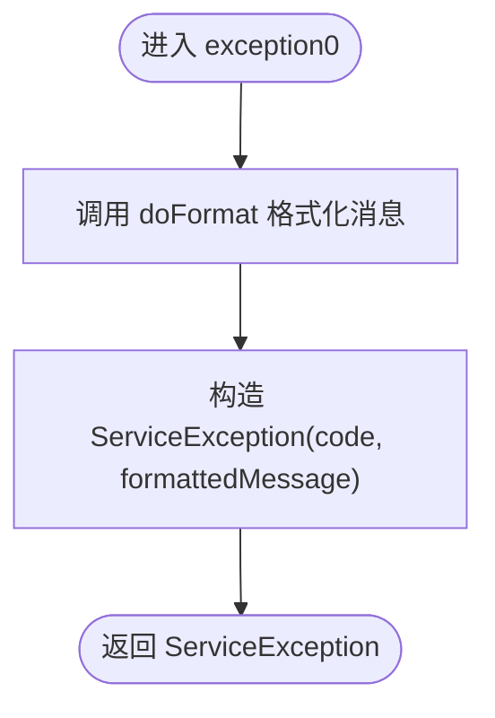
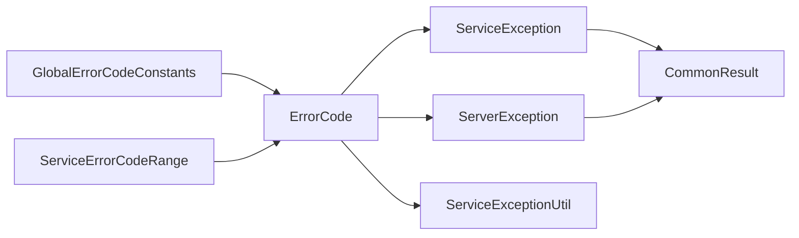

# 异常处理 API

<cite>
**本文引用的文件**
- [ErrorCode.java](file://pandora-framework/pandora-common/src/main/java/net/ittimeline/pandora/framework/common/exception/ErrorCode.java)
- [ServiceException.java](file://pandora-framework/pandora-common/src/main/java/net/ittimeline/pandora/framework/common/exception/ServiceException.java)
- [ServerException.java](file://pandora-framework/pandora-common/src/main/java/net/ittimeline/pandora/framework/common/exception/ServerException.java)
- [ServiceExceptionUtil.java](file://pandora-framework/pandora-common/src/main/java/net/ittimeline/pandora/framework/common/exception/util/ServiceExceptionUtil.java)
- [GlobalErrorCodeConstants.java](file://pandora-framework/pandora-common/src/main/java/net/ittimeline/pandora/framework/common/exception/enums/GlobalErrorCodeConstants.java)
- [ServiceErrorCodeRange.java](file://pandora-framework/pandora-common/src/main/java/net/ittimeline/pandora/framework/common/exception/enums/ServiceErrorCodeRange.java)
- [CommonResult.java](file://pandora-framework/pandora-common/src/main/java/net/ittimeline/pandora/framework/common/pojo/CommonResult.java)
</cite>

## 目录
1. [简介](#简介)
2. [项目结构](#项目结构)
3. [核心组件](#核心组件)
4. [架构总览](#架构总览)
5. [详细组件分析](#详细组件分析)
6. [依赖关系分析](#依赖关系分析)
7. [性能与可用性考量](#性能与可用性考量)
8. [故障排查指南](#故障排查指南)
9. [结论](#结论)
10. [附录：最佳实践与扩展指南](#附录最佳实践与扩展指南)

## 简介
本文件为异常处理系统的完整 API 文档，覆盖以下内容：
- ErrorCode 错误码对象接口与使用规范
- ServiceException 业务异常类与 ServerException 服务器异常类的构造、属性与使用场景
- ServiceExceptionUtil 工具类的全部静态方法与格式化策略
- GlobalErrorCodeConstants 全局错误码常量定义
- ServiceErrorCodeRange 业务错误码区间规范
- 统一异常处理的最佳实践、异常抛出与捕获流程、以及自定义异常扩展方法
- 提供基于仓库现有实现的示例代码路径，便于快速定位与复用

## 项目结构
异常处理相关代码位于公共模块 pandora-common 中，采用“按职责分层”的组织方式：
- exception：异常类型与错误码对象
- exception/enums：全局与业务错误码常量与区间
- exception/util：异常工具类
- pojo：与异常体系集成的通用返回体

**图表来源**
- [ErrorCode.java:17-32](file://pandora-framework/pandora-common/src/main/java/net/ittimeline/pandora/framework/common/exception/ErrorCode.java#L17-L32)
- [ServiceException.java:13-63](file://pandora-framework/pandora-common/src/main/java/net/ittimeline/pandora/framework/common/exception/ServiceException.java#L13-L63)
- [ServerException.java:14-64](file://pandora-framework/pandora-common/src/main/java/net/ittimeline/pandora/framework/common/exception/ServerException.java#L14-L64)
- [ServiceExceptionUtil.java:18-84](file://pandora-framework/pandora-common/src/main/java/net/ittimeline/pandora/framework/common/exception/util/ServiceExceptionUtil.java#L18-L84)
- [GlobalErrorCodeConstants.java:16-41](file://pandora-framework/pandora-common/src/main/java/net/ittimeline/pandora/framework/common/exception/enums/GlobalErrorCodeConstants.java#L16-L41)
- [ServiceErrorCodeRange.java:31-47](file://pandora-framework/pandora-common/src/main/java/net/ittimeline/pandora/framework/common/exception/enums/ServiceErrorCodeRange.java#L31-L47)
- [CommonResult.java:21-122](file://pandora-framework/pandora-common/src/main/java/net/ittimeline/pandora/framework/common/pojo/CommonResult.java#L21-L122)

**章节来源**
- [ErrorCode.java:17-32](file://pandora-framework/pandora-common/src/main/java/net/ittimeline/pandora/framework/common/exception/ErrorCode.java#L17-L32)
- [ServiceException.java:13-63](file://pandora-framework/pandora-common/src/main/java/net/ittimeline/pandora/framework/common/exception/ServiceException.java#L13-L63)
- [ServerException.java:14-64](file://pandora-framework/pandora-common/src/main/java/net/ittimeline/pandora/framework/common/exception/ServerException.java#L14-L64)
- [ServiceExceptionUtil.java:18-84](file://pandora-framework/pandora-common/src/main/java/net/ittimeline/pandora/framework/common/exception/util/ServiceExceptionUtil.java#L18-L84)
- [GlobalErrorCodeConstants.java:16-41](file://pandora-framework/pandora-common/src/main/java/net/ittimeline/pandora/framework/common/exception/enums/GlobalErrorCodeConstants.java#L16-L41)
- [ServiceErrorCodeRange.java:31-47](file://pandora-framework/pandora-common/src/main/java/net/ittimeline/pandora/framework/common/exception/enums/ServiceErrorCodeRange.java#L31-L47)
- [CommonResult.java:21-122](file://pandora-framework/pandora-common/src/main/java/net/ittimeline/pandora/framework/common/pojo/CommonResult.java#L21-L122)

## 核心组件
- ErrorCode：统一的错误码对象，封装 code 与 msg，用于承载全局或业务错误信息
- ServiceException：业务异常类，继承 RuntimeException，携带业务错误码与消息
- ServerException：服务器异常类，继承 RuntimeException，通常用于 5xx 场景
- ServiceExceptionUtil：异常工具类，提供异常构造与消息格式化能力
- GlobalErrorCodeConstants：全局错误码常量集合，覆盖客户端错误、服务端错误与自定义错误
- ServiceErrorCodeRange：业务错误码区间规范，指导各模块分配唯一错误码
- CommonResult：通用返回体，与异常体系集成，支持检查并抛出 ServiceException

**章节来源**
- [ErrorCode.java:17-32](file://pandora-framework/pandora-common/src/main/java/net/ittimeline/pandora/framework/common/exception/ErrorCode.java#L17-L32)
- [ServiceException.java:13-63](file://pandora-framework/pandora-common/src/main/java/net/ittimeline/pandora/framework/common/exception/ServiceException.java#L13-L63)
- [ServerException.java:14-64](file://pandora-framework/pandora-common/src/main/java/net/ittimeline/pandora/framework/common/exception/ServerException.java#L14-L64)
- [ServiceExceptionUtil.java:18-84](file://pandora-framework/pandora-common/src/main/java/net/ittimeline/pandora/framework/common/exception/util/ServiceExceptionUtil.java#L18-L84)
- [GlobalErrorCodeConstants.java:16-41](file://pandora-framework/pandora-common/src/main/java/net/ittimeline/pandora/framework/common/exception/enums/GlobalErrorCodeConstants.java#L16-L41)
- [ServiceErrorCodeRange.java:31-47](file://pandora-framework/pandora-common/src/main/java/net/ittimeline/pandora/framework/common/exception/enums/ServiceErrorCodeRange.java#L31-L47)
- [CommonResult.java:21-122](file://pandora-framework/pandora-common/src/main/java/net/ittimeline/pandora/framework/common/pojo/CommonResult.java#L21-L122)

## 架构总览
异常处理体系通过“错误码对象 + 异常类 + 工具类 + 常量/区间 + 通用返回体”的组合，形成清晰的分层与职责边界：
- 错误码对象承载错误标识与提示
- 异常类承载运行时错误传播
- 工具类负责格式化与便捷构造
- 常量与区间确保全局一致性与可扩展性
- 通用返回体将异常与对外响应打通

**图表来源**
- [ErrorCode.java:17-32](file://pandora-framework/pandora-common/src/main/java/net/ittimeline/pandora/framework/common/exception/ErrorCode.java#L17-L32)
- [ServiceException.java:13-63](file://pandora-framework/pandora-common/src/main/java/net/ittimeline/pandora/framework/common/exception/ServiceException.java#L13-L63)
- [ServerException.java:14-64](file://pandora-framework/pandora-common/src/main/java/net/ittimeline/pandora/framework/common/exception/ServerException.java#L14-L64)
- [ServiceExceptionUtil.java:18-84](file://pandora-framework/pandora-common/src/main/java/net/ittimeline/pandora/framework/common/exception/util/ServiceExceptionUtil.java#L18-L84)
- [GlobalErrorCodeConstants.java:16-41](file://pandora-framework/pandora-common/src/main/java/net/ittimeline/pandora/framework/common/exception/enums/GlobalErrorCodeConstants.java#L16-L41)
- [ServiceErrorCodeRange.java:31-47](file://pandora-framework/pandora-common/src/main/java/net/ittimeline/pandora/framework/common/exception/enums/ServiceErrorCodeRange.java#L31-L47)
- [CommonResult.java:21-122](file://pandora-framework/pandora-common/src/main/java/net/ittimeline/pandora/framework/common/pojo/CommonResult.java#L21-L122)

## 详细组件分析

### ErrorCode 错误码对象
- 角色：承载错误码与提示文本，作为全局与业务错误的统一载体
- 字段
  - code：整数型错误码
  - msg：用户可读的错误提示
- 构造
  - 通过构造函数初始化 code 与 msg
- 使用
  - 与全局错误码常量配合使用，或与业务异常类组合传递

**章节来源**
- [ErrorCode.java:17-32](file://pandora-framework/pandora-common/src/main/java/net/ittimeline/pandora/framework/common/exception/ErrorCode.java#L17-L32)

### ServiceException 业务异常类
- 角色：业务逻辑异常，携带业务错误码与消息，用于向上传播业务层面的失败
- 字段
  - code：业务错误码（参考业务错误码区间）
  - message：错误提示
- 构造
  - 无参构造：避免反序列化问题
  - 基于 ErrorCode 的构造
  - 基于 code 与 message 的构造
- 访问器
  - getCode()/setCode()
  - getMessage()/setMessage()

**章节来源**
- [ServiceException.java:13-63](file://pandora-framework/pandora-common/src/main/java/net/ittimeline/pandora/framework/common/exception/ServiceException.java#L13-L63)

### ServerException 服务器异常类
- 角色：服务器异常，通常用于 5xx 场景，不携带业务错误码
- 字段
  - code：全局错误码（参考全局错误码常量）
  - message：错误提示
- 构造
  - 无参构造：避免反序列化问题
  - 基于 ErrorCode 的构造
  - 基于 code 与 message 的构造
- 访问器
  - getCode()/setCode()
  - getMessage()/setMessage()

**章节来源**
- [ServerException.java:14-64](file://pandora-framework/pandora-common/src/main/java/net/ittimeline/pandora/framework/common/exception/ServerException.java#L14-L64)

### ServiceExceptionUtil 工具类
- 角色：提供异常构造与消息格式化能力，避免 String.format 的参数不匹配风险
- 关键方法
  - exception(ErrorCode)：基于错误码对象构造 ServiceException
  - exception(ErrorCode, Object...)：带参数的异常构造，自动格式化消息
  - exception0(Integer, String, Object...)：底层构造入口，先格式化再构造
  - invalidParamException(String, Object...)：构造“请求参数不正确”类型的业务异常
  - doFormat(int, String, Object...)：内部格式化方法，使用 {} 作为占位符，逐个替换并记录日志
- 格式化策略
  - 使用 {} 作为占位符，按顺序替换
  - 参数不足或多余时记录错误日志，保证健壮性
  - 预分配 StringBuilder 容量，减少扩容开销

**图表来源**
- [ServiceExceptionUtil.java:22-37](file://pandora-framework/pandora-common/src/main/java/net/ittimeline/pandora/framework/common/exception/util/ServiceExceptionUtil.java#L22-L37)
- [ServiceExceptionUtil.java:30-33](file://pandora-framework/pandora-common/src/main/java/net/ittimeline/pandora/framework/common/exception/util/ServiceExceptionUtil.java#L30-L33)
- [ServiceExceptionUtil.java:49-82](file://pandora-framework/pandora-common/src/main/java/net/ittimeline/pandora/framework/common/exception/util/ServiceExceptionUtil.java#L49-L82)

**章节来源**
- [ServiceExceptionUtil.java:18-84](file://pandora-framework/pandora-common/src/main/java/net/ittimeline/pandora/framework/common/exception/util/ServiceExceptionUtil.java#L18-L84)

### GlobalErrorCodeConstants 全局错误码常量
- 角色：定义全局错误码集合，覆盖客户端错误、服务端错误与自定义错误
- 分类
  - 客户端错误：如请求参数不正确、未登录、权限不足等
  - 服务端错误：如系统异常、功能未实现、配置错误等
  - 自定义错误：如重复请求、演示模式禁止写操作等
- 使用
  - 与 ServerException 或通用返回体结合，统一对外展示

**章节来源**
- [GlobalErrorCodeConstants.java:16-41](file://pandora-framework/pandora-common/src/main/java/net/ittimeline/pandora/framework/common/exception/enums/GlobalErrorCodeConstants.java#L16-L41)

### ServiceErrorCodeRange 业务错误码区间规范
- 角色：定义业务错误码的区间划分，避免模块间冲突
- 结构
  - 10 位编码，分为四段：类型、系统类型、模块、错误码
  - 各模块预留区间，便于扩展与维护
- 使用
  - 业务异常应遵循该区间规范分配唯一错误码

**章节来源**
- [ServiceErrorCodeRange.java:31-47](file://pandora-framework/pandora-common/src/main/java/net/ittimeline/pandora/framework/common/exception/enums/ServiceErrorCodeRange.java#L31-L47)

### 与通用返回体的集成
- CommonResult 提供与异常体系的集成点
  - checkError()：若非成功状态则抛出 ServiceException
  - getCheckedData()：若非成功则抛出异常，否则返回 data
  - error(ServiceException)：将 ServiceException 转换为通用返回体

**章节来源**
- [CommonResult.java:96-122](file://pandora-framework/pandora-common/src/main/java/net/ittimeline/pandora/framework/common/pojo/CommonResult.java#L96-L122)

## 依赖关系分析
- ServiceException 与 ServerException 均继承 RuntimeException，分别承载业务与服务器层面的错误
- ServiceExceptionUtil 依赖 GlobalErrorCodeConstants 与 ErrorCode，用于构造与格式化
- GlobalErrorCodeConstants 与 ServiceErrorCodeRange 为 ErrorCode 提供约束与规范
- CommonResult 与异常体系双向集成，既可接收异常也可抛出异常

**图表来源**
- [GlobalErrorCodeConstants.java:16-41](file://pandora-framework/pandora-common/src/main/java/net/ittimeline/pandora/framework/common/exception/enums/GlobalErrorCodeConstants.java#L16-L41)
- [ServiceErrorCodeRange.java:31-47](file://pandora-framework/pandora-common/src/main/java/net/ittimeline/pandora/framework/common/exception/enums/ServiceErrorCodeRange.java#L31-L47)
- [ErrorCode.java:17-32](file://pandora-framework/pandora-common/src/main/java/net/ittimeline/pandora/framework/common/exception/ErrorCode.java#L17-L32)
- [ServiceException.java:13-63](file://pandora-framework/pandora-common/src/main/java/net/ittimeline/pandora/framework/common/exception/ServiceException.java#L13-L63)
- [ServerException.java:14-64](file://pandora-framework/pandora-common/src/main/java/net/ittimeline/pandora/framework/common/exception/ServerException.java#L14-L64)
- [ServiceExceptionUtil.java:18-84](file://pandora-framework/pandora-common/src/main/java/net/ittimeline/pandora/framework/common/exception/util/ServiceExceptionUtil.java#L18-L84)
- [CommonResult.java:21-122](file://pandora-framework/pandora-common/src/main/java/net/ittimeline/pandora/framework/common/pojo/CommonResult.java#L21-L122)

**章节来源**
- [GlobalErrorCodeConstants.java:16-41](file://pandora-framework/pandora-common/src/main/java/net/ittimeline/pandora/framework/common/exception/enums/GlobalErrorCodeConstants.java#L16-L41)
- [ServiceErrorCodeRange.java:31-47](file://pandora-framework/pandora-common/src/main/java/net/ittimeline/pandora/framework/common/exception/enums/ServiceErrorCodeRange.java#L31-L47)
- [ErrorCode.java:17-32](file://pandora-framework/pandora-common/src/main/java/net/ittimeline/pandora/framework/common/exception/ErrorCode.java#L17-L32)
- [ServiceException.java:13-63](file://pandora-framework/pandora-common/src/main/java/net/ittimeline/pandora/framework/common/exception/ServiceException.java#L13-L63)
- [ServerException.java:14-64](file://pandora-framework/pandora-common/src/main/java/net/ittimeline/pandora/framework/common/exception/ServerException.java#L14-L64)
- [ServiceExceptionUtil.java:18-84](file://pandora-framework/pandora-common/src/main/java/net/ittimeline/pandora/framework/common/exception/util/ServiceExceptionUtil.java#L18-L84)
- [CommonResult.java:21-122](file://pandora-framework/pandora-common/src/main/java/net/ittimeline/pandora/framework/common/pojo/CommonResult.java#L21-L122)

## 性能与可用性考量
- 格式化性能
  - doFormat 内部预分配 StringBuilder 容量，降低扩容成本
  - 逐个替换占位符，避免正则或复杂格式化带来的额外开销
- 日志可观测性
  - 参数不足或多余时记录错误日志，便于定位消息模板与参数不一致的问题
- 反序列化兼容
  - 异常类提供无参构造，避免反序列化问题

**章节来源**
- [ServiceExceptionUtil.java:49-82](file://pandora-framework/pandora-common/src/main/java/net/ittimeline/pandora/framework/common/exception/util/ServiceExceptionUtil.java#L49-L82)
- [ServiceException.java:28-32](file://pandora-framework/pandora-common/src/main/java/net/ittimeline/pandora/framework/common/exception/ServiceException.java#L28-L32)
- [ServerException.java:29-33](file://pandora-framework/pandora-common/src/main/java/net/ittimeline/pandora/framework/common/exception/ServerException.java#L29-L33)

## 故障排查指南
- 消息格式化异常
  - 现象：消息中出现未替换的 {} 占位符
  - 处理：检查模板字符串与传入参数数量是否一致；查看日志中的参数过多/过少提示
  - 参考路径：[doFormat:49-82](file://pandora-framework/pandora-common/src/main/java/net/ittimeline/pandora/framework/common/exception/util/ServiceExceptionUtil.java#L49-L82)
- 业务异常未抛出
  - 现象：调用方未收到 ServiceException
  - 处理：确认 CommonResult.checkError() 是否被调用；或在上层统一拦截处进行转换
  - 参考路径：[checkError:101-107](file://pandora-framework/pandora-common/src/main/java/net/ittimeline/pandora/framework/common/pojo/CommonResult.java#L101-L107)
- 服务器异常未生效
  - 现象：对外响应未体现全局错误码
  - 处理：确认 ServerException 的 code 来源于 GlobalErrorCodeConstants；检查统一异常处理器映射
  - 参考路径：[GlobalErrorCodeConstants:16-41](file://pandora-framework/pandora-common/src/main/java/net/ittimeline/pandora/framework/common/exception/enums/GlobalErrorCodeConstants.java#L16-L41)

**章节来源**
- [ServiceExceptionUtil.java:49-82](file://pandora-framework/pandora-common/src/main/java/net/ittimeline/pandora/framework/common/exception/util/ServiceExceptionUtil.java#L49-L82)
- [CommonResult.java:96-122](file://pandora-framework/pandora-common/src/main/java/net/ittimeline/pandora/framework/common/pojo/CommonResult.java#L96-L122)
- [GlobalErrorCodeConstants.java:16-41](file://pandora-framework/pandora-common/src/main/java/net/ittimeline/pandora/framework/common/exception/enums/GlobalErrorCodeConstants.java#L16-L41)

## 结论
本异常处理体系通过“错误码对象 + 异常类 + 工具类 + 常量/区间 + 通用返回体”的协同，实现了：
- 统一的错误标识与提示
- 明确的业务与服务器异常边界
- 可扩展且无冲突的错误码区间
- 健壮的消息格式化与可观测的日志
- 与对外返回体的无缝集成

## 附录：最佳实践与扩展指南

### 最佳实践
- 统一使用 ServiceExceptionUtil 构造业务异常，避免直接拼接字符串
  - 示例路径：[exception0:30-33](file://pandora-framework/pandora-common/src/main/java/net/ittimeline/pandora/framework/common/exception/util/ServiceExceptionUtil.java#L30-L33)
- 业务异常必须遵循 ServiceErrorCodeRange 区间规范，避免冲突
  - 参考路径：[ServiceErrorCodeRange:31-47](file://pandora-framework/pandora-common/src/main/java/net/ittimeline/pandora/framework/common/exception/enums/ServiceErrorCodeRange.java#L31-L47)
- 服务器异常优先使用 GlobalErrorCodeConstants 中的全局错误码
  - 参考路径：[GlobalErrorCodeConstants:16-41](file://pandora-framework/pandora-common/src/main/java/net/ittimeline/pandora/framework/common/exception/enums/GlobalErrorCodeConstants.java#L16-L41)
- 在服务层统一捕获 ServiceException 并转换为 CommonResult 返回
  - 参考路径：[CommonResult.error(ServiceException):119-122](file://pandora-framework/pandora-common/src/main/java/net/ittimeline/pandora/framework/common/pojo/CommonResult.java#L119-L122)

### 异常抛出与捕获流程示例（代码路径）
- 抛出业务异常（带参数格式化）
  - [ServiceExceptionUtil.exception(ErrorCode, Object...):26-28](file://pandora-framework/pandora-common/src/main/java/net/ittimeline/pandora/framework/common/exception/util/ServiceExceptionUtil.java#L26-L28)
- 抛出服务器异常（全局错误码）
  - [new ServerException(GlobalErrorCodeConstants.xxx):35-43](file://pandora-framework/pandora-common/src/main/java/net/ittimeline/pandora/framework/common/exception/ServerException.java#L35-L43)
- 捕获并转换为通用返回
  - [CommonResult.error(ServiceException):119-122](file://pandora-framework/pandora-common/src/main/java/net/ittimeline/pandora/framework/common/pojo/CommonResult.java#L119-L122)
- 统一检查并抛出业务异常
  - [CommonResult.checkError():101-107](file://pandora-framework/pandora-common/src/main/java/net/ittimeline/pandora/framework/common/pojo/CommonResult.java#L101-L107)

### 自定义异常扩展方法
- 若需新增业务异常类型，建议：
  - 继承 RuntimeException 并携带 code 与 message 字段
  - 与 ErrorCode 对象保持一致的命名与语义
  - 在工具类中提供对应的构造与格式化方法，保持风格一致
- 若需新增全局错误码：
  - 在 GlobalErrorCodeConstants 中新增常量
  - 在 ServerException 中使用该常量构造异常

**章节来源**
- [ServiceExceptionUtil.java:18-84](file://pandora-framework/pandora-common/src/main/java/net/ittimeline/pandora/framework/common/exception/util/ServiceExceptionUtil.java#L18-L84)
- [ServerException.java:14-64](file://pandora-framework/pandora-common/src/main/java/net/ittimeline/pandora/framework/common/exception/ServerException.java#L14-L64)
- [GlobalErrorCodeConstants.java:16-41](file://pandora-framework/pandora-common/src/main/java/net/ittimeline/pandora/framework/common/exception/enums/GlobalErrorCodeConstants.java#L16-L41)
- [CommonResult.java:96-122](file://pandora-framework/pandora-common/src/main/java/net/ittimeline/pandora/framework/common/pojo/CommonResult.java#L96-L122)