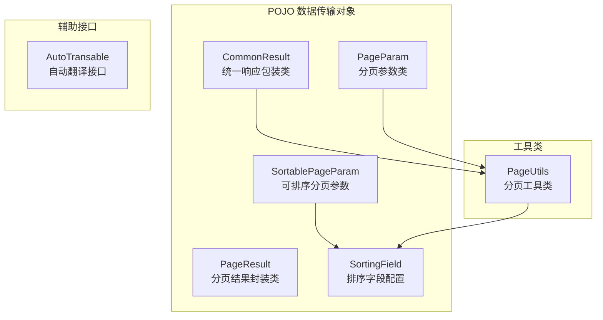
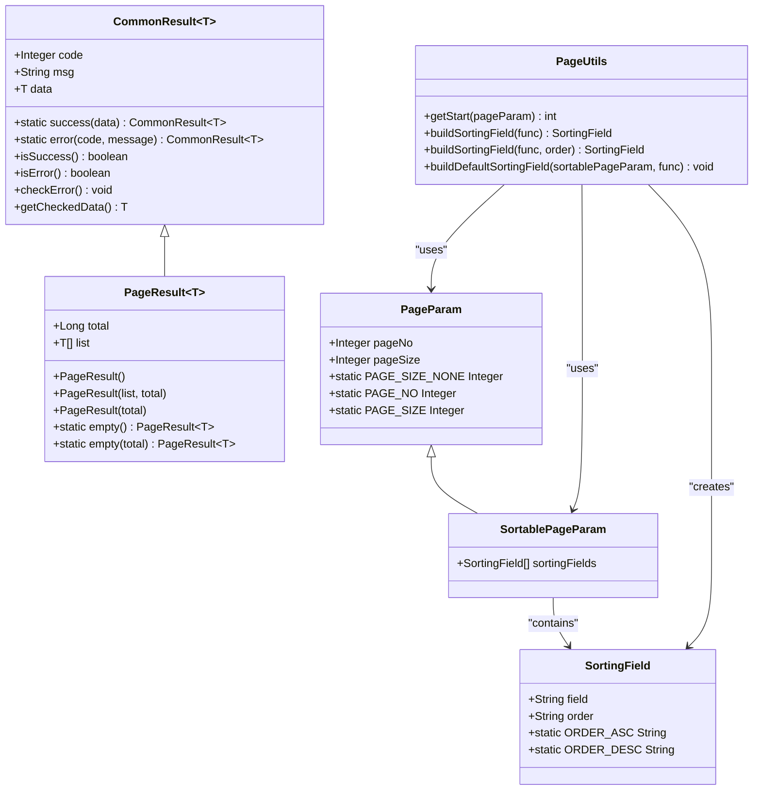
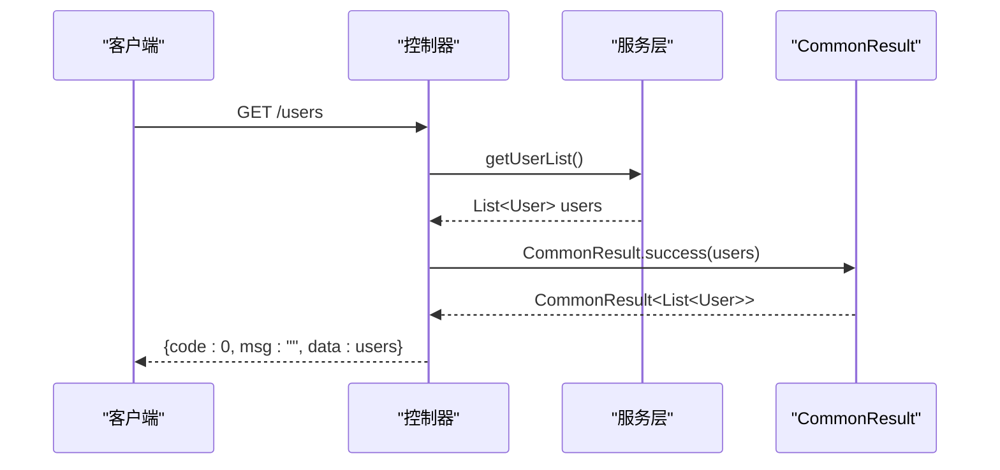
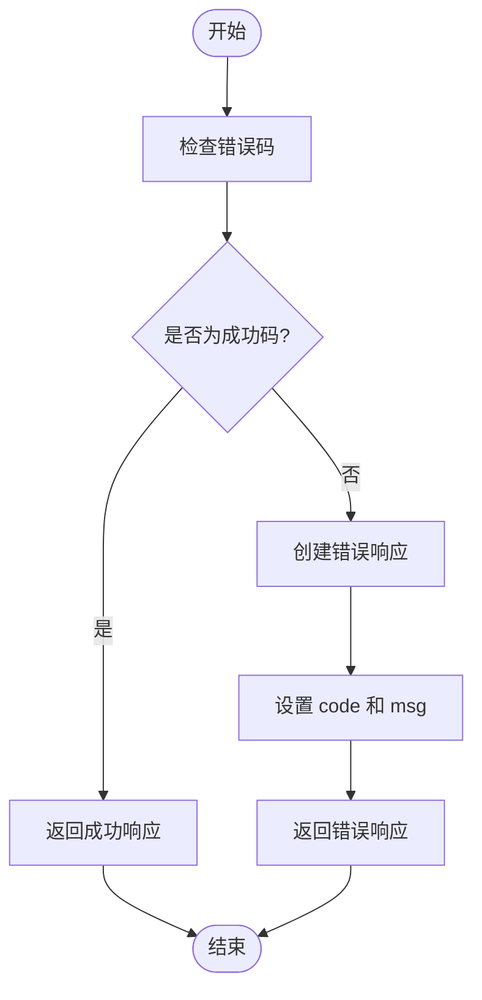
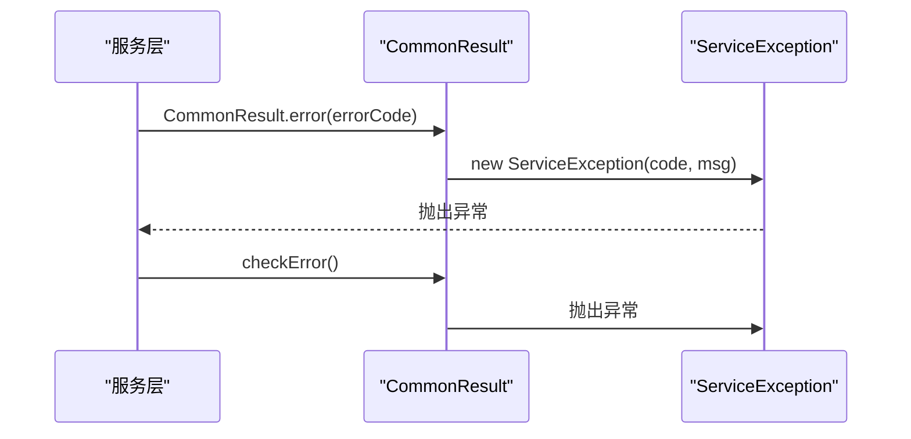
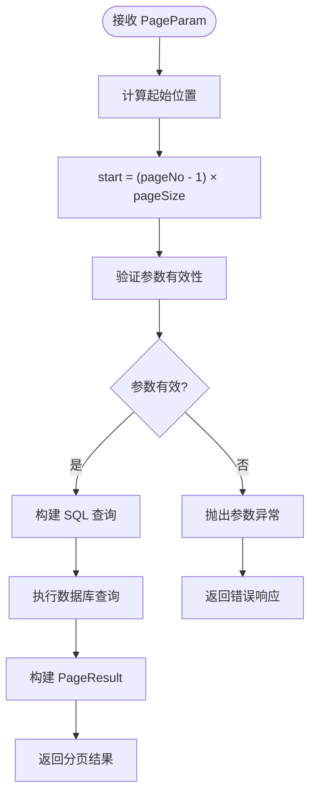
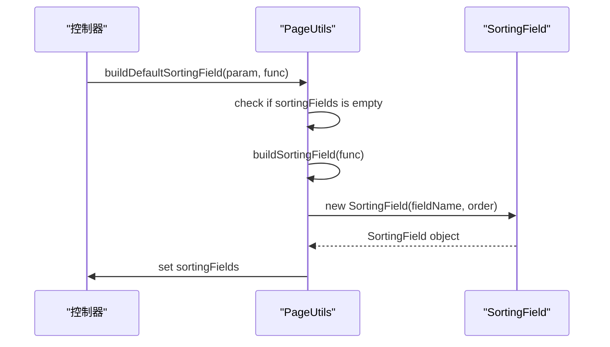
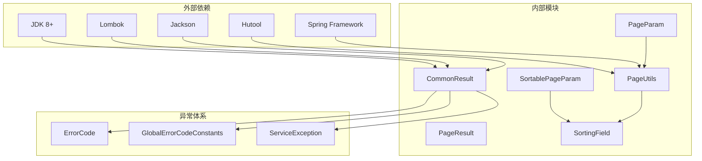

# 数据传输对象 API

<cite>
**本文档引用的文件**
- [CommonResult.java](file://pandora-framework/pandora-common/src/main/java/net/ittimeline/pandora/framework/common/pojo/CommonResult.java)
- [PageParam.java](file://pandora-framework/pandora-common/src/main/java/net/ittimeline/pandora/framework/common/pojo/PageParam.java)
- [PageResult.java](file://pandora-framework/pandora-common/src/main/java/net/ittimeline/pandora/framework/common/pojo/PageResult.java)
- [SortablePageParam.java](file://pandora-framework/pandora-common/src/main/java/net/ittimeline/pandora/framework/common/pojo/SortablePageParam.java)
- [SortingField.java](file://pandora-framework/pandora-common/src/main/java/net/ittimeline/pandora/framework/common/pojo/SortingField.java)
- [PageUtils.java](file://pandora-framework/pandora-common/src/main/java/net/ittimeline/pandora/framework/common/util/foundational/object/PageUtils.java)
- [GlobalErrorCodeConstants.java](file://pandora-framework/pandora-common/src/main/java/net/ittimeline/pandora/framework/common/exception/enums/GlobalErrorCodeConstants.java)
- [AutoTransable.java](file://pandora-framework/pandora-common/src/main/java/com/fhs/trans/service/AutoTransable.java)
</cite>

## 目录
1. [简介](#简介)
2. [项目结构](#项目结构)
3. [核心组件](#核心组件)
4. [架构概览](#架构概览)
5. [详细组件分析](#详细组件分析)
6. [依赖关系分析](#依赖关系分析)
7. [性能考虑](#性能考虑)
8. [故障排除指南](#故障排除指南)
9. [结论](#结论)

## 简介

本文件档详细介绍了 Pandora Cloud 框架中的数据传输对象（DTO）API，重点涵盖统一响应包装类 CommonResult、分页参数类以及排序相关的数据传输对象。这些组件构成了整个框架数据传输的基础，为控制器层提供了标准化的响应格式和分页处理机制。

## 项目结构

数据传输对象主要位于 `pandora-framework/pandora-common/src/main/java/net/ittimeline/pandora/framework/common/pojo/` 目录下，包含以下核心文件：



**图表来源**
- [CommonResult.java:1-123](file://pandora-framework/pandora-common/src/main/java/net/ittimeline/pandora/framework/common/pojo/CommonResult.java#L1-L123)
- [PageParam.java:1-43](file://pandora-framework/pandora-common/src/main/java/net/ittimeline/pandora/framework/common/pojo/PageParam.java#L1-L43)
- [PageResult.java:1-49](file://pandora-framework/pandora-common/src/main/java/net/ittimeline/pandora/framework/common/pojo/PageResult.java#L1-L49)
- [SortablePageParam.java:1-26](file://pandora-framework/pandora-common/src/main/java/net/ittimeline/pandora/framework/common/pojo/SortablePageParam.java#L1-L26)
- [SortingField.java:1-39](file://pandora-framework/pandora-common/src/main/java/net/ittimeline/pandora/framework/common/pojo/SortingField.java#L1-L39)

**章节来源**
- [CommonResult.java:1-123](file://pandora-framework/pandora-common/src/main/java/net/ittimeline/pandora/framework/common/pojo/CommonResult.java#L1-L123)
- [PageParam.java:1-43](file://pandora-framework/pandora-common/src/main/java/net/ittimeline/pandora/framework/common/pojo/PageParam.java#L1-L43)
- [PageResult.java:1-49](file://pandora-framework/pandora-common/src/main/java/net/ittimeline/pandora/framework/common/pojo/PageResult.java#L1-L49)
- [SortablePageParam.java:1-26](file://pandora-framework/pandora-common/src/main/java/net/ittimeline/pandora/framework/common/pojo/SortablePageParam.java#L1-L26)
- [SortingField.java:1-39](file://pandora-framework/pandora-common/src/main/java/net/ittimeline/pandora/framework/common/pojo/SortingField.java#L1-L39)

## 核心组件

### CommonResult 统一响应包装类

CommonResult 是整个框架的核心响应包装类，采用泛型设计，为所有 API 响应提供统一的结构化格式。

#### 主要特性
- **泛型支持**：通过 `<T>` 泛型参数支持任意类型的响应数据
- **标准化结构**：包含 `code`、`msg`、`data` 三个核心字段
- **状态判断**：提供 `isSuccess()` 和 `isError()` 状态检查方法
- **异常集成**：与业务异常体系无缝集成，支持 `checkError()` 和 `getCheckedData()`

#### 字段定义
| 字段名 | 类型 | 描述 | 必填 | 默认值 |
|--------|------|------|------|--------|
| code | Integer | 错误码，0 表示成功 | 是 | - |
| msg | String | 错误信息，用户可读 | 否 | "" |
| data | T | 泛型数据体，具体类型由 T 决定 | 否 | null |

#### 静态工厂方法
- `success(T data)`：创建成功响应
- `error(Integer code, String message)`：创建错误响应
- `error(ErrorCode errorCode)`：根据错误码创建错误响应
- `error(CommonResult<?> result)`：转换现有响应对象

**章节来源**
- [CommonResult.java:14-123](file://pandora-framework/pandora-common/src/main/java/net/ittimeline/pandora/framework/common/pojo/CommonResult.java#L14-L123)

### PageParam 分页参数类

PageParam 提供标准的分页查询参数，支持基本的分页功能。

#### 字段定义
| 字段名 | 类型 | 描述 | 必填 | 默认值 | 验证规则 |
|--------|------|------|------|--------|----------|
| pageNo | Integer | 页码，从 1 开始 | 是 | 1 | @NotNull, @Min(1) |
| pageSize | Integer | 每页条数，最大 200 | 是 | 10 | @NotNull, @Min(1), @Max(200) |

#### 特殊常量
- `PAGE_SIZE_NONE = -1`：表示不分页，用于导出等场景

**章节来源**
- [PageParam.java:11-43](file://pandora-framework/pandora-common/src/main/java/net/ittimeline/pandora/framework/common/pojo/PageParam.java#L11-L43)

### PageResult 分页结果封装类

PageResult 是最终的分页结果封装类，提供标准的分页响应格式。

#### 字段定义
| 字段名 | 类型 | 描述 | 必填 |
|--------|------|------|------|
| total | Long | 总记录数 | 是 |
| list | List<T> | 当前页数据列表 | 是 |

#### 构造方法
- `PageResult()`：默认构造函数
- `PageResult(List<T> list, Long total)`：指定数据和总数
- `PageResult(Long total)`：仅指定总数，空列表

#### 工具方法
- `empty()`：创建空结果
- `empty(Long total)`：创建指定总数的空结果

**章节来源**
- [PageResult.java:10-49](file://pandora-framework/pandora-common/src/main/java/net/ittimeline/pandora/framework/common/pojo/PageResult.java#L10-L49)

### SortablePageParam 可排序分页参数

SortablePageParam 扩展了 PageParam，增加了排序功能支持。

#### 继承关系
```
PageParam
└── SortablePageParam
```

#### 新增字段
| 字段名 | 类型 | 描述 | 必填 |
|--------|------|------|------|
| sortingFields | List<SortingField> | 排序字段列表 | 否 |

**章节来源**
- [SortablePageParam.java:10-26](file://pandora-framework/pandora-common/src/main/java/net/ittimeline/pandora/framework/common/pojo/SortablePageParam.java#L10-L26)

### SortingField 排序字段配置

SortingField 定义单个排序字段的配置信息。

#### 字段定义
| 字段名 | 类型 | 描述 | 必填 | 值范围 |
|--------|------|------|------|--------|
| field | String | 排序字段名 | 是 | - |
| order | String | 排序方向 | 是 | "asc" 或 "desc" |

#### 常量定义
- `ORDER_ASC = "asc"`：升序排列
- `ORDER_DESC = "desc"`：降序排列

**章节来源**
- [SortingField.java:9-39](file://pandora-framework/pandora-common/src/main/java/net/ittimeline/pandora/framework/common/pojo/SortingField.java#L9-L39)

## 架构概览



**图表来源**
- [CommonResult.java:21-123](file://pandora-framework/pandora-common/src/main/java/net/ittimeline/pandora/framework/common/pojo/CommonResult.java#L21-L123)
- [PageParam.java:20-43](file://pandora-framework/pandora-common/src/main/java/net/ittimeline/pandora/framework/common/pojo/PageParam.java#L20-L43)
- [PageResult.java:19-49](file://pandora-framework/pandora-common/src/main/java/net/ittimeline/pandora/framework/common/pojo/PageResult.java#L19-L49)
- [SortablePageParam.java:21-26](file://pandora-framework/pandora-common/src/main/java/net/ittimeline/pandora/framework/common/pojo/SortablePageParam.java#L21-L26)
- [SortingField.java:19-39](file://pandora-framework/pandora-common/src/main/java/net/ittimeline/pandora/framework/common/pojo/SortingField.java#L19-L39)
- [PageUtils.java:23-70](file://pandora-framework/pandora-common/src/main/java/net/ittimeline/pandora/framework/common/util/foundational/object/PageUtils.java#L23-L70)

## 详细组件分析

### CommonResult 使用详解

#### 成功响应构建


**图表来源**
- [CommonResult.java:74-80](file://pandora-framework/pandora-common/src/main/java/net/ittimeline/pandora/framework/common/pojo/CommonResult.java#L74-L80)

#### 错误响应处理


**图表来源**
- [CommonResult.java:54-72](file://pandora-framework/pandora-common/src/main/java/net/ittimeline/pandora/framework/common/pojo/CommonResult.java#L54-L72)

#### 异常集成机制


**图表来源**
- [CommonResult.java:98-107](file://pandora-framework/pandora-common/src/main/java/net/ittimeline/pandora/framework/common/pojo/CommonResult.java#L98-L107)

**章节来源**
- [CommonResult.java:14-123](file://pandora-framework/pandora-common/src/main/java/net/ittimeline/pandora/framework/common/pojo/CommonResult.java#L14-L123)

### 分页参数处理流程

#### 分页计算算法


**图表来源**
- [PageUtils.java:26-28](file://pandora-framework/pandora-common/src/main/java/net/ittimeline/pandora/framework/common/util/foundational/object/PageUtils.java#L26-L28)

#### 排序字段构建


**图表来源**
- [PageUtils.java:64-68](file://pandora-framework/pandora-common/src/main/java/net/ittimeline/pandora/framework/common/util/foundational/object/PageUtils.java#L64-L68)

**章节来源**
- [PageParam.java:11-43](file://pandora-framework/pandora-common/src/main/java/net/ittimeline/pandora/framework/common/pojo/PageParam.java#L11-L43)
- [PageResult.java:10-49](file://pandora-framework/pandora-common/src/main/java/net/ittimeline/pandora/framework/common/pojo/PageResult.java#L10-L49)
- [SortablePageParam.java:10-26](file://pandora-framework/pandora-common/src/main/java/net/ittimeline/pandora/framework/common/pojo/SortablePageParam.java#L10-L26)
- [SortingField.java:9-39](file://pandora-framework/pandora-common/src/main/java/net/ittimeline/pandora/framework/common/pojo/SortingField.java#L9-L39)
- [PageUtils.java:15-70](file://pandora-framework/pandora-common/src/main/java/net/ittimeline/pandora/framework/common/util/foundational/object/PageUtils.java#L15-L70)

## 依赖关系分析



**图表来源**
- [CommonResult.java:3-12](file://pandora-framework/pandora-common/src/main/java/net/ittimeline/pandora/framework/common/pojo/CommonResult.java#L3-L12)
- [PageUtils.java:4-11](file://pandora-framework/pandora-common/src/main/java/net/ittimeline/pandora/framework/common/util/foundational/object/PageUtils.java#L4-L11)

### 关键依赖说明

#### 外部依赖
- **Lombok**：提供 `@Data`、`@NoArgsConstructor` 等注解，简化 POJO 创建
- **Hutool**：提供断言、集合操作等工具方法
- **Jackson**：序列化/反序列化 JSON 响应
- **Spring Framework**：提供断言和工具类支持

#### 内部依赖
- **ErrorCode**：错误码定义和管理
- **GlobalErrorCodeConstants**：全局错误码常量定义
- **ServiceException**：业务异常类

**章节来源**
- [CommonResult.java:3-12](file://pandora-framework/pandora-common/src/main/java/net/ittimeline/pandora/framework/common/pojo/CommonResult.java#L3-L12)
- [PageUtils.java:4-11](file://pandora-framework/pandora-common/src/main/java/net/ittimeline/pandora/framework/common/util/foundational/object/PageUtils.java#L4-L11)

## 性能考虑

### 序列化优化
- 使用 `@JsonIgnore` 注解避免不必要的字段序列化
- `isSuccess()` 和 `isError()` 方法标记为 `@JsonIgnore`，减少响应体积

### 内存使用
- `PAGE_SIZE_NONE = -1` 设计允许大数据量导出时避免内存溢出
- `PageResult.empty()` 提供空结果的轻量级实现

### 计算效率
- `getStart()` 方法使用简单数学运算，时间复杂度 O(1)
- 排序字段构建使用 Lambda 表达式，编译时优化

## 故障排除指南

### 常见问题及解决方案

#### 参数验证失败
**问题**：分页参数验证失败
**原因**：`pageNo < 1` 或 `pageSize > 200`
**解决方案**：检查前端传参或使用默认值

#### 错误码使用不当
**问题**：使用成功码创建错误响应
**原因**：直接使用 `GlobalErrorCodeConstants.SUCCESS.getCode()`
**解决方案**：使用 `CommonResult.error()` 工厂方法

#### 排序字段无效
**问题**：排序方向不是 "asc" 或 "desc"
**解决方案**：使用 `SortingField.ORDER_ASC` 或 `SortingField.ORDER_DESC` 常量

**章节来源**
- [CommonResult.java:54-56](file://pandora-framework/pandora-common/src/main/java/net/ittimeline/pandora/framework/common/pojo/CommonResult.java#L54-L56)
- [PageParam.java:33-41](file://pandora-framework/pandora-common/src/main/java/net/ittimeline/pandora/framework/common/pojo/PageParam.java#L33-L41)
- [SortingField.java:23-28](file://pandora-framework/pandora-common/src/main/java/net/ittimeline/pandora/framework/common/pojo/SortingField.java#L23-L28)

## 结论

Pandora Cloud 框架的数据传输对象 API 提供了完整而优雅的解决方案，涵盖了从统一响应包装到分页处理的各个方面。通过泛型设计、严格的参数验证和完善的异常处理机制，这些组件确保了系统的稳定性和易用性。

### 主要优势
1. **一致性**：统一的响应格式和错误处理
2. **扩展性**：基于继承的设计支持功能扩展
3. **易用性**：简洁的 API 设计和丰富的工具类
4. **性能**：优化的序列化和计算逻辑

### 最佳实践
- 在控制器中始终使用 `CommonResult` 进行响应包装
- 合理使用分页参数，避免过大 `pageSize`
- 使用 `PageUtils` 进行排序字段的构建和验证
- 通过 `checkError()` 和 `getCheckedData()` 简化异常处理

这些组件为构建高质量的企业级应用奠定了坚实的基础，建议在实际开发中严格遵循本文档的规范和最佳实践。