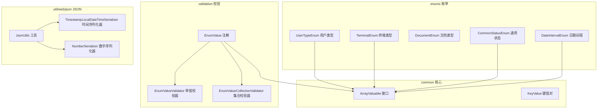
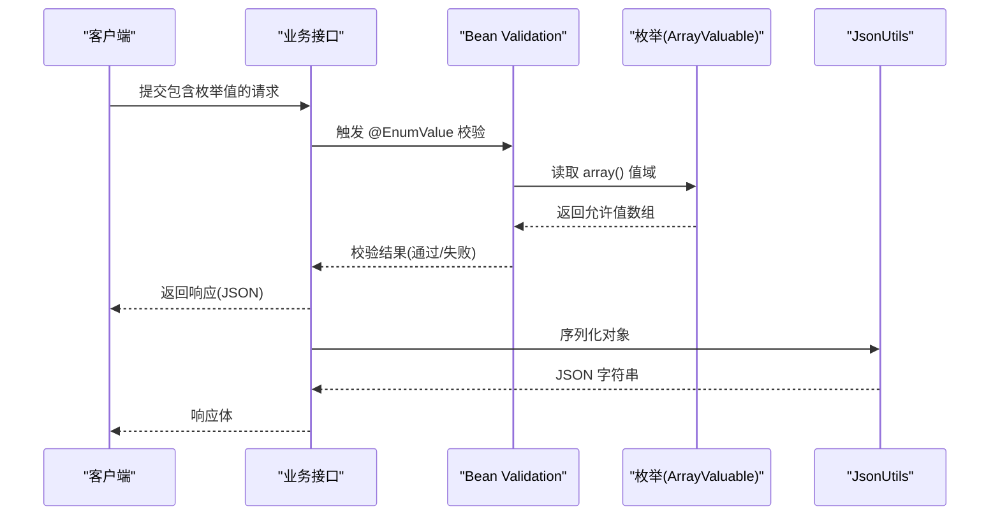
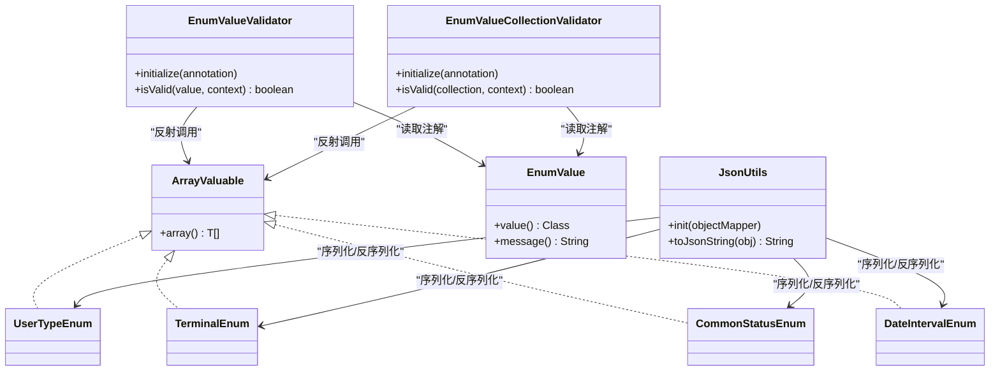

# 枚举 API

<cite>
**本文引用的文件**
- [UserTypeEnum.java](file://pandora-framework/pandora-common/src/main/java/net/ittimeline/pandora/framework/common/enums/UserTypeEnum.java)
- [TerminalEnum.java](file://pandora-framework/pandora-common/src/main/java/net/ittimeline/pandora/framework/common/enums/TerminalEnum.java)
- [DocumentEnum.java](file://pandora-framework/pandora-common/src/main/java/net/ittimeline/pandora/framework/common/enums/DocumentEnum.java)
- [CommonStatusEnum.java](file://pandora-framework/pandora-common/src/main/java/net/ittimeline/pandora/framework/common/enums/CommonStatusEnum.java)
- [DateIntervalEnum.java](file://pandora-framework/pandora-common/src/main/java/net/ittimeline/pandora/framework/common/enums/DateIntervalEnum.java)
- [ArrayValuable.java](file://pandora-framework/pandora-common/src/main/java/net/ittimeline/pandora/framework/common/core/ArrayValuable.java)
- [KeyValue.java](file://pandora-framework/pandora-common/src/main/java/net/ittimeline/pandora/framework/common/core/KeyValue.java)
- [EnumValue.java](file://pandora-framework/pandora-common/src/main/java/net/ittimeline/pandora/framework/common/validation/EnumValue.java)
- [EnumValueValidator.java](file://pandora-framework/pandora-common/src/main/java/net/ittimeline/pandora/framework/common/validation/EnumValueValidator.java)
- [EnumValueCollectionValidator.java](file://pandora-framework/pandora-common/src/main/java/net/ittimeline/pandora/framework/common/validation/EnumValueCollectionValidator.java)
- [JsonUtils.java](file://pandora-framework/pandora-common/src/main/java/net/ittimeline/pandora/framework/common/util/web/json/JsonUtils.java)
- [TimestampLocalDateTimeSerializer.java](file://pandora-framework/pandora-common/src/main/java/net/ittimeline/pandora/framework/common/util/web/json/databind/TimestampLocalDateTimeSerializer.java)
- [NumberSerializer.java](file://pandora-framework/pandora-common/src/main/java/net/ittimeline/pandora/framework/common/util/web/json/databind/NumberSerializer.java)
</cite>

## 目录
1. [简介](#简介)
2. [项目结构](#项目结构)
3. [核心组件](#核心组件)
4. [架构总览](#架构总览)
5. [详细组件分析](#详细组件分析)
6. [依赖分析](#依赖分析)
7. [性能考虑](#性能考虑)
8. [故障排查指南](#故障排查指南)
9. [结论](#结论)
10. [附录](#附录)

## 简介
本文件为“枚举系统”的完整 API 文档，覆盖以下内容：
- 所有预定义枚举类型的值定义与使用场景
- ArrayValuable 接口与 KeyValue 数据结构的使用方法
- 如何扩展自定义枚举值
- 在业务逻辑中的使用示例与最佳实践
- 枚举值的国际化处理与序列化配置建议

## 项目结构
该枚举系统位于框架公共模块中，采用按功能域分层组织：
- enums：预定义枚举类型集合
- core：通用接口与数据结构（ArrayValuable、KeyValue）
- validation：基于 Bean Validation 的枚举值校验注解与实现
- util/web/json：JSON 序列化与反序列化工具及定制序列化器

图表来源
- [ArrayValuable.java:1-16](file://pandora-framework/pandora-common/src/main/java/net/ittimeline/pandora/framework/common/core/ArrayValuable.java#L1-L16)
- [KeyValue.java:1-25](file://pandora-framework/pandora-common/src/main/java/net/ittimeline/pandora/framework/common/core/KeyValue.java#L1-L25)
- [UserTypeEnum.java:1-48](file://pandora-framework/pandora-common/src/main/java/net/ittimeline/pandora/framework/common/enums/UserTypeEnum.java#L1-L48)
- [TerminalEnum.java:1-43](file://pandora-framework/pandora-common/src/main/java/net/ittimeline/pandora/framework/common/enums/TerminalEnum.java#L1-L43)
- [DocumentEnum.java:1-27](file://pandora-framework/pandora-common/src/main/java/net/ittimeline/pandora/framework/common/enums/DocumentEnum.java#L1-L27)
- [CommonStatusEnum.java:1-48](file://pandora-framework/pandora-common/src/main/java/net/ittimeline/pandora/framework/common/enums/CommonStatusEnum.java#L1-L48)
- [DateIntervalEnum.java:1-47](file://pandora-framework/pandora-common/src/main/java/net/ittimeline/pandora/framework/common/enums/DateIntervalEnum.java#L1-L47)
- [EnumValue.java:1-40](file://pandora-framework/pandora-common/src/main/java/net/ittimeline/pandora/framework/common/validation/EnumValue.java#L1-L40)
- [EnumValueValidator.java:1-49](file://pandora-framework/pandora-common/src/main/java/net/ittimeline/pandora/framework/common/validation/EnumValueValidator.java#L1-L49)
- [EnumValueCollectionValidator.java:1-50](file://pandora-framework/pandora-common/src/main/java/net/ittimeline/pandora/framework/common/validation/EnumValueCollectionValidator.java#L1-L50)
- [JsonUtils.java:1-73](file://pandora-framework/pandora-common/src/main/java/net/ittimeline/pandora/framework/common/util/web/json/JsonUtils.java#L1-L73)
- [TimestampLocalDateTimeSerializer.java:1-85](file://pandora-framework/pandora-common/src/main/java/net/ittimeline/pandora/framework/common/util/web/json/databind/TimestampLocalDateTimeSerializer.java#L1-L85)
- [NumberSerializer.java:1-38](file://pandora-framework/pandora-common/src/main/java/net/ittimeline/pandora/framework/common/util/web/json/databind/NumberSerializer.java#L1-L38)

章节来源
- [UserTypeEnum.java:1-48](file://pandora-framework/pandora-common/src/main/java/net/ittimeline/pandora/framework/common/enums/UserTypeEnum.java#L1-L48)
- [TerminalEnum.java:1-43](file://pandora-framework/pandora-common/src/main/java/net/ittimeline/pandora/framework/common/enums/TerminalEnum.java#L1-L43)
- [DocumentEnum.java:1-27](file://pandora-framework/pandora-common/src/main/java/net/ittimeline/pandora/framework/common/enums/DocumentEnum.java#L1-L27)
- [CommonStatusEnum.java:1-48](file://pandora-framework/pandora-common/src/main/java/net/ittimeline/pandora/framework/common/enums/CommonStatusEnum.java#L1-L48)
- [DateIntervalEnum.java:1-47](file://pandora-framework/pandora-common/src/main/java/net/ittimeline/pandora/framework/common/enums/DateIntervalEnum.java#L1-L47)
- [ArrayValuable.java:1-16](file://pandora-framework/pandora-common/src/main/java/net/ittimeline/pandora/framework/common/core/ArrayValuable.java#L1-L16)
- [KeyValue.java:1-25](file://pandora-framework/pandora-common/src/main/java/net/ittimeline/pandora/framework/common/core/KeyValue.java#L1-L25)
- [EnumValue.java:1-40](file://pandora-framework/pandora-common/src/main/java/net/ittimeline/pandora/framework/common/validation/EnumValue.java#L1-L40)
- [EnumValueValidator.java:1-49](file://pandora-framework/pandora-common/src/main/java/net/ittimeline/pandora/framework/common/validation/EnumValueValidator.java#L1-L49)
- [EnumValueCollectionValidator.java:1-50](file://pandora-framework/pandora-common/src/main/java/net/ittimeline/pandora/framework/common/validation/EnumValueCollectionValidator.java#L1-L50)
- [JsonUtils.java:1-73](file://pandora-framework/pandora-common/src/main/java/net/ittimeline/pandora/framework/common/util/web/json/JsonUtils.java#L1-L73)
- [TimestampLocalDateTimeSerializer.java:1-85](file://pandora-framework/pandora-common/src/main/java/net/ittimeline/pandora/framework/common/util/web/json/databind/TimestampLocalDateTimeSerializer.java#L1-L85)
- [NumberSerializer.java:1-38](file://pandora-framework/pandora-common/src/main/java/net/ittimeline/pandora/framework/common/util/web/json/databind/NumberSerializer.java#L1-L38)

## 核心组件
- ArrayValuable 接口：为枚举提供统一的数组导出能力，便于进行范围校验与遍历。
- KeyValue 数据结构：通用键值对封装，支持序列化，适合返回给前端或作为中间结果。

章节来源
- [ArrayValuable.java:1-16](file://pandora-framework/pandora-common/src/main/java/net/ittimeline/pandora/framework/common/core/ArrayValuable.java#L1-L16)
- [KeyValue.java:1-25](file://pandora-framework/pandora-common/src/main/java/net/ittimeline/pandora/framework/common/core/KeyValue.java#L1-L25)

## 架构总览
枚举系统围绕“值域约束 + 校验 + 序列化”展开：
- 枚举实现 ArrayValuable，暴露可枚举的值数组
- 使用 EnumValue 注解与校验器，确保入参在合法范围内
- JSON 工具注册定制序列化器，保证时间与数值序列化的一致性

图表来源
- [EnumValue.java:1-40](file://pandora-framework/pandora-common/src/main/java/net/ittimeline/pandora/framework/common/validation/EnumValue.java#L1-L40)
- [EnumValueValidator.java:1-49](file://pandora-framework/pandora-common/src/main/java/net/ittimeline/pandora/framework/common/validation/EnumValueValidator.java#L1-L49)
- [EnumValueCollectionValidator.java:1-50](file://pandora-framework/pandora-common/src/main/java/net/ittimeline/pandora/framework/common/validation/EnumValueCollectionValidator.java#L1-L50)
- [ArrayValuable.java:1-16](file://pandora-framework/pandora-common/src/main/java/net/ittimeline/pandora/framework/common/core/ArrayValuable.java#L1-L16)
- [JsonUtils.java:1-73](file://pandora-framework/pandora-common/src/main/java/net/ittimeline/pandora/framework/common/util/web/json/JsonUtils.java#L1-L73)

## 详细组件分析

### 预定义枚举类型

#### UserTypeEnum（用户类型）
- 值定义与含义
  - MEMBER：面向 C 端的普通用户
  - ADMIN：面向 B 端的管理后台用户
- 关键特性
  - 实现 ArrayValuable<Integer>，提供值数组与按值查找
  - 提供静态方法根据值查找对应枚举项
- 使用场景
  - 权限控制、用户角色区分、日志标记等

章节来源
- [UserTypeEnum.java:1-48](file://pandora-framework/pandora-common/src/main/java/net/ittimeline/pandora/framework/common/enums/UserTypeEnum.java#L1-L48)

#### TerminalEnum（终端类型）
- 值定义与含义
  - UNKNOWN：未知终端（当无法识别时使用）
  - WECHAT_MINI_PROGRAM：微信小程序
  - WECHAT_WAP：微信公众号
  - H5：H5 网页
  - APP：手机 App
- 关键特性
  - 实现 ArrayValuable<Integer>，提供值数组
- 使用场景
  - 登录来源统计、埋点上报、运营分析

章节来源
- [TerminalEnum.java:1-43](file://pandora-framework/pandora-common/src/main/java/net/ittimeline/pandora/framework/common/enums/TerminalEnum.java#L1-L43)

#### DocumentEnum（文档类型）
- 值定义与含义
  - REDIS_INSTALL：Redis 安装文档
  - TENANT：SaaS 多租户文档
- 关键特性
  - 不实现 ArrayValuable，仅提供 URL 与备注
- 使用场景
  - 动态生成帮助链接、知识库导航

章节来源
- [DocumentEnum.java:1-27](file://pandora-framework/pandora-common/src/main/java/net/ittimeline/pandora/framework/common/enums/DocumentEnum.java#L1-L27)

#### CommonStatusEnum（通用状态）
- 值定义与含义
  - ENABLE：启用
  - DISABLE：禁用
- 关键特性
  - 实现 ArrayValuable<Integer>，提供值数组
  - 提供 isEnable/isDisable 静态判断方法
- 使用场景
  - 开关控制、开关状态判断、业务流程控制

章节来源
- [CommonStatusEnum.java:1-48](file://pandora-framework/pandora-common/src/main/java/net/ittimeline/pandora/framework/common/enums/CommonStatusEnum.java#L1-L48)

#### DateIntervalEnum（日期间隔）
- 值定义与含义
  - HOUR：小时（特殊用途）
  - DAY：天
  - WEEK：周
  - MONTH：月
  - QUARTER：季度
  - YEAR：年
- 关键特性
  - 实现 ArrayValuable<Integer>，提供值数组
  - 提供静态方法根据值查找对应枚举项
- 使用场景
  - 报表聚合粒度、统计周期选择、缓存过期策略

章节来源
- [DateIntervalEnum.java:1-47](file://pandora-framework/pandora-common/src/main/java/net/ittimeline/pandora/framework/common/enums/DateIntervalEnum.java#L1-L47)

### ArrayValuable 接口与 KeyValue 数据结构

#### ArrayValuable 接口
- 目标：为枚举提供统一的“值数组导出”能力
- 方法
  - array()：返回该枚举的值数组
- 作用
  - 为校验器提供允许值集合
  - 为前端渲染提供可选项

章节来源
- [ArrayValuable.java:1-16](file://pandora-framework/pandora-common/src/main/java/net/ittimeline/pandora/framework/common/core/ArrayValuable.java#L1-L16)

#### KeyValue 数据结构
- 目标：通用键值对封装，支持序列化
- 字段
  - key：键
  - value：值
- 作用
  - 适配前端下拉框、标签等展示需求
  - 作为通用返回结构的一部分

章节来源
- [KeyValue.java:1-25](file://pandora-framework/pandora-common/src/main/java/net/ittimeline/pandora/framework/common/core/KeyValue.java#L1-L25)

### 枚举校验：EnumValue 注解与校验器

#### EnumValue 注解
- 目标：约束字段/参数的值必须在指定枚举范围内
- 属性
  - value：实现 ArrayValuable 的枚举类（如 UserTypeEnum.class）
  - message：默认错误信息模板
  - groups、payload：标准 Bean Validation 分组与负载
- 作用
  - 单值校验与集合校验分别由不同校验器处理

章节来源
- [EnumValue.java:1-40](file://pandora-framework/pandora-common/src/main/java/net/ittimeline/pandora/framework/common/validation/EnumValue.java#L1-L40)

#### EnumValueValidator（单值校验器）
- 行为
  - 初始化时读取目标枚举的值数组
  - 若传入值为 null 则跳过校验
  - 否则检查值是否在允许数组内
- 错误处理
  - 校验失败时替换默认提示语中的值域信息

章节来源
- [EnumValueValidator.java:1-49](file://pandora-framework/pandora-common/src/main/java/net/ittimeline/pandora/framework/common/validation/EnumValueValidator.java#L1-L49)

#### EnumValueCollectionValidator（集合校验器）
- 行为
  - 初始化时读取目标枚举的值数组
  - 若传入集合为 null 则跳过校验
  - 否则检查集合的所有元素是否都在允许数组内
- 错误处理
  - 校验失败时替换默认提示语中的集合内容

章节来源
- [EnumValueCollectionValidator.java:1-50](file://pandora-framework/pandora-common/src/main/java/net/ittimeline/pandora/framework/common/validation/EnumValueCollectionValidator.java#L1-L50)

### JSON 序列化与国际化建议

#### JSON 工具与序列化器
- JsonUtils
  - 配置 ObjectMapper，关闭空属性报错、忽略未知属性
  - 注册 JavaTimeModule，绑定 LocalDateTime 的定制序列化/反序列化器
- TimestampLocalDateTimeSerializer
  - 优先使用字段上的 JsonFormat 指定格式；否则输出毫秒时间戳
- NumberSerializer
  - 对超出 JS 安全整数范围的数值序列化为字符串，避免精度丢失

章节来源
- [JsonUtils.java:1-73](file://pandora-framework/pandora-common/src/main/java/net/ittimeline/pandora/framework/common/util/web/json/JsonUtils.java#L1-L73)
- [TimestampLocalDateTimeSerializer.java:1-85](file://pandora-framework/pandora-common/src/main/java/net/ittimeline/pandora/framework/common/util/web/json/databind/TimestampLocalDateTimeSerializer.java#L1-L85)
- [NumberSerializer.java:1-38](file://pandora-framework/pandora-common/src/main/java/net/ittimeline/pandora/framework/common/util/web/json/databind/NumberSerializer.java#L1-L38)

#### 国际化处理建议
- 枚举名称（name 字段）可作为本地化键值，结合后端多语言资源文件进行翻译
- 建议在返回结构中同时提供 code/value/name 三元组，前端据此选择本地化文案
- 对于前端展示，推荐使用 KeyValue 结构返回键值对，便于直接绑定

（本节为概念性建议，不直接分析具体文件）

### 扩展自定义枚举值的最佳实践
- 实现 ArrayValuable 接口，提供 array() 返回值数组
- 为每个枚举项提供稳定的 value 与 human-readable name
- 若需要校验，配合 @EnumValue 注解与相应校验器
- 若需要国际化，将 name 作为本地化键，结合后端资源文件
- 若需要序列化，确保 value 类型在 JSON 场景下安全（必要时使用字符串序列化）

（本节为概念性指导，不直接分析具体文件）

## 依赖分析
- 枚举对 ArrayValuable 的依赖：统一导出值域
- 校验注解对枚举的依赖：通过注解参数指定枚举类
- 校验器对注解与 ArrayValuable 的依赖：运行时反射读取枚举常量与值数组
- JSON 工具对序列化器的依赖：针对时间与数字类型定制序列化策略

图表来源
- [ArrayValuable.java:1-16](file://pandora-framework/pandora-common/src/main/java/net/ittimeline/pandora/framework/common/core/ArrayValuable.java#L1-L16)
- [UserTypeEnum.java:1-48](file://pandora-framework/pandora-common/src/main/java/net/ittimeline/pandora/framework/common/enums/UserTypeEnum.java#L1-L48)
- [TerminalEnum.java:1-43](file://pandora-framework/pandora-common/src/main/java/net/ittimeline/pandora/framework/common/enums/TerminalEnum.java#L1-L43)
- [CommonStatusEnum.java:1-48](file://pandora-framework/pandora-common/src/main/java/net/ittimeline/pandora/framework/common/enums/CommonStatusEnum.java#L1-L48)
- [DateIntervalEnum.java:1-47](file://pandora-framework/pandora-common/src/main/java/net/ittimeline/pandora/framework/common/enums/DateIntervalEnum.java#L1-L47)
- [EnumValue.java:1-40](file://pandora-framework/pandora-common/src/main/java/net/ittimeline/pandora/framework/common/validation/EnumValue.java#L1-L40)
- [EnumValueValidator.java:1-49](file://pandora-framework/pandora-common/src/main/java/net/ittimeline/pandora/framework/common/validation/EnumValueValidator.java#L1-L49)
- [EnumValueCollectionValidator.java:1-50](file://pandora-framework/pandora-common/src/main/java/net/ittimeline/pandora/framework/common/validation/EnumValueCollectionValidator.java#L1-L50)
- [JsonUtils.java:1-73](file://pandora-framework/pandora-common/src/main/java/net/ittimeline/pandora/framework/common/util/web/json/JsonUtils.java#L1-L73)

## 性能考虑
- 枚举值数组构建：建议在枚举内部以静态常量形式缓存值数组，避免重复计算
- 校验性能：单值校验使用 contains 检查，集合校验使用批量包含判断；对于大量枚举项，可考虑使用 Set 优化查找
- JSON 序列化：时间序列化器优先使用注解格式，减少格式化开销；数字序列化器在边界外使用字符串，避免额外转换成本

（本节提供一般性建议，不直接分析具体文件）

## 故障排查指南
- 校验失败
  - 现象：提交的枚举值不在允许范围内
  - 排查：确认 @EnumValue 指定的枚举类是否正确；检查枚举是否实现 ArrayValuable；核对传入值类型与枚举 value 类型一致
- 空值处理
  - 现象：传入 null 未触发校验
  - 说明：校验器默认跳过 null 值；若需强制必填，请结合其他注解（如非空）使用
- JSON 序列化异常
  - 现象：时间或数值显示异常
  - 排查：确认是否使用了 JsonUtils 初始化；检查字段上是否有 JsonFormat 注解；确认数值是否超出 JS 安全范围

章节来源
- [EnumValueValidator.java:1-49](file://pandora-framework/pandora-common/src/main/java/net/ittimeline/pandora/framework/common/validation/EnumValueValidator.java#L1-L49)
- [EnumValueCollectionValidator.java:1-50](file://pandora-framework/pandora-common/src/main/java/net/ittimeline/pandora/framework/common/validation/EnumValueCollectionValidator.java#L1-L50)
- [JsonUtils.java:1-73](file://pandora-framework/pandora-common/src/main/java/net/ittimeline/pandora/framework/common/util/web/json/JsonUtils.java#L1-L73)

## 结论
该枚举系统通过统一的 ArrayValuable 接口、可复用的校验注解与校验器，以及完善的 JSON 序列化配置，提供了稳定、可扩展且易维护的枚举使用方案。结合 KeyValue 数据结构与国际化资源，可在前后端之间高效传递枚举信息，并满足多样化的业务场景。

## 附录

### 使用示例与最佳实践（步骤说明）
- 在实体/DTO 中使用 @EnumValue 指定枚举类，确保字段值在允许范围内
- 对于集合参数，使用集合校验器确保所有元素均合法
- 返回给前端时，优先使用 KeyValue 结构或三元组（code/value/name），并结合本地化资源文件
- 对时间与数值字段，确保使用 JsonUtils 提供的 ObjectMapper 配置，避免精度与格式问题

（本节为概念性指导，不直接分析具体文件）