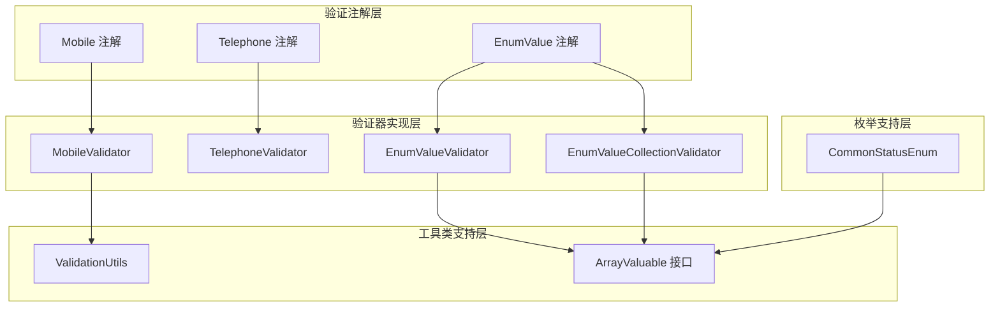
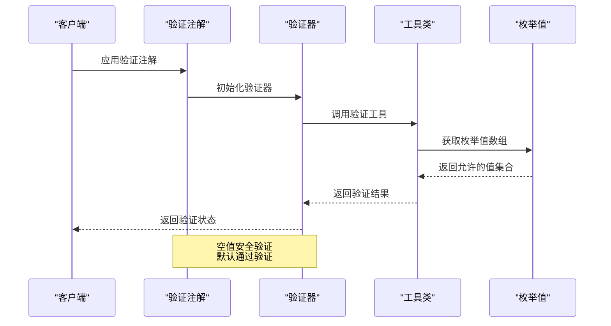
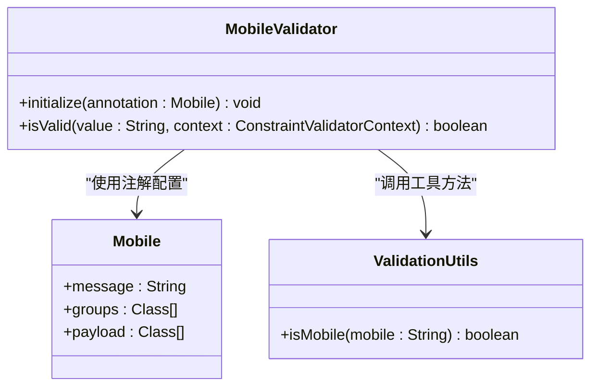
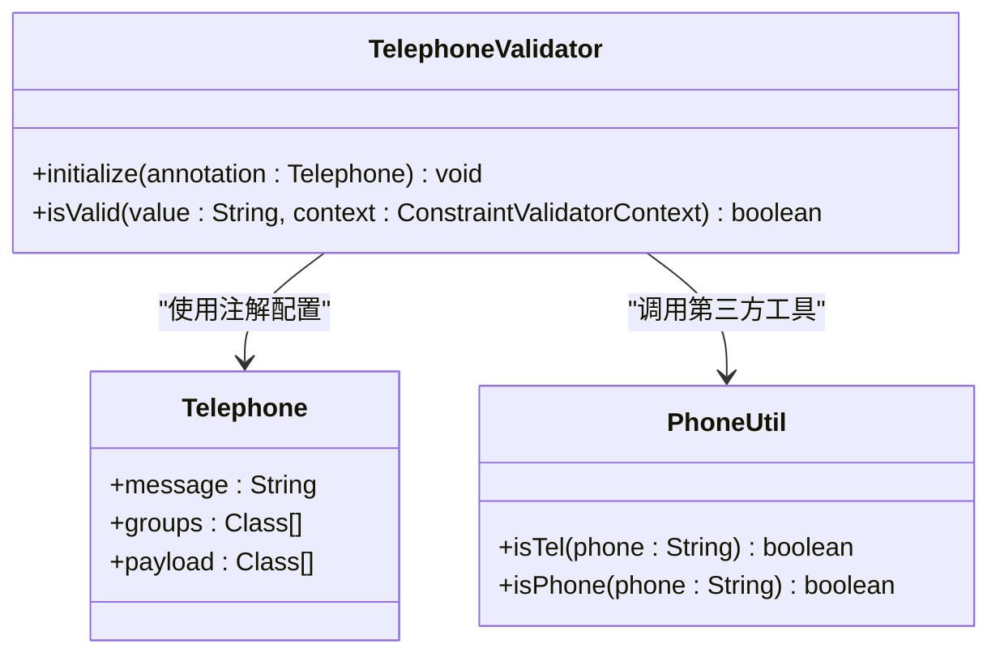
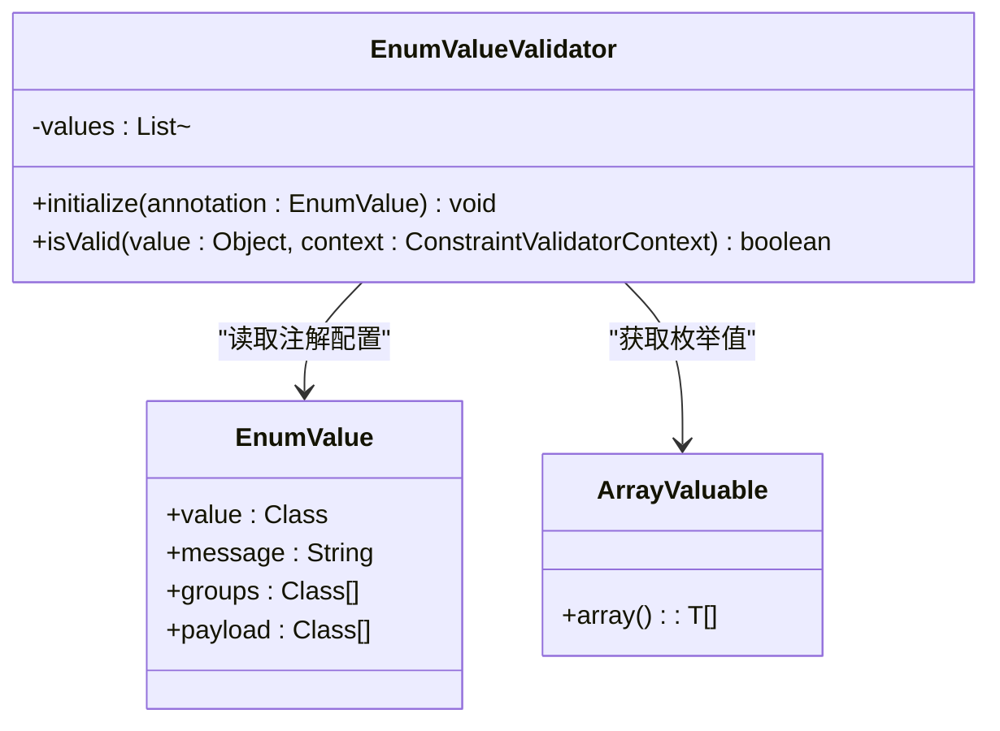
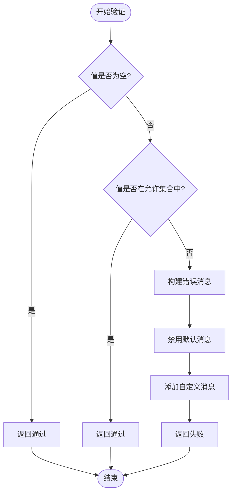
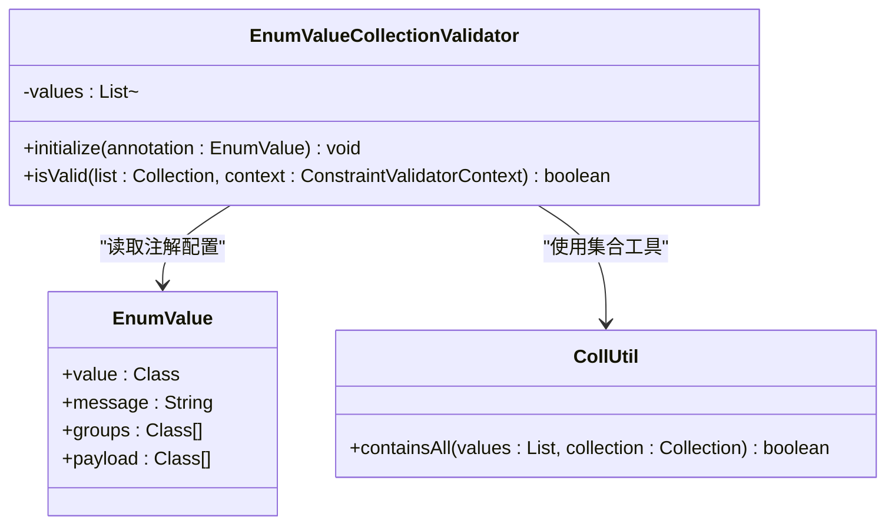
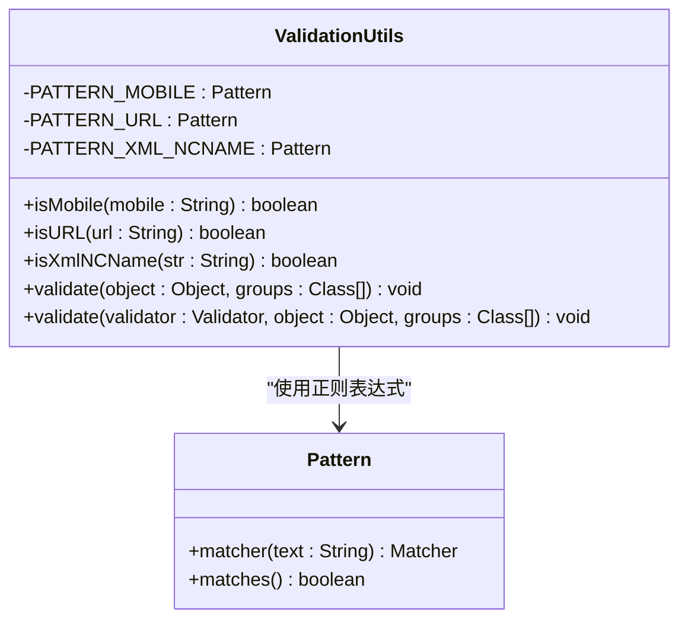
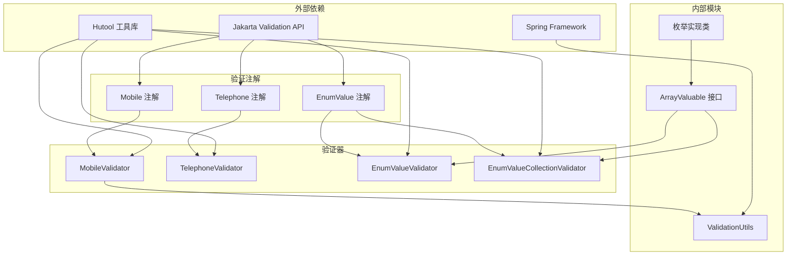

# 校验注解 API

<cite>
**本文档引用的文件**
- [Mobile.java](file://pandora-framework/pandora-common/src/main/java/net/ittimeline/pandora/framework/common/validation/Mobile.java)
- [MobileValidator.java](file://pandora-framework/pandora-common/src/main/java/net/ittimeline/pandora/framework/common/validation/MobileValidator.java)
- [Telephone.java](file://pandora-framework/pandora-common/src/main/java/net/ittimeline/pandora/framework/common/validation/Telephone.java)
- [TelephoneValidator.java](file://pandora-framework/pandora-common/src/main/java/net/ittimeline/pandora/framework/common/validation/TelephoneValidator.java)
- [EnumValue.java](file://pandora-framework/pandora-common/src/main/java/net/ittimeline/pandora/framework/common/validation/EnumValue.java)
- [EnumValueValidator.java](file://pandora-framework/pandora-common/src/main/java/net/ittimeline/pandora/framework/common/validation/EnumValueValidator.java)
- [EnumValueCollectionValidator.java](file://pandora-framework/pandora-common/src/main/java/net/ittimeline/pandora/framework/common/validation/EnumValueCollectionValidator.java)
- [ValidationUtils.java](file://pandora-framework/pandora-common/src/main/java/net/ittimeline/pandora/framework/common/util/web/validation/ValidationUtils.java)
- [ArrayValuable.java](file://pandora-framework/pandora-common/src/main/java/net/ittimeline/pandora/framework/common/core/ArrayValuable.java)
- [CommonStatusEnum.java](file://pandora-framework/pandora-common/src/main/java/net/ittimeline/pandora/framework/common/enums/CommonStatusEnum.java)
</cite>

## 目录
1. [简介](#简介)
2. [项目结构](#项目结构)
3. [核心组件](#核心组件)
4. [架构概览](#架构概览)
5. [详细组件分析](#详细组件分析)
6. [依赖关系分析](#依赖关系分析)
7. [性能考虑](#性能考虑)
8. [故障排除指南](#故障排除指南)
9. [结论](#结论)
10. [附录](#附录)

## 简介

本文件提供了 Pandora Cloud 微服务框架中校验注解系统的完整 API 文档。该系统提供了三种核心验证注解：手机号验证（Mobile）、电话号码验证（Telephone）和枚举值验证（EnumValue）。这些注解基于 Jakarta Validation 规范构建，能够在微服务架构中确保数据输入的有效性和一致性。

系统采用分层设计，包含注解定义层、验证器实现层和工具类支持层。所有验证逻辑都遵循空值安全原则，即当输入为空时默认通过验证，避免对可选字段施加不必要的约束。

## 项目结构

校验注解系统位于 `pandora-framework/pandora-common/src/main/java/net/ittimeline/pandora/framework/common/validation/` 目录下，采用清晰的模块化组织：



**图表来源**
- [Mobile.java:1-35](file://pandora-framework/pandora-common/src/main/java/net/ittimeline/pandora/framework/common/validation/Mobile.java#L1-L35)
- [Telephone.java:1-35](file://pandora-framework/pandora-common/src/main/java/net/ittimeline/pandora/framework/common/validation/Telephone.java#L1-L35)
- [EnumValue.java:1-40](file://pandora-framework/pandora-common/src/main/java/net/ittimeline/pandora/framework/common/validation/EnumValue.java#L1-L40)

**章节来源**
- [Mobile.java:1-35](file://pandora-framework/pandora-common/src/main/java/net/ittimeline/pandora/framework/common/validation/Mobile.java#L1-L35)
- [Telephone.java:1-35](file://pandora-framework/pandora-common/src/main/java/net/ittimeline/pandora/framework/common/validation/Telephone.java#L1-L35)
- [EnumValue.java:1-40](file://pandora-framework/pandora-common/src/main/java/net/ittimeline/pandora/framework/common/validation/EnumValue.java#L1-L40)

## 核心组件

### 手机号验证注解（Mobile）

手机号验证注解提供标准的中国手机号码格式验证功能。该注解支持多种手机号码格式，包括带国家代码的格式。

**主要特性：**
- 支持中国大陆手机号码格式验证
- 支持国际格式（+86）和双零前缀（00）格式
- 符合 11 位数字的手机号码规范
- 默认错误消息："手机号格式不正确"

**配置选项：**
- `message()`: 自定义错误消息，默认为 "手机号格式不正确"
- `groups()`: 分组验证，默认为空数组
- `payload()`: 负载信息，默认为空数组

### 电话号码验证注解（Telephone）

电话号码验证注解提供固定电话和手机号码的综合验证功能。该注解能够识别并验证各种格式的电话号码。

**主要特性：**
- 支持固定电话号码验证
- 支持手机号码验证
- 支持多种分机格式
- 默认错误消息："电话格式不正确"

**配置选项：**
- `message()`: 自定义错误消息，默认为 "电话格式不正确"
- `groups()`: 分组验证，默认为空数组
- `payload()`: 负载信息，默认为空数组

### 枚举值验证注解（EnumValue）

枚举值验证注解提供基于枚举的值域验证功能，支持单值和集合值的验证。该注解要求被验证的值必须存在于指定的枚举范围内。

**主要特性：**
- 支持单值验证和集合验证
- 基于 ArrayValuable 接口的枚举值提取
- 动态错误消息生成，显示允许的值范围
- 默认错误消息："必须在指定范围 {value}"

**配置选项：**
- `value()`: 必需参数，指定实现 ArrayValuable 接口的枚举类
- `message()`: 自定义错误消息，默认为 "必须在指定范围 {value}"
- `groups()`: 分组验证，默认为空数组
- `payload()`: 负载信息，默认为空数组

**章节来源**
- [Mobile.java:27-35](file://pandora-framework/pandora-common/src/main/java/net/ittimeline/pandora/framework/common/validation/Mobile.java#L27-L35)
- [Telephone.java:27-35](file://pandora-framework/pandora-common/src/main/java/net/ittimeline/pandora/framework/common/validation/Telephone.java#L27-L35)
- [EnumValue.java:28-39](file://pandora-framework/pandora-common/src/main/java/net/ittimeline/pandora/framework/common/validation/EnumValue.java#L28-L39)

## 架构概览

校验注解系统采用分层架构设计，确保了良好的可扩展性和维护性：



**图表来源**
- [MobileValidator.java:21-28](file://pandora-framework/pandora-common/src/main/java/net/ittimeline/pandora/framework/common/validation/MobileValidator.java#L21-L28)
- [EnumValueValidator.java:33-47](file://pandora-framework/pandora-common/src/main/java/net/ittimeline/pandora/framework/common/validation/EnumValueValidator.java#L33-L47)

系统的核心设计原则：
1. **空值安全**：所有验证器在输入为空时默认返回通过
2. **类型安全**：通过泛型确保验证器与注解的类型匹配
3. **可扩展性**：基于接口的设计允许自定义验证逻辑
4. **性能优化**：预编译的正则表达式和缓存机制

## 详细组件分析

### MobileValidator 组件分析

MobileValidator 是手机号验证的核心实现，负责处理手机号格式验证逻辑。



**图表来源**
- [MobileValidator.java:14-30](file://pandora-framework/pandora-common/src/main/java/net/ittimeline/pandora/framework/common/validation/MobileValidator.java#L14-L30)
- [Mobile.java:27-35](file://pandora-framework/pandora-common/src/main/java/net/ittimeline/pandora/framework/common/validation/Mobile.java#L27-L35)
- [ValidationUtils.java:28-31](file://pandora-framework/pandora-common/src/main/java/net/ittimeline/pandora/framework/common/util/web/validation/ValidationUtils.java#L28-L31)

**工作流程：**
1. 初始化阶段：读取注解配置
2. 验证阶段：检查输入是否为空
3. 处理阶段：调用 ValidationUtils.isMobile() 进行格式验证
4. 结果阶段：返回验证结果

**验证算法：**
- 支持格式：+8613800000000, 008613800000000, 13800000000
- 正则表达式模式：`^(?:(?:\\+|00)86)?1(?:(?:3[\\d])|(?:4[0,1,4-9])|(?:5[0-3,5-9])|(?:6[2,5-7])|(?:7[0-8])|(?:8[\\d])|(?:9[0-3,5-9]))\\d{8}$`

**章节来源**
- [MobileValidator.java:14-30](file://pandora-framework/pandora-common/src/main/java/net/ittimeline/pandora/framework/common/validation/MobileValidator.java#L14-L30)
- [ValidationUtils.java:22-31](file://pandora-framework/pandora-common/src/main/java/net/ittimeline/pandora/framework/common/util/web/validation/ValidationUtils.java#L22-L31)

### TelephoneValidator 组件分析

TelephoneValidator 提供综合的电话号码验证功能，支持固定电话和手机号码。



**图表来源**
- [TelephoneValidator.java:14-31](file://pandora-framework/pandora-common/src/main/java/net/ittimeline/pandora/framework/common/validation/TelephoneValidator.java#L14-L31)
- [Telephone.java:27-35](file://pandora-framework/pandora-common/src/main/java/net/ittimeline/pandora/framework/common/validation/Telephone.java#L27-L35)

**验证策略：**
1. 空值检查：如果输入为空，直接返回 true
2. 固定电话验证：使用 PhoneUtil.isTel() 检查固定电话格式
3. 手机号码验证：使用 PhoneUtil.isPhone() 检查手机号格式
4. 组合验证：只要满足任一条件即视为通过

**章节来源**
- [TelephoneValidator.java:14-31](file://pandora-framework/pandora-common/src/main/java/net/ittimeline/pandora/framework/common/validation/TelephoneValidator.java#L14-L31)

### EnumValueValidator 组件分析

EnumValueValidator 处理单值枚举验证，确保单个值存在于指定的枚举范围内。



**图表来源**
- [EnumValueValidator.java:18-49](file://pandora-framework/pandora-common/src/main/java/net/ittimeline/pandora/framework/common/validation/EnumValueValidator.java#L18-L49)
- [EnumValue.java:28-39](file://pandora-framework/pandora-common/src/main/java/net/ittimeline/pandora/framework/common/validation/EnumValue.java#L28-L39)
- [ArrayValuable.java:10-15](file://pandora-framework/pandora-common/src/main/java/net/ittimeline/pandora/framework/common/core/ArrayValuable.java#L10-L15)

**初始化流程：**
1. 读取注解中的 ArrayValuable 实现类
2. 获取枚举常量数组
3. 提取数组值并转换为 List
4. 缓存允许的值集合

**验证流程：**


**图表来源**
- [EnumValueValidator.java:33-47](file://pandora-framework/pandora-common/src/main/java/net/ittimeline/pandora/framework/common/validation/EnumValueValidator.java#L33-L47)

**章节来源**
- [EnumValueValidator.java:18-49](file://pandora-framework/pandora-common/src/main/java/net/ittimeline/pandora/framework/common/validation/EnumValueValidator.java#L18-L49)

### EnumValueCollectionValidator 组件分析

EnumValueCollectionValidator 处理集合类型的枚举验证，确保集合中的所有元素都存在于指定的枚举范围内。



**图表来源**
- [EnumValueCollectionValidator.java:19-50](file://pandora-framework/pandora-common/src/main/java/net/ittimeline/pandora/framework/common/validation/EnumValueCollectionValidator.java#L19-L50)
- [EnumValue.java:28-39](file://pandora-framework/pandora-common/src/main/java/net/ittimeline/pandora/framework/common/validation/EnumValue.java#L28-L39)

**验证策略：**
1. 空值检查：如果集合为空，直接返回 true
2. 集合验证：使用 CollUtil.containsAll() 检查集合完整性
3. 错误处理：构建包含具体缺失值的错误消息

**章节来源**
- [EnumValueCollectionValidator.java:19-50](file://pandora-framework/pandora-common/src/main/java/net/ittimeline/pandora/framework/common/validation/EnumValueCollectionValidator.java#L19-L50)

### ValidationUtils 工具类分析

ValidationUtils 提供了底层的验证工具方法和统一的验证执行机制。



**图表来源**
- [ValidationUtils.java:21-56](file://pandora-framework/pandora-common/src/main/java/net/ittimeline/pandora/framework/common/util/web/validation/ValidationUtils.java#L21-L56)

**核心功能：**
1. **手机号验证**：使用预编译的正则表达式进行格式验证
2. **URL 验证**：支持 http、https、ftp、file 协议
3. **XML NCName 验证**：符合 XML 规范的名称格式
4. **统一验证**：提供便捷的验证执行方法

**章节来源**
- [ValidationUtils.java:21-56](file://pandora-framework/pandora-common/src/main/java/net/ittimeline/pandora/framework/common/util/web/validation/ValidationUtils.java#L21-L56)

## 依赖关系分析

校验注解系统具有清晰的依赖层次结构，确保了模块间的松耦合：



**图表来源**
- [MobileValidator.java:3-6](file://pandora-framework/pandora-common/src/main/java/net/ittimeline/pandora/framework/common/validation/MobileValidator.java#L3-L6)
- [TelephoneValidator.java:3-6](file://pandora-framework/pandora-common/src/main/java/net/ittimeline/pandora/framework/common/validation/TelephoneValidator.java#L3-L6)
- [EnumValueValidator.java](file://pandora-framework/pandora-common/src/main/java/net/ittimeline/pandora/framework/common/validation/EnumValueValidator.java#L5)

**依赖特点：**
1. **最小依赖**：仅依赖必要的外部库
2. **版本兼容**：支持 Jakarta Validation 2.x 和 Spring Framework
3. **工具库集成**：充分利用 Hutool 提供的实用工具
4. **接口抽象**：通过 ArrayValuable 接口实现松耦合

**章节来源**
- [ArrayValuable.java:1-15](file://pandora-framework/pandora-common/src/main/java/net/ittimeline/pandora/framework/common/core/ArrayValuable.java#L1-L15)
- [CommonStatusEnum.java:1-47](file://pandora-framework/pandora-common/src/main/java/net/ittimeline/pandora/framework/common/enums/CommonStatusEnum.java#L1-L47)

## 性能考虑

校验注解系统在设计时充分考虑了性能优化：

### 正则表达式优化
- 所有正则表达式在类加载时预编译，避免运行时重复编译
- 使用原子组和精确匹配减少回溯开销
- 针对手机号码格式进行了专门优化

### 缓存机制
- 枚举值在验证器初始化时缓存到内存中
- 避免每次验证时重复访问枚举常量
- 使用 List 结构提供 O(1) 平均查找时间

### 内存管理
- 空集合使用不可变集合避免额外内存分配
- 验证器实例在应用启动时创建并复用
- 减少垃圾回收压力

### 异步处理
- 验证操作通常在请求处理线程中同步执行
- 对于大量数据的验证建议使用异步处理策略

## 故障排除指南

### 常见问题及解决方案

**问题 1：验证注解不生效**
- 检查是否在实体类字段上正确应用注解
- 确认实体类是否启用了 Bean Validation
- 验证注解的 groups 参数是否正确配置

**问题 2：枚举验证失败**
- 确认枚举类实现了 ArrayValuable 接口
- 检查枚举的 array() 方法是否正确返回值数组
- 验证传入的值类型与枚举值类型是否匹配

**问题 3：手机号验证异常**
- 检查手机号格式是否符合要求
- 确认是否包含了国家代码前缀
- 验证手机号长度是否为 11 位

**问题 4：自定义错误消息不显示**
- 检查 message 参数是否正确设置
- 确认验证器是否正确构建了错误消息
- 验证 Spring MVC 是否正确处理了验证异常

### 调试技巧

1. **启用详细日志**：配置日志级别为 DEBUG 查看验证过程
2. **单元测试**：为每个验证器编写单元测试覆盖边界情况
3. **断点调试**：在验证器的 isValid 方法中设置断点
4. **性能监控**：监控验证操作的执行时间和内存使用

**章节来源**
- [EnumValueValidator.java:43-46](file://pandora-framework/pandora-common/src/main/java/net/ittimeline/pandora/framework/common/validation/EnumValueValidator.java#L43-L46)
- [EnumValueCollectionValidator.java:43-46](file://pandora-framework/pandora-common/src/main/java/net/ittimeline/pandora/framework/common/validation/EnumValueCollectionValidator.java#L43-L46)

## 结论

Pandora Cloud 的校验注解系统提供了一套完整、高效且易于使用的数据验证解决方案。系统具有以下优势：

1. **功能完整**：涵盖手机号、电话号码和枚举值验证三大核心场景
2. **设计优雅**：基于注解驱动的验证模式，代码简洁易懂
3. **性能优秀**：通过预编译和缓存机制优化验证性能
4. **扩展性强**：基于接口的设计允许轻松扩展新的验证规则
5. **微服务友好**：适用于分布式微服务架构的数据验证需求

该系统为微服务开发提供了坚实的数据质量保障，能够有效提升系统的可靠性和用户体验。

## 附录

### 使用示例

#### 实体类使用示例

```java
// 基础实体类示例
public class User {
    @Mobile
    private String mobile;
    
    @Telephone
    private String telephone;
    
    @EnumValue(value = CommonStatusEnum.class)
    private Integer status;
    
    // getter 和 setter 方法
}
```

#### 控制器使用示例

```java
@RestController
public class UserController {
    
    @PostMapping("/users")
    public ResponseEntity createUser(@Valid @RequestBody User user) {
        // 处理用户创建逻辑
        return ResponseEntity.ok().build();
    }
}
```

#### 自定义枚举实现

```java
public enum OrderStatusEnum implements ArrayValuable<String> {
    CREATED("created", "已创建"),
    PAID("paid", "已支付"),
    SHIPPED("shipped", "已发货"),
    COMPLETED("completed", "已完成");
    
    private final String code;
    private final String name;
    
    @Override
    public String[] array() {
        return Arrays.stream(values())
                   .map(OrderStatusEnum::getCode)
                   .toArray(String[]::new);
    }
}
```

### 最佳实践

1. **合理使用空值**：对于可选字段，保持默认的空值安全行为
2. **选择合适的注解**：根据业务需求选择最合适的验证注解
3. **自定义错误消息**：为关键字段提供清晰的错误提示
4. **分组验证**：使用 groups 参数实现不同场景下的差异化验证
5. **性能优化**：避免在循环中重复创建验证器实例

### 扩展指南

要实现自定义验证规则，需要：

1. 创建自定义注解类，继承 Constraint 注解
2. 实现 ConstraintValidator 接口
3. 在注解中指定验证器类
4. 在需要的地方应用自定义注解