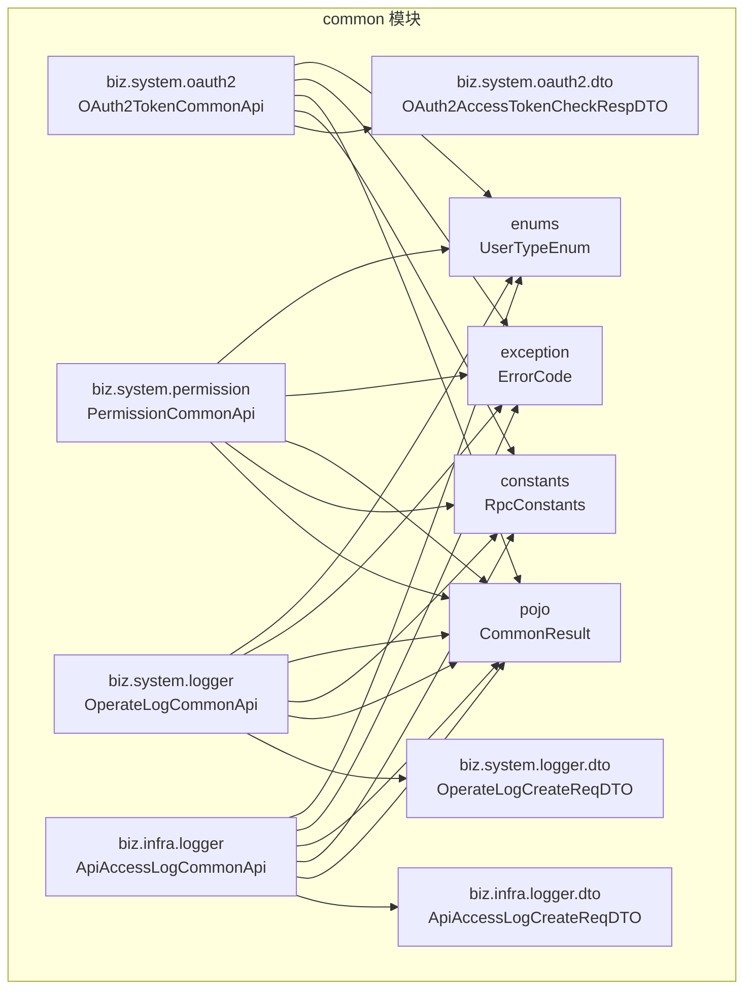
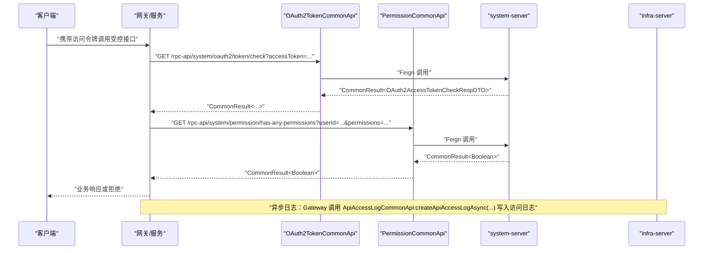
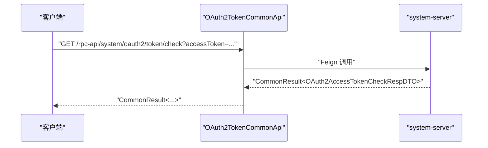
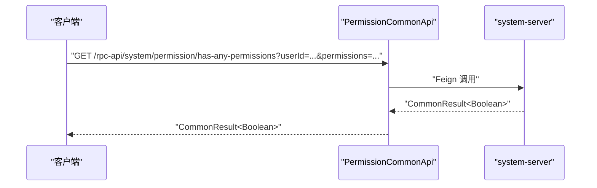
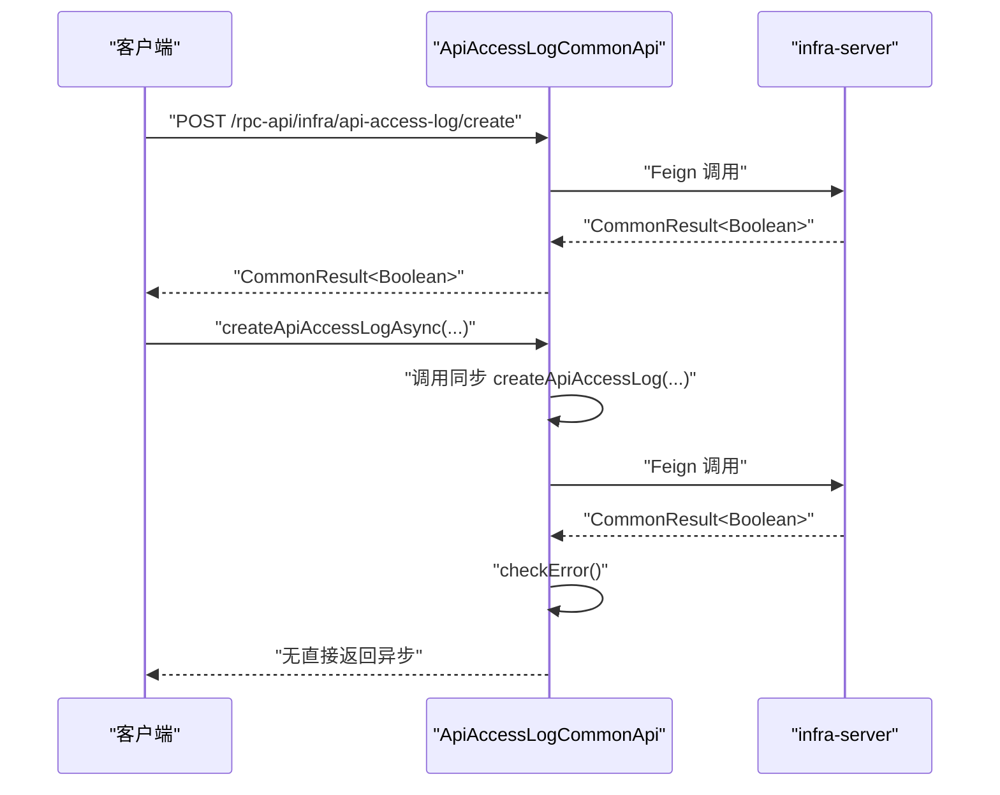
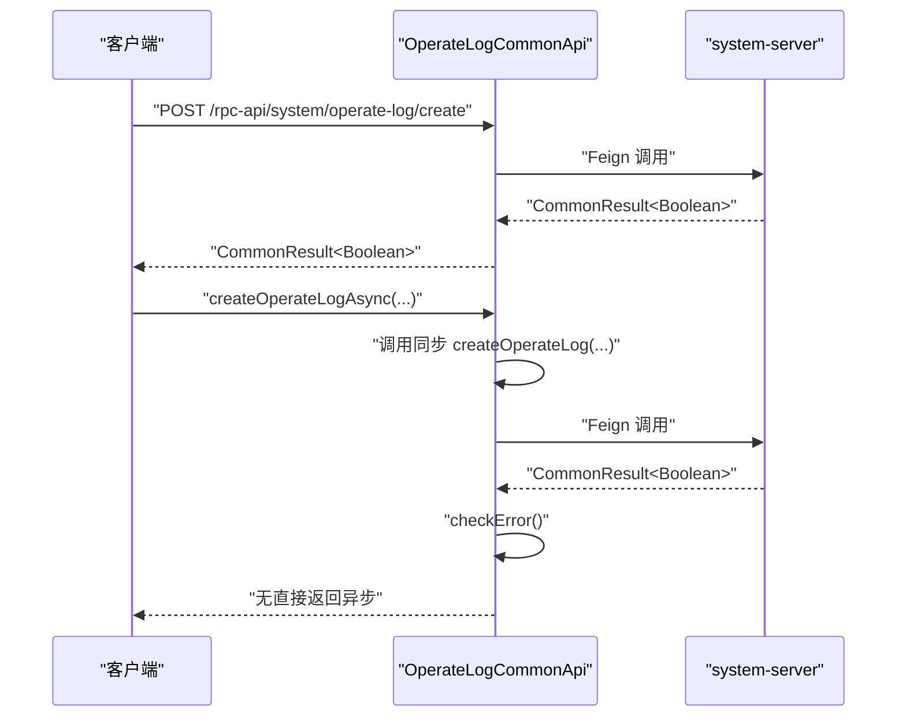
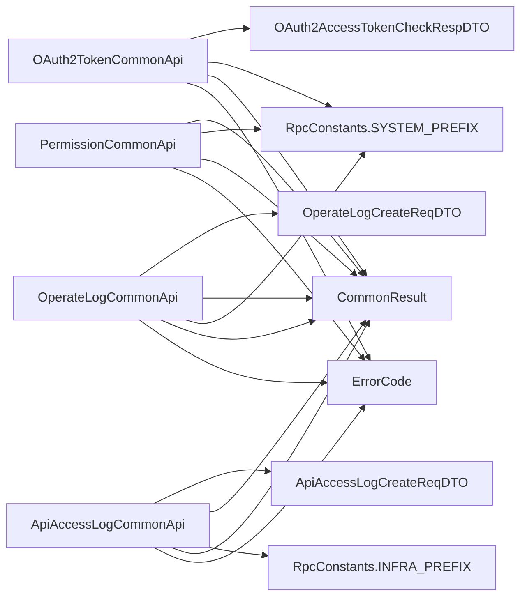

# API参考

<cite>
**本文引用的文件**
- [ApiAccessLogCommonApi.java](file://pandora-framework/pandora-common/src/main/java/net/ittimeline/pandora/framework/common/biz/infra/logger/ApiAccessLogCommonApi.java)
- [OperateLogCommonApi.java](file://pandora-framework/pandora-common/src/main/java/net/ittimeline/pandora/framework/common/biz/system/logger/OperateLogCommonApi.java)
- [OAuth2TokenCommonApi.java](file://pandora-framework/pandora-common/src/main/java/net/ittimeline/pandora/framework/common/biz/system/oauth2/OAuth2TokenCommonApi.java)
- [PermissionCommonApi.java](file://pandora-framework/pandora-common/src/main/java/net/ittimeline/pandora/framework/common/biz/system/permission/PermissionCommonApi.java)
- [ApiAccessLogCreateReqDTO.java](file://pandora-framework/pandora-common/src/main/java/net/ittimeline/pandora/framework/common/biz/infra/logger/dto/ApiAccessLogCreateReqDTO.java)
- [ApiErrorLogCreateReqDTO.java](file://pandora-framework/pandora-common/src/main/java/net/ittimeline/pandora/framework/common/biz/infra/logger/dto/ApiErrorLogCreateReqDTO.java)
- [OperateLogCreateReqDTO.java](file://pandora-framework/pandora-common/src/main/java/net/ittimeline/pandora/framework/common/biz/system/logger/dto/OperateLogCreateReqDTO.java)
- [OAuth2AccessTokenCheckRespDTO.java](file://pandora-framework/pandora-common/src/main/java/net/ittimeline/pandora/framework/common/biz/system/oauth2/dto/OAuth2AccessTokenCheckRespDTO.java)
- [RpcConstants.java](file://pandora-framework/pandora-common/src/main/java/net/ittimeline/pandora/framework/common/constants/RpcConstants.java)
- [WebFilterOrderConstants.java](file://pandora-framework/pandora-common/src/main/java/net/ittimeline/pandora/framework/common/constants/WebFilterOrderConstants.java)
- [CommonResult.java](file://pandora-framework/pandora-common/src/main/java/net/ittimeline/pandora/framework/common/pojo/CommonResult.java)
- [ErrorCode.java](file://pandora-framework/pandora-common/src/main/java/net/ittimeline/pandora/framework/common/exception/ErrorCode.java)
- [UserTypeEnum.java](file://pandora-framework/pandora-common/src/main/java/net/ittimeline/pandora/framework/common/enums/UserTypeEnum.java)
</cite>

## 目录
1. [简介](#简介)
2. [项目结构](#项目结构)
3. [核心组件](#核心组件)
4. [架构总览](#架构总览)
5. [详细组件分析](#详细组件分析)
6. [依赖分析](#依赖分析)
7. [性能考量](#性能考量)
8. [故障排查指南](#故障排查指南)
9. [结论](#结论)
10. [附录](#附录)

## 简介
本文件为 Pandora Cloud 框架的 API 参考文档，聚焦于系统与基础设施相关的公共 RPC 接口，覆盖以下核心接口：
- OAuth2TokenCommonApi：OAuth2 访问令牌校验
- PermissionCommonApi：权限与角色判断
- ApiAccessLogCommonApi：API 访问日志创建（同步与异步）
- OperateLogCommonApi：系统操作日志创建（同步与异步）

同时，文档对请求/响应模型、HTTP 方法与路径、认证方式、错误处理、安全与性能要点进行系统说明，并提供常见用例与客户端实现建议。

## 项目结构
本参考涉及的接口与数据模型主要位于 pandora-common 模块中，采用按领域分层的组织方式：
- biz.system.*：系统域接口与 DTO（权限、OAuth2、操作日志）
- biz.infra.*：基础设施域接口与 DTO（访问日志、错误日志）
- constants：RPC 服务命名与前缀常量
- pojo：统一返回体
- exception：错误码模型
- enums：全局枚举（如用户类型）

图表来源
- [OAuth2TokenCommonApi.java:1-34](file://pandora-framework/pandora-common/src/main/java/net/ittimeline/pandora/framework/common/biz/system/oauth2/OAuth2TokenCommonApi.java#L1-L34)
- [PermissionCommonApi.java:1-46](file://pandora-framework/pandora-common/src/main/java/net/ittimeline/pandora/framework/common/biz/system/permission/PermissionCommonApi.java#L1-L46)
- [OperateLogCommonApi.java:1-41](file://pandora-framework/pandora-common/src/main/java/net/ittimeline/pandora/framework/common/biz/system/logger/OperateLogCommonApi.java#L1-L41)
- [ApiAccessLogCommonApi.java:1-40](file://pandora-framework/pandora-common/src/main/java/net/ittimeline/pandora/framework/common/biz/infra/logger/ApiAccessLogCommonApi.java#L1-L40)
- [ApiAccessLogCreateReqDTO.java:1-106](file://pandora-framework/pandora-common/src/main/java/net/ittimeline/pandora/framework/common/biz/infra/logger/dto/ApiAccessLogCreateReqDTO.java#L1-L106)
- [OperateLogCreateReqDTO.java:1-58](file://pandora-framework/pandora-common/src/main/java/net/ittimeline/pandora/framework/common/biz/system/logger/dto/OperateLogCreateReqDTO.java#L1-L58)
- [OAuth2AccessTokenCheckRespDTO.java:1-40](file://pandora-framework/pandora-common/src/main/java/net/ittimeline/pandora/framework/common/biz/system/oauth2/dto/OAuth2AccessTokenCheckRespDTO.java#L1-L40)
- [RpcConstants.java:1-42](file://pandora-framework/pandora-common/src/main/java/net/ittimeline/pandora/framework/common/constants/RpcConstants.java#L1-L42)
- [CommonResult.java:1-123](file://pandora-framework/pandora-common/src/main/java/net/ittimeline/pandora/framework/common/pojo/CommonResult.java#L1-L123)
- [ErrorCode.java:1-33](file://pandora-framework/pandora-common/src/main/java/net/ittimeline/pandora/framework/common/exception/ErrorCode.java#L1-L33)
- [UserTypeEnum.java:1-48](file://pandora-framework/pandora-common/src/main/java/net/ittimeline/pandora/framework/common/enums/UserTypeEnum.java#L1-L48)

章节来源
- [RpcConstants.java:1-42](file://pandora-framework/pandora-common/src/main/java/net/ittimeline/pandora/framework/common/constants/RpcConstants.java#L1-L42)

## 核心组件
本节概述各接口职责、统一返回体与关键数据模型。

- 统一返回体 CommonResult
  - 字段：code（整数）、msg（字符串）、data（泛型）
  - 行为：success/error 工厂方法；isSuccess/isError 判定；checkError 抛出业务异常；getCheckedData 获取数据并校验
- 错误码 ErrorCode
  - 字段：code（整数）、msg（字符串）
  - 用途：封装业务错误码与消息
- 用户类型 UserTypeEnum
  - 枚举：MEMBER（C端普通用户）、ADMIN（B端管理后台）
- RPC 命名与前缀 RpcConstants
  - SYSTEM_NAME/INFRA_NAME：服务名
  - SYSTEM_PREFIX/INFRA_PREFIX：RPC 前缀
- Web 过滤器顺序 WebFilterOrderConstants
  - 定义了跨域、追踪、加密、日志、XSS、安全等过滤器的顺序常量，确保链路处理顺序

章节来源
- [CommonResult.java:1-123](file://pandora-framework/pandora-common/src/main/java/net/ittimeline/pandora/framework/common/pojo/CommonResult.java#L1-L123)
- [ErrorCode.java:1-33](file://pandora-framework/pandora-common/src/main/java/net/ittimeline/pandora/framework/common/exception/ErrorCode.java#L1-L33)
- [UserTypeEnum.java:1-48](file://pandora-framework/pandora-common/src/main/java/net/ittimeline/pandora/framework/common/enums/UserTypeEnum.java#L1-L48)
- [RpcConstants.java:1-42](file://pandora-framework/pandora-common/src/main/java/net/ittimeline/pandora/framework/common/constants/RpcConstants.java#L1-L42)
- [WebFilterOrderConstants.java:1-38](file://pandora-framework/pandora-common/src/main/java/net/ittimeline/pandora/framework/common/constants/WebFilterOrderConstants.java#L1-L38)

## 架构总览
以下序列图展示 OAuth2 令牌校验与权限判断的典型调用流程，以及日志接口的异步写入模式。

图表来源
- [OAuth2TokenCommonApi.java:1-34](file://pandora-framework/pandora-common/src/main/java/net/ittimeline/pandora/framework/common/biz/system/oauth2/OAuth2TokenCommonApi.java#L1-L34)
- [PermissionCommonApi.java:1-46](file://pandora-framework/pandora-common/src/main/java/net/ittimeline/pandora/framework/common/biz/system/permission/PermissionCommonApi.java#L1-L46)
- [ApiAccessLogCommonApi.java:1-40](file://pandora-framework/pandora-common/src/main/java/net/ittimeline/pandora/framework/common/biz/infra/logger/ApiAccessLogCommonApi.java#L1-L40)
- [RpcConstants.java:1-42](file://pandora-framework/pandora-common/src/main/java/net/ittimeline/pandora/framework/common/constants/RpcConstants.java#L1-L42)

## 详细组件分析

### OAuth2TokenCommonApi
- 作用：校验访问令牌有效性，返回用户标识、租户、授权范围与过期时间等信息
- HTTP 方法与路径
  - GET /rpc-api/system/oauth2/token/check
- 参数
  - accessToken（查询参数，必填）
- 返回
  - CommonResult<OAuth2AccessTokenCheckRespDTO>
- 响应模型 OAuth2AccessTokenCheckRespDTO
  - userId、userType、userInfo、tenantId、scopes、expiresTime

图表来源
- [OAuth2TokenCommonApi.java:1-34](file://pandora-framework/pandora-common/src/main/java/net/ittimeline/pandora/framework/common/biz/system/oauth2/OAuth2TokenCommonApi.java#L1-L34)
- [OAuth2AccessTokenCheckRespDTO.java:1-40](file://pandora-framework/pandora-common/src/main/java/net/ittimeline/pandora/framework/common/biz/system/oauth2/dto/OAuth2AccessTokenCheckRespDTO.java#L1-L40)
- [RpcConstants.java:1-42](file://pandora-framework/pandora-common/src/main/java/net/ittimeline/pandora/framework/common/constants/RpcConstants.java#L1-L42)

章节来源
- [OAuth2TokenCommonApi.java:1-34](file://pandora-framework/pandora-common/src/main/java/net/ittimeline/pandora/framework/common/biz/system/oauth2/OAuth2TokenCommonApi.java#L1-L34)
- [OAuth2AccessTokenCheckRespDTO.java:1-40](file://pandora-framework/pandora-common/src/main/java/net/ittimeline/pandora/framework/common/biz/system/oauth2/dto/OAuth2AccessTokenCheckRespDTO.java#L1-L40)

### PermissionCommonApi
- 作用：判断用户是否具备任一指定权限或角色
- HTTP 方法与路径
  - GET /rpc-api/system/permission/has-any-permissions
  - GET /rpc-api/system/permission/has-any-roles
- 参数
  - has-any-permissions：userId（查询参数，必填）、permissions（字符串数组，必填）
  - has-any-roles：userId（查询参数，必填）、roles（字符串数组，必填）
- 返回
  - CommonResult<Boolean>

图表来源
- [PermissionCommonApi.java:1-46](file://pandora-framework/pandora-common/src/main/java/net/ittimeline/pandora/framework/common/biz/system/permission/PermissionCommonApi.java#L1-L46)
- [RpcConstants.java:1-42](file://pandora-framework/pandora-common/src/main/java/net/ittimeline/pandora/framework/common/constants/RpcConstants.java#L1-L42)

章节来源
- [PermissionCommonApi.java:1-46](file://pandora-framework/pandora-common/src/main/java/net/ittimeline/pandora/framework/common/biz/system/permission/PermissionCommonApi.java#L1-L46)

### ApiAccessLogCommonApi
- 作用：创建 API 访问日志；提供同步与异步两种调用方式
- HTTP 方法与路径
  - POST /rpc-api/infra/api-access-log/create
- 请求体
  - ApiAccessLogCreateReqDTO
- 返回
  - CommonResult<Boolean>
- 异步方法
  - createApiAccessLogAsync(ApiAccessLogCreateReqDTO)：内部调用同步接口并通过 checkError 抛错

图表来源
- [ApiAccessLogCommonApi.java:1-40](file://pandora-framework/pandora-common/src/main/java/net/ittimeline/pandora/framework/common/biz/infra/logger/ApiAccessLogCommonApi.java#L1-L40)
- [ApiAccessLogCreateReqDTO.java:1-106](file://pandora-framework/pandora-common/src/main/java/net/ittimeline/pandora/framework/common/biz/infra/logger/dto/ApiAccessLogCreateReqDTO.java#L1-L106)
- [RpcConstants.java:1-42](file://pandora-framework/pandora-common/src/main/java/net/ittimeline/pandora/framework/common/constants/RpcConstants.java#L1-L42)

章节来源
- [ApiAccessLogCommonApi.java:1-40](file://pandora-framework/pandora-common/src/main/java/net/ittimeline/pandora/framework/common/biz/infra/logger/ApiAccessLogCommonApi.java#L1-L40)
- [ApiAccessLogCreateReqDTO.java:1-106](file://pandora-framework/pandora-common/src/main/java/net/ittimeline/pandora/framework/common/biz/infra/logger/dto/ApiAccessLogCreateReqDTO.java#L1-L106)

### OperateLogCommonApi
- 作用：创建系统操作日志；提供同步与异步两种调用方式
- HTTP 方法与路径
  - POST /rpc-api/system/operate-log/create
- 请求体
  - OperateLogCreateReqDTO
- 返回
  - CommonResult<Boolean>
- 异步方法
  - createOperateLogAsync(OperateLogCreateReqDTO)：内部调用同步接口并通过 checkError 抛错

图表来源
- [OperateLogCommonApi.java:1-41](file://pandora-framework/pandora-common/src/main/java/net/ittimeline/pandora/framework/common/biz/system/logger/OperateLogCommonApi.java#L1-L41)
- [OperateLogCreateReqDTO.java:1-58](file://pandora-framework/pandora-common/src/main/java/net/ittimeline/pandora/framework/common/biz/system/logger/dto/OperateLogCreateReqDTO.java#L1-L58)
- [RpcConstants.java:1-42](file://pandora-framework/pandora-common/src/main/java/net/ittimeline/pandora/framework/common/constants/RpcConstants.java#L1-L42)

章节来源
- [OperateLogCommonApi.java:1-41](file://pandora-framework/pandora-common/src/main/java/net/ittimeline/pandora/framework/common/biz/system/logger/OperateLogCommonApi.java#L1-L41)
- [OperateLogCreateReqDTO.java:1-58](file://pandora-framework/pandora-common/src/main/java/net/ittimeline/pandora/framework/common/biz/system/logger/dto/OperateLogCreateReqDTO.java#L1-L58)

### 请求/响应模型与字段说明

- OAuth2AccessTokenCheckRespDTO
  - userId：用户编号
  - userType：用户类型（参见 UserTypeEnum）
  - userInfo：用户扩展信息（Map）
  - tenantId：租户编号
  - scopes：授权范围列表
  - expiresTime：过期时间

- ApiAccessLogCreateReqDTO
  - traceId：链路追踪编号
  - userId：用户编号
  - userType：用户类型
  - applicationName：应用名
  - requestMethod：请求方法
  - requestUrl：访问地址
  - requestParams：请求参数
  - responseBody：响应结果
  - userIp：用户IP
  - userAgent：浏览器UA
  - operateModule/operateName/operateType：操作模块/名称/类型
  - beginTime/endTime/duration：请求起止时间与耗时（毫秒）
  - resultCode/resultMsg：结果码与提示

- OperateLogCreateReqDTO
  - traceId：链路追踪编号
  - userId/userType：用户编号与类型
  - type/subType：操作模块类型与子类型
  - bizId：业务编号
  - action：操作内容
  - extra：扩展字段
  - requestMethod/requestUrl/userIp/userAgent：请求相关信息

- ApiErrorLogCreateReqDTO（用于错误日志，便于定位问题）
  - applicationName、requestMethod、requestUrl、requestParams、userIp、userAgent
  - exception*：异常时间、类名、方法名、行号、栈轨迹、根因等

章节来源
- [OAuth2AccessTokenCheckRespDTO.java:1-40](file://pandora-framework/pandora-common/src/main/java/net/ittimeline/pandora/framework/common/biz/system/oauth2/dto/OAuth2AccessTokenCheckRespDTO.java#L1-L40)
- [ApiAccessLogCreateReqDTO.java:1-106](file://pandora-framework/pandora-common/src/main/java/net/ittimeline/pandora/framework/common/biz/infra/logger/dto/ApiAccessLogCreateReqDTO.java#L1-L106)
- [OperateLogCreateReqDTO.java:1-58](file://pandora-framework/pandora-common/src/main/java/net/ittimeline/pandora/framework/common/biz/system/logger/dto/OperateLogCreateReqDTO.java#L1-L58)
- [ApiErrorLogCreateReqDTO.java:1-74](file://pandora-framework/pandora-common/src/main/java/net/ittimeline/pandora/framework/common/biz/infra/logger/dto/ApiErrorLogCreateReqDTO.java#L1-L74)
- [UserTypeEnum.java:1-48](file://pandora-framework/pandora-common/src/main/java/net/ittimeline/pandora/framework/common/enums/UserTypeEnum.java#L1-L48)

## 依赖分析
- 服务命名与前缀
  - system-server：系统服务（权限、操作日志、OAuth2）
  - infra-server：基础设施服务（访问日志）
- Feign 客户端注解
  - @FeignClient(name = ...) 指定目标服务名
  - @PostMapping/@GetMapping 指定 HTTP 方法与路径
- 统一返回体与异常
  - 所有接口返回 CommonResult<T>，通过 checkError 抛出 ServiceException
  - 错误码由 ErrorCode 封装，遵循全局与业务错误码区间

图表来源
- [OAuth2TokenCommonApi.java:1-34](file://pandora-framework/pandora-common/src/main/java/net/ittimeline/pandora/framework/common/biz/system/oauth2/OAuth2TokenCommonApi.java#L1-L34)
- [PermissionCommonApi.java:1-46](file://pandora-framework/pandora-common/src/main/java/net/ittimeline/pandora/framework/common/biz/system/permission/PermissionCommonApi.java#L1-L46)
- [ApiAccessLogCommonApi.java:1-40](file://pandora-framework/pandora-common/src/main/java/net/ittimeline/pandora/framework/common/biz/infra/logger/ApiAccessLogCommonApi.java#L1-L40)
- [OperateLogCommonApi.java:1-41](file://pandora-framework/pandora-common/src/main/java/net/ittimeline/pandora/framework/common/biz/system/logger/OperateLogCommonApi.java#L1-L41)
- [RpcConstants.java:1-42](file://pandora-framework/pandora-common/src/main/java/net/ittimeline/pandora/framework/common/constants/RpcConstants.java#L1-L42)
- [CommonResult.java:1-123](file://pandora-framework/pandora-common/src/main/java/net/ittimeline/pandora/framework/common/pojo/CommonResult.java#L1-L123)
- [ErrorCode.java:1-33](file://pandora-framework/pandora-common/src/main/java/net/ittimeline/pandora/framework/common/exception/ErrorCode.java#L1-L33)

章节来源
- [RpcConstants.java:1-42](file://pandora-framework/pandora-common/src/main/java/net/ittimeline/pandora/framework/common/constants/RpcConstants.java#L1-L42)
- [CommonResult.java:1-123](file://pandora-framework/pandora-common/src/main/java/net/ittimeline/pandora/framework/common/pojo/CommonResult.java#L1-L123)
- [ErrorCode.java:1-33](file://pandora-framework/pandora-common/src/main/java/net/ittimeline/pandora/framework/common/exception/ErrorCode.java#L1-L33)

## 性能考量
- 异步日志
  - ApiAccessLogCommonApi 与 OperateLogCommonApi 提供异步方法，避免阻塞主业务线程
- 统一返回体
  - CommonResult 的工厂方法与判定方法减少分支判断开销
- 过滤器顺序
  - WebFilterOrderConstants 明确过滤器顺序，有助于减少重复处理与提升链路稳定性

章节来源
- [ApiAccessLogCommonApi.java:1-40](file://pandora-framework/pandora-common/src/main/java/net/ittimeline/pandora/framework/common/biz/infra/logger/ApiAccessLogCommonApi.java#L1-L40)
- [OperateLogCommonApi.java:1-41](file://pandora-framework/pandora-common/src/main/java/net/ittimeline/pandora/framework/common/biz/system/logger/OperateLogCommonApi.java#L1-L41)
- [WebFilterOrderConstants.java:1-38](file://pandora-framework/pandora-common/src/main/java/net/ittimeline/pandora/framework/common/constants/WebFilterOrderConstants.java#L1-L38)

## 故障排查指南
- 错误处理策略
  - 使用 CommonResult.checkError 抛出 ServiceException，便于上层统一捕获
  - 使用 CommonResult.isSuccess/isError 快速判断成功/失败
- 常见问题定位
  - OAuth2 校验失败：检查 accessToken 是否有效、scopes 是否包含所需权限
  - 权限判断失败：确认 permissions/roles 传参是否正确
  - 日志未落库：检查异步方法是否被正确调用；关注 checkError 抛错
- 安全与合规
  - 请求参数与响应体中的敏感信息可通过框架提供的脱敏能力处理（在 web starter 中提供）
  - XSS 过滤与请求缓存过滤器顺序已在 WebFilterOrderConstants 中明确

章节来源
- [CommonResult.java:1-123](file://pandora-framework/pandora-common/src/main/java/net/ittimeline/pandora/framework/common/pojo/CommonResult.java#L1-L123)
- [ErrorCode.java:1-33](file://pandora-framework/pandora-common/src/main/java/net/ittimeline/pandora/framework/common/exception/ErrorCode.java#L1-L33)
- [WebFilterOrderConstants.java:1-38](file://pandora-framework/pandora-common/src/main/java/net/ittimeline/pandora/framework/common/constants/WebFilterOrderConstants.java#L1-L38)

## 结论
本文档梳理了 Pandora Cloud 框架中与系统与基础设施相关的公共 RPC 接口，明确了 HTTP 方法、路径、参数、返回体与数据模型，并提供了统一错误处理与性能优化建议。实际部署时，请确保服务名与前缀与运行环境一致，并结合过滤器顺序保障链路稳定。

## 附录

### HTTP 接口清单与规范
- OAuth2 令牌校验
  - 方法：GET
  - 路径：/rpc-api/system/oauth2/token/check
  - 查询参数：accessToken（必填）
  - 返回：CommonResult<OAuth2AccessTokenCheckRespDTO>
- 权限判断（任一权限）
  - 方法：GET
  - 路径：/rpc-api/system/permission/has-any-permissions
  - 查询参数：userId（必填）、permissions（字符串数组，必填）
  - 返回：CommonResult<Boolean>
- 权限判断（任一角色）
  - 方法：GET
  - 路径：/rpc-api/system/permission/has-any-roles
  - 查询参数：userId（必填）、roles（字符串数组，必填）
  - 返回：CommonResult<Boolean>
- 创建 API 访问日志
  - 方法：POST
  - 路径：/rpc-api/infra/api-access-log/create
  - 请求体：ApiAccessLogCreateReqDTO
  - 返回：CommonResult<Boolean>
- 创建系统操作日志
  - 方法：POST
  - 路径：/rpc-api/system/operate-log/create
  - 请求体：OperateLogCreateReqDTO
  - 返回：CommonResult<Boolean>

章节来源
- [OAuth2TokenCommonApi.java:1-34](file://pandora-framework/pandora-common/src/main/java/net/ittimeline/pandora/framework/common/biz/system/oauth2/OAuth2TokenCommonApi.java#L1-L34)
- [PermissionCommonApi.java:1-46](file://pandora-framework/pandora-common/src/main/java/net/ittimeline/pandora/framework/common/biz/system/permission/PermissionCommonApi.java#L1-L46)
- [ApiAccessLogCommonApi.java:1-40](file://pandora-framework/pandora-common/src/main/java/net/ittimeline/pandora/framework/common/biz/infra/logger/ApiAccessLogCommonApi.java#L1-L40)
- [OperateLogCommonApi.java:1-41](file://pandora-framework/pandora-common/src/main/java/net/ittimeline/pandora/framework/common/biz/system/logger/OperateLogCommonApi.java#L1-L41)

### WebSocket/Socket 实时通信
- 当前仓库未发现 WebSocket 或 Socket 相关接口定义，本文不提供实时通信 API 规范与示例。

### 版本信息
- 代码注释显示接口版本信息与 Java 版本标注，具体版本号以仓库发布为准。