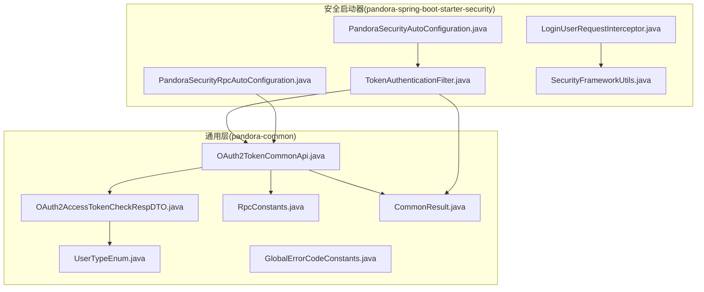
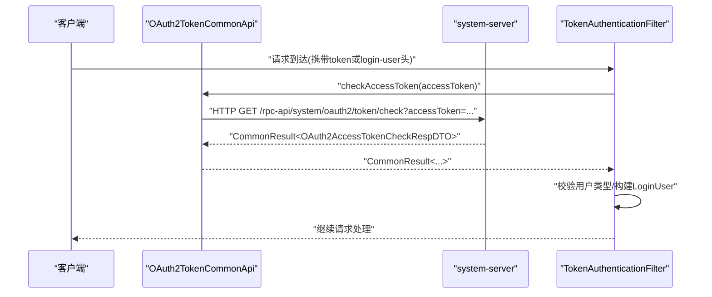
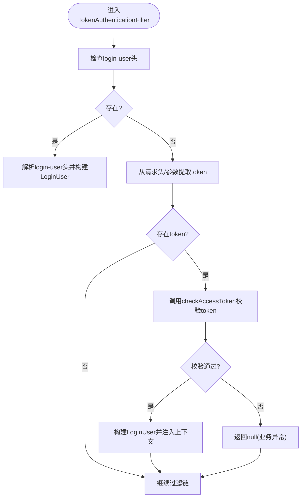
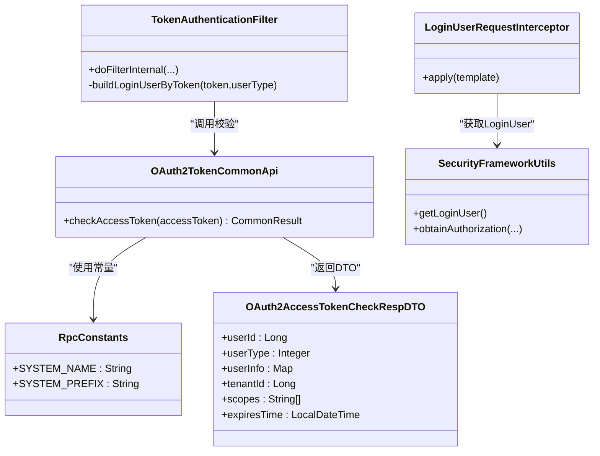

# OAuth2认证API

<cite>
**本文引用的文件**
- [OAuth2TokenCommonApi.java](file://pandora-framework/pandora-common/src/main/java/net/ittimeline/pandora/framework/common/biz/system/oauth2/OAuth2TokenCommonApi.java)
- [OAuth2AccessTokenCheckRespDTO.java](file://pandora-framework/pandora-common/src/main/java/net/ittimeline/pandora/framework/common/biz/system/oauth2/dto/OAuth2AccessTokenCheckRespDTO.java)
- [RpcConstants.java](file://pandora-framework/pandora-common/src/main/java/net/ittimeline/pandora/framework/common/constants/RpcConstants.java)
- [CommonResult.java](file://pandora-framework/pandora-common/src/main/java/net/ittimeline/pandora/framework/common/pojo/CommonResult.java)
- [PandoraSecurityRpcAutoConfiguration.java](file://pandora-framework/pandora-spring-boot-starter-security/src/main/java/net/ittimeline/pandora/framework/security/config/PandoraSecurityRpcAutoConfiguration.java)
- [PandoraSecurityAutoConfiguration.java](file://pandora-framework/pandora-spring-boot-starter-security/src/main/java/net/ittimeline/pandora/framework/security/config/PandoraSecurityAutoConfiguration.java)
- [TokenAuthenticationFilter.java](file://pandora-framework/pandora-spring-boot-starter-security/src/main/java/net/ittimeline/pandora/framework/security/core/filter/TokenAuthenticationFilter.java)
- [LoginUserRequestInterceptor.java](file://pandora-framework/pandora-spring-boot-starter-security/src/main/java/net/ittimeline/pandora/framework/security/core/rpc/LoginUserRequestInterceptor.java)
- [SecurityFrameworkUtils.java](file://pandora-framework/pandora-spring-boot-starter-security/src/main/java/net/ittimeline/pandora/framework/security/core/util/SecurityFrameworkUtils.java)
- [UserTypeEnum.java](file://pandora-framework/pandora-common/src/main/java/net/ittimeline/pandora/framework/common/enums/UserTypeEnum.java)
- [GlobalErrorCodeConstants.java](file://pandora-framework/pandora-common/src/main/java/net/ittimeline/pandora/framework/common/exception/enums/GlobalErrorCodeConstants.java)
</cite>

## 更新摘要
**变更内容**
- 新增OAuth2TokenCommonApi接口的完整规范说明
- 补充OAuth2AccessTokenCheckRespDTO的详细字段说明
- 完善与安全框架的集成文档
- 更新请求/响应示例和错误处理说明
- 增加fallbackFactory配置建议和最佳实践

## 目录
1. [简介](#简介)
2. [项目结构](#项目结构)
3. [核心组件](#核心组件)
4. [架构总览](#架构总览)
5. [详细组件分析](#详细组件分析)
6. [依赖关系分析](#依赖关系分析)
7. [性能考虑](#性能考虑)
8. [故障排查指南](#故障排查指南)
9. [结论](#结论)
10. [附录](#附录)

## 简介
本文件面向OAuth2认证API，聚焦于OAuth2TokenCommonApi接口中的checkAccessToken方法，提供完整的接口规范、请求/响应示例、错误处理说明以及与RpcConstants.SYSTEM_NAME的集成方式和fallbackFactory配置建议。同时给出常见认证场景与最佳实践，帮助开发者快速、正确地接入与使用。

## 项目结构
围绕OAuth2认证API的关键模块分布如下：
- 接口定义与响应模型位于pandora-common模块
- Feign客户端与自动装配位于pandora-spring-boot-starter-security模块
- 常量与通用返回体位于pandora-common模块
- 安全上下文与拦截器位于pandora-spring-boot-starter-security模块

**图表来源**
- [OAuth2TokenCommonApi.java:1-34](file://pandora-framework/pandora-common/src/main/java/net/ittimeline/pandora/framework/common/biz/system/oauth2/OAuth2TokenCommonApi.java#L1-L34)
- [OAuth2AccessTokenCheckRespDTO.java:1-40](file://pandora-framework/pandora-common/src/main/java/net/ittimeline/pandora/framework/common/biz/system/oauth2/dto/OAuth2AccessTokenCheckRespDTO.java#L1-L40)
- [RpcConstants.java:1-42](file://pandora-framework/pandora-common/src/main/java/net/ittimeline/pandora/framework/common/constants/RpcConstants.java#L1-L42)
- [CommonResult.java:1-123](file://pandora-framework/pandora-common/src/main/java/net/ittimeline/pandora/framework/common/pojo/CommonResult.java#L1-L123)
- [PandoraSecurityRpcAutoConfiguration.java:1-27](file://pandora-framework/pandora-spring-boot-starter-security/src/main/java/net/ittimeline/pandora/framework/security/config/PandoraSecurityRpcAutoConfiguration.java#L1-L27)
- [PandoraSecurityAutoConfiguration.java:1-99](file://pandora-framework/pandora-spring-boot-starter-security/src/main/java/net/ittimeline/pandora/framework/security/config/PandoraSecurityAutoConfiguration.java#L1-L99)
- [TokenAuthenticationFilter.java:1-157](file://pandora-framework/pandora-spring-boot-starter-security/src/main/java/net/ittimeline/pandora/framework/security/core/filter/TokenAuthenticationFilter.java#L1-L157)
- [LoginUserRequestInterceptor.java:1-39](file://pandora-framework/pandora-spring-boot-starter-security/src/main/java/net/ittimeline/pandora/framework/security/core/rpc/LoginUserRequestInterceptor.java#L1-L39)
- [SecurityFrameworkUtils.java:1-163](file://pandora-framework/pandora-spring-boot-starter-security/src/main/java/net/ittimeline/pandora/framework/security/core/util/SecurityFrameworkUtils.java#L1-L163)

**章节来源**
- [OAuth2TokenCommonApi.java:1-34](file://pandora-framework/pandora-common/src/main/java/net/ittimeline/pandora/framework/common/biz/system/oauth2/OAuth2TokenCommonApi.java#L1-L34)
- [RpcConstants.java:1-42](file://pandora-framework/pandora-common/src/main/java/net/ittimeline/pandora/framework/common/constants/RpcConstants.java#L1-L42)

## 核心组件
- **OAuth2TokenCommonApi**：定义了checkAccessToken方法，通过Feign客户端调用system-server服务，路径为SYSTEM_PREFIX + "/oauth2/token/check"。
- **OAuth2AccessTokenCheckRespDTO**：checkAccessToken返回的DTO，包含用户标识、用户类型、用户信息、租户、授权范围及过期时间。
- **RpcConstants**：定义了SYSTEM_NAME（system-server）与SYSTEM_PREFIX（/rpc-api/system），用于拼接远程调用路径。
- **CommonResult**：统一响应包装，包含code、msg、data三要素，支持成功与错误判断。

**章节来源**
- [OAuth2TokenCommonApi.java:20-30](file://pandora-framework/pandora-common/src/main/java/net/ittimeline/pandora/framework/common/biz/system/oauth2/OAuth2TokenCommonApi.java#L20-L30)
- [OAuth2AccessTokenCheckRespDTO.java:18-39](file://pandora-framework/pandora-common/src/main/java/net/ittimeline/pandora/framework/common/biz/system/oauth2/dto/OAuth2AccessTokenCheckRespDTO.java#L18-L39)
- [RpcConstants.java:12-28](file://pandora-framework/pandora-common/src/main/java/net/ittimeline/pandora/framework/common/constants/RpcConstants.java#L12-L28)
- [CommonResult.java:21-94](file://pandora-framework/pandora-common/src/main/java/net/ittimeline/pandora/framework/common/pojo/CommonResult.java#L21-L94)

## 架构总览
checkAccessToken在客户端侧通过Feign发起HTTP GET请求，目标服务为system-server，路径由RpcConstants拼接生成。服务端在TokenAuthenticationFilter中调用该接口完成令牌校验，并将用户信息注入Spring Security上下文。

**图表来源**
- [OAuth2TokenCommonApi.java:24-30](file://pandora-framework/pandora-common/src/main/java/net/ittimeline/pandora/framework/common/biz/system/oauth2/OAuth2TokenCommonApi.java#L24-L30)
- [RpcConstants.java:16-28](file://pandora-framework/pandora-common/src/main/java/net/ittimeline/pandora/framework/common/constants/RpcConstants.java#L16-L28)
- [TokenAuthenticationFilter.java:84-107](file://pandora-framework/pandora-spring-boot-starter-security/src/main/java/net/ittimeline/pandora/framework/security/core/filter/TokenAuthenticationFilter.java#L84-L107)

## 详细组件分析

### OAuth2TokenCommonApi接口规范
- **接口注解与客户端**
  - 使用@FeignClient(name = RpcConstants.SYSTEM_NAME)，目标服务名为system-server。
  - 当前未配置fallbackFactory，建议在生产环境补充以增强容错。
- **路径前缀**
  - PREFIX = RpcConstants.SYSTEM_PREFIX + "/oauth2/token"，即"/rpc-api/system/oauth2/token"。
- **方法定义**
  - HTTP方法：GET
  - 路径：PREFIX + "/check"，即"/rpc-api/system/oauth2/token/check"
  - 参数：accessToken（必填）
  - 返回：CommonResult<OAuth2AccessTokenCheckRespDTO>

**请求参数**
- **accessToken**
  - 名称：accessToken
  - 位置：查询参数
  - 必填：是
  - 示例值："tudou"

**响应结构**
- **成功响应**
  - code：0（全局成功码）
  - msg：空字符串
  - data：OAuth2AccessTokenCheckRespDTO对象
- **失败响应**
  - code：非0错误码（如401、403、500等）
  - msg：错误描述
  - data：null

**章节来源**
- [OAuth2TokenCommonApi.java:24-30](file://pandora-framework/pandora-common/src/main/java/net/ittimeline/pandora/framework/common/biz/system/oauth2/OAuth2TokenCommonApi.java#L24-L30)
- [CommonResult.java:21-94](file://pandora-framework/pandora-common/src/main/java/net/ittimeline/pandora/framework/common/pojo/CommonResult.java#L21-L94)
- [GlobalErrorCodeConstants.java:16-41](file://pandora-framework/pandora-common/src/main/java/net/ittimeline/pandora/framework/common/exception/enums/GlobalErrorCodeConstants.java#L16-L41)

### OAuth2AccessTokenCheckRespDTO字段说明
- **userId**：Long，用户编号
- **userType**：Integer，用户类型，参考UserTypeEnum
- **userInfo**：Map<String,String>，用户扩展信息
- **tenantId**：Long，租户编号
- **scopes**：List<String>，授权范围数组
- **expiresTime**：LocalDateTime，过期时间

**章节来源**
- [OAuth2AccessTokenCheckRespDTO.java:18-39](file://pandora-framework/pandora-common/src/main/java/net/ittimeline/pandora/framework/common/biz/system/oauth2/dto/OAuth2AccessTokenCheckRespDTO.java#L18-L39)
- [UserTypeEnum.java:16-47](file://pandora-framework/pandora-common/src/main/java/net/ittimeline/pandora/framework/common/enums/UserTypeEnum.java#L16-L47)

### 与RpcConstants.SYSTEM_NAME的集成
- **SYSTEM_NAME** = "system-server"，用于@FeignClient的name属性
- **SYSTEM_PREFIX** = "/rpc-api/system"，用于拼接具体路径
- **checkAccessToken最终调用路径**为：/rpc-api/system/oauth2/token/check

**章节来源**
- [RpcConstants.java:12-28](file://pandora-framework/pandora-common/src/main/java/net/ittimeline/pandora/framework/common/constants/RpcConstants.java#L12-L28)

### fallbackFactory配置建议
- 当前接口未配置fallbackFactory，建议在生产环境增加，以便在system-server不可用或超时时返回降级结果，避免影响主流程。
- 可结合业务需求实现自定义降级逻辑，如返回默认用户信息或抛出特定业务异常。

**章节来源**
- [OAuth2TokenCommonApi.java:20](file://pandora-framework/pandora-common/src/main/java/net/ittimeline/pandora/framework/common/biz/system/oauth2/OAuth2TokenCommonApi.java#L20)

### 请求/响应示例

**请求示例**
- **方法与路径**：GET /rpc-api/system/oauth2/token/check?accessToken={accessToken}
- **认证方式**：通常通过网关或上游服务透传token；也可在请求头中携带认证信息（取决于上游配置）
- **参数传递**：查询参数accessToken

**响应示例**
- **成功**
  - code: 0
  - msg: ""
  - data: 包含userId、userType、userInfo、tenantId、scopes、expiresTime
- **失败**
  - code: 401（未登录/令牌无效）
  - msg: "账号未登录"
  - data: null

**章节来源**
- [OAuth2TokenCommonApi.java:27-30](file://pandora-framework/pandora-common/src/main/java/net/ittimeline/pandora/framework/common/biz/system/oauth2/OAuth2TokenCommonApi.java#L27-L30)
- [CommonResult.java:74-89](file://pandora-framework/pandora-common/src/main/java/net/ittimeline/pandora/framework/common/pojo/CommonResult.java#L74-L89)
- [GlobalErrorCodeConstants.java:20-35](file://pandora-framework/pandora-common/src/main/java/net/ittimeline/pandora/framework/common/exception/enums/GlobalErrorCodeConstants.java#L20-L35)

### 与TokenAuthenticationFilter的协作
- TokenAuthenticationFilter在请求进入时尝试从header或参数中提取token
- 若存在token，则调用checkAccessToken进行校验
- 校验通过后构建LoginUser并注入Spring Security上下文
- 若校验失败且为业务异常，直接返回null，允许后续接口按需处理

**图表来源**
- [TokenAuthenticationFilter.java:47-107](file://pandora-framework/pandora-spring-boot-starter-security/src/main/java/net/ittimeline/pandora/framework/security/core/filter/TokenAuthenticationFilter.java#L47-L107)

**章节来源**
- [TokenAuthenticationFilter.java:47-107](file://pandora-framework/pandora-spring-boot-starter-security/src/main/java/net/ittimeline/pandora/framework/security/core/filter/TokenAuthenticationFilter.java#L47-L107)

### 与Feign自动装配的关系
- PandoraSecurityRpcAutoConfiguration启用Feign客户端扫描，包含OAuth2TokenCommonApi
- LoginUserRequestInterceptor负责在Feign请求中添加login-user头，便于下游服务识别调用方上下文

**章节来源**
- [PandoraSecurityRpcAutoConfiguration.java:17-24](file://pandora-framework/pandora-spring-boot-starter-security/src/main/java/net/ittimeline/pandora/framework/security/config/PandoraSecurityRpcAutoConfiguration.java#L17-L24)
- [LoginUserRequestInterceptor.java:20-37](file://pandora-framework/pandora-spring-boot-starter-security/src/main/java/net/ittimeline/pandora/framework/security/core/rpc/LoginUserRequestInterceptor.java#L20-L37)

## 依赖关系分析
- OAuth2TokenCommonApi依赖RpcConstants（SYSTEM_NAME、SYSTEM_PREFIX）
- TokenAuthenticationFilter依赖OAuth2TokenCommonApi进行令牌校验
- LoginUserRequestInterceptor依赖SecurityFrameworkUtils获取当前LoginUser并序列化后放入请求头
- OAuth2AccessTokenCheckRespDTO依赖UserTypeEnum表示用户类型

**图表来源**
- [OAuth2TokenCommonApi.java:1-34](file://pandora-framework/pandora-common/src/main/java/net/ittimeline/pandora/framework/common/biz/system/oauth2/OAuth2TokenCommonApi.java#L1-L34)
- [OAuth2AccessTokenCheckRespDTO.java:1-40](file://pandora-framework/pandora-common/src/main/java/net/ittimeline/pandora/framework/common/biz/system/oauth2/dto/OAuth2AccessTokenCheckRespDTO.java#L1-L40)
- [RpcConstants.java:12-28](file://pandora-framework/pandora-common/src/main/java/net/ittimeline/pandora/framework/common/constants/RpcConstants.java#L12-L28)
- [TokenAuthenticationFilter.java:1-157](file://pandora-framework/pandora-spring-boot-starter-security/src/main/java/net/ittimeline/pandora/framework/security/core/filter/TokenAuthenticationFilter.java#L1-L157)
- [LoginUserRequestInterceptor.java:1-39](file://pandora-framework/pandora-spring-boot-starter-security/src/main/java/net/ittimeline/pandora/framework/security/core/rpc/LoginUserRequestInterceptor.java#L1-L39)
- [SecurityFrameworkUtils.java:1-163](file://pandora-framework/pandora-spring-boot-starter-security/src/main/java/net/ittimeline/pandora/framework/security/core/util/SecurityFrameworkUtils.java#L1-L163)

**章节来源**
- [OAuth2TokenCommonApi.java:1-34](file://pandora-framework/pandora-common/src/main/java/net/ittimeline/pandora/framework/common/biz/system/oauth2/OAuth2TokenCommonApi.java#L1-L34)
- [TokenAuthenticationFilter.java:1-157](file://pandora-framework/pandora-spring-boot-starter-security/src/main/java/net/ittimeline/pandora/framework/security/core/filter/TokenAuthenticationFilter.java#L1-L157)
- [LoginUserRequestInterceptor.java:1-39](file://pandora-framework/pandora-spring-boot-starter-security/src/main/java/net/ittimeline/pandora/framework/security/core/rpc/LoginUserRequestInterceptor.java#L1-L39)

## 性能考虑
- checkAccessToken为同步阻塞调用，建议在高并发场景下配合熔断、限流与缓存策略，避免成为瓶颈。
- 建议对常用token进行本地缓存（如Redis），减少远程调用次数。
- fallbackFactory可返回降级结果，降低故障传播风险。

## 故障排查指南
- **401 未登录/令牌无效**
  - 检查accessToken是否正确传递
  - 确认上游是否正确透传token或login-user头
- **403 没有该操作权限**
  - 校验用户类型(userType)是否与接口期望一致
- **500 系统异常**
  - 查看system-server侧日志，确认令牌服务可用性
- **降级与容错**
  - 建议为checkAccessToken配置fallbackFactory，避免异常扩散

**章节来源**
- [GlobalErrorCodeConstants.java:20-35](file://pandora-framework/pandora-common/src/main/java/net/ittimeline/pandora/framework/common/exception/enums/GlobalErrorCodeConstants.java#L20-L35)
- [TokenAuthenticationFilter.java:94-97](file://pandora-framework/pandora-spring-boot-starter-security/src/main/java/net/ittimeline/pandora/framework/security/core/filter/TokenAuthenticationFilter.java#L94-L97)

## 结论
OAuth2TokenCommonApi的checkAccessToken方法提供了标准的令牌校验能力，结合RpcConstants与Feign客户端实现跨服务调用。通过TokenAuthenticationFilter与LoginUserRequestInterceptor，系统实现了从令牌到用户上下文的自动化注入。建议在生产环境中完善fallbackFactory与缓存策略，确保高可用与高性能。

## 附录

### 常见认证场景与最佳实践
- **场景一：网关统一鉴权**
  - 网关负责提取token并调用checkAccessToken，成功后将login-user头透传给下游服务
  - 下游服务通过TokenAuthenticationFilter自动识别并注入上下文
- **场景二：直连微服务**
  - 客户端在请求头中携带认证信息，服务端从header或参数中提取token并校验
- **最佳实践**
  - 使用统一的认证头命名与token前缀约定
  - 对token进行本地缓存与失效时间控制
  - 为checkAccessToken配置fallbackFactory与熔断策略
  - 明确用户类型(userType)与接口权限的对应关系

**章节来源**
- [SecurityFrameworkUtils.java:26-57](file://pandora-framework/pandora-spring-boot-starter-security/src/main/java/net/ittimeline/pandora/framework/security/core/util/SecurityFrameworkUtils.java#L26-L57)
- [TokenAuthenticationFilter.java:119-131](file://pandora-framework/pandora-spring-boot-starter-security/src/main/java/net/ittimeline/pandora/framework/security/core/filter/TokenAuthenticationFilter.java#L119-L131)