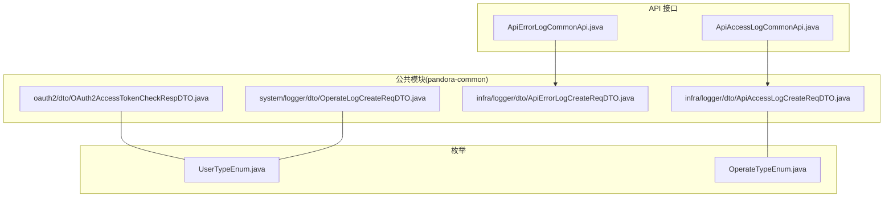
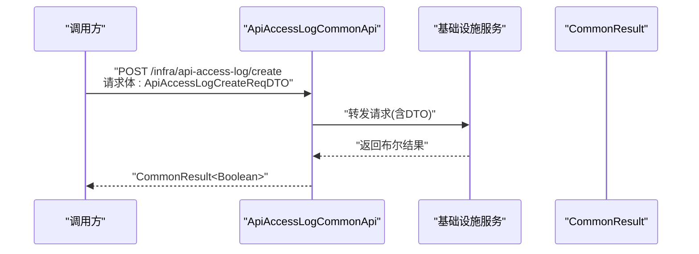
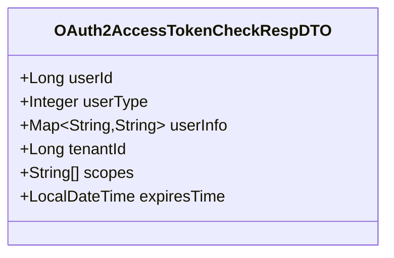
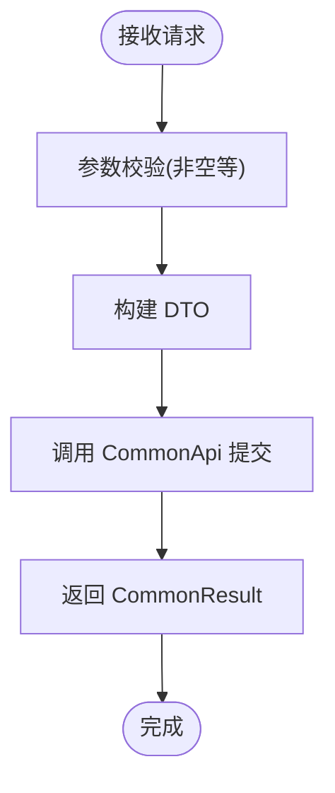
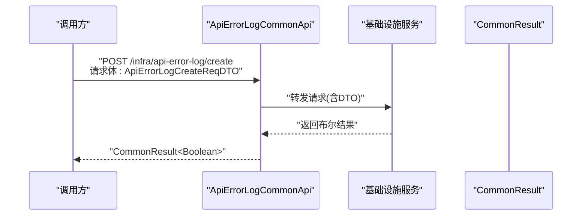
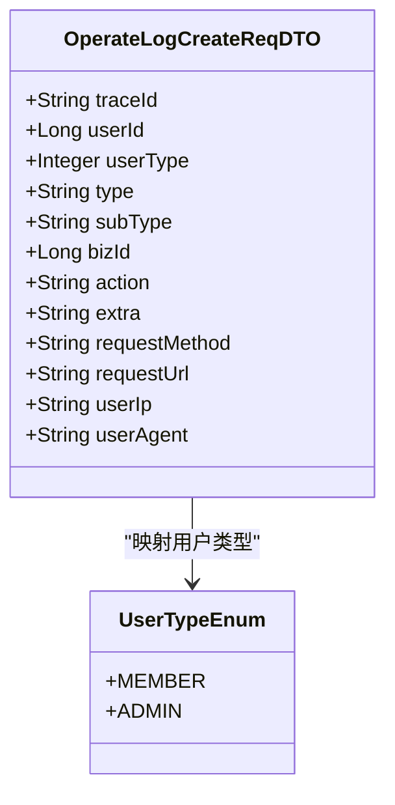
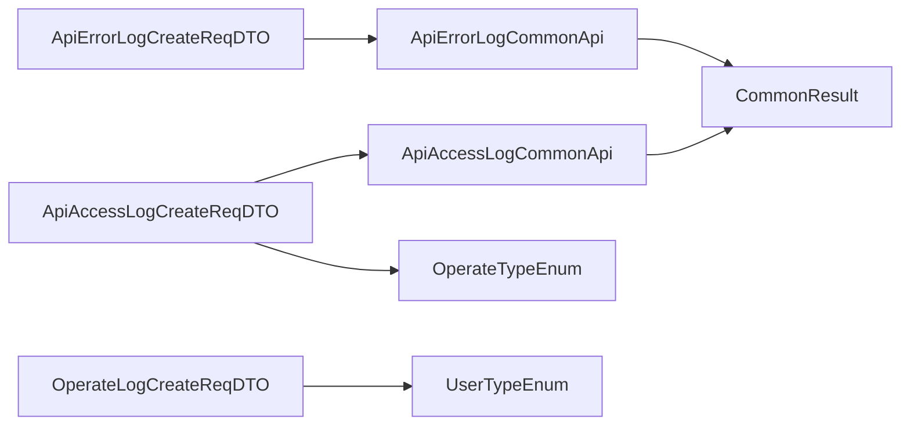

# 数据传输对象(DTO)

<cite>
**本文引用的文件**
- [OAuth2AccessTokenCheckRespDTO.java](file://pandora-framework/pandora-common/src/main/java/net/ittimeline/pandora/framework/common/biz/system/oauth2/dto/OAuth2AccessTokenCheckRespDTO.java)
- [ApiAccessLogCreateReqDTO.java](file://pandora-framework/pandora-common/src/main/java/net/ittimeline/pandora/framework/common/biz/infra/logger/dto/ApiAccessLogCreateReqDTO.java)
- [ApiErrorLogCreateReqDTO.java](file://pandora-framework/pandora-common/src/main/java/net/ittimeline/pandora/framework/common/biz/infra/logger/dto/ApiErrorLogCreateReqDTO.java)
- [OperateLogCreateReqDTO.java](file://pandora-framework/pandora-common/src/main/java/net/ittimeline/pandora/framework/common/biz/system/logger/dto/OperateLogCreateReqDTO.java)
- [UserTypeEnum.java](file://pandora-framework/pandora-common/src/main/java/net/ittimeline/pandora/framework/common/enums/UserTypeEnum.java)
- [OperateTypeEnum.java](file://pandora-framework/pandora-spring-boot-starter-web/src/main/java/net/ittimeline/pandora/framework/apilog/core/enums/OperateTypeEnum.java)
- [ApiAccessLogCommonApi.java](file://pandora-framework/pandora-common/src/main/java/net/ittimeline/pandora/framework/common/biz/infra/logger/ApiAccessLogCommonApi.java)
- [ApiErrorLogCommonApi.java](file://pandora-framework/pandora-common/src/main/java/net/ittimeline/pandora/framework/common/biz/infra/logger/ApiErrorLogCommonApi.java)
- [CommonResult.java](file://pandora-framework/pandora-common/src/main/java/net/ittimeline/pandora/framework/common/pojo/CommonResult.java)
</cite>

## 目录
1. [简介](#简介)
2. [项目结构](#项目结构)
3. [核心组件](#核心组件)
4. [架构总览](#架构总览)
5. [详细组件分析](#详细组件分析)
6. [依赖分析](#依赖分析)
7. [性能考量](#性能考量)
8. [故障排查指南](#故障排查指南)
9. [结论](#结论)
10. [附录](#附录)

## 简介
本文件系统化梳理 Pandora Cloud 框架中的数据传输对象（DTO），重点覆盖以下四类：
- OAuth2AccessTokenCheckRespDTO：OAuth2 访问令牌校验响应 DTO
- ApiAccessLogCreateReqDTO：API 访问日志创建请求 DTO
- ApiErrorLogCreateReqDTO：API 错误日志创建请求 DTO
- OperateLogCreateReqDTO：系统操作日志创建请求 DTO

文档将逐项说明字段定义、数据类型、验证规则与业务含义；给出 JSON 序列化示例与字段映射关系；阐述 DTO 在不同 API 间的传递格式与转换规则；总结 DTO 设计原则、命名规范与版本兼容性考虑；并说明与前端数据模型的对应关系及数据验证策略。

## 项目结构
DTO 分布于公共模块的子包中，按业务域划分：
- oauth2：认证鉴权相关 DTO
- infra/logger：基础设施日志相关 DTO
- system/logger：系统日志相关 DTO

**图表来源**
- [OAuth2AccessTokenCheckRespDTO.java:1-40](file://pandora-framework/pandora-common/src/main/java/net/ittimeline/pandora/framework/common/biz/system/oauth2/dto/OAuth2AccessTokenCheckRespDTO.java#L1-L40)
- [ApiAccessLogCreateReqDTO.java:1-106](file://pandora-framework/pandora-common/src/main/java/net/ittimeline/pandora/framework/common/biz/infra/logger/dto/ApiAccessLogCreateReqDTO.java#L1-L106)
- [ApiErrorLogCreateReqDTO.java:1-74](file://pandora-framework/pandora-common/src/main/java/net/ittimeline/pandora/framework/common/biz/infra/logger/dto/ApiErrorLogCreateReqDTO.java#L1-L74)
- [OperateLogCreateReqDTO.java:1-58](file://pandora-framework/pandora-common/src/main/java/net/ittimeline/pandora/framework/common/biz/system/logger/dto/OperateLogCreateReqDTO.java#L1-L58)
- [UserTypeEnum.java:1-48](file://pandora-framework/pandora-common/src/main/java/net/ittimeline/pandora/framework/common/enums/UserTypeEnum.java#L1-L48)
- [OperateTypeEnum.java:1-53](file://pandora-framework/pandora-spring-boot-starter-web/src/main/java/net/ittimeline/pandora/framework/apilog/core/enums/OperateTypeEnum.java#L1-L53)
- [ApiAccessLogCommonApi.java:1-40](file://pandora-framework/pandora-common/src/main/java/net/ittimeline/pandora/framework/common/biz/infra/logger/ApiAccessLogCommonApi.java#L1-L40)
- [ApiErrorLogCommonApi.java:1-41](file://pandora-framework/pandora-common/src/main/java/net/ittimeline/pandora/framework/common/biz/infra/logger/ApiErrorLogCommonApi.java#L1-L41)

**章节来源**
- [OAuth2AccessTokenCheckRespDTO.java:1-40](file://pandora-framework/pandora-common/src/main/java/net/ittimeline/pandora/framework/common/biz/system/oauth2/dto/OAuth2AccessTokenCheckRespDTO.java#L1-L40)
- [ApiAccessLogCreateReqDTO.java:1-106](file://pandora-framework/pandora-common/src/main/java/net/ittimeline/pandora/framework/common/biz/infra/logger/dto/ApiAccessLogCreateReqDTO.java#L1-L106)
- [ApiErrorLogCreateReqDTO.java:1-74](file://pandora-framework/pandora-common/src/main/java/net/ittimeline/pandora/framework/common/biz/infra/logger/dto/ApiErrorLogCreateReqDTO.java#L1-L74)
- [OperateLogCreateReqDTO.java:1-58](file://pandora-framework/pandora-common/src/main/java/net/ittimeline/pandora/framework/common/biz/system/logger/dto/OperateLogCreateReqDTO.java#L1-L58)

## 核心组件
本节对四个核心 DTO 进行概览式说明，包括用途、关键字段与验证要点。

- OAuth2AccessTokenCheckRespDTO
  - 用途：RPC 响应 DTO，用于返回 OAuth2 令牌校验结果，包含用户标识、租户、权限范围与过期时间等。
  - 关键字段：userId、userType、userInfo、tenantId、scopes、expiresTime。
  - 验证：该 DTO 作为响应对象，通常不直接参与请求参数校验；但字段类型与业务约束需明确。
  - 业务含义：供下游服务识别登录主体、权限范围与有效期，支撑鉴权与授权决策。

- ApiAccessLogCreateReqDTO
  - 用途：API 访问日志创建请求 DTO，记录一次请求的完整上下文与结果。
  - 关键字段：traceId、userId、userType、applicationName、requestMethod、requestUrl、requestParams、responseBody、userIp、userAgent、operateModule、operateName、operateType、beginTime、endTime、duration、resultCode、resultMsg。
  - 验证：多字段使用非空校验注解，确保关键信息必填。
  - 业务含义：用于审计、监控与问题定位，支持异步写入。

- ApiErrorLogCreateReqDTO
  - 用途：API 错误日志创建请求 DTO，记录异常发生时的上下文与堆栈信息。
  - 关键字段：traceId、userId、userType、applicationName、requestMethod、requestUrl、requestParams、userIp、userAgent、exceptionTime、exceptionName、exceptionClassName、exceptionFileName、exceptionMethodName、exceptionLineNumber、exceptionStackTrace、exceptionRootCauseMessage、exceptionMessage。
  - 验证：多字段使用非空校验注解，保证异常信息完整性。
  - 业务含义：用于异常追踪、根因分析与质量监控。

- OperateLogCreateReqDTO
  - 用途：系统操作日志创建请求 DTO，记录用户在业务模块中的具体操作行为。
  - 关键字段：traceId、userId、userType、type、subType、bizId、action、extra、requestMethod、requestUrl、userIp、userAgent。
  - 验证：多字段使用非空或非空集合校验注解，确保操作信息清晰可追溯。
  - 业务含义：用于合规审计、操作追踪与责任认定。

**章节来源**
- [OAuth2AccessTokenCheckRespDTO.java:18-39](file://pandora-framework/pandora-common/src/main/java/net/ittimeline/pandora/framework/common/biz/system/oauth2/dto/OAuth2AccessTokenCheckRespDTO.java#L18-L39)
- [ApiAccessLogCreateReqDTO.java:16-105](file://pandora-framework/pandora-common/src/main/java/net/ittimeline/pandora/framework/common/biz/infra/logger/dto/ApiAccessLogCreateReqDTO.java#L16-L105)
- [ApiErrorLogCreateReqDTO.java:18-73](file://pandora-framework/pandora-common/src/main/java/net/ittimeline/pandora/framework/common/biz/infra/logger/dto/ApiErrorLogCreateReqDTO.java#L18-L73)
- [OperateLogCreateReqDTO.java:17-57](file://pandora-framework/pandora-common/src/main/java/net/ittimeline/pandora/framework/common/biz/system/logger/dto/OperateLogCreateReqDTO.java#L17-L57)

## 架构总览
DTO 在框架中的角色与交互如下：
- DTO 由各业务域的 API 接口接收或返回，通过 Feign 客户端进行 RPC 调用。
- 日志类 DTO 通过对应的 CommonApi 接口异步或同步提交至基础设施服务。
- 响应统一包装为通用结果对象，便于前端与调用方处理。

**图表来源**
- [ApiAccessLogCommonApi.java:21-39](file://pandora-framework/pandora-common/src/main/java/net/ittimeline/pandora/framework/common/biz/infra/logger/ApiAccessLogCommonApi.java#L21-L39)
- [ApiAccessLogCreateReqDTO.java:16-105](file://pandora-framework/pandora-common/src/main/java/net/ittimeline/pandora/framework/common/biz/infra/logger/dto/ApiAccessLogCreateReqDTO.java#L16-L105)
- [CommonResult.java:22-89](file://pandora-framework/pandora-common/src/main/java/net/ittimeline/pandora/framework/common/pojo/CommonResult.java#L22-L89)

## 详细组件分析

### OAuth2AccessTokenCheckRespDTO
- 字段定义与类型
  - userId: Long
  - userType: Integer
  - userInfo: Map<String, String>
  - tenantId: Long
  - scopes: List<String>
  - expiresTime: LocalDateTime
- 验证规则
  - 该 DTO 为响应对象，字段未直接使用校验注解；建议在序列化层确保类型一致性与空值处理。
- 业务含义
  - 用于下游服务快速识别用户身份、租户与授权范围，避免重复查询。
- JSON 示例
  - {
      "userId": 10,
      "userType": 1,
      "userInfo": {"nickname": "芋道"},
      "tenantId": 1024,
      "scopes": ["user_info"],
      "expiresTime": "2025-12-31T23:59:59"
    }
- 字段映射
  - 与 UserTypeEnum 枚举配合，userType 映射用户类型。
- 版本兼容性
  - 新增字段时建议保持向后兼容，避免破坏现有序列化结构。

**图表来源**
- [OAuth2AccessTokenCheckRespDTO.java:20-39](file://pandora-framework/pandora-common/src/main/java/net/ittimeline/pandora/framework/common/biz/system/oauth2/dto/OAuth2AccessTokenCheckRespDTO.java#L20-L39)

**章节来源**
- [OAuth2AccessTokenCheckRespDTO.java:18-39](file://pandora-framework/pandora-common/src/main/java/net/ittimeline/pandora/framework/common/biz/system/oauth2/dto/OAuth2AccessTokenCheckRespDTO.java#L18-L39)
- [UserTypeEnum.java:18-47](file://pandora-framework/pandora-common/src/main/java/net/ittimeline/pandora/framework/common/enums/UserTypeEnum.java#L18-L47)

### ApiAccessLogCreateReqDTO
- 字段定义与类型
  - traceId: String
  - userId: Long
  - userType: Integer
  - applicationName: String (必填)
  - requestMethod: String (必填)
  - requestUrl: String (必填)
  - requestParams: String
  - responseBody: String
  - userIp: String (必填)
  - userAgent: String (必填)
  - operateModule: String
  - operateName: String
  - operateType: Integer (参见 OperateTypeEnum)
  - beginTime: LocalDateTime (必填)
  - endTime: LocalDateTime (必填)
  - duration: Integer (必填)
  - resultCode: Integer (必填)
  - resultMsg: String
- 验证规则
  - 多字段使用非空校验注解，确保关键信息必填。
- 业务含义
  - 记录一次 API 请求的完整生命周期，支持性能分析与问题回溯。
- JSON 示例
  - {
      "applicationName": "system-server",
      "requestMethod": "GET",
      "requestUrl": "/xxx/yyy",
      "userIp": "127.0.0.1",
      "userAgent": "Mozilla/5.0",
      "beginTime": "2025-01-01T10:00:00",
      "endTime": "2025-01-01T10:00:01",
      "duration": 1000,
      "resultCode": 200
    }
- 字段映射
  - operateType 对应 OperateTypeEnum。
- 传递与转换
  - 通过 ApiAccessLogCommonApi.createApiAccessLog 提交，返回 CommonResult<Boolean>。

**图表来源**
- [ApiAccessLogCommonApi.java:26-38](file://pandora-framework/pandora-common/src/main/java/net/ittimeline/pandora/framework/common/biz/infra/logger/ApiAccessLogCommonApi.java#L26-L38)
- [ApiAccessLogCreateReqDTO.java:16-105](file://pandora-framework/pandora-common/src/main/java/net/ittimeline/pandora/framework/common/biz/infra/logger/dto/ApiAccessLogCreateReqDTO.java#L16-L105)

**章节来源**
- [ApiAccessLogCreateReqDTO.java:16-105](file://pandora-framework/pandora-common/src/main/java/net/ittimeline/pandora/framework/common/biz/infra/logger/dto/ApiAccessLogCreateReqDTO.java#L16-L105)
- [OperateTypeEnum.java:15-52](file://pandora-framework/pandora-spring-boot-starter-web/src/main/java/net/ittimeline/pandora/framework/apilog/core/enums/OperateTypeEnum.java#L15-L52)
- [ApiAccessLogCommonApi.java:26-38](file://pandora-framework/pandora-common/src/main/java/net/ittimeline/pandora/framework/common/biz/infra/logger/ApiAccessLogCommonApi.java#L26-L38)
- [CommonResult.java:22-89](file://pandora-framework/pandora-common/src/main/java/net/ittimeline/pandora/framework/common/pojo/CommonResult.java#L22-L89)

### ApiErrorLogCreateReqDTO
- 字段定义与类型
  - traceId: String
  - userId: Long
  - userType: Integer
  - applicationName: String (必填)
  - requestMethod: String (必填)
  - requestUrl: String (必填)
  - requestParams: String (必填)
  - userIp: String (必填)
  - userAgent: String (必填)
  - exceptionTime: LocalDateTime (必填)
  - exceptionName: String (必填)
  - exceptionClassName: String (必填)
  - exceptionFileName: String (必填)
  - exceptionMethodName: String (必填)
  - exceptionLineNumber: Integer (必填)
  - exceptionStackTrace: String (必填)
  - exceptionRootCauseMessage: String (必填)
  - exceptionMessage: String (必填)
- 验证规则
  - 所有关键字段均使用非空校验注解，确保异常信息完整。
- 业务含义
  - 记录异常发生的关键上下文，便于快速定位与修复。
- JSON 示例
  - {
      "applicationName": "system-server",
      "requestMethod": "POST",
      "requestUrl": "/api/order/create",
      "requestParams": "{\"amount\":100}",
      "userIp": "127.0.0.1",
      "userAgent": "PostmanRuntime/7.29.0",
      "exceptionTime": "2025-01-01T10:05:00",
      "exceptionName": "RuntimeException",
      "exceptionMessage": "参数校验失败",
      "exceptionRootCauseMessage": "参数不能为空"
    }
- 传递与转换
  - 通过 ApiErrorLogCommonApi.createApiErrorLog 提交，返回 CommonResult<Boolean>。

**图表来源**
- [ApiErrorLogCommonApi.java:27-39](file://pandora-framework/pandora-common/src/main/java/net/ittimeline/pandora/framework/common/biz/infra/logger/ApiErrorLogCommonApi.java#L27-L39)
- [ApiErrorLogCreateReqDTO.java:18-73](file://pandora-framework/pandora-common/src/main/java/net/ittimeline/pandora/framework/common/biz/infra/logger/dto/ApiErrorLogCreateReqDTO.java#L18-L73)

**章节来源**
- [ApiErrorLogCreateReqDTO.java:18-73](file://pandora-framework/pandora-common/src/main/java/net/ittimeline/pandora/framework/common/biz/infra/logger/dto/ApiErrorLogCreateReqDTO.java#L18-L73)
- [ApiErrorLogCommonApi.java:27-39](file://pandora-framework/pandora-common/src/main/java/net/ittimeline/pandora/framework/common/biz/infra/logger/ApiErrorLogCommonApi.java#L27-L39)
- [CommonResult.java:22-89](file://pandora-framework/pandora-common/src/main/java/net/ittimeline/pandora/framework/common/pojo/CommonResult.java#L22-L89)

### OperateLogCreateReqDTO
- 字段定义与类型
  - traceId: String
  - userId: Long (必填)
  - userType: Integer (必填)
  - type: String (必填，操作模块类型)
  - subType: String (必填，操作名)
  - bizId: Long (必填，业务编号)
  - action: String (必填，操作内容)
  - extra: String
  - requestMethod: String (必填)
  - requestUrl: String (必填)
  - userIp: String (必填)
  - userAgent: String (必填)
- 验证规则
  - 多字段使用非空或非空集合校验注解，确保操作信息清晰可追溯。
- 业务含义
  - 记录用户在业务模块中的具体操作，支持审计与合规。
- JSON 示例
  - {
      "userId": 666,
      "userType": 2,
      "type": "订单",
      "subType": "创建订单",
      "bizId": 188,
      "action": "修改编号为 1 的用户信息，将性别从男改成女，将姓名从芋道改成源码",
      "requestMethod": "GET",
      "requestUrl": "/order/get",
      "userIp": "127.0.0.1",
      "userAgent": "Mozilla/5.0"
    }
- 字段映射
  - userType 对应 UserTypeEnum。
- 传递与转换
  - 通过系统侧日志 API 提交，返回 CommonResult<Boolean>。

**图表来源**
- [OperateLogCreateReqDTO.java:17-57](file://pandora-framework/pandora-common/src/main/java/net/ittimeline/pandora/framework/common/biz/system/logger/dto/OperateLogCreateReqDTO.java#L17-L57)
- [UserTypeEnum.java:18-47](file://pandora-framework/pandora-common/src/main/java/net/ittimeline/pandora/framework/common/enums/UserTypeEnum.java#L18-L47)

**章节来源**
- [OperateLogCreateReqDTO.java:17-57](file://pandora-framework/pandora-common/src/main/java/net/ittimeline/pandora/framework/common/biz/system/logger/dto/OperateLogCreateReqDTO.java#L17-L57)
- [UserTypeEnum.java:18-47](file://pandora-framework/pandora-common/src/main/java/net/ittimeline/pandora/framework/common/enums/UserTypeEnum.java#L18-L47)

## 依赖分析
- DTO 与枚举的关系
  - OperateLogCreateReqDTO 与 UserTypeEnum：userType 字段映射用户类型。
  - ApiAccessLogCreateReqDTO 与 OperateTypeEnum：operateType 字段映射操作类型。
- DTO 与 API 接口的关系
  - ApiAccessLogCommonApi 与 ApiAccessLogCreateReqDTO：通过 @RequestBody 传递。
  - ApiErrorLogCommonApi 与 ApiErrorLogCreateReqDTO：通过 @RequestBody 传递。
- DTO 与统一返回对象的关系
  - API 返回 CommonResult<Boolean>，封装 code、msg、data，便于前端处理。

**图表来源**
- [ApiAccessLogCommonApi.java:26-38](file://pandora-framework/pandora-common/src/main/java/net/ittimeline/pandora/framework/common/biz/infra/logger/ApiAccessLogCommonApi.java#L26-L38)
- [ApiErrorLogCommonApi.java:27-39](file://pandora-framework/pandora-common/src/main/java/net/ittimeline/pandora/framework/common/biz/infra/logger/ApiErrorLogCommonApi.java#L27-L39)
- [OperateLogCreateReqDTO.java:17-57](file://pandora-framework/pandora-common/src/main/java/net/ittimeline/pandora/framework/common/biz/system/logger/dto/OperateLogCreateReqDTO.java#L17-L57)
- [UserTypeEnum.java:18-47](file://pandora-framework/pandora-common/src/main/java/net/ittimeline/pandora/framework/common/enums/UserTypeEnum.java#L18-L47)
- [OperateTypeEnum.java:15-52](file://pandora-framework/pandora-spring-boot-starter-web/src/main/java/net/ittimeline/pandora/framework/apilog/core/enums/OperateTypeEnum.java#L15-L52)
- [CommonResult.java:22-89](file://pandora-framework/pandora-common/src/main/java/net/ittimeline/pandora/framework/common/pojo/CommonResult.java#L22-L89)

**章节来源**
- [ApiAccessLogCommonApi.java:26-38](file://pandora-framework/pandora-common/src/main/java/net/ittimeline/pandora/framework/common/biz/infra/logger/ApiAccessLogCommonApi.java#L26-L38)
- [ApiErrorLogCommonApi.java:27-39](file://pandora-framework/pandora-common/src/main/java/net/ittimeline/pandora/framework/common/biz/infra/logger/ApiErrorLogCommonApi.java#L27-L39)
- [OperateLogCreateReqDTO.java:17-57](file://pandora-framework/pandora-common/src/main/java/net/ittimeline/pandora/framework/common/biz/system/logger/dto/OperateLogCreateReqDTO.java#L17-L57)
- [UserTypeEnum.java:18-47](file://pandora-framework/pandora-common/src/main/java/net/ittimeline/pandora/framework/common/enums/UserTypeEnum.java#L18-L47)
- [OperateTypeEnum.java:15-52](file://pandora-framework/pandora-spring-boot-starter-web/src/main/java/net/ittimeline/pandora/framework/apilog/core/enums/OperateTypeEnum.java#L15-L52)
- [CommonResult.java:22-89](file://pandora-framework/pandora-common/src/main/java/net/ittimeline/pandora/framework/common/pojo/CommonResult.java#L22-L89)

## 性能考量
- DTO 字段数量与复杂度
  - 日志类 DTO 字段较多，建议在序列化与网络传输时关注字段冗余，必要时按需裁剪。
- 异步写入
  - API 提供异步方法，可在不影响主流程的前提下提交日志，提升吞吐。
- 时间戳与时区
  - 使用 LocalDateTime 表达时间，注意时区与序列化格式的一致性，避免跨服务解析差异。

## 故障排查指南
- 参数校验失败
  - 现象：接口返回校验错误。
  - 排查：确认必填字段是否缺失；检查枚举值是否在允许范围内；核对字符串长度与格式。
- 响应结果异常
  - 现象：CommonResult.code 非成功码。
  - 排查：查看 msg 与 data；结合 traceId 定位问题；检查下游服务状态。
- 日志未入库
  - 现象：提交成功但数据库无记录。
  - 排查：确认异步任务是否执行；检查基础设施服务日志；核对 DTO 字段映射与序列化配置。

**章节来源**
- [CommonResult.java:50-122](file://pandora-framework/pandora-common/src/main/java/net/ittimeline/pandora/framework/common/pojo/CommonResult.java#L50-L122)

## 结论
本文档对 Pandora Cloud 框架中的四个核心 DTO 进行了全面梳理，明确了字段定义、验证规则、业务含义与传递方式。通过统一的 API 接口与通用返回对象，DTO 在系统间形成稳定的数据契约，既保障了数据一致性，也为后续扩展与演进提供了清晰边界。建议在新增字段时遵循命名规范与版本兼容性原则，确保向前兼容与可维护性。

## 附录
- 设计原则
  - 单一职责：每个 DTO 专注于一个业务场景。
  - 明确边界：字段类型与业务含义清晰，避免模糊表达。
  - 可扩展性：预留扩展字段，避免破坏现有结构。
- 命名规范
  - 请求 DTO 使用 “...ReqDTO” 后缀，响应 DTO 使用 “...RespDTO” 后缀。
  - 枚举值采用语义化命名，如 OperateTypeEnum 中的 GET/CREATE/UPDATE 等。
- 版本兼容性
  - 新增可选字段，避免删除或变更现有字段；序列化层保持向后兼容。
- 前端对应关系
  - 建议前端以 DTO 字段为准进行表单与展示映射，避免自行推断字段含义。
- 数据验证策略
  - 使用 Jakarta Validation 注解进行参数校验；结合枚举校验器确保取值合法；在序列化阶段统一时间格式与时区。