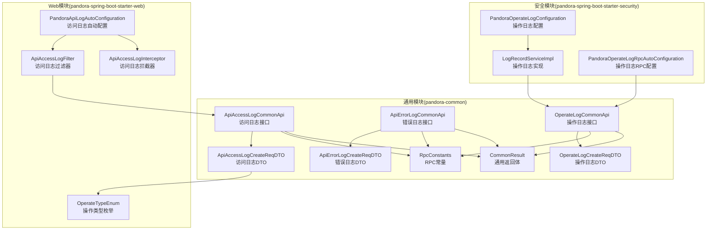
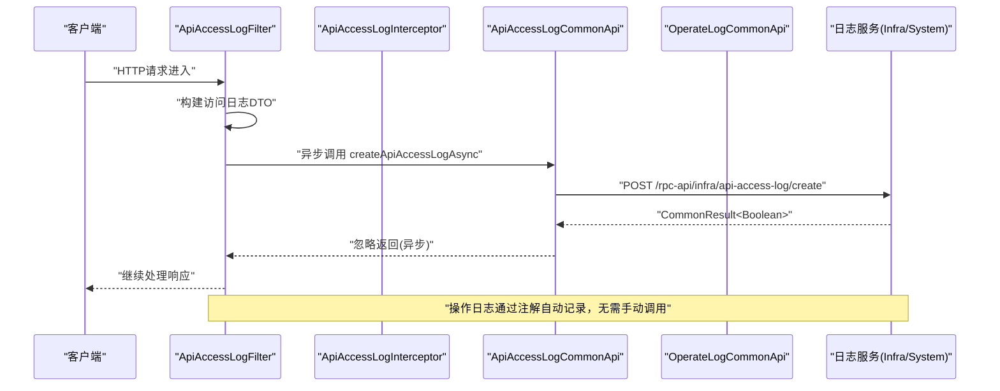
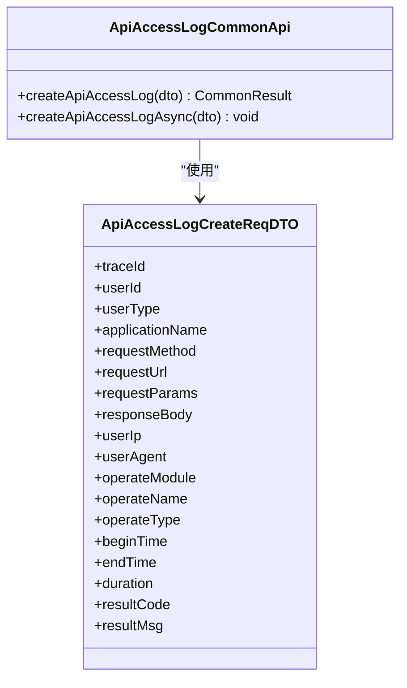
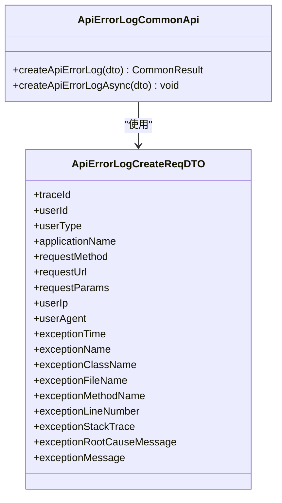
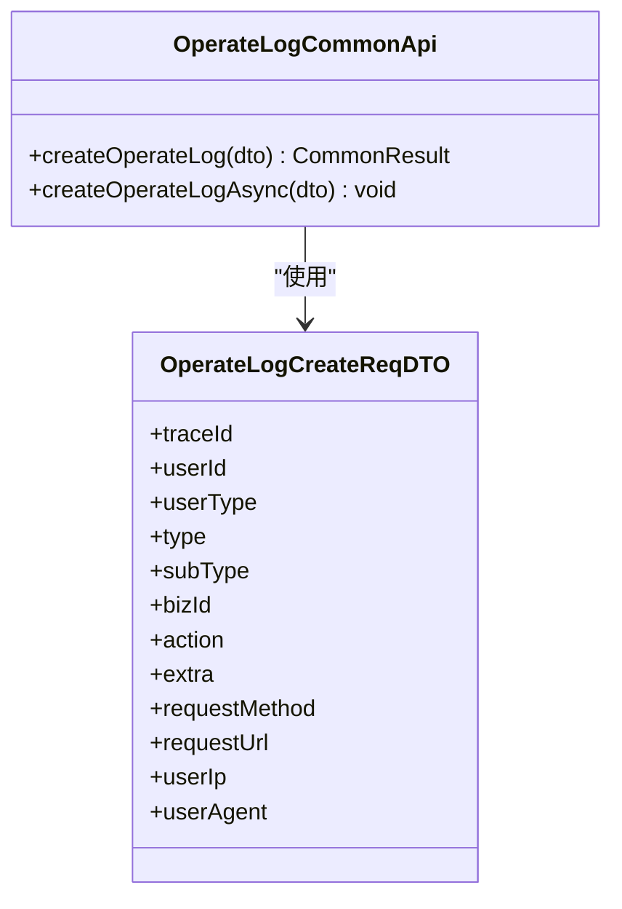
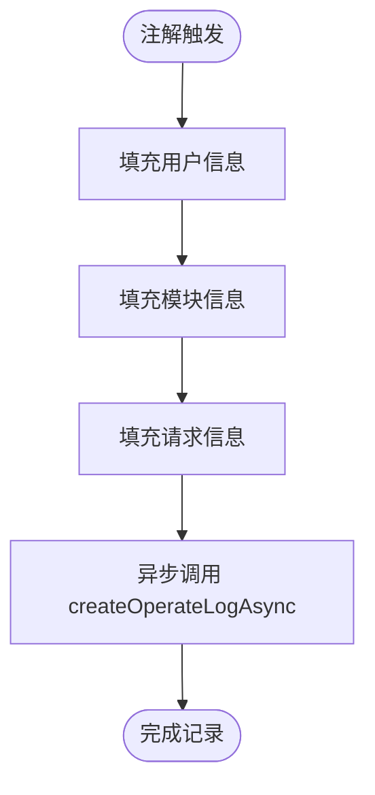
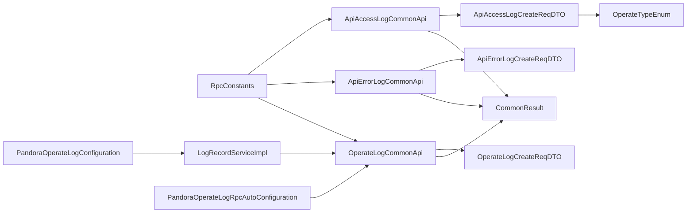

# 日志记录API

<cite>
**本文引用的文件**
- [ApiAccessLogCommonApi.java](file://pandora-framework/pandora-common/src/main/java/net/ittimeline/pandora/framework/common/biz/infra/logger/ApiAccessLogCommonApi.java)
- [ApiErrorLogCommonApi.java](file://pandora-framework/pandora-common/src/main/java/net/ittimeline/pandora/framework/common/biz/infra/logger/ApiErrorLogCommonApi.java)
- [OperateLogCommonApi.java](file://pandora-framework/pandora-common/src/main/java/net/ittimeline/pandora/framework/common/biz/system/logger/OperateLogCommonApi.java)
- [ApiAccessLogCreateReqDTO.java](file://pandora-framework/pandora-common/src/main/java/net/ittimeline/pandora/framework/common/biz/infra/logger/dto/ApiAccessLogCreateReqDTO.java)
- [ApiErrorLogCreateReqDTO.java](file://pandora-framework/pandora-common/src/main/java/net/ittimeline/pandora/framework/common/biz/infra/logger/dto/ApiErrorLogCreateReqDTO.java)
- [OperateLogCreateReqDTO.java](file://pandora-framework/pandora-common/src/main/java/net/ittimeline/pandora/framework/common/biz/system/logger/dto/OperateLogCreateReqDTO.java)
- [RpcConstants.java](file://pandora-framework/pandora-common/src/main/java/net/ittimeline/pandora/framework/common/constants/RpcConstants.java)
- [CommonResult.java](file://pandora-framework/pandora-common/src/main/java/net/ittimeline/pandora/framework/common/pojo/CommonResult.java)
- [OperateTypeEnum.java](file://pandora-framework/pandora-spring-boot-starter-web/src/main/java/net/ittimeline/pandora/framework/apilog/core/enums/OperateTypeEnum.java)
- [PandoraApiLogAutoConfiguration.java](file://pandora-framework/pandora-spring-boot-starter-web/src/main/java/net/ittimeline/pandora/framework/apilog/config/PandoraApiLogAutoConfiguration.java)
- [ApiAccessLogFilter.java](file://pandora-framework/pandora-spring-boot-starter-web/src/main/java/net/ittimeline/pandora/framework/apilog/core/filter/ApiAccessLogFilter.java)
- [ApiAccessLogInterceptor.java](file://pandora-framework/pandora-spring-boot-starter-web/src/main/java/net/ittimeline/pandora/framework/apilog/core/interceptor/ApiAccessLogInterceptor.java)
- [LogRecordServiceImpl.java](file://pandora-framework/pandora-spring-boot-starter-security/src/main/java/net/ittimeline/pandora/framework/operatelog/core/service/LogRecordServiceImpl.java)
- [PandoraOperateLogConfiguration.java](file://pandora-framework/pandora-spring-boot-starter-security/src/main/java/net/ittimeline/pandora/framework/operatelog/config/PandoraOperateLogConfiguration.java)
- [PandoraOperateLogRpcAutoConfiguration.java](file://pandora-framework/pandora-spring-boot-starter-security/src/main/java/net/ittimeline/pandora/framework/operatelog/config/PandoraOperateLogRpcAutoConfiguration.java)
</cite>

## 更新摘要
**变更内容**
- 新增系统操作日志接口：OperateLogCommonApi及其相关DTO
- 更新操作日志实现：基于LogRecordServiceImpl的注解驱动记录
- 新增操作日志配置：PandoraOperateLogConfiguration和PandoraOperateLogRpcAutoConfiguration
- 完善操作类型枚举：OperateTypeEnum支持多种操作类型
- 更新架构图和依赖关系分析以反映新的操作日志功能

## 目录
1. [简介](#简介)
2. [项目结构](#项目结构)
3. [核心组件](#核心组件)
4. [架构总览](#架构总览)
5. [详细组件分析](#详细组件分析)
6. [依赖关系分析](#依赖关系分析)
7. [性能考量](#性能考量)
8. [故障排查指南](#故障排查指南)
9. [结论](#结论)
10. [附录](#附录)

## 简介
本文件为日志记录API的全面接口文档，覆盖以下四类日志接口：
- API访问日志：ApiAccessLogCommonApi
- API错误日志：ApiErrorLogCommonApi
- 系统操作日志：OperateLogCommonApi（新增）
- 操作类型枚举：OperateTypeEnum（新增）

文档内容包括：
- 接口方法说明与使用方式
- 日志数据结构、字段定义与存储格式
- 请求示例（含日志级别、时间戳、用户信息、操作详情）
- 日志查询与批量写入的使用方法
- 最佳实践、性能优化建议与故障排查指南

## 项目结构
围绕日志记录API的相关模块与文件组织如下：
- 接口层：位于pandora-common模块，定义Feign接口与DTO
- 配置与拦截：位于pandora-spring-boot-starter-web模块，提供访问日志的自动装配与过滤器
- 安全与操作日志：位于pandora-spring-boot-starter-security模块，提供基于注解的操作日志记录能力
- 常量与通用返回：位于pandora-common模块，统一RPC服务名与返回体

**图表来源**
- [ApiAccessLogCommonApi.java:1-40](file://pandora-framework/pandora-common/src/main/java/net/ittimeline/pandora/framework/common/biz/infra/logger/ApiAccessLogCommonApi.java#L1-L40)
- [ApiErrorLogCommonApi.java:1-41](file://pandora-framework/pandora-common/src/main/java/net/ittimeline/pandora/framework/common/biz/infra/logger/ApiErrorLogCommonApi.java#L1-L41)
- [OperateLogCommonApi.java:1-41](file://pandora-framework/pandora-common/src/main/java/net/ittimeline/pandora/framework/common/biz/system/logger/OperateLogCommonApi.java#L1-L41)
- [PandoraOperateLogConfiguration.java:1-28](file://pandora-framework/pandora-spring-boot-starter-security/src/main/java/net/ittimeline/pandora/framework/operatelog/config/PandoraOperateLogConfiguration.java#L1-L28)

## 核心组件
本节对四大日志接口进行概览性说明，包括接口职责、端点路径、请求体与返回体约定。

- ApiAccessLogCommonApi
  - 功能：创建API访问日志
  - 端点：POST /rpc-api/infra/api-access-log/create
  - 请求体：ApiAccessLogCreateReqDTO
  - 返回体：CommonResult<Boolean>
  - 异步方法：createApiAccessLogAsync（内部通过异步线程池提交）

- ApiErrorLogCommonApi
  - 功能：创建API错误日志
  - 端点：POST /rpc-api/infra/api-error-log/create
  - 请求体：ApiErrorLogCreateReqDTO
  - 返回体：CommonResult<Boolean>
  - 异步方法：createApiErrorLogAsync

- OperateLogCommonApi（新增）
  - 功能：创建系统操作日志
  - 端点：POST /rpc-api/system/operate-log/create
  - 请求体：OperateLogCreateReqDTO
  - 返回体：CommonResult<Boolean>
  - 异步方法：createOperateLogAsync
  - 服务名：SYSTEM_NAME（system-server）

- OperateTypeEnum（新增）
  - 功能：定义操作类型枚举
  - 支持类型：GET（查询）、CREATE（新增）、UPDATE（修改）、DELETE（删除）、EXPORT（导出）、IMPORT（导入）、OTHER（其它）

**章节来源**
- [ApiAccessLogCommonApi.java:21-39](file://pandora-framework/pandora-common/src/main/java/net/ittimeline/pandora/framework/common/biz/infra/logger/ApiAccessLogCommonApi.java#L21-L39)
- [ApiErrorLogCommonApi.java:21-41](file://pandora-framework/pandora-common/src/main/java/net/ittimeline/pandora/framework/common/biz/infra/logger/ApiErrorLogCommonApi.java#L21-L41)
- [OperateLogCommonApi.java:21-41](file://pandora-framework/pandora-common/src/main/java/net/ittimeline/pandora/framework/common/biz/system/logger/OperateLogCommonApi.java#L21-L41)
- [OperateTypeEnum.java:13-52](file://pandora-framework/pandora-spring-boot-starter-web/src/main/java/net/ittimeline/pandora/framework/apilog/core/enums/OperateTypeEnum.java#L13-L52)

## 架构总览
日志记录的整体流程如下：
- Web层通过过滤器与拦截器收集请求上下文信息
- 将必要字段填充到对应的DTO对象
- 通过Feign接口异步调用对应日志服务，完成批量写入
- 返回统一的CommonResult<Boolean>结构
- 操作日志通过注解框架自动记录，无需手动调用

**图表来源**
- [ApiAccessLogFilter.java:88-100](file://pandora-framework/pandora-spring-boot-starter-web/src/main/java/net/ittimeline/pandora/framework/apilog/core/filter/ApiAccessLogFilter.java#L88-L100)
- [ApiAccessLogCommonApi.java:35-38](file://pandora-framework/pandora-common/src/main/java/net/ittimeline/pandora/framework/common/biz/infra/logger/ApiAccessLogCommonApi.java#L35-L38)
- [OperateLogCommonApi.java:36-39](file://pandora-framework/pandora-common/src/main/java/net/ittimeline/pandora/framework/common/biz/system/logger/OperateLogCommonApi.java#L36-L39)

## 详细组件分析

### API访问日志：ApiAccessLogCommonApi
- 接口职责
  - 提供创建API访问日志的RPC接口
  - 提供异步版本以降低请求延迟
- 端点与路径
  - 前缀：/rpc-api/infra/api-access-log
  - 方法：POST /create
- 请求体字段
  - 链路追踪编号、用户编号、用户类型、应用名、请求方法、访问地址、请求参数、响应结果、用户IP、UA
  - 操作模块、操作名、操作分类（枚举：查询/新增/修改/删除/导出/导入/其它）、开始/结束时间、耗时、结果码、结果提示
- 返回体
  - CommonResult<Boolean>，成功时data为true
- 异步调用
  - createApiAccessLogAsync内部调用同步接口后，通过checkError抛出异常以暴露错误

**图表来源**
- [ApiAccessLogCommonApi.java:21-39](file://pandora-framework/pandora-common/src/main/java/net/ittimeline/pandora/framework/common/biz/infra/logger/ApiAccessLogCommonApi.java#L21-L39)
- [ApiAccessLogCreateReqDTO.java:15-106](file://pandora-framework/pandora-common/src/main/java/net/ittimeline/pandora/framework/common/biz/infra/logger/dto/ApiAccessLogCreateReqDTO.java#L15-L106)

**章节来源**
- [ApiAccessLogCommonApi.java:21-39](file://pandora-framework/pandora-common/src/main/java/net/ittimeline/pandora/framework/common/biz/infra/logger/ApiAccessLogCommonApi.java#L21-L39)
- [ApiAccessLogCreateReqDTO.java:15-106](file://pandora-framework/pandora-common/src/main/java/net/ittimeline/pandora/framework/common/biz/infra/logger/dto/ApiAccessLogCreateReqDTO.java#L15-L106)

### API错误日志：ApiErrorLogCommonApi
- 接口职责
  - 提供创建API错误日志的RPC接口
  - 提供异步版本
- 端点与路径
  - 前缀：/rpc-api/infra/api-error-log
  - 方法：POST /create
- 请求体字段
  - 链路追踪编号、用户编号、用户类型、应用名、请求方法、访问地址、请求参数、用户IP、UA
  - 异常时间、异常名、异常类全名、类文件、方法名、行号、栈轨迹、根因消息、异常消息
- 返回体
  - CommonResult<Boolean>

**图表来源**
- [ApiErrorLogCommonApi.java:21-41](file://pandora-framework/pandora-common/src/main/java/net/ittimeline/pandora/framework/common/biz/infra/logger/ApiErrorLogCommonApi.java#L21-L41)
- [ApiErrorLogCreateReqDTO.java:16-74](file://pandora-framework/pandora-common/src/main/java/net/ittimeline/pandora/framework/common/biz/infra/logger/dto/ApiErrorLogCreateReqDTO.java#L16-L74)

**章节来源**
- [ApiErrorLogCommonApi.java:21-41](file://pandora-framework/pandora-common/src/main/java/net/ittimeline/pandora/framework/common/biz/infra/logger/ApiErrorLogCommonApi.java#L21-L41)
- [ApiErrorLogCreateReqDTO.java:16-74](file://pandora-framework/pandora-common/src/main/java/net/ittimeline/pandora/framework/common/biz/infra/logger/dto/ApiErrorLogCreateReqDTO.java#L16-L74)

### 系统操作日志：OperateLogCommonApi（新增）
- 接口职责
  - 提供创建系统操作日志的RPC接口
  - 提供异步版本
  - 服务名：SYSTEM_NAME（system-server）
- 端点与路径
  - 前缀：/rpc-api/system/operate-log
  - 方法：POST /create
- 请求体字段
  - 链路追踪编号、用户编号、用户类型、操作模块类型、操作子类型、业务编号、操作内容、扩展字段
  - 请求方法、访问地址、用户IP、UA
- 返回体
  - CommonResult<Boolean>
- 关联枚举
  - 操作类型枚举OperateTypeEnum，支持查询/新增/修改/删除/导出/导入/其它

**图表来源**
- [OperateLogCommonApi.java:21-41](file://pandora-framework/pandora-common/src/main/java/net/ittimeline/pandora/framework/common/biz/system/logger/OperateLogCommonApi.java#L21-L41)
- [OperateLogCreateReqDTO.java:15-58](file://pandora-framework/pandora-common/src/main/java/net/ittimeline/pandora/framework/common/biz/system/logger/dto/OperateLogCreateReqDTO.java#L15-L58)

**章节来源**
- [OperateLogCommonApi.java:21-41](file://pandora-framework/pandora-common/src/main/java/net/ittimeline/pandora/framework/common/biz/system/logger/OperateLogCommonApi.java#L21-L41)
- [OperateLogCreateReqDTO.java:15-58](file://pandora-framework/pandora-common/src/main/java/net/ittimeline/pandora/framework/common/biz/system/logger/dto/OperateLogCreateReqDTO.java#L15-L58)
- [OperateTypeEnum.java:13-52](file://pandora-framework/pandora-spring-boot-starter-web/src/main/java/net/ittimeline/pandora/framework/apilog/core/enums/OperateTypeEnum.java#L13-L52)

### 操作日志实现与配置（新增）
- 自动配置
  - 通过PandoraOperateLogConfiguration启用注解驱动的日志记录
  - 通过PandoraOperateLogRpcAutoConfiguration启用Feign客户端
- 实现类
  - LogRecordServiceImpl基于注解框架记录操作日志，并通过OperateLogCommonApi写入
  - 自动填充用户信息、模块信息和请求信息
- 注解使用
  - 通过@EnableLogRecord注解启用日志记录功能
  - 支持类型化查询，但当前实现抛出UnsupportedOperationException

**图表来源**
- [PandoraOperateLogConfiguration.java:18-27](file://pandora-framework/pandora-spring-boot-starter-security/src/main/java/net/ittimeline/pandora/framework/operatelog/config/PandoraOperateLogConfiguration.java#L18-L27)
- [LogRecordServiceImpl.java:32-50](file://pandora-framework/pandora-spring-boot-starter-security/src/main/java/net/ittimeline/pandora/framework/operatelog/core/service/LogRecordServiceImpl.java#L32-L50)

**章节来源**
- [PandoraOperateLogConfiguration.java:18-27](file://pandora-framework/pandora-spring-boot-starter-security/src/main/java/net/ittimeline/pandora/framework/operatelog/config/PandoraOperateLogConfiguration.java#L18-L27)
- [PandoraOperateLogRpcAutoConfiguration.java:14-17](file://pandora-framework/pandora-spring-boot-starter-security/src/main/java/net/ittimeline/pandora/framework/operatelog/config/PandoraOperateLogRpcAutoConfiguration.java#L14-L17)
- [LogRecordServiceImpl.java:26-94](file://pandora-framework/pandora-spring-boot-starter-security/src/main/java/net/ittimeline/pandora/framework/operatelog/core/service/LogRecordServiceImpl.java#L26-L94)

## 依赖关系分析
- 接口依赖
  - 三大接口均依赖RpcConstants定义的服务名与前缀
  - 返回体统一使用CommonResult<Boolean>
  - 操作日志接口依赖SYSTEM_NAME服务名
- Web层依赖
  - ApiAccessLogCommonApi被ApiAccessLogFilter调用
  - 操作日志通过LogRecordServiceImpl间接依赖OperateLogCommonApi
- 枚举依赖
  - ApiAccessLogCreateReqDTO中的操作分类字段参考OperateTypeEnum
  - 操作日志实现依赖注解框架进行自动记录

**图表来源**
- [RpcConstants.java:12-42](file://pandora-framework/pandora-common/src/main/java/net/ittimeline/pandora/framework/common/constants/RpcConstants.java#L12-L42)
- [OperateLogCommonApi.java:21-41](file://pandora-framework/pandora-common/src/main/java/net/ittimeline/pandora/framework/common/biz/system/logger/OperateLogCommonApi.java#L21-L41)
- [LogRecordServiceImpl.java:29-30](file://pandora-framework/pandora-spring-boot-starter-security/src/main/java/net/ittimeline/pandora/framework/operatelog/core/service/LogRecordServiceImpl.java#L29-L30)

**章节来源**
- [RpcConstants.java:12-42](file://pandora-framework/pandora-common/src/main/java/net/ittimeline/pandora/framework/common/constants/RpcConstants.java#L12-L42)
- [ApiAccessLogCommonApi.java:21-39](file://pandora-framework/pandora-common/src/main/java/net/ittimeline/pandora/framework/common/biz/infra/logger/ApiAccessLogCommonApi.java#L21-L39)
- [ApiErrorLogCommonApi.java:21-41](file://pandora-framework/pandora-common/src/main/java/net/ittimeline/pandora/framework/common/biz/infra/logger/ApiErrorLogCommonApi.java#L21-L41)
- [OperateLogCommonApi.java:21-41](file://pandora-framework/pandora-common/src/main/java/net/ittimeline/pandora/framework/common/biz/system/logger/OperateLogCommonApi.java#L21-L41)
- [LogRecordServiceImpl.java:29-30](file://pandora-framework/pandora-spring-boot-starter-security/src/main/java/net/ittimeline/pandora/framework/operatelog/core/service/LogRecordServiceImpl.java#L29-L30)

## 性能考量
- 异步写入
  - 三大接口均提供异步方法，避免阻塞主业务线程
  - 操作日志通过注解框架自动异步记录，无需手动处理
- 过滤器与拦截器
  - ApiAccessLogInterceptor仅在非生产环境打印请求/响应，减少生产环境日志开销
  - 操作日志实现自动处理，无需额外配置
- 敏感信息脱敏
  - ApiAccessLogFilter对常见敏感字段进行脱敏处理，降低泄露风险
- 批量写入
  - 当前接口为单条写入；如需更高吞吐，可在下游服务侧引入批量写入或缓冲队列策略（建议在服务端实现，不在客户端接口层面改动）

## 故障排查指南
- 返回体校验
  - 使用CommonResult<Boolean>时，可通过isSuccess()/isError()判断状态；checkError()会在失败时抛出业务异常
- 异步调用异常
  - 异步方法内部通过checkError()抛出异常，便于快速定位问题
  - 操作日志异步调用异常会在LogRecordServiceImpl中记录错误日志
- 访问日志未记录
  - 检查配置项pandora.access-log.enable是否开启
  - 检查目标方法是否标注了@ApiAccessLog且enable为true
- 操作日志未记录
  - 检查是否启用了@EnableLogRecord注解
  - 检查方法是否正确标注了@LogRecord注解
  - 检查PandoraOperateLogConfiguration是否正确加载
- 字段缺失或为空
  - 访问日志与错误日志DTO均包含@NotNull/@NotEmpty约束，确保必填字段完整
  - 操作日志DTO同样包含严格的字段验证
- 操作类型不匹配
  - 操作日志的operateType需符合OperateTypeEnum枚举定义

**章节来源**
- [CommonResult.java:86-122](file://pandora-framework/pandora-common/src/main/java/net/ittimeline/pandora/framework/common/pojo/CommonResult.java#L86-L122)
- [LogRecordServiceImpl.java:46-49](file://pandora-framework/pandora-spring-boot-starter-security/src/main/java/net/ittimeline/pandora/framework/operatelog/core/service/LogRecordServiceImpl.java#L46-L49)
- [PandoraOperateLogConfiguration.java:18-27](file://pandora-framework/pandora-spring-boot-starter-security/src/main/java/net/ittimeline/pandora/framework/operatelog/config/PandoraOperateLogConfiguration.java#L18-L27)

## 结论
本文档系统梳理了日志记录API的四大接口及其配套的数据结构、自动配置与运行机制。通过异步写入与过滤器拦截，既能保障业务性能，又能满足可观测性需求。新增的操作日志功能通过注解驱动实现了自动化记录，大大简化了开发工作量。建议在实际使用中结合配置项与枚举规范，确保日志数据的完整性与一致性。

## 附录

### 字段定义与存储格式
- 通用返回体
  - code：整数，错误码
  - msg：字符串，错误信息
  - data：布尔值，true表示成功
- 访问日志字段
  - 时间类：beginTime、endTime（LocalDateTime），duration（毫秒）
  - 结果类：resultCode（整数），resultMsg（字符串）
  - 用户类：userId（Long），userType（整数），userIp（字符串），userAgent（字符串）
  - 应用与请求：applicationName（字符串），requestMethod（字符串），requestUrl（字符串），requestParams（字符串），responseBody（字符串）
  - 操作类：operateModule（字符串），operateName（字符串），operateType（整数，参考枚举）
- 错误日志字段
  - 时间与异常：exceptionTime（LocalDateTime），exceptionName（字符串），exceptionClassName（字符串），exceptionFileName（字符串），exceptionMethodName（字符串），exceptionLineNumber（整数）
  - 栈与根因：exceptionStackTrace（字符串），exceptionRootCauseMessage（字符串），exceptionMessage（字符串）
  - 请求上下文：applicationName、requestMethod、requestUrl、requestParams、userIp、userAgent
- 操作日志字段（新增）
  - 用户与上下文：userId、userType、traceId、requestMethod、requestUrl、userIp、userAgent
  - 业务与动作：type（模块类型）、subType（子类型）、bizId（业务编号）、action（操作内容）、extra（扩展JSON）
  - 操作类型：operateType（参考OperateTypeEnum枚举）

**章节来源**
- [CommonResult.java:21-123](file://pandora-framework/pandora-common/src/main/java/net/ittimeline/pandora/framework/common/pojo/CommonResult.java#L21-L123)
- [ApiAccessLogCreateReqDTO.java:15-106](file://pandora-framework/pandora-common/src/main/java/net/ittimeline/pandora/framework/common/biz/infra/logger/dto/ApiAccessLogCreateReqDTO.java#L15-L106)
- [ApiErrorLogCreateReqDTO.java:16-74](file://pandora-framework/pandora-common/src/main/java/net/ittimeline/pandora/framework/common/biz/infra/logger/dto/ApiErrorLogCreateReqDTO.java#L16-L74)
- [OperateLogCreateReqDTO.java:15-58](file://pandora-framework/pandora-common/src/main/java/net/ittimeline/pandora/framework/common/biz/system/logger/dto/OperateLogCreateReqDTO.java#L15-L58)

### 请求示例（字段说明）
- 访问日志
  - 必填：applicationName、requestMethod、requestUrl、userIp、userAgent、beginTime、endTime、duration、resultCode
  - 可选：requestParams、responseBody、operateModule、operateName、operateType
- 错误日志
  - 必填：applicationName、requestMethod、requestUrl、requestParams、userIp、userAgent、exceptionTime、exceptionName、exceptionClassName、exceptionFileName、exceptionMethodName、exceptionLineNumber、exceptionStackTrace、exceptionRootCauseMessage、exceptionMessage
- 操作日志（新增）
  - 必填：userId、userType、type、subType、bizId、action、requestMethod、requestUrl、userIp、userAgent
  - 可选：traceId、extra

**章节来源**
- [ApiAccessLogCreateReqDTO.java:15-106](file://pandora-framework/pandora-common/src/main/java/net/ittimeline/pandora/framework/common/biz/infra/logger/dto/ApiAccessLogCreateReqDTO.java#L15-L106)
- [ApiErrorLogCreateReqDTO.java:16-74](file://pandora-framework/pandora-common/src/main/java/net/ittimeline/pandora/framework/common/biz/infra/logger/dto/ApiErrorLogCreateReqDTO.java#L16-L74)
- [OperateLogCreateReqDTO.java:15-58](file://pandora-framework/pandora-common/src/main/java/net/ittimeline/pandora/framework/common/biz/system/logger/dto/OperateLogCreateReqDTO.java#L15-L58)

### 查询与批量写入
- 查询
  - 操作日志查询：当前实现通过注解框架记录，查询能力由外部系统或下游服务提供
  - 当前实现抛出UnsupportedOperationException，需要在下游服务中实现具体查询逻辑
- 批量写入
  - 当前接口为单条写入；如需批量写入，建议在服务端实现批量接口并在客户端按批次提交
  - 操作日志通过注解框架自动记录，无需手动实现批量写入

**章节来源**
- [LogRecordServiceImpl.java:83-91](file://pandora-framework/pandora-spring-boot-starter-security/src/main/java/net/ittimeline/pandora/framework/operatelog/core/service/LogRecordServiceImpl.java#L83-L91)