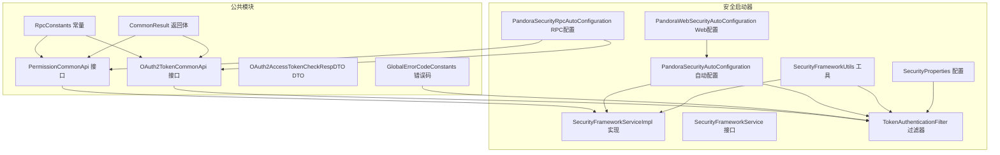
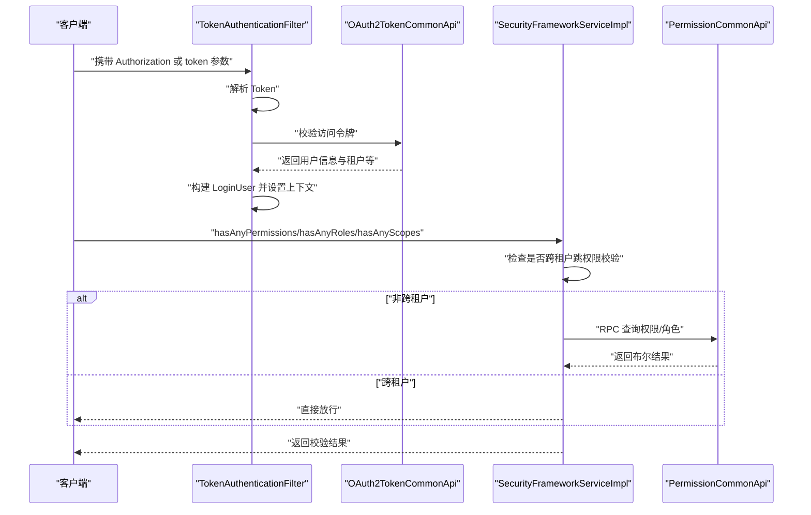
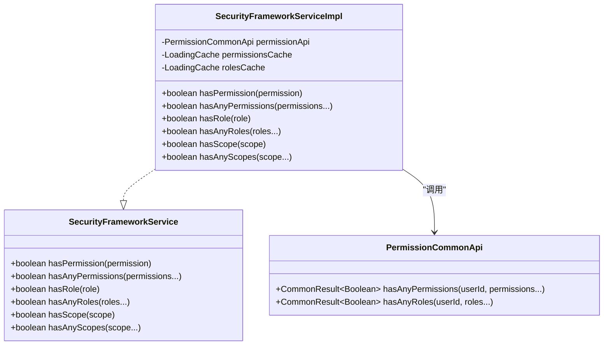
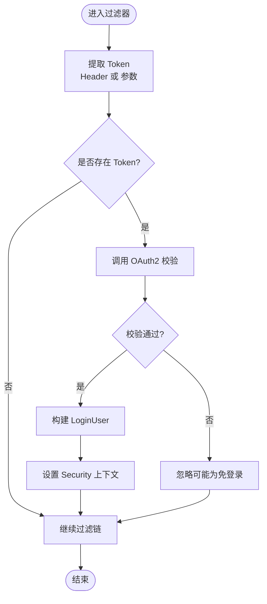
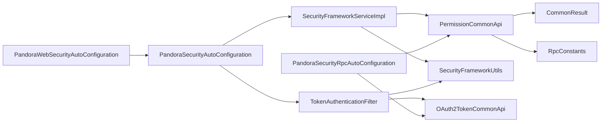

# 权限管理API

<cite>
**本文档引用的文件**
- [PermissionCommonApi.java](file://pandora-framework/pandora-common/src/main/java/net/ittimeline/pandora/framework/common/biz/system/permission/PermissionCommonApi.java)
- [SecurityFrameworkService.java](file://pandora-framework/pandora-spring-boot-starter-security/src/main/java/net/ittimeline/pandora/framework/security/core/service/SecurityFrameworkService.java)
- [SecurityFrameworkServiceImpl.java](file://pandora-framework/pandora-spring-boot-starter-security/src/main/java/net/ittimeline/pandora/framework/security/core/service/SecurityFrameworkServiceImpl.java)
- [TokenAuthenticationFilter.java](file://pandora-framework/pandora-spring-boot-starter-security/src/main/java/net/ittimeline/pandora/framework/security/core/filter/TokenAuthenticationFilter.java)
- [PandoraSecurityAutoConfiguration.java](file://pandora-framework/pandora-spring-boot-starter-security/src/main/java/net/ittimeline/pandora/framework/security/config/PandoraSecurityAutoConfiguration.java)
- [PandoraWebSecurityAutoConfiguration.java](file://pandora-framework/pandora-spring-boot-starter-security/src/main/java/net/ittimeline/pandora/framework/security/config/PandoraWebSecurityAutoConfiguration.java)
- [SecurityProperties.java](file://pandora-framework/pandora-spring-boot-starter-security/src/main/java/net/ittimeline/pandora/framework/security/config/SecurityProperties.java)
- [SecurityFrameworkUtils.java](file://pandora-framework/pandora-spring-boot-starter-security/src/main/java/net/ittimeline/pandora/framework/security/core/util/SecurityFrameworkUtils.java)
- [RpcConstants.java](file://pandora-framework/pandora-common/src/main/java/net/ittimeline/pandora/framework/common/constants/RpcConstants.java)
- [CommonResult.java](file://pandora-framework/pandora-common/src/main/java/net/ittimeline/pandora/framework/common/pojo/CommonResult.java)
- [OAuth2TokenCommonApi.java](file://pandora-framework/pandora-common/src/main/java/net/ittimeline/pandora/framework/common/biz/system/oauth2/OAuth2TokenCommonApi.java)
- [OAuth2AccessTokenCheckRespDTO.java](file://pandora-framework/pandora-common/src/main/java/net/ittimeline/pandora/framework/common/biz/system/oauth2/dto/OAuth2AccessTokenCheckRespDTO.java)
- [GlobalErrorCodeConstants.java](file://pandora-framework/pandora-common/src/main/java/net/ittimeline/pandora/framework/common/exception/enums/GlobalErrorCodeConstants.java)
- [PandoraSecurityRpcAutoConfiguration.java](file://pandora-framework/pandora-spring-boot-starter-security/src/main/java/net/ittimeline/pandora/framework/security/config/PandoraSecurityRpcAutoConfiguration.java)
</cite>

## 目录
1. [简介](#简介)
2. [项目结构](#项目结构)
3. [核心组件](#核心组件)
4. [架构总览](#架构总览)
5. [详细组件分析](#详细组件分析)
6. [依赖关系分析](#依赖关系分析)
7. [性能考量](#性能考量)
8. [故障排查指南](#故障排查指南)
9. [结论](#结论)
10. [附录](#附录)

## 简介
本文件为权限管理API的完整接口文档，聚焦于PermissionCommonApi接口及其在Spring Security框架中的集成方式。文档覆盖以下内容：
- 权限验证、资源访问控制与用户权限检查的API定义
- 请求参数、响应格式与错误码规范
- 与Spring Security的集成流程与权限注解使用建议
- 权限相关的RESTful API示例与最佳实践

## 项目结构
权限管理相关代码分布在公共模块与安全启动器模块中：
- 公共模块提供通用的权限API接口与基础返回体
- 安全启动器模块提供Spring Security集成、过滤器、上下文工具与自动配置

图表来源
- [PermissionCommonApi.java:1-46](file://pandora-framework/pandora-common/src/main/java/net/ittimeline/pandora/framework/common/biz/system/permission/PermissionCommonApi.java#L1-L46)
- [SecurityFrameworkServiceImpl.java:1-124](file://pandora-framework/pandora-spring-boot-starter-security/src/main/java/net/ittimeline/pandora/framework/security/core/service/SecurityFrameworkServiceImpl.java#L1-L124)
- [TokenAuthenticationFilter.java:1-157](file://pandora-framework/pandora-spring-boot-starter-security/src/main/java/net/ittimeline/pandora/framework/security/core/filter/TokenAuthenticationFilter.java#L1-L157)
- [PandoraSecurityAutoConfiguration.java:1-98](file://pandora-framework/pandora-spring-boot-starter-security/src/main/java/net/ittimeline/pandora/framework/security/config/PandoraSecurityAutoConfiguration.java#L1-L98)
- [PandoraWebSecurityAutoConfiguration.java:127-183](file://pandora-framework/pandora-spring-boot-starter-security/src/main/java/net/ittimeline/pandora/framework/security/config/PandoraWebSecurityAutoConfiguration.java#L127-L183)
- [SecurityFrameworkUtils.java:1-163](file://pandora-framework/pandora-spring-boot-starter-security/src/main/java/net/ittimeline/pandora/framework/security/core/util/SecurityFrameworkUtils.java#L1-L163)
- [SecurityProperties.java:1-58](file://pandora-framework/pandora-spring-boot-starter-security/src/main/java/net/ittimeline/pandora/framework/security/config/SecurityProperties.java#L1-L58)
- [RpcConstants.java:1-42](file://pandora-framework/pandora-common/src/main/java/net/ittimeline/pandora/framework/common/constants/RpcConstants.java#L1-L42)
- [CommonResult.java:1-123](file://pandora-framework/pandora-common/src/main/java/net/ittimeline/pandora/framework/common/pojo/CommonResult.java#L1-L123)
- [OAuth2TokenCommonApi.java:1-34](file://pandora-framework/pandora-common/src/main/java/net/ittimeline/pandora/framework/common/biz/system/oauth2/OAuth2TokenCommonApi.java#L1-L34)
- [OAuth2AccessTokenCheckRespDTO.java:1-39](file://pandora-framework/pandora-common/src/main/java/net/ittimeline/pandora/framework/common/biz/system/oauth2/dto/OAuth2AccessTokenCheckRespDTO.java#L1-L39)
- [GlobalErrorCodeConstants.java:1-42](file://pandora-framework/pandora-common/src/main/java/net/ittimeline/pandora/framework/common/exception/enums/GlobalErrorCodeConstants.java#L1-L42)
- [PandoraSecurityRpcAutoConfiguration.java:1-26](file://pandora-framework/pandora-spring-boot-starter-security/src/main/java/net/ittimeline/pandora/framework/security/config/PandoraSecurityRpcAutoConfiguration.java#L1-L26)

章节来源
- [PermissionCommonApi.java:1-46](file://pandora-framework/pandora-common/src/main/java/net/ittimeline/pandora/framework/common/biz/system/permission/PermissionCommonApi.java#L1-L46)
- [SecurityFrameworkServiceImpl.java:1-124](file://pandora-framework/pandora-spring-boot-starter-security/src/main/java/net/ittimeline/pandora/framework/security/core/service/SecurityFrameworkServiceImpl.java#L1-L124)
- [TokenAuthenticationFilter.java:1-157](file://pandora-framework/pandora-spring-boot-starter-security/src/main/java/net/ittimeline/pandora/framework/security/core/filter/TokenAuthenticationFilter.java#L1-L157)
- [PandoraSecurityAutoConfiguration.java:1-98](file://pandora-framework/pandora-spring-boot-starter-security/src/main/java/net/ittimeline/pandora/framework/security/config/PandoraSecurityAutoConfiguration.java#L1-L98)
- [PandoraWebSecurityAutoConfiguration.java:127-183](file://pandora-framework/pandora-spring-boot-starter-security/src/main/java/net/ittimeline/pandora/framework/security/config/PandoraWebSecurityAutoConfiguration.java#L127-L183)
- [SecurityFrameworkUtils.java:1-163](file://pandora-framework/pandora-spring-boot-starter-security/src/main/java/net/ittimeline/pandora/framework/security/core/util/SecurityFrameworkUtils.java#L1-L163)
- [SecurityProperties.java:1-58](file://pandora-framework/pandora-spring-boot-starter-security/src/main/java/net/ittimeline/pandora/framework/security/config/SecurityProperties.java#L1-L58)
- [RpcConstants.java:1-42](file://pandora-framework/pandora-common/src/main/java/net/ittimeline/pandora/framework/common/constants/RpcConstants.java#L1-L42)
- [CommonResult.java:1-123](file://pandora-framework/pandora-common/src/main/java/net/ittimeline/pandora/framework/common/pojo/CommonResult.java#L1-L123)
- [OAuth2TokenCommonApi.java:1-34](file://pandora-framework/pandora-common/src/main/java/net/ittimeline/pandora/framework/common/biz/system/oauth2/OAuth2TokenCommonApi.java#L1-L34)
- [OAuth2AccessTokenCheckRespDTO.java:1-39](file://pandora-framework/pandora-common/src/main/java/net/ittimeline/pandora/framework/common/biz/system/oauth2/dto/OAuth2AccessTokenCheckRespDTO.java#L1-L39)
- [GlobalErrorCodeConstants.java:1-42](file://pandora-framework/pandora-common/src/main/java/net/ittimeline/pandora/framework/common/exception/enums/GlobalErrorCodeConstants.java#L1-L42)
- [PandoraSecurityRpcAutoConfiguration.java:1-26](file://pandora-framework/pandora-spring-boot-starter-security/src/main/java/net/ittimeline/pandora/framework/security/config/PandoraSecurityRpcAutoConfiguration.java#L1-L26)

## 核心组件
- PermissionCommonApi：定义权限与角色的远程校验接口，供安全框架调用
- SecurityFrameworkService/SecurityFrameworkServiceImpl：封装权限校验逻辑，支持权限、角色、授权范围的判断，并内置缓存
- TokenAuthenticationFilter：基于Token或Header透传构建LoginUser，注入Spring Security上下文
- SecurityFrameworkUtils：提供获取当前用户、设置用户上下文、跨租户跳权限校验等工具方法
- SecurityProperties：配置Token头、参数名、Mock开关与免登录URL等
- OAuth2TokenCommonApi：校验访问令牌，返回用户类型、租户、授权范围等信息
- CommonResult/GlobalErrorCodeConstants：统一响应体与错误码

章节来源
- [PermissionCommonApi.java:1-46](file://pandora-framework/pandora-common/src/main/java/net/ittimeline/pandora/framework/common/biz/system/permission/PermissionCommonApi.java#L1-L46)
- [SecurityFrameworkService.java:1-60](file://pandora-framework/pandora-spring-boot-starter-security/src/main/java/net/ittimeline/pandora/framework/security/core/service/SecurityFrameworkService.java#L1-L60)
- [SecurityFrameworkServiceImpl.java:1-124](file://pandora-framework/pandora-spring-boot-starter-security/src/main/java/net/ittimeline/pandora/framework/security/core/service/SecurityFrameworkServiceImpl.java#L1-L124)
- [TokenAuthenticationFilter.java:1-157](file://pandora-framework/pandora-spring-boot-starter-security/src/main/java/net/ittimeline/pandora/framework/security/core/filter/TokenAuthenticationFilter.java#L1-L157)
- [SecurityFrameworkUtils.java:1-163](file://pandora-framework/pandora-spring-boot-starter-security/src/main/java/net/ittimeline/pandora/framework/security/core/util/SecurityFrameworkUtils.java#L1-L163)
- [SecurityProperties.java:1-58](file://pandora-framework/pandora-spring-boot-starter-security/src/main/java/net/ittimeline/pandora/framework/security/config/SecurityProperties.java#L1-L58)
- [OAuth2TokenCommonApi.java:1-34](file://pandora-framework/pandora-common/src/main/java/net/ittimeline/pandora/framework/common/biz/system/oauth2/OAuth2TokenCommonApi.java#L1-L34)
- [CommonResult.java:1-123](file://pandora-framework/pandora-common/src/main/java/net/ittimeline/pandora/framework/common/pojo/CommonResult.java#L1-L123)
- [GlobalErrorCodeConstants.java:1-42](file://pandora-framework/pandora-common/src/main/java/net/ittimeline/pandora/framework/common/exception/enums/GlobalErrorCodeConstants.java#L1-L42)

## 架构总览
权限管理的整体流程如下：
- 请求进入，TokenAuthenticationFilter提取Token或Header透传的LoginUser
- 若存在Token，调用OAuth2TokenCommonApi校验令牌，构建LoginUser并设置到Security上下文
- 业务层通过SecurityFrameworkService进行权限/角色/授权范围校验
- SecurityFrameworkServiceImpl内部缓存权限与角色校验结果，减少RPC调用
- 权限不足或未登录分别返回403与401

图表来源
- [TokenAuthenticationFilter.java:1-157](file://pandora-framework/pandora-spring-boot-starter-security/src/main/java/net/ittimeline/pandora/framework/security/core/filter/TokenAuthenticationFilter.java#L1-L157)
- [OAuth2TokenCommonApi.java:1-34](file://pandora-framework/pandora-common/src/main/java/net/ittimeline/pandora/framework/common/biz/system/oauth2/OAuth2TokenCommonApi.java#L1-L34)
- [SecurityFrameworkServiceImpl.java:1-124](file://pandora-framework/pandora-spring-boot-starter-security/src/main/java/net/ittimeline/pandora/framework/security/core/service/SecurityFrameworkServiceImpl.java#L1-L124)
- [PermissionCommonApi.java:1-46](file://pandora-framework/pandora-common/src/main/java/net/ittimeline/pandora/framework/common/biz/system/permission/PermissionCommonApi.java#L1-L46)

## 详细组件分析

### PermissionCommonApi 接口
- 作用：提供权限与角色的远程校验能力，供安全框架调用
- 基础路径：由RpcConstants.SYSTEM_PREFIX与"/permission"组合
- 方法：
  - hasAnyPermissions(userId, permissions...)：判断用户是否拥有任一给定权限
  - hasAnyRoles(userId, roles...)：判断用户是否拥有任一给定角色
- 返回：统一包装为CommonResult<Boolean>

请求参数与响应格式
- 请求参数
  - userId：Long，用户编号，必填
  - permissions/roles：String...，权限或角色数组，必填
- 响应
  - code：Integer，0表示成功；非0为错误码
  - msg：String，描述信息
  - data：Boolean，true/false

错误码参考
- 成功：0
- 未登录：401
- 没有权限：403
- 服务器异常：500

章节来源
- [PermissionCommonApi.java:1-46](file://pandora-framework/pandora-common/src/main/java/net/ittimeline/pandora/framework/common/biz/system/permission/PermissionCommonApi.java#L1-L46)
- [RpcConstants.java:1-42](file://pandora-framework/pandora-common/src/main/java/net/ittimeline/pandora/framework/common/constants/RpcConstants.java#L1-L42)
- [CommonResult.java:1-123](file://pandora-framework/pandora-common/src/main/java/net/ittimeline/pandora/framework/common/pojo/CommonResult.java#L1-L123)
- [GlobalErrorCodeConstants.java:1-42](file://pandora-framework/pandora-common/src/main/java/net/ittimeline/pandora/framework/common/exception/enums/GlobalErrorCodeConstants.java#L1-L42)

### SecurityFrameworkService 与 SecurityFrameworkServiceImpl
- SecurityFrameworkService：定义hasPermission、hasAnyPermissions、hasRole、hasAnyRoles、hasScope、hasAnyScopes等方法
- SecurityFrameworkServiceImpl：
  - 内置缓存：针对hasAnyPermissions与hasAnyRoles使用LoadingCache，1分钟过期
  - 跨租户跳权限校验：当访问租户与当前租户不一致时，直接放行
  - 角色/权限校验：从Security上下文获取userId，调用PermissionCommonApi
  - 授权范围校验：直接比较LoginUser.scopes与scope数组

图表来源
- [SecurityFrameworkService.java:1-60](file://pandora-framework/pandora-spring-boot-starter-security/src/main/java/net/ittimeline/pandora/framework/security/core/service/SecurityFrameworkService.java#L1-L60)
- [SecurityFrameworkServiceImpl.java:1-124](file://pandora-framework/pandora-spring-boot-starter-security/src/main/java/net/ittimeline/pandora/framework/security/core/service/SecurityFrameworkServiceImpl.java#L1-L124)
- [PermissionCommonApi.java:1-46](file://pandora-framework/pandora-common/src/main/java/net/ittimeline/pandora/framework/common/biz/system/permission/PermissionCommonApi.java#L1-L46)

章节来源
- [SecurityFrameworkService.java:1-60](file://pandora-framework/pandora-spring-boot-starter-security/src/main/java/net/ittimeline/pandora/framework/security/core/service/SecurityFrameworkService.java#L1-L60)
- [SecurityFrameworkServiceImpl.java:1-124](file://pandora-framework/pandora-spring-boot-starter-security/src/main/java/net/ittimeline/pandora/framework/security/core/service/SecurityFrameworkServiceImpl.java#L1-L124)

### TokenAuthenticationFilter 与 OAuth2 校验
- 提取Token：优先从Header Authorization中获取，其次从token参数
- 校验Token：调用OAuth2TokenCommonApi.checkAccessToken，返回用户类型、租户、授权范围等
- 构建上下文：将LoginUser设置到SecurityContextHolder，并同步到请求上下文
- Mock模式：支持基于配置的测试模式，便于本地调试

图表来源
- [TokenAuthenticationFilter.java:1-157](file://pandora-framework/pandora-spring-boot-starter-security/src/main/java/net/ittimeline/pandora/framework/security/core/filter/TokenAuthenticationFilter.java#L1-L157)
- [OAuth2TokenCommonApi.java:1-34](file://pandora-framework/pandora-common/src/main/java/net/ittimeline/pandora/framework/common/biz/system/oauth2/OAuth2TokenCommonApi.java#L1-L34)
- [OAuth2AccessTokenCheckRespDTO.java:1-39](file://pandora-framework/pandora-common/src/main/java/net/ittimeline/pandora/framework/common/biz/system/oauth2/dto/OAuth2AccessTokenCheckRespDTO.java#L1-L39)

章节来源
- [TokenAuthenticationFilter.java:1-157](file://pandora-framework/pandora-spring-boot-starter-security/src/main/java/net/ittimeline/pandora/framework/security/core/filter/TokenAuthenticationFilter.java#L1-L157)
- [OAuth2TokenCommonApi.java:1-34](file://pandora-framework/pandora-common/src/main/java/net/ittimeline/pandora/framework/common/biz/system/oauth2/OAuth2TokenCommonApi.java#L1-L34)
- [OAuth2AccessTokenCheckRespDTO.java:1-39](file://pandora-framework/pandora-common/src/main/java/net/ittimeline/pandora/framework/common/biz/system/oauth2/dto/OAuth2AccessTokenCheckRespDTO.java#L1-L39)

### Spring Security 集成与自动配置
- PandoraSecurityAutoConfiguration：注册认证入口、权限不足处理器、密码加密器、Token过滤器、SecurityFrameworkService
- PandoraWebSecurityAutoConfiguration：配置无状态会话、CSRF禁用、异常处理、免登录URL与注解扫描
- SecurityProperties：配置Token头、参数、Mock开关、免登录URL列表、密码加密复杂度
- PandoraSecurityRpcAutoConfiguration：启用Feign客户端并注入LoginUser拦截器

章节来源
- [PandoraSecurityAutoConfiguration.java:1-98](file://pandora-framework/pandora-spring-boot-starter-security/src/main/java/net/ittimeline/pandora/framework/security/config/PandoraSecurityAutoConfiguration.java#L1-L98)
- [PandoraWebSecurityAutoConfiguration.java:127-183](file://pandora-framework/pandora-spring-boot-starter-security/src/main/java/net/ittimeline/pandora/framework/security/config/PandoraWebSecurityAutoConfiguration.java#L127-L183)
- [SecurityProperties.java:1-58](file://pandora-framework/pandora-spring-boot-starter-security/src/main/java/net/ittimeline/pandora/framework/security/config/SecurityProperties.java#L1-L58)
- [PandoraSecurityRpcAutoConfiguration.java:1-26](file://pandora-framework/pandora-spring-boot-starter-security/src/main/java/net/ittimeline/pandora/framework/security/config/PandoraSecurityRpcAutoConfiguration.java#L1-L26)

## 依赖关系分析
- PermissionCommonApi依赖RpcConstants.SYSTEM_PREFIX与CommonResult
- SecurityFrameworkServiceImpl依赖PermissionCommonApi与SecurityFrameworkUtils
- TokenAuthenticationFilter依赖OAuth2TokenCommonApi与SecurityFrameworkUtils
- 自动配置类注入上述组件并装配到Spring容器

图表来源
- [PermissionCommonApi.java:1-46](file://pandora-framework/pandora-common/src/main/java/net/ittimeline/pandora/framework/common/biz/system/permission/PermissionCommonApi.java#L1-L46)
- [SecurityFrameworkServiceImpl.java:1-124](file://pandora-framework/pandora-spring-boot-starter-security/src/main/java/net/ittimeline/pandora/framework/security/core/service/SecurityFrameworkServiceImpl.java#L1-L124)
- [TokenAuthenticationFilter.java:1-157](file://pandora-framework/pandora-spring-boot-starter-security/src/main/java/net/ittimeline/pandora/framework/security/core/filter/TokenAuthenticationFilter.java#L1-L157)
- [PandoraSecurityAutoConfiguration.java:1-98](file://pandora-framework/pandora-spring-boot-starter-security/src/main/java/net/ittimeline/pandora/framework/security/config/PandoraSecurityAutoConfiguration.java#L1-L98)
- [PandoraWebSecurityAutoConfiguration.java:127-183](file://pandora-framework/pandora-spring-boot-starter-security/src/main/java/net/ittimeline/pandora/framework/security/config/PandoraWebSecurityAutoConfiguration.java#L127-L183)
- [PandoraSecurityRpcAutoConfiguration.java:1-26](file://pandora-framework/pandora-spring-boot-starter-security/src/main/java/net/ittimeline/pandora/framework/security/config/PandoraSecurityRpcAutoConfiguration.java#L1-L26)
- [RpcConstants.java:1-42](file://pandora-framework/pandora-common/src/main/java/net/ittimeline/pandora/framework/common/constants/RpcConstants.java#L1-L42)
- [CommonResult.java:1-123](file://pandora-framework/pandora-common/src/main/java/net/ittimeline/pandora/framework/common/pojo/CommonResult.java#L1-L123)

章节来源
- [PermissionCommonApi.java:1-46](file://pandora-framework/pandora-common/src/main/java/net/ittimeline/pandora/framework/common/biz/system/permission/PermissionCommonApi.java#L1-L46)
- [SecurityFrameworkServiceImpl.java:1-124](file://pandora-framework/pandora-spring-boot-starter-security/src/main/java/net/ittimeline/pandora/framework/security/core/service/SecurityFrameworkServiceImpl.java#L1-L124)
- [TokenAuthenticationFilter.java:1-157](file://pandora-framework/pandora-spring-boot-starter-security/src/main/java/net/ittimeline/pandora/framework/security/core/filter/TokenAuthenticationFilter.java#L1-L157)
- [PandoraSecurityAutoConfiguration.java:1-98](file://pandora-framework/pandora-spring-boot-starter-security/src/main/java/net/ittimeline/pandora/framework/security/config/PandoraSecurityAutoConfiguration.java#L1-L98)
- [PandoraWebSecurityAutoConfiguration.java:127-183](file://pandora-framework/pandora-spring-boot-starter-security/src/main/java/net/ittimeline/pandora/framework/security/config/PandoraWebSecurityAutoConfiguration.java#L127-L183)
- [PandoraSecurityRpcAutoConfiguration.java:1-26](file://pandora-framework/pandora-spring-boot-starter-security/src/main/java/net/ittimeline/pandora/framework/security/config/PandoraSecurityRpcAutoConfiguration.java#L1-L26)
- [RpcConstants.java:1-42](file://pandora-framework/pandora-common/src/main/java/net/ittimeline/pandora/framework/common/constants/RpcConstants.java#L1-L42)
- [CommonResult.java:1-123](file://pandora-framework/pandora-common/src/main/java/net/ittimeline/pandora/framework/common/pojo/CommonResult.java#L1-L123)

## 性能考量
- 缓存策略：SecurityFrameworkServiceImpl对权限与角色校验结果使用LoadingCache，1分钟过期，降低RPC调用频率
- 跨租户优化：当访问租户与当前租户不一致时，直接跳过权限校验，避免无效RPC
- 无状态设计：禁用Session，使用Token，减少上下文存储开销

章节来源
- [SecurityFrameworkServiceImpl.java:31-124](file://pandora-framework/pandora-spring-boot-starter-security/src/main/java/net/ittimeline/pandora/framework/security/core/service/SecurityFrameworkServiceImpl.java#L31-L124)
- [PandoraWebSecurityAutoConfiguration.java:117-125](file://pandora-framework/pandora-spring-boot-starter-security/src/main/java/net/ittimeline/pandora/framework/security/config/PandoraWebSecurityAutoConfiguration.java#L117-L125)

## 故障排查指南
- 未登录（401）
  - 现象：返回401错误
  - 原因：访问受保护资源但未提供有效Token
  - 处理：确保请求头Authorization或参数token有效
- 没有权限（403）
  - 现象：返回403错误
  - 原因：已登录但无对应权限/角色/授权范围
  - 处理：确认用户权限、角色与授权范围配置
- Token校验失败
  - 现象：TokenAuthenticationFilter捕获异常并返回统一错误
  - 原因：Token无效、过期或用户类型不匹配
  - 处理：检查OAuth2TokenCommonApi返回与SecurityProperties配置
- Mock模式
  - 说明：仅用于开发调试，生产需关闭
  - 配置：SecurityProperties.mockEnable与mockSecret

章节来源
- [AuthenticationEntryPointImpl.java:1-37](file://pandora-framework/pandora-spring-boot-starter-security/src/main/java/net/ittimeline/pandora/framework/security/core/handler/AuthenticationEntryPointImpl.java#L1-L37)
- [AccessDeniedHandlerImpl.java:1-44](file://pandora-framework/pandora-spring-boot-starter-security/src/main/java/net/ittimeline/pandora/framework/security/core/handler/AccessDeniedHandlerImpl.java#L1-L44)
- [TokenAuthenticationFilter.java:84-107](file://pandora-framework/pandora-spring-boot-starter-security/src/main/java/net/ittimeline/pandora/framework/security/core/filter/TokenAuthenticationFilter.java#L84-L107)
- [SecurityProperties.java:36-58](file://pandora-framework/pandora-spring-boot-starter-security/src/main/java/net/ittimeline/pandora/framework/security/config/SecurityProperties.java#L36-L58)

## 结论
本文档系统性梳理了权限管理API的接口定义、实现细节与与Spring Security的集成方式。通过PermissionCommonApi与SecurityFrameworkServiceImpl的配合，结合TokenAuthenticationFilter与OAuth2校验，实现了高效、可扩展的权限控制方案。建议在生产环境严格配置SecurityProperties，合理利用缓存与跨租户跳权限策略，确保性能与安全。

## 附录

### API 接口清单与示例

- 权限校验接口
  - 方法：GET
  - 路径：/rpc-api/system/permission/has-any-permissions
  - 请求参数：
    - userId：Long，用户编号
    - permissions：String...，权限数组
  - 响应：CommonResult<Boolean>
  - 示例：/rpc-api/system/permission/has-any-permissions?userId=1&permissions=read,write

- 角色校验接口
  - 方法：GET
  - 路径：/rpc-api/system/permission/has-any-roles
  - 请求参数：
    - userId：Long，用户编号
    - roles：String...，角色数组
  - 响应：CommonResult<Boolean>
  - 示例：/rpc-api/system/permission/has-any-roles?userId=1&roles=admin,user

章节来源
- [PermissionCommonApi.java:26-42](file://pandora-framework/pandora-common/src/main/java/net/ittimeline/pandora/framework/common/biz/system/permission/PermissionCommonApi.java#L26-L42)
- [RpcConstants.java:25-42](file://pandora-framework/pandora-common/src/main/java/net/ittimeline/pandora/framework/common/constants/RpcConstants.java#L25-L42)

### 与Spring Security的集成要点
- 使用@EnableWebSecurity与自定义SecurityFilterChain
- 配置无状态会话与CSRF禁用
- 注册TokenAuthenticationFilter与异常处理器
- 通过SecurityFrameworkService在业务层进行权限校验

章节来源
- [PandoraWebSecurityAutoConfiguration.java:117-183](file://pandora-framework/pandora-spring-boot-starter-security/src/main/java/net/ittimeline/pandora/framework/security/config/PandoraWebSecurityAutoConfiguration.java#L117-L183)
- [PandoraSecurityAutoConfiguration.java:74-98](file://pandora-framework/pandora-spring-boot-starter-security/src/main/java/net/ittimeline/pandora/framework/security/config/PandoraSecurityAutoConfiguration.java#L74-L98)

### 最佳实践
- 权限与角色命名规范：使用清晰、稳定的标识符，避免频繁变更
- 缓存策略：根据业务热点调整缓存过期时间
- 跨租户场景：谨慎使用跨租户跳权限校验，确保审计与合规
- Mock模式：仅在开发环境启用，生产务必关闭
- 错误处理：统一使用CommonResult与GlobalErrorCodeConstants，便于前端处理

章节来源
- [SecurityFrameworkServiceImpl.java:31-124](file://pandora-framework/pandora-spring-boot-starter-security/src/main/java/net/ittimeline/pandora/framework/security/core/service/SecurityFrameworkServiceImpl.java#L31-L124)
- [SecurityProperties.java:36-58](file://pandora-framework/pandora-spring-boot-starter-security/src/main/java/net/ittimeline/pandora/framework/security/config/SecurityProperties.java#L36-L58)
- [GlobalErrorCodeConstants.java:1-42](file://pandora-framework/pandora-common/src/main/java/net/ittimeline/pandora/framework/common/exception/enums/GlobalErrorCodeConstants.java#L1-L42)