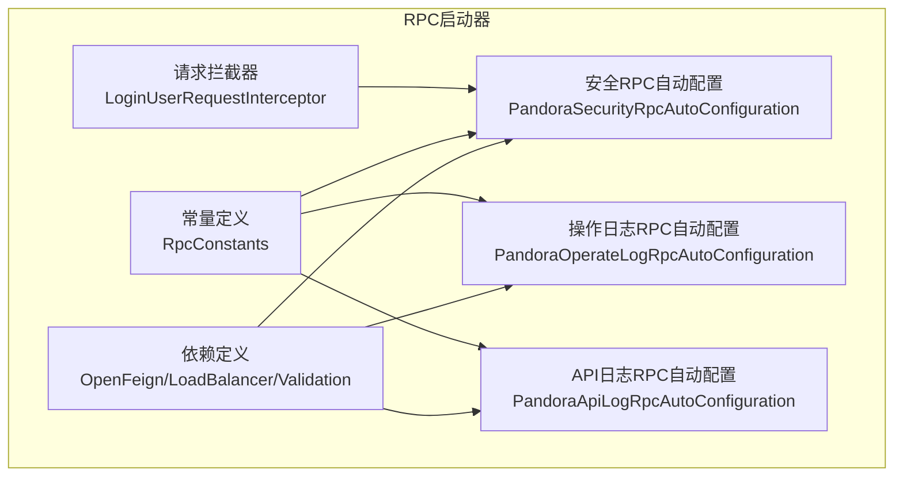
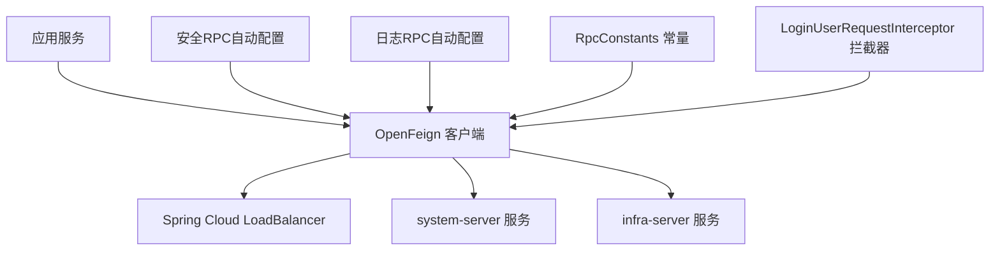
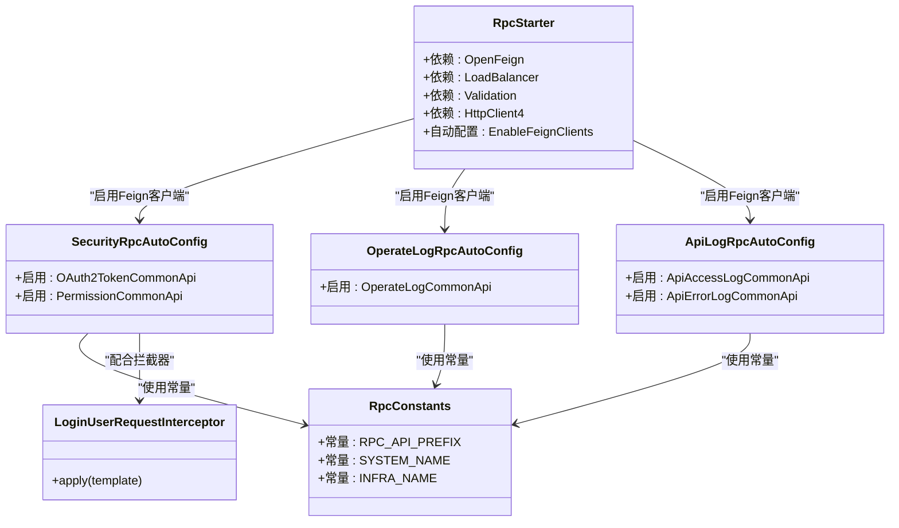
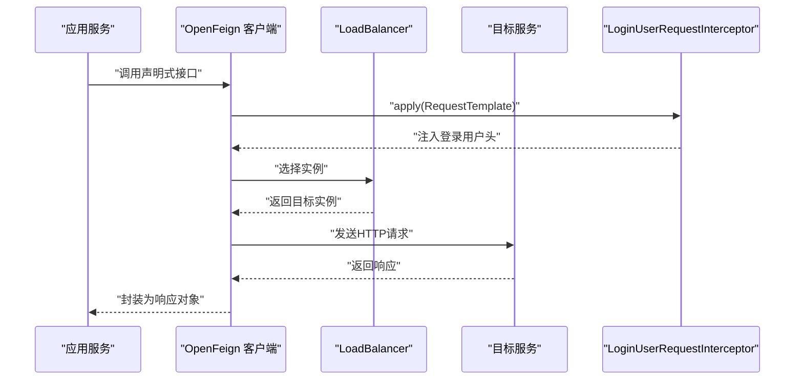
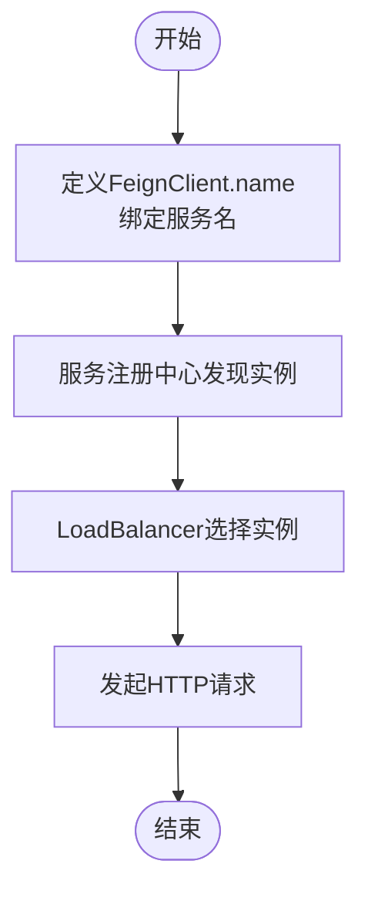
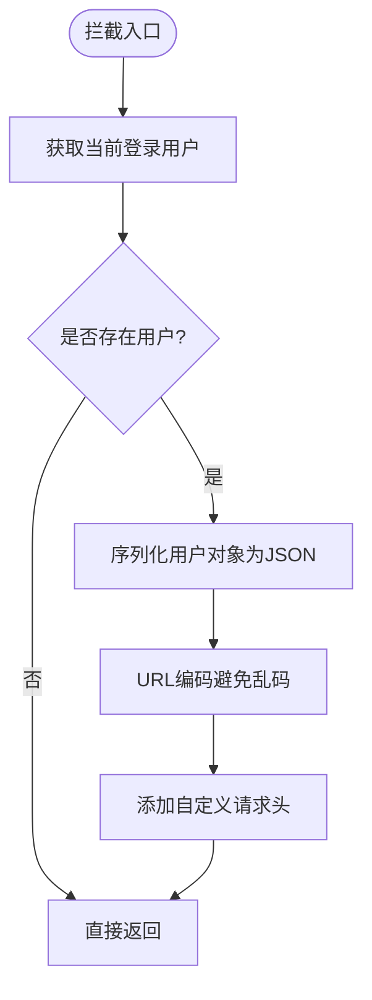
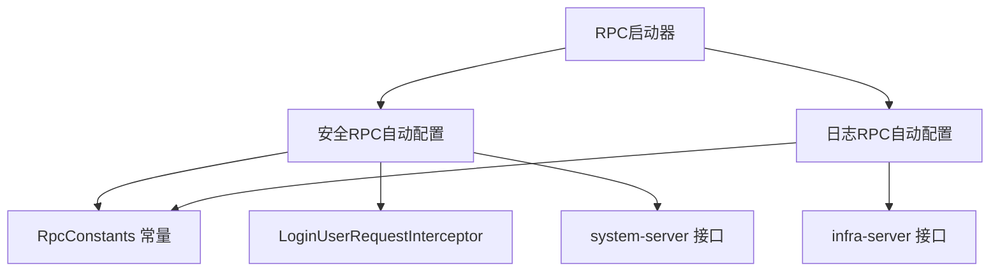

# RPC启动器

<cite>
**本文引用的文件**
- [pandora-spring-boot-starter-rpc/pom.xml](file://pandora-framework/pandora-spring-boot-starter-rpc/pom.xml)
- [RpcConstants.java](file://pandora-framework/pandora-common/src/main/java/net/ittimeline/pandora/framework/common/constants/RpcConstants.java)
- [LoginUserRequestInterceptor.java](file://pandora-framework/pandora-spring-boot-starter-security/src/main/java/net/ittimeline/pandora/framework/security/core/rpc/LoginUserRequestInterceptor.java)
- [PandoraSecurityRpcAutoConfiguration.java](file://pandora-framework/pandora-spring-boot-starter-security/src/main/java/net/ittimeline/pandora/framework/security/config/PandoraSecurityRpcAutoConfiguration.java)
- [PandoraOperateLogRpcAutoConfiguration.java](file://pandora-framework/pandora-spring-boot-starter-security/src/main/java/net/ittimeline/pandora/framework/operatelog/config/PandoraOperateLogRpcAutoConfiguration.java)
- [PandoraApiLogRpcAutoConfiguration.java](file://pandora-framework/pandora-spring-boot-starter-web/src/main/java/net/ittimeline/pandora/framework/apilog/config/PandoraApiLogRpcAutoConfiguration.java)
- [ApiAccessLogCommonApi.java](file://pandora-framework/pandora-common/src/main/java/net/ittimeline/pandora/framework/common/biz/infra/logger/ApiAccessLogCommonApi.java)
- [ApiErrorLogCommonApi.java](file://pandora-framework/pandora-common/src/main/java/net/ittimeline/pandora/framework/common/biz/infra/logger/ApiErrorLogCommonApi.java)
- [OperateLogCommonApi.java](file://pandora-framework/pandora-common/src/main/java/net/ittimeline/pandora/framework/common/biz/system/logger/OperateLogCommonApi.java)
- [OAuth2TokenCommonApi.java](file://pandora-framework/pandora-common/src/main/java/net/ittimeline/pandora/framework/common/biz/system/oauth2/OAuth2TokenCommonApi.java)
- [PermissionCommonApi.java](file://pandora-framework/pandora-common/src/main/java/net/ittimeline/pandora/framework/common/biz/system/permission/PermissionCommonApi.java)
- [org.springframework.boot.autoconfigure.AutoConfiguration.imports（security）](file://pandora-framework/pandora-spring-boot-starter-security/src/main/resources/META-INF/spring/org.springframework.boot.autoconfigure.AutoConfiguration.imports)
- [org.springframework.boot.autoconfigure.AutoConfiguration.imports（web）](file://pandora-framework/pandora-spring-boot-starter-web/src/main/resources/META-INF/spring/org.springframework.boot.autoconfigure.AutoConfiguration.imports)
</cite>

## 目录
1. [简介](#简介)
2. [项目结构](#项目结构)
3. [核心组件](#核心组件)
4. [架构总览](#架构总览)
5. [组件详解](#组件详解)
6. [依赖关系分析](#依赖关系分析)
7. [性能考量](#性能考量)
8. [故障排查指南](#故障排查指南)
9. [结论](#结论)
10. [附录](#附录)

## 简介
本文件面向“Pandora Cloud RPC启动器”，系统性阐述其在微服务架构中的定位与能力边界：基于Spring Cloud OpenFeign的声明式HTTP客户端能力，结合安全与日志等配套自动配置，为应用提供统一的RPC调用入口与跨模块通信机制。文档重点覆盖以下方面：
- RPC启动器在微服务体系中的角色与职责
- 基于OpenFeign的服务间远程调用与通信机制
- 配置方法与典型使用场景（服务发现、负载均衡、请求头透传）
- 完整调用示例与最佳实践（服务注册与发现、服务间通信、性能优化）
- 与Spring Cloud生态的集成方式与兼容性说明

## 项目结构
RPC启动器位于pandora-framework模块中，核心由以下部分组成：
- 启动器依赖定义：通过Maven坐标引入OpenFeign、负载均衡与工具类依赖
- 常量定义：集中管理RPC API前缀与服务名常量
- 自动配置：启用Feign客户端扫描，并按需引入各业务API接口
- 请求拦截器：在RPC调用时注入登录用户上下文，保障跨服务鉴权一致性

图表来源
- [pandora-spring-boot-starter-rpc/pom.xml:1-60](file://pandora-framework/pandora-spring-boot-starter-rpc/pom.xml#L1-L60)
- [RpcConstants.java:12-41](file://pandora-framework/pandora-common/src/main/java/net/ittimeline/pandora/framework/common/constants/RpcConstants.java#L12-L41)
- [PandoraSecurityRpcAutoConfiguration.java:1-40](file://pandora-framework/pandora-spring-boot-starter-security/src/main/java/net/ittimeline/pandora/framework/security/config/PandoraSecurityRpcAutoConfiguration.java#L1-L40)
- [PandoraOperateLogRpcAutoConfiguration.java:1-40](file://pandora-framework/pandora-spring-boot-starter-security/src/main/java/net/ittimeline/pandora/framework/operatelog/config/PandoraOperateLogRpcAutoConfiguration.java#L1-L40)
- [PandoraApiLogRpcAutoConfiguration.java:1-40](file://pandora-framework/pandora-spring-boot-starter-web/src/main/java/net/ittimeline/pandora/framework/apilog/config/PandoraApiLogRpcAutoConfiguration.java#L1-L40)
- [LoginUserRequestInterceptor.java:1-39](file://pandora-framework/pandora-spring-boot-starter-security/src/main/java/net/ittimeline/pandora/framework/security/core/rpc/LoginUserRequestInterceptor.java#L1-L39)

章节来源
- [pandora-spring-boot-starter-rpc/pom.xml:1-60](file://pandora-framework/pandora-spring-boot-starter-rpc/pom.xml#L1-L60)
- [RpcConstants.java:12-41](file://pandora-framework/pandora-common/src/main/java/net/ittimeline/pandora/framework/common/constants/RpcConstants.java#L12-L41)

## 核心组件
- 依赖定义（Maven）
  - 引入OpenFeign用于声明式HTTP调用
  - 引入Spring Cloud LoadBalancer用于客户端侧负载均衡
  - 引入Jakarta Validation API用于参数校验
  - 为兼容第三方依赖，显式引入Apache HttpClient 4.x以避免类冲突
- 常量定义（RpcConstants）
  - 统一RPC API前缀与服务名常量，确保跨模块一致
  - 提供system与infra服务名及前缀，便于Feign接口注解复用
- 自动配置（EnableFeignClients）
  - 安全RPC自动配置：启用特定Feign客户端接口，聚焦认证授权相关RPC
  - 操作日志RPC自动配置：启用操作日志相关Feign接口
  - API日志RPC自动配置：启用访问/错误日志相关Feign接口
- 请求拦截器（LoginUserRequestInterceptor）
  - 在Feign请求模板中注入当前登录用户上下文，避免重复传递用户信息
  - 对用户对象进行JSON序列化与URL编码，确保传输安全与兼容性

章节来源
- [pandora-spring-boot-starter-rpc/pom.xml:22-57](file://pandora-framework/pandora-spring-boot-starter-rpc/pom.xml#L22-L57)
- [RpcConstants.java:12-41](file://pandora-framework/pandora-common/src/main/java/net/ittimeline/pandora/framework/common/constants/RpcConstants.java#L12-L41)
- [PandoraSecurityRpcAutoConfiguration.java:1-40](file://pandora-framework/pandora-spring-boot-starter-security/src/main/java/net/ittimeline/pandora/framework/security/config/PandoraSecurityRpcAutoConfiguration.java#L1-L40)
- [PandoraOperateLogRpcAutoConfiguration.java:1-40](file://pandora-framework/pandora-spring-boot-starter-security/src/main/java/net/ittimeline/pandora/framework/operatelog/config/PandoraOperateLogRpcAutoConfiguration.java#L1-L40)
- [PandoraApiLogRpcAutoConfiguration.java:1-40](file://pandora-framework/pandora-spring-boot-starter-web/src/main/java/net/ittimeline/pandora/framework/apilog/config/PandoraApiLogRpcAutoConfiguration.java#L1-L40)
- [LoginUserRequestInterceptor.java:21-38](file://pandora-framework/pandora-spring-boot-starter-security/src/main/java/net/ittimeline/pandora/framework/security/core/rpc/LoginUserRequestInterceptor.java#L21-L38)

## 架构总览
RPC启动器通过@EnableFeignClients启用远程调用，结合RpcConstants常量与LoginUserRequestInterceptor实现统一的服务命名与上下文透传。下图展示了关键组件之间的交互关系：

图表来源
- [PandoraSecurityRpcAutoConfiguration.java:14-25](file://pandora-framework/pandora-spring-boot-starter-security/src/main/java/net/ittimeline/pandora/framework/security/config/PandoraSecurityRpcAutoConfiguration.java#L14-L25)
- [PandoraOperateLogRpcAutoConfiguration.java:12-18](file://pandora-framework/pandora-spring-boot-starter-security/src/main/java/net/ittimeline/pandora/framework/operatelog/config/PandoraOperateLogRpcAutoConfiguration.java#L12-L18)
- [PandoraApiLogRpcAutoConfiguration.java:12-18](file://pandora-framework/pandora-spring-boot-starter-web/src/main/java/net/ittimeline/pandora/framework/apilog/config/PandoraApiLogRpcAutoConfiguration.java#L12-L18)
- [RpcConstants.java:16-39](file://pandora-framework/pandora-common/src/main/java/net/ittimeline/pandora/framework/common/constants/RpcConstants.java#L16-L39)
- [LoginUserRequestInterceptor.java:23-37](file://pandora-framework/pandora-spring-boot-starter-security/src/main/java/net/ittimeline/pandora/framework/security/core/rpc/LoginUserRequestInterceptor.java#L23-L37)

## 组件详解

### 组件A：RPC启动器依赖与自动配置
- 依赖层面
  - OpenFeign：提供声明式HTTP客户端，简化远程调用
  - Spring Cloud LoadBalancer：提供客户端侧负载均衡能力
  - Jakarta Validation API：为远程参数校验提供基础
  - Apache HttpClient 4.x：为兼容第三方库而显式引入，避免运行时类缺失
- 自动配置层面
  - 通过@EnableFeignClients启用指定客户端接口，分别聚焦安全、日志与通用RPC场景
  - 通过AutoConfiguration.imports文件声明自动装配入口，确保Spring Boot可自动加载

图表来源
- [pandora-spring-boot-starter-rpc/pom.xml:22-57](file://pandora-framework/pandora-spring-boot-starter-rpc/pom.xml#L22-L57)
- [PandoraSecurityRpcAutoConfiguration.java:14-25](file://pandora-framework/pandora-spring-boot-starter-security/src/main/java/net/ittimeline/pandora/framework/security/config/PandoraSecurityRpcAutoConfiguration.java#L14-L25)
- [PandoraOperateLogRpcAutoConfiguration.java:12-18](file://pandora-framework/pandora-spring-boot-starter-security/src/main/java/net/ittimeline/pandora/framework/operatelog/config/PandoraOperateLogRpcAutoConfiguration.java#L12-L18)
- [PandoraApiLogRpcAutoConfiguration.java:12-18](file://pandora-framework/pandora-spring-boot-starter-web/src/main/java/net/ittimeline/pandora/framework/apilog/config/PandoraApiLogRpcAutoConfiguration.java#L12-L18)
- [RpcConstants.java:16-39](file://pandora-framework/pandora-common/src/main/java/net/ittimeline/pandora/framework/common/constants/RpcConstants.java#L16-L39)
- [LoginUserRequestInterceptor.java:23-37](file://pandora-framework/pandora-spring-boot-starter-security/src/main/java/net/ittimeline/pandora/framework/security/core/rpc/LoginUserRequestInterceptor.java#L23-L37)

章节来源
- [pandora-spring-boot-starter-rpc/pom.xml:22-57](file://pandora-framework/pandora-spring-boot-starter-rpc/pom.xml#L22-L57)
- [org.springframework.boot.autoconfigure.AutoConfiguration.imports（security）:1-6](file://pandora-framework/pandora-spring-boot-starter-security/src/main/resources/META-INF/spring/org.springframework.boot.autoconfigure.AutoConfiguration.imports#L1-L6)
- [org.springframework.boot.autoconfigure.AutoConfiguration.imports（web）:1-8](file://pandora-framework/pandora-spring-boot-starter-web/src/main/resources/META-INF/spring/org.springframework.boot.autoconfigure.AutoConfiguration.imports#L1-L8)

### 组件B：RPC调用流程（声明式Feign）
- 典型调用链
  - 应用服务通过@EnableFeignClients启用的客户端接口发起RPC
  - OpenFeign根据@FeignClient注解解析目标服务名与路径
  - LoadBalancer对多个实例执行客户端侧负载均衡
  - LoginUserRequestInterceptor在请求模板中注入登录用户上下文
  - 目标服务返回响应，完成一次跨服务调用

图表来源
- [PandoraSecurityRpcAutoConfiguration.java:14-25](file://pandora-framework/pandora-spring-boot-starter-security/src/main/java/net/ittimeline/pandora/framework/security/config/PandoraSecurityRpcAutoConfiguration.java#L14-L25)
- [LoginUserRequestInterceptor.java:23-37](file://pandora-framework/pandora-spring-boot-starter-security/src/main/java/net/ittimeline/pandora/framework/security/core/rpc/LoginUserRequestInterceptor.java#L23-L37)

章节来源
- [PandoraSecurityRpcAutoConfiguration.java:14-25](file://pandora-framework/pandora-spring-boot-starter-security/src/main/java/net/ittimeline/pandora/framework/security/config/PandoraSecurityRpcAutoConfiguration.java#L14-L25)
- [LoginUserRequestInterceptor.java:23-37](file://pandora-framework/pandora-spring-boot-starter-security/src/main/java/net/ittimeline/pandora/framework/security/core/rpc/LoginUserRequestInterceptor.java#L23-L37)

### 组件C：服务发现与负载均衡
- 服务发现
  - Feign客户端通过@FeignClient的name属性绑定服务名，结合服务注册中心完成发现
  - RpcConstants中统一维护服务名常量，确保跨模块一致性
- 客户端侧负载均衡
  - 通过spring-cloud-starter-loadbalancer提供RestTemplate/Exchange等的负载均衡能力
  - Feign与LoadBalancer协同工作，实现对多实例的智能选择

图表来源
- [RpcConstants.java:23-39](file://pandora-framework/pandora-common/src/main/java/net/ittimeline/pandora/framework/common/constants/RpcConstants.java#L23-L39)
- [pandora-spring-boot-starter-rpc/pom.xml:29-36](file://pandora-framework/pandora-spring-boot-starter-rpc/pom.xml#L29-L36)

章节来源
- [RpcConstants.java:23-39](file://pandora-framework/pandora-common/src/main/java/net/ittimeline/pandora/framework/common/constants/RpcConstants.java#L23-L39)
- [pandora-spring-boot-starter-rpc/pom.xml:29-36](file://pandora-framework/pandora-spring-boot-starter-rpc/pom.xml#L29-L36)

### 组件D：请求头透传与上下文传递
- 登录用户上下文透传
  - LoginUserRequestInterceptor在apply阶段从安全框架获取当前登录用户
  - 将用户对象序列化为JSON字符串并进行URL编码，写入自定义请求头
  - 目标服务可通过该请求头还原调用方用户上下文，实现跨服务鉴权一致性

图表来源
- [LoginUserRequestInterceptor.java:23-37](file://pandora-framework/pandora-spring-boot-starter-security/src/main/java/net/ittimeline/pandora/framework/security/core/rpc/LoginUserRequestInterceptor.java#L23-L37)

章节来源
- [LoginUserRequestInterceptor.java:23-37](file://pandora-framework/pandora-spring-boot-starter-security/src/main/java/net/ittimeline/pandora/framework/security/core/rpc/LoginUserRequestInterceptor.java#L23-L37)

## 依赖关系分析
- 启动器与自动配置
  - 启动器通过@EnableFeignClients引入各业务RPC自动配置，分别聚焦安全、日志与通用RPC场景
  - AutoConfiguration.imports文件声明自动装配入口，确保Spring Boot可自动加载
- 常量与接口
  - RpcConstants为所有Feign接口提供统一的服务名与前缀，降低耦合度
  - Feign接口通过@FeignClient(name=RpcConstants.SYSTEM_NAME)等方式引用常量
- 拦截器与安全
  - LoginUserRequestInterceptor与安全自动配置联动，确保跨服务调用时用户上下文一致

图表来源
- [org.springframework.boot.autoconfigure.AutoConfiguration.imports（security）:1-6](file://pandora-framework/pandora-spring-boot-starter-security/src/main/resources/META-INF/spring/org.springframework.boot.autoconfigure.AutoConfiguration.imports#L1-L6)
- [org.springframework.boot.autoconfigure.AutoConfiguration.imports（web）:1-8](file://pandora-framework/pandora-spring-boot-starter-web/src/main/resources/META-INF/spring/org.springframework.boot.autoconfigure.AutoConfiguration.imports#L1-L8)
- [RpcConstants.java:16-39](file://pandora-framework/pandora-common/src/main/java/net/ittimeline/pandora/framework/common/constants/RpcConstants.java#L16-L39)
- [LoginUserRequestInterceptor.java:23-37](file://pandora-framework/pandora-spring-boot-starter-security/src/main/java/net/ittimeline/pandora/framework/security/core/rpc/LoginUserRequestInterceptor.java#L23-L37)

章节来源
- [org.springframework.boot.autoconfigure.AutoConfiguration.imports（security）:1-6](file://pandora-framework/pandora-spring-boot-starter-security/src/main/resources/META-INF/spring/org.springframework.boot.autoconfigure.AutoConfiguration.imports#L1-L6)
- [org.springframework.boot.autoconfigure.AutoConfiguration.imports（web）:1-8](file://pandora-framework/pandora-spring-boot-starter-web/src/main/resources/META-INF/spring/org.springframework.boot.autoconfigure.AutoConfiguration.imports#L1-L8)
- [RpcConstants.java:16-39](file://pandora-framework/pandora-common/src/main/java/net/ittimeline/pandora/framework/common/constants/RpcConstants.java#L16-L39)
- [LoginUserRequestInterceptor.java:23-37](file://pandora-framework/pandora-spring-boot-starter-security/src/main/java/net/ittimeline/pandora/framework/security/core/rpc/LoginUserRequestInterceptor.java#L23-L37)

## 性能考量
- 客户端侧负载均衡
  - 使用Spring Cloud LoadBalancer减少服务端压力，提升可用性与吞吐
- HTTP客户端选择
  - 启动器引入Feign OkHttp适配器，具备更好的连接复用与并发性能
- 参数校验与序列化
  - 通过Jakarta Validation API与JSON工具类，确保请求参数与上下文数据的高效处理
- 依赖隔离
  - 显式引入HttpClient 4.x避免第三方库版本冲突，减少运行时异常开销

章节来源
- [pandora-spring-boot-starter-rpc/pom.xml:29-40](file://pandora-framework/pandora-spring-boot-starter-rpc/pom.xml#L29-L40)
- [pandora-spring-boot-starter-rpc/pom.xml:54-57](file://pandora-framework/pandora-spring-boot-starter-rpc/pom.xml#L54-L57)

## 故障排查指南
- 类缺失或版本冲突
  - 若出现与HttpClient相关的类缺失，请确认已引入HttpClient 4.x依赖
- 请求头未生效
  - 检查LoginUserRequestInterceptor是否被自动配置加载，以及请求头名称是否正确
- 服务发现失败
  - 确认@FeignClient的name与RpcConstants中服务名一致，且服务已在注册中心上线
- 负载均衡不生效
  - 检查spring-cloud-starter-loadbalancer是否引入，以及是否正确启用@EnableFeignClients

章节来源
- [pandora-spring-boot-starter-rpc/pom.xml:47-51](file://pandora-framework/pandora-spring-boot-starter-rpc/pom.xml#L47-L51)
- [LoginUserRequestInterceptor.java:23-37](file://pandora-framework/pandora-spring-boot-starter-security/src/main/java/net/ittimeline/pandora/framework/security/core/rpc/LoginUserRequestInterceptor.java#L23-L37)
- [RpcConstants.java:23-39](file://pandora-framework/pandora-common/src/main/java/net/ittimeline/pandora/framework/common/constants/RpcConstants.java#L23-L39)

## 结论
Pandora Cloud RPC启动器以OpenFeign为核心，结合Spring Cloud LoadBalancer与统一常量、自动配置、请求拦截器，构建了简洁、稳定、可扩展的微服务RPC调用体系。通过@EnableFeignClients与RpcConstants，实现了服务发现、负载均衡与上下文透传的一体化；通过AutoConfiguration.imports与显式依赖管理，确保了与Spring Cloud生态的兼容性与可维护性。

## 附录

### 使用场景与最佳实践
- 服务注册与发现
  - 在Feign接口上使用@FeignClient(name=RpcConstants.SYSTEM_NAME)，确保与服务名常量一致
  - 在自动配置类中通过@EnableFeignClients启用对应接口，避免遗漏
- 负载均衡与容错
  - 依赖LoadBalancer实现客户端侧均衡；如需熔断降级，建议结合Spring Cloud Circuit Breaker或Resilience4j
- 上下文透传
  - 使用LoginUserRequestInterceptor自动注入用户上下文，避免手动传递带来的复杂性
- 性能优化
  - 优先使用OkHttp作为HTTP客户端；合理设置超时与重试策略；避免在RPC中传输大对象

章节来源
- [PandoraSecurityRpcAutoConfiguration.java:14-25](file://pandora-framework/pandora-spring-boot-starter-security/src/main/java/net/ittimeline/pandora/framework/security/config/PandoraSecurityRpcAutoConfiguration.java#L14-L25)
- [PandoraOperateLogRpcAutoConfiguration.java:12-18](file://pandora-framework/pandora-spring-boot-starter-security/src/main/java/net/ittimeline/pandora/framework/operatelog/config/PandoraOperateLogRpcAutoConfiguration.java#L12-L18)
- [PandoraApiLogRpcAutoConfiguration.java:12-18](file://pandora-framework/pandora-spring-boot-starter-web/src/main/java/net/ittimeline/pandora/framework/apilog/config/PandoraApiLogRpcAutoConfiguration.java#L12-L18)
- [LoginUserRequestInterceptor.java:23-37](file://pandora-framework/pandora-spring-boot-starter-security/src/main/java/net/ittimeline/pandora/framework/security/core/rpc/LoginUserRequestInterceptor.java#L23-L37)

### 与Spring Cloud生态的集成与兼容性
- OpenFeign：提供声明式HTTP客户端能力，与Spring Cloud Gateway、服务注册中心无缝协作
- Spring Cloud LoadBalancer：提供客户端侧负载均衡，与Eureka/Nacos等注册中心配合良好
- 自动配置：通过AutoConfiguration.imports声明，确保Spring Boot可自动装配
- 第三方兼容：显式引入HttpClient 4.x，降低与第三方库的版本冲突风险

章节来源
- [pandora-spring-boot-starter-rpc/pom.xml:29-40](file://pandora-framework/pandora-spring-boot-starter-rpc/pom.xml#L29-L40)
- [org.springframework.boot.autoconfigure.AutoConfiguration.imports（security）:1-6](file://pandora-framework/pandora-spring-boot-starter-security/src/main/resources/META-INF/spring/org.springframework.boot.autoconfigure.AutoConfiguration.imports#L1-L6)
- [org.springframework.boot.autoconfigure.AutoConfiguration.imports（web）:1-8](file://pandora-framework/pandora-spring-boot-starter-web/src/main/resources/META-INF/spring/org.springframework.boot.autoconfigure.AutoConfiguration.imports#L1-L8)