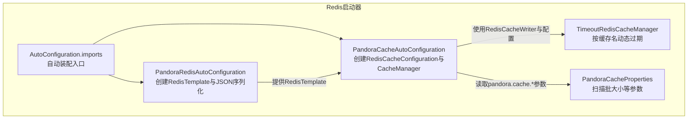
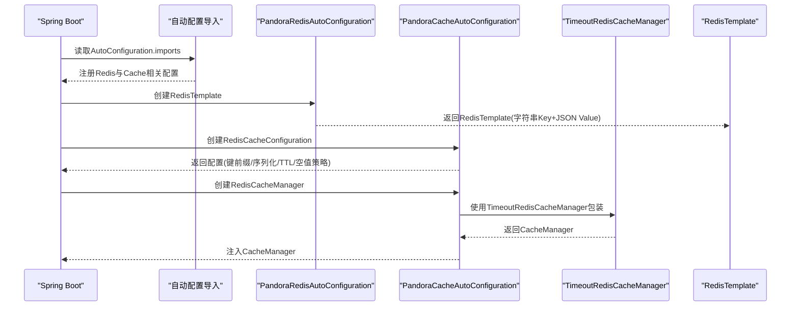
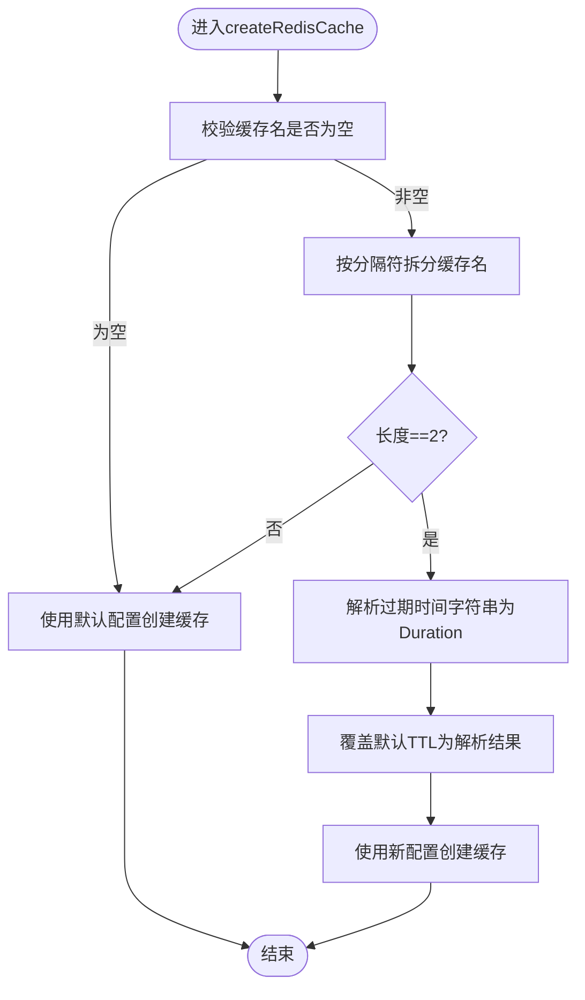
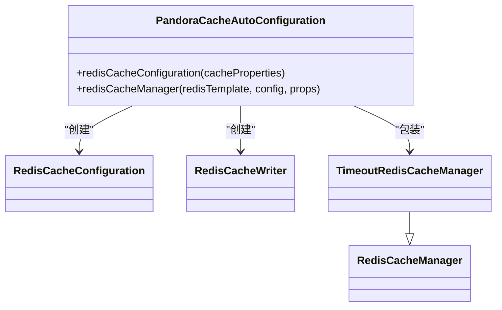
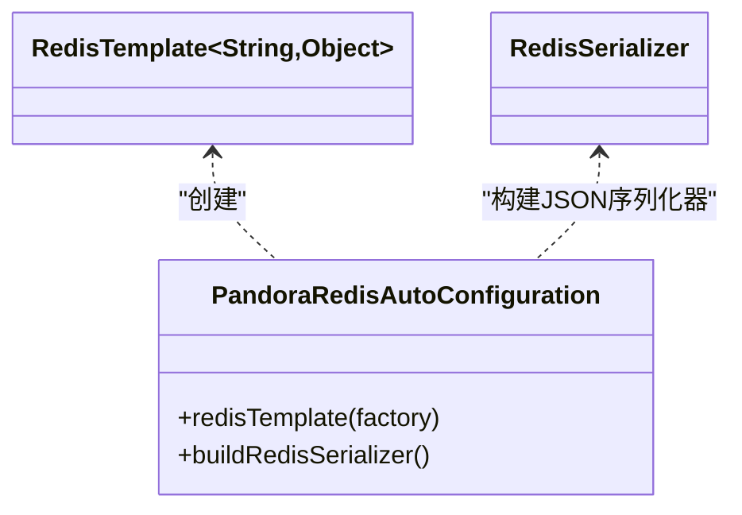
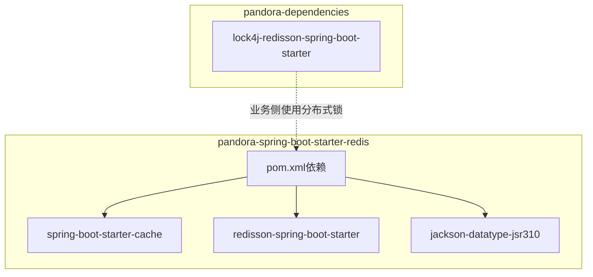

# Redis启动器

<cite>
**本文引用的文件**
- [PandoraCacheAutoConfiguration.java](file://pandora-framework/pandora-spring-boot-starter-redis/src/main/java/net/ittimeline/pandora/framework/redis/config/PandoraCacheAutoConfiguration.java)
- [PandoraCacheProperties.java](file://pandora-framework/pandora-spring-boot-starter-redis/src/main/java/net/ittimeline/pandora/framework/redis/config/PandoraCacheProperties.java)
- [PandoraRedisAutoConfiguration.java](file://pandora-framework/pandora-spring-boot-starter-redis/src/main/java/net/ittimeline/pandora/framework/redis/config/PandoraRedisAutoConfiguration.java)
- [TimeoutRedisCacheManager.java](file://pandora-framework/pandora-spring-boot-starter-redis/src/main/java/net/ittimeline/pandora/framework/redis/core/TimeoutRedisCacheManager.java)
- [org.springframework.boot.autoconfigure.AutoConfiguration.imports](file://pandora-framework/pandora-spring-boot-starter-redis/src/main/resources/META-INF/spring/org.springframework.boot.autoconfigure.AutoConfiguration.imports)
- [pandora-spring-boot-starter-redis/pom.xml](file://pandora-framework/pandora-spring-boot-starter-redis/pom.xml)
- [pandora-dependencies/pom.xml](file://pandora-dependencies/pom.xml)
</cite>

## 目录
1. [简介](#简介)
2. [项目结构](#项目结构)
3. [核心组件](#核心组件)
4. [架构总览](#架构总览)
5. [详细组件分析](#详细组件分析)
6. [依赖分析](#依赖分析)
7. [性能考虑](#性能考虑)
8. [故障排查指南](#故障排查指南)
9. [结论](#结论)
10. [附录](#附录)

## 简介
本文件面向“Pandora Cloud Redis启动器”，系统性阐述其在缓存管理与分布式锁方面的设计与实现，重点覆盖以下方面：
- 缓存管理：基于Spring Cache与Redis的集成，提供默认缓存配置、JSON序列化、键前缀策略、扫描批大小优化等能力，并通过自定义CacheManager实现“按缓存名称动态过期”的能力。
- 分布式锁：通过引入Redisson与lock4j-redisson，提供开箱即用的分布式锁能力，满足高并发场景下的资源互斥与一致性需求。
- 配置体系：围绕PandoraCacheProperties与Spring Cache配置项，给出Redis连接、缓存超时、序列化等关键配置的使用方法与最佳实践。

## 项目结构
该启动器位于pandora-framework模块下的pandora-spring-boot-starter-redis子模块，采用“自动装配+核心实现”的分层组织：
- 自动配置层：负责注册RedisTemplate、RedisCacheConfiguration、RedisCacheManager等Bean，并暴露可调优参数。
- 核心实现层：提供TimeoutRedisCacheManager，扩展按缓存名动态设置过期时间的能力。
- 配置声明层：通过META-INF/spring自动配置导入文件，声明启用的自动配置类。

图表来源
- [PandoraRedisAutoConfiguration.java:19-46](file://pandora-framework/pandora-spring-boot-starter-redis/src/main/java/net/ittimeline/pandora/framework/redis/config/PandoraRedisAutoConfiguration.java#L19-L46)
- [PandoraCacheAutoConfiguration.java:31-83](file://pandora-framework/pandora-spring-boot-starter-redis/src/main/java/net/ittimeline/pandora/framework/redis/config/PandoraCacheAutoConfiguration.java#L31-L83)
- [TimeoutRedisCacheManager.java:19-50](file://pandora-framework/pandora-spring-boot-starter-redis/src/main/java/net/ittimeline/pandora/framework/redis/core/TimeoutRedisCacheManager.java#L19-L50)
- [PandoraCacheProperties.java:14-29](file://pandora-framework/pandora-spring-boot-starter-redis/src/main/java/net/ittimeline/pandora/framework/redis/config/PandoraCacheProperties.java#L14-L29)
- [org.springframework.boot.autoconfigure.AutoConfiguration.imports:1-2](file://pandora-framework/pandora-spring-boot-starter-redis/src/main/resources/META-INF/spring/org.springframework.boot.autoconfigure.AutoConfiguration.imports#L1-L2)

章节来源
- [PandoraRedisAutoConfiguration.java:19-46](file://pandora-framework/pandora-spring-boot-starter-redis/src/main/java/net/ittimeline/pandora/framework/redis/config/PandoraRedisAutoConfiguration.java#L19-L46)
- [PandoraCacheAutoConfiguration.java:31-83](file://pandora-framework/pandora-spring-boot-starter-redis/src/main/java/net/ittimeline/pandora/framework/redis/config/PandoraCacheAutoConfiguration.java#L31-L83)
- [TimeoutRedisCacheManager.java:19-50](file://pandora-framework/pandora-spring-boot-starter-redis/src/main/java/net/ittimeline/pandora/framework/redis/core/TimeoutRedisCacheManager.java#L19-L50)
- [PandoraCacheProperties.java:14-29](file://pandora-framework/pandora-spring-boot-starter-redis/src/main/java/net/ittimeline/pandora/framework/redis/config/PandoraCacheProperties.java#L14-L29)
- [org.springframework.boot.autoconfigure.AutoConfiguration.imports:1-2](file://pandora-framework/pandora-spring-boot-starter-redis/src/main/resources/META-INF/spring/org.springframework.boot.autoconfigure.AutoConfiguration.imports#L1-L2)

## 核心组件
- RedisTemplate与JSON序列化
  - 通过PandoraRedisAutoConfiguration创建RedisTemplate，KEY使用字符串序列化，VALUE使用JSON序列化（Jackson），并注册JavaTimeModule以支持时间类型的序列化。
  - 该模板作为后续所有Redis操作的基础。
- RedisCacheConfiguration与CacheManager
  - 通过PandoraCacheAutoConfiguration创建RedisCacheConfiguration，默认键前缀策略由CacheProperties.redis.key-prefix决定；同时应用CacheProperties.redis的TTL、是否缓存null值、是否使用key前缀等配置。
  - 使用RedisCacheWriter与非阻塞模式构建CacheManager，并注入扫描批大小参数，提升批量操作性能。
- TimeoutRedisCacheManager
  - 在标准RedisCacheManager基础上，扩展按缓存名动态设置过期时间的能力。当缓存名包含特定分隔符与过期时间描述时，解析并应用自定义TTL。
- 配置属性PandoraCacheProperties
  - 提供redisScanBatchSize参数，用于控制Redis批量扫描的批大小，平衡内存占用与网络往返次数。

章节来源
- [PandoraRedisAutoConfiguration.java:25-46](file://pandora-framework/pandora-spring-boot-starter-redis/src/main/java/net/ittimeline/pandora/framework/redis/config/PandoraRedisAutoConfiguration.java#L25-L46)
- [PandoraCacheAutoConfiguration.java:40-83](file://pandora-framework/pandora-spring-boot-starter-redis/src/main/java/net/ittimeline/pandora/framework/redis/config/PandoraCacheAutoConfiguration.java#L40-L83)
- [TimeoutRedisCacheManager.java:19-85](file://pandora-framework/pandora-spring-boot-starter-redis/src/main/java/net/ittimeline/pandora/framework/redis/core/TimeoutRedisCacheManager.java#L19-L85)
- [PandoraCacheProperties.java:14-29](file://pandora-framework/pandora-spring-boot-starter-redis/src/main/java/net/ittimeline/pandora/framework/redis/config/PandoraCacheProperties.java#L14-L29)

## 架构总览
下图展示了Redis启动器在Spring Boot中的装配流程与关键交互：

图表来源
- [org.springframework.boot.autoconfigure.AutoConfiguration.imports:1-2](file://pandora-framework/pandora-spring-boot-starter-redis/src/main/resources/META-INF/spring/org.springframework.boot.autoconfigure.AutoConfiguration.imports#L1-L2)
- [PandoraRedisAutoConfiguration.java:25-46](file://pandora-framework/pandora-spring-boot-starter-redis/src/main/java/net/ittimeline/pandora/framework/redis/config/PandoraRedisAutoConfiguration.java#L25-L46)
- [PandoraCacheAutoConfiguration.java:40-83](file://pandora-framework/pandora-spring-boot-starter-redis/src/main/java/net/ittimeline/pandora/framework/redis/config/PandoraCacheAutoConfiguration.java#L40-L83)
- [TimeoutRedisCacheManager.java:19-50](file://pandora-framework/pandora-spring-boot-starter-redis/src/main/java/net/ittimeline/pandora/framework/redis/core/TimeoutRedisCacheManager.java#L19-L50)

## 详细组件分析

### TimeoutRedisCacheManager：按缓存名动态过期
- 设计理念
  - 在标准Redis缓存之上，允许在缓存名中携带过期时间描述，从而在不改变业务调用方的情况下，灵活调整不同缓存的生命周期。
- 实现原理
  - 当缓存名包含特定分隔符且被拆分为两段时，解析第二段的过期时间字符串，构造Duration并覆盖默认TTL。
  - 支持以天(d)、小时(h)、分钟(m)、秒(s)结尾的单位表达，或默认按秒解析。
- 关键点
  - 仅在缓存名格式符合约定时生效，否则回退到默认配置。
  - 过期时间解析与字符串截取逻辑清晰，便于扩展其他时间单位。

图表来源
- [TimeoutRedisCacheManager.java:27-50](file://pandora-framework/pandora-spring-boot-starter-redis/src/main/java/net/ittimeline/pandora/framework/redis/core/TimeoutRedisCacheManager.java#L27-L50)
- [TimeoutRedisCacheManager.java:58-82](file://pandora-framework/pandora-spring-boot-starter-redis/src/main/java/net/ittimeline/pandora/framework/redis/core/TimeoutRedisCacheManager.java#L58-L82)

章节来源
- [TimeoutRedisCacheManager.java:19-85](file://pandora-framework/pandora-spring-boot-starter-redis/src/main/java/net/ittimeline/pandora/framework/redis/core/TimeoutRedisCacheManager.java#L19-L85)

### PandoraCacheAutoConfiguration：缓存配置与管理
- RedisCacheConfiguration
  - 计算键前缀策略，兼容用户自定义前缀，避免工具显示异常。
  - 使用JSON序列化VALUE与HASH_VALUE，确保复杂对象与时间类型安全存储。
  - 应用CacheProperties.redis的TTL、空值缓存开关、键前缀开关等。
- RedisCacheManager
  - 基于RedisConnectionFactory创建非阻塞RedisCacheWriter，结合扫描批大小参数优化批量操作。
  - 包装为TimeoutRedisCacheManager，实现动态过期能力。

图表来源
- [PandoraCacheAutoConfiguration.java:40-83](file://pandora-framework/pandora-spring-boot-starter-redis/src/main/java/net/ittimeline/pandora/framework/redis/config/PandoraCacheAutoConfiguration.java#L40-L83)
- [TimeoutRedisCacheManager.java:19-25](file://pandora-framework/pandora-spring-boot-starter-redis/src/main/java/net/ittimeline/pandora/framework/redis/core/TimeoutRedisCacheManager.java#L19-L25)

章节来源
- [PandoraCacheAutoConfiguration.java:31-83](file://pandora-framework/pandora-spring-boot-starter-redis/src/main/java/net/ittimeline/pandora/framework/redis/config/PandoraCacheAutoConfiguration.java#L31-L83)

### PandoraRedisAutoConfiguration：RedisTemplate与JSON序列化
- RedisTemplate
  - KEY使用字符串序列化，HASH_KEY使用字符串序列化。
  - VALUE与HASH_VALUE使用JSON序列化（Jackson），并通过反射注入JavaTimeModule，解决时间类型序列化问题。
- 自定义序列化器
  - 提供buildRedisSerializer静态方法，统一JSON序列化器的创建与模块注册。

图表来源
- [PandoraRedisAutoConfiguration.java:25-46](file://pandora-framework/pandora-spring-boot-starter-redis/src/main/java/net/ittimeline/pandora/framework/redis/config/PandoraRedisAutoConfiguration.java#L25-L46)

章节来源
- [PandoraRedisAutoConfiguration.java:19-46](file://pandora-framework/pandora-spring-boot-starter-redis/src/main/java/net/ittimeline/pandora/framework/redis/config/PandoraRedisAutoConfiguration.java#L19-L46)

### PandoraCacheProperties：缓存参数配置
- 参数说明
  - redisScanBatchSize：控制Redis批量扫描的批大小，默认值已内定，可通过配置项覆盖。
- 使用建议
  - 在高并发、大批量键空间场景下适当增大批大小，减少网络往返；在内存受限环境下适度减小。

章节来源
- [PandoraCacheProperties.java:14-29](file://pandora-framework/pandora-spring-boot-starter-redis/src/main/java/net/ittimeline/pandora/framework/redis/config/PandoraCacheProperties.java#L14-L29)

### 分布式锁：Redisson与lock4j集成
- 组件来源
  - 通过pandora-dependencies中对lock4j-redisson-spring-boot-starter的依赖，提供基于Redis的分布式锁能力。
- 集成要点
  - 启动器未直接在本模块实现分布式锁，而是通过外部starter引入Redisson与lock4j，形成“Redis + Redisson + lock4j”的组合方案。
  - 业务侧可直接使用lock4j提供的注解或编程式API进行加解锁。

章节来源
- [pandora-dependencies/pom.xml:286-297](file://pandora-dependencies/pom.xml#L286-L297)
- [pandora-spring-boot-starter-redis/pom.xml:26-29](file://pandora-framework/pandora-spring-boot-starter-redis/pom.xml#L26-L29)

## 依赖分析
- 启动器依赖
  - spring-boot-starter-cache：提供Spring Cache自动装配能力。
  - redisson-spring-boot-starter：提供Redisson客户端与自动配置。
  - jackson-datatype-jsr310：为JSON序列化提供Java时间模块支持。
- 外部依赖（通过父BOM）
  - lock4j-redisson-spring-boot-starter：提供分布式锁能力，排除其自带的Redisson starter以避免冲突。

图表来源
- [pandora-spring-boot-starter-redis/pom.xml:19-39](file://pandora-framework/pandora-spring-boot-starter-redis/pom.xml#L19-L39)
- [pandora-dependencies/pom.xml:286-297](file://pandora-dependencies/pom.xml#L286-L297)

章节来源
- [pandora-spring-boot-starter-redis/pom.xml:19-39](file://pandora-framework/pandora-spring-boot-starter-redis/pom.xml#L19-L39)
- [pandora-dependencies/pom.xml:286-297](file://pandora-dependencies/pom.xml#L286-L297)

## 性能考虑
- 批量扫描优化
  - 通过PandoraCacheProperties的redisScanBatchSize参数控制Redis批量扫描的批大小，平衡吞吐与内存占用。
- 非阻塞写入
  - 使用非锁定的RedisCacheWriter，降低写入路径的锁竞争，提升并发写入性能。
- 序列化成本
  - JSON序列化对复杂对象友好，但序列化/反序列化存在CPU开销；建议在高频热点数据上谨慎使用大对象，必要时进行数据瘦身。
- 键前缀与命名规范
  - 统一的键前缀策略有助于运维与清理，同时避免工具显示异常。

## 故障排查指南
- 缓存键前缀显示异常
  - 检查CacheProperties.redis.key-prefix配置，确认末尾是否带有冒号；自动配置会自动补全冒号，避免工具显示多余空格。
- JSON序列化失败
  - 确认对象包含时间类型时，序列化器已注册JavaTimeModule；启动器已在内部完成注册。
- 动态过期未生效
  - 确认缓存名格式符合约定（包含特定分隔符且拆分为两段），并检查过期时间字符串的单位是否正确。
- 扫描批大小不合适
  - 观察GC与网络往返情况，适当调整redisScanBatchSize参数。

章节来源
- [PandoraCacheAutoConfiguration.java:40-71](file://pandora-framework/pandora-spring-boot-starter-redis/src/main/java/net/ittimeline/pandora/framework/redis/config/PandoraCacheAutoConfiguration.java#L40-L71)
- [PandoraRedisAutoConfiguration.java:40-46](file://pandora-framework/pandora-spring-boot-starter-redis/src/main/java/net/ittimeline/pandora/framework/redis/config/PandoraRedisAutoConfiguration.java#L40-L46)
- [TimeoutRedisCacheManager.java:27-50](file://pandora-framework/pandora-spring-boot-starter-redis/src/main/java/net/ittimeline/pandora/framework/redis/core/TimeoutRedisCacheManager.java#L27-L50)

## 结论
Pandora Cloud Redis启动器通过简洁而强大的自动配置，提供了：
- 标准化的RedisTemplate与JSON序列化；
- 可调参的RedisCacheConfiguration与高性能的CacheManager；
- 基于命名约定的动态过期能力；
- 与Spring Cache的无缝集成；
- 通过lock4j-redisson实现的分布式锁能力。
这些特性共同构成了一个易于使用、可扩展、性能友好的Redis缓存与分布式锁解决方案。

## 附录

### 配置属性清单与使用示例
- Redis连接与序列化
  - RedisTemplate：KEY使用字符串序列化，VALUE使用JSON序列化（含JavaTimeModule）。
  - 参考路径：[PandoraRedisAutoConfiguration.java:25-46](file://pandora-framework/pandora-spring-boot-starter-redis/src/main/java/net/ittimeline/pandora/framework/redis/config/PandoraRedisAutoConfiguration.java#L25-L46)
- 缓存超时与键前缀
  - TTL：来自CacheProperties.redis.time-to-live；空值缓存：来自CacheProperties.redis.cache-null-values；键前缀：来自CacheProperties.redis.key-prefix。
  - 参考路径：[PandoraCacheAutoConfiguration.java:40-71](file://pandora-framework/pandora-spring-boot-starter-redis/src/main/java/net/ittimeline/pandora/framework/redis/config/PandoraCacheAutoConfiguration.java#L40-L71)
- 扫描批大小
  - 参数：pandora.cache.redis-scan-batch-size；默认值：30。
  - 参考路径：[PandoraCacheProperties.java:14-29](file://pandora-framework/pandora-spring-boot-starter-redis/src/main/java/net/ittimeline/pandora/framework/redis/config/PandoraCacheProperties.java#L14-L29)
- 动态过期
  - 缓存名格式：name#ttl，其中ttl支持单位后缀（如1d、2h、3m、4s），或默认秒。
  - 参考路径：[TimeoutRedisCacheManager.java:27-82](file://pandora-framework/pandora-spring-boot-starter-redis/src/main/java/net/ittimeline/pandora/framework/redis/core/TimeoutRedisCacheManager.java#L27-L82)

### 使用场景与最佳实践
- 多级缓存
  - 本地缓存（如Caffeine）+ Redis缓存：本地命中优先，未命中再查Redis；Redis中可按业务设置不同TTL。
- 分布式锁
  - 使用lock4j注解或编程式API保护临界区；结合Redisson实现可靠锁机制。
- 缓存穿透防护
  - 对空值进行短时缓存（需开启空值缓存），并配合限流与熔断；避免对不存在的键频繁查询数据库。
- 缓存失效与更新
  - 采用“读多写少”场景下的延迟双删或异步更新策略；对热点数据设置合理的TTL与预热。
- 与Spring Cache注解集成
  - 在方法上使用@EnableCaching与@Cacheable/@CacheEvict/@CachePut等注解，结合本启动器提供的CacheManager与序列化配置，即可获得一致的缓存行为。