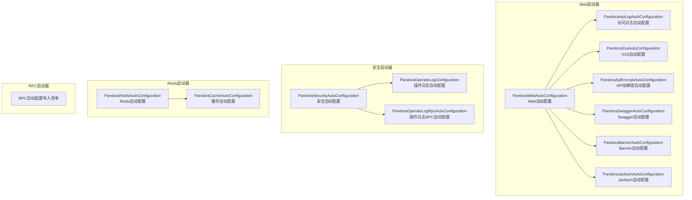
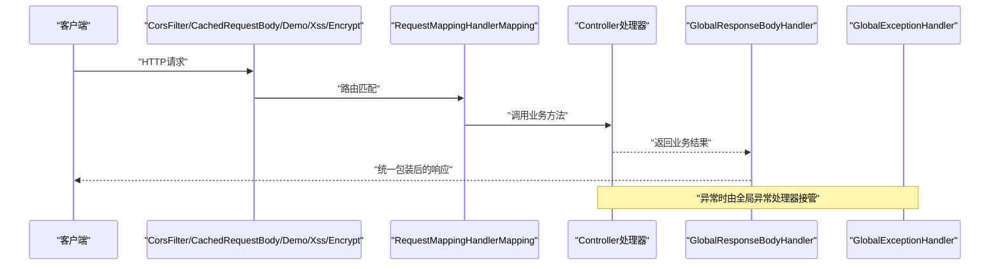
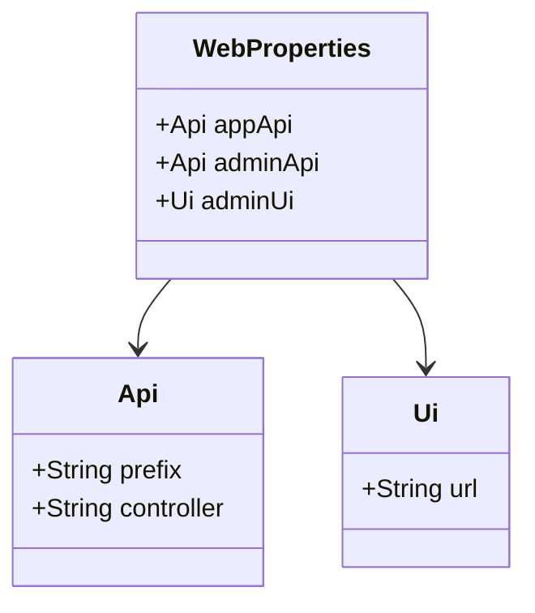
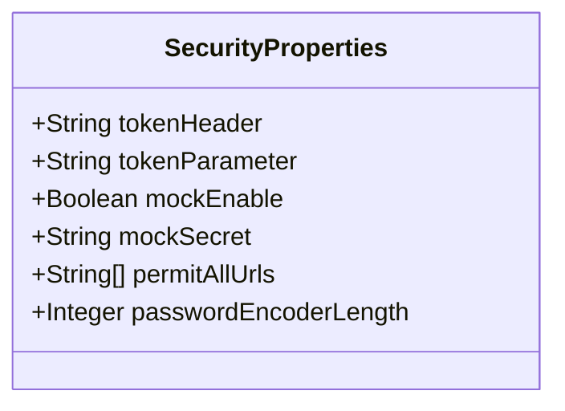
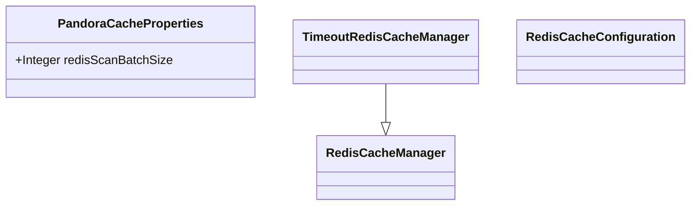
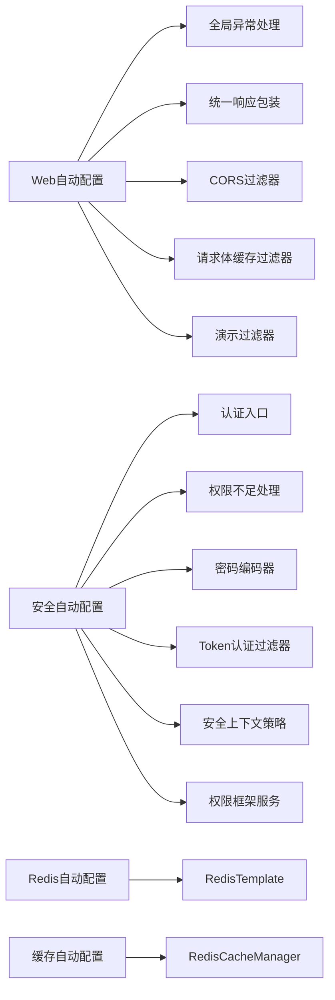

# Starter组件

<cite>
**本文引用的文件**
- [pandora-spring-boot-starter-web/src/main/resources/META-INF/spring/org.springframework.boot.autoconfigure.AutoConfiguration.imports](file://pandora-framework/pandora-spring-boot-starter-web/src/main/resources/META-INF/spring/org.springframework.boot.autoconfigure.AutoConfiguration.imports)
- [pandora-spring-boot-starter-security/src/main/resources/META-INF/spring/org.springframework.boot.autoconfigure.AutoConfiguration.imports](file://pandora-framework/pandora-spring-boot-starter-security/src/main/resources/META-INF/spring/org.springframework.boot.autoconfigure.AutoConfiguration.imports)
- [pandora-spring-boot-starter-redis/src/main/resources/META-INF/spring/org.springframework.boot.autoconfigure.AutoConfiguration.imports](file://pandora-framework/pandora-spring-boot-starter-redis/src/main/resources/META-INF/spring/org.springframework.boot.autoconfigure.AutoConfiguration.imports)
- [PandoraWebAutoConfiguration.java](file://pandora-framework/pandora-spring-boot-starter-web/src/main/java/net/ittimeline/pandora/framework/web/config/PandoraWebAutoConfiguration.java)
- [WebProperties.java](file://pandora-framework/pandora-spring-boot-starter-web/src/main/java/net/ittimeline/pandora/framework/web/config/WebProperties.java)
- [PandoraXssAutoConfiguration.java](file://pandora-framework/pandora-spring-boot-starter-web/src/main/java/net/ittimeline/pandora/framework/xss/config/PandoraXssAutoConfiguration.java)
- [XssProperties.java](file://pandora-framework/pandora-spring-boot-starter-web/src/main/java/net/ittimeline/pandora/framework/xss/config/XssProperties.java)
- [PandoraApiEncryptAutoConfiguration.java](file://pandora-framework/pandora-spring-boot-starter-web/src/main/java/net/ittimeline/pandora/framework/encrypt/config/PandoraApiEncryptAutoConfiguration.java)
- [ApiEncryptProperties.java](file://pandora-framework/pandora-spring-boot-starter-web/src/main/java/net/ittimeline/pandora/framework/encrypt/config/ApiEncryptProperties.java)
- [PandoraApiLogAutoConfiguration.java](file://pandora-framework/pandora-spring-boot-starter-web/src/main/java/net/ittimeline/pandora/framework/apilog/config/PandoraApiLogAutoConfiguration.java)
- [PandoraSwaggerAutoConfiguration.java](file://pandora-framework/pandora-spring-boot-starter-web/src/main/java/net/ittimeline/pandora/framework/swagger/config/PandoraSwaggerAutoConfiguration.java)
- [SwaggerProperties.java](file://pandora-framework/pandora-spring-boot-starter-web/src/main/java/net/ittimeline/pandora/framework/swagger/config/SwaggerProperties.java)
- [PandoraBannerAutoConfiguration.java](file://pandora-framework/pandora-spring-boot-starter-web/src/main/java/net/ittimeline/pandora/framework/banner/config/PandoraBannerAutoConfiguration.java)
- [PandoraJacksonAutoConfiguration.java](file://pandora-framework/pandora-spring-boot-starter-web/src/main/java/net/ittimeline/pandora/framework/jackson/config/PandoraJacksonAutoConfiguration.java)
- [PandoraSecurityAutoConfiguration.java](file://pandora-framework/pandora-spring-boot-starter-security/src/main/java/net/ittimeline/pandora/framework/security/config/PandoraSecurityAutoConfiguration.java)
- [SecurityProperties.java](file://pandora-framework/pandora-spring-boot-starter-security/src/main/java/net/ittimeline/pandora/framework/security/config/SecurityProperties.java)
- [PandoraOperateLogConfiguration.java](file://pandora-framework/pandora-spring-boot-starter-security/src/main/java/net/ittimeline/pandora/framework/operatelog/config/PandoraOperateLogConfiguration.java)
- [PandoraOperateLogRpcAutoConfiguration.java](file://pandora-framework/pandora-spring-boot-starter-security/src/main/java/net/ittimeline/pandora/framework/operatelog/config/PandoraOperateLogRpcAutoConfiguration.java)
- [PandoraRedisAutoConfiguration.java](file://pandora-framework/pandora-spring-boot-starter-redis/src/main/java/net/ittimeline/pandora/framework/redis/config/PandoraRedisAutoConfiguration.java)
- [PandoraCacheAutoConfiguration.java](file://pandora-framework/pandora-spring-boot-starter-redis/src/main/java/net/ittimeline/pandora/framework/redis/config/PandoraCacheAutoConfiguration.java)
- [PandoraCacheProperties.java](file://pandora-framework/pandora-spring-boot-starter-redis/src/main/java/net/ittimeline/pandora/framework/redis/config/PandoraCacheProperties.java)
- [TimeoutRedisCacheManager.java](file://pandora-framework/pandora-spring-boot-starter-redis/src/main/java/net/ittimeline/pandora/framework/redis/core/TimeoutRedisCacheManager.java)
</cite>

## 目录
1. [简介](#简介)
2. [项目结构](#项目结构)
3. [核心组件](#核心组件)
4. [架构总览](#架构总览)
5. [详细组件分析](#详细组件分析)
6. [依赖分析](#依赖分析)
7. [性能考虑](#性能考虑)
8. [故障排查指南](#故障排查指南)
9. [结论](#结论)
10. [附录](#附录)

## 简介
本文件面向Pandora Cloud的Spring Boot Starter组件，系统性梳理并说明以下四个Starter的能力与使用方式：
- Web启动器：提供全局异常处理、API访问日志、XSS防护、API加解密、跨域、统一响应包装、Swagger/OpenAPI文档、Banner启动提示、Jackson时间序列化增强等能力。
- 安全启动器：提供基于Spring Security的认证入口、权限不足处理、BCrypt密码编码器、Token认证过滤器、安全上下文策略、操作日志记录与RPC集成。
- Redis启动器：提供基于Redis的缓存管理（含过期策略）、分布式锁（基于Redisson）、JSON序列化优化、租户隔离键前缀等。
- RPC启动器：提供服务间调用的通用拦截器与上下文透传能力（当前仓库中RPC模块暂未包含具体实现代码，本文仅基于导入清单说明其定位）。

## 项目结构
四个Starter均通过Spring Boot的自动装配机制加载，核心由AutoConfiguration.imports文件声明。下图展示Starter与自动配置类的关系：

图表来源
- [pandora-spring-boot-starter-web/src/main/resources/META-INF/spring/org.springframework.boot.autoconfigure.AutoConfiguration.imports:1-8](file://pandora-framework/pandora-spring-boot-starter-web/src/main/resources/META-INF/spring/org.springframework.boot.autoconfigure.AutoConfiguration.imports#L1-L8)
- [pandora-spring-boot-starter-security/src/main/resources/META-INF/spring/org.springframework.boot.autoconfigure.AutoConfiguration.imports:1-6](file://pandora-framework/pandora-spring-boot-starter-security/src/main/resources/META-INF/spring/org.springframework.boot.autoconfigure.AutoConfiguration.imports#L1-L6)
- [pandora-spring-boot-starter-redis/src/main/resources/META-INF/spring/org.springframework.boot.autoconfigure.AutoConfiguration.imports:1-2](file://pandora-framework/pandora-spring-boot-starter-redis/src/main/resources/META-INF/spring/org.springframework.boot.autoconfigure.AutoConfiguration.imports#L1-L2)

章节来源
- [pandora-spring-boot-starter-web/src/main/resources/META-INF/spring/org.springframework.boot.autoconfigure.AutoConfiguration.imports:1-8](file://pandora-framework/pandora-spring-boot-starter-web/src/main/resources/META-INF/spring/org.springframework.boot.autoconfigure.AutoConfiguration.imports#L1-L8)
- [pandora-spring-boot-starter-security/src/main/resources/META-INF/spring/org.springframework.boot.autoconfigure.AutoConfiguration.imports:1-6](file://pandora-framework/pandora-spring-boot-starter-security/src/main/resources/META-INF/spring/org.springframework.boot.autoconfigure.AutoConfiguration.imports#L1-L6)
- [pandora-spring-boot-starter-redis/src/main/resources/META-INF/spring/org.springframework.boot.autoconfigure.AutoConfiguration.imports:1-2](file://pandora-framework/pandora-spring-boot-starter-redis/src/main/resources/META-INF/spring/org.springframework.boot.autoconfigure.AutoConfiguration.imports#L1-L2)

## 核心组件
本节对四大Starter的关键组件进行要点归纳，并给出配置属性与使用建议。

- Web启动器
  - 全局异常处理：注册全局异常处理器，统一错误响应并可上报错误日志。
  - API访问日志：过滤器+拦截器组合，记录请求耗时、参数、状态码等。
  - XSS防护：基于Jsoup的清理器与JSON反序列化器，支持路径匹配白名单。
  - API加解密：请求/响应加解密过滤器，结合注解控制加解密范围。
  - 跨域支持：内置CORS过滤器，可配置允许的源、头、方法。
  - 统一响应包装：统一返回体包装器，便于前后端一致处理。
  - Swagger/OpenAPI：Knife4j增强、分组与安全头参数注入、OperationId自定义。
  - Banner与Jackson：应用启动横幅与时间类型序列化增强。
  - 配置属性：WebProperties（API前缀、UI地址）、XssProperties、ApiEncryptProperties、SwaggerProperties等。

- 安全启动器
  - 认证入口与权限处理：认证失败与权限不足处理器。
  - 密码编码器：BCrypt，支持复杂度配置。
  - Token认证过滤器：基于Header或参数提取令牌，校验有效性。
  - 安全上下文策略：线程本地上下文策略，支持多租户/分布式场景。
  - 权限框架服务：基于Feign的权限API封装。
  - 操作日志：记录用户操作行为，支持RPC集成。

- Redis启动器
  - RedisTemplate：字符串Key + JSON Value序列化，支持LocalDateTime序列化。
  - 缓存管理：基于Redis的CacheManager，支持TTL、空值缓存开关、键前缀策略。
  - 分布式锁：通过Redisson自动配置提供，Starter内定义RedisTemplate优先。
  - 配置属性：CacheProperties、PandoraCacheProperties（扫描批大小等）。

- RPC启动器
  - 当前仓库中RPC模块未包含具体实现代码，但通过AutoConfiguration.imports声明了RPC相关自动配置的存在，用于后续扩展服务间调用的通用拦截与上下文透传。

章节来源
- [PandoraWebAutoConfiguration.java:43-176](file://pandora-framework/pandora-spring-boot-starter-web/src/main/java/net/ittimeline/pandora/framework/web/config/PandoraWebAutoConfiguration.java#L43-L176)
- [WebProperties.java:18-67](file://pandora-framework/pandora-spring-boot-starter-web/src/main/java/net/ittimeline/pandora/framework/web/config/WebProperties.java#L18-L67)
- [PandoraXssAutoConfiguration.java:27-68](file://pandora-framework/pandora-spring-boot-starter-web/src/main/java/net/ittimeline/pandora/framework/xss/config/PandoraXssAutoConfiguration.java#L27-L68)
- [PandoraApiEncryptAutoConfiguration.java:24-39](file://pandora-framework/pandora-spring-boot-starter-web/src/main/java/net/ittimeline/pandora/framework/encrypt/config/PandoraApiEncryptAutoConfiguration.java#L24-L39)
- [PandoraApiLogAutoConfiguration.java:24-50](file://pandora-framework/pandora-spring-boot-starter-web/src/main/java/net/ittimeline/pandora/framework/apilog/config/PandoraApiLogAutoConfiguration.java#L24-L50)
- [PandoraSwaggerAutoConfiguration.java:50-189](file://pandora-framework/pandora-spring-boot-starter-web/src/main/java/net/ittimeline/pandora/framework/swagger/config/PandoraSwaggerAutoConfiguration.java#L50-L189)
- [PandoraBannerAutoConfiguration.java:13-19](file://pandora-framework/pandora-spring-boot-starter-web/src/main/java/net/ittimeline/pandora/framework/banner/config/PandoraBannerAutoConfiguration.java#L13-L19)
- [PandoraJacksonAutoConfiguration.java:30-83](file://pandora-framework/pandora-spring-boot-starter-web/src/main/java/net/ittimeline/pandora/framework/jackson/config/PandoraJacksonAutoConfiguration.java#L30-L83)
- [PandoraSecurityAutoConfiguration.java:36-98](file://pandora-framework/pandora-spring-boot-starter-security/src/main/java/net/ittimeline/pandora/framework/security/config/PandoraSecurityAutoConfiguration.java#L36-L98)
- [SecurityProperties.java:19-57](file://pandora-framework/pandora-spring-boot-starter-security/src/main/java/net/ittimeline/pandora/framework/security/config/SecurityProperties.java#L19-L57)
- [PandoraOperateLogConfiguration.java](file://pandora-framework/pandora-spring-boot-starter-security/src/main/java/net/ittimeline/pandora/framework/operatelog/config/PandoraOperateLogConfiguration.java)
- [PandoraOperateLogRpcAutoConfiguration.java](file://pandora-framework/pandora-spring-boot-starter-security/src/main/java/net/ittimeline/pandora/framework/operatelog/config/PandoraOperateLogRpcAutoConfiguration.java)
- [PandoraRedisAutoConfiguration.java:19-49](file://pandora-framework/pandora-spring-boot-starter-redis/src/main/java/net/ittimeline/pandora/framework/redis/config/PandoraRedisAutoConfiguration.java#L19-L49)
- [PandoraCacheAutoConfiguration.java:31-84](file://pandora-framework/pandora-spring-boot-starter-redis/src/main/java/net/ittimeline/pandora/framework/redis/config/PandoraCacheAutoConfiguration.java#L31-L84)
- [PandoraCacheProperties.java](file://pandora-framework/pandora-spring-boot-starter-redis/src/main/java/net/ittimeline/pandora/framework/redis/config/PandoraCacheProperties.java)
- [TimeoutRedisCacheManager.java](file://pandora-framework/pandora-spring-boot-starter-redis/src/main/java/net/ittimeline/pandora/framework/redis/core/TimeoutRedisCacheManager.java)

## 架构总览
下图展示Web启动器在请求链路中的关键组件交互，体现过滤器、拦截器、全局异常处理与统一响应包装的协作关系：

图表来源
- [PandoraWebAutoConfiguration.java:116-176](file://pandora-framework/pandora-spring-boot-starter-web/src/main/java/net/ittimeline/pandora/framework/web/config/PandoraWebAutoConfiguration.java#L116-L176)
- [PandoraApiLogAutoConfiguration.java:24-50](file://pandora-framework/pandora-spring-boot-starter-web/src/main/java/net/ittimeline/pandora/framework/apilog/config/PandoraApiLogAutoConfiguration.java#L24-L50)
- [PandoraXssAutoConfiguration.java:62-66](file://pandora-framework/pandora-spring-boot-starter-web/src/main/java/net/ittimeline/pandora/framework/xss/config/PandoraXssAutoConfiguration.java#L62-L66)
- [PandoraApiEncryptAutoConfiguration.java:29-38](file://pandora-framework/pandora-spring-boot-starter-web/src/main/java/net/ittimeline/pandora/framework/encrypt/config/PandoraApiEncryptAutoConfiguration.java#L29-L38)

## 详细组件分析

### Web启动器
- 自动配置机制
  - 通过AutoConfiguration.imports声明多个自动配置类，按顺序加载，确保跨域、日志、XSS、加解密、Swagger、Banner、Jackson等组件协同工作。
  - Web自动配置在特定阶段前置加载，避免与其他组件初始化顺序冲突。
- 关键Bean与职责
  - WebMvcRegistrations：为不同包下的Controller设置统一前缀，实现API前缀隔离。
  - 全局异常处理：统一捕获异常并上报错误日志。
  - 统一响应包装：对响应体进行统一封装。
  - CORS过滤器：解决跨域问题。
  - 请求体缓存过滤器：支持重复读取请求体。
  - RestTemplate：提供普通与负载均衡两种实例。
- 配置属性
  - WebProperties：定义app/admin API前缀与Controller包匹配规则、Admin UI地址。
  - XssProperties：启用开关、路径匹配、清洗策略等。
  - ApiEncryptProperties：启用开关、加解密算法、白名单路径等。
  - SwaggerProperties：标题、描述、版本、作者、许可证、安全方案等。
- 使用方法
  - 引入starter后，默认启用Web相关能力；可通过对应配置项调整行为。
  - 如需开启演示模式，设置演示开关；如需启用API加解密，按需开启并配置白名单路径。

图表来源
- [WebProperties.java:18-67](file://pandora-framework/pandora-spring-boot-starter-web/src/main/java/net/ittimeline/pandora/framework/web/config/WebProperties.java#L18-L67)

章节来源
- [pandora-spring-boot-starter-web/src/main/resources/META-INF/spring/org.springframework.boot.autoconfigure.AutoConfiguration.imports:1-8](file://pandora-framework/pandora-spring-boot-starter-web/src/main/resources/META-INF/spring/org.springframework.boot.autoconfigure.AutoConfiguration.imports#L1-L8)
- [PandoraWebAutoConfiguration.java:43-176](file://pandora-framework/pandora-spring-boot-starter-web/src/main/java/net/ittimeline/pandora/framework/web/config/PandoraWebAutoConfiguration.java#L43-L176)
- [WebProperties.java:18-67](file://pandora-framework/pandora-spring-boot-starter-web/src/main/java/net/ittimeline/pandora/framework/web/config/WebProperties.java#L18-L67)

### 安全启动器
- 自动配置机制
  - 安全自动配置在Spring Security之前加载，确保自定义策略生效。
  - 通过@EnableFeignClients启用权限与OAuth2相关API。
- 关键Bean与职责
  - 认证入口与权限不足处理器：统一处理未认证与权限不足。
  - BCrypt密码编码器：可配置复杂度。
  - Token认证过滤器：从Header或参数解析令牌并校验。
  - 安全上下文策略：使用线程本地策略，支持多租户/分布式场景。
  - 权限框架服务：基于Feign封装权限API。
  - 操作日志：记录用户操作行为，支持RPC集成。
- 配置属性
  - SecurityProperties：令牌Header/参数、Mock开关与密钥、免登录URL列表、密码编码复杂度等。

图表来源
- [SecurityProperties.java:19-57](file://pandora-framework/pandora-spring-boot-starter-security/src/main/java/net/ittimeline/pandora/framework/security/config/SecurityProperties.java#L19-L57)

章节来源
- [pandora-spring-boot-starter-security/src/main/resources/META-INF/spring/org.springframework.boot.autoconfigure.AutoConfiguration.imports:1-6](file://pandora-framework/pandora-spring-boot-starter-security/src/main/resources/META-INF/spring/org.springframework.boot.autoconfigure.AutoConfiguration.imports#L1-L6)
- [PandoraSecurityAutoConfiguration.java:36-98](file://pandora-framework/pandora-spring-boot-starter-security/src/main/java/net/ittimeline/pandora/framework/security/config/PandoraSecurityAutoConfiguration.java#L36-L98)
- [SecurityProperties.java:19-57](file://pandora-framework/pandora-spring-boot-starter-security/src/main/java/net/ittimeline/pandora/framework/security/config/SecurityProperties.java#L19-L57)

### Redis启动器
- 自动配置机制
  - Redis自动配置在Redisson之前加载，确保自定义RedisTemplate优先。
  - 缓存自动配置启用@EnableCaching，整合Spring Cache与Redis。
- 关键Bean与职责
  - RedisTemplate：字符串Key + JSON Value序列化，支持LocalDateTime序列化。
  - RedisCacheConfiguration：统一TTL、空值缓存、键前缀策略。
  - RedisCacheManager：基于非阻塞写入与扫描批大小的缓存管理器。
  - TimeoutRedisCacheManager：支持过期策略的缓存管理器。
- 配置属性
  - CacheProperties：Spring Boot默认缓存配置。
  - PandoraCacheProperties：扫描批大小等扩展配置。

图表来源
- [PandoraCacheProperties.java](file://pandora-framework/pandora-spring-boot-starter-redis/src/main/java/net/ittimeline/pandora/framework/redis/config/PandoraCacheProperties.java)
- [TimeoutRedisCacheManager.java](file://pandora-framework/pandora-spring-boot-starter-redis/src/main/java/net/ittimeline/pandora/framework/redis/core/TimeoutRedisCacheManager.java)
- [PandoraCacheAutoConfiguration.java:31-84](file://pandora-framework/pandora-spring-boot-starter-redis/src/main/java/net/ittimeline/pandora/framework/redis/config/PandoraCacheAutoConfiguration.java#L31-L84)

章节来源
- [pandora-spring-boot-starter-redis/src/main/resources/META-INF/spring/org.springframework.boot.autoconfigure.AutoConfiguration.imports:1-2](file://pandora-framework/pandora-spring-boot-starter-redis/src/main/resources/META-INF/spring/org.springframework.boot.autoconfigure.AutoConfiguration.imports#L1-L2)
- [PandoraRedisAutoConfiguration.java:19-49](file://pandora-framework/pandora-spring-boot-starter-redis/src/main/java/net/ittimeline/pandora/framework/redis/config/PandoraRedisAutoConfiguration.java#L19-L49)
- [PandoraCacheAutoConfiguration.java:31-84](file://pandora-framework/pandora-spring-boot-starter-redis/src/main/java/net/ittimeline/pandora/framework/redis/config/PandoraCacheAutoConfiguration.java#L31-L84)
- [PandoraCacheProperties.java](file://pandora-framework/pandora-spring-boot-starter-redis/src/main/java/net/ittimeline/pandora/framework/redis/config/PandoraCacheProperties.java)

### RPC启动器
- 自动配置机制
  - 通过AutoConfiguration.imports声明RPC相关自动配置，用于后续扩展服务间调用的通用拦截与上下文透传。
- 使用说明
  - 当前仓库未包含具体实现代码，请在引入RPC starter后，按需添加服务接口与拦截器逻辑。

章节来源
- [pandora-spring-boot-starter-security/src/main/resources/META-INF/spring/org.springframework.boot.autoconfigure.AutoConfiguration.imports:1-6](file://pandora-framework/pandora-spring-boot-starter-security/src/main/resources/META-INF/spring/org.springframework.boot.autoconfigure.AutoConfiguration.imports#L1-L6)

## 依赖分析
- Web启动器内部依赖
  - Web自动配置依赖全局异常处理、统一响应包装、RestTemplate、CORS过滤器、请求体缓存过滤器、演示过滤器等。
  - 日志、XSS、加解密、Swagger、Banner、Jackson等自动配置按顺序加载，互不冲突。
- 安全启动器依赖
  - 安全自动配置依赖认证入口、权限不足处理器、密码编码器、Token认证过滤器、安全上下文策略、权限框架服务。
  - 操作日志自动配置依赖日志API与RPC自动配置。
- Redis启动器依赖
  - Redis自动配置依赖Redisson自动配置，确保自定义RedisTemplate优先。
  - 缓存自动配置依赖CacheProperties与PandoraCacheProperties。

图表来源
- [PandoraWebAutoConfiguration.java:93-176](file://pandora-framework/pandora-spring-boot-starter-web/src/main/java/net/ittimeline/pandora/framework/web/config/PandoraWebAutoConfiguration.java#L93-L176)
- [PandoraSecurityAutoConfiguration.java:47-98](file://pandora-framework/pandora-spring-boot-starter-security/src/main/java/net/ittimeline/pandora/framework/security/config/PandoraSecurityAutoConfiguration.java#L47-L98)
- [PandoraRedisAutoConfiguration.java:25-46](file://pandora-framework/pandora-spring-boot-starter-redis/src/main/java/net/ittimeline/pandora/framework/redis/config/PandoraRedisAutoConfiguration.java#L25-L46)
- [PandoraCacheAutoConfiguration.java:73-83](file://pandora-framework/pandora-spring-boot-starter-redis/src/main/java/net/ittimeline/pandora/framework/redis/config/PandoraCacheAutoConfiguration.java#L73-L83)

## 性能考虑
- Web启动器
  - 过滤器链顺序：跨域过滤器需优先执行，避免配置不生效。
  - 请求体缓存：重复读取请求体可能带来内存压力，建议在必要接口启用。
  - 统一响应包装：避免额外序列化开销，保持轻量。
- 安全启动器
  - BCrypt复杂度：复杂度越高，验证越慢，需根据硬件与安全需求平衡。
  - Token认证过滤器：建议配合短有效期与刷新机制，降低令牌泄露风险。
- Redis启动器
  - JSON序列化：LocalDateTime序列化模块已注册，减少序列化损耗。
  - 缓存扫描批大小：适当增大可提升批量操作性能，但需评估内存占用。
  - 非阻塞写入：RedisCacheWriter采用非阻塞写入，适合高并发场景。

## 故障排查指南
- Web启动器
  - 跨域不生效：检查过滤器顺序是否正确，确认CORS配置已在Web自动配置中优先加载。
  - 请求体为空：确认请求体缓存过滤器是否生效，以及是否在需要的接口启用。
  - API前缀不生效：检查WebProperties中app/admin API前缀与Controller包匹配规则。
- 安全启动器
  - 未认证/权限不足：检查认证入口与权限不足处理器是否被正确注册。
  - 密码编码失败：确认BCrypt复杂度配置合理，避免过高导致性能问题。
  - Token无效：检查令牌Header/参数配置与前端传递方式是否一致。
- Redis启动器
  - 序列化异常：确认LocalDateTime序列化模块已注册，避免时间字段序列化失败。
  - 缓存未命中：检查键前缀策略与TTL配置，确认Redis连接正常。

章节来源
- [PandoraWebAutoConfiguration.java:116-176](file://pandora-framework/pandora-spring-boot-starter-web/src/main/java/net/ittimeline/pandora/framework/web/config/PandoraWebAutoConfiguration.java#L116-L176)
- [PandoraSecurityAutoConfiguration.java:47-98](file://pandora-framework/pandora-spring-boot-starter-security/src/main/java/net/ittimeline/pandora/framework/security/config/PandoraSecurityAutoConfiguration.java#L47-L98)
- [PandoraRedisAutoConfiguration.java:25-46](file://pandora-framework/pandora-spring-boot-starter-redis/src/main/java/net/ittimeline/pandora/framework/redis/config/PandoraRedisAutoConfiguration.java#L25-L46)

## 结论
Pandora Cloud的四个Starter通过Spring Boot自动装配机制实现了Web、安全、Redis与RPC能力的快速落地。Web启动器提供完善的请求处理链路与可观测性；安全启动器提供认证授权与操作日志；Redis启动器提供高性能缓存与分布式能力；RPC启动器为后续服务间通信预留扩展空间。建议在生产环境中结合配置属性与实际业务场景，按需启用各项能力并关注性能与安全。

## 附录
- 配置示例与使用场景
  - Web启动器
    - API前缀：为admin/app分别设置前缀与Controller包匹配规则，避免外部直接暴露。
    - 访问日志：默认启用，可通过配置项关闭或调整。
    - XSS防护：默认启用，可按路径匹配白名单控制。
    - API加解密：按需开启，配置白名单路径与算法。
  - 安全启动器
    - 令牌Header/参数：与前端约定一致。
    - Mock模式：测试环境可开启，注意配置密钥。
    - 权限框架：通过Feign对接权限API。
  - Redis启动器
    - RedisTemplate：默认JSON序列化，支持LocalDateTime。
    - 缓存管理：统一TTL、空值缓存与键前缀策略。
    - 分布式锁：通过Redisson自动配置提供。
  - RPC启动器
    - 通过导入清单声明，后续扩展服务间调用拦截与上下文透传。