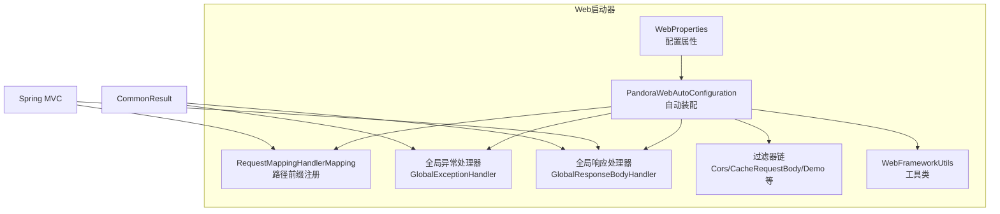
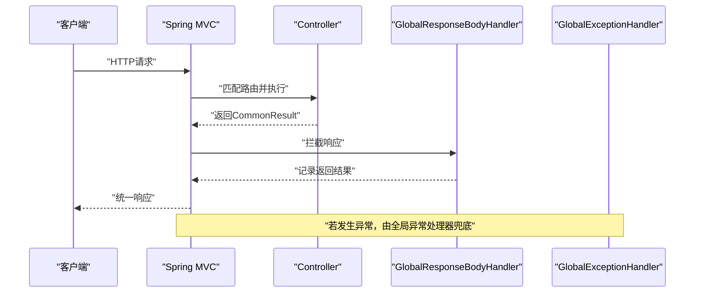
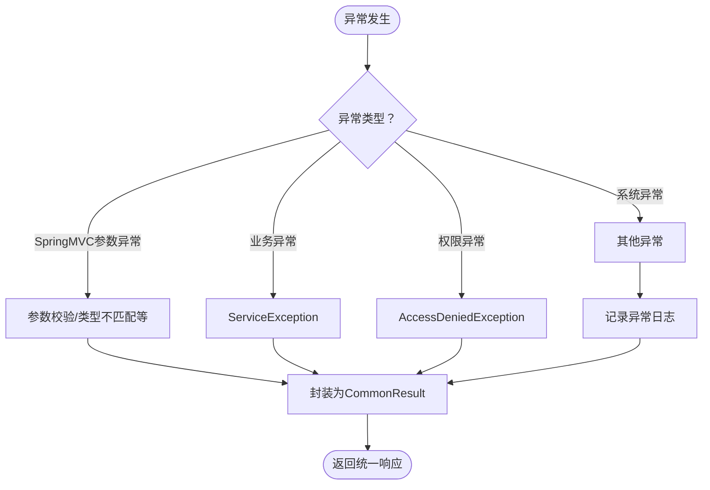
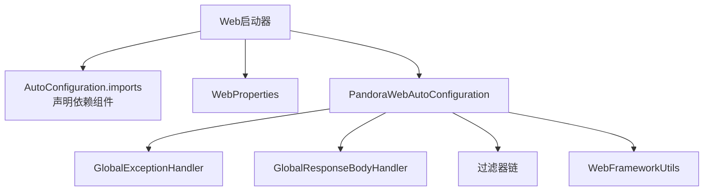
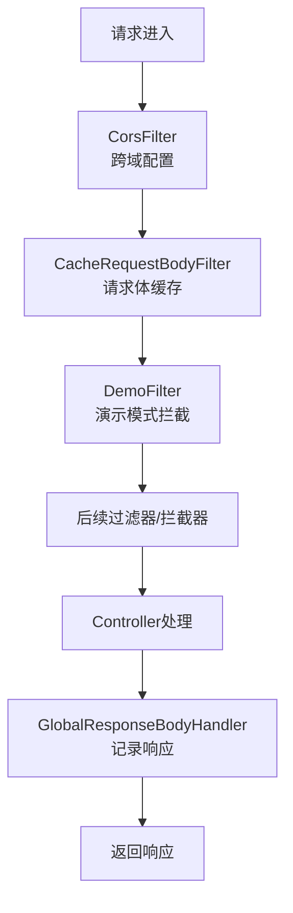

# Web启动器

<cite>
**本文引用的文件**
- [WebProperties.java](file://pandora-framework/pandora-spring-boot-starter-web/src/main/java/net/ittimeline/pandora/framework/web/config/WebProperties.java)
- [PandoraWebAutoConfiguration.java](file://pandora-framework/pandora-spring-boot-starter-web/src/main/java/net/ittimeline/pandora/framework/web/config/PandoraWebAutoConfiguration.java)
- [GlobalExceptionHandler.java](file://pandora-framework/pandora-spring-boot-starter-web/src/main/java/net/ittimeline/pandora/framework/web/core/handler/GlobalExceptionHandler.java)
- [GlobalResponseBodyHandler.java](file://pandora-framework/pandora-spring-boot-starter-web/src/main/java/net/ittimeline/pandora/framework/web/core/handler/GlobalResponseBodyHandler.java)
- [ApiRequestFilter.java](file://pandora-framework/pandora-spring-boot-starter-web/src/main/java/net/ittimeline/pandora/framework/web/core/filter/ApiRequestFilter.java)
- [DemoFilter.java](file://pandora-framework/pandora-spring-boot-starter-web/src/main/java/net/ittimeline/pandora/framework/web/core/filter/DemoFilter.java)
- [CacheRequestBodyFilter.java](file://pandora-framework/pandora-spring-boot-starter-web/src/main/java/net/ittimeline/pandora/framework/web/core/filter/CacheRequestBodyFilter.java)
- [CacheRequestBodyWrapper.java](file://pandora-framework/pandora-spring-boot-starter-web/src/main/java/net/ittimeline/pandora/framework/web/core/filter/CacheRequestBodyWrapper.java)
- [WebFilterOrderConstants.java](file://pandora-framework/pandora-common/src/main/java/net/ittimeline/pandora/framework/common/constants/WebFilterOrderConstants.java)
- [WebFrameworkUtils.java](file://pandora-framework/pandora-spring-boot-starter-web/src/main/java/net/ittimeline/pandora/framework/web/core/util/WebFrameworkUtils.java)
- [CommonResult.java](file://pandora-framework/pandora-common/src/main/java/net/ittimeline/pandora/framework/common/pojo/CommonResult.java)
- [org.springframework.boot.autoconfigure.AutoConfiguration.imports](file://pandora-framework/pandora-spring-boot-starter-web/src/main/resources/META-INF/spring/org.springframework.boot.autoconfigure.AutoConfiguration.imports)
</cite>

## 目录
1. [简介](#简介)
2. [项目结构](#项目结构)
3. [核心组件](#核心组件)
4. [架构总览](#架构总览)
5. [详细组件分析](#详细组件分析)
6. [依赖分析](#依赖分析)
7. [性能考虑](#性能考虑)
8. [故障排查指南](#故障排查指南)
9. [结论](#结论)
10. [附录](#附录)

## 简介
本文件面向“Pandora Cloud Web启动器”，系统性阐述其核心功能与自动配置机制，涵盖：
- 全局异常处理与统一响应包装
- API请求过滤与演示模式
- 跨域配置与过滤器链执行顺序
- WebProperties配置属性详解与使用场景
- 与Spring MVC的集成方式及常见问题定位

目标是帮助开发者快速理解并正确使用Web启动器的各项能力，同时提供可落地的配置示例与最佳实践。

## 项目结构
Web启动器位于pandora-spring-boot-starter-web模块，采用“自动装配 + 配置属性 + 过滤器链 + 全局处理器”的分层设计，通过AutoConfiguration自动注册Bean，结合WebProperties集中管理Web相关配置。

图表来源
- [PandoraWebAutoConfiguration.java:43-91](file://pandora-framework/pandora-spring-boot-starter-web/src/main/java/net/ittimeline/pandora/framework/web/config/PandoraWebAutoConfiguration.java#L43-L91)
- [WebProperties.java:18-28](file://pandora-framework/pandora-spring-boot-starter-web/src/main/java/net/ittimeline/pandora/framework/web/config/WebProperties.java#L18-L28)
- [GlobalExceptionHandler.java:57-120](file://pandora-framework/pandora-spring-boot-starter-web/src/main/java/net/ittimeline/pandora/framework/web/core/handler/GlobalExceptionHandler.java#L57-L120)
- [GlobalResponseBodyHandler.java:25-46](file://pandora-framework/pandora-spring-boot-starter-web/src/main/java/net/ittimeline/pandora/framework/web/core/handler/GlobalResponseBodyHandler.java#L25-L46)
- [WebFrameworkUtils.java:22-42](file://pandora-framework/pandora-spring-boot-starter-web/src/main/java/net/ittimeline/pandora/framework/web/core/util/WebFrameworkUtils.java#L22-L42)
- [CommonResult.java:21-94](file://pandora-framework/pandora-common/src/main/java/net/ittimeline/pandora/framework/common/pojo/CommonResult.java#L21-L94)

章节来源
- [org.springframework.boot.autoconfigure.AutoConfiguration.imports:1-8](file://pandora-framework/pandora-spring-boot-starter-web/src/main/resources/META-INF/spring/org.springframework.boot.autoconfigure.AutoConfiguration.imports#L1-L8)

## 核心组件
- WebProperties：集中定义API前缀、控制器包匹配规则、UI地址等，作为自动装配与路径前缀注册的依据。
- PandoraWebAutoConfiguration：负责注册RequestMappingHandlerMapping、全局异常处理器、全局响应处理器、过滤器链、RestTemplate等。
- GlobalExceptionHandler：统一捕获并翻译各类异常为CommonResult格式，同时异步记录异常日志。
- GlobalResponseBodyHandler：拦截返回类型为CommonResult的响应，便于访问日志等后续处理。
- 过滤器链：包括跨域过滤器、请求体缓存过滤器、演示模式过滤器等，按固定顺序执行。
- WebFrameworkUtils：提供登录用户识别、终端类型、RPC判断等工具方法。
- CommonResult：统一响应载体，包含code、msg、data三要素。

章节来源
- [WebProperties.java:18-67](file://pandora-framework/pandora-spring-boot-starter-web/src/main/java/net/ittimeline/pandora/framework/web/config/WebProperties.java#L18-L67)
- [PandoraWebAutoConfiguration.java:43-176](file://pandora-framework/pandora-spring-boot-starter-web/src/main/java/net/ittimeline/pandora/framework/web/config/PandoraWebAutoConfiguration.java#L43-L176)
- [GlobalExceptionHandler.java:57-453](file://pandora-framework/pandora-spring-boot-starter-web/src/main/java/net/ittimeline/pandora/framework/web/core/handler/GlobalExceptionHandler.java#L57-L453)
- [GlobalResponseBodyHandler.java:25-46](file://pandora-framework/pandora-spring-boot-starter-web/src/main/java/net/ittimeline/pandora/framework/web/core/handler/GlobalResponseBodyHandler.java#L25-L46)
- [WebFrameworkUtils.java:22-181](file://pandora-framework/pandora-spring-boot-starter-web/src/main/java/net/ittimeline/pandora/framework/web/core/util/WebFrameworkUtils.java#L22-L181)
- [CommonResult.java:21-122](file://pandora-framework/pandora-common/src/main/java/net/ittimeline/pandora/framework/common/pojo/CommonResult.java#L21-L122)

## 架构总览
Web启动器通过自动装配在应用启动时完成以下关键动作：
- 为Controller映射统一添加前缀，实现API隔离与安全暴露控制
- 注册全局异常处理器与全局响应处理器，确保所有异常与响应格式一致
- 注册过滤器链，覆盖跨域、请求体复读、演示模式等场景
- 提供工具类与配置属性，支撑运行期行为与开发期配置

图表来源
- [PandoraWebAutoConfiguration.java:56-91](file://pandora-framework/pandora-spring-boot-starter-web/src/main/java/net/ittimeline/pandora/framework/web/config/PandoraWebAutoConfiguration.java#L56-L91)
- [GlobalResponseBodyHandler.java:29-44](file://pandora-framework/pandora-spring-boot-starter-web/src/main/java/net/ittimeline/pandora/framework/web/core/handler/GlobalResponseBodyHandler.java#L29-L44)
- [GlobalExceptionHandler.java:79-120](file://pandora-framework/pandora-spring-boot-starter-web/src/main/java/net/ittimeline/pandora/framework/web/core/handler/GlobalExceptionHandler.java#L79-L120)

## 详细组件分析

### WebProperties配置属性
- 作用：集中管理Web相关配置，包括API前缀、控制器包匹配规则、UI地址等。
- 关键点：
  - appApi/adminApi：分别定义前端与后台API的前缀与控制器包匹配规则，用于自动装配阶段为RequestMappingHandlerMapping设置路径前缀。
  - adminUi：定义后台UI访问地址。
- 使用建议：
  - 通过application.yml设置pandora.web.app-api.prefix、pandora.web.admin-api.prefix等，确保与Nginx或网关路由一致。
  - 控制器包匹配规则使用Ant风格，便于精确限定哪些Controller需要加前缀。

章节来源
- [WebProperties.java:18-67](file://pandora-framework/pandora-spring-boot-starter-web/src/main/java/net/ittimeline/pandora/framework/web/config/WebProperties.java#L18-L67)

### 自动装配与API前缀注册
- RequestMappingHandlerMapping：在自动装配中创建并设置pathPrefixes，将WebProperties中的前缀与控制器包匹配规则绑定。
- 执行时机：启动时完成，无需额外代码。
- 影响范围：仅对标注@RestController且位于指定包内的Controller生效。

章节来源
- [PandoraWebAutoConfiguration.java:56-91](file://pandora-framework/pandora-spring-boot-starter-web/src/main/java/net/ittimeline/pandora/framework/web/config/PandoraWebAutoConfiguration.java#L56-L91)

### 全局异常处理机制
- 覆盖范围：SpringMVC异常、Filter异常、业务异常、权限异常、参数校验异常等。
- 处理策略：
  - 将异常统一翻译为CommonResult格式，保留错误码与提示信息。
  - 对部分异常（如ServiceException）进行差异化处理与日志记录。
  - 对数据库表不存在等特定场景给出模块化提示。
- 与过滤器的关系：提供allExceptionHandler方法，供Filter在非MVC流程中统一兜底。

图表来源
- [GlobalExceptionHandler.java:79-341](file://pandora-framework/pandora-spring-boot-starter-web/src/main/java/net/ittimeline/pandora/framework/web/core/handler/GlobalExceptionHandler.java#L79-L341)
- [CommonResult.java:54-80](file://pandora-framework/pandora-common/src/main/java/net/ittimeline/pandora/framework/common/pojo/CommonResult.java#L54-L80)

章节来源
- [GlobalExceptionHandler.java:57-453](file://pandora-framework/pandora-spring-boot-starter-web/src/main/java/net/ittimeline/pandora/framework/web/core/handler/GlobalExceptionHandler.java#L57-L453)

### 统一响应包装与访问日志
- GlobalResponseBodyHandler：仅拦截返回类型为CommonResult的响应，记录返回结果，便于后续访问日志采集。
- 与Controller协作：Controller返回CommonResult，框架自动记录；避免对业务返回结构的侵入。

章节来源
- [GlobalResponseBodyHandler.java:25-46](file://pandora-framework/pandora-spring-boot-starter-web/src/main/java/net/ittimeline/pandora/framework/web/core/handler/GlobalResponseBodyHandler.java#L25-L46)
- [WebFrameworkUtils.java:141-147](file://pandora-framework/pandora-spring-boot-starter-web/src/main/java/net/ittimeline/pandora/framework/web/core/util/WebFrameworkUtils.java#L141-L147)

### API请求过滤与演示模式
- ApiRequestFilter：抽象基类，根据WebProperties中的API前缀决定是否过滤，仅对/app-api与/admin-api等API请求生效。
- DemoFilter：演示模式专用，仅对POST/PUT/DELETE且已登录的请求进行拦截，直接返回统一错误码，避免误操作破坏测试数据。
- CacheRequestBodyFilter：对JSON请求进行请求体缓存，支持重复读取，排除/admin/与/actuator/等路径。

章节来源
- [ApiRequestFilter.java:15-27](file://pandora-framework/pandora-spring-boot-starter-web/src/main/java/net/ittimeline/pandora/framework/web/core/filter/ApiRequestFilter.java#L15-L27)
- [DemoFilter.java:21-36](file://pandora-framework/pandora-spring-boot-starter-web/src/main/java/net/ittimeline/pandora/framework/web/core/filter/DemoFilter.java#L21-L36)
- [CacheRequestBodyFilter.java:20-48](file://pandora-framework/pandora-spring-boot-starter-web/src/main/java/net/ittimeline/pandora/framework/web/core/filter/CacheRequestBodyFilter.java#L20-L48)
- [CacheRequestBodyWrapper.java:20-79](file://pandora-framework/pandora-spring-boot-starter-web/src/main/java/net/ittimeline/pandora/framework/web/core/filter/CacheRequestBodyWrapper.java#L20-L79)

### 跨域配置与过滤器链顺序
- 跨域：通过CorsFilter对/**路径开放允许凭证、任意源、任意头、任意方法。
- 顺序：WebFilterOrderConstants定义了严格的过滤器执行顺序，确保跨域配置在最前生效，避免被其他过滤器覆盖。
- DemoFilter顺序靠后，仅在开启pandora.demo=true时生效。

章节来源
- [PandoraWebAutoConfiguration.java:116-129](file://pandora-framework/pandora-spring-boot-starter-web/src/main/java/net/ittimeline/pandora/framework/web/config/PandoraWebAutoConfiguration.java#L116-L129)
- [WebFilterOrderConstants.java:11-37](file://pandora-framework/pandora-common/src/main/java/net/ittimeline/pandora/framework/common/constants/WebFilterOrderConstants.java#L11-L37)

### 与Spring MVC的集成方式
- 路由前缀：通过自定义RequestMappingHandlerMapping在映射阶段添加前缀，无需在Controller上重复注解。
- 全局处理器：@RestControllerAdvice与ResponseBodyAdvice配合，保证异常与响应的一致性。
- 过滤器：通过FilterRegistrationBean注册，设置order保证执行顺序。

章节来源
- [PandoraWebAutoConfiguration.java:56-91](file://pandora-framework/pandora-spring-boot-starter-web/src/main/java/net/ittimeline/pandora/framework/web/config/PandoraWebAutoConfiguration.java#L56-L91)
- [PandoraWebAutoConfiguration.java:148-152](file://pandora-framework/pandora-spring-boot-starter-web/src/main/java/net/ittimeline/pandora/framework/web/config/PandoraWebAutoConfiguration.java#L148-L152)

## 依赖分析
- Web启动器自动装配引入banner、jackson、apilog、swagger、xss、encrypt等组件，形成完整的Web生态。
- Web启动器内部依赖：
  - WebProperties：驱动自动装配与路径前缀注册
  - GlobalExceptionHandler/GlobalResponseBodyHandler：统一异常与响应
  - 过滤器链：跨域、请求体缓存、演示模式
  - WebFrameworkUtils：运行期工具方法

图表来源
- [org.springframework.boot.autoconfigure.AutoConfiguration.imports:1-8](file://pandora-framework/pandora-spring-boot-starter-web/src/main/resources/META-INF/spring/org.springframework.boot.autoconfigure.AutoConfiguration.imports#L1-L8)
- [PandoraWebAutoConfiguration.java:43-176](file://pandora-framework/pandora-spring-boot-starter-web/src/main/java/net/ittimeline/pandora/framework/web/config/PandoraWebAutoConfiguration.java#L43-L176)

章节来源
- [org.springframework.boot.autoconfigure.AutoConfiguration.imports:1-8](file://pandora-framework/pandora-spring-boot-starter-web/src/main/resources/META-INF/spring/org.springframework.boot.autoconfigure.AutoConfiguration.imports#L1-L8)

## 性能考虑
- 请求体缓存：CacheRequestBodyFilter会复制请求体字节，对大体积上传有一定内存压力；建议结合Nginx/网关限制上传大小。
- 异常日志：全局异常处理器会异步记录错误日志，避免阻塞主线程；注意日志服务可用性与存储容量。
- 过滤器顺序：严格顺序避免重复跨域配置与不必要的拦截，减少无效处理。
- 统一响应：CommonResult结构简单，序列化开销低；建议避免在data中返回超大数据。

## 故障排查指南
- API前缀不生效
  - 检查WebProperties中appApi/adminApi的prefix与controller配置是否正确。
  - 确认Controller是否位于对应包路径下，且标注@RestController。
- 跨域配置无效
  - 确认CorsFilter顺序为最先执行；检查浏览器Network面板是否收到CORS响应头。
- 演示模式误拦截
  - 确认pandora.demo=true已开启；仅对POST/PUT/DELETE且已登录用户生效。
- 统一响应未生效
  - 确认Controller返回类型为CommonResult；检查GlobalResponseBodyHandler是否被注册。
- 异常未被全局处理
  - 检查GlobalExceptionHandler是否被扫描；确认异常类型是否在处理分支内。

章节来源
- [PandoraWebAutoConfiguration.java:56-91](file://pandora-framework/pandora-spring-boot-starter-web/src/main/java/net/ittimeline/pandora/framework/web/config/PandoraWebAutoConfiguration.java#L56-L91)
- [PandoraWebAutoConfiguration.java:116-129](file://pandora-framework/pandora-spring-boot-starter-web/src/main/java/net/ittimeline/pandora/framework/web/config/PandoraWebAutoConfiguration.java#L116-L129)
- [DemoFilter.java:21-36](file://pandora-framework/pandora-spring-boot-starter-web/src/main/java/net/ittimeline/pandora/framework/web/core/filter/DemoFilter.java#L21-L36)
- [GlobalResponseBodyHandler.java:29-44](file://pandora-framework/pandora-spring-boot-starter-web/src/main/java/net/ittimeline/pandora/framework/web/core/handler/GlobalResponseBodyHandler.java#L29-L44)
- [GlobalExceptionHandler.java:79-120](file://pandora-framework/pandora-spring-boot-starter-web/src/main/java/net/ittimeline/pandora/framework/web/core/handler/GlobalExceptionHandler.java#L79-L120)

## 结论
Pandora Cloud Web启动器通过自动装配与配置属性，实现了API前缀隔离、统一异常与响应、跨域支持、请求体复读与演示模式等核心能力。其清晰的过滤器顺序与与Spring MVC的深度集成，使得开发者能够以最小成本获得一致、安全、可观测的Web体验。

## 附录

### 配置示例与使用场景
- 自定义异常处理器
  - 场景：需要在全局异常处理之外增加特定异常的特殊处理逻辑。
  - 建议：扩展GlobalExceptionHandler或新增@RestControllerAdvice，注意与现有异常处理的兼容性。
  - 参考路径：[GlobalExceptionHandler.java:79-341](file://pandora-framework/pandora-spring-boot-starter-web/src/main/java/net/ittimeline/pandora/framework/web/core/handler/GlobalExceptionHandler.java#L79-L341)
- 配置API前缀
  - 场景：将/app-api与/admin-api前缀与网关/Nginx路由保持一致。
  - 建议：在application.yml中设置pandora.web.app-api.prefix与pandora.web.admin-api.prefix，并确保controller包匹配规则正确。
  - 参考路径：[WebProperties.java:22-25](file://pandora-framework/pandora-spring-boot-starter-web/src/main/java/net/ittimeline/pandora/framework/web/config/WebProperties.java#L22-L25)
- 启用跨域支持
  - 场景：前端与后端分离部署，需要跨域访问。
  - 建议：保持默认跨域配置即可；如需精细化控制，可在生产环境限制具体源与方法。
  - 参考路径：[PandoraWebAutoConfiguration.java:116-129](file://pandora-framework/pandora-spring-boot-starter-web/src/main/java/net/ittimeline/pandora/framework/web/config/PandoraWebAutoConfiguration.java#L116-L129)
- 演示模式
  - 场景：测试环境禁止写操作，避免误删数据。
  - 建议：开启pandora.demo=true；仅对已登录用户生效。
  - 参考路径：[PandoraWebAutoConfiguration.java:142-146](file://pandora-framework/pandora-spring-boot-starter-web/src/main/java/net/ittimeline/pandora/framework/web/config/PandoraWebAutoConfiguration.java#L142-L146)

### 过滤器链工作原理与执行顺序

图表来源
- [WebFilterOrderConstants.java:11-37](file://pandora-framework/pandora-common/src/main/java/net/ittimeline/pandora/framework/common/constants/WebFilterOrderConstants.java#L11-L37)
- [PandoraWebAutoConfiguration.java:116-146](file://pandora-framework/pandora-spring-boot-starter-web/src/main/java/net/ittimeline/pandora/framework/web/config/PandoraWebAutoConfiguration.java#L116-L146)