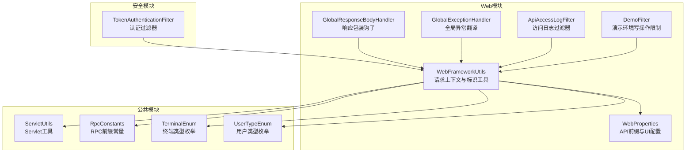
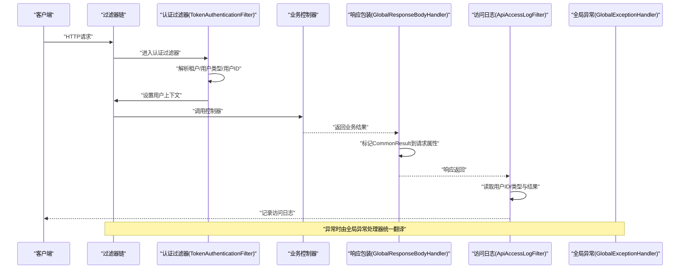
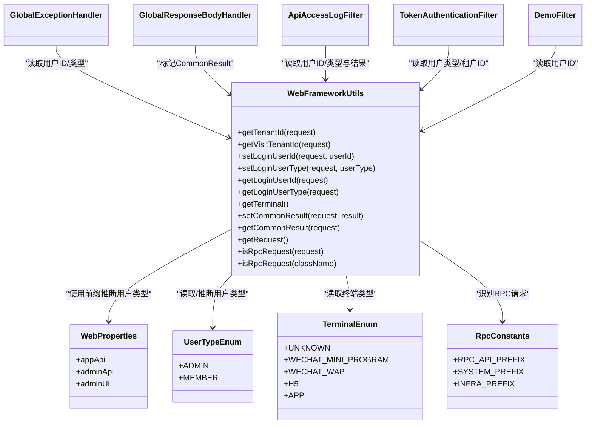

# Web工具类

<cite>
**本文引用的文件**
- [WebFrameworkUtils.java](file://pandora-framework/pandora-spring-boot-starter-web/src/main/java/net/ittimeline/pandora/framework/web/core/util/WebFrameworkUtils.java)
- [WebProperties.java](file://pandora-framework/pandora-spring-boot-starter-web/src/main/java/net/ittimeline/pandora/framework/web/config/WebProperties.java)
- [UserTypeEnum.java](file://pandora-framework/pandora-common/src/main/java/net/ittimeline/pandora/framework/common/enums/UserTypeEnum.java)
- [TerminalEnum.java](file://pandora-framework/pandora-common/src/main/java/net/ittimeline/pandora/framework/common/enums/TerminalEnum.java)
- [RpcConstants.java](file://pandora-framework/pandora-common/src/main/java/net/ittimeline/pandora/framework/common/constants/RpcConstants.java)
- [GlobalExceptionHandler.java](file://pandora-framework/pandora-spring-boot-starter-web/src/main/java/net/ittimeline/pandora/framework/web/core/handler/GlobalExceptionHandler.java)
- [GlobalResponseBodyHandler.java](file://pandora-framework/pandora-spring-boot-starter-web/src/main/java/net/ittimeline/pandora/framework/web/core/handler/GlobalResponseBodyHandler.java)
- [ApiAccessLogFilter.java](file://pandora-framework/pandora-spring-boot-starter-web/src/main/java/net/ittimeline/pandora/framework/apilog/core/filter/ApiAccessLogFilter.java)
- [DemoFilter.java](file://pandora-framework/pandora-spring-boot-starter-web/src/main/java/net/ittimeline/pandora/framework/web/core/filter/DemoFilter.java)
- [TokenAuthenticationFilter.java](file://pandora-framework/pandora-spring-boot-starter-security/src/main/java/net/ittimeline/pandora/framework/security/core/filter/TokenAuthenticationFilter.java)
- [PandoraWebAutoConfiguration.java](file://pandora-framework/pandora-spring-boot-starter-web/src/main/java/net/ittimeline/pandora/framework/web/config/PandoraWebAutoConfiguration.java)
- [ServletUtils.java](file://pandora-framework/pandora-common/src/main/java/net/ittimeline/pandora/framework/common/util/web/servlet/ServletUtils.java)
</cite>

## 目录
1. [简介](#简介)
2. [项目结构](#项目结构)
3. [核心组件](#核心组件)
4. [架构总览](#架构总览)
5. [详细组件分析](#详细组件分析)
6. [依赖关系分析](#依赖关系分析)
7. [性能考量](#性能考量)
8. [故障排查指南](#故障排查指南)
9. [结论](#结论)
10. [附录](#附录)

## 简介
本文件面向“Web工具类”（WebFrameworkUtils）的使用与集成，系统性阐述其在请求处理、响应处理、参数解析、租户与终端识别、用户上下文注入与判定、RPC请求识别等方面的职责与用法。文档同时说明与Spring Web生态的集成方式（过滤器、拦截器、全局异常处理、自动装配），并给出常见使用模式与最佳实践建议，帮助开发者在业务代码中正确、安全地使用这些工具方法。

## 项目结构
Web工具类位于Web模块的工具包中，配合Web配置、枚举、常量以及全局异常处理、响应包装、访问日志等组件协同工作，形成统一的Web处理链路。

图示来源
- [WebFrameworkUtils.java:1-182](file://pandora-framework/pandora-spring-boot-starter-web/src/main/java/net/ittimeline/pandora/framework/web/core/util/WebFrameworkUtils.java#L1-L182)
- [WebProperties.java:1-68](file://pandora-framework/pandora-spring-boot-starter-web/src/main/java/net/ittimeline/pandora/framework/web/config/WebProperties.java#L1-L68)
- [UserTypeEnum.java:1-48](file://pandora-framework/pandora-common/src/main/java/net/ittimeline/pandora/framework/common/enums/UserTypeEnum.java#L1-L48)
- [TerminalEnum.java:1-43](file://pandora-framework/pandora-common/src/main/java/net/ittimeline/pandora/framework/common/enums/TerminalEnum.java#L1-L43)
- [RpcConstants.java:1-42](file://pandora-framework/pandora-common/src/main/java/net/ittimeline/pandora/framework/common/constants/RpcConstants.java#L1-L42)
- [GlobalExceptionHandler.java:1-454](file://pandora-framework/pandora-spring-boot-starter-web/src/main/java/net/ittimeline/pandora/framework/web/core/handler/GlobalExceptionHandler.java#L1-L454)
- [GlobalResponseBodyHandler.java:1-47](file://pandora-framework/pandora-spring-boot-starter-web/src/main/java/net/ittimeline/pandora/framework/web/core/handler/GlobalResponseBodyHandler.java#L1-L47)
- [ApiAccessLogFilter.java:1-255](file://pandora-framework/pandora-spring-boot-starter-web/src/main/java/net/ittimeline/pandora/framework/apilog/core/filter/ApiAccessLogFilter.java#L1-L255)
- [DemoFilter.java:1-37](file://pandora-framework/pandora-spring-boot-starter-web/src/main/java/net/ittimeline/pandora/framework/web/core/filter/DemoFilter.java#L1-L37)
- [TokenAuthenticationFilter.java:1-157](file://pandora-framework/pandora-spring-boot-starter-security/src/main/java/net/ittimeline/pandora/framework/security/core/filter/TokenAuthenticationFilter.java#L1-L157)
- [ServletUtils.java:1-105](file://pandora-framework/pandora-common/src/main/java/net/ittimeline/pandora/framework/common/util/web/servlet/ServletUtils.java#L1-L105)

章节来源
- [WebFrameworkUtils.java:1-182](file://pandora-framework/pandora-spring-boot-starter-web/src/main/java/net/ittimeline/pandora/framework/web/core/util/WebFrameworkUtils.java#L1-L182)
- [WebProperties.java:1-68](file://pandora-framework/pandora-spring-boot-starter-web/src/main/java/net/ittimeline/pandora/framework/web/config/WebProperties.java#L1-L68)

## 核心组件
- WebFrameworkUtils：提供租户ID/访问租户ID解析、用户上下文注入与查询、终端类型解析、请求结果标记、请求对象获取、RPC请求判定等能力。
- WebProperties：定义API前缀（如/admin-api、/app-api）与UI地址，用于区分用户类型与路由策略。
- UserTypeEnum、TerminalEnum：用户类型与终端类型的枚举，支撑WebFrameworkUtils的类型推断与默认值。
- RpcConstants：RPC接口前缀常量，用于识别RPC请求。
- GlobalExceptionHandler、GlobalResponseBodyHandler：全局异常翻译与响应包装钩子，配合WebFrameworkUtils记录用户与结果。
- ApiAccessLogFilter、DemoFilter、TokenAuthenticationFilter：过滤器链中的关键节点，展示WebFrameworkUtils在不同场景下的使用。

章节来源
- [WebFrameworkUtils.java:1-182](file://pandora-framework/pandora-spring-boot-starter-web/src/main/java/net/ittimeline/pandora/framework/web/core/util/WebFrameworkUtils.java#L1-L182)
- [WebProperties.java:1-68](file://pandora-framework/pandora-spring-boot-starter-web/src/main/java/net/ittimeline/pandora/framework/web/config/WebProperties.java#L1-L68)
- [UserTypeEnum.java:1-48](file://pandora-framework/pandora-common/src/main/java/net/ittimeline/pandora/framework/common/enums/UserTypeEnum.java#L1-L48)
- [TerminalEnum.java:1-43](file://pandora-framework/pandora-common/src/main/java/net/ittimeline/pandora/framework/common/enums/TerminalEnum.java#L1-L43)
- [RpcConstants.java:1-42](file://pandora-framework/pandora-common/src/main/java/net/ittimeline/pandora/framework/common/constants/RpcConstants.java#L1-L42)
- [GlobalExceptionHandler.java:1-454](file://pandora-framework/pandora-spring-boot-starter-web/src/main/java/net/ittimeline/pandora/framework/web/core/handler/GlobalExceptionHandler.java#L1-L454)
- [GlobalResponseBodyHandler.java:1-47](file://pandora-framework/pandora-spring-boot-starter-web/src/main/java/net/ittimeline/pandora/framework/web/core/handler/GlobalResponseBodyHandler.java#L1-L47)
- [ApiAccessLogFilter.java:1-255](file://pandora-framework/pandora-spring-boot-starter-web/src/main/java/net/ittimeline/pandora/framework/apilog/core/filter/ApiAccessLogFilter.java#L1-L255)
- [DemoFilter.java:1-37](file://pandora-framework/pandora-spring-boot-starter-web/src/main/java/net/ittimeline/pandora/framework/web/core/filter/DemoFilter.java#L1-L37)
- [TokenAuthenticationFilter.java:1-157](file://pandora-framework/pandora-spring-boot-starter-security/src/main/java/net/ittimeline/pandora/framework/security/core/filter/TokenAuthenticationFilter.java#L1-L157)

## 架构总览
WebFrameworkUtils贯穿请求生命周期：在过滤器阶段注入用户上下文与租户信息，在拦截器阶段记录访问日志与结果标记，在全局异常阶段统一翻译并记录用户信息。其与Spring Web的集成通过自动装配Bean完成。

图示来源
- [TokenAuthenticationFilter.java:47-82](file://pandora-framework/pandora-spring-boot-starter-security/src/main/java/net/ittimeline/pandora/framework/security/core/filter/TokenAuthenticationFilter.java#L47-L82)
- [GlobalResponseBodyHandler.java:37-44](file://pandora-framework/pandora-spring-boot-starter-web/src/main/java/net/ittimeline/pandora/framework/web/core/handler/GlobalResponseBodyHandler.java#L37-L44)
- [ApiAccessLogFilter.java:66-86](file://pandora-framework/pandora-spring-boot-starter-web/src/main/java/net/ittimeline/pandora/framework/apilog/core/filter/ApiAccessLogFilter.java#L66-L86)
- [GlobalExceptionHandler.java:79-120](file://pandora-framework/pandora-spring-boot-starter-web/src/main/java/net/ittimeline/pandora/framework/web/core/handler/GlobalExceptionHandler.java#L79-L120)

## 详细组件分析

### WebFrameworkUtils：Web请求上下文与标识工具
- 职责边界
  - 租户ID/访问租户ID解析：从请求头读取并做数字校验，返回Long或空。
  - 用户上下文注入与查询：在请求属性中设置/读取登录用户ID与用户类型。
  - 用户类型推断：优先从请求属性读取；若为空，基于API前缀推断ADMIN或MEMBER；否则返回空。
  - 终端类型解析：从请求头读取终端枚举值，无法解析时回退至UNKNOWN。
  - 请求结果标记：在请求属性中标记Controller返回的CommonResult，供日志等后续环节使用。
  - 请求对象获取：从RequestContextHolder获取当前HttpServletRequest。
  - RPC请求识别：基于URI前缀或类名后缀判断是否为RPC请求。
- 关键方法与参数说明
  - getTenantId(request)：从请求头读取租户ID，数字校验后返回Long或null。
  - getVisitTenantId(request)：从请求头读取访问租户ID，数字校验后返回Long或null。
  - setLoginUserId(request, userId)：将用户ID写入请求属性。
  - setLoginUserType(request, userType)：将用户类型写入请求属性。
  - getLoginUserId(request)/getLoginUserId()：读取请求属性中的用户ID；后者内部获取当前请求。
  - getLoginUserType(request)/getLoginUserType()：读取请求属性中的用户类型；若为空则按API前缀推断ADMIN或MEMBER。
  - getTerminal()：从请求头读取终端类型，无法解析时回退UNKNOWN。
  - setCommonResult(request, result)/getCommonResult(request)：在请求属性中设置/读取CommonResult。
  - getRequest()：从上下文获取HttpServletRequest。
  - isRpcRequest(request)/isRpcRequest(className)：基于URI前缀或类名后缀判断RPC请求。
- 使用场景与最佳实践
  - 在认证过滤器中注入用户上下文（用户ID、用户类型、租户ID），并在模拟登录时读取租户ID。
  - 在访问日志过滤器中读取用户ID/类型与最终结果，确保日志完整性。
  - 在全局异常处理器中读取用户ID/类型，便于定位异常归属。
  - 在业务代码中通过工具类获取当前请求、用户上下文与终端类型，避免直接操作RequestContextHolder。
  - 严格校验请求头中的租户ID与终端类型，防止非法或越权访问。

章节来源
- [WebFrameworkUtils.java:44-181](file://pandora-framework/pandora-spring-boot-starter-web/src/main/java/net/ittimeline/pandora/framework/web/core/util/WebFrameworkUtils.java#L44-L181)
- [TokenAuthenticationFilter.java:59-67](file://pandora-framework/pandora-spring-boot-starter-security/src/main/java/net/ittimeline/pandora/framework/security/core/filter/TokenAuthenticationFilter.java#L59-L67)
- [TokenAuthenticationFilter.java:129-130](file://pandora-framework/pandora-spring-boot-starter-security/src/main/java/net/ittimeline/pandora/framework/security/core/filter/TokenAuthenticationFilter.java#L129-L130)
- [ApiAccessLogFilter.java:114-126](file://pandora-framework/pandora-spring-boot-starter-web/src/main/java/net/ittimeline/pandora/framework/apilog/core/filter/ApiAccessLogFilter.java#L114-L126)
- [GlobalExceptionHandler.java:277-281](file://pandora-framework/pandora-spring-boot-starter-web/src/main/java/net/ittimeline/pandora/framework/web/core/handler/GlobalExceptionHandler.java#L277-L281)
- [GlobalExceptionHandler.java:357-359](file://pandora-framework/pandora-spring-boot-starter-web/src/main/java/net/ittimeline/pandora/framework/web/core/handler/GlobalExceptionHandler.java#L357-L359)
- [GlobalResponseBodyHandler.java:41-43](file://pandora-framework/pandora-spring-boot-starter-web/src/main/java/net/ittimeline/pandora/framework/web/core/handler/GlobalResponseBodyHandler.java#L41-L43)

### WebProperties：API前缀与UI配置
- 作用：定义/admin-api与/app-api的前缀与扫描包规则，用于区分管理端与移动端接口，辅助用户类型推断。
- 关键点：前缀用于Nginx路由隔离与安全控制；包规则用于自动扫描对应Controller。

章节来源
- [WebProperties.java:22-25](file://pandora-framework/pandora-spring-boot-starter-web/src/main/java/net/ittimeline/pandora/framework/web/config/WebProperties.java#L22-L25)
- [WebProperties.java:34-54](file://pandora-framework/pandora-spring-boot-starter-web/src/main/java/net/ittimeline/pandora/framework/web/config/WebProperties.java#L34-L54)

### UserTypeEnum、TerminalEnum：用户类型与终端类型
- UserTypeEnum：ADMIN（管理后台）、MEMBER（C端会员），用于根据API前缀推断用户类型。
- TerminalEnum：包含UNKNOWN、WECHAT_MINI_PROGRAM、WECHAT_WAP、H5、APP等，用于识别请求来源终端。

章节来源
- [UserTypeEnum.java:18-26](file://pandora-framework/pandora-common/src/main/java/net/ittimeline/pandora/framework/common/enums/UserTypeEnum.java#L18-L26)
- [TerminalEnum.java:18-25](file://pandora-framework/pandora-common/src/main/java/net/ittimeline/pandora/framework/common/enums/TerminalEnum.java#L18-L25)

### RpcConstants：RPC前缀常量
- RPC_API_PREFIX：/rpc-api，用于识别RPC接口。
- SYSTEM_PREFIX、INFRA_PREFIX：系统与基础设施服务的RPC前缀。

章节来源
- [RpcConstants.java:12-41](file://pandora-framework/pandora-common/src/main/java/net/ittimeline/pandora/framework/common/constants/RpcConstants.java#L12-L41)

### 全局异常处理与响应包装
- GlobalExceptionHandler：统一捕获各类异常，翻译为CommonResult，记录异常日志并携带用户ID/类型。
- GlobalResponseBodyHandler：拦截返回类型为CommonResult的方法，将结果写入请求属性，供日志等后续环节使用。

章节来源
- [GlobalExceptionHandler.java:79-120](file://pandora-framework/pandora-spring-boot-starter-web/src/main/java/net/ittimeline/pandora/framework/web/core/handler/GlobalExceptionHandler.java#L79-L120)
- [GlobalExceptionHandler.java:356-384](file://pandora-framework/pandora-spring-boot-starter-web/src/main/java/net/ittimeline/pandora/framework/web/core/handler/GlobalExceptionHandler.java#L356-L384)
- [GlobalResponseBodyHandler.java:27-44](file://pandora-framework/pandora-spring-boot-starter-web/src/main/java/net/ittimeline/pandora/framework/web/core/handler/GlobalResponseBodyHandler.java#L27-L44)

### 认证过滤器中的使用
- TokenAuthenticationFilter：在认证阶段读取用户类型与租户ID，构建LoginUser并注入上下文；当用户类型与API前缀不匹配时拒绝访问。

章节来源
- [TokenAuthenticationFilter.java:59-67](file://pandora-framework/pandora-spring-boot-starter-security/src/main/java/net/ittimeline/pandora/framework/security/core/filter/TokenAuthenticationFilter.java#L59-L67)
- [TokenAuthenticationFilter.java:129-130](file://pandora-framework/pandora-spring-boot-starter-security/src/main/java/net/ittimeline/pandora/framework/security/core/filter/TokenAuthenticationFilter.java#L129-L130)
- [TokenAuthenticationFilter.java:143-149](file://pandora-framework/pandora-spring-boot-starter-security/src/main/java/net/ittimeline/pandora/framework/security/core/filter/TokenAuthenticationFilter.java#L143-L149)

### 访问日志过滤器中的使用
- ApiAccessLogFilter：在请求完成后读取用户ID/类型与CommonResult，记录访问日志，支持请求/响应参数脱敏。

章节来源
- [ApiAccessLogFilter.java:114-126](file://pandora-framework/pandora-spring-boot-starter-web/src/main/java/net/ittimeline/pandora/framework/apilog/core/filter/ApiAccessLogFilter.java#L114-L126)
- [ApiAccessLogFilter.java:117-126](file://pandora-framework/pandora-spring-boot-starter-web/src/main/java/net/ittimeline/pandora/framework/apilog/core/filter/ApiAccessLogFilter.java#L117-L126)

### 演示环境写操作限制
- DemoFilter：对POST/PUT/DELETE写操作进行拦截，若非登录用户则直接返回错误，避免演示环境数据被破坏。

章节来源
- [DemoFilter.java:24-28](file://pandora-framework/pandora-spring-boot-starter-web/src/main/java/net/ittimeline/pandora/framework/web/core/filter/DemoFilter.java#L24-L28)
- [DemoFilter.java:31-34](file://pandora-framework/pandora-spring-boot-starter-web/src/main/java/net/ittimeline/pandora/framework/web/core/filter/DemoFilter.java#L31-L34)

### Spring Web集成与自动装配
- WebFrameworkUtils通过自动装配注册为Bean，注入WebProperties，从而具备API前缀推断能力。
- 全局异常处理器与响应包装器作为Spring组件参与请求生命周期。

章节来源
- [PandoraWebAutoConfiguration.java:104-109](file://pandora-framework/pandora-spring-boot-starter-web/src/main/java/net/ittimeline/pandora/framework/web/config/PandoraWebAutoConfiguration.java#L104-L109)
- [GlobalExceptionHandler.java:57-60](file://pandora-framework/pandora-spring-boot-starter-web/src/main/java/net/ittimeline/pandora/framework/web/core/handler/GlobalExceptionHandler.java#L57-L60)
- [GlobalResponseBodyHandler.java:25-35](file://pandora-framework/pandora-spring-boot-starter-web/src/main/java/net/ittimeline/pandora/framework/web/core/handler/GlobalResponseBodyHandler.java#L25-L35)

## 依赖关系分析
WebFrameworkUtils与各组件的耦合关系如下：

图示来源
- [WebFrameworkUtils.java:38-42](file://pandora-framework/pandora-spring-boot-starter-web/src/main/java/net/ittimeline/pandora/framework/web/core/util/WebFrameworkUtils.java#L38-L42)
- [WebProperties.java:21-28](file://pandora-framework/pandora-spring-boot-starter-web/src/main/java/net/ittimeline/pandora/framework/web/config/WebProperties.java#L21-L28)
- [UserTypeEnum.java:18-26](file://pandora-framework/pandora-common/src/main/java/net/ittimeline/pandora/framework/common/enums/UserTypeEnum.java#L18-L26)
- [TerminalEnum.java:18-25](file://pandora-framework/pandora-common/src/main/java/net/ittimeline/pandora/framework/common/enums/TerminalEnum.java#L18-L25)
- [RpcConstants.java:12-41](file://pandora-framework/pandora-common/src/main/java/net/ittimeline/pandora/framework/common/constants/RpcConstants.java#L12-L41)
- [GlobalExceptionHandler.java:277-281](file://pandora-framework/pandora-spring-boot-starter-web/src/main/java/net/ittimeline/pandora/framework/web/core/handler/GlobalExceptionHandler.java#L277-L281)
- [GlobalExceptionHandler.java:357-359](file://pandora-framework/pandora-spring-boot-starter-web/src/main/java/net/ittimeline/pandora/framework/web/core/handler/GlobalExceptionHandler.java#L357-L359)
- [GlobalResponseBodyHandler.java:41-43](file://pandora-framework/pandora-spring-boot-starter-web/src/main/java/net/ittimeline/pandora/framework/web/core/handler/GlobalResponseBodyHandler.java#L41-L43)
- [ApiAccessLogFilter.java:114-126](file://pandora-framework/pandora-spring-boot-starter-web/src/main/java/net/ittimeline/pandora/framework/apilog/core/filter/ApiAccessLogFilter.java#L114-L126)
- [TokenAuthenticationFilter.java:59-67](file://pandora-framework/pandora-spring-boot-starter-security/src/main/java/net/ittimeline/pandora/framework/security/core/filter/TokenAuthenticationFilter.java#L59-L67)
- [TokenAuthenticationFilter.java:129-130](file://pandora-framework/pandora-spring-boot-starter-security/src/main/java/net/ittimeline/pandora/framework/security/core/filter/TokenAuthenticationFilter.java#L129-L130)
- [DemoFilter.java:24-28](file://pandora-framework/pandora-spring-boot-starter-web/src/main/java/net/ittimeline/pandora/framework/web/core/filter/DemoFilter.java#L24-L28)

## 性能考量
- 请求属性读写：WebFrameworkUtils通过请求属性存储用户上下文与结果，避免额外IO，性能开销极低。
- 数字校验：租户ID与终端类型解析采用数字校验，避免字符串转换异常与无效值传播。
- 日志与异常：全局异常处理器与访问日志在异常路径中进行异步落库，避免阻塞主请求线程。
- 建议：在高频接口中尽量减少重复解析与多次读取，复用已注入的用户上下文。

## 故障排查指南
- 无法获取用户ID/类型
  - 检查过滤器链是否在认证阶段正确注入用户上下文。
  - 确认请求是否命中/admin-api或/app-api前缀，以便进行用户类型推断。
- 租户ID解析失败
  - 核对请求头tenant-id/visit-tenant-id是否为纯数字字符串。
- 终端类型显示为UNKNOWN
  - 检查请求头terminal是否为合法枚举值。
- 访问日志缺少用户信息
  - 确认响应包装器是否拦截到CommonResult并写入请求属性。
- RPC请求识别异常
  - 检查URI是否以/rpc-api开头，或类名是否以Api结尾。

章节来源
- [WebFrameworkUtils.java:103-125](file://pandora-framework/pandora-spring-boot-starter-web/src/main/java/net/ittimeline/pandora/framework/web/core/util/WebFrameworkUtils.java#L103-L125)
- [WebFrameworkUtils.java:51-66](file://pandora-framework/pandora-spring-boot-starter-web/src/main/java/net/ittimeline/pandora/framework/web/core/util/WebFrameworkUtils.java#L51-L66)
- [WebFrameworkUtils.java:132-139](file://pandora-framework/pandora-spring-boot-starter-web/src/main/java/net/ittimeline/pandora/framework/web/core/util/WebFrameworkUtils.java#L132-L139)
- [GlobalResponseBodyHandler.java:41-43](file://pandora-framework/pandora-spring-boot-starter-web/src/main/java/net/ittimeline/pandora/framework/web/core/handler/GlobalResponseBodyHandler.java#L41-L43)
- [ApiAccessLogFilter.java:114-126](file://pandora-framework/pandora-spring-boot-starter-web/src/main/java/net/ittimeline/pandora/framework/apilog/core/filter/ApiAccessLogFilter.java#L114-L126)

## 结论
WebFrameworkUtils作为Web层的基础设施工具，提供了租户、用户、终端、RPC识别与请求结果标记等核心能力，并通过与过滤器、拦截器、异常处理器的深度集成，实现了统一、可观测、可扩展的Web处理链路。遵循本文的最佳实践与使用模式，可在保证安全与性能的前提下，高效地在业务代码中使用这些工具方法。

## 附录
- 常见使用模式
  - 认证阶段：在TokenAuthenticationFilter中读取用户类型与租户ID，注入上下文。
  - 日志阶段：在ApiAccessLogFilter中读取用户ID/类型与结果，记录访问日志。
  - 异常阶段：在GlobalExceptionHandler中读取用户ID/类型，统一翻译异常并记录日志。
  - 业务阶段：在控制器或服务层通过WebFrameworkUtils获取当前请求、用户上下文与终端类型。
- 最佳实践
  - 明确区分/admin-api与/app-api前缀，确保用户类型推断准确。
  - 严格校验请求头中的租户ID与终端类型，避免越权与异常行为。
  - 在演示环境启用DemoFilter，禁止写操作，保护测试数据。
  - 使用响应包装器统一标记CommonResult，确保日志与监控的一致性。