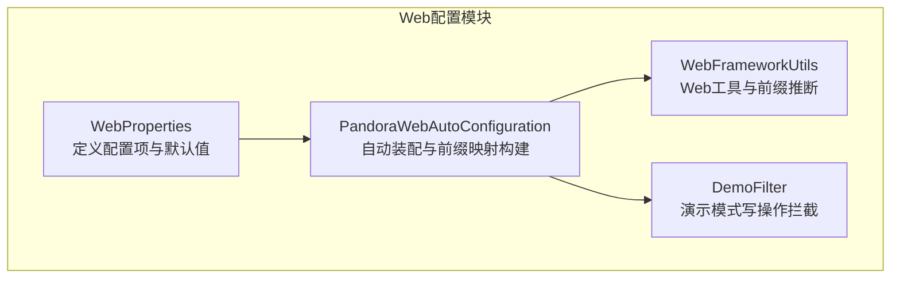
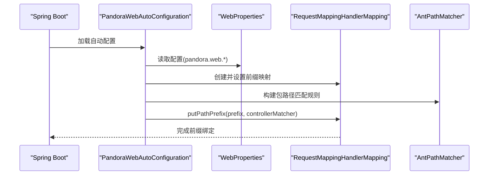
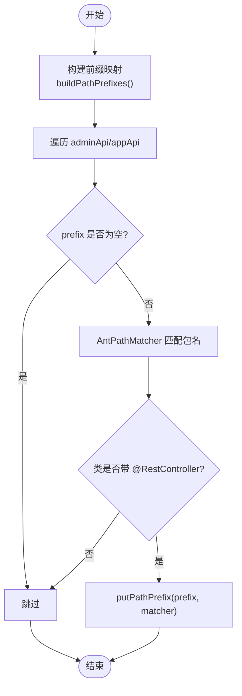
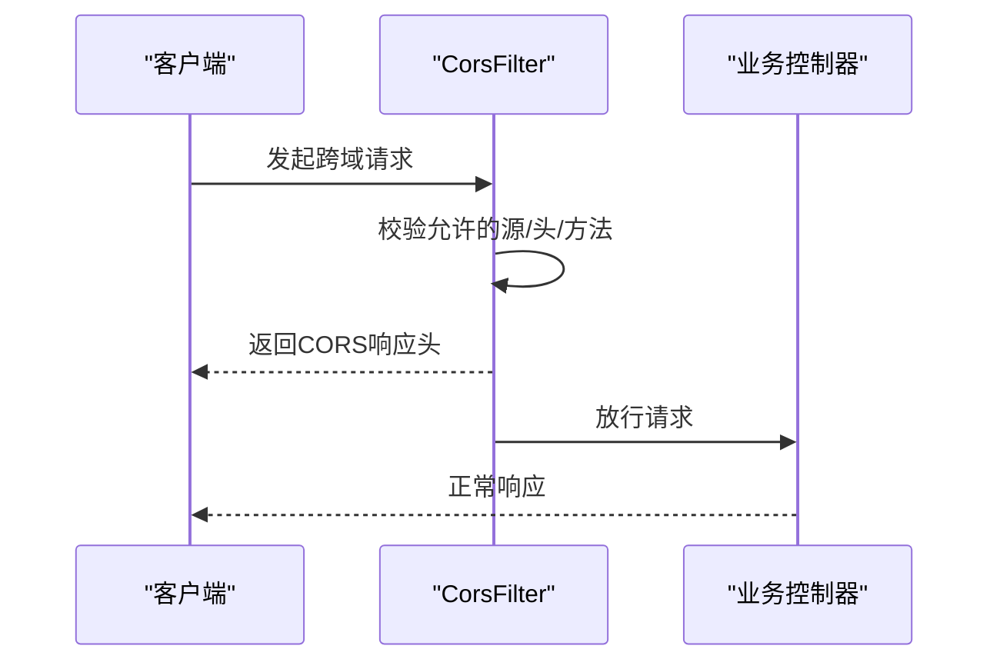
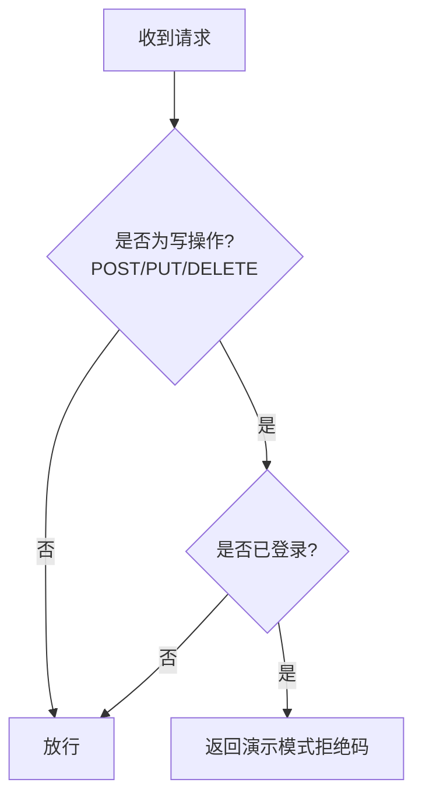
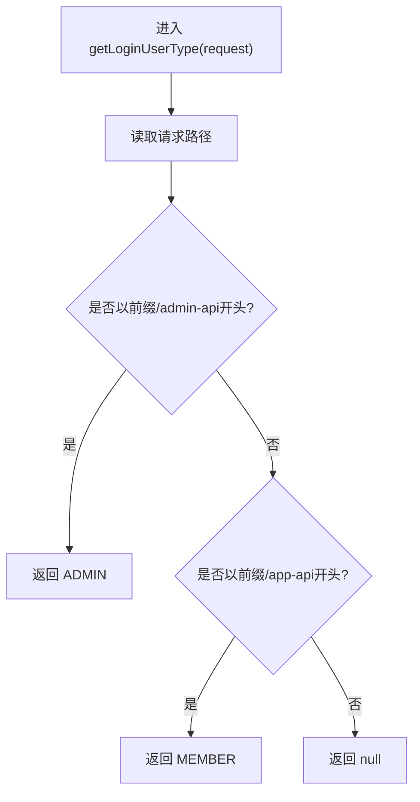
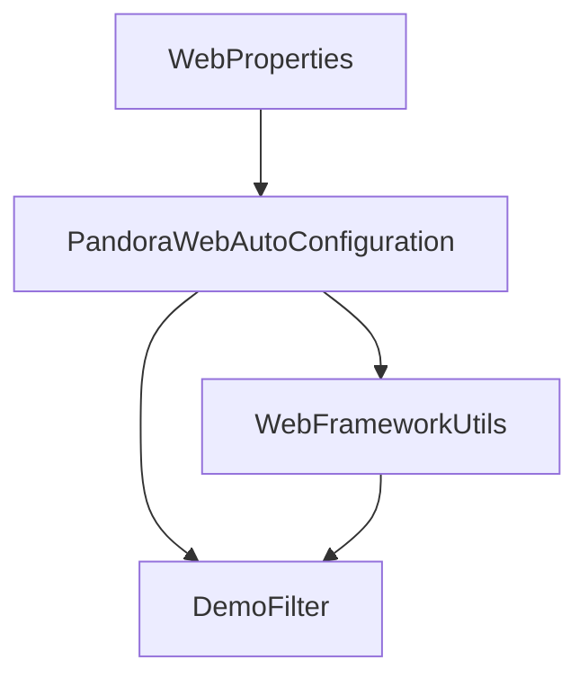

# Web配置属性

<cite>
**本文引用的文件**
- [WebProperties.java](file://pandora-framework/pandora-spring-boot-starter-web/src/main/java/net/ittimeline/pandora/framework/web/config/WebProperties.java)
- [PandoraWebAutoConfiguration.java](file://pandora-framework/pandora-spring-boot-starter-web/src/main/java/net/ittimeline/pandora/framework/web/config/PandoraWebAutoConfiguration.java)
- [DemoFilter.java](file://pandora-framework/pandora-spring-boot-starter-web/src/main/java/net/ittimeline/pandora/framework/web/core/filter/DemoFilter.java)
- [WebFrameworkUtils.java](file://pandora-framework/pandora-spring-boot-starter-web/src/main/java/net/ittimeline/pandora/framework/web/core/util/WebFrameworkUtils.java)
- [WebFilterOrderConstants.java](file://pandora-framework/pandora-common/src/main/java/net/ittimeline/pandora/framework/common/constants/WebFilterOrderConstants.java)
</cite>

## 目录
1. [简介](#简介)
2. [项目结构](#项目结构)
3. [核心组件](#核心组件)
4. [架构总览](#架构总览)
5. [详细组件分析](#详细组件分析)
6. [依赖分析](#依赖分析)
7. [性能考虑](#性能考虑)
8. [故障排查指南](#故障排查指南)
9. [结论](#结论)
10. [附录](#附录)

## 简介
本文件围绕Web配置属性展开，重点解析WebProperties类及其相关自动配置与运行时行为，涵盖以下主题：
- API前缀配置（adminApi与appApi）的语义、默认值与使用场景
- 基于Ant风格包路径的动态前缀绑定机制与路径匹配规则
- CORS跨域配置策略
- 演示模式（demo）开关与DemoFilter行为
- 在application.yml中的完整配置示例与最佳实践

## 项目结构
Web配置相关代码位于pandora-spring-boot-starter-web模块中，核心文件如下：
- WebProperties：定义配置项与默认值
- PandoraWebAutoConfiguration：自动装配Web组件、构建RequestMappingHandlerMapping前缀映射、注册CORS、缓存请求体、演示模式过滤器等
- WebFrameworkUtils：封装Web上下文工具，包含基于前缀推断用户类型的逻辑
- DemoFilter：演示模式下拦截写操作并拒绝



**图表来源**
- [WebProperties.java:18-68](file://pandora-framework/pandora-spring-boot-starter-web/src/main/java/net/ittimeline/pandora/framework/web/config/WebProperties.java#L18-L68)
- [PandoraWebAutoConfiguration.java:43-177](file://pandora-framework/pandora-spring-boot-starter-web/src/main/java/net/ittimeline/pandora/framework/web/config/PandoraWebAutoConfiguration.java#L43-L177)
- [WebFrameworkUtils.java:22-182](file://pandora-framework/pandora-spring-boot-starter-web/src/main/java/net/ittimeline/pandora/framework/web/core/util/WebFrameworkUtils.java#L22-L182)
- [DemoFilter.java:21-37](file://pandora-framework/pandora-spring-boot-starter-web/src/main/java/net/ittimeline/pandora/framework/web/core/filter/DemoFilter.java#L21-L37)

**章节来源**
- [WebProperties.java:18-68](file://pandora-framework/pandora-spring-boot-starter-web/src/main/java/net/ittimeline/pandora/framework/web/config/WebProperties.java#L18-L68)
- [PandoraWebAutoConfiguration.java:43-177](file://pandora-framework/pandora-spring-boot-starter-web/src/main/java/net/ittimeline/pandora/framework/web/config/PandoraWebAutoConfiguration.java#L43-L177)

## 核心组件
本节聚焦WebProperties类的配置项与默认值，并结合自动配置与运行时工具类的行为进行说明。

- 配置前缀：pandora.web
- 关键配置项：
  - pandora.web.admin-api：管理员API前缀与控制器包匹配规则
  - pandora.web.app-api：应用API前缀与控制器包匹配规则
  - pandora.web.admin-ui.url：管理后台UI访问地址（用于前端路由或跳转）
  - pandora.demo：演示模式开关（开启后启用DemoFilter）

默认值与含义：
- admin-api.prefix 默认“/admin-api”，用于标识管理端REST接口的统一前缀
- admin-api.controller 默认“**.controller.admin.**”，采用Ant风格包路径匹配，限定哪些控制器类受该前缀约束
- app-api.prefix 默认“/app-api”，用于标识应用端REST接口的统一前缀
- app-api.controller 默认“**.controller.app.**”，采用Ant风格包路径匹配，限定哪些控制器类受该前缀约束
- admin-ui.url 未设置默认值，需按需配置
- pandora.demo 默认false，需显式开启演示模式

使用场景：
- 将管理端与应用端接口分组，便于网关或反向代理按前缀路由
- 通过Ant包路径精确控制哪些控制器类参与前缀绑定
- 通过admin-ui.url为前端提供管理端UI访问地址
- 演示模式下拦截写操作，保护测试环境数据

**章节来源**
- [WebProperties.java:22-28](file://pandora-framework/pandora-spring-boot-starter-web/src/main/java/net/ittimeline/pandora/framework/web/config/WebProperties.java#L22-L28)
- [WebProperties.java:34-55](file://pandora-framework/pandora-spring-boot-starter-web/src/main/java/net/ittimeline/pandora/framework/web/config/WebProperties.java#L34-L55)
- [WebProperties.java:59-66](file://pandora-framework/pandora-spring-boot-starter-web/src/main/java/net/ittimeline/pandora/framework/web/config/WebProperties.java#L59-L66)

## 架构总览
Web配置的运行时流程如下：
- 启动时，PandoraWebAutoConfiguration加载WebProperties并构建RequestMappingHandlerMapping的前缀映射
- 使用AntPathMatcher对控制器类所在包进行匹配，仅对满足条件的@RestController类应用对应前缀
- 注册CORS过滤器，统一处理跨域请求
- 条件注册DemoFilter，当pandora.demo=true时启用
- WebFrameworkUtils基于请求路径前缀推断用户类型，辅助权限判断



**图表来源**
- [PandoraWebAutoConfiguration.java:56-91](file://pandora-framework/pandora-spring-boot-starter-web/src/main/java/net/ittimeline/pandora/framework/web/config/PandoraWebAutoConfiguration.java#L56-L91)
- [WebProperties.java:18-68](file://pandora-framework/pandora-spring-boot-starter-web/src/main/java/net/ittimeline/pandora/framework/web/config/WebProperties.java#L18-L68)

## 详细组件分析

### WebProperties：配置项与默认值
- adminApi与appApi均包含两个字段：
  - prefix：API前缀字符串，不能为空
  - controller：Ant风格包路径，用于限定匹配的控制器类所在包
- adminUi包含url字段，用于管理端UI访问地址
- 默认值：
  - adminApi.prefix="/admin-api"
  - adminApi.controller="**.controller.admin.**"
  - appApi.prefix="/app-api"
  - appApi.controller="**.controller.app.**"
  - adminUi.url未设置默认值

作用与使用场景：
- 通过prefix统一对外暴露的REST接口前缀，便于网关/反向代理路由与安全隔离
- 通过controller精确限定哪些控制器类受该前缀约束，避免误匹配
- admin-ui.url为前端提供管理端UI访问地址，便于集成

**章节来源**
- [WebProperties.java:22-28](file://pandora-framework/pandora-spring-boot-starter-web/src/main/java/net/ittimeline/pandora/framework/web/config/WebProperties.java#L22-L28)
- [WebProperties.java:34-55](file://pandora-framework/pandora-spring-boot-starter-web/src/main/java/net/ittimeline/pandora/framework/web/config/WebProperties.java#L34-L55)
- [WebProperties.java:59-66](file://pandora-framework/pandora-spring-boot-starter-web/src/main/java/net/ittimeline/pandora/framework/web/config/WebProperties.java#L59-L66)

### 自动配置：前缀映射与路径匹配
- RequestMappingHandlerMapping在创建时即设置pathPrefixes映射
- buildPathPrefixes遍历adminApi与appApi，调用putPathPrefix生成映射
- putPathPrefix使用AntPathMatcher匹配控制器类所在包名，仅对标注@RestController且包名匹配的类应用对应prefix
- 匹配规则：
  - 使用AntPathMatcher(".")进行包名匹配
  - 仅当api.prefix非空时才加入映射
  - 匹配条件为类带@RestController注解且包名满足controller表达式



**图表来源**
- [PandoraWebAutoConfiguration.java:70-88](file://pandora-framework/pandora-spring-boot-starter-web/src/main/java/net/ittimeline/pandora/framework/web/config/PandoraWebAutoConfiguration.java#L70-L88)

**章节来源**
- [PandoraWebAutoConfiguration.java:56-91](file://pandora-framework/pandora-spring-boot-starter-web/src/main/java/net/ittimeline/pandora/framework/web/config/PandoraWebAutoConfiguration.java#L56-L91)

### CORS跨域配置
- 自动注册CorsFilter，允许凭据、任意源、任意头、任意方法
- 对路径“/**”统一生效
- 执行顺序通过WebFilterOrderConstants.CORS_FILTER保证



**图表来源**
- [PandoraWebAutoConfiguration.java:116-129](file://pandora-framework/pandora-spring-boot-starter-web/src/main/java/net/ittimeline/pandora/framework/web/config/PandoraWebAutoConfiguration.java#L116-L129)

**章节来源**
- [PandoraWebAutoConfiguration.java:116-129](file://pandora-framework/pandora-spring-boot-starter-web/src/main/java/net/ittimeline/pandora/framework/web/config/PandoraWebAutoConfiguration.java#L116-L129)

### 演示模式与DemoFilter
- 开关：pandora.demo=true时启用DemoFilter
- 行为：对POST/PUT/DELETE写操作且已登录的请求直接返回错误响应，阻止写入
- 触发条件：shouldNotFilter内部判断请求方法与登录状态，满足条件则短路返回



**图表来源**
- [DemoFilter.java:23-34](file://pandora-framework/pandora-spring-boot-starter-web/src/main/java/net/ittimeline/pandora/framework/web/core/filter/DemoFilter.java#L23-L34)

**章节来源**
- [DemoFilter.java:21-37](file://pandora-framework/pandora-spring-boot-starter-web/src/main/java/net/ittimeline/pandora/framework/web/core/filter/DemoFilter.java#L21-L37)
- [PandoraWebAutoConfiguration.java:142-146](file://pandora-framework/pandora-spring-boot-starter-web/src/main/java/net/ittimeline/pandora/framework/web/config/PandoraWebAutoConfiguration.java#L142-L146)

### 前缀驱动的用户类型推断
- WebFrameworkUtils根据请求路径前缀推断用户类型：
  - 以adminApi.prefix开头：ADMIN
  - 以appApi.prefix开头：MEMBER
  - 否则返回null
- 该逻辑用于权限判定与日志记录等场景



**图表来源**
- [WebFrameworkUtils.java:112-120](file://pandora-framework/pandora-spring-boot-starter-web/src/main/java/net/ittimeline/pandora/framework/web/core/util/WebFrameworkUtils.java#L112-L120)

**章节来源**
- [WebFrameworkUtils.java:112-120](file://pandora-framework/pandora-spring-boot-starter-web/src/main/java/net/ittimeline/pandora/framework/web/core/util/WebFrameworkUtils.java#L112-L120)

## 依赖分析
- WebProperties作为配置对象，被PandoraWebAutoConfiguration注入并用于构建RequestMappingHandlerMapping的前缀映射
- WebFrameworkUtils持有WebProperties实例，用于运行时根据前缀推断用户类型
- DemoFilter依赖WebFrameworkUtils判断登录状态，从而决定是否拦截写操作
- CORS过滤器独立于前缀映射，但同样由自动配置注册



**图表来源**
- [PandoraWebAutoConfiguration.java:46-109](file://pandora-framework/pandora-spring-boot-starter-web/src/main/java/net/ittimeline/pandora/framework/web/config/PandoraWebAutoConfiguration.java#L46-L109)
- [WebFrameworkUtils.java:40-42](file://pandora-framework/pandora-spring-boot-starter-web/src/main/java/net/ittimeline/pandora/framework/web/core/util/WebFrameworkUtils.java#L40-L42)

**章节来源**
- [PandoraWebAutoConfiguration.java:46-109](file://pandora-framework/pandora-spring-boot-starter-web/src/main/java/net/ittimeline/pandora/framework/web/config/PandoraWebAutoConfiguration.java#L46-L109)
- [WebFrameworkUtils.java:40-42](file://pandora-framework/pandora-spring-boot-starter-web/src/main/java/net/ittimeline/pandora/framework/web/core/util/WebFrameworkUtils.java#L40-L42)

## 性能考虑
- 前缀映射构建发生在RequestMappingHandlerMapping初始化阶段，开销极低
- AntPathMatcher匹配仅在类级别进行，对运行时请求无额外开销
- CORS过滤器对所有请求生效，建议在生产环境细化allowOriginPattern以减少跨域风险
- 演示模式仅在pandora.demo=true时注册，对正常环境无影响

## 故障排查指南
- 前缀不生效
  - 检查adminApi与appApi的prefix是否为空
  - 确认控制器类所在包是否满足controller的Ant表达式
  - 确认类是否标注@RestController
- 跨域无效
  - 检查CORS过滤器是否注册（执行顺序是否正确）
  - 生产环境建议缩小allowOriginPattern范围
- 演示模式误拦截
  - 确认pandora.demo是否为true
  - 确认请求方法是否为POST/PUT/DELETE且已登录
- 用户类型推断异常
  - 确认请求路径前缀与adminApi/appApi的prefix一致
  - 确认WebFrameworkUtils的getLoginUserType调用上下文有效

**章节来源**
- [PandoraWebAutoConfiguration.java:70-88](file://pandora-framework/pandora-spring-boot-starter-web/src/main/java/net/ittimeline/pandora/framework/web/config/PandoraWebAutoConfiguration.java#L70-L88)
- [DemoFilter.java:23-34](file://pandora-framework/pandora-spring-boot-starter-web/src/main/java/net/ittimeline/pandora/framework/web/core/filter/DemoFilter.java#L23-L34)
- [WebFrameworkUtils.java:112-120](file://pandora-framework/pandora-spring-boot-starter-web/src/main/java/net/ittimeline/pandora/framework/web/core/util/WebFrameworkUtils.java#L112-L120)

## 结论
WebProperties提供了灵活而清晰的API前缀配置能力，结合Ant风格包路径匹配，能够精准地为不同业务域的控制器类设置统一前缀。配合CORS与演示模式过滤器，系统在开发与演示环境中具备良好的安全性与可维护性。通过合理的application.yml配置，可快速实现多前缀、多包域的Web接口组织方式。

## 附录

### 配置示例（application.yml）
以下为在application.yml中配置Web相关参数的示例片段，请根据实际业务调整前缀与包路径：

```yaml
pandora:
  web:
    # 管理端API配置
    admin-api:
      prefix: "/admin-api"
      controller: "**.controller.admin.**"
    # 应用端API配置
    app-api:
      prefix: "/app-api"
      controller: "**.controller.app.**"
    # 管理端UI地址
    admin-ui:
      url: "https://ui.example.com/admin"
  # 演示模式开关
demo: true
```

说明：
- admin-api与app-api分别定义了前缀与控制器包匹配规则
- admin-ui.url用于前端管理端UI访问地址
- demo为true时启用DemoFilter，拦截写操作

**章节来源**
- [WebProperties.java:22-28](file://pandora-framework/pandora-spring-boot-starter-web/src/main/java/net/ittimeline/pandora/framework/web/config/WebProperties.java#L22-L28)
- [WebProperties.java:34-55](file://pandora-framework/pandora-spring-boot-starter-web/src/main/java/net/ittimeline/pandora/framework/web/config/WebProperties.java#L34-L55)
- [WebProperties.java:59-66](file://pandora-framework/pandora-spring-boot-starter-web/src/main/java/net/ittimeline/pandora/framework/web/config/WebProperties.java#L59-L66)
- [PandoraWebAutoConfiguration.java:142-146](file://pandora-framework/pandora-spring-boot-starter-web/src/main/java/net/ittimeline/pandora/framework/web/config/PandoraWebAutoConfiguration.java#L142-L146)