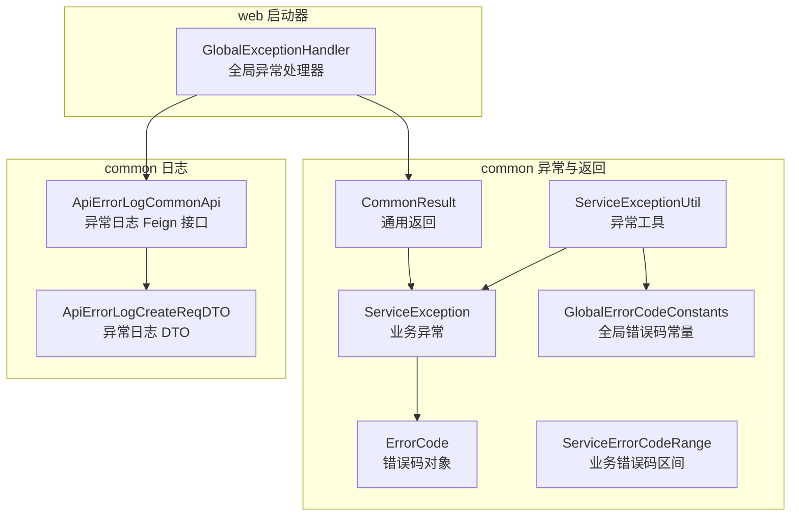
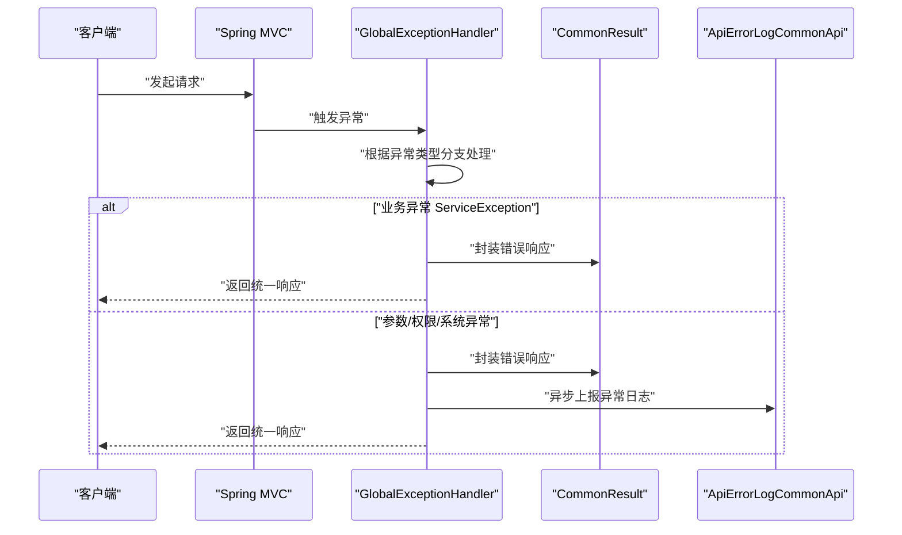
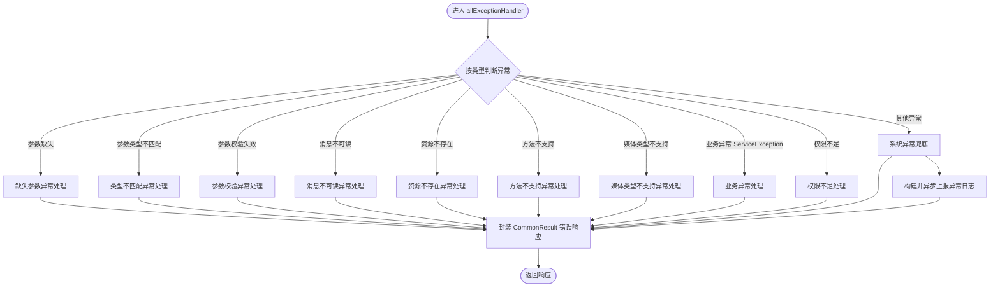
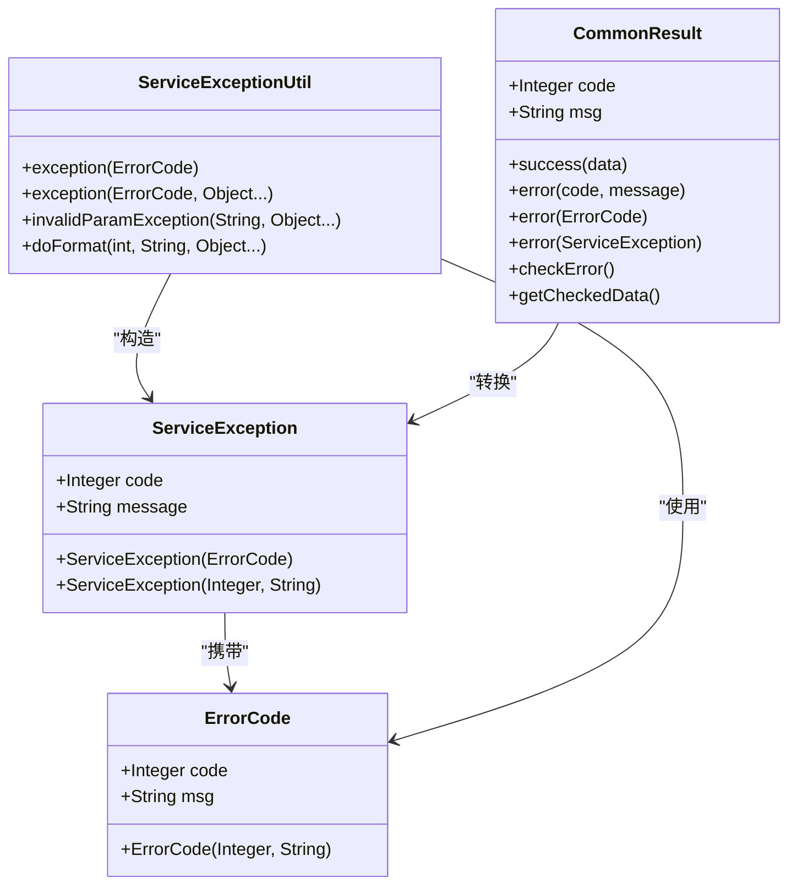
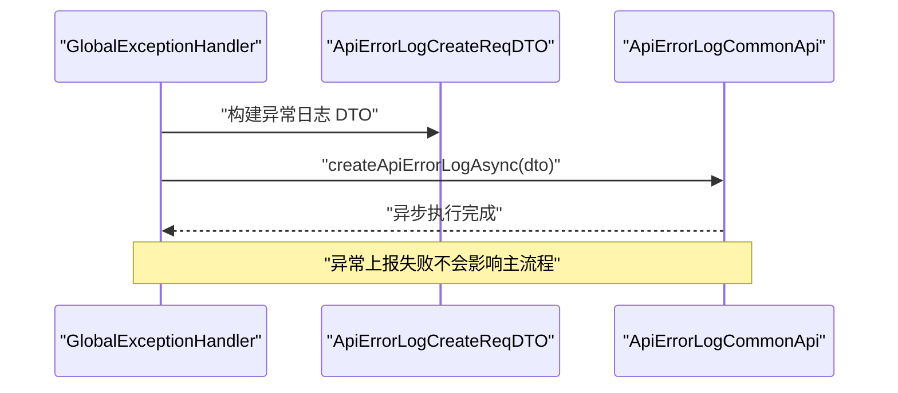
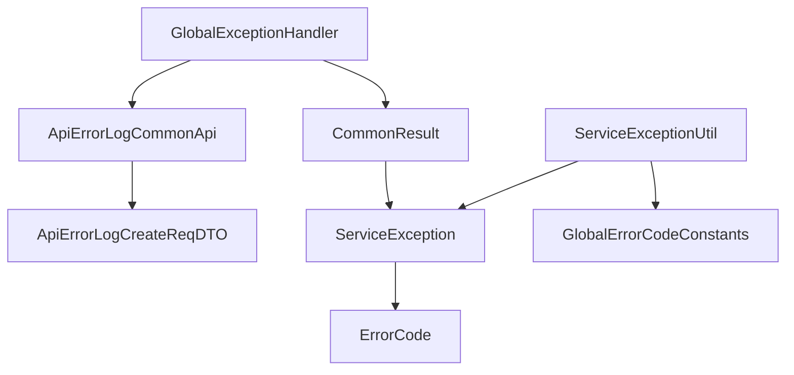

# 全局异常处理

<cite>
**本文引用的文件**
- [GlobalExceptionHandler.java](file://pandora-framework/pandora-spring-boot-starter-web/src/main/java/net/ittimeline/pandora/framework/web/core/handler/GlobalExceptionHandler.java)
- [ServiceException.java](file://pandora-framework/pandora-common/src/main/java/net/ittimeline/pandora/framework/common/exception/ServiceException.java)
- [ErrorCode.java](file://pandora-framework/pandora-common/src/main/java/net/ittimeline/pandora/framework/common/exception/ErrorCode.java)
- [GlobalErrorCodeConstants.java](file://pandora-framework/pandora-common/src/main/java/net/ittimeline/pandora/framework/common/exception/enums/GlobalErrorCodeConstants.java)
- [ServiceErrorCodeRange.java](file://pandora-framework/pandora-common/src/main/java/net/ittimeline/pandora/framework/common/exception/enums/ServiceErrorCodeRange.java)
- [ServiceExceptionUtil.java](file://pandora-framework/pandora-common/src/main/java/net/ittimeline/pandora/framework/common/exception/util/ServiceExceptionUtil.java)
- [CommonResult.java](file://pandora-framework/pandora-common/src/main/java/net/ittimeline/pandora/framework/common/pojo/CommonResult.java)
- [ApiErrorLogCommonApi.java](file://pandora-framework/pandora-common/src/main/java/net/ittimeline/pandora/framework/common/biz/infra/logger/ApiErrorLogCommonApi.java)
- [ApiErrorLogCreateReqDTO.java](file://pandora-framework/pandora-common/src/main/java/net/ittimeline/pandora/framework/common/biz/infra/logger/dto/ApiErrorLogCreateReqDTO.java)
</cite>

## 目录
1. [简介](#简介)
2. [项目结构](#项目结构)
3. [核心组件](#核心组件)
4. [架构总览](#架构总览)
5. [详细组件分析](#详细组件分析)
6. [依赖分析](#依赖分析)
7. [性能考虑](#性能考虑)
8. [故障排查指南](#故障排查指南)
9. [结论](#结论)
10. [附录](#附录)

## 简介
本文件系统性阐述 Pandora Cloud 框架中的全局异常处理机制，重点围绕 GlobalExceptionHandler 的工作原理展开，涵盖以下方面：
- 如何捕获不同类型的异常（参数校验、权限不足、业务异常、系统异常等）
- 如何统一转换为 CommonResult 响应格式
- 如何记录异常日志并与 ApiErrorLogCommonApi 集成进行上报
- ServiceException 与 ErrorCode 的使用方式，包括自定义异常的创建与抛出
- 提供覆盖业务异常、参数异常、权限异常等场景的完整处理示例路径

## 项目结构
全局异常处理相关代码主要分布在以下模块与包中：
- web 启动器模块：提供全局异常处理器与 Web 框架工具
- common 模块：提供异常体系、错误码、通用返回体、日志 DTO 与 API

图表来源
- [GlobalExceptionHandler.java:1-454](file://pandora-framework/pandora-spring-boot-starter-web/src/main/java/net/ittimeline/pandora/framework/web/core/handler/GlobalExceptionHandler.java#L1-L454)
- [ServiceException.java:1-64](file://pandora-framework/pandora-common/src/main/java/net/ittimeline/pandora/framework/common/exception/ServiceException.java#L1-L64)
- [ErrorCode.java:1-33](file://pandora-framework/pandora-common/src/main/java/net/ittimeline/pandora/framework/common/exception/ErrorCode.java#L1-L33)
- [GlobalErrorCodeConstants.java:1-42](file://pandora-framework/pandora-common/src/main/java/net/ittimeline/pandora/framework/common/exception/enums/GlobalErrorCodeConstants.java#L1-L42)
- [ServiceErrorCodeRange.java:1-48](file://pandora-framework/pandora-common/src/main/java/net/ittimeline/pandora/framework/common/exception/enums/ServiceErrorCodeRange.java#L1-L48)
- [ServiceExceptionUtil.java:1-85](file://pandora-framework/pandora-common/src/main/java/net/ittimeline/pandora/framework/common/exception/util/ServiceExceptionUtil.java#L1-L85)
- [CommonResult.java:1-123](file://pandora-framework/pandora-common/src/main/java/net/ittimeline/pandora/framework/common/pojo/CommonResult.java#L1-L123)
- [ApiErrorLogCommonApi.java:1-41](file://pandora-framework/pandora-common/src/main/java/net/ittimeline/pandora/framework/common/biz/infra/logger/ApiErrorLogCommonApi.java#L1-L41)
- [ApiErrorLogCreateReqDTO.java:1-74](file://pandora-framework/pandora-common/src/main/java/net/ittimeline/pandora/framework/common/biz/infra/logger/dto/ApiErrorLogCreateReqDTO.java#L1-L74)

章节来源
- [GlobalExceptionHandler.java:1-454](file://pandora-framework/pandora-spring-boot-starter-web/src/main/java/net/ittimeline/pandora/framework/web/core/handler/GlobalExceptionHandler.java#L1-L454)
- [CommonResult.java:1-123](file://pandora-framework/pandora-common/src/main/java/net/ittimeline/pandora/framework/common/pojo/CommonResult.java#L1-L123)

## 核心组件
- GlobalExceptionHandler：基于 Spring @RestControllerAdvice 的全局异常处理器，负责捕获各类异常并统一转换为 CommonResult 响应；同时负责构建并异步上报异常日志至基础设施服务。
- ServiceException：业务异常类，携带业务错误码与提示信息，便于前端识别与展示。
- ErrorCode：错误码对象，承载 code 与 msg，支持全局错误码与业务错误码区间划分。
- GlobalErrorCodeConstants：全局错误码常量集合，覆盖客户端错误（4xx）、服务端错误（5xx）与自定义错误。
- ServiceErrorCodeRange：业务错误码区间规范，用于约束各模块错误码分配，避免冲突。
- ServiceExceptionUtil：业务异常工具类，提供便捷的异常构造与消息格式化能力。
- CommonResult：通用返回体，封装 code、msg、data，并提供 checkError/getCheckedData 等与异常体系的集成方法。
- ApiErrorLogCommonApi 与 ApiErrorLogCreateReqDTO：异常日志上报接口与 DTO，用于将异常信息异步上报到基础设施服务。

章节来源
- [GlobalExceptionHandler.java:57-120](file://pandora-framework/pandora-spring-boot-starter-web/src/main/java/net/ittimeline/pandora/framework/web/core/handler/GlobalExceptionHandler.java#L57-L120)
- [ServiceException.java:13-63](file://pandora-framework/pandora-common/src/main/java/net/ittimeline/pandora/framework/common/exception/ServiceException.java#L13-L63)
- [ErrorCode.java:17-32](file://pandora-framework/pandora-common/src/main/java/net/ittimeline/pandora/framework/common/exception/ErrorCode.java#L17-L32)
- [GlobalErrorCodeConstants.java:16-41](file://pandora-framework/pandora-common/src/main/java/net/ittimeline/pandora/framework/common/exception/enums/GlobalErrorCodeConstants.java#L16-L41)
- [ServiceErrorCodeRange.java:31-47](file://pandora-framework/pandora-common/src/main/java/net/ittimeline/pandora/framework/common/exception/enums/ServiceErrorCodeRange.java#L31-L47)
- [ServiceExceptionUtil.java:18-84](file://pandora-framework/pandora-common/src/main/java/net/ittimeline/pandora/framework/common/exception/util/ServiceExceptionUtil.java#L18-L84)
- [CommonResult.java:21-122](file://pandora-framework/pandora-common/src/main/java/net/ittimeline/pandora/framework/common/pojo/CommonResult.java#L21-L122)
- [ApiErrorLogCommonApi.java:21-40](file://pandora-framework/pandora-common/src/main/java/net/ittimeline/pandora/framework/common/biz/infra/logger/ApiErrorLogCommonApi.java#L21-L40)
- [ApiErrorLogCreateReqDTO.java:16-73](file://pandora-framework/pandora-common/src/main/java/net/ittimeline/pandora/framework/common/biz/infra/logger/dto/ApiErrorLogCreateReqDTO.java#L16-L73)

## 架构总览
下图展示了全局异常处理的整体流程：从异常捕获、分类处理、统一响应，到异常日志的异步上报。

图表来源
- [GlobalExceptionHandler.java:79-120](file://pandora-framework/pandora-spring-boot-starter-web/src/main/java/net/ittimeline/pandora/framework/web/core/handler/GlobalExceptionHandler.java#L79-L120)
- [CommonResult.java:54-72](file://pandora-framework/pandora-common/src/main/java/net/ittimeline/pandora/framework/common/pojo/CommonResult.java#L54-L72)
- [ApiErrorLogCommonApi.java:36-39](file://pandora-framework/pandora-common/src/main/java/net/ittimeline/pandora/framework/common/biz/infra/logger/ApiErrorLogCommonApi.java#L36-L39)

## 详细组件分析

### GlobalExceptionHandler 工作原理与处理流程
- 入口方法 allExceptionHandler：为 Filter 等非 MVC 流程提供兜底异常处理，内部按异常类型逐一判断并委派到对应处理器。
- 参数校验类异常：对 MissingServletRequestParameterException、MethodArgumentTypeMismatchException、MethodArgumentNotValidException、BindException、ConstraintViolationException、HttpMessageNotReadableException 等进行统一处理，返回 400 系列错误。
- 资源与方法类异常：对 NoHandlerFoundException、NoResourceFoundException、HttpRequestMethodNotSupportedException、HttpMediaTypeNotSupportedException 等进行统一处理。
- 权限异常：对 AccessDeniedException 进行统一处理，返回 403。
- 业务异常 ServiceException：直接读取 code 与 message，返回统一响应；对特定“忽略”错误消息进行降噪输出。
- 系统异常兜底：defaultExceptionHandler 统一处理未捕获异常，记录异常日志并返回 500。
- 异步日志上报：createExceptionLog 构建 ApiErrorLogCreateReqDTO 并通过 ApiErrorLogCommonApi.createApiErrorLogAsync 异步上报。

图表来源
- [GlobalExceptionHandler.java:79-120](file://pandora-framework/pandora-spring-boot-starter-web/src/main/java/net/ittimeline/pandora/framework/web/core/handler/GlobalExceptionHandler.java#L79-L120)
- [GlobalExceptionHandler.java:127-281](file://pandora-framework/pandora-spring-boot-starter-web/src/main/java/net/ittimeline/pandora/framework/web/core/handler/GlobalExceptionHandler.java#L127-L281)
- [GlobalExceptionHandler.java:321-341](file://pandora-framework/pandora-spring-boot-starter-web/src/main/java/net/ittimeline/pandora/framework/web/core/handler/GlobalExceptionHandler.java#L321-L341)
- [GlobalExceptionHandler.java:343-384](file://pandora-framework/pandora-spring-boot-starter-web/src/main/java/net/ittimeline/pandora/framework/web/core/handler/GlobalExceptionHandler.java#L343-L384)
- [ApiErrorLogCommonApi.java:36-39](file://pandora-framework/pandora-common/src/main/java/net/ittimeline/pandora/framework/common/biz/infra/logger/ApiErrorLogCommonApi.java#L36-L39)

章节来源
- [GlobalExceptionHandler.java:79-120](file://pandora-framework/pandora-spring-boot-starter-web/src/main/java/net/ittimeline/pandora/framework/web/core/handler/GlobalExceptionHandler.java#L79-L120)
- [GlobalExceptionHandler.java:127-281](file://pandora-framework/pandora-spring-boot-starter-web/src/main/java/net/ittimeline/pandora/framework/web/core/handler/GlobalExceptionHandler.java#L127-L281)
- [GlobalExceptionHandler.java:298-316](file://pandora-framework/pandora-spring-boot-starter-web/src/main/java/net/ittimeline/pandora/framework/web/core/handler/GlobalExceptionHandler.java#L298-L316)
- [GlobalExceptionHandler.java:321-341](file://pandora-framework/pandora-spring-boot-starter-web/src/main/java/net/ittimeline/pandora/framework/web/core/handler/GlobalExceptionHandler.java#L321-L341)
- [GlobalExceptionHandler.java:343-384](file://pandora-framework/pandora-spring-boot-starter-web/src/main/java/net/ittimeline/pandora/framework/web/core/handler/GlobalExceptionHandler.java#L343-L384)

### ServiceException 与 ErrorCode 使用方法
- ServiceException：携带业务错误码与提示信息，支持通过 ErrorCode 或 (code, message) 构造。
- ErrorCode：统一承载 code 与 msg，区分全局错误码（0-999）与业务错误码（≥10^9），便于前后端约定与识别。
- ServiceExceptionUtil：提供 exception(...) 与 invalidParamException(...) 等便捷方法，支持占位符格式化，避免 String.format 的风险。
- CommonResult：提供 error(...) 与 checkError()/getCheckedData() 与异常体系集成，便于在业务层快速抛出或检查异常。

图表来源
- [ServiceException.java:13-63](file://pandora-framework/pandora-common/src/main/java/net/ittimeline/pandora/framework/common/exception/ServiceException.java#L13-L63)
- [ErrorCode.java:17-32](file://pandora-framework/pandora-common/src/main/java/net/ittimeline/pandora/framework/common/exception/ErrorCode.java#L17-L32)
- [ServiceExceptionUtil.java:18-84](file://pandora-framework/pandora-common/src/main/java/net/ittimeline/pandora/framework/common/exception/util/ServiceExceptionUtil.java#L18-L84)
- [CommonResult.java:21-122](file://pandora-framework/pandora-common/src/main/java/net/ittimeline/pandora/framework/common/pojo/CommonResult.java#L21-L122)

章节来源
- [ServiceException.java:13-63](file://pandora-framework/pandora-common/src/main/java/net/ittimeline/pandora/framework/common/exception/ServiceException.java#L13-L63)
- [ErrorCode.java:17-32](file://pandora-framework/pandora-common/src/main/java/net/ittimeline/pandora/framework/common/exception/ErrorCode.java#L17-L32)
- [ServiceExceptionUtil.java:18-84](file://pandora-framework/pandora-common/src/main/java/net/ittimeline/pandora/framework/common/exception/util/ServiceExceptionUtil.java#L18-L84)
- [CommonResult.java:54-122](file://pandora-framework/pandora-common/src/main/java/net/ittimeline/pandora/framework/common/pojo/CommonResult.java#L54-L122)

### 与 ApiErrorLogCommonApi 的集成与异常上报机制
- 构建异常日志：buildExceptionLog 从 HttpServletRequest 与 Throwable 中提取关键信息，填充 ApiErrorLogCreateReqDTO。
- 异步上报：通过 ApiErrorLogCommonApi.createApiErrorLogAsync 异步调用，避免阻塞主流程。
- 容错处理：上报过程中如出现异常，记录错误日志，保证不影响主流程。

图表来源
- [GlobalExceptionHandler.java:343-384](file://pandora-framework/pandora-spring-boot-starter-web/src/main/java/net/ittimeline/pandora/framework/web/core/handler/GlobalExceptionHandler.java#L343-L384)
- [ApiErrorLogCommonApi.java:36-39](file://pandora-framework/pandora-common/src/main/java/net/ittimeline/pandora/framework/common/biz/infra/logger/ApiErrorLogCommonApi.java#L36-L39)
- [ApiErrorLogCreateReqDTO.java:16-73](file://pandora-framework/pandora-common/src/main/java/net/ittimeline/pandora/framework/common/biz/infra/logger/dto/ApiErrorLogCreateReqDTO.java#L16-L73)

章节来源
- [GlobalExceptionHandler.java:343-384](file://pandora-framework/pandora-spring-boot-starter-web/src/main/java/net/ittimeline/pandora/framework/web/core/handler/GlobalExceptionHandler.java#L343-L384)
- [ApiErrorLogCommonApi.java:21-40](file://pandora-framework/pandora-common/src/main/java/net/ittimeline/pandora/framework/common/biz/infra/logger/ApiErrorLogCommonApi.java#L21-L40)
- [ApiErrorLogCreateReqDTO.java:16-73](file://pandora-framework/pandora-common/src/main/java/net/ittimeline/pandora/framework/common/biz/infra/logger/dto/ApiErrorLogCreateReqDTO.java#L16-L73)

### 异常处理示例（场景与路径）
以下示例均给出“代码片段路径”，便于定位实现细节与参考用法：

- 业务异常（库存不足、手机号已存在等）
  - 触发路径：在业务层抛出 ServiceException
  - 处理路径：GlobalExceptionHandler.serviceExceptionHandler
  - 统一响应：CommonResult.error(...)
  - 示例路径
    - [抛出业务异常示例路径:34-42](file://pandora-framework/pandora-common/src/main/java/net/ittimeline/pandora/framework/common/exception/ServiceException.java#L34-L42)
    - [业务异常处理路径:298-316](file://pandora-framework/pandora-spring-boot-starter-web/src/main/java/net/ittimeline/pandora/framework/web/core/handler/GlobalExceptionHandler.java#L298-L316)
    - [统一响应封装路径:54-72](file://pandora-framework/pandora-common/src/main/java/net/ittimeline/pandora/framework/common/pojo/CommonResult.java#L54-L72)

- 参数异常（参数缺失、类型不匹配、校验失败、消息不可读）
  - 触发路径：Spring MVC 参数绑定与校验异常
  - 处理路径：对应各 @ExceptionHandler 方法
  - 示例路径
    - [参数缺失处理路径:127-131](file://pandora-framework/pandora-spring-boot-starter-web/src/main/java/net/ittimeline/pandora/framework/web/core/handler/GlobalExceptionHandler.java#L127-L131)
    - [类型不匹配处理路径:138-142](file://pandora-framework/pandora-spring-boot-starter-web/src/main/java/net/ittimeline/pandora/framework/web/core/handler/GlobalExceptionHandler.java#L138-L142)
    - [参数校验失败处理路径:147-167](file://pandora-framework/pandora-spring-boot-starter-web/src/main/java/net/ittimeline/pandora/framework/web/core/handler/GlobalExceptionHandler.java#L147-L167)
    - [消息不可读处理路径:185-197](file://pandora-framework/pandora-spring-boot-starter-web/src/main/java/net/ittimeline/pandora/framework/web/core/handler/GlobalExceptionHandler.java#L185-L197)

- 权限异常（未登录、无权限）
  - 触发路径：Spring Security 权限拦截
  - 处理路径：GlobalExceptionHandler.accessDeniedExceptionHandler
  - 示例路径
    - [权限不足处理路径:276-281](file://pandora-framework/pandora-spring-boot-starter-web/src/main/java/net/ittimeline/pandora/framework/web/core/handler/GlobalExceptionHandler.java#L276-L281)
    - [未登录/无权限常量路径:22-28](file://pandora-framework/pandora-common/src/main/java/net/ittimeline/pandora/framework/common/exception/enums/GlobalErrorCodeConstants.java#L22-L28)

- 系统异常（数据库表不存在、未知异常）
  - 触发路径：未捕获异常或特定数据库异常
  - 处理路径：defaultExceptionHandler 与 handleTableNotExists
  - 异常日志：createExceptionLog
  - 示例路径
    - [系统异常兜底路径:321-341](file://pandora-framework/pandora-spring-boot-starter-web/src/main/java/net/ittimeline/pandora/framework/web/core/handler/GlobalExceptionHandler.java#L321-L341)
    - [表不存在处理路径:392-452](file://pandora-framework/pandora-spring-boot-starter-web/src/main/java/net/ittimeline/pandora/framework/web/core/handler/GlobalExceptionHandler.java#L392-L452)
    - [异常日志构建路径:343-384](file://pandora-framework/pandora-spring-boot-starter-web/src/main/java/net/ittimeline/pandora/framework/web/core/handler/GlobalExceptionHandler.java#L343-L384)

## 依赖分析
- GlobalExceptionHandler 依赖：
  - 异常类型：Spring MVC、Jakarta Validation、Spring Security、Guava 等
  - 返回体：CommonResult
  - 日志：ApiErrorLogCommonApi 与 ApiErrorLogCreateReqDTO
  - 工具：Hutool、WebFrameworkUtils、ServletUtils、TracerUtils、JsonUtils
- ServiceException 与 ErrorCode：
  - ServiceException 携带 ErrorCode 或 (code, message)
  - GlobalErrorCodeConstants 提供全局错误码常量
  - ServiceErrorCodeRange 提供业务错误码区间规范
- ServiceExceptionUtil：
  - 与 ServiceException/GlobalErrorCodeConstants 集成，提供格式化能力

图表来源
- [GlobalExceptionHandler.java:1-454](file://pandora-framework/pandora-spring-boot-starter-web/src/main/java/net/ittimeline/pandora/framework/web/core/handler/GlobalExceptionHandler.java#L1-L454)
- [CommonResult.java:1-123](file://pandora-framework/pandora-common/src/main/java/net/ittimeline/pandora/framework/common/pojo/CommonResult.java#L1-L123)
- [ApiErrorLogCommonApi.java:1-41](file://pandora-framework/pandora-common/src/main/java/net/ittimeline/pandora/framework/common/biz/infra/logger/ApiErrorLogCommonApi.java#L1-L41)
- [ApiErrorLogCreateReqDTO.java:1-74](file://pandora-framework/pandora-common/src/main/java/net/ittimeline/pandora/framework/common/biz/infra/logger/dto/ApiErrorLogCreateReqDTO.java#L1-L74)
- [ServiceException.java:1-64](file://pandora-framework/pandora-common/src/main/java/net/ittimeline/pandora/framework/common/exception/ServiceException.java#L1-L64)
- [ErrorCode.java:1-33](file://pandora-framework/pandora-common/src/main/java/net/ittimeline/pandora/framework/common/exception/ErrorCode.java#L1-L33)
- [ServiceExceptionUtil.java:1-85](file://pandora-framework/pandora-common/src/main/java/net/ittimeline/pandora/framework/common/exception/util/ServiceExceptionUtil.java#L1-L85)
- [GlobalErrorCodeConstants.java:1-42](file://pandora-framework/pandora-common/src/main/java/net/ittimeline/pandora/framework/common/exception/enums/GlobalErrorCodeConstants.java#L1-L42)

章节来源
- [GlobalExceptionHandler.java:1-454](file://pandora-framework/pandora-spring-boot-starter-web/src/main/java/net/ittimeline/pandora/framework/web/core/handler/GlobalExceptionHandler.java#L1-L454)
- [ServiceException.java:1-64](file://pandora-framework/pandora-common/src/main/java/net/ittimeline/pandora/framework/common/exception/ServiceException.java#L1-L64)
- [ErrorCode.java:1-33](file://pandora-framework/pandora-common/src/main/java/net/ittimeline/pandora/framework/common/exception/ErrorCode.java#L1-L33)
- [GlobalErrorCodeConstants.java:1-42](file://pandora-framework/pandora-common/src/main/java/net/ittimeline/pandora/framework/common/exception/enums/GlobalErrorCodeConstants.java#L1-L42)
- [ServiceExceptionUtil.java:1-85](file://pandora-framework/pandora-common/src/main/java/net/ittimeline/pandora/framework/common/exception/util/ServiceExceptionUtil.java#L1-L85)
- [CommonResult.java:1-123](file://pandora-framework/pandora-common/src/main/java/net/ittimeline/pandora/framework/common/pojo/CommonResult.java#L1-L123)
- [ApiErrorLogCommonApi.java:1-41](file://pandora-framework/pandora-common/src/main/java/net/ittimeline/pandora/framework/common/biz/infra/logger/ApiErrorLogCommonApi.java#L1-L41)
- [ApiErrorLogCreateReqDTO.java:1-74](file://pandora-framework/pandora-common/src/main/java/net/ittimeline/pandora/framework/common/biz/infra/logger/dto/ApiErrorLogCreateReqDTO.java#L1-L74)

## 性能考虑
- 异常日志异步上报：通过 @Async 与异步接口避免阻塞请求线程，提升吞吐。
- 日志降噪：对特定“忽略”的错误消息进行降噪输出，减少控制台噪声。
- 格式化优化：ServiceExceptionUtil 使用预估容量的 StringBuilder 与占位符替换，避免频繁扩容与 String.format 的潜在异常。
- 仅输出首层堆栈：业务异常处理中仅输出首层 StackTraceElement，降低日志体积与控制台噪音。

## 故障排查指南
- 业务异常未被识别为 400/403/500：
  - 检查是否抛出了 ServiceException 或是否被 defaultExceptionHandler 捕获
  - 参考路径：[业务异常处理:298-316](file://pandora-framework/pandora-spring-boot-starter-web/src/main/java/net/ittimeline/pandora/framework/web/core/handler/GlobalExceptionHandler.java#L298-L316)，[系统异常兜底:321-341](file://pandora-framework/pandora-spring-boot-starter-web/src/main/java/net/ittimeline/pandora/framework/web/core/handler/GlobalExceptionHandler.java#L321-L341)
- 参数校验异常未返回明确提示：
  - 检查 MethodArgumentNotValidException/BindException/ConstraintViolationException 的处理器是否生效
  - 参考路径：[参数校验处理:147-167](file://pandora-framework/pandora-spring-boot-starter-web/src/main/java/net/ittimeline/pandora/framework/web/core/handler/GlobalExceptionHandler.java#L147-L167)，[约束校验处理:202-207](file://pandora-framework/pandora-spring-boot-starter-web/src/main/java/net/ittimeline/pandora/framework/web/core/handler/GlobalExceptionHandler.java#L202-L207)
- 异常日志未上报：
  - 检查 ApiErrorLogCommonApi 是否可用、网络连通性与异步线程池配置
  - 参考路径：[异常日志构建与上报:343-384](file://pandora-framework/pandora-spring-boot-starter-web/src/main/java/net/ittimeline/pandora/framework/web/core/handler/GlobalExceptionHandler.java#L343-L384)，[异步接口:36-39](file://pandora-framework/pandora-common/src/main/java/net/ittimeline/pandora/framework/common/biz/infra/logger/ApiErrorLogCommonApi.java#L36-L39)
- 表不存在异常未识别：
  - 检查异常根因消息是否包含模块表前缀（如 report_、bpm_ 等）
  - 参考路径：[表不存在处理:392-452](file://pandora-framework/pandora-spring-boot-starter-web/src/main/java/net/ittimeline/pandora/framework/web/core/handler/GlobalExceptionHandler.java#L392-L452)

章节来源
- [GlobalExceptionHandler.java:298-316](file://pandora-framework/pandora-spring-boot-starter-web/src/main/java/net/ittimeline/pandora/framework/web/core/handler/GlobalExceptionHandler.java#L298-L316)
- [GlobalExceptionHandler.java:321-341](file://pandora-framework/pandora-spring-boot-starter-web/src/main/java/net/ittimeline/pandora/framework/web/core/handler/GlobalExceptionHandler.java#L321-L341)
- [GlobalExceptionHandler.java:343-384](file://pandora-framework/pandora-spring-boot-starter-web/src/main/java/net/ittimeline/pandora/framework/web/core/handler/GlobalExceptionHandler.java#L343-L384)
- [GlobalExceptionHandler.java:392-452](file://pandora-framework/pandora-spring-boot-starter-web/src/main/java/net/ittimeline/pandora/framework/web/core/handler/GlobalExceptionHandler.java#L392-L452)
- [ApiErrorLogCommonApi.java:36-39](file://pandora-framework/pandora-common/src/main/java/net/ittimeline/pandora/framework/common/biz/infra/logger/ApiErrorLogCommonApi.java#L36-L39)

## 结论
Pandora Cloud 的全局异常处理机制通过 GlobalExceptionHandler 将多种异常类型统一转化为 CommonResult，并结合 ServiceException/ErrorCode 体系实现业务语义化错误码与提示。异常日志通过 ApiErrorLogCommonApi 异步上报，既保证了用户体验，也为运维监控提供了可靠支撑。配合 ServiceExceptionUtil 的格式化能力与错误码区间规范，开发者能够快速、一致地创建与抛出自定义异常，提升系统的可维护性与可观测性。

## 附录
- 错误码区间说明
  - 全局错误码：0-999，参考 [GlobalErrorCodeConstants:16-41](file://pandora-framework/pandora-common/src/main/java/net/ittimeline/pandora/framework/common/exception/enums/GlobalErrorCodeConstants.java#L16-L41)
  - 业务错误码：≥10^9，参考 [ServiceErrorCodeRange:31-47](file://pandora-framework/pandora-common/src/main/java/net/ittimeline/pandora/framework/common/exception/enums/ServiceErrorCodeRange.java#L31-L47)
- 常用工具与返回体
  - 异常工具：[ServiceExceptionUtil:18-84](file://pandora-framework/pandora-common/src/main/java/net/ittimeline/pandora/framework/common/exception/util/ServiceExceptionUtil.java#L18-L84)
  - 通用返回：[CommonResult:21-122](file://pandora-framework/pandora-common/src/main/java/net/ittimeline/pandora/framework/common/pojo/CommonResult.java#L21-L122)
- 异步日志上报
  - 接口定义：[ApiErrorLogCommonApi:21-40](file://pandora-framework/pandora-common/src/main/java/net/ittimeline/pandora/framework/common/biz/infra/logger/ApiErrorLogCommonApi.java#L21-L40)
  - DTO 字段：[ApiErrorLogCreateReqDTO:16-73](file://pandora-framework/pandora-common/src/main/java/net/ittimeline/pandora/framework/common/biz/infra/logger/dto/ApiErrorLogCreateReqDTO.java#L16-L73)