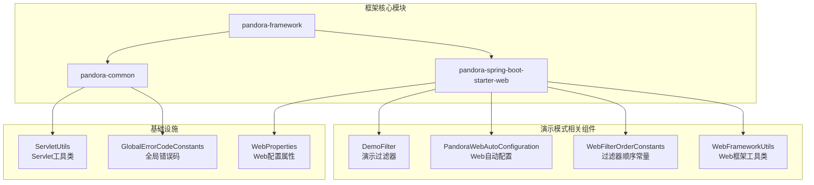
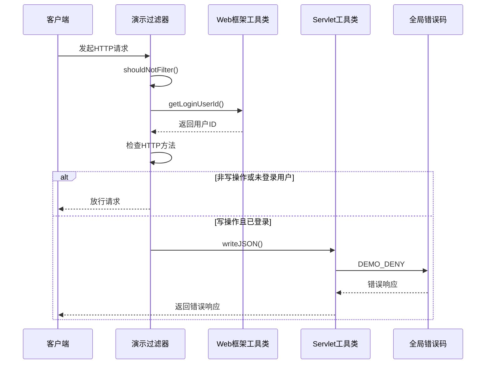
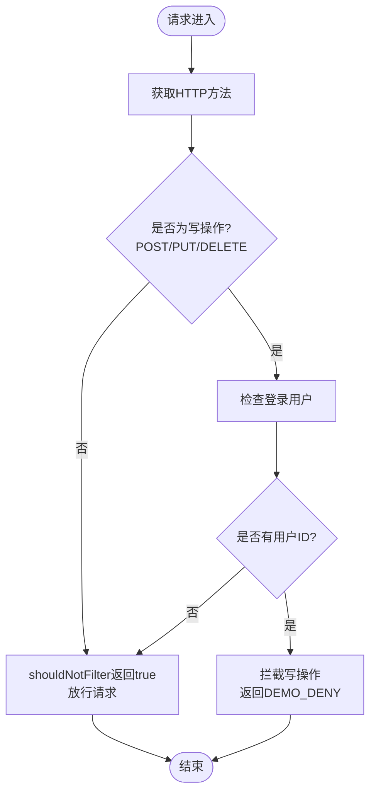
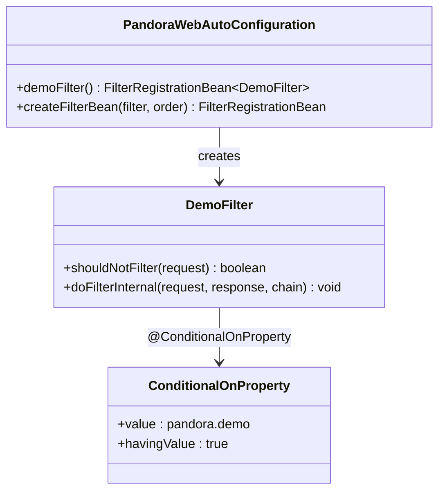
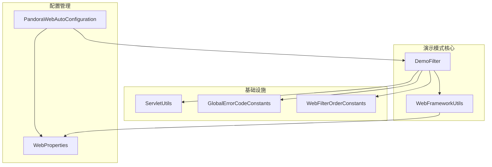

# 演示模式

<cite>
**本文档引用的文件**
- [DemoFilter.java](file://pandora-framework/pandora-spring-boot-starter-web/src/main/java/net/ittimeline/pandora/framework/web/core/filter/DemoFilter.java)
- [PandoraWebAutoConfiguration.java](file://pandora-framework/pandora-spring-boot-starter-web/src/main/java/net/ittimeline/pandora/framework/web/config/PandoraWebAutoConfiguration.java)
- [WebFilterOrderConstants.java](file://pandora-framework/pandora-common/src/main/java/net/ittimeline/pandora/framework/common/constants/WebFilterOrderConstants.java)
- [ServletUtils.java](file://pandora-framework/pandora-common/src/main/java/net/ittimeline/pandora/framework/common/util/web/servlet/ServletUtils.java)
- [WebFrameworkUtils.java](file://pandora-framework/pandora-spring-boot-starter-web/src/main/java/net/ittimeline/pandora/framework/web/core/util/WebFrameworkUtils.java)
- [GlobalErrorCodeConstants.java](file://pandora-framework/pandora-common/src/main/java/net/ittimeline/pandora/framework/common/exception/enums/GlobalErrorCodeConstants.java)
- [WebProperties.java](file://pandora-framework/pandora-spring-boot-starter-web/src/main/java/net/ittimeline/pandora/framework/web/config/WebProperties.java)
- [README.md](file://README.md)
</cite>

## 目录
1. [简介](#简介)
2. [项目结构](#项目结构)
3. [核心组件](#核心组件)
4. [架构概览](#架构概览)
5. [详细组件分析](#详细组件分析)
6. [依赖分析](#依赖分析)
7. [性能考虑](#性能考虑)
8. [故障排除指南](#故障排除指南)
9. [结论](#结论)
10. [附录](#附录)

## 简介

演示模式是潘多拉云平台框架中的一个重要功能特性，旨在为开发者提供一个安全的测试环境。该功能通过拦截器机制阻止演示环境中的写操作，确保测试数据不会被意外修改或删除。

演示模式的核心价值在于：
- **数据保护**：防止演示环境中的测试数据被意外修改
- **开发效率**：允许开发者在不受限制的环境下进行功能验证
- **安全性保障**：通过严格的过滤机制确保生产环境的安全性
- **开发体验**：提供灵活的演示模式切换机制

## 项目结构

潘多拉云平台采用模块化的架构设计，演示模式功能主要分布在以下模块中：



**图表来源**
- [DemoFilter.java:1-37](file://pandora-framework/pandora-spring-boot-starter-web/src/main/java/net/ittimeline/pandora/framework/web/core/filter/DemoFilter.java#L1-L37)
- [PandoraWebAutoConfiguration.java:1-177](file://pandora-framework/pandora-spring-boot-starter-web/src/main/java/net/ittimeline/pandora/framework/web/config/PandoraWebAutoConfiguration.java#L1-L177)

**章节来源**
- [README.md:1-15](file://README.md#L1-L15)

## 核心组件

演示模式功能由多个核心组件协同工作，形成完整的过滤机制：

### DemoFilter - 演示过滤器

DemoFilter是演示模式的核心组件，继承自Spring的OncePerRequestFilter基类，专门负责拦截演示环境中的写操作请求。

### Web过滤器顺序管理

WebFilterOrderConstants定义了所有Web过滤器的执行顺序，确保演示过滤器能够正确地在请求处理流程中发挥作用。

### Web框架工具类

WebFrameworkUtils提供了获取登录用户信息的功能，这是演示过滤器判断是否拦截请求的关键依据。

**章节来源**
- [DemoFilter.java:14-36](file://pandora-framework/pandora-spring-boot-starter-web/src/main/java/net/ittimeline/pandora/framework/web/core/filter/DemoFilter.java#L14-L36)
- [WebFilterOrderConstants.java:11-37](file://pandora-framework/pandora-common/src/main/java/net/ittimeline/pandora/framework/common/constants/WebFilterOrderConstants.java#L11-L37)
- [WebFrameworkUtils.java:89-130](file://pandora-framework/pandora-spring-boot-starter-web/src/main/java/net/ittimeline/pandora/framework/web/core/util/WebFrameworkUtils.java#L89-L130)

## 架构概览

演示模式的架构设计体现了清晰的分层思想和职责分离原则：



**图表来源**
- [DemoFilter.java:23-34](file://pandora-framework/pandora-spring-boot-starter-web/src/main/java/net/ittimeline/pandora/framework/web/core/filter/DemoFilter.java#L23-L34)
- [WebFrameworkUtils.java:89-94](file://pandora-framework/pandora-spring-boot-starter-web/src/main/java/net/ittimeline/pandora/framework/web/core/util/WebFrameworkUtils.java#L89-L94)
- [ServletUtils.java:29-33](file://pandora-framework/pandora-common/src/main/java/net/ittimeline/pandora/framework/common/util/web/servlet/ServletUtils.java#L29-L33)
- [GlobalErrorCodeConstants.java:38](file://pandora-framework/pandora-common/src/main/java/net/ittimeline/pandora/framework/common/exception/enums/GlobalErrorCodeConstants.java#L38)

## 详细组件分析

### DemoFilter实现分析

DemoFilter采用了简洁而高效的实现策略：

#### 核心逻辑流程



**图表来源**
- [DemoFilter.java:24-28](file://pandora-framework/pandora-spring-boot-starter-web/src/main/java/net/ittimeline/pandora/framework/web/core/filter/DemoFilter.java#L24-L28)
- [DemoFilter.java:31-34](file://pandora-framework/pandora-spring-boot-starter-web/src/main/java/net/ittimeline/pandora/framework/web/core/filter/DemoFilter.java#L31-L34)

#### 关键实现细节

1. **条件过滤机制**：只有当请求方法为POST、PUT或DELETE且用户已登录时才会拦截
2. **快速放行策略**：对于非写操作和未登录用户直接放行，减少不必要的处理开销
3. **统一错误响应**：使用统一的错误码和响应格式，确保用户体验一致性

### Web自动配置分析

PandoraWebAutoConfiguration负责演示模式的自动化配置：

#### 条件化配置机制



**图表来源**
- [PandoraWebAutoConfiguration.java:142-146](file://pandora-framework/pandora-spring-boot-starter-web/src/main/java/net/ittimeline/pandora/framework/web/config/PandoraWebAutoConfiguration.java#L142-L146)
- [DemoFilter.java:21](file://pandora-framework/pandora-spring-boot-starter-web/src/main/java/net/ittimeline/pandora/framework/web/core/filter/DemoFilter.java#L21)

#### 配置属性管理

WebProperties定义了演示模式相关的配置属性，虽然当前版本主要关注pandora.demo属性，但为未来的扩展预留了空间。

**章节来源**
- [PandoraWebAutoConfiguration.java:142-146](file://pandora-framework/pandora-spring-boot-starter-web/src/main/java/net/ittimeline/pandora/framework/web/config/PandoraWebAutoConfiguration.java#L142-L146)
- [WebProperties.java:18-29](file://pandora-framework/pandora-spring-boot-starter-web/src/main/java/net/ittimeline/pandora/framework/web/config/WebProperties.java#L18-L29)

### 错误处理机制

演示模式使用统一的错误处理机制，确保错误响应的一致性和可预测性：

#### 错误码定义

DEMO_DENY错误码具有特定的语义和用途：
- **错误码**：901
- **错误消息**："演示模式，禁止写操作"
- **错误分类**：自定义错误段（900系列）

#### 响应格式标准化

通过ServletUtils和CommonResult的配合，确保所有错误响应都遵循统一的JSON格式标准。

**章节来源**
- [GlobalErrorCodeConstants.java:38](file://pandora-framework/pandora-common/src/main/java/net/ittimeline/pandora/framework/common/exception/enums/GlobalErrorCodeConstants.java#L38)
- [ServletUtils.java:29-33](file://pandora-framework/pandora-common/src/main/java/net/ittimeline/pandora/framework/common/util/web/servlet/ServletUtils.java#L29-L33)

## 依赖分析

演示模式功能的依赖关系体现了清晰的层次结构：



**图表来源**
- [DemoFilter.java:3-12](file://pandora-framework/pandora-spring-boot-starter-web/src/main/java/net/ittimeline/pandora/framework/web/core/filter/DemoFilter.java#L3-L12)
- [PandoraWebAutoConfiguration.java:8-28](file://pandora-framework/pandora-spring-boot-starter-web/src/main/java/net/ittimeline/pandora/framework/web/config/PandoraWebAutoConfiguration.java#L8-L28)

### 组件耦合度分析

- **低耦合设计**：DemoFilter仅依赖必要的基础设施类，保持了良好的内聚性
- **接口隔离**：通过WebFrameworkUtils抽象出用户信息获取逻辑
- **配置驱动**：通过Spring Boot的条件化配置实现灵活的启用控制

**章节来源**
- [DemoFilter.java:1-37](file://pandora-framework/pandora-spring-boot-starter-web/src/main/java/net/ittimeline/pandora/framework/web/core/filter/DemoFilter.java#L1-L37)
- [PandoraWebAutoConfiguration.java:1-177](file://pandora-framework/pandora-spring-boot-starter-web/src/main/java/net/ittimeline/pandora/framework/web/config/PandoraWebAutoConfiguration.java#L1-L177)

## 性能考虑

演示模式在设计时充分考虑了性能影响，采用了多项优化策略：

### 过滤器执行效率

1. **早期退出机制**：通过shouldNotFilter方法实现快速放行，避免不必要的处理
2. **最小化计算**：仅进行基本的HTTP方法检查和用户ID验证
3. **内存友好**：不创建额外的数据结构，使用简单的条件判断

### 内存和CPU开销

- **CPU开销**：极低，主要是字符串比较和对象检查操作
- **内存开销**：几乎可以忽略不计，仅涉及少量的局部变量
- **I/O开销**：无额外的磁盘或网络I/O操作

### 扩展性考虑

演示模式的设计允许在未来添加更多的拦截逻辑，同时保持性能稳定：
- 可以根据用户类型实施不同的拦截策略
- 可以针对特定的API路径进行精细化控制
- 可以集成更多的上下文信息进行决策

## 故障排除指南

### 常见问题及解决方案

#### 演示模式未生效

**症状**：写操作仍然可以执行，没有被拦截

**可能原因**：
1. 配置属性pandora.demo未设置为true
2. DemoFilter未正确注册到Spring容器中
3. 过滤器执行顺序不正确

**解决方案**：
1. 检查application.yml或application.properties中的配置
2. 确认DemoFilter Bean已被创建
3. 验证WebFilterOrderConstants.DEMO_FILTER的值

#### 错误响应格式异常

**症状**：返回的错误响应不符合预期格式

**可能原因**：
1. ServletUtils.writeJSON方法调用异常
2. CommonResult序列化失败
3. Content-Type设置不正确

**解决方案**：
1. 检查JsonUtils的配置和可用性
2. 验证GlobalErrorCodeConstants的定义
3. 确认响应头设置正确

#### 用户ID获取失败

**症状**：演示模式无法正确识别登录用户

**可能原因**：
1. WebFrameworkUtils.getLoginUserId()返回null
2. 用户信息未正确设置到请求属性中
3. 请求上下文丢失

**解决方案**：
1. 检查用户认证流程是否正常
2. 确认WebFrameworkUtils.setLoginUserId()的调用
3. 验证请求属性的生命周期

**章节来源**
- [PandoraWebAutoConfiguration.java:142-146](file://pandora-framework/pandora-spring-boot-starter-web/src/main/java/net/ittimeline/pandora/framework/web/config/PandoraWebAutoConfiguration.java#L142-L146)
- [WebFrameworkUtils.java:89-94](file://pandora-framework/pandora-spring-boot-starter-web/src/main/java/net/ittimeline/pandora/framework/web/core/util/WebFrameworkUtils.java#L89-L94)

## 结论

演示模式功能展现了优秀的软件工程实践，通过简洁而高效的设计实现了复杂的功能需求。其核心优势包括：

### 设计优势

1. **简洁性**：仅37行代码就实现了完整的演示模式功能
2. **安全性**：通过严格的条件判断确保不会误拦截合法请求
3. **可维护性**：清晰的职责分离和模块化设计便于维护
4. **性能友好**：极低的运行时开销不影响系统整体性能

### 最佳实践建议

1. **开发环境专用**：仅在开发和测试环境启用演示模式
2. **配置管理**：通过Spring Boot配置属性集中管理演示模式开关
3. **监控告警**：在生产环境中监控演示模式相关的错误日志
4. **文档更新**：及时更新相关技术文档和开发指南

演示模式功能为开发者提供了一个安全可靠的测试环境，既保护了测试数据的完整性，又不影响正常的开发和调试工作。

## 附录

### 配置示例

#### 启用演示模式

在application.yml中添加：
```yaml
pandora:
  demo: true
```

#### 集成示例

演示模式与现有Web框架的无缝集成体现在：
- 自动配置机制确保过滤器正确注册
- 统一的错误处理机制提供一致的用户体验
- 灵活的条件化配置支持不同环境的差异化需求

### 使用场景

1. **开发测试**：开发者可以在不受限制的环境下进行功能验证
2. **演示展示**：向客户展示系统功能而不担心数据安全
3. **培训环境**：为新用户提供安全的练习环境
4. **回归测试**：在隔离环境中进行自动化测试