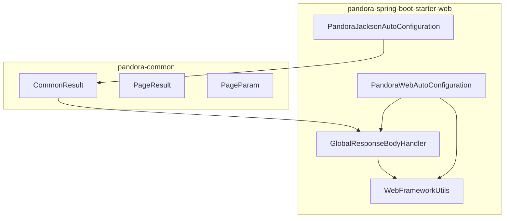
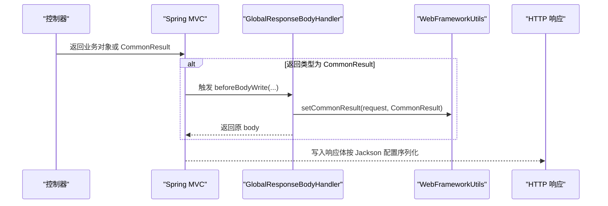
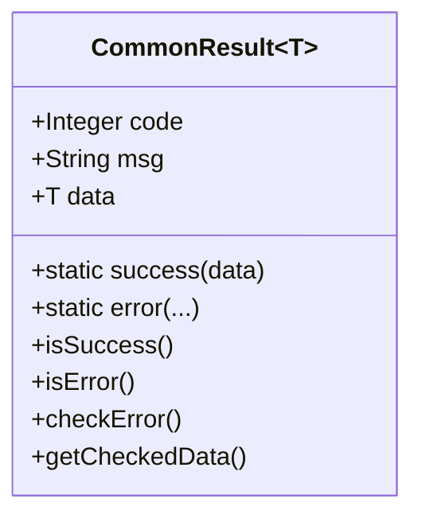
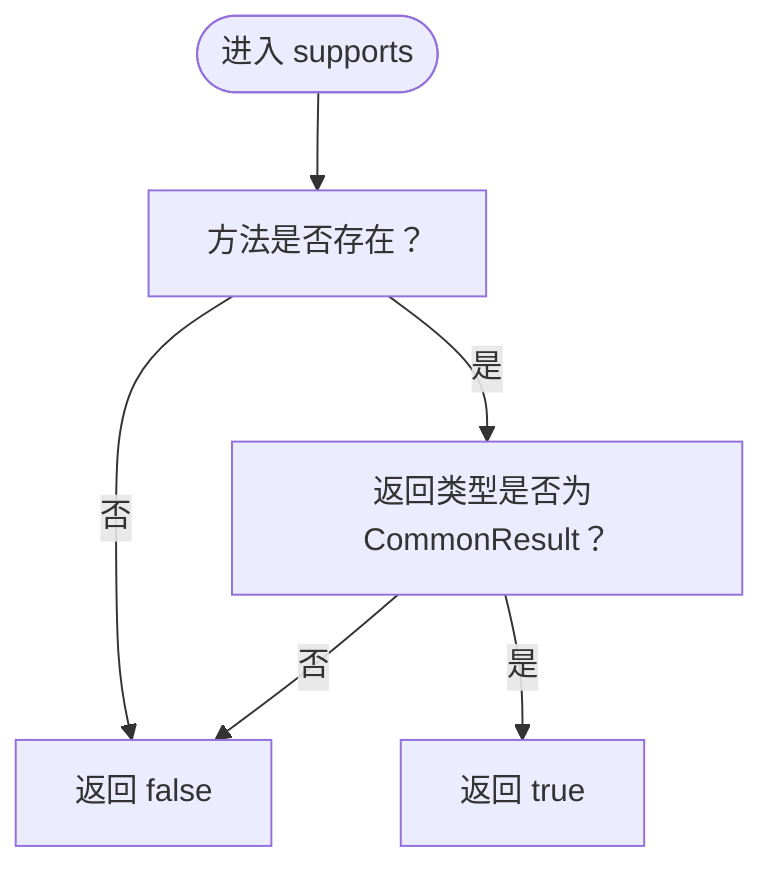
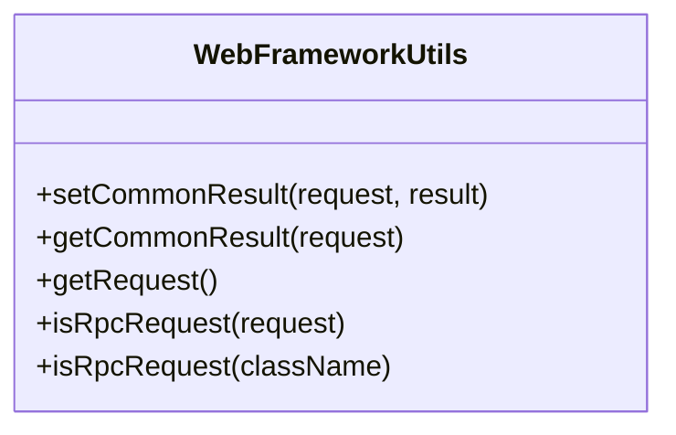
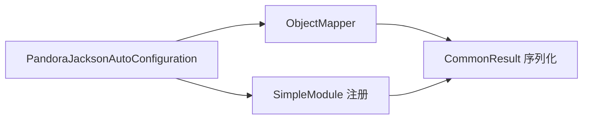
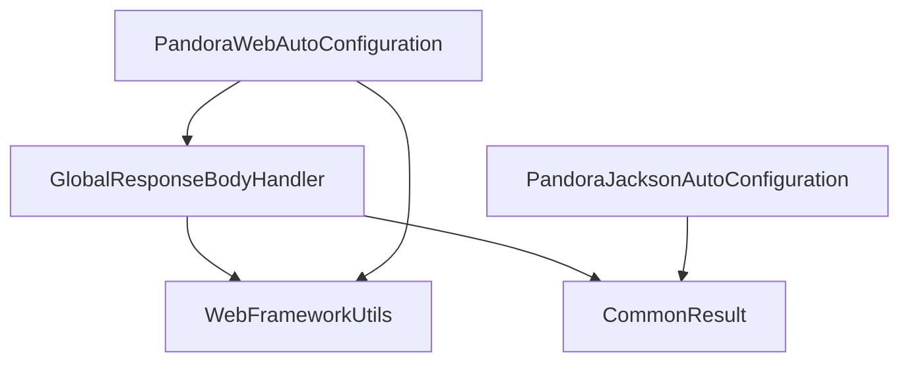

# 统一响应包装

<cite>
**本文引用的文件**
- [CommonResult.java](file://pandora-framework/pandora-common/src/main/java/net/ittimeline/pandora/framework/common/pojo/CommonResult.java)
- [GlobalResponseBodyHandler.java](file://pandora-framework/pandora-spring-boot-starter-web/src/main/java/net/ittimeline/pandora/framework/web/core/handler/GlobalResponseBodyHandler.java)
- [WebFrameworkUtils.java](file://pandora-framework/pandora-spring-boot-starter-web/src/main/java/net/ittimeline/pandora/framework/web/core/util/WebFrameworkUtils.java)
- [PandoraJacksonAutoConfiguration.java](file://pandora-framework/pandora-spring-boot-starter-web/src/main/java/net/ittimeline/pandora/framework/jackson/config/PandoraJacksonAutoConfiguration.java)
- [PandoraWebAutoConfiguration.java](file://pandora-framework/pandora-spring-boot-starter-web/src/main/java/net/ittimeline/pandora/framework/web/config/PandoraWebAutoConfiguration.java)
- [PageResult.java](file://pandora-framework/pandora-common/src/main/java/net/ittimeline/pandora/framework/common/pojo/PageResult.java)
- [PageParam.java](file://pandora-framework/pandora-common/src/main/java/net/ittimeline/pandora/framework/common/pojo/PageParam.java)
</cite>

## 目录
1. [简介](#简介)
2. [项目结构](#项目结构)
3. [核心组件](#核心组件)
4. [架构总览](#架构总览)
5. [组件详解](#组件详解)
6. [依赖关系分析](#依赖关系分析)
7. [性能与序列化特性](#性能与序列化特性)
8. [使用示例与最佳实践](#使用示例与最佳实践)
9. [故障排查指南](#故障排查指南)
10. [结论](#结论)

## 简介
本文件系统性阐述“统一响应包装”机制，重点围绕以下目标展开：
- 解释控制器返回值如何被拦截与处理
- 说明如何将业务对象包装为统一的 CommonResult 格式
- 介绍成功与失败响应的结构差异
- 详述 GlobalResponseBodyHandler 的工作原理与职责边界
- 说明泛型支持与 Jackson 序列化配置
- 提供在控制器中直接返回业务对象而不手动包装的使用范式

## 项目结构
围绕统一响应包装的关键模块分布如下：
- pandora-common：定义通用响应模型与分页模型
- pandora-spring-boot-starter-web：提供 Web 自动装配、全局响应处理与 Jackson 配置

图表来源
- [CommonResult.java:21-122](file://pandora-framework/pandora-common/src/main/java/net/ittimeline/pandora/framework/common/pojo/CommonResult.java#L21-L122)
- [GlobalResponseBodyHandler.java:25-46](file://pandora-framework/pandora-spring-boot-starter-web/src/main/java/net/ittimeline/pandora/framework/web/core/handler/GlobalResponseBodyHandler.java#L25-L46)
- [WebFrameworkUtils.java:22-181](file://pandora-framework/pandora-spring-boot-starter-web/src/main/java/net/ittimeline/pandora/framework/web/core/util/WebFrameworkUtils.java#L22-L181)
- [PandoraJacksonAutoConfiguration.java:30-83](file://pandora-framework/pandora-spring-boot-starter-web/src/main/java/net/ittimeline/pandora/framework/jackson/config/PandoraJacksonAutoConfiguration.java#L30-L83)
- [PandoraWebAutoConfiguration.java:47-109](file://pandora-framework/pandora-spring-boot-starter-web/src/main/java/net/ittimeline/pandora/framework/web/config/PandoraWebAutoConfiguration.java#L47-L109)

章节来源
- [PandoraWebAutoConfiguration.java:47-109](file://pandora-framework/pandora-spring-boot-starter-web/src/main/java/net/ittimeline/pandora/framework/web/config/PandoraWebAutoConfiguration.java#L47-L109)
- [PandoraJacksonAutoConfiguration.java:30-83](file://pandora-framework/pandora-spring-boot-starter-web/src/main/java/net/ittimeline/pandora/framework/jackson/config/PandoraJacksonAutoConfiguration.java#L30-L83)

## 核心组件
- CommonResult<T>：统一响应载体，包含 code、msg、data 三要素；提供 success/error 工厂方法与异常检查能力
- GlobalResponseBodyHandler：实现 ResponseBodyAdvice，用于拦截返回类型为 CommonResult 的响应，便于后续日志等处理
- WebFrameworkUtils：提供请求上下文读写、登录用户信息、RPC 判定等工具方法
- PandoraJacksonAutoConfiguration：定制 Jackson 序列化器，确保时间类型与长整型数值序列化行为一致
- PageResult<T> 与 PageParam：分页模型与分页参数

章节来源
- [CommonResult.java:21-122](file://pandora-framework/pandora-common/src/main/java/net/ittimeline/pandora/framework/common/pojo/CommonResult.java#L21-L122)
- [GlobalResponseBodyHandler.java:25-46](file://pandora-framework/pandora-spring-boot-starter-web/src/main/java/net/ittimeline/pandora/framework/web/core/handler/GlobalResponseBodyHandler.java#L25-L46)
- [WebFrameworkUtils.java:22-181](file://pandora-framework/pandora-spring-boot-starter-web/src/main/java/net/ittimeline/pandora/framework/web/core/util/WebFrameworkUtils.java#L22-L181)
- [PandoraJacksonAutoConfiguration.java:30-83](file://pandora-framework/pandora-spring-boot-starter-web/src/main/java/net/ittimeline/pandora/framework/jackson/config/PandoraJacksonAutoConfiguration.java#L30-L83)
- [PageResult.java:17-48](file://pandora-framework/pandora-common/src/main/java/net/ittimeline/pandora/framework/common/pojo/PageResult.java#L17-L48)
- [PageParam.java:18-42](file://pandora-framework/pandora-common/src/main/java/net/ittimeline/pandora/framework/common/pojo/PageParam.java#L18-L42)

## 架构总览
统一响应包装的整体流程如下：
- 控制器返回业务对象或 CommonResult
- 若返回类型为 CommonResult，由 GlobalResponseBodyHandler 拦截并记录响应结果
- 使用方通过 WebFrameworkUtils 获取已拦截的 CommonResult，用于日志、审计等
- Jackson 序列化遵循 PandoraJacksonAutoConfiguration 的定制策略

图表来源
- [GlobalResponseBodyHandler.java:27-44](file://pandora-framework/pandora-spring-boot-starter-web/src/main/java/net/ittimeline/pandora/framework/web/core/handler/GlobalResponseBodyHandler.java#L27-L44)
- [WebFrameworkUtils.java:141-147](file://pandora-framework/pandora-spring-boot-starter-web/src/main/java/net/ittimeline/pandora/framework/web/core/util/WebFrameworkUtils.java#L141-L147)

## 组件详解

### CommonResult<T>：统一响应模型
- 字段
  - code：错误码，成功通常为固定的成功码
  - msg：提示信息，用户可读
  - data：泛型数据体
- 关键能力
  - success(data)：构造成功响应
  - error(...)：多种重载构造失败响应
  - isSuccess/isError：判断响应状态（Jackson 序列化时忽略）
  - checkError/getCheckedData：将响应转为异常或安全取出 data
- 泛型支持
  - 支持任意类型 data，便于在控制器直接返回业务对象
  - 通过工厂方法统一包装为 CommonResult<T>

图表来源
- [CommonResult.java:21-122](file://pandora-framework/pandora-common/src/main/java/net/ittimeline/pandora/framework/common/pojo/CommonResult.java#L21-L122)

章节来源
- [CommonResult.java:21-122](file://pandora-framework/pandora-common/src/main/java/net/ittimeline/pandora/framework/common/pojo/CommonResult.java#L21-L122)

### GlobalResponseBodyHandler：响应拦截与透传
- 职责
  - 作为 ResponseBodyAdvice，仅对返回类型为 CommonResult 的方法进行拦截
  - 在 beforeBodyWrite 中将 CommonResult 写入请求属性，供后续组件读取
  - 不改变响应体内容，保持控制器返回的原始结构
- 拦截逻辑
  - supports：根据返回方法的返回类型判断是否为 CommonResult
  - beforeBodyWrite：将 CommonResult 写入请求属性并返回原 body

图表来源
- [GlobalResponseBodyHandler.java:29-35](file://pandora-framework/pandora-spring-boot-starter-web/src/main/java/net/ittimeline/pandora/framework/web/core/handler/GlobalResponseBodyHandler.java#L29-L35)

章节来源
- [GlobalResponseBodyHandler.java:25-46](file://pandora-framework/pandora-spring-boot-starter-web/src/main/java/net/ittimeline/pandora/framework/web/core/handler/GlobalResponseBodyHandler.java#L25-L46)

### WebFrameworkUtils：请求上下文与响应读取
- 主要功能
  - setCommonResult/getCommonResult：在请求属性中存取 CommonResult
  - 登录用户信息、终端类型、租户信息等读取
  - 判断 RPC 请求、获取当前 HttpServletRequest
- 与 GlobalResponseBodyHandler 的协作
  - 在拦截阶段写入 CommonResult，后续日志组件可读取

图表来源
- [WebFrameworkUtils.java:141-147](file://pandora-framework/pandora-spring-boot-starter-web/src/main/java/net/ittimeline/pandora/framework/web/core/util/WebFrameworkUtils.java#L141-L147)

章节来源
- [WebFrameworkUtils.java:22-181](file://pandora-framework/pandora-spring-boot-starter-web/src/main/java/net/ittimeline/pandora/framework/web/core/util/WebFrameworkUtils.java#L22-L181)

### Jackson 集成与序列化配置
- 定制点
  - Long/long 序列化为数字，避免前端精度丢失
  - LocalDate/LocalTime/LocalDateTime 的序列化与反序列化
  - 通过 Module 与 Builder 两种方式注册
- 与统一响应的关系
  - CommonResult 中的字段遵循 Jackson 配置进行序列化输出

图表来源
- [PandoraJacksonAutoConfiguration.java:36-81](file://pandora-framework/pandora-spring-boot-starter-web/src/main/java/net/ittimeline/pandora/framework/jackson/config/PandoraJacksonAutoConfiguration.java#L36-L81)
- [CommonResult.java:86-94](file://pandora-framework/pandora-common/src/main/java/net/ittimeline/pandora/framework/common/pojo/CommonResult.java#L86-L94)

章节来源
- [PandoraJacksonAutoConfiguration.java:30-83](file://pandora-framework/pandora-spring-boot-starter-web/src/main/java/net/ittimeline/pandora/framework/jackson/config/PandoraJacksonAutoConfiguration.java#L30-L83)
- [CommonResult.java:86-94](file://pandora-framework/pandora-common/src/main/java/net/ittimeline/pandora/framework/common/pojo/CommonResult.java#L86-L94)

### 分页模型：PageResult 与 PageParam
- PageResult<T>：封装 total 与 list，适配分页查询统一返回
- PageParam：提供默认页码与页大小，并限制最大页大小
- 与统一响应的结合
  - 控制器可直接返回 PageResult<T>，由 Jackson 序列化输出

章节来源
- [PageResult.java:17-48](file://pandora-framework/pandora-common/src/main/java/net/ittimeline/pandora/framework/common/pojo/PageResult.java#L17-L48)
- [PageParam.java:18-42](file://pandora-framework/pandora-common/src/main/java/net/ittimeline/pandora/framework/common/pojo/PageParam.java#L18-L42)

## 依赖关系分析
- 组件耦合
  - GlobalResponseBodyHandler 依赖 WebFrameworkUtils 存取 CommonResult
  - CommonResult 与 Jackson 配置解耦，通过 Jackson 定制实现序列化一致性
  - Web 自动装配负责注册拦截器与工具类
- 外部依赖
  - Spring MVC ResponseBodyAdvice 机制
  - Jackson ObjectMapper 与 Module

图表来源
- [GlobalResponseBodyHandler.java:25-46](file://pandora-framework/pandora-spring-boot-starter-web/src/main/java/net/ittimeline/pandora/framework/web/core/handler/GlobalResponseBodyHandler.java#L25-L46)
- [WebFrameworkUtils.java:141-147](file://pandora-framework/pandora-spring-boot-starter-web/src/main/java/net/ittimeline/pandora/framework/web/core/util/WebFrameworkUtils.java#L141-L147)
- [PandoraJacksonAutoConfiguration.java:30-83](file://pandora-framework/pandora-spring-boot-starter-web/src/main/java/net/ittimeline/pandora/framework/jackson/config/PandoraJacksonAutoConfiguration.java#L30-L83)
- [PandoraWebAutoConfiguration.java:47-109](file://pandora-framework/pandora-spring-boot-starter-web/src/main/java/net/ittimeline/pandora/framework/web/config/PandoraWebAutoConfiguration.java#L47-L109)

章节来源
- [PandoraWebAutoConfiguration.java:47-109](file://pandora-framework/pandora-spring-boot-starter-web/src/main/java/net/ittimeline/pandora/framework/web/config/PandoraWebAutoConfiguration.java#L47-L109)

## 性能与序列化特性
- 性能考量
  - GlobalResponseBodyHandler 仅在返回类型为 CommonResult 时介入，避免对非统一响应路径产生额外开销
  - Jackson 定制采用模块化注册，减少反射与动态类型判定成本
- 序列化行为
  - Long/long 统一序列化为数字，避免精度问题
  - 时间类型序列化为可读格式，保证前后端一致性

章节来源
- [GlobalResponseBodyHandler.java:29-35](file://pandora-framework/pandora-spring-boot-starter-web/src/main/java/net/ittimeline/pandora/framework/web/core/handler/GlobalResponseBodyHandler.java#L29-L35)
- [PandoraJacksonAutoConfiguration.java:36-81](file://pandora-framework/pandora-spring-boot-starter-web/src/main/java/net/ittimeline/pandora/framework/jackson/config/PandoraJacksonAutoConfiguration.java#L36-L81)

## 使用示例与最佳实践

### 控制器直接返回业务对象（无需手动包装）
- 场景
  - 控制器返回业务对象或分页结果
  - 由上层统一包装为 CommonResult<T>（此处指框架拦截与日志记录，实际包装通常在服务层或统一入口完成）
- 示例路径
  - 控制器返回业务对象：[示例路径:39-43](file://pandora-framework/pandora-spring-boot-starter-web/src/main/java/net/ittimeline/pandora/framework/web/core/handler/GlobalResponseBodyHandler.java#L39-L43)
  - 日志读取 CommonResult：[示例路径:141-147](file://pandora-framework/pandora-spring-boot-starter-web/src/main/java/net/ittimeline/pandora/framework/web/core/util/WebFrameworkUtils.java#L141-L147)

### 成功与失败响应格式
- 成功响应
  - code：成功码
  - msg：空字符串或空提示
  - data：业务数据
- 失败响应
  - code：错误码
  - msg：错误描述
  - data：通常为空

章节来源
- [CommonResult.java:74-80](file://pandora-framework/pandora-common/src/main/java/net/ittimeline/pandora/framework/common/pojo/CommonResult.java#L74-L80)
- [CommonResult.java:54-72](file://pandora-framework/pandora-common/src/main/java/net/ittimeline/pandora/framework/common/pojo/CommonResult.java#L54-L72)

### 泛型支持与序列化
- 泛型
  - CommonResult<T> 支持任意数据类型，便于在控制器直接返回业务对象
- 序列化
  - Jackson 定制确保 long、日期时间类型序列化一致

章节来源
- [CommonResult.java:21-39](file://pandora-framework/pandora-common/src/main/java/net/ittimeline/pandora/framework/common/pojo/CommonResult.java#L21-L39)
- [PandoraJacksonAutoConfiguration.java:36-81](file://pandora-framework/pandora-spring-boot-starter-web/src/main/java/net/ittimeline/pandora/framework/jackson/config/PandoraJacksonAutoConfiguration.java#L36-L81)

## 故障排查指南
- 返回未被拦截
  - 检查返回类型是否为 CommonResult
  - 参考：[supports 判断逻辑:29-35](file://pandora-framework/pandora-spring-boot-starter-web/src/main/java/net/ittimeline/pandora/framework/web/core/handler/GlobalResponseBodyHandler.java#L29-L35)
- 日志未记录
  - 确认在 beforeBodyWrite 中已 setCommonResult
  - 参考：[setCommonResult 调用:40-43](file://pandora-framework/pandora-spring-boot-starter-web/src/main/java/net/ittimeline/pandora/framework/web/core/handler/GlobalResponseBodyHandler.java#L40-L43)
  - 读取 CommonResult：[getCommonResult:145-147](file://pandora-framework/pandora-spring-boot-starter-web/src/main/java/net/ittimeline/pandora/framework/web/core/util/WebFrameworkUtils.java#L145-L147)
- 响应格式异常
  - 检查 Jackson 定制是否生效
  - 参考：[Jackson 定制注册:36-81](file://pandora-framework/pandora-spring-boot-starter-web/src/main/java/net/ittimeline/pandora/framework/jackson/config/PandoraJacksonAutoConfiguration.java#L36-L81)

章节来源
- [GlobalResponseBodyHandler.java:29-43](file://pandora-framework/pandora-spring-boot-starter-web/src/main/java/net/ittimeline/pandora/framework/web/core/handler/GlobalResponseBodyHandler.java#L29-L43)
- [WebFrameworkUtils.java:141-147](file://pandora-framework/pandora-spring-boot-starter-web/src/main/java/net/ittimeline/pandora/framework/web/core/util/WebFrameworkUtils.java#L141-L147)
- [PandoraJacksonAutoConfiguration.java:36-81](file://pandora-framework/pandora-spring-boot-starter-web/src/main/java/net/ittimeline/pandora/framework/jackson/config/PandoraJacksonAutoConfiguration.java#L36-L81)

## 结论
- 本框架通过 GlobalResponseBodyHandler 与 WebFrameworkUtils 实现了对统一响应的“只记录、不篡改”的拦截策略
- CommonResult 提供了强类型、可扩展的统一响应模型，并与 Jackson 定制协同保证序列化一致性
- 控制器可直接返回业务对象，配合服务层或统一入口完成包装，简化开发并提升一致性