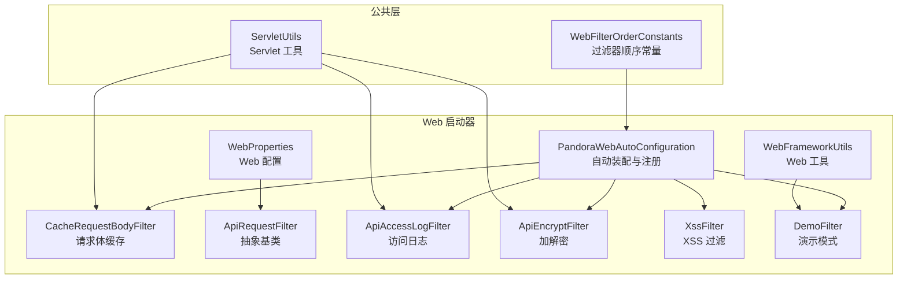
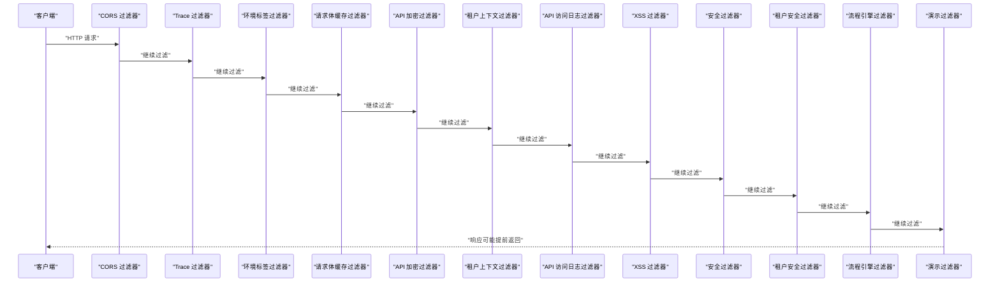
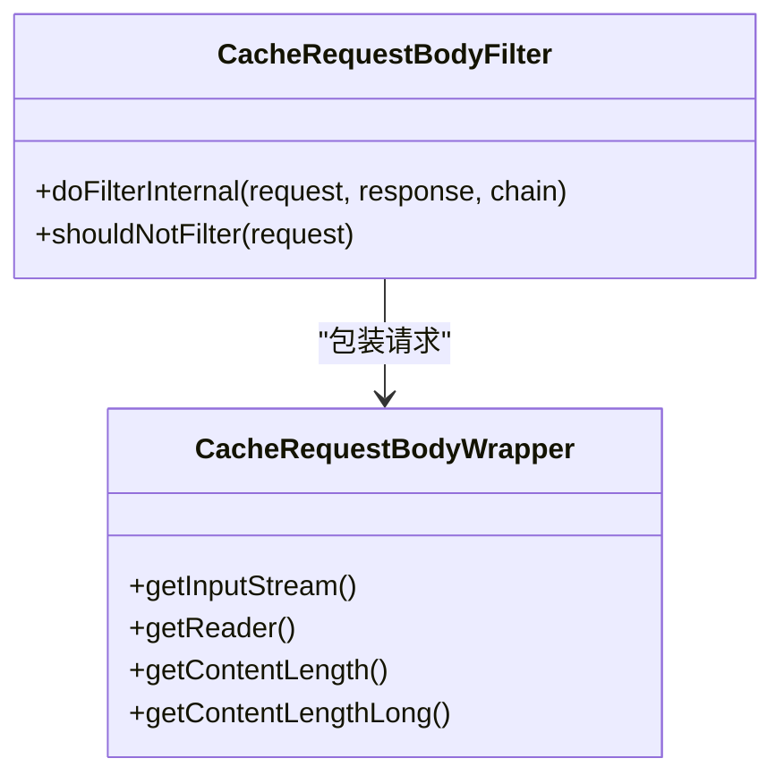
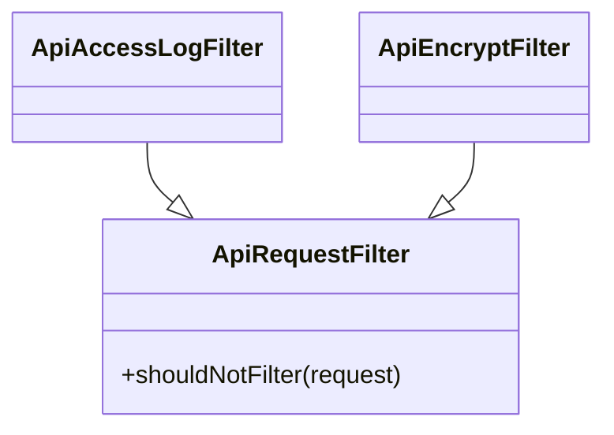
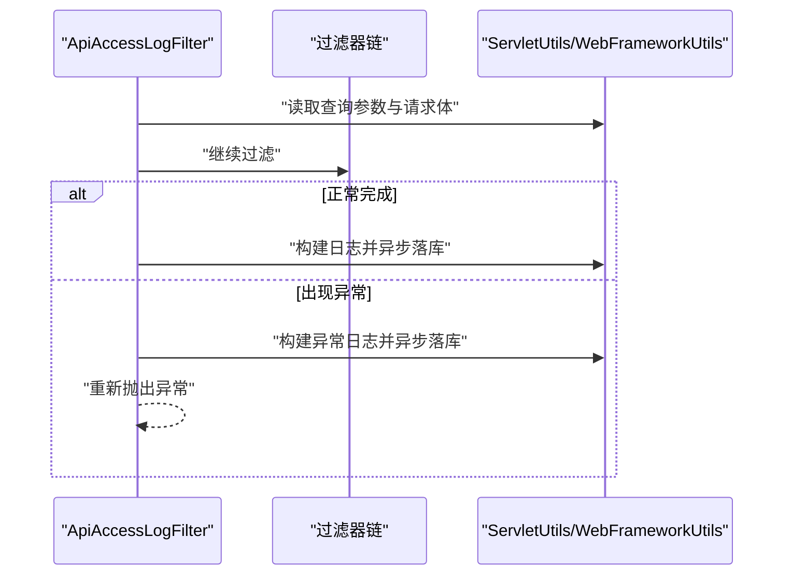
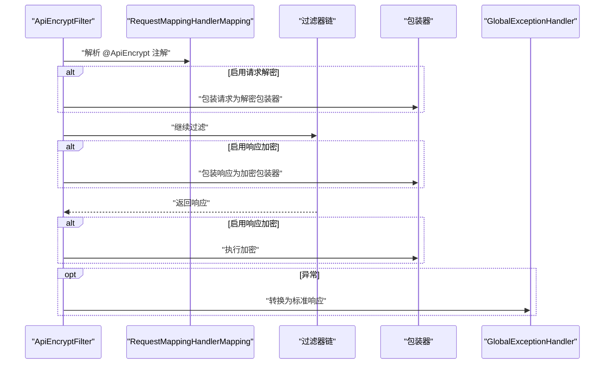

# 请求过滤器链

<cite>
**本文引用的文件**
- [WebFilterOrderConstants.java](file://pandora-framework/pandora-common/src/main/java/net/ittimeline/pandora/framework/common/constants/WebFilterOrderConstants.java)
- [PandoraWebAutoConfiguration.java](file://pandora-framework/pandora-spring-boot-starter-web/src/main/java/net/ittimeline/pandora/framework/web/config/PandoraWebAutoConfiguration.java)
- [CacheRequestBodyFilter.java](file://pandora-framework/pandora-spring-boot-starter-web/src/main/java/net/ittimeline/pandora/framework/web/core/filter/CacheRequestBodyFilter.java)
- [CacheRequestBodyWrapper.java](file://pandora-framework/pandora-spring-boot-starter-web/src/main/java/net/ittimeline/pandora/framework/web/core/filter/CacheRequestBodyWrapper.java)
- [ApiRequestFilter.java](file://pandora-framework/pandora-spring-boot-starter-web/src/main/java/net/ittimeline/pandora/framework/web/core/filter/ApiRequestFilter.java)
- [ApiAccessLogFilter.java](file://pandora-framework/pandora-spring-boot-starter-web/src/main/java/net/ittimeline/pandora/framework/apilog/core/filter/ApiAccessLogFilter.java)
- [ApiEncryptFilter.java](file://pandora-framework/pandora-spring-boot-starter-web/src/main/java/net/ittimeline/pandora/framework/encrypt/core/filter/ApiEncryptFilter.java)
- [XssFilter.java](file://pandora-framework/pandora-spring-boot-starter-web/src/main/java/net/ittimeline/pandora/framework/xss/core/filter/XssFilter.java)
- [DemoFilter.java](file://pandora-framework/pandora-spring-boot-starter-web/src/main/java/net/ittimeline/pandora/framework/web/core/filter/DemoFilter.java)
- [WebProperties.java](file://pandora-framework/pandora-spring-boot-starter-web/src/main/java/net/ittimeline/pandora/framework/web/config/WebProperties.java)
- [WebFrameworkUtils.java](file://pandora-framework/pandora-spring-boot-starter-web/src/main/java/net/ittimeline/pandora/framework/web/core/util/WebFrameworkUtils.java)
- [ServletUtils.java](file://pandora-framework/pandora-common/src/main/java/net/ittimeline/pandora/framework/common/util/web/servlet/ServletUtils.java)
</cite>

## 目录
1. [简介](#简介)
2. [项目结构](#项目结构)
3. [核心组件](#核心组件)
4. [架构总览](#架构总览)
5. [组件详解](#组件详解)
6. [依赖关系分析](#依赖关系分析)
7. [性能考量](#性能考量)
8. [故障排查指南](#故障排查指南)
9. [结论](#结论)
10. [附录](#附录)

## 简介
本文件系统性梳理请求过滤器链的设计与实现，重点覆盖以下方面：
- 过滤器链的整体架构与执行顺序
- CacheRequestBodyFilter 的可重复读取请求体实现原理与适用场景
- ApiRequestFilter 抽象基类及派生过滤器（如 ApiAccessLogFilter、ApiEncryptFilter）的作用与实现要点
- 过滤器注册机制与优先级设置（基于 WebFilterOrderConstants）
- 如何添加自定义过滤器、调整执行顺序、处理过滤器异常
- 配置示例与最佳实践

## 项目结构
围绕 Web 过滤器链的相关代码主要分布在以下模块与包中：
- common 模块：提供通用常量与工具，如 WebFilterOrderConstants、ServletUtils
- web starter 模块：提供 Web 自动装配、全局异常与响应处理器、核心过滤器（CacheRequestBodyFilter、ApiRequestFilter 及其派生）、XssFilter、DemoFilter 等
- apilog starter 模块：提供 API 访问日志过滤器 ApiAccessLogFilter
- encrypt starter 模块：提供 API 加解密过滤器 ApiEncryptFilter
- xss starter 模块：提供 XSS 过滤器 XssFilter

图表来源
- [WebFilterOrderConstants.java:11-37](file://pandora-framework/pandora-common/src/main/java/net/ittimeline/pandora/framework/common/constants/WebFilterOrderConstants.java#L11-L37)
- [PandoraWebAutoConfiguration.java:116-152](file://pandora-framework/pandora-spring-boot-starter-web/src/main/java/net/ittimeline/pandora/framework/web/config/PandoraWebAutoConfiguration.java#L116-L152)
- [CacheRequestBodyFilter.java:20-48](file://pandora-framework/pandora-spring-boot-starter-web/src/main/java/net/ittimeline/pandora/framework/web/core/filter/CacheRequestBodyFilter.java#L20-L48)
- [ApiRequestFilter.java:15-26](file://pandora-framework/pandora-spring-boot-starter-web/src/main/java/net/ittimeline/pandora/framework/web/core/filter/ApiRequestFilter.java#L15-L26)
- [ApiAccessLogFilter.java:52-86](file://pandora-framework/pandora-spring-boot-starter-web/src/main/java/net/ittimeline/pandora/framework/apilog/core/filter/ApiAccessLogFilter.java#L52-L86)
- [ApiEncryptFilter.java:40-121](file://pandora-framework/pandora-spring-boot-starter-web/src/main/java/net/ittimeline/pandora/framework/encrypt/core/filter/ApiEncryptFilter.java#L40-L121)
- [XssFilter.java:23-54](file://pandora-framework/pandora-spring-boot-starter-web/src/main/java/net/ittimeline/pandora/framework/xss/core/filter/XssFilter.java#L23-L54)
- [DemoFilter.java:21-36](file://pandora-framework/pandora-spring-boot-starter-web/src/main/java/net/ittimeline/pandora/framework/web/core/filter/DemoFilter.java#L21-L36)
- [WebProperties.java:21-67](file://pandora-framework/pandora-spring-boot-starter-web/src/main/java/net/ittimeline/pandora/framework/web/config/WebProperties.java#L21-L67)
- [WebFrameworkUtils.java:22-181](file://pandora-framework/pandora-spring-boot-starter-web/src/main/java/net/ittimeline/pandora/framework/web/core/util/WebFrameworkUtils.java#L22-L181)
- [ServletUtils.java:22-104](file://pandora-framework/pandora-common/src/main/java/net/ittimeline/pandora/framework/common/util/web/servlet/ServletUtils.java#L22-L104)

章节来源
- [PandoraWebAutoConfiguration.java:43-176](file://pandora-framework/pandora-spring-boot-starter-web/src/main/java/net/ittimeline/pandora/framework/web/config/PandoraWebAutoConfiguration.java#L43-L176)
- [WebFilterOrderConstants.java:11-37](file://pandora-framework/pandora-common/src/main/java/net/ittimeline/pandora/framework/common/constants/WebFilterOrderConstants.java#L11-L37)

## 核心组件
- WebFilterOrderConstants：定义所有内置过滤器的执行顺序常量，确保跨模块的一致性与可预期性
- PandoraWebAutoConfiguration：负责注册各类过滤器 Bean，并通过 FilterRegistrationBean 设置优先级
- CacheRequestBodyFilter：对 JSON 请求进行请求体缓存，实现可重复读取，为后续过滤器（如日志、加解密、XSS）提供基础能力
- ApiRequestFilter：抽象基类，按 WebProperties 配置的 API 前缀决定是否对请求进行过滤
- ApiAccessLogFilter：继承 ApiRequestFilter，负责记录 API 访问日志，含参数脱敏与异步落库
- ApiEncryptFilter：继承 ApiRequestFilter，按注解开关与算法配置对请求/响应进行加解密
- XssFilter：对请求参数进行 XSS 清洗，支持路径白名单与开关控制
- DemoFilter：演示模式下拦截写操作请求，避免误操作影响测试数据
- WebProperties：统一管理 API 前缀、UI 地址等 Web 配置
- WebFrameworkUtils：提供登录用户信息、终端类型、RPC 判定等 Web 相关工具
- ServletUtils：提供 JSON 判定、请求体读取、参数与头部获取等 Servlet 工具方法

章节来源
- [WebFilterOrderConstants.java:11-37](file://pandora-framework/pandora-common/src/main/java/net/ittimeline/pandora/framework/common/constants/WebFilterOrderConstants.java#L11-L37)
- [PandoraWebAutoConfiguration.java:116-152](file://pandora-framework/pandora-spring-boot-starter-web/src/main/java/net/ittimeline/pandora/framework/web/config/PandoraWebAutoConfiguration.java#L116-L152)
- [CacheRequestBodyFilter.java:20-48](file://pandora-framework/pandora-spring-boot-starter-web/src/main/java/net/ittimeline/pandora/framework/web/core/filter/CacheRequestBodyFilter.java#L20-L48)
- [ApiRequestFilter.java:15-26](file://pandora-framework/pandora-spring-boot-starter-web/src/main/java/net/ittimeline/pandora/framework/web/core/filter/ApiRequestFilter.java#L15-L26)
- [ApiAccessLogFilter.java:52-86](file://pandora-framework/pandora-spring-boot-starter-web/src/main/java/net/ittimeline/pandora/framework/apilog/core/filter/ApiAccessLogFilter.java#L52-L86)
- [ApiEncryptFilter.java:40-121](file://pandora-framework/pandora-spring-boot-starter-web/src/main/java/net/ittimeline/pandora/framework/encrypt/core/filter/ApiEncryptFilter.java#L40-L121)
- [XssFilter.java:23-54](file://pandora-framework/pandora-spring-boot-starter-web/src/main/java/net/ittimeline/pandora/framework/xss/core/filter/XssFilter.java#L23-L54)
- [DemoFilter.java:21-36](file://pandora-framework/pandora-spring-boot-starter-web/src/main/java/net/ittimeline/pandora/framework/web/core/filter/DemoFilter.java#L21-L36)
- [WebProperties.java:21-67](file://pandora-framework/pandora-spring-boot-starter-web/src/main/java/net/ittimeline/pandora/framework/web/config/WebProperties.java#L21-L67)
- [WebFrameworkUtils.java:22-181](file://pandora-framework/pandora-spring-boot-starter-web/src/main/java/net/ittimeline/pandora/framework/web/core/util/WebFrameworkUtils.java#L22-L181)
- [ServletUtils.java:22-104](file://pandora-framework/pandora-common/src/main/java/net/ittimeline/pandora/framework/common/util/web/servlet/ServletUtils.java#L22-L104)

## 架构总览
请求在进入控制器之前，会依次经过多个过滤器。下图展示了关键过滤器的执行顺序与职责边界。

图表来源
- [WebFilterOrderConstants.java:12-36](file://pandora-framework/pandora-common/src/main/java/net/ittimeline/pandora/framework/common/constants/WebFilterOrderConstants.java#L12-L36)
- [PandoraWebAutoConfiguration.java:116-152](file://pandora-framework/pandora-spring-boot-starter-web/src/main/java/net/ittimeline/pandora/framework/web/config/PandoraWebAutoConfiguration.java#L116-L152)

## 组件详解

### CacheRequestBodyFilter：可重复读取请求体
- 作用
  - 对 JSON 请求进行请求体缓存，使后续过滤器可多次读取请求体
  - 排除特定路径（如监控与运维相关路径），避免不必要的开销
- 实现原理
  - 在 doFilterInternal 中将原始请求包装为 CacheRequestBodyWrapper，一次性读取并缓存请求体字节
  - 通过重写 getInputStream/getReader，返回可重复读取的输入流与字符流
  - shouldNotFilter 限制仅对 JSON 请求生效，减少非必要处理
- 适用场景
  - 需要在多个过滤器中读取同一份请求体（如日志、加解密、XSS 清洗）
  - 需要对请求体进行二次解析或脱敏

图表来源
- [CacheRequestBodyFilter.java:20-48](file://pandora-framework/pandora-spring-boot-starter-web/src/main/java/net/ittimeline/pandora/framework/web/core/filter/CacheRequestBodyFilter.java#L20-L48)
- [CacheRequestBodyWrapper.java:20-79](file://pandora-framework/pandora-spring-boot-starter-web/src/main/java/net/ittimeline/pandora/framework/web/core/filter/CacheRequestBodyWrapper.java#L20-L79)

章节来源
- [CacheRequestBodyFilter.java:20-48](file://pandora-framework/pandora-spring-boot-starter-web/src/main/java/net/ittimeline/pandora/framework/web/core/filter/CacheRequestBodyFilter.java#L20-L48)
- [CacheRequestBodyWrapper.java:20-79](file://pandora-framework/pandora-spring-boot-starter-web/src/main/java/net/ittimeline/pandora/framework/web/core/filter/CacheRequestBodyWrapper.java#L20-L79)
- [ServletUtils.java:77-91](file://pandora-framework/pandora-common/src/main/java/net/ittimeline/pandora/framework/common/util/web/servlet/ServletUtils.java#L77-L91)

### ApiRequestFilter：API 请求过滤基类
- 作用
  - 通过 WebProperties 中的 API 前缀（如 /admin-api、/app-api）判断是否对请求进行过滤
  - 作为 ApiAccessLogFilter、ApiEncryptFilter 等的父类，统一过滤入口
- 实现要点
  - shouldNotFilter 基于请求 URI 与上下文路径计算相对路径，再与配置的前缀进行匹配
  - 子类可复用该逻辑，避免重复实现

图表来源
- [ApiRequestFilter.java:15-26](file://pandora-framework/pandora-spring-boot-starter-web/src/main/java/net/ittimeline/pandora/framework/web/core/filter/ApiRequestFilter.java#L15-L26)
- [ApiAccessLogFilter.java:52-64](file://pandora-framework/pandora-spring-boot-starter-web/src/main/java/net/ittimeline/pandora/framework/apilog/core/filter/ApiAccessLogFilter.java#L52-L64)
- [ApiEncryptFilter.java:40-59](file://pandora-framework/pandora-spring-boot-starter-web/src/main/java/net/ittimeline/pandora/framework/encrypt/core/filter/ApiEncryptFilter.java#L40-L59)

章节来源
- [ApiRequestFilter.java:15-26](file://pandora-framework/pandora-spring-boot-starter-web/src/main/java/net/ittimeline/pandora/framework/web/core/filter/ApiRequestFilter.java#L15-L26)
- [WebProperties.java:21-25](file://pandora-framework/pandora-spring-boot-starter-web/src/main/java/net/ittimeline/pandora/framework/web/config/WebProperties.java#L21-L25)

### ApiAccessLogFilter：API 访问日志
- 作用
  - 记录 API 访问日志，包含用户信息、请求参数、响应结果、耗时、操作类型等
  - 支持注解级别的开关与字段脱敏
- 关键流程
  - 在 doFilterInternal 中先收集查询参数与请求体，再调用过滤器链
  - 正常与异常两种分支均记录日志；异常向上抛出，保持原有异常语义
  - 使用 WebFrameworkUtils 获取用户上下文，使用 ServletUtils 获取请求体与参数

图表来源
- [ApiAccessLogFilter.java:66-100](file://pandora-framework/pandora-spring-boot-starter-web/src/main/java/net/ittimeline/pandora/framework/apilog/core/filter/ApiAccessLogFilter.java#L66-L100)
- [ServletUtils.java:77-99](file://pandora-framework/pandora-common/src/main/java/net/ittimeline/pandora/framework/common/util/web/servlet/ServletUtils.java#L77-L99)
- [WebFrameworkUtils.java:89-125](file://pandora-framework/pandora-spring-boot-starter-web/src/main/java/net/ittimeline/pandora/framework/web/core/util/WebFrameworkUtils.java#L89-L125)

章节来源
- [ApiAccessLogFilter.java:52-100](file://pandora-framework/pandora-spring-boot-starter-web/src/main/java/net/ittimeline/pandora/framework/apilog/core/filter/ApiAccessLogFilter.java#L52-L100)
- [ServletUtils.java:77-99](file://pandora-framework/pandora-common/src/main/java/net/ittimeline/pandora/framework/common/util/web/servlet/ServletUtils.java#L77-L99)
- [WebFrameworkUtils.java:89-125](file://pandora-framework/pandora-spring-boot-starter-web/src/main/java/net/ittimeline/pandora/framework/web/core/util/WebFrameworkUtils.java#L89-L125)

### ApiEncryptFilter：API 加解密
- 作用
  - 按注解开关与算法配置对请求体进行解密、对响应体进行加密
  - 支持对称与非对称算法（如 AES、RSA），可通过配置切换
- 关键流程
  - 通过 RequestMappingHandlerMapping 解析注解，确定是否启用请求/响应加解密
  - 若启用请求解密，使用 ApiDecryptRequestWrapper 包装请求；若启用响应加密，使用 ApiEncryptResponseWrapper 包装响应
  - 异常通过全局异常处理器转换为标准响应格式

图表来源
- [ApiEncryptFilter.java:78-121](file://pandora-framework/pandora-spring-boot-starter-web/src/main/java/net/ittimeline/pandora/framework/encrypt/core/filter/ApiEncryptFilter.java#L78-L121)
- [ApiEncryptFilter.java:129-155](file://pandora-framework/pandora-spring-boot-starter-web/src/main/java/net/ittimeline/pandora/framework/encrypt/core/filter/ApiEncryptFilter.java#L129-L155)

章节来源
- [ApiEncryptFilter.java:40-121](file://pandora-framework/pandora-spring-boot-starter-web/src/main/java/net/ittimeline/pandora/framework/encrypt/core/filter/ApiEncryptFilter.java#L40-L121)

### XssFilter：XSS 过滤
- 作用
  - 对请求参数进行 XSS 清洗，支持开关与路径白名单
- 实现要点
  - shouldNotFilter 支持根据配置关闭或匹配白名单路径
  - 通过 XssRequestWrapper 包装请求，实现参数清洗

章节来源
- [XssFilter.java:23-54](file://pandora-framework/pandora-spring-boot-starter-web/src/main/java/net/ittimeline/pandora/framework/xss/core/filter/XssFilter.java#L23-L54)

### DemoFilter：演示模式
- 作用
  - 在演示模式下拦截写操作请求（POST/PUT/DELETE），对未登录用户直接返回拒绝结果
- 实现要点
  - 通过 WebFrameworkUtils 判断登录用户 ID，结合方法类型进行拦截

章节来源
- [DemoFilter.java:21-36](file://pandora-framework/pandora-spring-boot-starter-web/src/main/java/net/ittimeline/pandora/framework/web/core/filter/DemoFilter.java#L21-L36)
- [WebFrameworkUtils.java:89-94](file://pandora-framework/pandora-spring-boot-starter-web/src/main/java/net/ittimeline/pandora/framework/web/core/util/WebFrameworkUtils.java#L89-L94)

## 依赖关系分析
- 顺序依赖
  - CORS 过滤器需最先执行，确保跨域配置生效
  - 请求体缓存过滤器需在日志、加解密、XSS 等之前，以便这些过滤器能读取同一份请求体
  - 日志与 XSS 过滤器需在安全过滤器之前，避免被安全策略拦截或影响日志采集
- 条件注册
  - 演示过滤器仅在开启演示模式时注册
- 顺序常量
  - WebFilterOrderConstants 将各过滤器的顺序常量集中管理，避免硬编码与冲突

图表来源
- [WebFilterOrderConstants.java:12-36](file://pandora-framework/pandora-common/src/main/java/net/ittimeline/pandora/framework/common/constants/WebFilterOrderConstants.java#L12-L36)
- [PandoraWebAutoConfiguration.java:116-152](file://pandora-framework/pandora-spring-boot-starter-web/src/main/java/net/ittimeline/pandora/framework/web/config/PandoraWebAutoConfiguration.java#L116-L152)

章节来源
- [WebFilterOrderConstants.java:11-37](file://pandora-framework/pandora-common/src/main/java/net/ittimeline/pandora/framework/common/constants/WebFilterOrderConstants.java#L11-L37)
- [PandoraWebAutoConfiguration.java:116-152](file://pandora-framework/pandora-spring-boot-starter-web/src/main/java/net/ittimeline/pandora/framework/web/config/PandoraWebAutoConfiguration.java#L116-L152)

## 性能考量
- 请求体缓存
  - CacheRequestBodyWrapper 将请求体完整读入内存，适合中小型请求体；对于超大请求体，建议评估内存占用与 GC 压力
- 多次读取
  - 通过包装器实现可重复读取，避免后续过滤器重复解析带来的性能损耗
- 异步日志
  - ApiAccessLogFilter 将日志异步落库，降低对主请求路径的影响
- 白名单与开关
  - XssFilter 与演示过滤器支持路径白名单与开关，减少不必要的处理

## 故障排查指南
- 请求体为空
  - 确认请求为 JSON 类型且已通过 CacheRequestBodyFilter 包装
  - 检查 ServletUtils 的 JSON 判定与请求体读取逻辑
- 日志未记录
  - 检查 ApiAccessLogFilter 的注解开关与脱敏配置
  - 确认过滤器顺序满足“先缓存请求体、后记录日志”的约束
- 加解密异常
  - 检查 @ApiEncrypt 注解是否正确标注在控制器方法或类上
  - 确认加密算法与密钥配置一致
- XSS 未生效
  - 检查 XssFilter 的开关与白名单配置
- 演示模式误拦截
  - 确认演示模式开关与登录状态判断逻辑

章节来源
- [ServletUtils.java:77-99](file://pandora-framework/pandora-common/src/main/java/net/ittimeline/pandora/framework/common/util/web/servlet/ServletUtils.java#L77-L99)
- [ApiAccessLogFilter.java:102-162](file://pandora-framework/pandora-spring-boot-starter-web/src/main/java/net/ittimeline/pandora/framework/apilog/core/filter/ApiAccessLogFilter.java#L102-L162)
- [ApiEncryptFilter.java:129-155](file://pandora-framework/pandora-spring-boot-starter-web/src/main/java/net/ittimeline/pandora/framework/encrypt/core/filter/ApiEncryptFilter.java#L129-L155)
- [XssFilter.java:42-52](file://pandora-framework/pandora-spring-boot-starter-web/src/main/java/net/ittimeline/pandora/framework/xss/core/filter/XssFilter.java#L42-L52)
- [DemoFilter.java:23-28](file://pandora-framework/pandora-spring-boot-starter-web/src/main/java/net/ittimeline/pandora/framework/web/core/filter/DemoFilter.java#L23-L28)

## 结论
本过滤器链通过明确的顺序常量与自动装配机制，实现了跨模块一致的请求处理流程。CacheRequestBodyFilter 为后续过滤器提供了可重复读取的请求体基础；ApiRequestFilter 抽象基类统一了 API 请求的过滤入口；ApiAccessLogFilter 与 ApiEncryptFilter 分别承担日志与加解密职责；XssFilter 与 DemoFilter 提供安全与演示保障。通过合理配置与扩展，可在保证安全与可观测性的前提下，灵活满足业务需求。

## 附录

### 过滤器注册与优先级配置示例
- 注册 CORS 过滤器并设置优先级
  - 参考路径：[PandoraWebAutoConfiguration.java:116-129](file://pandora-framework/pandora-spring-boot-starter-web/src/main/java/net/ittimeline/pandora/framework/web/config/PandoraWebAutoConfiguration.java#L116-L129)
- 注册请求体缓存过滤器
  - 参考路径：[PandoraWebAutoConfiguration.java:134-137](file://pandora-framework/pandora-spring-boot-starter-web/src/main/java/net/ittimeline/pandora/framework/web/config/PandoraWebAutoConfiguration.java#L134-L137)
- 注册演示过滤器（条件注册）
  - 参考路径：[PandoraWebAutoConfiguration.java:142-146](file://pandora-framework/pandora-spring-boot-starter-web/src/main/java/net/ittimeline/pandora/framework/web/config/PandoraWebAutoConfiguration.java#L142-L146)
- 设置自定义过滤器优先级
  - 参考路径：[PandoraWebAutoConfiguration.java:148-152](file://pandora-framework/pandora-spring-boot-starter-web/src/main/java/net/ittimeline/pandora/framework/web/config/PandoraWebAutoConfiguration.java#L148-L152)

### 添加自定义过滤器步骤
- 新建过滤器类，继承 OncePerRequestFilter 或 ApiRequestFilter（如需按 API 前缀过滤）
- 在自动装配类中通过 FilterRegistrationBean 注册，并设置优先级
  - 参考路径：[PandoraWebAutoConfiguration.java:148-152](file://pandora-framework/pandora-spring-boot-starter-web/src/main/java/net/ittimeline/pandora/framework/web/config/PandoraWebAutoConfiguration.java#L148-L152)
- 在 WebFilterOrderConstants 中新增顺序常量，确保与其他过滤器不冲突
  - 参考路径：[WebFilterOrderConstants.java:11-37](file://pandora-framework/pandora-common/src/main/java/net/ittimeline/pandora/framework/common/constants/WebFilterOrderConstants.java#L11-L37)

### 调整执行顺序
- 修改 WebFilterOrderConstants 中的常量值，或调整相邻常量间距
- 更新自动装配类中 FilterRegistrationBean 的优先级设置
  - 参考路径：[PandoraWebAutoConfiguration.java:116-152](file://pandora-framework/pandora-spring-boot-starter-web/src/main/java/net/ittimeline/pandora/framework/web/config/PandoraWebAutoConfiguration.java#L116-L152)

### 处理过滤器异常
- ApiAccessLogFilter：捕获异常并记录日志后重新抛出
  - 参考路径：[ApiAccessLogFilter.java:81-85](file://pandora-framework/pandora-spring-boot-starter-web/src/main/java/net/ittimeline/pandora/framework/apilog/core/filter/ApiAccessLogFilter.java#L81-L85)
- ApiEncryptFilter：通过全局异常处理器将异常转换为标准响应
  - 参考路径：[ApiEncryptFilter.java:102-106](file://pandora-framework/pandora-spring-boot-starter-web/src/main/java/net/ittimeline/pandora/framework/encrypt/core/filter/ApiEncryptFilter.java#L102-L106)

### 可重复读取请求体的应用场景
- 多个过滤器需要读取同一份请求体（如日志、加解密、XSS）
- 需要对请求体进行二次解析或脱敏
- 通过 CacheRequestBodyWrapper 提供的包装器实现可重复读取
  - 参考路径：[CacheRequestBodyWrapper.java:20-79](file://pandora-framework/pandora-spring-boot-starter-web/src/main/java/net/ittimeline/pandora/framework/web/core/filter/CacheRequestBodyWrapper.java#L20-L79)