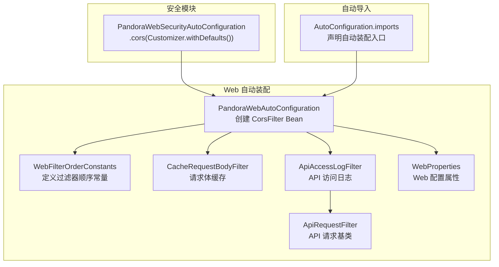
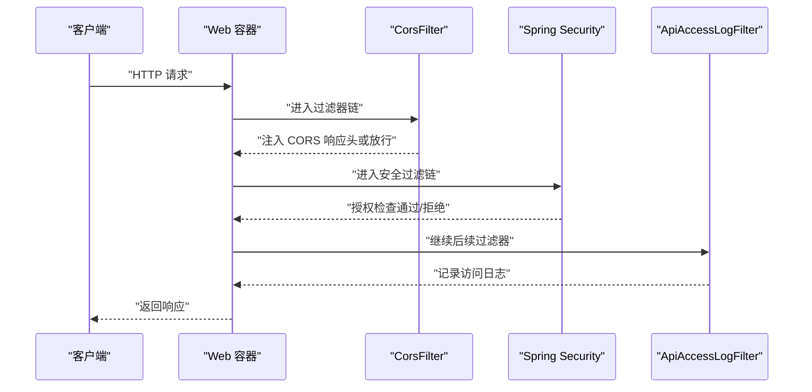
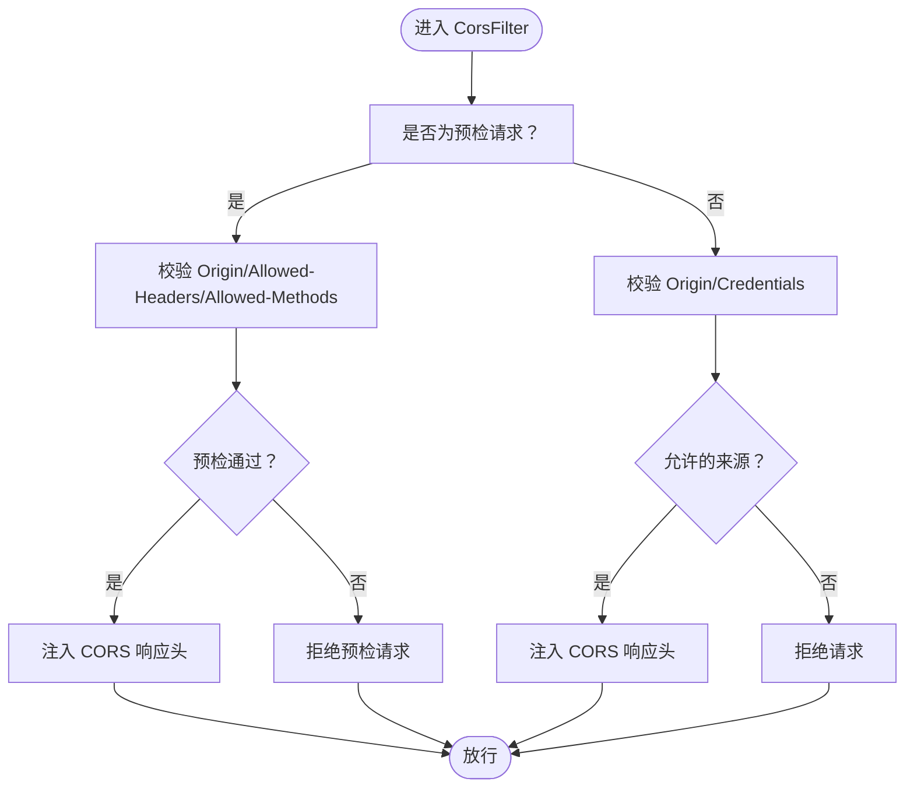
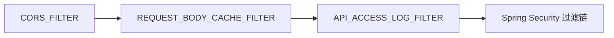
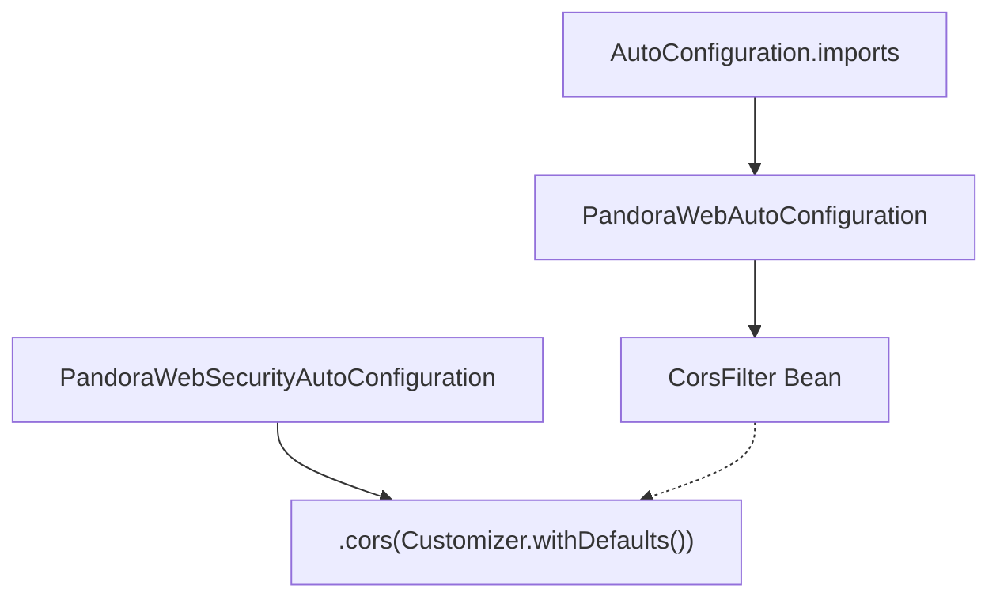

# 跨域支持

<cite>
**本文引用的文件**
- [PandoraWebAutoConfiguration.java](file://pandora-framework/pandora-spring-boot-starter-web/src/main/java/net/ittimeline/pandora/framework/web/config/PandoraWebAutoConfiguration.java)
- [WebFilterOrderConstants.java](file://pandora-framework/pandora-common/src/main/java/net/ittimeline/pandora/framework/common/constants/WebFilterOrderConstants.java)
- [CacheRequestBodyFilter.java](file://pandora-framework/pandora-spring-boot-starter-web/src/main/java/net/ittimeline/pandora/framework/web/core/filter/CacheRequestBodyFilter.java)
- [ApiAccessLogFilter.java](file://pandora-framework/pandora-spring-boot-starter-web/src/main/java/net/ittimeline/pandora/framework/apilog/core/filter/ApiAccessLogFilter.java)
- [ApiRequestFilter.java](file://pandora-framework/pandora-spring-boot-starter-web/src/main/java/net/ittimeline/pandora/framework/web/core/filter/ApiRequestFilter.java)
- [WebProperties.java](file://pandora-framework/pandora-spring-boot-starter-web/src/main/java/net/ittimeline/pandora/framework/web/config/WebProperties.java)
- [PandoraWebSecurityAutoConfiguration.java](file://pandora-framework/pandora-spring-boot-starter-security/src/main/java/net/ittimeline/pandora/framework/security/config/PandoraWebSecurityAutoConfiguration.java)
- [org.springframework.boot.autoconfigure.AutoConfiguration.imports](file://pandora-framework/pandora-spring-boot-starter-web/src/main/resources/META-INF/spring/org.springframework.boot.autoconfigure.AutoConfiguration.imports)
</cite>

## 目录
1. [简介](#简介)
2. [项目结构](#项目结构)
3. [核心组件](#核心组件)
4. [架构总览](#架构总览)
5. [详细组件分析](#详细组件分析)
6. [依赖分析](#依赖分析)
7. [性能考量](#性能考量)
8. [故障排查指南](#故障排查指南)
9. [结论](#结论)
10. [附录](#附录)

## 简介
本文件系统性阐述本仓库中跨域支持的实现与最佳实践，重点围绕 CorsFilter 的配置与使用展开，覆盖以下主题：
- 允许的源地址、请求头、请求方法的设置方式
- 生产环境中的安全配置建议与最佳实践
- 复杂场景处理（如 Cookie 传递、预检请求）
- 过滤器执行时机与与其他过滤器的关系
- 调试跨域问题的方法与步骤

## 项目结构
跨域能力由 Web 自动装配模块提供，核心位于 Web 自动配置类中，同时通过统一的过滤器顺序常量确保执行顺序稳定可靠。安全模块也提供了基于 Spring Security 的 CORS 支持。

**图表来源**
- [PandoraWebAutoConfiguration.java:111-137](file://pandora-framework/pandora-spring-boot-starter-web/src/main/java/net/ittimeline/pandora/framework/web/config/PandoraWebAutoConfiguration.java#L111-L137)
- [WebFilterOrderConstants.java:11-37](file://pandora-framework/pandora-common/src/main/java/net/ittimeline/pandora/framework/common/constants/WebFilterOrderConstants.java#L11-L37)
- [CacheRequestBodyFilter.java:1-49](file://pandora-framework/pandora-spring-boot-starter-web/src/main/java/net/ittimeline/pandora/framework/web/core/filter/CacheRequestBodyFilter.java#L1-L49)
- [ApiAccessLogFilter.java:51-86](file://pandora-framework/pandora-spring-boot-starter-web/src/main/java/net/ittimeline/pandora/framework/apilog/core/filter/ApiAccessLogFilter.java#L51-L86)
- [ApiRequestFilter.java:15-27](file://pandora-framework/pandora-spring-boot-starter-web/src/main/java/net/ittimeline/pandora/framework/web/core/filter/ApiRequestFilter.java#L15-L27)
- [WebProperties.java:18-68](file://pandora-framework/pandora-spring-boot-starter-web/src/main/java/net/ittimeline/pandora/framework/web/config/WebProperties.java#L18-L68)
- [PandoraWebSecurityAutoConfiguration.java:112-125](file://pandora-framework/pandora-spring-boot-starter-security/src/main/java/net/ittimeline/pandora/framework/security/config/PandoraWebSecurityAutoConfiguration.java#L112-L125)
- [org.springframework.boot.autoconfigure.AutoConfiguration.imports:1-8](file://pandora-framework/pandora-spring-boot-starter-web/src/main/resources/META-INF/spring/org.springframework.boot.autoconfigure.AutoConfiguration.imports#L1-L8)

**章节来源**
- [PandoraWebAutoConfiguration.java:111-137](file://pandora-framework/pandora-spring-boot-starter-web/src/main/java/net/ittimeline/pandora/framework/web/config/PandoraWebAutoConfiguration.java#L111-L137)
- [WebFilterOrderConstants.java:11-37](file://pandora-framework/pandora-common/src/main/java/net/ittimeline/pandora/framework/common/constants/WebFilterOrderConstants.java#L11-L37)
- [org.springframework.boot.autoconfigure.AutoConfiguration.imports:1-8](file://pandora-framework/pandora-spring-boot-starter-web/src/main/resources/META-INF/spring/org.springframework.boot.autoconfigure.AutoConfiguration.imports#L1-L8)

## 核心组件
- CorsFilter Bean：在 Web 自动配置中创建，负责处理跨域请求与响应头注入。
- 过滤器顺序常量：通过统一常量控制各过滤器的执行先后，确保跨域配置在合适位置生效。
- 安全模块 CORS：在 Spring Security 中启用 CORS，与 Web 层的 CorsFilter 协同工作。
- 请求体缓存与 API 日志：影响预检请求与实际请求的处理链路，需注意与跨域的交互。

**章节来源**
- [PandoraWebAutoConfiguration.java:111-137](file://pandora-framework/pandora-spring-boot-starter-web/src/main/java/net/ittimeline/pandora/framework/web/config/PandoraWebAutoConfiguration.java#L111-L137)
- [WebFilterOrderConstants.java:11-37](file://pandora-framework/pandora-common/src/main/java/net/ittimeline/pandora/framework/common/constants/WebFilterOrderConstants.java#L11-L37)
- [PandoraWebSecurityAutoConfiguration.java:112-125](file://pandora-framework/pandora-spring-boot-starter-security/src/main/java/net/ittimeline/pandora/framework/security/config/PandoraWebSecurityAutoConfiguration.java#L112-L125)

## 架构总览
跨域处理的关键流程如下：
- Web 自动配置创建 CorsFilter 并设置为最高优先级之一，确保尽早拦截并处理跨域。
- Spring Security 在其过滤链中启用 CORS，使基于安全的授权与跨域策略协同。
- 请求进入过滤器链后，先经过 CorsFilter，再依次经过请求体缓存、API 日志等过滤器。
- 预检请求与简单请求均受 CorsFilter 控制；若涉及 Cookie 或自定义头，需正确配置允许项。

**图表来源**
- [PandoraWebAutoConfiguration.java:111-137](file://pandora-framework/pandora-spring-boot-starter-web/src/main/java/net/ittimeline/pandora/framework/web/config/PandoraWebAutoConfiguration.java#L111-L137)
- [PandoraWebSecurityAutoConfiguration.java:112-125](file://pandora-framework/pandora-spring-boot-starter-security/src/main/java/net/ittimeline/pandora/framework/security/config/PandoraWebSecurityAutoConfiguration.java#L112-L125)
- [ApiAccessLogFilter.java:66-86](file://pandora-framework/pandora-spring-boot-starter-web/src/main/java/net/ittimeline/pandora/framework/apilog/core/filter/ApiAccessLogFilter.java#L66-L86)

## 详细组件分析

### CorsFilter 配置与使用
- 配置要点
  - 凭据允许：开启允许携带凭据，便于 Cookie 传递。
  - 源地址：使用通配模式，便于开发与测试；生产环境建议精确限定。
  - 请求头：允许全部头，便于前端自由扩展；生产环境建议白名单化。
  - 请求方法：允许全部方法，便于开发阶段；生产环境建议明确列出。
  - 路径范围：对所有路径生效，确保全局跨域策略一致。
- 关键实现位置
  - Web 自动配置中创建 CorsFilter Bean，并设置固定顺序，避免被其他过滤器覆盖。
  - 过滤器顺序常量将 CORS_FILTER 设为极低值，确保最先执行。
- 与安全模块的关系
  - 安全配置中显式启用 CORS，使安全过滤链与跨域策略协同。

**图表来源**
- [PandoraWebAutoConfiguration.java:111-137](file://pandora-framework/pandora-spring-boot-starter-web/src/main/java/net/ittimeline/pandora/framework/web/config/PandoraWebAutoConfiguration.java#L111-L137)

**章节来源**
- [PandoraWebAutoConfiguration.java:111-137](file://pandora-framework/pandora-spring-boot-starter-web/src/main/java/net/ittimeline/pandora/framework/web/config/PandoraWebAutoConfiguration.java#L111-L137)
- [WebFilterOrderConstants.java:11-12](file://pandora-framework/pandora-common/src/main/java/net/ittimeline/pandora/framework/common/constants/WebFilterOrderConstants.java#L11-L12)
- [PandoraWebSecurityAutoConfiguration.java:112-125](file://pandora-framework/pandora-spring-boot-starter-security/src/main/java/net/ittimeline/pandora/framework/security/config/PandoraWebSecurityAutoConfiguration.java#L112-L125)

### 过滤器执行顺序与相互关系
- 顺序设计
  - CORS_FILTER 顺序为最小整数值，确保最早执行。
  - REQUEST_BODY_CACHE_FILTER 顺序靠前，但晚于 CORS。
  - API_ACCESS_LOG_FILTER 顺序靠后，确保日志记录时已具备最终响应状态。
- 与 API 日志的关系
  - ApiAccessLogFilter 继承自 ApiRequestFilter，仅对特定 API 前缀生效。
  - 日志过滤器在请求完成后记录，不影响跨域头的注入时机。

**图表来源**
- [WebFilterOrderConstants.java:11-37](file://pandora-framework/pandora-common/src/main/java/net/ittimeline/pandora/framework/common/constants/WebFilterOrderConstants.java#L11-L37)
- [ApiAccessLogFilter.java:51-86](file://pandora-framework/pandora-spring-boot-starter-web/src/main/java/net/ittimeline/pandora/framework/apilog/core/filter/ApiAccessLogFilter.java#L51-L86)
- [ApiRequestFilter.java:15-27](file://pandora-framework/pandora-spring-boot-starter-web/src/main/java/net/ittimeline/pandora/framework/web/core/filter/ApiRequestFilter.java#L15-L27)

**章节来源**
- [WebFilterOrderConstants.java:11-37](file://pandora-framework/pandora-common/src/main/java/net/ittimeline/pandora/framework/common/constants/WebFilterOrderConstants.java#L11-L37)
- [ApiAccessLogFilter.java:51-86](file://pandora-framework/pandora-spring-boot-starter-web/src/main/java/net/ittimeline/pandora/framework/apilog/core/filter/ApiAccessLogFilter.java#L51-L86)
- [ApiRequestFilter.java:15-27](file://pandora-framework/pandora-spring-boot-starter-web/src/main/java/net/ittimeline/pandora/framework/web/core/filter/ApiRequestFilter.java#L15-L27)

### 复杂场景处理
- Cookie 传递
  - 需开启允许凭据，并在前端请求中设置相应选项。
  - 源地址与暴露头需与实际场景匹配，避免通配符导致的安全风险。
- 预检请求
  - 非简单请求会触发预检，需确保允许的头与方法完整。
  - 预检响应需包含必要的 CORS 头，以便浏览器后续请求放行。
- 自定义头与复杂方法
  - 生产环境建议显式列出允许的头与方法，减少通配带来的安全与兼容性问题。

**章节来源**
- [PandoraWebAutoConfiguration.java:111-137](file://pandora-framework/pandora-spring-boot-starter-web/src/main/java/net/ittimeline/pandora/framework/web/config/PandoraWebAutoConfiguration.java#L111-L137)

## 依赖分析
- 自动装配入口
  - Web 模块通过自动导入文件声明自动配置类，确保启动时加载。
- 过滤器依赖
  - CorsFilter 依赖于 Spring Web 的 CORS 组件与配置源。
  - 安全模块的 CORS 与 Web 层 CORS 协同，共同保障跨域策略一致性。

**图表来源**
- [org.springframework.boot.autoconfigure.AutoConfiguration.imports:1-8](file://pandora-framework/pandora-spring-boot-starter-web/src/main/resources/META-INF/spring/org.springframework.boot.autoconfigure.AutoConfiguration.imports#L1-L8)
- [PandoraWebAutoConfiguration.java:111-137](file://pandora-framework/pandora-spring-boot-starter-web/src/main/java/net/ittimeline/pandora/framework/web/config/PandoraWebAutoConfiguration.java#L111-L137)
- [PandoraWebSecurityAutoConfiguration.java:112-125](file://pandora-framework/pandora-spring-boot-starter-security/src/main/java/net/ittimeline/pandora/framework/security/config/PandoraWebSecurityAutoConfiguration.java#L112-L125)

**章节来源**
- [org.springframework.boot.autoconfigure.AutoConfiguration.imports:1-8](file://pandora-framework/pandora-spring-boot-starter-web/src/main/resources/META-INF/spring/org.springframework.boot.autoconfigure.AutoConfiguration.imports#L1-L8)
- [PandoraWebAutoConfiguration.java:111-137](file://pandora-framework/pandora-spring-boot-starter-web/src/main/java/net/ittimeline/pandora/framework/web/config/PandoraWebAutoConfiguration.java#L111-L137)
- [PandoraWebSecurityAutoConfiguration.java:112-125](file://pandora-framework/pandora-spring-boot-starter-security/src/main/java/net/ittimeline/pandora/framework/security/config/PandoraWebSecurityAutoConfiguration.java#L112-L125)

## 性能考量
- 过滤器链长度与顺序
  - 将 CorsFilter 放置在链路前端，可尽早短路非法请求，减少后续处理开销。
- 预检缓存
  - 浏览器通常缓存预检结果，合理设置预检有效期可降低重复开销。
- 请求体缓存
  - 请求体缓存过滤器仅对 JSON 请求生效，避免对静态资源与非 JSON 请求造成额外负担。

**章节来源**
- [CacheRequestBodyFilter.java:28-46](file://pandora-framework/pandora-spring-boot-starter-web/src/main/java/net/ittimeline/pandora/framework/web/core/filter/CacheRequestBodyFilter.java#L28-L46)

## 故障排查指南
- 症状：浏览器报跨域错误，但服务端未见 CORS 响应头
  - 检查过滤器顺序是否正确，确认 CORS_FILTER 是否最先执行。
  - 确认安全模块是否启用 CORS，避免与 Web 层策略冲突。
- 症状：携带 Cookie 的请求失败
  - 确认已允许凭据，并确保前端请求中设置相应选项。
  - 检查源地址与暴露头配置，避免通配符导致的限制。
- 症状：预检请求频繁触发
  - 检查前端是否使用了未在后端允许的自定义头或方法。
  - 确保允许的头与方法列表与前端实际使用保持一致。
- 症状：日志记录异常或缺失
  - 确认 ApiAccessLogFilter 的生效范围与 API 前缀配置一致。
  - 检查过滤器链顺序，确保日志过滤器在请求完成后再执行。

**章节来源**
- [WebFilterOrderConstants.java:11-37](file://pandora-framework/pandora-common/src/main/java/net/ittimeline/pandora/framework/common/constants/WebFilterOrderConstants.java#L11-L37)
- [ApiAccessLogFilter.java:51-86](file://pandora-framework/pandora-spring-boot-starter-web/src/main/java/net/ittimeline/pandora/framework/apilog/core/filter/ApiAccessLogFilter.java#L51-L86)
- [WebProperties.java:18-68](file://pandora-framework/pandora-spring-boot-starter-web/src/main/java/net/ittimeline/pandora/framework/web/config/WebProperties.java#L18-L68)

## 结论
本项目通过 Web 自动配置与安全模块的双重 CORS 支持，结合严格的过滤器顺序管理，实现了稳定可靠的跨域能力。生产环境中建议：
- 明确允许的源地址、请求头与请求方法，避免使用通配符。
- 仅在必要时允许凭据，谨慎配置 Cookie 传递。
- 对预检请求进行精细化控制，确保前后端一致。
- 通过合理的过滤器顺序与日志记录，提升可观测性与排障效率。

## 附录
- 配置参考路径
  - 跨域配置：[PandoraWebAutoConfiguration.java:111-137](file://pandora-framework/pandora-spring-boot-starter-web/src/main/java/net/ittimeline/pandora/framework/web/config/PandoraWebAutoConfiguration.java#L111-L137)
  - 过滤器顺序常量：[WebFilterOrderConstants.java:11-37](file://pandora-framework/pandora-common/src/main/java/net/ittimeline/pandora/framework/common/constants/WebFilterOrderConstants.java#L11-L37)
  - 安全模块 CORS：[PandoraWebSecurityAutoConfiguration.java:112-125](file://pandora-framework/pandora-spring-boot-starter-security/src/main/java/net/ittimeline/pandora/framework/security/config/PandoraWebSecurityAutoConfiguration.java#L112-L125)
  - API 日志过滤器：[ApiAccessLogFilter.java:51-86](file://pandora-framework/pandora-spring-boot-starter-web/src/main/java/net/ittimeline/pandora/framework/apilog/core/filter/ApiAccessLogFilter.java#L51-L86)
  - 请求体缓存过滤器：[CacheRequestBodyFilter.java:1-49](file://pandora-framework/pandora-spring-boot-starter-web/src/main/java/net/ittimeline/pandora/framework/web/core/filter/CacheRequestBodyFilter.java#L1-L49)
  - Web 配置属性：[WebProperties.java:18-68](file://pandora-framework/pandora-spring-boot-starter-web/src/main/java/net/ittimeline/pandora/framework/web/config/WebProperties.java#L18-L68)
  - 自动装配入口：[org.springframework.boot.autoconfigure.AutoConfiguration.imports:1-8](file://pandora-framework/pandora-spring-boot-starter-web/src/main/resources/META-INF/spring/org.springframework.boot.autoconfigure.AutoConfiguration.imports#L1-L8)