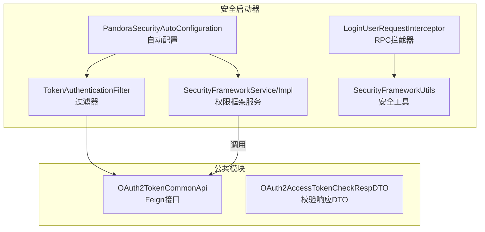
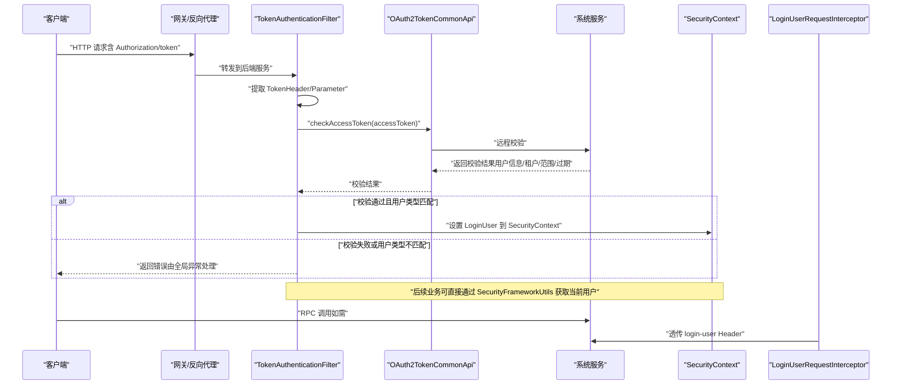
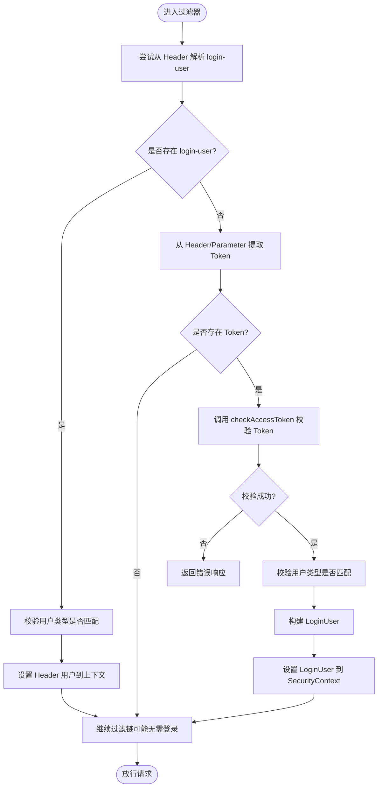
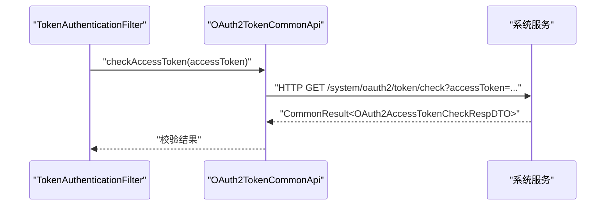
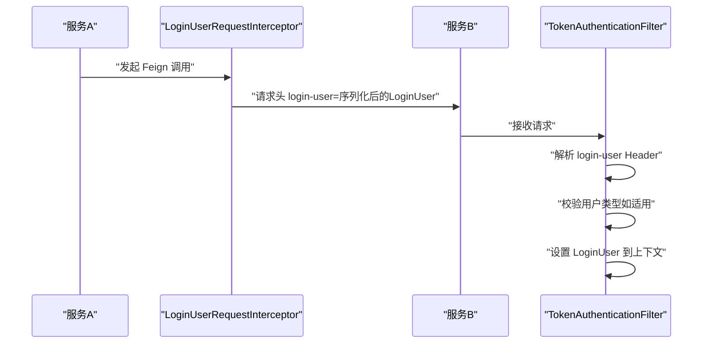
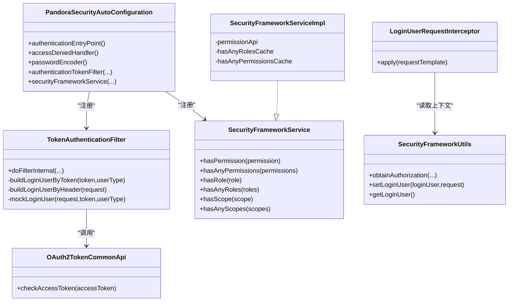
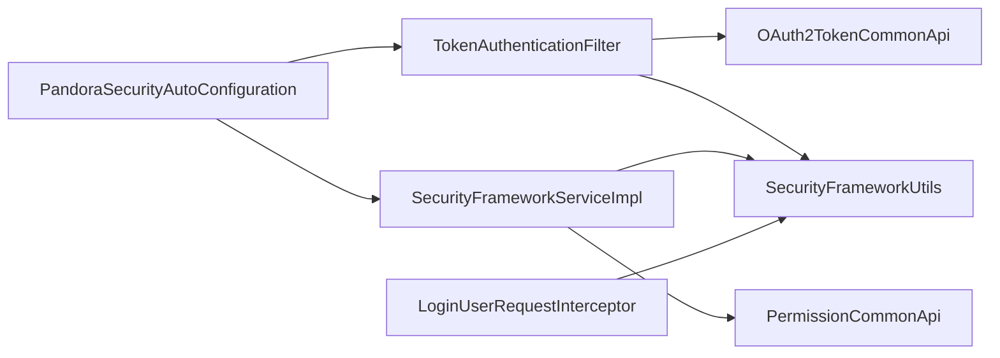

# OAuth2.0认证

<cite>
**本文引用的文件**
- [TokenAuthenticationFilter.java](file://pandora-framework/pandora-spring-boot-starter-security/src/main/java/net/ittimeline/pandora/framework/security/core/filter/TokenAuthenticationFilter.java)
- [OAuth2TokenCommonApi.java](file://pandora-framework/pandora-common/src/main/java/net/ittimeline/pandora/framework/common/biz/system/oauth2/OAuth2TokenCommonApi.java)
- [OAuth2AccessTokenCheckRespDTO.java](file://pandora-framework/pandora-common/src/main/java/net/ittimeline/pandora/framework/common/biz/system/oauth2/dto/OAuth2AccessTokenCheckRespDTO.java)
- [SecurityProperties.java](file://pandora-framework/pandora-spring-boot-starter-security/src/main/java/net/ittimeline/pandora/framework/security/config/SecurityProperties.java)
- [SecurityFrameworkUtils.java](file://pandora-framework/pandora-spring-boot-starter-security/src/main/java/net/ittimeline/pandora/framework/security/core/util/SecurityFrameworkUtils.java)
- [PandoraSecurityAutoConfiguration.java](file://pandora-framework/pandora-spring-boot-starter-security/src/main/java/net/ittimeline/pandora/framework/security/config/PandoraSecurityAutoConfiguration.java)
- [LoginUser.java](file://pandora-framework/pandora-spring-boot-starter-security/src/main/java/net/ittimeline/pandora/framework/security/core/LoginUser.java)
- [SecurityFrameworkService.java](file://pandora-framework/pandora-spring-boot-starter-security/src/main/java/net/ittimeline/pandora/framework/security/core/service/SecurityFrameworkService.java)
- [SecurityFrameworkServiceImpl.java](file://pandora-framework/pandora-spring-boot-starter-security/src/main/java/net/ittimeline/pandora/framework/security/core/service/SecurityFrameworkServiceImpl.java)
- [LoginUserRequestInterceptor.java](file://pandora-framework/pandora-spring-boot-starter-security/src/main/java/net/ittimeline/pandora/framework/security/core/rpc/LoginUserRequestInterceptor.java)
- [README.md（项目总览）](file://README.md)
</cite>

## 目录
1. [简介](#简介)
2. [项目结构](#项目结构)
3. [核心组件](#核心组件)
4. [架构总览](#架构总览)
5. [组件详解](#组件详解)
6. [依赖关系分析](#依赖关系分析)
7. [性能考量](#性能考量)
8. [故障排查指南](#故障排查指南)
9. [结论](#结论)
10. [附录](#附录)

## 简介
本文件面向使用 OAuth2.0 认证的开发者，系统性阐述以下内容：
- TokenAuthenticationFilter 的工作原理与实现机制：包括从请求中提取 Token、调用远程接口校验 Token、构建并注入 LoginUser 到 Spring Security 上下文的完整流程。
- OAuth2TokenCommonApi 接口的使用方法与 Token 验证流程：接口定义、参数与返回结构、远程校验逻辑。
- OAuth2 认证配置示例：如何配置 Token 获取来源（Header/Parameter）、刷新机制、Token 存储策略。
- 微服务间 Token 传递与验证：通过 Feign 拦截器在 RPC 调用中透传用户上下文。
- 与 Spring Security 的集成方式：自动装配、过滤器链、鉴权入口与拒绝处理。
- 常见认证问题排查与性能优化建议。

## 项目结构
本项目采用模块化设计，OAuth2.0 相关能力主要分布在安全启动器与公共模块中：
- 安全启动器模块：负责过滤器、自动配置、工具类、拦截器等。
- 公共模块：定义 OAuth2 接口与 DTO，供远程调用使用。

图表来源
- [TokenAuthenticationFilter.java:1-157](file://pandora-framework/pandora-spring-boot-starter-security/src/main/java/net/ittimeline/pandora/framework/security/core/filter/TokenAuthenticationFilter.java#L1-L157)
- [PandoraSecurityAutoConfiguration.java:1-99](file://pandora-framework/pandora-spring-boot-starter-security/src/main/java/net/ittimeline/pandora/framework/security/config/PandoraSecurityAutoConfiguration.java#L1-L99)
- [SecurityFrameworkUtils.java:1-163](file://pandora-framework/pandora-spring-boot-starter-security/src/main/java/net/ittimeline/pandora/framework/security/core/util/SecurityFrameworkUtils.java#L1-L163)
- [LoginUserRequestInterceptor.java:1-39](file://pandora-framework/pandora-spring-boot-starter-security/src/main/java/net/ittimeline/pandora/framework/security/core/rpc/LoginUserRequestInterceptor.java#L1-L39)
- [SecurityFrameworkService.java:1-61](file://pandora-framework/pandora-spring-boot-starter-security/src/main/java/net/ittimeline/pandora/framework/security/core/service/SecurityFrameworkService.java#L1-L61)
- [SecurityFrameworkServiceImpl.java:1-124](file://pandora-framework/pandora-spring-boot-starter-security/src/main/java/net/ittimeline/pandora/framework/security/core/service/SecurityFrameworkServiceImpl.java#L1-L124)
- [OAuth2TokenCommonApi.java:1-34](file://pandora-framework/pandora-common/src/main/java/net/ittimeline/pandora/framework/common/biz/system/oauth2/OAuth2TokenCommonApi.java#L1-L34)
- [OAuth2AccessTokenCheckRespDTO.java:1-40](file://pandora-framework/pandora-common/src/main/java/net/ittimeline/pandora/framework/common/biz/system/oauth2/dto/OAuth2AccessTokenCheckRespDTO.java#L1-L40)

章节来源
- [README.md（项目总览）:1-15](file://README.md#L1-L15)

## 核心组件
- TokenAuthenticationFilter：在请求进入业务处理之前，完成 Token 校验与用户上下文注入。
- OAuth2TokenCommonApi：通过 Feign 远程调用系统服务，校验访问令牌的有效性。
- OAuth2AccessTokenCheckRespDTO：远程校验返回的用户维度信息载体。
- SecurityProperties：配置 Token 头部名称、参数名、Mock 开关与密钥、免登录 URL 列表等。
- SecurityFrameworkUtils：从请求中提取 Token、设置/获取当前 LoginUser、构建认证对象。
- PandoraSecurityAutoConfiguration：注册认证入口点、拒绝处理、密码编码器、Token 过滤器、权限服务、上下文策略。
- LoginUser：当前登录用户上下文对象，包含用户标识、类型、租户、授权范围、过期时间等。
- SecurityFrameworkService/Impl：权限/角色/授权范围判定的本地封装与缓存。
- LoginUserRequestInterceptor：Feign 请求拦截器，将当前 LoginUser 以 Header 形式透传至下游服务。

章节来源
- [TokenAuthenticationFilter.java:1-157](file://pandora-framework/pandora-spring-boot-starter-security/src/main/java/net/ittimeline/pandora/framework/security/core/filter/TokenAuthenticationFilter.java#L1-L157)
- [OAuth2TokenCommonApi.java:1-34](file://pandora-framework/pandora-common/src/main/java/net/ittimeline/pandora/framework/common/biz/system/oauth2/OAuth2TokenCommonApi.java#L1-L34)
- [OAuth2AccessTokenCheckRespDTO.java:1-40](file://pandora-framework/pandora-common/src/main/java/net/ittimeline/pandora/framework/common/biz/system/oauth2/dto/OAuth2AccessTokenCheckRespDTO.java#L1-L40)
- [SecurityProperties.java:1-58](file://pandora-framework/pandora-spring-boot-starter-security/src/main/java/net/ittimeline/pandora/framework/security/config/SecurityProperties.java#L1-L58)
- [SecurityFrameworkUtils.java:1-163](file://pandora-framework/pandora-spring-boot-starter-security/src/main/java/net/ittimeline/pandora/framework/security/core/util/SecurityFrameworkUtils.java#L1-L163)
- [PandoraSecurityAutoConfiguration.java:1-99](file://pandora-framework/pandora-spring-boot-starter-security/src/main/java/net/ittimeline/pandora/framework/security/config/PandoraSecurityAutoConfiguration.java#L1-L99)
- [LoginUser.java:1-77](file://pandora-framework/pandora-spring-boot-starter-security/src/main/java/net/ittimeline/pandora/framework/security/core/LoginUser.java#L1-L77)
- [SecurityFrameworkService.java:1-61](file://pandora-framework/pandora-spring-boot-starter-security/src/main/java/net/ittimeline/pandora/framework/security/core/service/SecurityFrameworkService.java#L1-L61)
- [SecurityFrameworkServiceImpl.java:1-124](file://pandora-framework/pandora-spring-boot-starter-security/src/main/java/net/ittimeline/pandora/framework/security/core/service/SecurityFrameworkServiceImpl.java#L1-L124)
- [LoginUserRequestInterceptor.java:1-39](file://pandora-framework/pandora-spring-boot-starter-security/src/main/java/net/ittimeline/pandora/framework/security/core/rpc/LoginUserRequestInterceptor.java#L1-L39)

## 架构总览
下图展示了从请求进入、Token 校验、用户上下文注入、到权限判定的整体流程，以及微服务间透传机制：

图表来源
- [TokenAuthenticationFilter.java:47-107](file://pandora-framework/pandora-spring-boot-starter-security/src/main/java/net/ittimeline/pandora/framework/security/core/filter/TokenAuthenticationFilter.java#L47-L107)
- [OAuth2TokenCommonApi.java:27-30](file://pandora-framework/pandora-common/src/main/java/net/ittimeline/pandora/framework/common/biz/system/oauth2/OAuth2TokenCommonApi.java#L27-L30)
- [SecurityFrameworkUtils.java:44-57](file://pandora-framework/pandora-spring-boot-starter-security/src/main/java/net/ittimeline/pandora/framework/security/core/util/SecurityFrameworkUtils.java#L44-L57)
- [LoginUserRequestInterceptor.java:24-37](file://pandora-framework/pandora-spring-boot-starter-security/src/main/java/net/ittimeline/pandora/framework/security/core/rpc/LoginUserRequestInterceptor.java#L24-L37)

## 组件详解

### TokenAuthenticationFilter 工作原理与实现机制
- 请求入口：继承 OncePerRequestFilter，确保每个请求只执行一次。
- 两种用户来源：
  - Header 透传：当请求头存在 login-user 时，解码并反序列化为 LoginUser；同时校验用户类型是否与当前路径要求一致。
  - Token 校验：从请求头或查询参数中提取 Token，调用 OAuth2TokenCommonApi.checkAccessToken 进行远程校验；若校验通过，构建 LoginUser 并设置到 SecurityContext。
- Mock 登录：在开发环境可启用 mock 模式，通过特定前缀的 token 直接构造模拟用户（生产务必关闭）。
- 异常处理：捕获校验异常并通过全局异常处理器统一返回 JSON 结果。

图表来源
- [TokenAuthenticationFilter.java:49-107](file://pandora-framework/pandora-spring-boot-starter-security/src/main/java/net/ittimeline/pandora/framework/security/core/filter/TokenAuthenticationFilter.java#L49-L107)
- [SecurityFrameworkUtils.java:44-57](file://pandora-framework/pandora-spring-boot-starter-security/src/main/java/net/ittimeline/pandora/framework/security/core/util/SecurityFrameworkUtils.java#L44-L57)

章节来源
- [TokenAuthenticationFilter.java:1-157](file://pandora-framework/pandora-spring-boot-starter-security/src/main/java/net/ittimeline/pandora/framework/security/core/filter/TokenAuthenticationFilter.java#L1-L157)

### OAuth2TokenCommonApi 接口与 Token 验证流程
- 接口定义：通过 FeignClient 声明远程校验端点，请求路径为 /system/oauth2/token/check，参数 accessToken 为必填。
- 返回结构：OAuth2AccessTokenCheckRespDTO，包含用户编号、用户类型、额外用户信息、租户编号、授权范围、过期时间等。
- 调用时机：在 TokenAuthenticationFilter 中，当存在有效 Token 时调用该接口进行校验。

图表来源
- [OAuth2TokenCommonApi.java:27-30](file://pandora-framework/pandora-common/src/main/java/net/ittimeline/pandora/framework/common/biz/system/oauth2/OAuth2TokenCommonApi.java#L27-L30)
- [OAuth2AccessTokenCheckRespDTO.java:20-39](file://pandora-framework/pandora-common/src/main/java/net/ittimeline/pandora/framework/common/biz/system/oauth2/dto/OAuth2AccessTokenCheckRespDTO.java#L20-L39)

章节来源
- [OAuth2TokenCommonApi.java:1-34](file://pandora-framework/pandora-common/src/main/java/net/ittimeline/pandora/framework/common/biz/system/oauth2/OAuth2TokenCommonApi.java#L1-L34)
- [OAuth2AccessTokenCheckRespDTO.java:1-40](file://pandora-framework/pandora-common/src/main/java/net/ittimeline/pandora/framework/common/biz/system/oauth2/dto/OAuth2AccessTokenCheckRespDTO.java#L1-L40)

### OAuth2 认证配置示例
- Token 获取来源：
  - 请求头：通过配置项 pandora.security.tokenHeader 指定，默认为 Authorization。
  - 查询参数：通过 pandora.security.tokenParameter 指定，默认为 token。
- 用户类型匹配：仅对 /admin-api/* 与 /app-api/* 等路径进行用户类型校验，WebSocket 等路径不参与。
- Mock 开发模式：开启 pandora.security.mockEnable 并配置 pandora.security.mockSecret，开发时可使用特定前缀的 token 直接构造模拟用户。
- 免登录 URL：通过 pandora.security.permitAllUrls 配置无需登录即可访问的路径列表。
- 密码编码器复杂度：可通过 pandora.security.passwordEncoderLength 控制 BCrypt 的成本因子。

章节来源
- [SecurityProperties.java:22-57](file://pandora-framework/pandora-spring-boot-starter-security/src/main/java/net/ittimeline/pandora/framework/security/config/SecurityProperties.java#L22-L57)
- [TokenAuthenticationFilter.java:94-97](file://pandora-framework/pandora-spring-boot-starter-security/src/main/java/net/ittimeline/pandora/framework/security/core/filter/TokenAuthenticationFilter.java#L94-L97)

### 微服务间传递与验证机制
- Header 透传：LoginUserRequestInterceptor 将当前 LoginUser 序列化并 URL 编码后放入请求头 login-user，下游服务通过 TokenAuthenticationFilter 的 Header 分支直接解析并设置上下文。
- 作用域与权限：下游服务可基于 SecurityFrameworkService/Impl 的 hasScope/hasRole/hasPermission 进行细粒度控制。
- 跨租户访问：通过 SecurityFrameworkUtils.skipPermissionCheck 判断是否跳过权限校验（当访问租户与当前租户不一致时）。

图表来源
- [LoginUserRequestInterceptor.java:24-37](file://pandora-framework/pandora-spring-boot-starter-security/src/main/java/net/ittimeline/pandora/framework/security/core/rpc/LoginUserRequestInterceptor.java#L24-L37)
- [TokenAuthenticationFilter.java:133-155](file://pandora-framework/pandora-spring-boot-starter-security/src/main/java/net/ittimeline/pandora/framework/security/core/filter/TokenAuthenticationFilter.java#L133-L155)

章节来源
- [LoginUserRequestInterceptor.java:1-39](file://pandora-framework/pandora-spring-boot-starter-security/src/main/java/net/ittimeline/pandora/framework/security/core/rpc/LoginUserRequestInterceptor.java#L1-L39)
- [TokenAuthenticationFilter.java:133-155](file://pandora-framework/pandora-spring-boot-starter-security/src/main/java/net/ittimeline/pandora/framework/security/core/filter/TokenAuthenticationFilter.java#L133-L155)

### 与 Spring Security 的集成方式
- 自动配置：PandoraSecurityAutoConfiguration 注册 AuthenticationEntryPoint、AccessDeniedHandler、PasswordEncoder、TokenAuthenticationFilter、SecurityFrameworkService，并设置 SecurityContextHolder 策略为 TransmittableThreadLocal。
- 过滤器链：TokenAuthenticationFilter 在 Spring Security 过滤链中先行执行，确保在业务层拿到已认证的用户上下文。
- 权限判定：SecurityFrameworkServiceImpl 基于 PermissionCommonApi 提供的 hasAnyRoles/hasAnyPermissions 接口进行权限判断，并对结果做短期缓存以提升性能。

图表来源
- [TokenAuthenticationFilter.java:1-157](file://pandora-framework/pandora-spring-boot-starter-security/src/main/java/net/ittimeline/pandora/framework/security/core/filter/TokenAuthenticationFilter.java#L1-L157)
- [OAuth2TokenCommonApi.java:1-34](file://pandora-framework/pandora-common/src/main/java/net/ittimeline/pandora/framework/common/biz/system/oauth2/OAuth2TokenCommonApi.java#L1-L34)
- [SecurityFrameworkService.java:1-61](file://pandora-framework/pandora-spring-boot-starter-security/src/main/java/net/ittimeline/pandora/framework/security/core/service/SecurityFrameworkService.java#L1-L61)
- [SecurityFrameworkServiceImpl.java:1-124](file://pandora-framework/pandora-spring-boot-starter-security/src/main/java/net/ittimeline/pandora/framework/security/core/service/SecurityFrameworkServiceImpl.java#L1-L124)
- [LoginUserRequestInterceptor.java:1-39](file://pandora-framework/pandora-spring-boot-starter-security/src/main/java/net/ittimeline/pandora/framework/security/core/rpc/LoginUserRequestInterceptor.java#L1-L39)
- [SecurityFrameworkUtils.java:1-163](file://pandora-framework/pandora-spring-boot-starter-security/src/main/java/net/ittimeline/pandora/framework/security/core/util/SecurityFrameworkUtils.java#L1-L163)
- [PandoraSecurityAutoConfiguration.java:1-99](file://pandora-framework/pandora-spring-boot-starter-security/src/main/java/net/ittimeline/pandora/framework/security/config/PandoraSecurityAutoConfiguration.java#L1-L99)

章节来源
- [PandoraSecurityAutoConfiguration.java:1-99](file://pandora-framework/pandora-spring-boot-starter-security/src/main/java/net/ittimeline/pandora/framework/security/config/PandoraSecurityAutoConfiguration.java#L1-L99)

## 依赖关系分析
- 组件耦合：
  - TokenAuthenticationFilter 依赖 OAuth2TokenCommonApi 与 SecurityFrameworkUtils。
  - SecurityFrameworkServiceImpl 依赖 PermissionCommonApi 与 SecurityFrameworkUtils。
  - LoginUserRequestInterceptor 依赖 SecurityFrameworkUtils。
  - PandoraSecurityAutoConfiguration 统一装配上述组件并注册到 Spring 容器。
- 外部依赖：
  - Feign 远程调用系统服务进行 Token 校验。
  - Spring Security 上下文与过滤器链。
  - BCrypt 密码编码器（用于系统内部密码存储）。

图表来源
- [TokenAuthenticationFilter.java:1-157](file://pandora-framework/pandora-spring-boot-starter-security/src/main/java/net/ittimeline/pandora/framework/security/core/filter/TokenAuthenticationFilter.java#L1-L157)
- [SecurityFrameworkServiceImpl.java:1-124](file://pandora-framework/pandora-spring-boot-starter-security/src/main/java/net/ittimeline/pandora/framework/security/core/service/SecurityFrameworkServiceImpl.java#L1-L124)
- [LoginUserRequestInterceptor.java:1-39](file://pandora-framework/pandora-spring-boot-starter-security/src/main/java/net/ittimeline/pandora/framework/security/core/rpc/LoginUserRequestInterceptor.java#L1-L39)
- [PandoraSecurityAutoConfiguration.java:1-99](file://pandora-framework/pandora-spring-boot-starter-security/src/main/java/net/ittimeline/pandora/framework/security/config/PandoraSecurityAutoConfiguration.java#L1-L99)

## 性能考量
- 缓存策略：SecurityFrameworkServiceImpl 对 hasAnyRoles/hasAnyPermissions 的结果使用 LoadingCache 缓存 1 分钟，降低频繁权限查询的开销。
- Token 校验：建议在系统侧对 Token 校验结果进行短期缓存（如 Redis），减少重复远程调用；同时结合网关层统一校验，避免每个服务重复校验。
- 过滤器链顺序：确保 TokenAuthenticationFilter 在更具体的资源保护之前执行，减少不必要的鉴权失败开销。
- 日志与异常：全局异常处理统一返回 JSON，避免异常栈泄露；同时注意在高并发场景下避免过度日志输出影响性能。

## 故障排查指南
- 无法获取用户信息：
  - 检查请求头 Authorization 或查询参数 token 是否正确传递。
  - 确认 pandora.security.tokenHeader 与 pandora.security.tokenParameter 配置是否与前端一致。
- 用户类型不匹配：
  - 确认请求路径是否属于 /admin-api/* 或 /app-api/*，这些路径才会校验用户类型。
- Mock 模式无效：
  - 确认 pandora.security.mockEnable=true 且 token 以 pandora.security.mockSecret 开头。
- 跨服务未透传用户：
  - 检查 LoginUserRequestInterceptor 是否生效，确认 login-user 头是否被下游 TokenAuthenticationFilter 正确解析。
- 权限判定异常：
  - 使用 SecurityFrameworkUtils.skipPermissionCheck 判断是否处于跨租户访问场景；检查 hasScope/hasRole/hasPermission 的入参与系统侧权限配置。

章节来源
- [TokenAuthenticationFilter.java:94-97](file://pandora-framework/pandora-spring-boot-starter-security/src/main/java/net/ittimeline/pandora/framework/security/core/filter/TokenAuthenticationFilter.java#L94-L97)
- [TokenAuthenticationFilter.java:120-126](file://pandora-framework/pandora-spring-boot-starter-security/src/main/java/net/ittimeline/pandora/framework/security/core/filter/TokenAuthenticationFilter.java#L120-L126)
- [SecurityFrameworkServiceImpl.java:109-121](file://pandora-framework/pandora-spring-boot-starter-security/src/main/java/net/ittimeline/pandora/framework/security/core/service/SecurityFrameworkServiceImpl.java#L109-L121)

## 结论
本方案通过 TokenAuthenticationFilter 与 OAuth2TokenCommonApi 的组合，实现了统一的 Token 校验与用户上下文注入；借助 LoginUserRequestInterceptor 实现了微服务间的用户上下文透传；配合 SecurityFrameworkService/Impl 提供的权限判定与缓存，满足了高可用与高性能的认证需求。建议在生产环境中严格关闭 mock 模式，合理配置免登录 URL 与用户类型校验范围，并结合网关层进行集中式 Token 校验与缓存，以进一步提升系统稳定性与性能。

## 附录
- 配置项清单（节选）
  - pandora.security.tokenHeader：请求头中 Token 的键名，默认 Authorization。
  - pandora.security.tokenParameter：查询参数中 Token 的键名，默认 token。
  - pandora.security.mockEnable：是否启用 mock 模式。
  - pandora.security.mockSecret：mock 模式的密钥前缀。
  - pandora.security.permitAllUrls：免登录 URL 列表。
  - pandora.security.passwordEncoderLength：BCrypt 成本因子。

章节来源
- [SecurityProperties.java:22-57](file://pandora-framework/pandora-spring-boot-starter-security/src/main/java/net/ittimeline/pandora/framework/security/config/SecurityProperties.java#L22-L57)