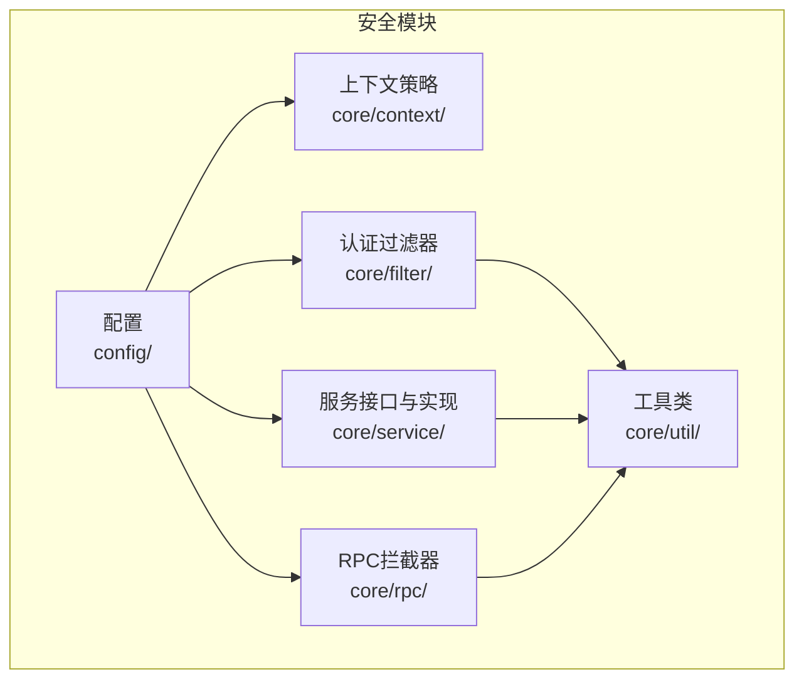
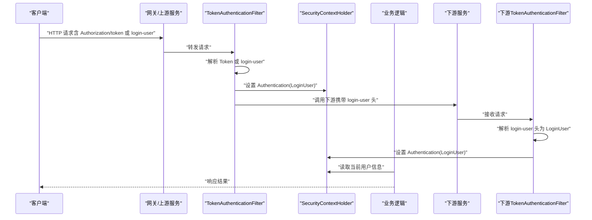
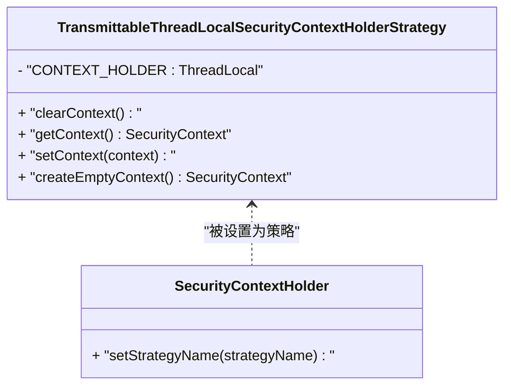
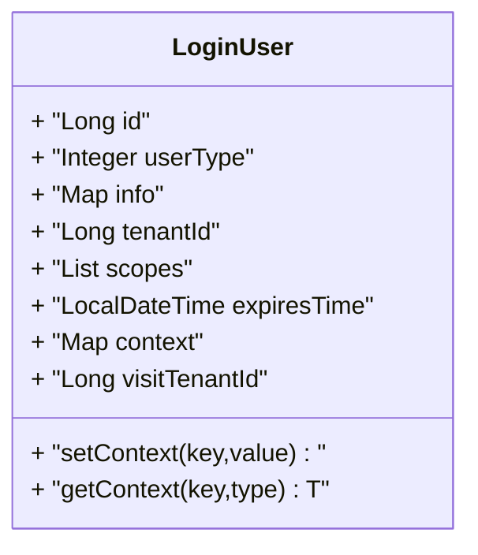
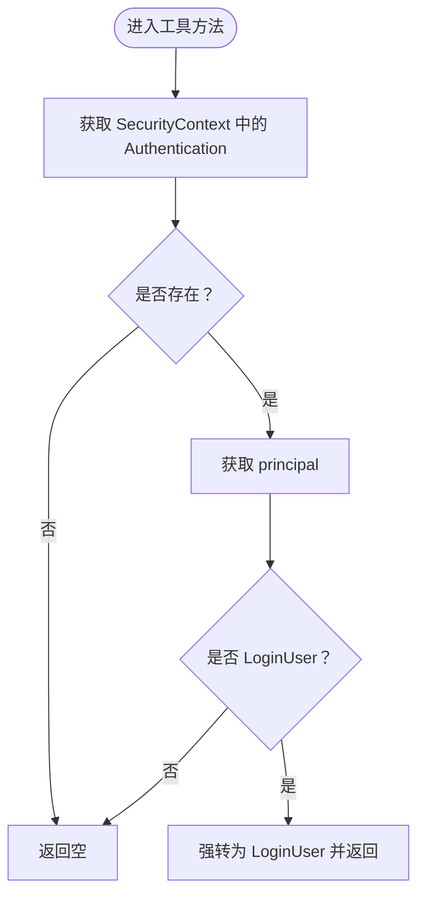
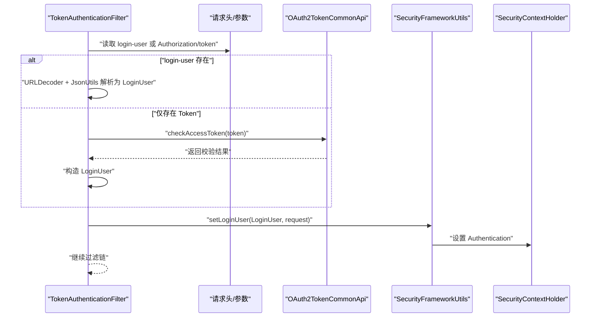
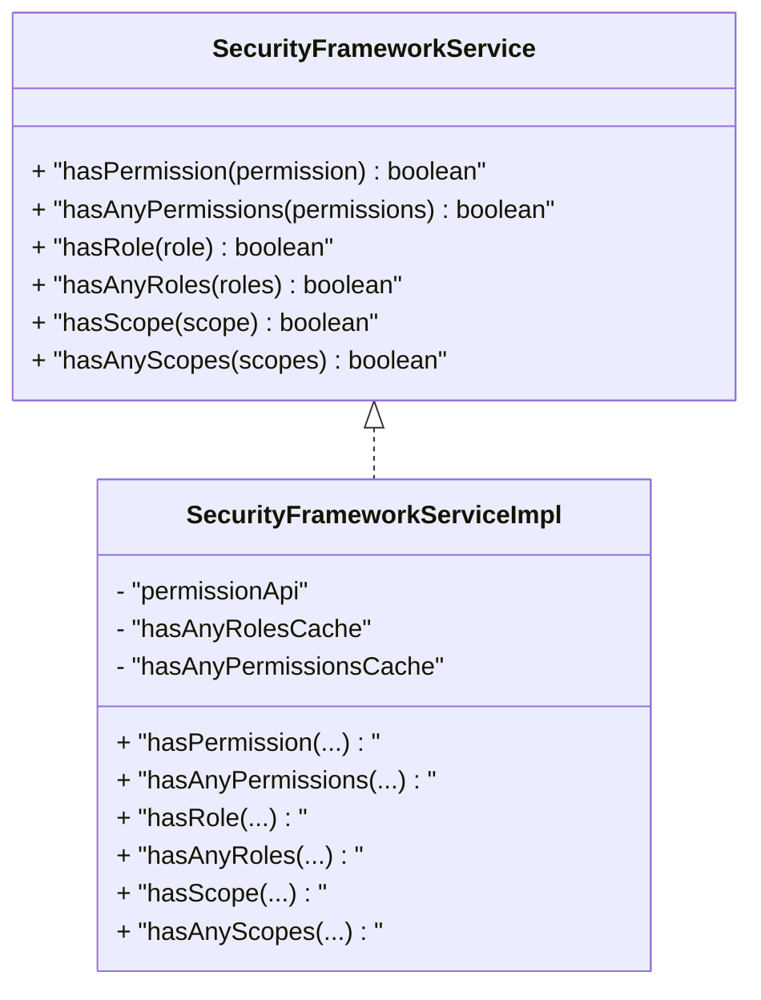
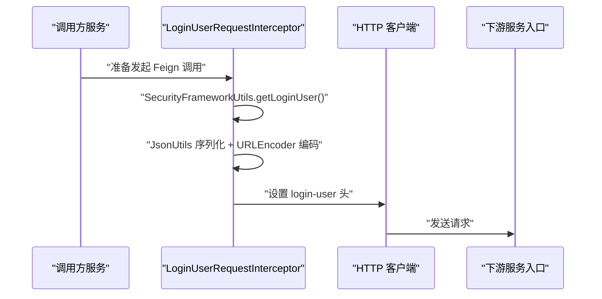
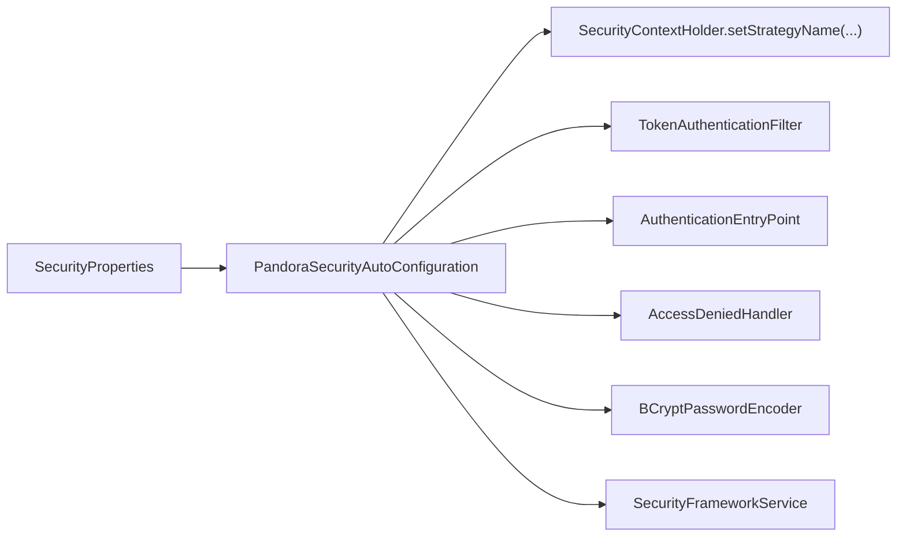
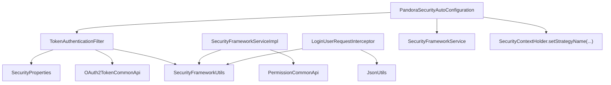

# 安全上下文

<cite>
**本文引用的文件**
- [TransmittableThreadLocalSecurityContextHolderStrategy.java](file://pandora-framework/pandora-spring-boot-starter-security/src/main/java/net/ittimeline/pandora/framework/security/core/context/TransmittableThreadLocalSecurityContextHolderStrategy.java)
- [LoginUser.java](file://pandora-framework/pandora-spring-boot-starter-security/src/main/java/net/ittimeline/pandora/framework/security/core/LoginUser.java)
- [SecurityFrameworkUtils.java](file://pandora-framework/pandora-spring-boot-starter-security/src/main/java/net/ittimeline/pandora/framework/security/core/util/SecurityFrameworkUtils.java)
- [TokenAuthenticationFilter.java](file://pandora-framework/pandora-spring-boot-starter-security/src/main/java/net/ittimeline/pandora/framework/security/core/filter/TokenAuthenticationFilter.java)
- [PandoraSecurityAutoConfiguration.java](file://pandora-framework/pandora-spring-boot-starter-security/src/main/java/net/ittimeline/pandora/framework/security/config/PandoraSecurityAutoConfiguration.java)
- [SecurityProperties.java](file://pandora-framework/pandora-spring-boot-starter-security/src/main/java/net/ittimeline/pandora/framework/security/config/SecurityProperties.java)
- [SecurityFrameworkService.java](file://pandora-framework/pandora-spring-boot-starter-security/src/main/java/net/ittimeline/pandora/framework/security/core/service/SecurityFrameworkService.java)
- [SecurityFrameworkServiceImpl.java](file://pandora-framework/pandora-spring-boot-starter-security/src/main/java/net/ittimeline/pandora/framework/security/core/service/SecurityFrameworkServiceImpl.java)
- [LoginUserRequestInterceptor.java](file://pandora-framework/pandora-spring-boot-starter-security/src/main/java/net/ittimeline/pandora/framework/security/core/rpc/LoginUserRequestInterceptor.java)
- [org.springframework.boot.autoconfigure.AutoConfiguration.imports](file://pandora-framework/pandora-spring-boot-starter-security/src/main/resources/META-INF/spring/org.springframework.boot.autoconfigure.AutoConfiguration.imports)
</cite>

## 目录
1. [简介](#简介)
2. [项目结构](#项目结构)
3. [核心组件](#核心组件)
4. [架构总览](#架构总览)
5. [组件详解](#组件详解)
6. [依赖关系分析](#依赖关系分析)
7. [性能考量](#性能考量)
8. [故障排查指南](#故障排查指南)
9. [结论](#结论)
10. [附录](#附录)

## 简介
本文件围绕安全上下文能力展开，重点覆盖以下主题：
- TransmittableThreadLocalSecurityContextHolderStrategy 的实现原理与使用场景，解释其如何通过可跨线程传递的线程本地存储管理 Spring Security 的安全上下文，解决异步执行（如 @Async）导致的原生 ThreadLocal 丢失问题。
- LoginUser 用户信息模型的数据结构与使用方法，涵盖用户基本信息、权限范围、会话与上下文信息等。
- 安全上下文在多线程与分布式环境中的传递机制，包括请求头透传、RPC 拦截器序列化与反序列化。
- 完整的使用示例路径（以源码路径代替具体代码），帮助快速落地。
- 性能与分布式兼容性建议。

## 项目结构
安全相关模块位于 pandora-spring-boot-starter-security 下，关键目录与职责如下：
- config：自动装配与配置项
- core/context：安全上下文持有者策略（可跨线程）
- core/filter：基于 Token 的认证过滤器
- core/util：安全框架工具类（获取当前用户、设置用户上下文等）
- core/service：权限/角色/授权范围校验接口与默认实现
- core/rpc：Feign RPC 请求拦截器，负责将 LoginUser 透传到下游服务
- resources/META-INF/spring：Spring Boot 自动装配导入清单

**图表来源**
- [PandoraSecurityAutoConfiguration.java:1-99](file://pandora-framework/pandora-spring-boot-starter-security/src/main/java/net/ittimeline/pandora/framework/security/config/PandoraSecurityAutoConfiguration.java#L1-L99)
- [org.springframework.boot.autoconfigure.AutoConfiguration.imports:1-6](file://pandora-framework/pandora-spring-boot-starter-security/src/main/resources/META-INF/spring/org.springframework.boot.autoconfigure.AutoConfiguration.imports#L1-L6)

**章节来源**
- [PandoraSecurityAutoConfiguration.java:1-99](file://pandora-framework/pandora-spring-boot-starter-security/src/main/java/net/ittimeline/pandora/framework/security/config/PandoraSecurityAutoConfiguration.java#L1-L99)
- [org.springframework.boot.autoconfigure.AutoConfiguration.imports:1-6](file://pandora-framework/pandora-spring-boot-starter-security/src/main/resources/META-INF/spring/org.springframework.boot.autoconfigure.AutoConfiguration.imports#L1-L6)

## 核心组件
- TransmittableThreadLocalSecurityContextHolderStrategy：替换 Spring Security 默认的上下文持有策略，使用可跨线程传递的 TransmittableThreadLocal 存储 SecurityContext，避免异步任务丢失。
- LoginUser：登录用户信息载体，包含用户标识、类型、额外信息、租户、授权范围、过期时间以及运行时上下文等。
- SecurityFrameworkUtils：提供获取/设置当前用户、构建认证对象、从请求头提取 Token、跨租户权限豁免判断等工具方法。
- TokenAuthenticationFilter：基于请求头或参数的 Token 校验，构建 LoginUser 并注入 Spring Security 上下文；支持网关/上游服务透传的 login-user 头。
- SecurityFrameworkService/SecurityFrameworkServiceImpl：权限/角色/授权范围的校验接口与默认实现，内置缓存提升性能。
- LoginUserRequestInterceptor：Feign 客户端拦截器，将当前 LoginUser 序列化并通过 login-user 请求头透传至下游服务。
- SecurityProperties：安全相关配置项，如 Token 头名、参数名、mock 开关与密钥、免登录 URL 列表、密码编码复杂度等。

**章节来源**
- [TransmittableThreadLocalSecurityContextHolderStrategy.java:1-50](file://pandora-framework/pandora-spring-boot-starter-security/src/main/java/net/ittimeline/pandora/framework/security/core/context/TransmittableThreadLocalSecurityContextHolderStrategy.java#L1-L50)
- [LoginUser.java:1-77](file://pandora-framework/pandora-spring-boot-starter-security/src/main/java/net/ittimeline/pandora/framework/security/core/LoginUser.java#L1-L77)
- [SecurityFrameworkUtils.java:1-163](file://pandora-framework/pandora-spring-boot-starter-security/src/main/java/net/ittimeline/pandora/framework/security/core/util/SecurityFrameworkUtils.java#L1-L163)
- [TokenAuthenticationFilter.java:1-157](file://pandora-framework/pandora-spring-boot-starter-security/src/main/java/net/ittimeline/pandora/framework/security/core/filter/TokenAuthenticationFilter.java#L1-L157)
- [SecurityFrameworkService.java:1-61](file://pandora-framework/pandora-spring-boot-starter-security/src/main/java/net/ittimeline/pandora/framework/security/core/service/SecurityFrameworkService.java#L1-L61)
- [SecurityFrameworkServiceImpl.java:1-124](file://pandora-framework/pandora-spring-boot-starter-security/src/main/java/net/ittimeline/pandora/framework/security/core/service/SecurityFrameworkServiceImpl.java#L1-L124)
- [LoginUserRequestInterceptor.java:1-39](file://pandora-framework/pandora-spring-boot-starter-security/src/main/java/net/ittimeline/pandora/framework/security/core/rpc/LoginUserRequestInterceptor.java#L1-L39)
- [SecurityProperties.java:1-58](file://pandora-framework/pandora-spring-boot-starter-security/src/main/java/net/ittimeline/pandora/framework/security/config/SecurityProperties.java#L1-L58)

## 架构总览
下图展示安全上下文在请求生命周期内的流转，以及跨线程与跨服务的传递路径。

**图表来源**
- [TokenAuthenticationFilter.java:47-82](file://pandora-framework/pandora-spring-boot-starter-security/src/main/java/net/ittimeline/pandora/framework/security/core/filter/TokenAuthenticationFilter.java#L47-L82)
- [LoginUserRequestInterceptor.java:23-37](file://pandora-framework/pandora-spring-boot-starter-security/src/main/java/net/ittimeline/pandora/framework/security/core/rpc/LoginUserRequestInterceptor.java#L23-L37)
- [SecurityFrameworkUtils.java:125-136](file://pandora-framework/pandora-spring-boot-starter-security/src/main/java/net/ittimeline/pandora/framework/security/core/util/SecurityFrameworkUtils.java#L125-L136)

## 组件详解

### TransmittableThreadLocalSecurityContextHolderStrategy：可跨线程传递的安全上下文策略
- 设计目标：替换 Spring Security 默认的上下文持有策略，使用 TransmittableThreadLocal 作为底层存储，确保在 @Async 等异步场景中，安全上下文不会丢失。
- 关键点：
  - 使用静态的 TransmittableThreadLocal 保存 SecurityContext。
  - 提供 clearContext/getContext/setContext/createEmptyContext 等标准接口。
  - 在自动配置中通过反射调用 SecurityContextHolder.setStrategyName(...) 注入该策略。

**图表来源**
- [TransmittableThreadLocalSecurityContextHolderStrategy.java:17-48](file://pandora-framework/pandora-spring-boot-starter-security/src/main/java/net/ittimeline/pandora/framework/security/core/context/TransmittableThreadLocalSecurityContextHolderStrategy.java#L17-L48)
- [PandoraSecurityAutoConfiguration.java:85-96](file://pandora-framework/pandora-spring-boot-starter-security/src/main/java/net/ittimeline/pandora/framework/security/config/PandoraSecurityAutoConfiguration.java#L85-L96)

**章节来源**
- [TransmittableThreadLocalSecurityContextHolderStrategy.java:1-50](file://pandora-framework/pandora-spring-boot-starter-security/src/main/java/net/ittimeline/pandora/framework/security/core/context/TransmittableThreadLocalSecurityContextHolderStrategy.java#L1-L50)
- [PandoraSecurityAutoConfiguration.java:85-96](file://pandora-framework/pandora-spring-boot-starter-security/src/main/java/net/ittimeline/pandora/framework/security/config/PandoraSecurityAutoConfiguration.java#L85-L96)

### LoginUser：用户信息模型
- 字段概览：
  - 标识与类型：id、userType
  - 扩展信息：info（Map<String,String>，如 nickname、deptId）
  - 租户与授权：tenantId、scopes(List<String>)、expiresTime(LocalDateTime)
  - 运行时上下文：context(Map<String,Object>)，@JsonIgnore 不参与持久化
  - 访问租户：visitTenantId
- 工具方法：
  - setContext/getContext 支持在 LoginUser 维度的临时缓存与取用。

**图表来源**
- [LoginUser.java:21-76](file://pandora-framework/pandora-spring-boot-starter-security/src/main/java/net/ittimeline/pandora/framework/security/core/LoginUser.java#L21-L76)

**章节来源**
- [LoginUser.java:1-77](file://pandora-framework/pandora-spring-boot-starter-security/src/main/java/net/ittimeline/pandora/framework/security/core/LoginUser.java#L1-L77)

### SecurityFrameworkUtils：安全上下文工具类
- 主要能力：
  - 从请求中提取 Token（优先 Header，其次 Parameter），并去除 Bearer 前缀。
  - 获取当前 Authentication 与 LoginUser。
  - 从 LoginUser 中便捷获取用户编号、昵称、部门编号等。
  - 将 LoginUser 包装为 Authentication 并设置到 SecurityContextHolder，同时写入 WebFrameworkUtils 的请求上下文，便于后续日志等组件使用。
  - 跨租户访问时的权限豁免判断（当 visitTenantId != tenantId 时跳过权限校验）。

**图表来源**
- [SecurityFrameworkUtils.java:64-84](file://pandora-framework/pandora-spring-boot-starter-security/src/main/java/net/ittimeline/pandora/framework/security/core/util/SecurityFrameworkUtils.java#L64-L84)

**章节来源**
- [SecurityFrameworkUtils.java:1-163](file://pandora-framework/pandora-spring-boot-starter-security/src/main/java/net/ittimeline/pandora/framework/security/core/util/SecurityFrameworkUtils.java#L1-L163)

### TokenAuthenticationFilter：基于 Token 的认证过滤器
- 功能流程：
  - 优先尝试从请求头 login-user 解析 LoginUser（用于网关/上游透传）。
  - 若无 login-user，则从配置的 Header/Parameter 提取 Token。
  - 调用 OAuth2TokenCommonApi 校验 Token 并构建 LoginUser。
  - 支持 mock 模式（需开启并满足密钥规则），便于本地调试。
  - 将 LoginUser 写入 SecurityContextHolder 与 WebFrameworkUtils 请求上下文。
- 关键点：
  - 对特定路径（如 WebSocket/ws/*）不强制校验用户类型。
  - 异常统一由全局异常处理器转换为 JSON 响应。

**图表来源**
- [TokenAuthenticationFilter.java:47-82](file://pandora-framework/pandora-spring-boot-starter-security/src/main/java/net/ittimeline/pandora/framework/security/core/filter/TokenAuthenticationFilter.java#L47-L82)
- [TokenAuthenticationFilter.java:84-131](file://pandora-framework/pandora-spring-boot-starter-security/src/main/java/net/ittimeline/pandora/framework/security/core/filter/TokenAuthenticationFilter.java#L84-L131)
- [SecurityFrameworkUtils.java:125-136](file://pandora-framework/pandora-spring-boot-starter-security/src/main/java/net/ittimeline/pandora/framework/security/core/util/SecurityFrameworkUtils.java#L125-L136)

**章节来源**
- [TokenAuthenticationFilter.java:1-157](file://pandora-framework/pandora-spring-boot-starter-security/src/main/java/net/ittimeline/pandora/framework/security/core/filter/TokenAuthenticationFilter.java#L1-L157)
- [SecurityProperties.java:22-57](file://pandora-framework/pandora-spring-boot-starter-security/src/main/java/net/ittimeline/pandora/framework/security/config/SecurityProperties.java#L22-L57)

### SecurityFrameworkService 与 SecurityFrameworkServiceImpl：权限/授权范围校验
- 接口能力：hasPermission/hasAnyPermissions、hasRole/hasAnyRoles、hasScope/hasAnyScopes。
- 默认实现要点：
  - 跨租户访问时直接放行（skipPermissionCheck）。
  - 基于用户 ID 与权限/角色集合构建缓存键，使用 LoadingCache 缓存校验结果，减少远程调用。
  - 授权范围校验直接与 LoginUser.scopes 比较。

**图表来源**
- [SecurityFrameworkService.java:10-60](file://pandora-framework/pandora-spring-boot-starter-security/src/main/java/net/ittimeline/pandora/framework/security/core/service/SecurityFrameworkService.java#L10-L60)
- [SecurityFrameworkServiceImpl.java:29-123](file://pandora-framework/pandora-spring-boot-starter-security/src/main/java/net/ittimeline/pandora/framework/security/core/service/SecurityFrameworkServiceImpl.java#L29-L123)

**章节来源**
- [SecurityFrameworkService.java:1-61](file://pandora-framework/pandora-spring-boot-starter-security/src/main/java/net/ittimeline/pandora/framework/security/core/service/SecurityFrameworkService.java#L1-L61)
- [SecurityFrameworkServiceImpl.java:1-124](file://pandora-framework/pandora-spring-boot-starter-security/src/main/java/net/ittimeline/pandora/framework/security/core/service/SecurityFrameworkServiceImpl.java#L1-L124)

### LoginUserRequestInterceptor：RPC 请求头透传
- 作用：在 Feign 客户端发起请求前，读取当前 LoginUser，序列化为 JSON 并进行 URL 编码，写入 login-user 请求头，实现跨服务的用户上下文传递。
- 注意：下游服务需在入口处解析 login-user 头还原 LoginUser 并注入安全上下文（由下游 TokenAuthenticationFilter 负责）。

**图表来源**
- [LoginUserRequestInterceptor.java:23-37](file://pandora-framework/pandora-spring-boot-starter-security/src/main/java/net/ittimeline/pandora/framework/security/core/rpc/LoginUserRequestInterceptor.java#L23-L37)

**章节来源**
- [LoginUserRequestInterceptor.java:1-39](file://pandora-framework/pandora-spring-boot-starter-security/src/main/java/net/ittimeline/pandora/framework/security/core/rpc/LoginUserRequestInterceptor.java#L1-L39)

### 配置与自动装配：SecurityProperties 与 PandoraSecurityAutoConfiguration
- SecurityProperties：
  - tokenHeader/tokenParameter：Token 的请求头与参数名，默认 Authorization 与 token。
  - mockEnable/mockSecret：mock 模式开关与密钥，用于本地调试。
  - permitAllUrls：免登录白名单 URL 列表。
  - passwordEncoderLength：BCrypt 密码编码复杂度。
- 自动装配：
  - 注册 AuthenticationEntryPoint、AccessDeniedHandler、PasswordEncoder。
  - 注册 TokenAuthenticationFilter。
  - 通过 MethodInvokingFactoryBean 调用 SecurityContextHolder.setStrategyName(...) 设置 TransmittableThreadLocalSecurityContextHolderStrategy。
  - 暴露 SecurityFrameworkService 实例。

**图表来源**
- [PandoraSecurityAutoConfiguration.java:39-96](file://pandora-framework/pandora-spring-boot-starter-security/src/main/java/net/ittimeline/pandora/framework/security/config/PandoraSecurityAutoConfiguration.java#L39-L96)
- [SecurityProperties.java:22-57](file://pandora-framework/pandora-spring-boot-starter-security/src/main/java/net/ittimeline/pandora/framework/security/config/SecurityProperties.java#L22-L57)

**章节来源**
- [SecurityProperties.java:1-58](file://pandora-framework/pandora-spring-boot-starter-security/src/main/java/net/ittimeline/pandora/framework/security/config/SecurityProperties.java#L1-L58)
- [PandoraSecurityAutoConfiguration.java:1-99](file://pandora-framework/pandora-spring-boot-starter-security/src/main/java/net/ittimeline/pandora/framework/security/config/PandoraSecurityAutoConfiguration.java#L1-L99)

## 依赖关系分析
- 组件耦合：
  - TokenAuthenticationFilter 依赖 SecurityProperties、GlobalExceptionHandler、OAuth2TokenCommonApi、SecurityFrameworkUtils。
  - SecurityFrameworkServiceImpl 依赖 PermissionCommonApi、SecurityFrameworkUtils。
  - LoginUserRequestInterceptor 依赖 SecurityFrameworkUtils、JsonUtils。
  - PandoraSecurityAutoConfiguration 注入策略、注册 Bean、暴露 SecurityFrameworkService。
- 外部依赖：
  - Alibaba TTL 的 TransmittableThreadLocal。
  - Spring Security 的 SecurityContext、SecurityContextHolder、Authentication。
  - Feign 的 RequestInterceptor。

**图表来源**
- [TokenAuthenticationFilter.java:41-45](file://pandora-framework/pandora-spring-boot-starter-security/src/main/java/net/ittimeline/pandora/framework/security/core/filter/TokenAuthenticationFilter.java#L41-L45)
- [SecurityFrameworkServiceImpl.java:31-18](file://pandora-framework/pandora-spring-boot-starter-security/src/main/java/net/ittimeline/pandora/framework/security/core/service/SecurityFrameworkServiceImpl.java#L31-L18)
- [LoginUserRequestInterceptor.java:6-8](file://pandora-framework/pandora-spring-boot-starter-security/src/main/java/net/ittimeline/pandora/framework/security/core/rpc/LoginUserRequestInterceptor.java#L6-L8)
- [PandoraSecurityAutoConfiguration.java:85-96](file://pandora-framework/pandora-spring-boot-starter-security/src/main/java/net/ittimeline/pandora/framework/security/config/PandoraSecurityAutoConfiguration.java#L85-L96)

**章节来源**
- [TokenAuthenticationFilter.java:1-157](file://pandora-framework/pandora-spring-boot-starter-security/src/main/java/net/ittimeline/pandora/framework/security/core/filter/TokenAuthenticationFilter.java#L1-L157)
- [SecurityFrameworkServiceImpl.java:1-124](file://pandora-framework/pandora-spring-boot-starter-security/src/main/java/net/ittimeline/pandora/framework/security/core/service/SecurityFrameworkServiceImpl.java#L1-L124)
- [LoginUserRequestInterceptor.java:1-39](file://pandora-framework/pandora-spring-boot-starter-security/src/main/java/net/ittimeline/pandora/framework/security/core/rpc/LoginUserRequestInterceptor.java#L1-L39)
- [PandoraSecurityAutoConfiguration.java:1-99](file://pandora-framework/pandora-spring-boot-starter-security/src/main/java/net/ittimeline/pandora/framework/security/config/PandoraSecurityAutoConfiguration.java#L1-L99)

## 性能考量
- 缓存优化：SecurityFrameworkServiceImpl 对 hasAnyRoles/hasAnyPermissions 使用 LoadingCache，按用户 ID + 权限/角色列表构建键，过期时间 1 分钟，显著降低远程权限校验开销。
- 序列化成本：LoginUserRequestInterceptor 将 LoginUser 序列化为 JSON 并进行 URL 编码，建议控制 LoginUser 字段规模，避免过大对象频繁透传。
- 线程上下文传递：TransmittableThreadLocalSecurityContextHolderStrategy 通过 TTL 在线程池间传递上下文，避免 @Async 等场景下的上下文丢失，减少重复鉴权与重试。
- Token 校验：TokenAuthenticationFilter 优先 login-user 头透传，避免不必要的远程校验；若走 OAuth2 校验，建议结合本地缓存与熔断策略。

[本节为通用性能建议，不直接分析具体文件]

## 故障排查指南
- 无法获取当前用户：
  - 检查 TokenAuthenticationFilter 是否正确解析 login-user 或 Authorization/token。
  - 确认 SecurityContextHolder 中的 Authentication 是否已设置 LoginUser。
  - 参考路径：[TokenAuthenticationFilter.java:47-82](file://pandora-framework/pandora-spring-boot-starter-security/src/main/java/net/ittimeline/pandora/framework/security/core/filter/TokenAuthenticationFilter.java#L47-L82)、[SecurityFrameworkUtils.java:77-84](file://pandora-framework/pandora-spring-boot-starter-security/src/main/java/net/ittimeline/pandora/framework/security/core/util/SecurityFrameworkUtils.java#L77-L84)
- 跨租户权限异常：
  - 检查 LoginUser.visitTenantId 与 tenantId 是否一致，必要时确认 skipPermissionCheck 的判定逻辑。
  - 参考路径：[SecurityFrameworkUtils.java:151-161](file://pandora-framework/pandora-spring-boot-starter-security/src/main/java/net/ittimeline/pandora/framework/security/core/util/SecurityFrameworkUtils.java#L151-L161)、[SecurityFrameworkServiceImpl.java:69-72](file://pandora-framework/pandora-spring-boot-starter-security/src/main/java/net/ittimeline/pandora/framework/security/core/service/SecurityFrameworkServiceImpl.java#L69-L72)
- RPC 透传失败：
  - 确认 LoginUserRequestInterceptor 是否生效，login-user 头是否正确编码与解码。
  - 参考路径：[LoginUserRequestInterceptor.java:23-37](file://pandora-framework/pandora-spring-boot-starter-security/src/main/java/net/ittimeline/pandora/framework/security/core/rpc/LoginUserRequestInterceptor.java#L23-L37)、[TokenAuthenticationFilter.java:133-155](file://pandora-framework/pandora-spring-boot-starter-security/src/main/java/net/ittimeline/pandora/framework/security/core/filter/TokenAuthenticationFilter.java#L133-L155)
- 异步任务上下文丢失：
  - 确认已启用 TransmittableThreadLocalSecurityContextHolderStrategy。
  - 参考路径：[PandoraSecurityAutoConfiguration.java:85-96](file://pandora-framework/pandora-spring-boot-starter-security/src/main/java/net/ittimeline/pandora/framework/security/config/PandoraSecurityAutoConfiguration.java#L85-L96)、[TransmittableThreadLocalSecurityContextHolderStrategy.java:17-48](file://pandora-framework/pandora-spring-boot-starter-security/src/main/java/net/ittimeline/pandora/framework/security/core/context/TransmittableThreadLocalSecurityContextHolderStrategy.java#L17-L48)

**章节来源**
- [TokenAuthenticationFilter.java:1-157](file://pandora-framework/pandora-spring-boot-starter-security/src/main/java/net/ittimeline/pandora/framework/security/core/filter/TokenAuthenticationFilter.java#L1-L157)
- [SecurityFrameworkUtils.java:1-163](file://pandora-framework/pandora-spring-boot-starter-security/src/main/java/net/ittimeline/pandora/framework/security/core/util/SecurityFrameworkUtils.java#L1-L163)
- [SecurityFrameworkServiceImpl.java:1-124](file://pandora-framework/pandora-spring-boot-starter-security/src/main/java/net/ittimeline/pandora/framework/security/core/service/SecurityFrameworkServiceImpl.java#L1-L124)
- [LoginUserRequestInterceptor.java:1-39](file://pandora-framework/pandora-spring-boot-starter-security/src/main/java/net/ittimeline/pandora/framework/security/core/rpc/LoginUserRequestInterceptor.java#L1-L39)
- [PandoraSecurityAutoConfiguration.java:1-99](file://pandora-framework/pandora-spring-boot-starter-security/src/main/java/net/ittimeline/pandora/framework/security/config/PandoraSecurityAutoConfiguration.java#L1-L99)
- [TransmittableThreadLocalSecurityContextHolderStrategy.java:1-50](file://pandora-framework/pandora-spring-boot-starter-security/src/main/java/net/ittimeline/pandora/framework/security/core/context/TransmittableThreadLocalSecurityContextHolderStrategy.java#L1-L50)

## 结论
- TransmittableThreadLocalSecurityContextHolderStrategy 有效解决了异步场景下的安全上下文丢失问题，配合自动装配无缝集成。
- LoginUser 作为统一的用户信息载体，承载了用户标识、扩展信息、租户与授权范围，便于权限与日志等模块复用。
- 通过 TokenAuthenticationFilter 与 LoginUserRequestInterceptor，实现了从请求到 RPC 的完整上下文传递链路。
- SecurityFrameworkServiceImpl 的缓存设计提升了权限校验性能，适合高并发场景。
- 建议在生产环境关闭 mock 模式，严格控制 login-user 头的来源与长度，确保分布式环境下的安全与稳定。

[本节为总结性内容，不直接分析具体文件]

## 附录

### 使用示例（以源码路径代替代码）
- 获取当前用户信息：
  - 获取 Authentication：[SecurityFrameworkUtils.java:64-70](file://pandora-framework/pandora-spring-boot-starter-security/src/main/java/net/ittimeline/pandora/framework/security/core/util/SecurityFrameworkUtils.java#L64-L70)
  - 获取 LoginUser：[SecurityFrameworkUtils.java:77-84](file://pandora-framework/pandora-spring-boot-starter-security/src/main/java/net/ittimeline/pandora/framework/security/core/util/SecurityFrameworkUtils.java#L77-L84)
  - 获取用户编号/昵称/部门：[SecurityFrameworkUtils.java:92-117](file://pandora-framework/pandora-spring-boot-starter-security/src/main/java/net/ittimeline/pandora/framework/security/core/util/SecurityFrameworkUtils.java#L92-L117)
- 在多线程环境中传递用户上下文：
  - 确保使用可跨线程的上下文策略：[PandoraSecurityAutoConfiguration.java:85-96](file://pandora-framework/pandora-spring-boot-starter-security/src/main/java/net/ittimeline/pandora/framework/security/config/PandoraSecurityAutoConfiguration.java#L85-L96)
  - 使用 @Async 等异步注解时，上下文将随线程传递。
- 实现用户信息的序列化与反序列化：
  - RPC 侧序列化与透传：[LoginUserRequestInterceptor.java:23-37](file://pandora-framework/pandora-spring-boot-starter-security/src/main/java/net/ittimeline/pandora/framework/security/core/rpc/LoginUserRequestInterceptor.java#L23-L37)
  - 请求侧反序列化：[TokenAuthenticationFilter.java:133-155](file://pandora-framework/pandora-spring-boot-starter-security/src/main/java/net/ittimeline/pandora/framework/security/core/filter/TokenAuthenticationFilter.java#L133-L155)
- 权限/授权范围校验：
  - 角色/权限校验：[SecurityFrameworkServiceImpl.java:61-101](file://pandora-framework/pandora-spring-boot-starter-security/src/main/java/net/ittimeline/pandora/framework/security/core/service/SecurityFrameworkServiceImpl.java#L61-L101)
  - 授权范围校验：[SecurityFrameworkServiceImpl.java:103-121](file://pandora-framework/pandora-spring-boot-starter-security/src/main/java/net/ittimeline/pandora/framework/security/core/service/SecurityFrameworkServiceImpl.java#L103-L121)

**章节来源**
- [SecurityFrameworkUtils.java:1-163](file://pandora-framework/pandora-spring-boot-starter-security/src/main/java/net/ittimeline/pandora/framework/security/core/util/SecurityFrameworkUtils.java#L1-L163)
- [PandoraSecurityAutoConfiguration.java:1-99](file://pandora-framework/pandora-spring-boot-starter-security/src/main/java/net/ittimeline/pandora/framework/security/config/PandoraSecurityAutoConfiguration.java#L1-L99)
- [LoginUserRequestInterceptor.java:1-39](file://pandora-framework/pandora-spring-boot-starter-security/src/main/java/net/ittimeline/pandora/framework/security/core/rpc/LoginUserRequestInterceptor.java#L1-L39)
- [TokenAuthenticationFilter.java:1-157](file://pandora-framework/pandora-spring-boot-starter-security/src/main/java/net/ittimeline/pandora/framework/security/core/filter/TokenAuthenticationFilter.java#L1-L157)
- [SecurityFrameworkServiceImpl.java:1-124](file://pandora-framework/pandora-spring-boot-starter-security/src/main/java/net/ittimeline/pandora/framework/security/core/service/SecurityFrameworkServiceImpl.java#L1-L124)