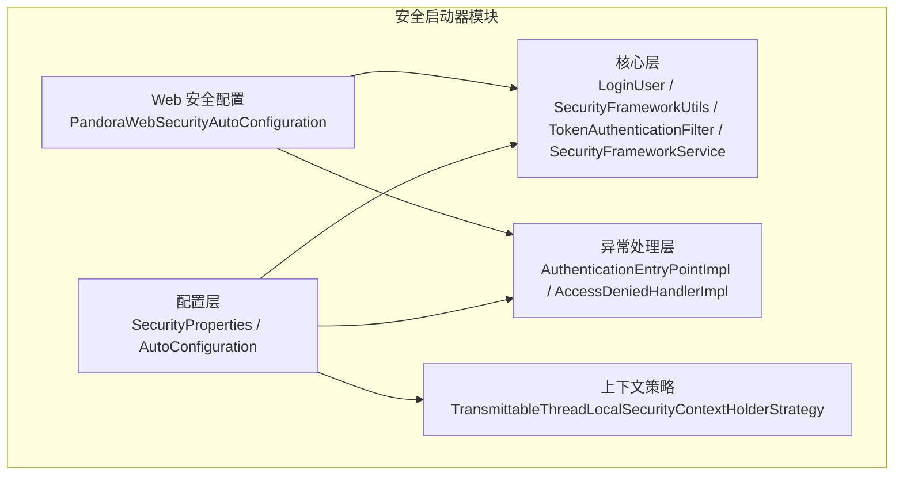
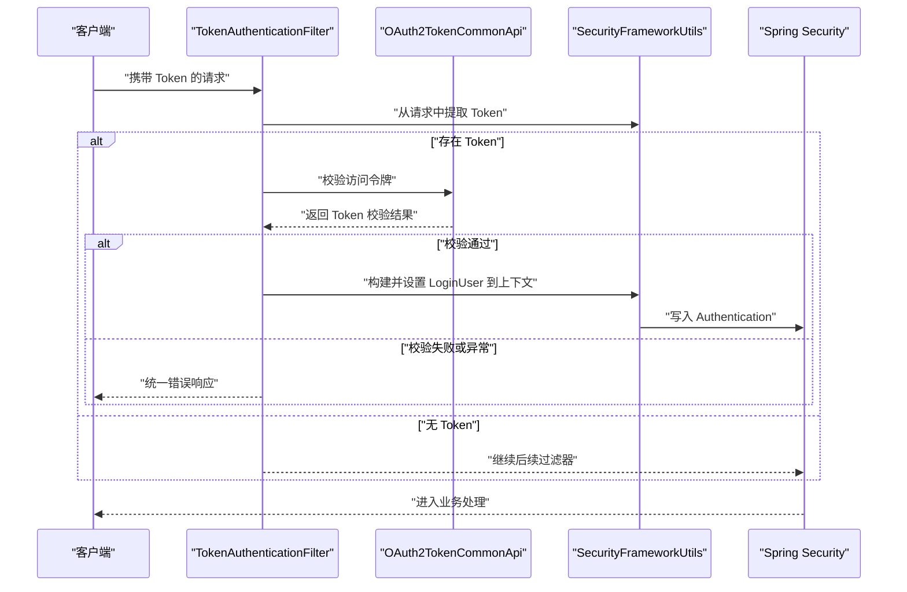
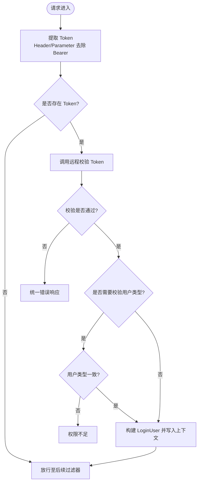
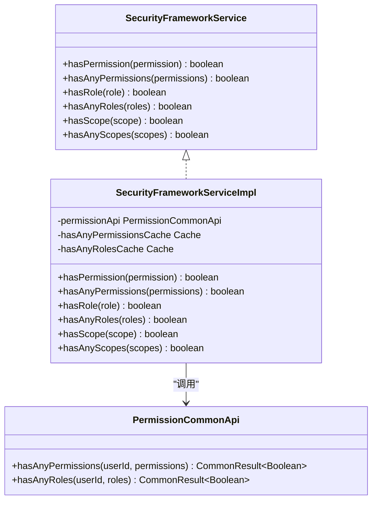
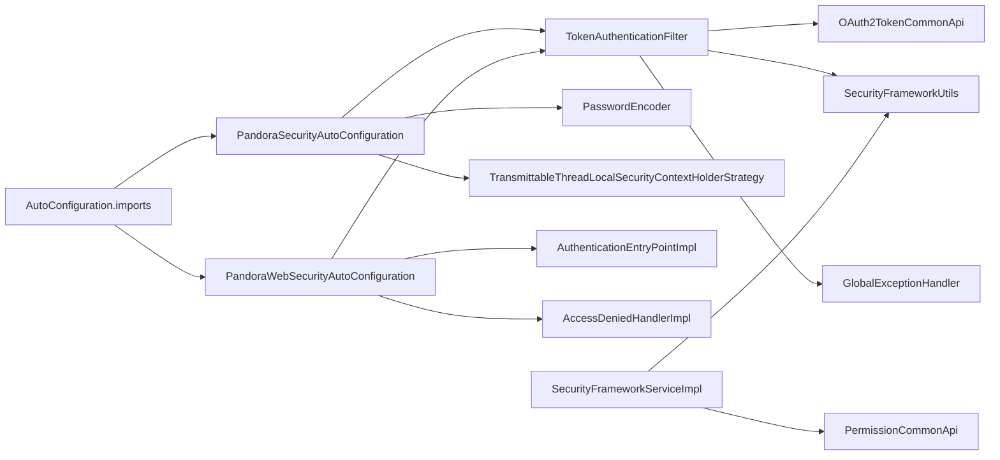

# 安全启动器

<cite>
**本文引用的文件**
- [SecurityProperties.java](file://pandora-framework/pandora-spring-boot-starter-security/src/main/java/net/ittimeline/pandora/framework/security/config/SecurityProperties.java)
- [TokenAuthenticationFilter.java](file://pandora-framework/pandora-spring-boot-starter-security/src/main/java/net/ittimeline/pandora/framework/security/core/filter/TokenAuthenticationFilter.java)
- [PandoraSecurityAutoConfiguration.java](file://pandora-framework/pandora-spring-boot-starter-security/src/main/java/net/ittimeline/pandora/framework/security/config/PandoraSecurityAutoConfiguration.java)
- [PandoraWebSecurityAutoConfiguration.java](file://pandora-framework/pandora-spring-boot-starter-security/src/main/java/net/ittimeline/pandora/framework/security/config/PandoraWebSecurityAutoConfiguration.java)
- [SecurityFrameworkService.java](file://pandora-framework/pandora-spring-boot-starter-security/src/main/java/net/ittimeline/pandora/framework/security/core/service/SecurityFrameworkService.java)
- [SecurityFrameworkServiceImpl.java](file://pandora-framework/pandora-spring-boot-starter-security/src/main/java/net/ittimeline/pandora/framework/security/core/service/SecurityFrameworkServiceImpl.java)
- [LoginUser.java](file://pandora-framework/pandora-spring-boot-starter-security/src/main/java/net/ittimeline/pandora/framework/security/core/LoginUser.java)
- [SecurityFrameworkUtils.java](file://pandora-framework/pandora-spring-boot-starter-security/src/main/java/net/ittimeline/pandora/framework/security/core/util/SecurityFrameworkUtils.java)
- [TransmittableThreadLocalSecurityContextHolderStrategy.java](file://pandora-framework/pandora-spring-boot-starter-security/src/main/java/net/ittimeline/pandora/framework/security/core/context/TransmittableThreadLocalSecurityContextHolderStrategy.java)
- [AuthenticationEntryPointImpl.java](file://pandora-framework/pandora-spring-boot-starter-security/src/main/java/net/ittimeline/pandora/framework/security/core/handler/AuthenticationEntryPointImpl.java)
- [AccessDeniedHandlerImpl.java](file://pandora-framework/pandora-spring-boot-starter-security/src/main/java/net/ittimeline/pandora/framework/security/core/handler/AccessDeniedHandlerImpl.java)
- [OAuth2TokenCommonApi.java](file://pandora-framework/pandora-common/src/main/java/net/ittimeline/pandora/framework/common/biz/system/oauth2/OAuth2TokenCommonApi.java)
- [PermissionCommonApi.java](file://pandora-framework/pandora-common/src/main/java/net/ittimeline/pandora/framework/common/biz/system/permission/PermissionCommonApi.java)
- [org.springframework.boot.autoconfigure.AutoConfiguration.imports](file://pandora-framework/pandora-spring-boot-starter-security/src/main/resources/META-INF/spring/org.springframework.boot.autoconfigure.AutoConfiguration.imports)
</cite>

## 目录
1. [简介](#简介)
2. [项目结构](#项目结构)
3. [核心组件](#核心组件)
4. [架构总览](#架构总览)
5. [详细组件分析](#详细组件分析)
6. [依赖分析](#依赖分析)
7. [性能考量](#性能考量)
8. [故障排查指南](#故障排查指南)
9. [结论](#结论)
10. [附录](#附录)

## 简介
本文件面向“Pandora Cloud 安全启动器”，系统性阐述其安全认证机制与权限管理能力。内容覆盖：
- OAuth2.0 认证流程与 Token 验证机制
- 权限检查逻辑与授权范围（Scope）校验
- SecurityProperties 配置项的使用方法与最佳实践
- JWT Token 的接入方式与第三方认证服务集成思路
- TokenAuthenticationFilter 的工作原理与在 Spring Security 过滤器链中的位置
- 与 Spring Security 的集成方式及异常处理策略

## 项目结构
安全启动器位于 pandora-spring-boot-starter-security 模块，围绕 Spring Security 与自研安全框架构建，关键目录与职责如下：
- config：自动装配与配置类，负责注册安全处理器、过滤器与上下文策略
- core：核心安全模型与工具，包含 LoginUser、SecurityFrameworkUtils、TokenAuthenticationFilter、SecurityFrameworkService 及其实现
- handler：认证入口与权限不足处理器，统一输出错误响应
- context：基于 TransmittableThreadLocal 的安全上下文持有策略，解决异步场景丢失问题
- resources/META-INF/spring：Spring Boot 自动装配导入清单

图表来源
- [PandoraSecurityAutoConfiguration.java:1-99](file://pandora-framework/pandora-spring-boot-starter-security/src/main/java/net/ittimeline/pandora/framework/security/config/PandoraSecurityAutoConfiguration.java#L1-L99)
- [PandoraWebSecurityAutoConfiguration.java:1-223](file://pandora-framework/pandora-spring-boot-starter-security/src/main/java/net/ittimeline/pandora/framework/security/config/PandoraWebSecurityAutoConfiguration.java#L1-L223)
- [TokenAuthenticationFilter.java:1-157](file://pandora-framework/pandora-spring-boot-starter-security/src/main/java/net/ittimeline/pandora/framework/security/core/filter/TokenAuthenticationFilter.java#L1-L157)
- [SecurityFrameworkUtils.java:1-163](file://pandora-framework/pandora-spring-boot-starter-security/src/main/java/net/ittimeline/pandora/framework/security/core/util/SecurityFrameworkUtils.java#L1-L163)
- [TransmittableThreadLocalSecurityContextHolderStrategy.java:1-50](file://pandora-framework/pandora-spring-boot-starter-security/src/main/java/net/ittimeline/pandora/framework/security/core/context/TransmittableThreadLocalSecurityContextHolderStrategy.java#L1-L50)
- [AuthenticationEntryPointImpl.java:1-38](file://pandora-framework/pandora-spring-boot-starter-security/src/main/java/net/ittimeline/pandora/framework/security/core/handler/AuthenticationEntryPointImpl.java#L1-L38)
- [AccessDeniedHandlerImpl.java:1-44](file://pandora-framework/pandora-spring-boot-starter-security/src/main/java/net/ittimeline/pandora/framework/security/core/handler/AccessDeniedHandlerImpl.java#L1-L44)

章节来源
- [org.springframework.boot.autoconfigure.AutoConfiguration.imports:1-6](file://pandora-framework/pandora-spring-boot-starter-security/src/main/resources/META-INF/spring/org.springframework.boot.autoconfigure.AutoConfiguration.imports#L1-L6)

## 核心组件
- SecurityProperties：集中管理安全相关配置，如 Token 请求头/参数、Mock 模式、免登录 URL 列表、密码编码复杂度等
- TokenAuthenticationFilter：在过滤器链中提取并校验 Token，构建 LoginUser 并写入 Spring Security 上下文
- SecurityFrameworkService/Impl：封装权限、角色、授权范围的检查逻辑，支持缓存与跨租户场景
- SecurityFrameworkUtils：提供从请求中提取 Token、设置/获取当前用户、构建认证对象等工具方法
- PandoraWebSecurityAutoConfiguration：定义 URL 权限规则、禁用 CSRF/Session、注册异常处理器与过滤器
- AuthenticationEntryPointImpl / AccessDeniedHandlerImpl：统一会话未认证与权限不足的响应
- TransmittableThreadLocalSecurityContextHolderStrategy：替换默认上下文策略，保障异步场景下的安全上下文传递
- OAuth2TokenCommonApi / PermissionCommonApi：通过 Feign 调用系统服务完成 Token 校验与权限/角色/Scope 查询

章节来源
- [SecurityProperties.java:19-57](file://pandora-framework/pandora-spring-boot-starter-security/src/main/java/net/ittimeline/pandora/framework/security/config/SecurityProperties.java#L19-L57)
- [TokenAuthenticationFilter.java:37-157](file://pandora-framework/pandora-spring-boot-starter-security/src/main/java/net/ittimeline/pandora/framework/security/core/filter/TokenAuthenticationFilter.java#L37-L157)
- [SecurityFrameworkService.java:10-60](file://pandora-framework/pandora-spring-boot-starter-security/src/main/java/net/ittimeline/pandora/framework/security/core/service/SecurityFrameworkService.java#L10-L60)
- [SecurityFrameworkServiceImpl.java:28-124](file://pandora-framework/pandora-spring-boot-starter-security/src/main/java/net/ittimeline/pandora/framework/security/core/service/SecurityFrameworkServiceImpl.java#L28-L124)
- [SecurityFrameworkUtils.java:26-163](file://pandora-framework/pandora-spring-boot-starter-security/src/main/java/net/ittimeline/pandora/framework/security/core/util/SecurityFrameworkUtils.java#L26-L163)
- [PandoraWebSecurityAutoConfiguration.java:48-223](file://pandora-framework/pandora-spring-boot-starter-security/src/main/java/net/ittimeline/pandora/framework/security/config/PandoraWebSecurityAutoConfiguration.java#L48-L223)
- [AuthenticationEntryPointImpl.java:26-38](file://pandora-framework/pandora-spring-boot-starter-security/src/main/java/net/ittimeline/pandora/framework/security/core/handler/AuthenticationEntryPointImpl.java#L26-L38)
- [AccessDeniedHandlerImpl.java:30-44](file://pandora-framework/pandora-spring-boot-starter-security/src/main/java/net/ittimeline/pandora/framework/security/core/handler/AccessDeniedHandlerImpl.java#L30-L44)
- [TransmittableThreadLocalSecurityContextHolderStrategy.java:17-50](file://pandora-framework/pandora-spring-boot-starter-security/src/main/java/net/ittimeline/pandora/framework/security/core/context/TransmittableThreadLocalSecurityContextHolderStrategy.java#L17-L50)
- [OAuth2TokenCommonApi.java:20-34](file://pandora-framework/pandora-common/src/main/java/net/ittimeline/pandora/framework/common/biz/system/oauth2/OAuth2TokenCommonApi.java#L20-L34)
- [PermissionCommonApi.java:20-46](file://pandora-framework/pandora-common/src/main/java/net/ittimeline/pandora/framework/common/biz/system/permission/PermissionCommonApi.java#L20-L46)

## 架构总览
安全启动器通过自动配置类注册过滤器与处理器，结合 Web 安全配置类完成 URL 权限控制；TokenAuthenticationFilter 在 Spring Security 过滤器链之前执行，负责 Token 校验与用户上下文注入。

图表来源
- [TokenAuthenticationFilter.java:47-107](file://pandora-framework/pandora-spring-boot-starter-security/src/main/java/net/ittimeline/pandora/framework/security/core/filter/TokenAuthenticationFilter.java#L47-L107)
- [SecurityFrameworkUtils.java:44-144](file://pandora-framework/pandora-spring-boot-starter-security/src/main/java/net/ittimeline/pandora/framework/security/core/util/SecurityFrameworkUtils.java#L44-L144)
- [OAuth2TokenCommonApi.java:27-30](file://pandora-framework/pandora-common/src/main/java/net/ittimeline/pandora/framework/common/biz/system/oauth2/OAuth2TokenCommonApi.java#L27-L30)

## 详细组件分析

### OAuth2.0 认证流程与 Token 验证机制
- Token 提取：优先从请求头读取，其次从查询参数读取；若带有 Bearer 前缀则去除
- 校验调用：通过 OAuth2TokenCommonApi.checkAccessToken 远程校验 Token
- 用户类型一致性：当请求路径包含用户类型时，需与 Token 中用户类型一致
- Mock 模式：开发调试可用，需显式开启并使用约定前缀与用户 ID 组合的模拟 Token
- 上下文注入：成功后将 LoginUser 写入 Spring Security 上下文，并同步到请求上下文以便日志等组件使用

图表来源
- [TokenAuthenticationFilter.java:57-107](file://pandora-framework/pandora-spring-boot-starter-security/src/main/java/net/ittimeline/pandora/framework/security/core/filter/TokenAuthenticationFilter.java#L57-L107)
- [SecurityFrameworkUtils.java:44-57](file://pandora-framework/pandora-spring-boot-starter-security/src/main/java/net/ittimeline/pandora/framework/security/core/util/SecurityFrameworkUtils.java#L44-L57)
- [OAuth2TokenCommonApi.java:27-30](file://pandora-framework/pandora-common/src/main/java/net/ittimeline/pandora/framework/common/biz/system/oauth2/OAuth2TokenCommonApi.java#L27-L30)

章节来源
- [TokenAuthenticationFilter.java:47-157](file://pandora-framework/pandora-spring-boot-starter-security/src/main/java/net/ittimeline/pandora/framework/security/core/filter/TokenAuthenticationFilter.java#L47-L157)
- [SecurityFrameworkUtils.java:26-163](file://pandora-framework/pandora-spring-boot-starter-security/src/main/java/net/ittimeline/pandora/framework/security/core/util/SecurityFrameworkUtils.java#L26-L163)

### 权限检查逻辑与授权范围（Scope）校验
- 权限/角色/Scope 检查由 SecurityFrameworkServiceImpl 实现
- 缓存策略：对 hasAnyPermissions 与 hasAnyRoles 使用 LoadingCache，提升频繁校验性能
- 跨租户场景：当访问租户与当前租户不一致时，跳过权限校验（避免跨租户权限冲突）
- Scope 校验：直接对比 LoginUser 中的 scopes 与目标 scope 数组

图表来源
- [SecurityFrameworkService.java:10-60](file://pandora-framework/pandora-spring-boot-starter-security/src/main/java/net/ittimeline/pandora/framework/security/core/service/SecurityFrameworkService.java#L10-L60)
- [SecurityFrameworkServiceImpl.java:28-124](file://pandora-framework/pandora-spring-boot-starter-security/src/main/java/net/ittimeline/pandora/framework/security/core/service/SecurityFrameworkServiceImpl.java#L28-L124)
- [PermissionCommonApi.java:26-42](file://pandora-framework/pandora-common/src/main/java/net/ittimeline/pandora/framework/common/biz/system/permission/PermissionCommonApi.java#L26-L42)

章节来源
- [SecurityFrameworkServiceImpl.java:28-124](file://pandora-framework/pandora-spring-boot-starter-security/src/main/java/net/ittimeline/pandora/framework/security/core/service/SecurityFrameworkServiceImpl.java#L28-L124)

### SecurityProperties 配置属性详解
- tokenHeader：HTTP 请求中携带访问令牌的请求头名称，默认 Authorization
- tokenParameter：HTTP 请求中携带访问令牌的查询参数名称，默认 token
- mockEnable：是否启用 Mock 模式（开发调试），默认关闭
- mockSecret：Mock 模式的密钥前缀，格式为 mockSecret + 用户编号
- permitAllUrls：免登录的 URL 列表
- passwordEncoderLength：BCrypt 密码编码复杂度，数值越高开销越大

章节来源
- [SecurityProperties.java:19-57](file://pandora-framework/pandora-spring-boot-starter-security/src/main/java/net/ittimeline/pandora/framework/security/config/SecurityProperties.java#L19-L57)

### TokenAuthenticationFilter 工作原理与过滤器链
- 执行时机：在 UsernamePasswordAuthenticationFilter 之前，确保在 Spring Security 认证前完成 Token 校验与用户注入
- 用户来源：
  - Header(login-user)：网关或其他服务透传的已认证用户
  - Token：标准 OAuth2.0 Token，经远程校验后构建 LoginUser
  - Mock：开发模式下使用 mockSecret + userId 的模拟 Token
- 用户类型一致性：针对 /admin-api/* 与 /app-api/* 路径，要求 Token 中用户类型与请求上下文一致
- 异常处理：通过全局异常处理器统一输出错误响应

章节来源
- [PandoraWebSecurityAutoConfiguration.java:152-154](file://pandora-framework/pandora-spring-boot-starter-security/src/main/java/net/ittimeline/pandora/framework/security/config/PandoraWebSecurityAutoConfiguration.java#L152-L154)
- [TokenAuthenticationFilter.java:47-157](file://pandora-framework/pandora-spring-boot-starter-security/src/main/java/net/ittimeline/pandora/framework/security/core/filter/TokenAuthenticationFilter.java#L47-L157)

### 与 Spring Security 的集成方式
- 禁用 CSRF 与 Session：基于 Token 机制，采用 STATELESS 策略
- 异常处理：统一由 AuthenticationEntryPointImpl 与 AccessDeniedHandlerImpl 输出 JSON 错误码
- URL 权限规则：
  - 静态资源匿名访问
  - 通过 @PermitAll 注解与 SecurityProperties.permitAllUrls 配置免登录
  - 兜底规则：其余请求均需认证
- 方法级权限：通过 @EnableMethodSecurity(securedEnabled = true) 支持基于注解的权限控制

章节来源
- [PandoraWebSecurityAutoConfiguration.java:112-155](file://pandora-framework/pandora-spring-boot-starter-security/src/main/java/net/ittimeline/pandora/framework/security/config/PandoraWebSecurityAutoConfiguration.java#L112-L155)

### 登录用户模型与上下文策略
- LoginUser：包含用户标识、用户类型、额外信息、租户、授权范围、过期时间等
- SecurityFrameworkUtils：提供 obtainAuthorization、setLoginUser、getLoginUser 等常用方法
- TransmittableThreadLocalSecurityContextHolderStrategy：替换默认上下文策略，解决异步场景丢失问题

章节来源
- [LoginUser.java:20-77](file://pandora-framework/pandora-spring-boot-starter-security/src/main/java/net/ittimeline/pandora/framework/security/core/LoginUser.java#L20-L77)
- [SecurityFrameworkUtils.java:26-163](file://pandora-framework/pandora-spring-boot-starter-security/src/main/java/net/ittimeline/pandora/framework/security/core/util/SecurityFrameworkUtils.java#L26-L163)
- [TransmittableThreadLocalSecurityContextHolderStrategy.java:17-50](file://pandora-framework/pandora-spring-boot-starter-security/src/main/java/net/ittimeline/pandora/framework/security/core/context/TransmittableThreadLocalSecurityContextHolderStrategy.java#L17-L50)

## 依赖分析
- 自动装配导入：通过 META-INF/spring 自动导入三个自动配置类，确保安全启动器按序加载
- 过滤器链耦合：TokenAuthenticationFilter 依赖 SecurityProperties、GlobalExceptionHandler、OAuth2TokenCommonApi
- 权限检查依赖：SecurityFrameworkServiceImpl 依赖 PermissionCommonApi 与 SecurityFrameworkUtils
- 异常处理：AuthenticationEntryPointImpl 与 AccessDeniedHandlerImpl 依赖通用响应工具

图表来源
- [org.springframework.boot.autoconfigure.AutoConfiguration.imports:1-6](file://pandora-framework/pandora-spring-boot-starter-security/src/main/resources/META-INF/spring/org.springframework.boot.autoconfigure.AutoConfiguration.imports#L1-L6)
- [PandoraSecurityAutoConfiguration.java:36-99](file://pandora-framework/pandora-spring-boot-starter-security/src/main/java/net/ittimeline/pandora/framework/security/config/PandoraSecurityAutoConfiguration.java#L36-L99)
- [PandoraWebSecurityAutoConfiguration.java:48-223](file://pandora-framework/pandora-spring-boot-starter-security/src/main/java/net/ittimeline/pandora/framework/security/config/PandoraWebSecurityAutoConfiguration.java#L48-L223)
- [TokenAuthenticationFilter.java:41-45](file://pandora-framework/pandora-spring-boot-starter-security/src/main/java/net/ittimeline/pandora/framework/security/core/filter/TokenAuthenticationFilter.java#L41-L45)
- [SecurityFrameworkServiceImpl.java:31-31](file://pandora-framework/pandora-spring-boot-starter-security/src/main/java/net/ittimeline/pandora/framework/security/core/service/SecurityFrameworkServiceImpl.java#L31-L31)

章节来源
- [org.springframework.boot.autoconfigure.AutoConfiguration.imports:1-6](file://pandora-framework/pandora-spring-boot-starter-security/src/main/resources/META-INF/spring/org.springframework.boot.autoconfigure.AutoConfiguration.imports#L1-L6)

## 性能考量
- 缓存优化：SecurityFrameworkServiceImpl 对权限/角色检查使用 LoadingCache，建议合理设置缓存过期时间与并发加载策略
- 跨租户跳检：当访问租户与当前租户不一致时跳过权限校验，避免无效调用
- 密码编码复杂度：passwordEncoderLength 影响 BCrypt 开销，建议根据硬件与安全需求平衡配置
- 过滤器链顺序：确保 TokenAuthenticationFilter 在认证过滤器之前，减少重复校验

## 故障排查指南
- 401 未认证：确认请求是否携带有效 Token，或是否命中免登录规则
- 403 权限不足：核对用户类型是否一致、Scope 是否匹配、角色/权限是否正确
- Mock 模式无效：确认 mockEnable=true 且 Token 以 mockSecret 前缀开头
- 跨租户权限异常：检查 visitTenantId 与 tenantId 是否一致，必要时调整业务逻辑
- 异步上下文丢失：确认已启用 TransmittableThreadLocalSecurityContextHolderStrategy

章节来源
- [AuthenticationEntryPointImpl.java:26-38](file://pandora-framework/pandora-spring-boot-starter-security/src/main/java/net/ittimeline/pandora/framework/security/core/handler/AuthenticationEntryPointImpl.java#L26-L38)
- [AccessDeniedHandlerImpl.java:30-44](file://pandora-framework/pandora-spring-boot-starter-security/src/main/java/net/ittimeline/pandora/framework/security/core/handler/AccessDeniedHandlerImpl.java#L30-L44)
- [TokenAuthenticationFilter.java:119-131](file://pandora-framework/pandora-spring-boot-starter-security/src/main/java/net/ittimeline/pandora/framework/security/core/filter/TokenAuthenticationFilter.java#L119-L131)
- [SecurityFrameworkUtils.java:151-161](file://pandora-framework/pandora-spring-boot-starter-security/src/main/java/net/ittimeline/pandora/framework/security/core/util/SecurityFrameworkUtils.java#L151-L161)

## 结论
Pandora Cloud 安全启动器以 TokenAuthenticationFilter 为核心，结合 OAuth2.0 远程校验与本地 Mock 模式，实现了灵活的认证与权限控制；通过 SecurityProperties 统一配置、SecurityFrameworkServiceImpl 提供高效权限检查、Web 安全配置类明确 URL 规则，形成一套可扩展、易维护的安全体系。建议在生产环境关闭 Mock 模式，合理配置缓存与加密复杂度，并结合业务场景完善权限与 Scope 设计。

## 附录

### 安全配置示例（要点说明）
- 启用 Mock 模式（仅开发）：设置 mockEnable=true，使用 mockSecret 前缀 + 用户编号的模拟 Token
- 自定义 Token 请求头/参数：通过 tokenHeader 与 tokenParameter 调整
- 免登录 URL：通过 permitAllUrls 或 @PermitAll 注解配置
- 密码编码复杂度：passwordEncoderLength 控制 BCrypt 开销
- JWT Token 接入：若第三方服务返回 JWT，需在远程校验接口中完成签名校验与载荷解析，最终返回 LoginUser 所需字段

章节来源
- [SecurityProperties.java:19-57](file://pandora-framework/pandora-spring-boot-starter-security/src/main/java/net/ittimeline/pandora/framework/security/config/SecurityProperties.java#L19-L57)
- [TokenAuthenticationFilter.java:119-131](file://pandora-framework/pandora-spring-boot-starter-security/src/main/java/net/ittimeline/pandora/framework/security/core/filter/TokenAuthenticationFilter.java#L119-L131)