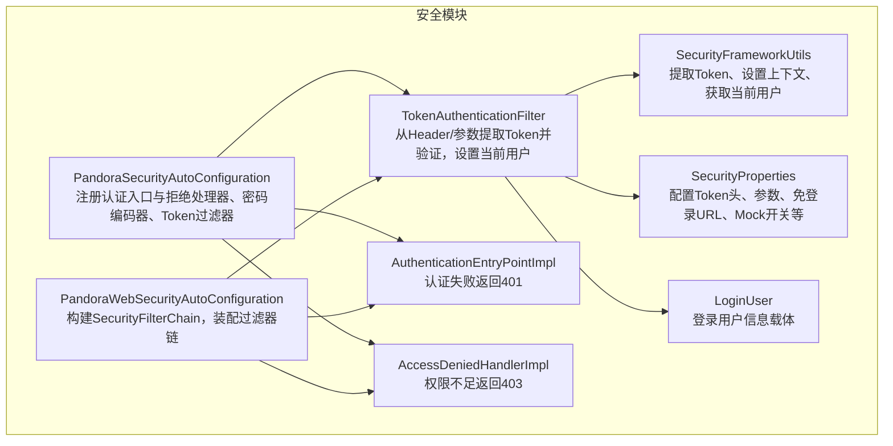
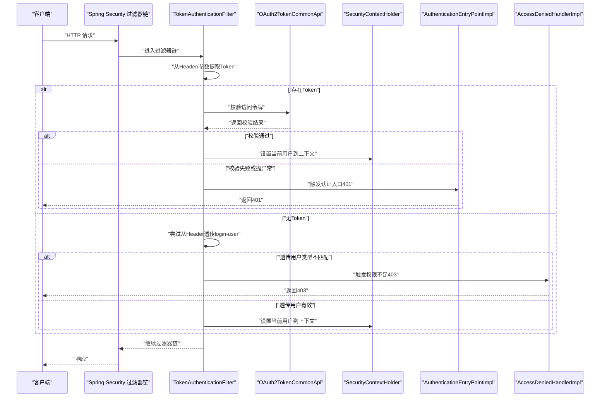
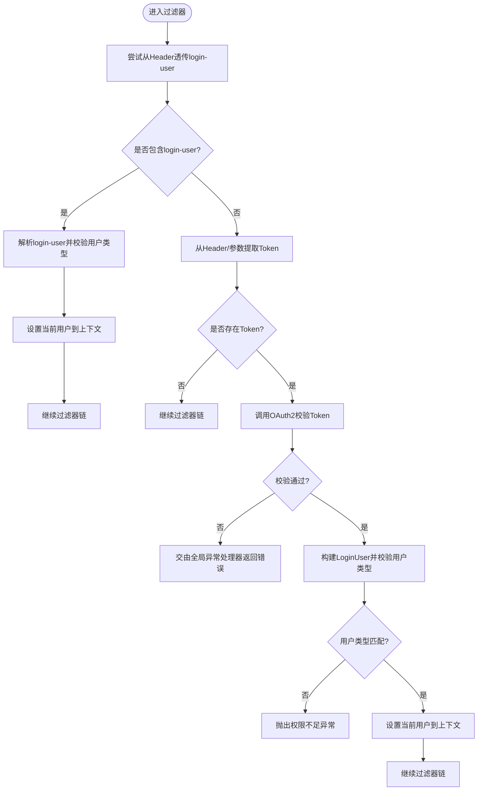
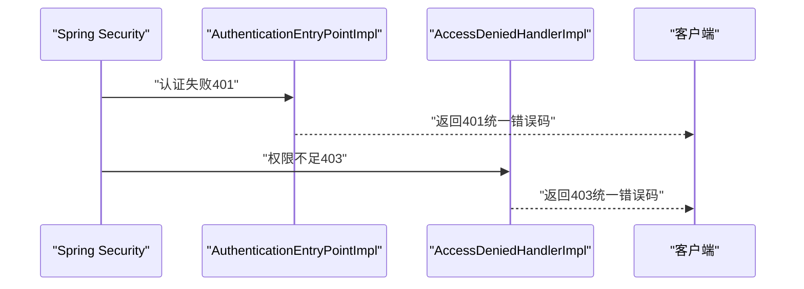
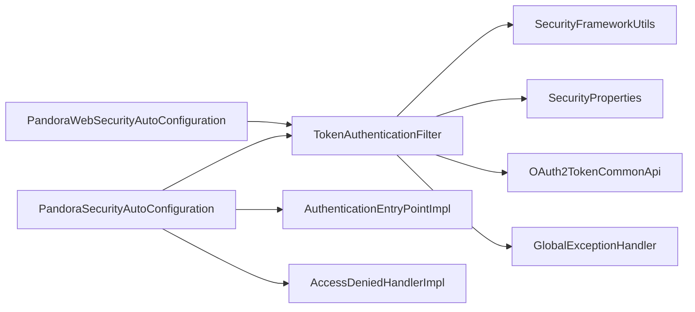

# 安全过滤器

<cite>
**本文引用的文件**
- [TokenAuthenticationFilter.java](file://pandora-framework/pandora-spring-boot-starter-security/src/main/java/net/ittimeline/pandora/framework/security/core/filter/TokenAuthenticationFilter.java)
- [AuthenticationEntryPointImpl.java](file://pandora-framework/pandora-spring-boot-starter-security/src/main/java/net/ittimeline/pandora/framework/security/core/handler/AuthenticationEntryPointImpl.java)
- [AccessDeniedHandlerImpl.java](file://pandora-framework/pandora-spring-boot-starter-security/src/main/java/net/ittimeline/pandora/framework/security/core/handler/AccessDeniedHandlerImpl.java)
- [PandoraSecurityAutoConfiguration.java](file://pandora-framework/pandora-spring-boot-starter-security/src/main/java/net/ittimeline/pandora/framework/security/config/PandoraSecurityAutoConfiguration.java)
- [PandoraWebSecurityAutoConfiguration.java](file://pandora-framework/pandora-spring-boot-starter-security/src/main/java/net/ittimeline/pandora/framework/security/config/PandoraWebSecurityAutoConfiguration.java)
- [SecurityProperties.java](file://pandora-framework/pandora-spring-boot-starter-security/src/main/java/net/ittimeline/pandora/framework/security/config/SecurityProperties.java)
- [SecurityFrameworkUtils.java](file://pandora-framework/pandora-spring-boot-starter-security/src/main/java/net/ittimeline/pandora/framework/security/core/util/SecurityFrameworkUtils.java)
- [LoginUser.java](file://pandora-framework/pandora-spring-boot-starter-security/src/main/java/net/ittimeline/pandora/framework/security/core/LoginUser.java)
- [WebFilterOrderConstants.java](file://pandora-framework/pandora-common/src/main/java/net/ittimeline/pandora/framework/common/constants/WebFilterOrderConstants.java)
- [GlobalErrorCodeConstants.java](file://pandora-framework/pandora-common/src/main/java/net/ittimeline/pandora/framework/common/exception/enums/GlobalErrorCodeConstants.java)
</cite>

## 目录
1. [简介](#简介)
2. [项目结构](#项目结构)
3. [核心组件](#核心组件)
4. [架构总览](#架构总览)
5. [组件详解](#组件详解)
6. [依赖关系分析](#依赖关系分析)
7. [性能考量](#性能考量)
8. [故障排查指南](#故障排查指南)
9. [结论](#结论)
10. [附录](#附录)

## 简介
本文件围绕安全过滤器功能展开，重点阐述 TokenAuthenticationFilter 的工作原理与实现细节，覆盖过滤器链中的执行顺序、Token 提取与验证逻辑；同时说明 AuthenticationEntryPointImpl 与 AccessDeniedHandlerImpl 的异常处理机制，包括认证失败与权限不足的处理策略。文档还提供完整的过滤器配置示例，涵盖自定义过滤器、调整过滤器顺序以及实现自定义认证逻辑的方法，并解释过滤器与 Spring Security 的集成方式及性能优化策略。

## 项目结构
本项目的安全能力由独立的 Spring Boot Starter 模块提供，核心位于 security 模块中，包含自动配置、过滤器、异常处理器、工具类与实体模型。Web 层通过 WebSecurityAutoConfiguration 将过滤器装配进 Spring Security 的过滤器链，同时通过 SecurityProperties 提供可配置项。

图表来源
- [PandoraSecurityAutoConfiguration.java:36-98](file://pandora-framework/pandora-spring-boot-starter-security/src/main/java/net/ittimeline/pandora/framework/security/config/PandoraSecurityAutoConfiguration.java#L36-L98)
- [PandoraWebSecurityAutoConfiguration.java:48-155](file://pandora-framework/pandora-spring-boot-starter-security/src/main/java/net/ittimeline/pandora/framework/security/config/PandoraWebSecurityAutoConfiguration.java#L48-L155)
- [TokenAuthenticationFilter.java:37-157](file://pandora-framework/pandora-spring-boot-starter-security/src/main/java/net/ittimeline/pandora/framework/security/core/filter/TokenAuthenticationFilter.java#L37-L157)
- [AuthenticationEntryPointImpl.java:26-37](file://pandora-framework/pandora-spring-boot-starter-security/src/main/java/net/ittimeline/pandora/framework/security/core/handler/AuthenticationEntryPointImpl.java#L26-L37)
- [AccessDeniedHandlerImpl.java:30-43](file://pandora-framework/pandora-spring-boot-starter-security/src/main/java/net/ittimeline/pandora/framework/security/core/handler/AccessDeniedHandlerImpl.java#L30-L43)
- [SecurityProperties.java:19-57](file://pandora-framework/pandora-spring-boot-starter-security/src/main/java/net/ittimeline/pandora/framework/security/config/SecurityProperties.java#L19-L57)
- [SecurityFrameworkUtils.java:26-162](file://pandora-framework/pandora-spring-boot-starter-security/src/main/java/net/ittimeline/pandora/framework/security/core/util/SecurityFrameworkUtils.java#L26-L162)
- [LoginUser.java:20-76](file://pandora-framework/pandora-spring-boot-starter-security/src/main/java/net/ittimeline/pandora/framework/security/core/LoginUser.java#L20-L76)

章节来源
- [PandoraSecurityAutoConfiguration.java:36-98](file://pandora-framework/pandora-spring-boot-starter-security/src/main/java/net/ittimeline/pandora/framework/security/config/PandoraSecurityAutoConfiguration.java#L36-L98)
- [PandoraWebSecurityAutoConfiguration.java:48-155](file://pandora-framework/pandora-spring-boot-starter-security/src/main/java/net/ittimeline/pandora/framework/security/config/PandoraWebSecurityAutoConfiguration.java#L48-L155)

## 核心组件
- TokenAuthenticationFilter：负责从请求中提取 Token，调用 OAuth2TokenCommonApi 校验令牌有效性，构建 LoginUser 并写入 Spring Security 上下文；支持通过 Header 或参数传递 Token，并支持基于 Header 透传的 login-user 字段。
- AuthenticationEntryPointImpl：当访问受保护资源但未认证时，返回统一错误码（401），便于前端重定向至登录页。
- AccessDeniedHandlerImpl：当已认证但权限不足时，返回统一错误码（403），并记录警告日志。
- SecurityProperties：提供可配置项，如 Token 头名称、参数名、免登录 URL 列表、Mock 开关与密钥等。
- SecurityFrameworkUtils：提供从请求中提取 Token、设置/获取当前用户、构建认证对象等工具方法。
- LoginUser：承载当前登录用户信息，包括用户编号、用户类型、额外信息、租户、授权范围、过期时间等。

章节来源
- [TokenAuthenticationFilter.java:37-157](file://pandora-framework/pandora-spring-boot-starter-security/src/main/java/net/ittimeline/pandora/framework/security/core/filter/TokenAuthenticationFilter.java#L37-L157)
- [AuthenticationEntryPointImpl.java:26-37](file://pandora-framework/pandora-spring-boot-starter-security/src/main/java/net/ittimeline/pandora/framework/security/core/handler/AuthenticationEntryPointImpl.java#L26-L37)
- [AccessDeniedHandlerImpl.java:30-43](file://pandora-framework/pandora-spring-boot-starter-security/src/main/java/net/ittimeline/pandora/framework/security/core/handler/AccessDeniedHandlerImpl.java#L30-L43)
- [SecurityProperties.java:19-57](file://pandora-framework/pandora-spring-boot-starter-security/src/main/java/net/ittimeline/pandora/framework/security/config/SecurityProperties.java#L19-L57)
- [SecurityFrameworkUtils.java:26-162](file://pandora-framework/pandora-spring-boot-starter-security/src/main/java/net/ittimeline/pandora/framework/security/core/util/SecurityFrameworkUtils.java#L26-L162)
- [LoginUser.java:20-76](file://pandora-framework/pandora-spring-boot-starter-security/src/main/java/net/ittimeline/pandora/framework/security/core/LoginUser.java#L20-L76)

## 架构总览
下图展示了过滤器链与异常处理的整体交互流程，包括 Token 提取、验证、上下文设置以及异常处理分支。

图表来源
- [PandoraWebSecurityAutoConfiguration.java:112-155](file://pandora-framework/pandora-spring-boot-starter-security/src/main/java/net/ittimeline/pandora/framework/security/config/PandoraWebSecurityAutoConfiguration.java#L112-L155)
- [TokenAuthenticationFilter.java:47-82](file://pandora-framework/pandora-spring-boot-starter-security/src/main/java/net/ittimeline/pandora/framework/security/core/filter/TokenAuthenticationFilter.java#L47-L82)
- [AuthenticationEntryPointImpl.java:30-35](file://pandora-framework/pandora-spring-boot-starter-security/src/main/java/net/ittimeline/pandora/framework/security/core/handler/AuthenticationEntryPointImpl.java#L30-L35)
- [AccessDeniedHandlerImpl.java:34-42](file://pandora-framework/pandora-spring-boot-starter-security/src/main/java/net/ittimeline/pandora/framework/security/core/handler/AccessDeniedHandlerImpl.java#L34-L42)
- [SecurityFrameworkUtils.java:124-136](file://pandora-framework/pandora-spring-boot-starter-security/src/main/java/net/ittimeline/pandora/framework/security/core/util/SecurityFrameworkUtils.java#L124-L136)

## 组件详解

### TokenAuthenticationFilter 工作原理与实现细节
- 执行顺序与链路
  - 在 WebSecurityAutoConfiguration 中通过 addFilterBefore 将 TokenAuthenticationFilter 插入到 UsernamePasswordAuthenticationFilter 之前，确保在 Spring Security 默认认证之前完成 Token 校验与用户上下文设置。
- Token 提取逻辑
  - 优先从 Header 获取，若为空则从参数获取；支持去除 Bearer 前缀，兼容标准 OAuth2 规范。
- 验证与用户构建
  - 调用 OAuth2TokenCommonApi 校验访问令牌，成功后根据返回的用户信息构建 LoginUser，并与用户类型进行比对（仅对特定前缀的路径生效）。
  - 若校验失败或抛出 ServiceException，直接交由全局异常处理器转换为统一响应并结束请求。
- Mock 登录
  - 在启用 Mock 且 Token 以指定密钥开头时，允许通过 Token 内嵌用户编号进行模拟登录，便于本地调试。
- Header 透传
  - 支持通过 Header 中的 login-user 字段透传已构建的用户信息，便于网关或内部服务直传场景；同样进行用户类型校验。

图表来源
- [TokenAuthenticationFilter.java:47-155](file://pandora-framework/pandora-spring-boot-starter-security/src/main/java/net/ittimeline/pandora/framework/security/core/filter/TokenAuthenticationFilter.java#L47-L155)
- [SecurityFrameworkUtils.java:44-57](file://pandora-framework/pandora-spring-boot-starter-security/src/main/java/net/ittimeline/pandora/framework/security/core/util/SecurityFrameworkUtils.java#L44-L57)
- [SecurityProperties.java:24-34](file://pandora-framework/pandora-spring-boot-starter-security/src/main/java/net/ittimeline/pandora/framework/security/config/SecurityProperties.java#L24-L34)

章节来源
- [TokenAuthenticationFilter.java:37-157](file://pandora-framework/pandora-spring-boot-starter-security/src/main/java/net/ittimeline/pandora/framework/security/core/filter/TokenAuthenticationFilter.java#L37-L157)
- [PandoraWebSecurityAutoConfiguration.java:152-154](file://pandora-framework/pandora-spring-boot-starter-security/src/main/java/net/ittimeline/pandora/framework/security/config/PandoraWebSecurityAutoConfiguration.java#L152-L154)

### AuthenticationEntryPointImpl 与 AccessDeniedHandlerImpl 异常处理机制
- 认证失败（401）
  - 当访问受保护资源但未认证时，由 Spring Security 的 ExceptionTranslationFilter 触发 AuthenticationEntryPointImpl，返回统一错误码（401），便于前端重定向至登录页。
- 权限不足（403）
  - 当已认证但权限不足时，由 ExceptionTranslationFilter 触发 AccessDeniedHandlerImpl，返回统一错误码（403），并记录警告日志，便于审计与监控。

图表来源
- [AuthenticationEntryPointImpl.java:30-35](file://pandora-framework/pandora-spring-boot-starter-security/src/main/java/net/ittimeline/pandora/framework/security/core/handler/AuthenticationEntryPointImpl.java#L30-L35)
- [AccessDeniedHandlerImpl.java:34-42](file://pandora-framework/pandora-spring-boot-starter-security/src/main/java/net/ittimeline/pandora/framework/security/core/handler/AccessDeniedHandlerImpl.java#L34-L42)
- [GlobalErrorCodeConstants.java:16-41](file://pandora-framework/pandora-common/src/main/java/net/ittimeline/pandora/framework/common/exception/enums/GlobalErrorCodeConstants.java#L16-L41)

章节来源
- [AuthenticationEntryPointImpl.java:26-37](file://pandora-framework/pandora-spring-boot-starter-security/src/main/java/net/ittimeline/pandora/framework/security/core/handler/AuthenticationEntryPointImpl.java#L26-L37)
- [AccessDeniedHandlerImpl.java:30-43](file://pandora-framework/pandora-spring-boot-starter-security/src/main/java/net/ittimeline/pandora/framework/security/core/handler/AccessDeniedHandlerImpl.java#L30-L43)
- [GlobalErrorCodeConstants.java:16-41](file://pandora-framework/pandora-common/src/main/java/net/ittimeline/pandora/framework/common/exception/enums/GlobalErrorCodeConstants.java#L16-L41)

### 过滤器配置示例与自定义扩展
- 自定义过滤器
  - 可参考 TokenAuthenticationFilter 的实现思路，继承 OncePerRequestFilter 并在 WebSecurityAutoConfiguration 中通过 addFilterBefore/After 将自定义过滤器插入到合适位置。
- 调整过滤器顺序
  - 通过 WebSecurityAutoConfiguration 的 addFilterBefore/After 控制与 UsernamePasswordAuthenticationFilter 的相对顺序；也可参考 WebFilterOrderConstants 中的顺序常量，确保与其它过滤器协同。
- 自定义认证逻辑
  - 可在过滤器中替换或扩展 Token 校验逻辑，例如对接不同的鉴权中心或引入多因子认证；注意保持与 SecurityContextHolder 的集成，确保后续授权与业务逻辑可用。

章节来源
- [PandoraWebSecurityAutoConfiguration.java:152-154](file://pandora-framework/pandora-spring-boot-starter-security/src/main/java/net/ittimeline/pandora/framework/security/config/PandoraWebSecurityAutoConfiguration.java#L152-L154)
- [WebFilterOrderConstants.java:11-37](file://pandora-framework/pandora-common/src/main/java/net/ittimeline/pandora/framework/common/constants/WebFilterOrderConstants.java#L11-L37)

### 与 Spring Security 的集成方式
- 自动配置
  - 通过 PandoraSecurityAutoConfiguration 注册 AuthenticationEntryPoint、AccessDeniedHandler、PasswordEncoder、TokenAuthenticationFilter 等 Bean。
- 过滤器链装配
  - 通过 PandoraWebSecurityAutoConfiguration 构建 SecurityFilterChain，并将 TokenAuthenticationFilter 插入到 UsernamePasswordAuthenticationFilter 之前。
- URL 权限控制
  - 通过 @PermitAll 注解扫描与 SecurityProperties 的 permitAllUrls 配置，结合 AuthorizeRequestsCustomizer 实现灵活的权限规则。

章节来源
- [PandoraSecurityAutoConfiguration.java:36-98](file://pandora-framework/pandora-spring-boot-starter-security/src/main/java/net/ittimeline/pandora/framework/security/config/PandoraSecurityAutoConfiguration.java#L36-L98)
- [PandoraWebSecurityAutoConfiguration.java:112-155](file://pandora-framework/pandora-spring-boot-starter-security/src/main/java/net/ittimeline/pandora/framework/security/config/PandoraWebSecurityAutoConfiguration.java#L112-L155)

## 依赖关系分析
- 组件耦合
  - TokenAuthenticationFilter 依赖 SecurityProperties、SecurityFrameworkUtils、OAuth2TokenCommonApi、GlobalExceptionHandler；与 Spring Security 的集成通过 WebSecurityAutoConfiguration 完成。
- 外部依赖
  - OAuth2TokenCommonApi 用于访问令牌校验；WebFrameworkUtils 用于透传租户与用户类型等上下文信息。
- 可能的循环依赖
  - 当前设计通过自动配置类集中装配，未见明显循环依赖迹象。

图表来源
- [TokenAuthenticationFilter.java:41-45](file://pandora-framework/pandora-spring-boot-starter-security/src/main/java/net/ittimeline/pandora/framework/security/core/filter/TokenAuthenticationFilter.java#L41-L45)
- [PandoraWebSecurityAutoConfiguration.java:69-72](file://pandora-framework/pandora-spring-boot-starter-security/src/main/java/net/ittimeline/pandora/framework/security/config/PandoraWebSecurityAutoConfiguration.java#L69-L72)
- [PandoraSecurityAutoConfiguration.java:47-58](file://pandora-framework/pandora-spring-boot-starter-security/src/main/java/net/ittimeline/pandora/framework/security/config/PandoraSecurityAutoConfiguration.java#L47-L58)

章节来源
- [TokenAuthenticationFilter.java:37-157](file://pandora-framework/pandora-spring-boot-starter-security/src/main/java/net/ittimeline/pandora/framework/security/core/filter/TokenAuthenticationFilter.java#L37-L157)
- [PandoraWebSecurityAutoConfiguration.java:48-155](file://pandora-framework/pandora-spring-boot-starter-security/src/main/java/net/ittimeline/pandora/framework/security/config/PandoraWebSecurityAutoConfiguration.java#L48-L155)
- [PandoraSecurityAutoConfiguration.java:36-98](file://pandora-framework/pandora-spring-boot-starter-security/src/main/java/net/ittimeline/pandora/framework/security/config/PandoraSecurityAutoConfiguration.java#L36-L98)

## 性能考量
- 无状态会话
  - 通过 SessionCreationPolicy.STATELESS 禁用 Session，降低服务器内存占用与水平扩展复杂度。
- 过滤器链短路
  - 在 Token 校验失败或异常时尽早返回，减少后续处理开销。
- 缓存与降级
  - 建议对 OAuth2 校验结果进行合理缓存，并在下游服务不可用时提供降级策略（如白名单放行或快速失败）。
- 日志与监控
  - 对 401/403 场景进行聚合统计，识别高频失败路径与攻击行为。

## 故障排查指南
- 401 未登录
  - 检查请求是否携带正确的 Token 头或参数；确认 SecurityProperties 中 tokenHeader 与 tokenParameter 配置一致；核对网关或上游服务是否正确透传。
- 403 权限不足
  - 检查用户类型是否与目标接口要求一致；确认路径前缀是否需要用户类型校验；查看 AccessDeniedHandlerImpl 的日志输出。
- Mock 登录无效
  - 确认 SecurityProperties.mockEnable 已开启且 mockSecret 与 Token 前缀一致；注意生产环境务必关闭该功能。
- 过滤器顺序问题
  - 如出现鉴权前置或日志记录缺失，检查 WebSecurityAutoConfiguration 中 addFilterBefore 的位置，确保与 ApiAccessLogFilter 等顺序协调。

章节来源
- [AuthenticationEntryPointImpl.java:30-35](file://pandora-framework/pandora-spring-boot-starter-security/src/main/java/net/ittimeline/pandora/framework/security/core/handler/AuthenticationEntryPointImpl.java#L30-L35)
- [AccessDeniedHandlerImpl.java:34-42](file://pandora-framework/pandora-spring-boot-starter-security/src/main/java/net/ittimeline/pandora/framework/security/core/handler/AccessDeniedHandlerImpl.java#L34-L42)
- [TokenAuthenticationFilter.java:119-131](file://pandora-framework/pandora-spring-boot-starter-security/src/main/java/net/ittimeline/pandora/framework/security/core/filter/TokenAuthenticationFilter.java#L119-L131)
- [PandoraWebSecurityAutoConfiguration.java:152-154](file://pandora-framework/pandora-spring-boot-starter-security/src/main/java/net/ittimeline/pandora/framework/security/config/PandoraWebSecurityAutoConfiguration.java#L152-L154)

## 结论
TokenAuthenticationFilter 通过标准化的 Token 提取与校验流程，将登录用户信息注入 Spring Security 上下文，配合 AuthenticationEntryPointImpl 与 AccessDeniedHandlerImpl 实现统一的认证与授权异常处理。通过 WebSecurityAutoConfiguration 与 SecurityProperties 的组合，系统实现了灵活、可配置且易于扩展的安全过滤器体系。建议在生产环境中谨慎使用 Mock 登录功能，并结合缓存与监控策略提升整体性能与可观测性。

## 附录
- 关键配置项
  - tokenHeader：Token 请求头名称
  - tokenParameter：Token 请求参数名称
  - mockEnable：Mock 登录开关
  - mockSecret：Mock 登录密钥
  - permitAllUrls：免登录 URL 列表
- 常用错误码
  - 401：未登录
  - 403：权限不足

章节来源
- [SecurityProperties.java:24-56](file://pandora-framework/pandora-spring-boot-starter-security/src/main/java/net/ittimeline/pandora/framework/security/config/SecurityProperties.java#L24-L56)
- [GlobalErrorCodeConstants.java:16-41](file://pandora-framework/pandora-common/src/main/java/net/ittimeline/pandora/framework/common/exception/enums/GlobalErrorCodeConstants.java#L16-L41)