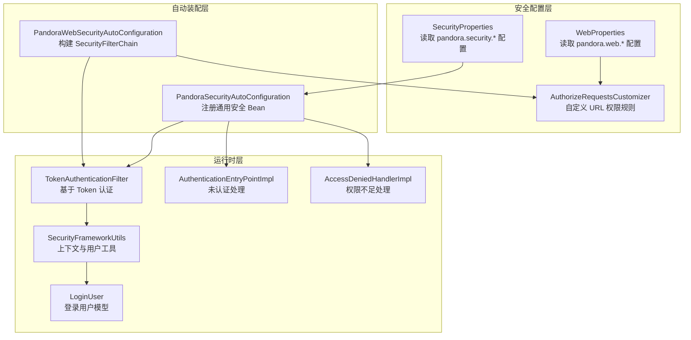
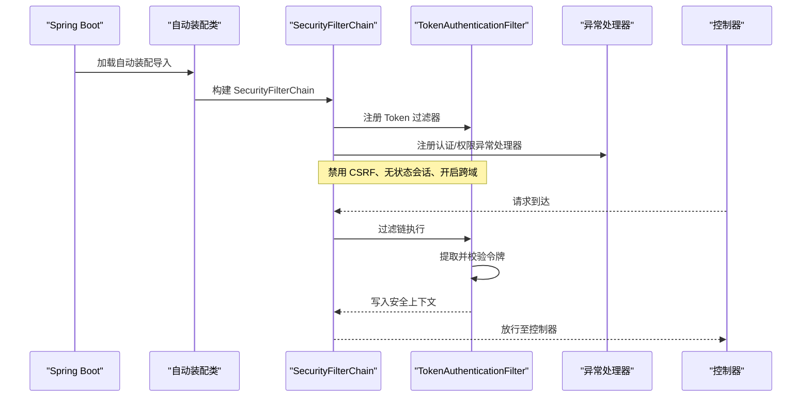
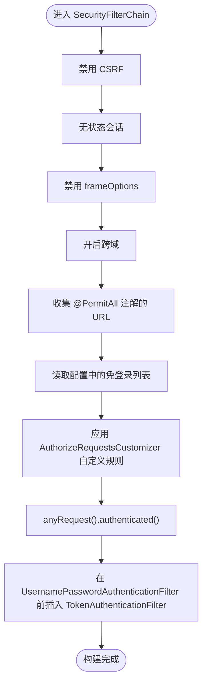
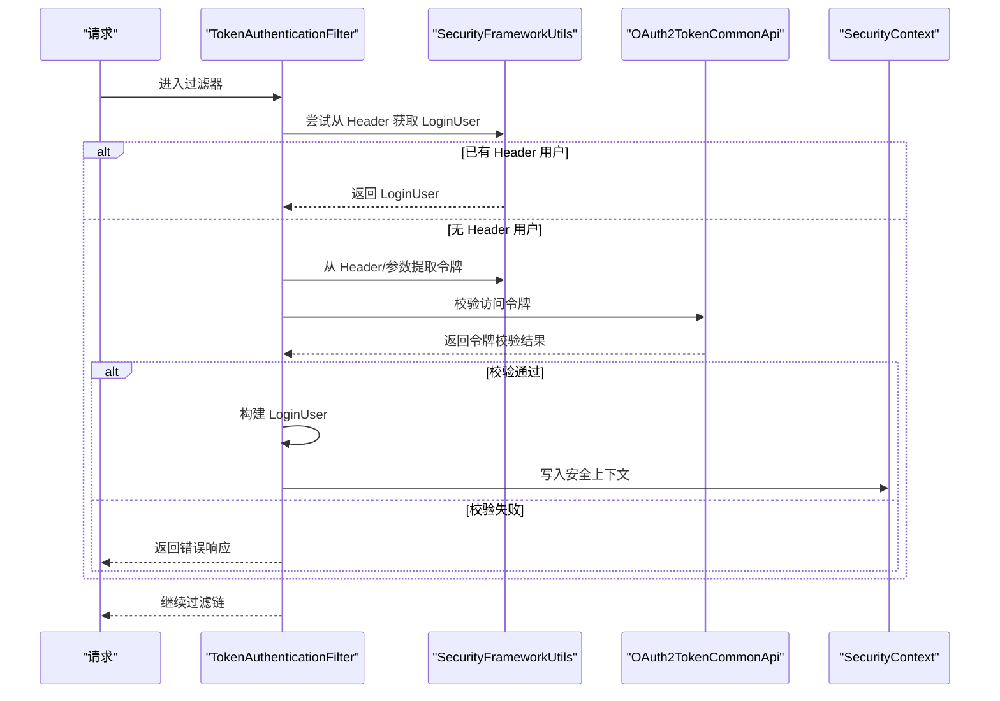
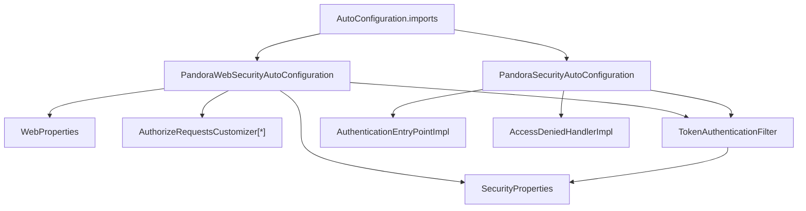

# 安全配置

<cite>
**本文引用的文件**
- [SecurityProperties.java](file://pandora-framework/pandora-spring-boot-starter-security/src/main/java/net/ittimeline/pandora/framework/security/config/SecurityProperties.java)
- [AuthorizeRequestsCustomizer.java](file://pandora-framework/pandora-spring-boot-starter-security/src/main/java/net/ittimeline/pandora/framework/security/config/AuthorizeRequestsCustomizer.java)
- [PandoraSecurityAutoConfiguration.java](file://pandora-framework/pandora-spring-boot-starter-security/src/main/java/net/ittimeline/pandora/framework/security/config/PandoraSecurityAutoConfiguration.java)
- [PandoraWebSecurityAutoConfiguration.java](file://pandora-framework/pandora-spring-boot-starter-security/src/main/java/net/ittimeline/pandora/framework/security/config/PandoraWebSecurityAutoConfiguration.java)
- [TokenAuthenticationFilter.java](file://pandora-framework/pandora-spring-boot-starter-security/src/main/java/net/ittimeline/pandora/framework/security/core/filter/TokenAuthenticationFilter.java)
- [AuthenticationEntryPointImpl.java](file://pandora-framework/pandora-spring-boot-starter-security/src/main/java/net/ittimeline/pandora/framework/security/core/handler/AuthenticationEntryPointImpl.java)
- [AccessDeniedHandlerImpl.java](file://pandora-framework/pandora-spring-boot-starter-security/src/main/java/net/ittimeline/pandora/framework/security/core/handler/AccessDeniedHandlerImpl.java)
- [SecurityFrameworkUtils.java](file://pandora-framework/pandora-spring-boot-starter-security/src/main/java/net/ittimeline/pandora/framework/security/core/util/SecurityFrameworkUtils.java)
- [LoginUser.java](file://pandora-framework/pandora-spring-boot-starter-security/src/main/java/net/ittimeline/pandora/framework/security/core/LoginUser.java)
- [WebProperties.java](file://pandora-framework/pandora-spring-boot-starter-web/src/main/java/net/ittimeline/pandora/framework/web/config/WebProperties.java)
- [org.springframework.boot.autoconfigure.AutoConfiguration.imports](file://pandora-framework/pandora-spring-boot-starter-security/src/main/resources/META-INF/spring/org.springframework.boot.autoconfigure.AutoConfiguration.imports)
</cite>

## 目录
1. [简介](#简介)
2. [项目结构](#项目结构)
3. [核心组件](#核心组件)
4. [架构总览](#架构总览)
5. [详细组件分析](#详细组件分析)
6. [依赖分析](#依赖分析)
7. [性能考量](#性能考量)
8. [故障排查指南](#故障排查指南)
9. [结论](#结论)
10. [附录](#附录)

## 简介
本文件系统性阐述 Pandora Cloud 安全配置能力，围绕以下目标展开：
- 深入解析 SecurityProperties 配置类的全部属性及其使用方法，涵盖认证配置、密码加密配置、会话管理配置等。
- 详解 AuthorizeRequestsCustomizer 的定制化能力，包括如何配置 URL 访问权限、如何实现动态权限控制。
- 提供完整的安全配置示例，覆盖 Web 安全配置、API 安全配置、跨域安全配置等。
- 解释安全配置的优先级与加载顺序，以及与 Spring Security 默认配置的关系。
- 总结最佳实践与安全加固建议。

## 项目结构
本项目在安全模块中，通过自动装配类与工具类协同完成安全配置与运行时鉴权。关键文件与职责如下：
- 配置类：SecurityProperties（读取配置）、WebProperties（API 前缀与包扫描规则）
- 自动装配：PandoraSecurityAutoConfiguration（通用安全组件）、PandoraWebSecurityAutoConfiguration（Web 安全过滤链）
- 运行时：TokenAuthenticationFilter（基于 Token 的认证过滤器）、SecurityFrameworkUtils（上下文与用户信息工具）
- 异常处理：AuthenticationEntryPointImpl（未认证）、AccessDeniedHandlerImpl（权限不足）

图表来源
- [PandoraSecurityAutoConfiguration.java:36-98](file://pandora-framework/pandora-spring-boot-starter-security/src/main/java/net/ittimeline/pandora/framework/security/config/PandoraSecurityAutoConfiguration.java#L36-L98)
- [PandoraWebSecurityAutoConfiguration.java:48-222](file://pandora-framework/pandora-spring-boot-starter-security/src/main/java/net/ittimeline/pandora/framework/security/config/PandoraWebSecurityAutoConfiguration.java#L48-L222)
- [SecurityProperties.java:19-57](file://pandora-framework/pandora-spring-boot-starter-security/src/main/java/net/ittimeline/pandora/framework/security/config/SecurityProperties.java#L19-L57)
- [AuthorizeRequestsCustomizer.java:19-38](file://pandora-framework/pandora-spring-boot-starter-security/src/main/java/net/ittimeline/pandora/framework/security/config/AuthorizeRequestsCustomizer.java#L19-L38)
- [TokenAuthenticationFilter.java:37-157](file://pandora-framework/pandora-spring-boot-starter-security/src/main/java/net/ittimeline/pandora/framework/security/core/filter/TokenAuthenticationFilter.java#L37-L157)
- [SecurityFrameworkUtils.java:26-163](file://pandora-framework/pandora-spring-boot-starter-security/src/main/java/net/ittimeline/pandora/framework/security/core/util/SecurityFrameworkUtils.java#L26-L163)
- [LoginUser.java:20-77](file://pandora-framework/pandora-spring-boot-starter-security/src/main/java/net/ittimeline/pandora/framework/security/core/LoginUser.java#L20-L77)
- [AuthenticationEntryPointImpl.java:26-38](file://pandora-framework/pandora-spring-boot-starter-security/src/main/java/net/ittimeline/pandora/framework/security/core/handler/AuthenticationEntryPointImpl.java#L26-L38)
- [AccessDeniedHandlerImpl.java:30-44](file://pandora-framework/pandora-spring-boot-starter-security/src/main/java/net/ittimeline/pandora/framework/security/core/handler/AccessDeniedHandlerImpl.java#L30-L44)

章节来源
- [PandoraSecurityAutoConfiguration.java:36-98](file://pandora-framework/pandora-spring-boot-starter-security/src/main/java/net/ittimeline/pandora/framework/security/config/PandoraSecurityAutoConfiguration.java#L36-L98)
- [PandoraWebSecurityAutoConfiguration.java:48-222](file://pandora-framework/pandora-spring-boot-starter-security/src/main/java/net/ittimeline/pandora/framework/security/config/PandoraWebSecurityAutoConfiguration.java#L48-L222)
- [org.springframework.boot.autoconfigure.AutoConfiguration.imports:1-6](file://pandora-framework/pandora-spring-boot-starter-security/src/main/resources/META-INF/spring/org.springframework.boot.autoconfigure.AutoConfiguration.imports#L1-L6)

## 核心组件
本节聚焦安全配置的关键构件，包括配置类、自动装配类、过滤器与工具类。

- SecurityProperties：集中管理安全相关配置项，如令牌头、令牌参数、免登录 URL 列表、密码编码复杂度、Mock 模式等。
- PandoraSecurityAutoConfiguration：注册认证入口、权限不足处理器、BCrypt 密码编码器、Token 认证过滤器、安全上下文策略等。
- PandoraWebSecurityAutoConfiguration：构建 SecurityFilterChain，整合免登录注解、配置列表、自定义规则与兜底认证策略，并注入 Token 过滤器。
- TokenAuthenticationFilter：从请求中提取令牌，校验有效性，构建 LoginUser 并写入安全上下文；支持 Mock 登录与 Header 透传。
- SecurityFrameworkUtils：提供从请求中提取令牌、获取当前用户、设置上下文等工具方法。
- LoginUser：封装当前登录用户信息，含用户标识、类型、额外信息、租户、授权范围、过期时间等。
- AuthorizeRequestsCustomizer：抽象类，允许各模块自定义 URL 权限规则，支持基于 WebProperties 的 API 前缀拼装。
- WebProperties：定义 APP/Admin API 前缀与包扫描规则，便于统一前缀与安全规则的生成。

章节来源
- [SecurityProperties.java:19-57](file://pandora-framework/pandora-spring-boot-starter-security/src/main/java/net/ittimeline/pandora/framework/security/config/SecurityProperties.java#L19-L57)
- [PandoraSecurityAutoConfiguration.java:36-98](file://pandora-framework/pandora-spring-boot-starter-security/src/main/java/net/ittimeline/pandora/framework/security/config/PandoraSecurityAutoConfiguration.java#L36-L98)
- [PandoraWebSecurityAutoConfiguration.java:48-222](file://pandora-framework/pandora-spring-boot-starter-security/src/main/java/net/ittimeline/pandora/framework/security/config/PandoraWebSecurityAutoConfiguration.java#L48-L222)
- [TokenAuthenticationFilter.java:37-157](file://pandora-framework/pandora-spring-boot-starter-security/src/main/java/net/ittimeline/pandora/framework/security/core/filter/TokenAuthenticationFilter.java#L37-L157)
- [SecurityFrameworkUtils.java:26-163](file://pandora-framework/pandora-spring-boot-starter-security/src/main/java/net/ittimeline/pandora/framework/security/core/util/SecurityFrameworkUtils.java#L26-L163)
- [LoginUser.java:20-77](file://pandora-framework/pandora-spring-boot-starter-security/src/main/java/net/ittimeline/pandora/framework/security/core/LoginUser.java#L20-L77)
- [AuthorizeRequestsCustomizer.java:19-38](file://pandora-framework/pandora-spring-boot-starter-security/src/main/java/net/ittimeline/pandora/framework/security/config/AuthorizeRequestsCustomizer.java#L19-L38)
- [WebProperties.java:18-68](file://pandora-framework/pandora-spring-boot-starter-web/src/main/java/net/ittimeline/pandora/framework/web/config/WebProperties.java#L18-L68)

## 架构总览
下图展示安全配置在启动阶段的装配顺序与运行时的过滤链交互：

图表来源
- [org.springframework.boot.autoconfigure.AutoConfiguration.imports:1-6](file://pandora-framework/pandora-spring-boot-starter-security/src/main/resources/META-INF/spring/org.springframework.boot.autoconfigure.AutoConfiguration.imports#L1-L6)
- [PandoraWebSecurityAutoConfiguration.java:112-155](file://pandora-framework/pandora-spring-boot-starter-security/src/main/java/net/ittimeline/pandora/framework/security/config/PandoraWebSecurityAutoConfiguration.java#L112-L155)
- [TokenAuthenticationFilter.java:47-82](file://pandora-framework/pandora-spring-boot-starter-security/src/main/java/net/ittimeline/pandora/framework/security/core/filter/TokenAuthenticationFilter.java#L47-L82)
- [AuthenticationEntryPointImpl.java:26-38](file://pandora-framework/pandora-spring-boot-starter-security/src/main/java/net/ittimeline/pandora/framework/security/core/handler/AuthenticationEntryPointImpl.java#L26-L38)
- [AccessDeniedHandlerImpl.java:30-44](file://pandora-framework/pandora-spring-boot-starter-security/src/main/java/net/ittimeline/pandora/framework/security/core/handler/AccessDeniedHandlerImpl.java#L30-L44)

## 详细组件分析

### SecurityProperties 配置类
- 令牌头与参数
  - tokenHeader：HTTP 请求中携带访问令牌的请求头名称，默认值可通过配置覆盖。
  - tokenParameter：当无法通过 Header 传递时，可通过查询参数 token 传递。
- Mock 模式
  - mockEnable：是否启用 Mock 登录模式，仅用于开发调试。
  - mockSecret：Mock 登录的密钥，需妥善保管。
- 免登录 URL 列表
  - permitAllUrls：白名单 URL 列表，无需认证即可访问。
- 密码加密配置
  - passwordEncoderLength：BCrypt 密码编码复杂度，数值越高安全性越强但开销更大。

章节来源
- [SecurityProperties.java:23-57](file://pandora-framework/pandora-spring-boot-starter-security/src/main/java/net/ittimeline/pandora/framework/security/config/SecurityProperties.java#L23-L57)

### AuthorizeRequestsCustomizer 定制化
- 目标与能力
  - 为每个模块提供自定义 URL 权限规则的能力，通过实现 customize 方法接入。
  - 支持通过 WebProperties 的 API 前缀快速拼装 URL 规则，如 Admin API 与 App API 前缀。
- 优先级与排序
  - 实现 Ordered 接口，默认顺序为 0，可通过 getOrder() 调整多个自定义规则的执行顺序。
- 动态权限控制
  - 可结合业务上下文动态生成 URL 规则，实现按模块、按租户、按用户类型等维度的差异化控制。

章节来源
- [AuthorizeRequestsCustomizer.java:19-38](file://pandora-framework/pandora-spring-boot-starter-security/src/main/java/net/ittimeline/pandora/framework/security/config/AuthorizeRequestsCustomizer.java#L19-L38)
- [WebProperties.java:21-25](file://pandora-framework/pandora-spring-boot-starter-web/src/main/java/net/ittimeline/pandora/framework/web/config/WebProperties.java#L21-L25)

### PandoraSecurityAutoConfiguration 自动装配
- 注册通用安全 Bean
  - 认证入口：AuthenticationEntryPointImpl
  - 权限不足处理器：AccessDeniedHandlerImpl
  - 密码编码器：BCryptPasswordEncoder，复杂度由 SecurityProperties.passwordEncoderLength 控制
  - Token 认证过滤器：TokenAuthenticationFilter
  - 安全上下文策略：设置为 TransmittableThreadLocalSecurityContextHolderStrategy，便于线程上下文传递
- 与 Spring Security 默认配置的关系
  - 通过 AutoConfigureOrder(-1) 使其优先于 Spring Security 默认自动配置，确保自定义策略生效。

章节来源
- [PandoraSecurityAutoConfiguration.java:36-98](file://pandora-framework/pandora-spring-boot-starter-security/src/main/java/net/ittimeline/pandora/framework/security/config/PandoraSecurityAutoConfiguration.java#L36-L98)

### PandoraWebSecurityAutoConfiguration Web 安全过滤链
- 过滤链构建要点
  - 禁用 CSRF、无状态会话、禁用 frameOptions、开启跨域。
  - 异常处理：未认证与权限不足分别委托给认证入口与权限不足处理器。
- URL 权限规则分层
  - 全局共享规则：静态资源匿名访问；基于注解的免登录 URL（GET/POST/PUT/DELETE/HEAD/PATCH）。
  - 配置列表规则：pandora.security.permit-all-urls 白名单。
  - 自定义规则：遍历 AuthorizeRequestsCustomizer 列表，逐个应用。
  - 兜底规则：异步 DispatcherType 允许访问，其余请求必须认证。
- 过滤器注入
  - 在 UsernamePasswordAuthenticationFilter 之前插入 TokenAuthenticationFilter。

图表来源
- [PandoraWebSecurityAutoConfiguration.java:112-155](file://pandora-framework/pandora-spring-boot-starter-security/src/main/java/net/ittimeline/pandora/framework/security/config/PandoraWebSecurityAutoConfiguration.java#L112-L155)
- [PandoraWebSecurityAutoConfiguration.java:161-221](file://pandora-framework/pandora-spring-boot-starter-security/src/main/java/net/ittimeline/pandora/framework/security/config/PandoraWebSecurityAutoConfiguration.java#L161-L221)

章节来源
- [PandoraWebSecurityAutoConfiguration.java:48-222](file://pandora-framework/pandora-spring-boot-starter-security/src/main/java/net/ittimeline/pandora/framework/security/config/PandoraWebSecurityAutoConfiguration.java#L48-L222)

### TokenAuthenticationFilter 运行时认证
- 认证来源优先级
  - Header 透传：优先从特定 Header 获取 LoginUser。
  - Token 校验：从请求头或参数提取令牌，调用 OAuth2TokenCommonApi 校验，成功则构建 LoginUser。
  - Mock 登录：当 mockEnable=true 且令牌以 mockSecret 开头时，构造模拟用户。
- 用户类型校验
  - 对于 /admin-api/* 与 /app-api/* 路径，若请求中携带用户类型，需与令牌中的用户类型一致，否则拒绝访问。
- 上下文设置
  - 将 LoginUser 写入 SecurityContext，并同步到 WebFrameworkUtils，便于后续日志与拦截器使用。

图表来源
- [TokenAuthenticationFilter.java:47-82](file://pandora-framework/pandora-spring-boot-starter-security/src/main/java/net/ittimeline/pandora/framework/security/core/filter/TokenAuthenticationFilter.java#L47-L82)
- [TokenAuthenticationFilter.java:84-131](file://pandora-framework/pandora-spring-boot-starter-security/src/main/java/net/ittimeline/pandora/framework/security/core/filter/TokenAuthenticationFilter.java#L84-L131)
- [SecurityFrameworkUtils.java:125-136](file://pandora-framework/pandora-spring-boot-starter-security/src/main/java/net/ittimeline/pandora/framework/security/core/util/SecurityFrameworkUtils.java#L125-L136)

章节来源
- [TokenAuthenticationFilter.java:37-157](file://pandora-framework/pandora-spring-boot-starter-security/src/main/java/net/ittimeline/pandora/framework/security/core/filter/TokenAuthenticationFilter.java#L37-L157)
- [SecurityFrameworkUtils.java:26-163](file://pandora-framework/pandora-spring-boot-starter-security/src/main/java/net/ittimeline/pandora/framework/security/core/util/SecurityFrameworkUtils.java#L26-L163)

### 异常处理与上下文工具
- AuthenticationEntryPointImpl：未认证时返回统一错误码，便于前端跳转登录。
- AccessDeniedHandlerImpl：权限不足时返回统一错误码，记录警告日志。
- SecurityFrameworkUtils：提供 obtainAuthorization、getLoginUser、setLoginUser 等常用方法，支撑运行时鉴权与日志记录。

章节来源
- [AuthenticationEntryPointImpl.java:26-38](file://pandora-framework/pandora-spring-boot-starter-security/src/main/java/net/ittimeline/pandora/framework/security/core/handler/AuthenticationEntryPointImpl.java#L26-L38)
- [AccessDeniedHandlerImpl.java:30-44](file://pandora-framework/pandora-spring-boot-starter-security/src/main/java/net/ittimeline/pandora/framework/security/core/handler/AccessDeniedHandlerImpl.java#L30-L44)
- [SecurityFrameworkUtils.java:26-163](file://pandora-framework/pandora-spring-boot-starter-security/src/main/java/net/ittimeline/pandora/framework/security/core/util/SecurityFrameworkUtils.java#L26-L163)

## 依赖分析
- 自动装配导入
  - 通过 META-INF/spring 的自动装配导入文件，声明加载安全相关自动装配类，确保启动时生效。
- 组件耦合
  - PandoraWebSecurityAutoConfiguration 依赖 SecurityProperties、WebProperties、TokenAuthenticationFilter、异常处理器与 AuthorizeRequestsCustomizer 列表。
  - TokenAuthenticationFilter 依赖 SecurityProperties、GlobalExceptionHandler、OAuth2TokenCommonApi。
  - SecurityFrameworkUtils 依赖 SecurityContext 与 WebFrameworkUtils，用于上下文与请求信息的桥接。

图表来源
- [org.springframework.boot.autoconfigure.AutoConfiguration.imports:1-6](file://pandora-framework/pandora-spring-boot-starter-security/src/main/resources/META-INF/spring/org.springframework.boot.autoconfigure.AutoConfiguration.imports#L1-L6)
- [PandoraWebSecurityAutoConfiguration.java:54-83](file://pandora-framework/pandora-spring-boot-starter-security/src/main/java/net/ittimeline/pandora/framework/security/config/PandoraWebSecurityAutoConfiguration.java#L54-L83)
- [PandoraSecurityAutoConfiguration.java:41-83](file://pandora-framework/pandora-spring-boot-starter-security/src/main/java/net/ittimeline/pandora/framework/security/config/PandoraSecurityAutoConfiguration.java#L41-L83)
- [TokenAuthenticationFilter.java:41-45](file://pandora-framework/pandora-spring-boot-starter-security/src/main/java/net/ittimeline/pandora/framework/security/core/filter/TokenAuthenticationFilter.java#L41-L45)

章节来源
- [org.springframework.boot.autoconfigure.AutoConfiguration.imports:1-6](file://pandora-framework/pandora-spring-boot-starter-security/src/main/resources/META-INF/spring/org.springframework.boot.autoconfigure.AutoConfiguration.imports#L1-L6)
- [PandoraWebSecurityAutoConfiguration.java:48-222](file://pandora-framework/pandora-spring-boot-starter-security/src/main/java/net/ittimeline/pandora/framework/security/config/PandoraWebSecurityAutoConfiguration.java#L48-L222)
- [PandoraSecurityAutoConfiguration.java:36-98](file://pandora-framework/pandora-spring-boot-starter-security/src/main/java/net/ittimeline/pandora/framework/security/config/PandoraSecurityAutoConfiguration.java#L36-L98)

## 性能考量
- 密码编码复杂度
  - passwordEncoderLength 增大显著提升 CPU 开销，建议在生产环境根据硬件能力与安全需求平衡设置。
- 过滤链与规则匹配
  - 免登录注解扫描与规则叠加可能增加启动时的处理开销，建议合理划分模块与规则，避免过度分散。
- Token 校验
  - 校验流程依赖远程接口（OAuth2TokenCommonApi），需关注网络延迟与可用性，必要时引入本地缓存与降级策略。

## 故障排查指南
- 未认证
  - 现象：访问受保护资源返回统一错误码。
  - 排查：确认请求是否携带有效令牌或 Header 透传；检查 SecurityProperties.tokenHeader/tokenParameter 配置。
- 权限不足
  - 现象：已登录但无权限访问。
  - 排查：核对用户类型与目标 URL 的用户类型要求；检查 AuthorizeRequestsCustomizer 规则是否覆盖目标路径。
- Mock 登录
  - 现象：开发环境可使用 Mock 登录，但生产需关闭。
  - 排查：确认 mockEnable=false；确保 mockSecret 未泄露。
- 跨域与静态资源
  - 现象：静态资源无法访问或跨域失败。
  - 排查：确认 CORS 已启用；静态资源路径是否在免登录规则中。

章节来源
- [AuthenticationEntryPointImpl.java:26-38](file://pandora-framework/pandora-spring-boot-starter-security/src/main/java/net/ittimeline/pandora/framework/security/core/handler/AuthenticationEntryPointImpl.java#L26-L38)
- [AccessDeniedHandlerImpl.java:30-44](file://pandora-framework/pandora-spring-boot-starter-security/src/main/java/net/ittimeline/pandora/framework/security/core/handler/AccessDeniedHandlerImpl.java#L30-L44)
- [TokenAuthenticationFilter.java:119-131](file://pandora-framework/pandora-spring-boot-starter-security/src/main/java/net/ittimeline/pandora/framework/security/core/filter/TokenAuthenticationFilter.java#L119-L131)
- [PandoraWebSecurityAutoConfiguration.java:112-155](file://pandora-framework/pandora-spring-boot-starter-security/src/main/java/net/ittimeline/pandora/framework/security/config/PandoraWebSecurityAutoConfiguration.java#L112-L155)

## 结论
本安全配置体系通过配置类、自动装配与运行时过滤器形成闭环：配置类提供参数化能力，自动装配注册通用组件与过滤链，运行时通过 Token 校验与上下文写入实现认证与授权。借助 AuthorizeRequestsCustomizer，可灵活扩展模块级权限规则；配合 WebProperties 的 API 前缀，实现统一前缀下的安全策略落地。建议在生产环境关闭 Mock 登录，合理设置密码编码复杂度，并完善跨域与静态资源策略。

## 附录

### 完整安全配置示例（步骤说明）
- Web 安全配置
  - 在自动装配中启用 CORS、禁用 CSRF、设置无状态会话、注册异常处理器与 Token 过滤器。
  - 参考路径：[PandoraWebSecurityAutoConfiguration.java:112-155](file://pandora-framework/pandora-spring-boot-starter-security/src/main/java/net/ittimeline/pandora/framework/security/config/PandoraWebSecurityAutoConfiguration.java#L112-L155)
- API 安全配置
  - 使用 AuthorizeRequestsCustomizer 为模块添加 URL 权限规则，可结合 WebProperties 的前缀生成规则。
  - 参考路径：[AuthorizeRequestsCustomizer.java:19-38](file://pandora-framework/pandora-spring-boot-starter-security/src/main/java/net/ittimeline/pandora/framework/security/config/AuthorizeRequestsCustomizer.java#L19-L38)
- 跨域安全配置
  - 在过滤链中启用 cors(Customizer.withDefaults())，确保前端与后端跨域通信。
  - 参考路径：[PandoraWebSecurityAutoConfiguration.java:115-116](file://pandora-framework/pandora-spring-boot-starter-security/src/main/java/net/ittimeline/pandora/framework/security/config/PandoraWebSecurityAutoConfiguration.java#L115-L116)
- 认证与会话管理
  - 禁用 Session（STATELESS），避免会话劫持；通过 TokenAuthenticationFilter 实现基于 Token 的认证。
  - 参考路径：[PandoraWebSecurityAutoConfiguration.java:119-120](file://pandora-framework/pandora-spring-boot-starter-security/src/main/java/net/ittimeline/pandora/framework/security/config/PandoraWebSecurityAutoConfiguration.java#L119-L120)
  - [TokenAuthenticationFilter.java:47-82](file://pandora-framework/pandora-spring-boot-starter-security/src/main/java/net/ittimeline/pandora/framework/security/core/filter/TokenAuthenticationFilter.java#L47-L82)

### 安全配置优先级与加载顺序
- 自动装配导入顺序
  - 通过 AutoConfiguration.imports 文件声明加载顺序，确保安全自动装配在 Spring Security 默认配置之前。
  - 参考路径：[org.springframework.boot.autoconfigure.AutoConfiguration.imports:1-6](file://pandora-framework/pandora-spring-boot-starter-security/src/main/resources/META-INF/spring/org.springframework.boot.autoconfigure.AutoConfiguration.imports#L1-L6)
- 过滤链规则叠加顺序
  - 免登录注解 → 配置列表 → 自定义规则 → 兜底认证，遵循“白名单优先、模块化扩展、最后兜底”的原则。
  - 参考路径：[PandoraWebSecurityAutoConfiguration.java:130-150](file://pandora-framework/pandora-spring-boot-starter-security/src/main/java/net/ittimeline/pandora/framework/security/config/PandoraWebSecurityAutoConfiguration.java#L130-L150)

### 最佳实践与安全加固建议
- 关闭开发模式下的 Mock 登录，生产环境严格禁止。
- 为 mockSecret 设置高强度密钥并妥善保管。
- 合理设置 passwordEncoderLength，兼顾安全与性能。
- 对敏感接口启用更严格的用户类型校验与权限控制。
- 统一 API 前缀，减少暴露面；对静态资源与公开接口明确免登录策略。
- 对异常处理返回统一错误码，便于前端统一处理与审计。