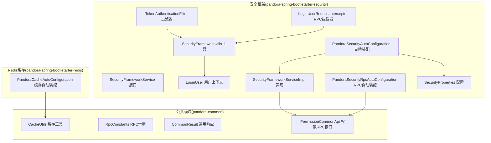
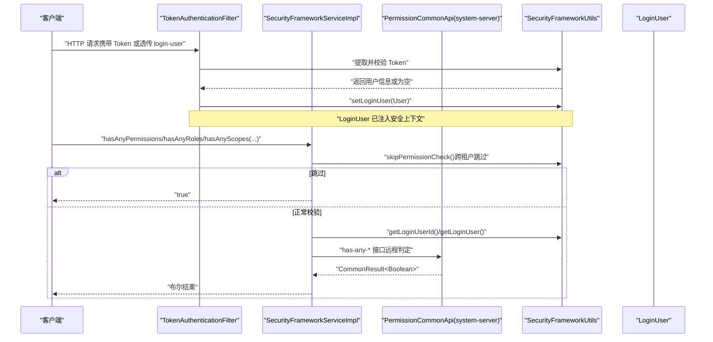
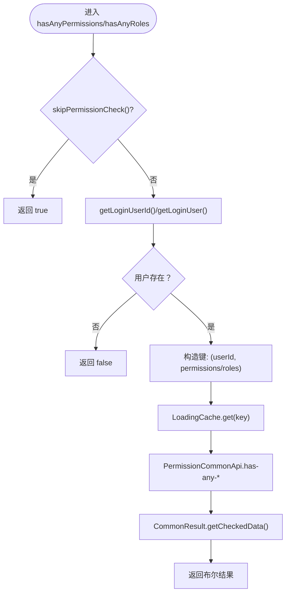
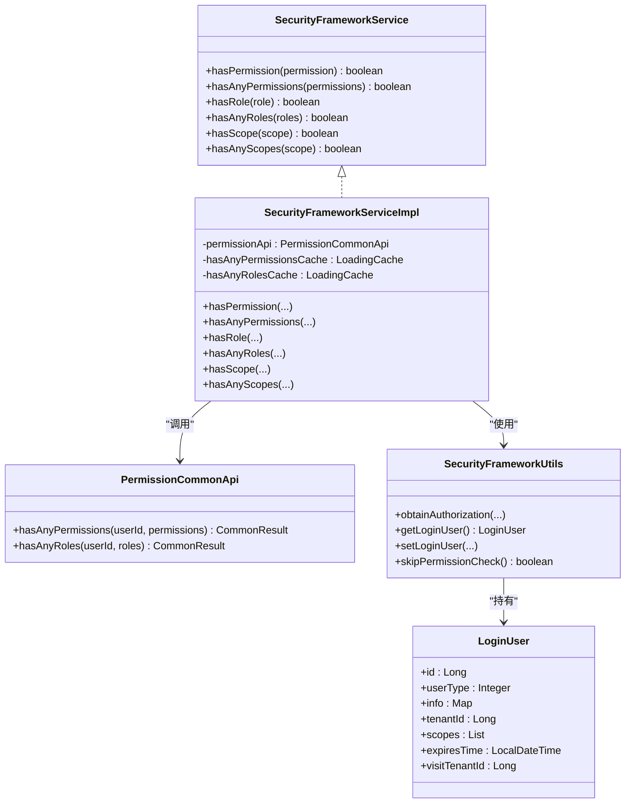

# 权限管理

<cite>
**本文引用的文件**
- [SecurityFrameworkService.java](file://pandora-framework/pandora-spring-boot-starter-security/src/main/java/net/ittimeline/pandora/framework/security/core/service/SecurityFrameworkService.java)
- [SecurityFrameworkServiceImpl.java](file://pandora-framework/pandora-spring-boot-starter-security/src/main/java/net/ittimeline/pandora/framework/security/core/service/SecurityFrameworkServiceImpl.java)
- [PermissionCommonApi.java](file://pandora-framework/pandora-common/src/main/java/net/ittimeline/pandora/framework/common/biz/system/permission/PermissionCommonApi.java)
- [LoginUser.java](file://pandora-framework/pandora-spring-boot-starter-security/src/main/java/net/ittimeline/pandora/framework/security/core/LoginUser.java)
- [SecurityFrameworkUtils.java](file://pandora-framework/pandora-spring-boot-starter-security/src/main/java/net/ittimeline/pandora/framework/security/core/util/SecurityFrameworkUtils.java)
- [PandoraSecurityAutoConfiguration.java](file://pandora-framework/pandora-spring-boot-starter-security/src/main/java/net/ittimeline/pandora/framework/security/config/PandoraSecurityAutoConfiguration.java)
- [PandoraSecurityRpcAutoConfiguration.java](file://pandora-framework/pandora-spring-boot-starter-security/src/main/java/net/ittimeline/pandora/framework/security/config/PandoraSecurityRpcAutoConfiguration.java)
- [TokenAuthenticationFilter.java](file://pandora-framework/pandora-spring-boot-starter-security/src/main/java/net/ittimeline/pandora/framework/security/core/filter/TokenAuthenticationFilter.java)
- [LoginUserRequestInterceptor.java](file://pandora-framework/pandora-spring-boot-starter-security/src/main/java/net/ittimeline/pandora/framework/security/core/rpc/LoginUserRequestInterceptor.java)
- [SecurityProperties.java](file://pandora-framework/pandora-spring-boot-starter-security/src/main/java/net/ittimeline/pandora/framework/security/config/SecurityProperties.java)
- [RpcConstants.java](file://pandora-framework/pandora-common/src/main/java/net/ittimeline/pandora/framework/common/constants/RpcConstants.java)
- [CommonResult.java](file://pandora-framework/pandora-common/src/main/java/net/ittimeline/pandora/framework/common/pojo/CommonResult.java)
- [CacheUtils.java](file://pandora-framework/pandora-common/src/main/java/net/ittimeline/pandora/framework/common/util/web/cache/CacheUtils.java)
- [PandoraCacheAutoConfiguration.java](file://pandora-framework/pandora-spring-boot-starter-redis/src/main/java/net/ittimeline/pandora/framework/redis/config/PandoraCacheAutoConfiguration.java)
</cite>

## 目录
1. [简介](#简介)
2. [项目结构](#项目结构)
3. [核心组件](#核心组件)
4. [架构总览](#架构总览)
5. [组件详解](#组件详解)
6. [依赖关系分析](#依赖关系分析)
7. [性能与缓存](#性能与缓存)
8. [故障排查](#故障排查)
9. [结论](#结论)
10. [附录](#附录)

## 简介
本文件围绕权限管理能力，系统性梳理 SecurityFrameworkService 的核心功能与实现原理，覆盖权限检查、角色验证、授权范围（scope）校验等机制；详解 PermissionCommonApi 接口的使用方法与权限数据结构；提供权限配置示例（含 RBAC 模型集成思路）、动态权限检查实践、缓存与性能优化策略，以及权限变更的实时同步建议与最佳实践。

## 项目结构
权限管理相关代码主要分布在两个模块：
- 安全框架与服务端点：pandora-spring-boot-starter-security
- 权限公共 API（RPC 接口）：pandora-common

图示来源
- [SecurityFrameworkService.java:1-61](file://pandora-framework/pandora-spring-boot-starter-security/src/main/java/net/ittimeline/pandora/framework/security/core/service/SecurityFrameworkService.java#L1-L61)
- [SecurityFrameworkServiceImpl.java:1-124](file://pandora-framework/pandora-spring-boot-starter-security/src/main/java/net/ittimeline/pandora/framework/security/core/service/SecurityFrameworkServiceImpl.java#L1-L124)
- [PermissionCommonApi.java:1-46](file://pandora-framework/pandora-common/src/main/java/net/ittimeline/pandora/framework/common/biz/system/permission/PermissionCommonApi.java#L1-L46)
- [LoginUser.java:1-77](file://pandora-framework/pandora-spring-boot-starter-security/src/main/java/net/ittimeline/pandora/framework/security/core/LoginUser.java#L1-L77)
- [SecurityFrameworkUtils.java:1-163](file://pandora-framework/pandora-spring-boot-starter-security/src/main/java/net/ittimeline/pandora/framework/security/core/util/SecurityFrameworkUtils.java#L1-L163)
- [TokenAuthenticationFilter.java:1-157](file://pandora-framework/pandora-spring-boot-starter-security/src/main/java/net/ittimeline/pandora/framework/security/core/filter/TokenAuthenticationFilter.java#L1-L157)
- [LoginUserRequestInterceptor.java:1-39](file://pandora-framework/pandora-spring-boot-starter-security/src/main/java/net/ittimeline/pandora/framework/security/core/rpc/LoginUserRequestInterceptor.java#L1-L39)
- [PandoraSecurityAutoConfiguration.java:1-99](file://pandora-framework/pandora-spring-boot-starter-security/src/main/java/net/ittimeline/pandora/framework/security/config/PandoraSecurityAutoConfiguration.java#L1-L99)
- [PandoraSecurityRpcAutoConfiguration.java:1-26](file://pandora-framework/pandora-spring-boot-starter-security/src/main/java/net/ittimeline/pandora/framework/security/config/PandoraSecurityRpcAutoConfiguration.java#L1-L26)
- [SecurityProperties.java:1-58](file://pandora-framework/pandora-spring-boot-starter-security/src/main/java/net/ittimeline/pandora/framework/security/config/SecurityProperties.java#L1-L58)
- [RpcConstants.java:1-42](file://pandora-framework/pandora-common/src/main/java/net/ittimeline/pandora/framework/common/constants/RpcConstants.java#L1-L42)
- [CommonResult.java:1-123](file://pandora-framework/pandora-common/src/main/java/net/ittimeline/pandora/framework/common/pojo/CommonResult.java#L1-L123)
- [CacheUtils.java:24-60](file://pandora-framework/pandora-common/src/main/java/net/ittimeline/pandora/framework/common/util/web/cache/CacheUtils.java#L24-L60)
- [PandoraCacheAutoConfiguration.java:31-84](file://pandora-framework/pandora-spring-boot-starter-redis/src/main/java/net/ittimeline/pandora/framework/redis/config/PandoraCacheAutoConfiguration.java#L31-L84)

章节来源
- [PandoraSecurityAutoConfiguration.java:1-99](file://pandora-framework/pandora-spring-boot-starter-security/src/main/java/net/ittimeline/pandora/framework/security/config/PandoraSecurityAutoConfiguration.java#L1-L99)
- [PandoraSecurityRpcAutoConfiguration.java:1-26](file://pandora-framework/pandora-spring-boot-starter-security/src/main/java/net/ittimeline/pandora/framework/security/config/PandoraSecurityRpcAutoConfiguration.java#L1-L26)

## 核心组件
- SecurityFrameworkService：定义权限/角色/授权范围的检查接口，统一对外暴露。
- SecurityFrameworkServiceImpl：默认实现，封装缓存、跨租户跳过校验、与 PermissionCommonApi 的交互。
- PermissionCommonApi：声明式 Feign 客户端，远程调用 system-server 的权限判定接口。
- LoginUser：登录用户上下文，包含用户标识、租户、scopes 等。
- SecurityFrameworkUtils：安全上下文工具，负责从请求提取 Token、构建/设置 LoginUser、跨租户跳过校验等。
- TokenAuthenticationFilter：在请求进入时完成 Token 校验、构建 LoginUser 并注入安全上下文。
- LoginUserRequestInterceptor：在 Feign 调用时将 LoginUser 透传到下游服务。
- SecurityProperties：安全相关配置项（如 Token 头、参数、mock 开关、免登录 URL 等）。
- RpcConstants：RPC 服务名与前缀常量。
- CommonResult：统一响应包装，便于 getCheckedData() 抛错或取数据。
- CacheUtils：构建本地 LoadingCache 的工具，支持同步刷新。
- PandoraCacheAutoConfiguration：Redis 缓存自动装配（与权限缓存互补）。

章节来源
- [SecurityFrameworkService.java:1-61](file://pandora-framework/pandora-spring-boot-starter-security/src/main/java/net/ittimeline/pandora/framework/security/core/service/SecurityFrameworkService.java#L1-L61)
- [SecurityFrameworkServiceImpl.java:1-124](file://pandora-framework/pandora-spring-boot-starter-security/src/main/java/net/ittimeline/pandora/framework/security/core/service/SecurityFrameworkServiceImpl.java#L1-L124)
- [PermissionCommonApi.java:1-46](file://pandora-framework/pandora-common/src/main/java/net/ittimeline/pandora/framework/common/biz/system/permission/PermissionCommonApi.java#L1-L46)
- [LoginUser.java:1-77](file://pandora-framework/pandora-spring-boot-starter-security/src/main/java/net/ittimeline/pandora/framework/security/core/LoginUser.java#L1-L77)
- [SecurityFrameworkUtils.java:1-163](file://pandora-framework/pandora-spring-boot-starter-security/src/main/java/net/ittimeline/pandora/framework/security/core/util/SecurityFrameworkUtils.java#L1-L163)
- [TokenAuthenticationFilter.java:1-157](file://pandora-framework/pandora-spring-boot-starter-security/src/main/java/net/ittimeline/pandora/framework/security/core/filter/TokenAuthenticationFilter.java#L1-L157)
- [LoginUserRequestInterceptor.java:1-39](file://pandora-framework/pandora-spring-boot-starter-security/src/main/java/net/ittimeline/pandora/framework/security/core/rpc/LoginUserRequestInterceptor.java#L1-L39)
- [SecurityProperties.java:1-58](file://pandora-framework/pandora-spring-boot-starter-security/src/main/java/net/ittimeline/pandora/framework/security/config/SecurityProperties.java#L1-L58)
- [RpcConstants.java:1-42](file://pandora-framework/pandora-common/src/main/java/net/ittimeline/pandora/framework/common/constants/RpcConstants.java#L1-L42)
- [CommonResult.java:1-123](file://pandora-framework/pandora-common/src/main/java/net/ittimeline/pandora/framework/common/pojo/CommonResult.java#L1-L123)
- [CacheUtils.java:24-60](file://pandora-framework/pandora-common/src/main/java/net/ittimeline/pandora/framework/common/util/web/cache/CacheUtils.java#L24-L60)
- [PandoraCacheAutoConfiguration.java:31-84](file://pandora-framework/pandora-spring-boot-starter-redis/src/main/java/net/ittimeline/pandora/framework/redis/config/PandoraCacheAutoConfiguration.java#L31-L84)

## 架构总览
权限管理整体流程：
- 请求进入，TokenAuthenticationFilter 提取 Token 并校验，构建 LoginUser 注入安全上下文。
- 业务层通过 SecurityFrameworkService 进行权限/角色/授权范围检查。
- SecurityFrameworkServiceImpl 使用本地 LoadingCache 缓存“用户+权限集合/角色集合”的布尔结果，减少远程调用。
- 对于权限/角色检查，调用 PermissionCommonApi 远程判定；对于授权范围检查，直接比较 LoginUser.scopes。
- 跨租户访问时，跳过权限校验（仅对权限/角色有效）。

图示来源
- [TokenAuthenticationFilter.java:1-157](file://pandora-framework/pandora-spring-boot-starter-security/src/main/java/net/ittimeline/pandora/framework/security/core/filter/TokenAuthenticationFilter.java#L1-L157)
- [SecurityFrameworkServiceImpl.java:1-124](file://pandora-framework/pandora-spring-boot-starter-security/src/main/java/net/ittimeline/pandora/framework/security/core/service/SecurityFrameworkServiceImpl.java#L1-L124)
- [PermissionCommonApi.java:1-46](file://pandora-framework/pandora-common/src/main/java/net/ittimeline/pandora/framework/common/biz/system/permission/PermissionCommonApi.java#L1-L46)
- [SecurityFrameworkUtils.java:1-163](file://pandora-framework/pandora-spring-boot-starter-security/src/main/java/net/ittimeline/pandora/framework/security/core/util/SecurityFrameworkUtils.java#L1-L163)
- [LoginUser.java:1-77](file://pandora-framework/pandora-spring-boot-starter-security/src/main/java/net/ittimeline/pandora/framework/security/core/LoginUser.java#L1-L77)

## 组件详解

### SecurityFrameworkService 接口
- 能力范围：权限检查（单个/任意）、角色检查（单个/任意）、授权范围检查（单个/任意）。
- 设计要点：面向业务的统一入口，屏蔽底层实现细节（本地缓存、远程调用、上下文获取）。

章节来源
- [SecurityFrameworkService.java:1-61](file://pandora-framework/pandora-spring-boot-starter-security/src/main/java/net/ittimeline/pandora/framework/security/core/service/SecurityFrameworkService.java#L1-L61)

### SecurityFrameworkServiceImpl 实现
- 缓存设计：
  - hasAnyPermissionsCache：以“用户ID + 权限列表”为键，1分钟过期。
  - hasAnyRolesCache：以“用户ID + 角色列表”为键，1分钟过期。
- 跨租户跳过校验：当访问租户与登录租户不一致时，跳过权限/角色校验，直接返回 true。
- 远程调用：通过 PermissionCommonApi 的 has-any-* 接口进行判定，使用 CommonResult.getCheckedData() 获取数据或抛错。
- 授权范围：直接比较 LoginUser.scopes 与请求 scope 数组。

图示来源
- [SecurityFrameworkServiceImpl.java:1-124](file://pandora-framework/pandora-spring-boot-starter-security/src/main/java/net/ittimeline/pandora/framework/security/core/service/SecurityFrameworkServiceImpl.java#L1-L124)
- [PermissionCommonApi.java:1-46](file://pandora-framework/pandora-common/src/main/java/net/ittimeline/pandora/framework/common/biz/system/permission/PermissionCommonApi.java#L1-L46)
- [CommonResult.java:1-123](file://pandora-framework/pandora-common/src/main/java/net/ittimeline/pandora/framework/common/pojo/CommonResult.java#L1-L123)
- [SecurityFrameworkUtils.java:1-163](file://pandora-framework/pandora-spring-boot-starter-security/src/main/java/net/ittimeline/pandora/framework/security/core/util/SecurityFrameworkUtils.java#L1-L163)

章节来源
- [SecurityFrameworkServiceImpl.java:1-124](file://pandora-framework/pandora-spring-boot-starter-security/src/main/java/net/ittimeline/pandora/framework/security/core/service/SecurityFrameworkServiceImpl.java#L1-L124)

### PermissionCommonApi 接口
- 服务名与前缀：通过 RpcConstants.SYSTEM_NAME 与 RpcConstants.SYSTEM_PREFIX 组合远程路径。
- 接口语义：
  - has-any-permissions：任一权限命中即返回 true。
  - has-any-roles：任一角色命中即返回 true。
- 参数与返回：userId + 权限/角色数组；返回 CommonResult<Boolean>，通过 getCheckedData() 获取布尔值。

章节来源
- [PermissionCommonApi.java:1-46](file://pandora-framework/pandora-common/src/main/java/net/ittimeline/pandora/framework/common/biz/system/permission/PermissionCommonApi.java#L1-L46)
- [RpcConstants.java:1-42](file://pandora-framework/pandora-common/src/main/java/net/ittimeline/pandora/framework/common/constants/RpcConstants.java#L1-L42)
- [CommonResult.java:1-123](file://pandora-framework/pandora-common/src/main/java/net/ittimeline/pandora/framework/common/pojo/CommonResult.java#L1-L123)

### LoginUser 用户上下文
- 字段要点：id、userType、info（Map，包含 nickname、deptId 等）、tenantId、scopes、expiresTime、visitTenantId、context（临时上下文）。
- 作用：作为安全上下文中的 principal，承载权限判定所需的关键信息。

章节来源
- [LoginUser.java:1-77](file://pandora-framework/pandora-spring-boot-starter-security/src/main/java/net/ittimeline/pandora/framework/security/core/LoginUser.java#L1-L77)

### SecurityFrameworkUtils 工具
- 从请求中提取 Token（优先 Header，其次 Parameter），去除 Bearer 前缀。
- 获取/设置当前 LoginUser 到 Spring Security 上下文，并透传到 WebFrameworkUtils 以便日志等组件读取。
- 跨租户跳过校验：当 visitTenantId != tenantId 时返回 true，避免跨租户场景下的权限校验。

章节来源
- [SecurityFrameworkUtils.java:1-163](file://pandora-framework/pandora-spring-boot-starter-security/src/main/java/net/ittimeline/pandora/framework/security/core/util/SecurityFrameworkUtils.java#L1-L163)

### TokenAuthenticationFilter 过滤器
- 支持两种登录方式：
  - Header[login-user] 透传：适用于网关或内部服务间直连。
  - Token 校验：调用 OAuth2TokenCommonApi.checkAccessToken，成功后构建 LoginUser。
- mock 模式：在开启时，允许使用特定前缀的 token 直接解析为 userId，便于开发调试（生产需关闭）。
- 用户类型校验：针对 /admin-api/* 与 /app-api/* 场景，若请求方声明了 userType，需与 Token 中一致。

章节来源
- [TokenAuthenticationFilter.java:1-157](file://pandora-framework/pandora-spring-boot-starter-security/src/main/java/net/ittimeline/pandora/framework/security/core/filter/TokenAuthenticationFilter.java#L1-L157)

### LoginUserRequestInterceptor RPC 拦截器
- 在 Feign 调用前，将当前 LoginUser 序列化并通过自定义 Header 透传至下游服务，确保权限判定上下文一致。

章节来源
- [LoginUserRequestInterceptor.java:1-39](file://pandora-framework/pandora-spring-boot-starter-security/src/main/java/net/ittimeline/pandora/framework/security/core/rpc/LoginUserRequestInterceptor.java#L1-L39)

### 自动装配与配置
- PandoraSecurityAutoConfiguration：
  - 注册 AuthenticationEntryPoint、AccessDeniedHandler、PasswordEncoder、TokenAuthenticationFilter。
  - 暴露 SecurityFrameworkService Bean（默认实现）。
  - 设置 SecurityContextHolder 使用 TransmittableThreadLocal 策略。
- PandoraSecurityRpcAutoConfiguration：
  - 启用 Feign 客户端扫描，注册 LoginUserRequestInterceptor。
- SecurityProperties：
  - 配置 Token 的 Header/Parameter 名称、mock 开关与密钥、免登录 URL 列表、密码加密复杂度等。

章节来源
- [PandoraSecurityAutoConfiguration.java:1-99](file://pandora-framework/pandora-spring-boot-starter-security/src/main/java/net/ittimeline/pandora/framework/security/config/PandoraSecurityAutoConfiguration.java#L1-L99)
- [PandoraSecurityRpcAutoConfiguration.java:1-26](file://pandora-framework/pandora-spring-boot-starter-security/src/main/java/net/ittimeline/pandora/framework/security/config/PandoraSecurityRpcAutoConfiguration.java#L1-L26)
- [SecurityProperties.java:1-58](file://pandora-framework/pandora-spring-boot-starter-security/src/main/java/net/ittimeline/pandora/framework/security/config/SecurityProperties.java#L1-L58)

## 依赖关系分析
- 组件耦合：
  - SecurityFrameworkServiceImpl 依赖 PermissionCommonApi（远程）、SecurityFrameworkUtils（上下文）、CacheUtils（本地缓存）。
  - TokenAuthenticationFilter 依赖 OAuth2TokenCommonApi、SecurityProperties、SecurityFrameworkUtils。
  - LoginUserRequestInterceptor 依赖 SecurityFrameworkUtils。
- 外部依赖：
  - system-server 提供权限判定 RPC 接口。
  - Redis 缓存自动装配（与本地 LoadingCache 互补，适合全局/分布式缓存）。

图示来源
- [SecurityFrameworkService.java:1-61](file://pandora-framework/pandora-spring-boot-starter-security/src/main/java/net/ittimeline/pandora/framework/security/core/service/SecurityFrameworkService.java#L1-L61)
- [SecurityFrameworkServiceImpl.java:1-124](file://pandora-framework/pandora-spring-boot-starter-security/src/main/java/net/ittimeline/pandora/framework/security/core/service/SecurityFrameworkServiceImpl.java#L1-L124)
- [PermissionCommonApi.java:1-46](file://pandora-framework/pandora-common/src/main/java/net/ittimeline/pandora/framework/common/biz/system/permission/PermissionCommonApi.java#L1-L46)
- [SecurityFrameworkUtils.java:1-163](file://pandora-framework/pandora-spring-boot-starter-security/src/main/java/net/ittimeline/pandora/framework/security/core/util/SecurityFrameworkUtils.java#L1-L163)
- [LoginUser.java:1-77](file://pandora-framework/pandora-spring-boot-starter-security/src/main/java/net/ittimeline/pandora/framework/security/core/LoginUser.java#L1-L77)

章节来源
- [SecurityFrameworkServiceImpl.java:1-124](file://pandora-framework/pandora-spring-boot-starter-security/src/main/java/net/ittimeline/pandora/framework/security/core/service/SecurityFrameworkServiceImpl.java#L1-L124)
- [PermissionCommonApi.java:1-46](file://pandora-framework/pandora-common/src/main/java/net/ittimeline/pandora/framework/common/biz/system/permission/PermissionCommonApi.java#L1-L46)
- [SecurityFrameworkUtils.java:1-163](file://pandora-framework/pandora-spring-boot-starter-security/src/main/java/net/ittimeline/pandora/framework/security/core/util/SecurityFrameworkUtils.java#L1-L163)

## 性能与缓存
- 本地缓存（LoadingCache）
  - hasAnyPermissionsCache / hasAnyRolesCache：1分钟过期，命中后直接返回布尔值，显著降低远程调用次数。
  - CacheLoader 从 PermissionCommonApi 获取结果，并通过 CommonResult.getCheckedData() 抛错或取值。
- 异步刷新
  - CacheUtils 提供 buildAsyncReloadingCache 与 buildCache 两种构建方式，可根据场景选择同步刷新或异步刷新。
- Redis 缓存（补充）
  - PandoraCacheAutoConfiguration 提供 RedisCacheManager 与序列化配置，适合全局/分布式缓存场景（与本地缓存互补）。
- 性能建议
  - 合理设置缓存过期时间，兼顾一致性与性能。
  - 对高频权限点可考虑在业务侧做二次缓存或批量预热。
  - 控制权限/角色数组长度，避免过大导致序列化与网络传输开销。

章节来源
- [SecurityFrameworkServiceImpl.java:1-124](file://pandora-framework/pandora-spring-boot-starter-security/src/main/java/net/ittimeline/pandora/framework/security/core/service/SecurityFrameworkServiceImpl.java#L1-L124)
- [CacheUtils.java:24-60](file://pandora-framework/pandora-common/src/main/java/net/ittimeline/pandora/framework/common/util/web/cache/CacheUtils.java#L24-L60)
- [PandoraCacheAutoConfiguration.java:31-84](file://pandora-framework/pandora-spring-boot-starter-redis/src/main/java/net/ittimeline/pandora/framework/redis/config/PandoraCacheAutoConfiguration.java#L31-L84)

## 故障排查
- 无权限/跨域/跨租户
  - 现象：hasAnyPermissions/hasAnyRoles 返回 false 或提前返回 true。
  - 排查：确认是否处于跨租户访问（visitTenantId != tenantId），此时会跳过权限校验。
- Token 无效或用户类型不匹配
  - 现象：TokenAuthenticationFilter 校验失败或抛出 AccessDeniedException。
  - 排查：核对 Token 是否正确、是否携带 userType 且与 Token 中一致；确认 mock 模式配置。
- 远程调用失败
  - 现象：PermissionCommonApi 调用异常或返回错误。
  - 排查：检查 system-server 是否可用、RPC 前缀与服务名是否正确、CommonResult 是否抛错。
- 缓存命中异常
  - 现象：权限变更后未即时生效。
  - 排查：确认缓存过期时间与刷新策略；必要时触发缓存失效或重启应用以清空缓存。

章节来源
- [TokenAuthenticationFilter.java:1-157](file://pandora-framework/pandora-spring-boot-starter-security/src/main/java/net/ittimeline/pandora/framework/security/core/filter/TokenAuthenticationFilter.java#L1-L157)
- [SecurityFrameworkServiceImpl.java:1-124](file://pandora-framework/pandora-spring-boot-starter-security/src/main/java/net/ittimeline/pandora/framework/security/core/service/SecurityFrameworkServiceImpl.java#L1-L124)
- [PermissionCommonApi.java:1-46](file://pandora-framework/pandora-common/src/main/java/net/ittimeline/pandora/framework/common/biz/system/permission/PermissionCommonApi.java#L1-L46)
- [CommonResult.java:1-123](file://pandora-framework/pandora-common/src/main/java/net/ittimeline/pandora/framework/common/pojo/CommonResult.java#L1-L123)

## 结论
本权限管理方案以 SecurityFrameworkService 为核心入口，结合本地 LoadingCache 与 PermissionCommonApi 远程判定，实现了高性能、可扩展的权限控制。LoginUser 作为上下文载体，贯穿 Token 校验、权限检查与 RPC 透传全过程。通过合理的缓存策略与配置项，可在保证安全的前提下提升系统吞吐。RBAC 模型可通过 system-server 的权限判定服务实现，本框架提供清晰的集成点与最佳实践建议。

## 附录

### 权限数据结构
- 权限/角色/授权范围
  - 权限：字符串集合，任一命中即通过。
  - 角色：字符串集合（SysRoleDO.code 标识），任一命中即通过。
  - 授权范围：LoginUser.scopes，直接比较集合交集。
- 用户上下文
  - LoginUser 包含 id、userType、tenantId、scopes、expiresTime、visitTenantId 等关键字段。

章节来源
- [SecurityFrameworkService.java:1-61](file://pandora-framework/pandora-spring-boot-starter-security/src/main/java/net/ittimeline/pandora/framework/security/core/service/SecurityFrameworkService.java#L1-L61)
- [LoginUser.java:1-77](file://pandora-framework/pandora-spring-boot-starter-security/src/main/java/net/ittimeline/pandora/framework/security/core/LoginUser.java#L1-L77)

### 使用示例与最佳实践
- 在业务层注入 SecurityFrameworkService，进行权限/角色/授权范围检查。
- 对于 RBAC 模型：
  - 将角色映射为 SysRoleDO.code，存储在用户的角色集合中；权限映射为细粒度字符串，存储在用户/角色关联的权限集合中。
  - system-server 的权限判定服务负责聚合用户与角色的权限集合，提供 has-any-* 接口。
- 动态权限检查：
  - 在请求进入时由 TokenAuthenticationFilter 构建 LoginUser；在业务层通过 SecurityFrameworkService 进行即时判定。
- 缓存与一致性：
  - 本地缓存过期时间建议与权限变更频率匹配；权限变更后可触发缓存失效或采用更短过期时间。
- 安全配置：
  - 生产环境务必关闭 mock 模式；严格校验 Token 与用户类型；合理配置免登录 URL 白名单。

章节来源
- [SecurityFrameworkServiceImpl.java:1-124](file://pandora-framework/pandora-spring-boot-starter-security/src/main/java/net/ittimeline/pandora/framework/security/core/service/SecurityFrameworkServiceImpl.java#L1-L124)
- [TokenAuthenticationFilter.java:1-157](file://pandora-framework/pandora-spring-boot-starter-security/src/main/java/net/ittimeline/pandora/framework/security/core/filter/TokenAuthenticationFilter.java#L1-L157)
- [SecurityProperties.java:1-58](file://pandora-framework/pandora-spring-boot-starter-security/src/main/java/net/ittimeline/pandora/framework/security/config/SecurityProperties.java#L1-L58)