# 业务组件

<cite>
**本文引用的文件**
- [pom.xml](file://pom.xml)
- [pandora-dependencies/pom.xml](file://pandora-dependencies/pom.xml)
- [pandora-framework/pom.xml](file://pandora-framework/pom.xml)
- [README.md](file://README.md)
</cite>

## 目录
1. [简介](#简介)
2. [项目结构](#项目结构)
3. [核心组件](#核心组件)
4. [架构概览](#架构概览)
5. [详细组件分析](#详细组件分析)
6. [依赖分析](#依赖分析)
7. [性能考虑](#性能考虑)
8. [故障排除指南](#故障排除指南)
9. [结论](#结论)
10. [附录](#附录)

## 简介

Pandora Cloud 是一个基于Spring Boot 3.5.14的企业级云平台基础脚手架项目。该项目采用Maven多模块架构设计，专注于为企业提供可扩展、高性能的业务组件解决方案。项目特别强调业务组件的模块化设计，包括数据字典、操作日志、缓存管理等核心业务功能。

该项目使用了现代化的技术栈，包括Java 25、Spring Cloud 2025.0.1、MyBatis Plus 3.5.16等主流框架，为构建企业级应用提供了坚实的基础。

## 项目结构

Pandora Cloud采用清晰的多模块架构，每个模块都有明确的职责分工：

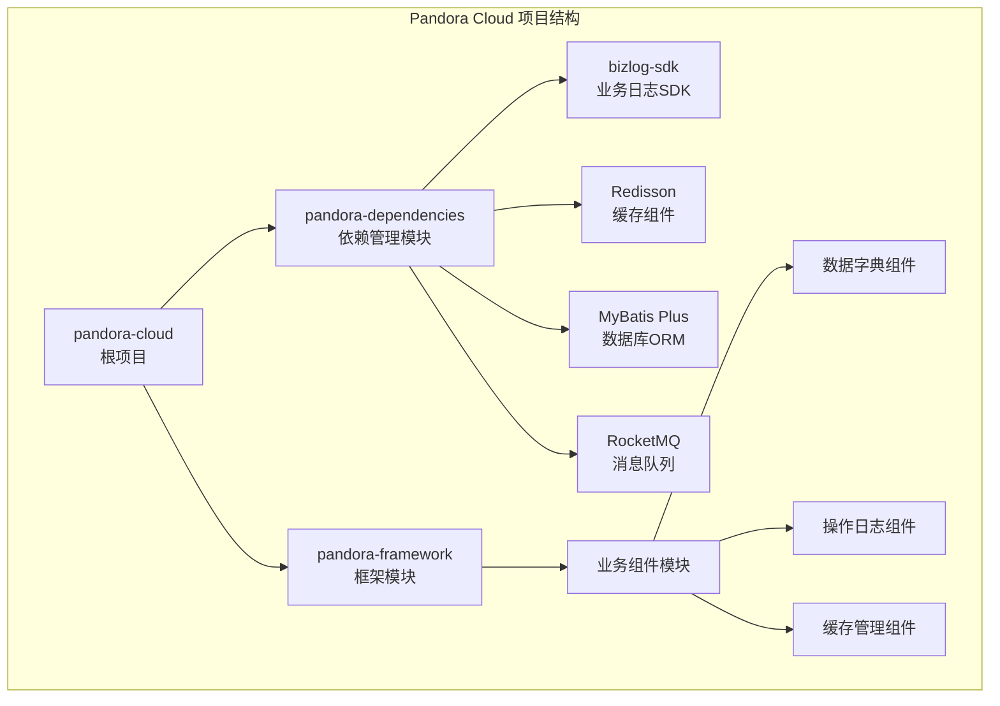

**图表来源**
- [pom.xml:11-14](file://pom.xml#L11-L14)
- [pandora-framework/pom.xml:15-24](file://pandora-framework/pom.xml#L15-L24)

### 模块组织原则

项目遵循以下模块组织原则：

1. **依赖统一管理**：通过pandora-dependencies模块统一管理所有依赖版本
2. **框架与业务分离**：pandora-framework模块包含技术组件和业务组件
3. **模块化设计**：每个业务组件独立封装，便于复用和维护
4. **Spring Boot集成**：所有组件都支持Spring Boot自动配置

**章节来源**
- [pom.xml:11-14](file://pom.xml#L11-L14)
- [pandora-framework/pom.xml:15-24](file://pandora-framework/pom.xml#L15-L24)

## 核心组件

基于项目依赖分析，Pandora Cloud计划实现以下核心业务组件：

### 业务日志组件 (Operation Log)

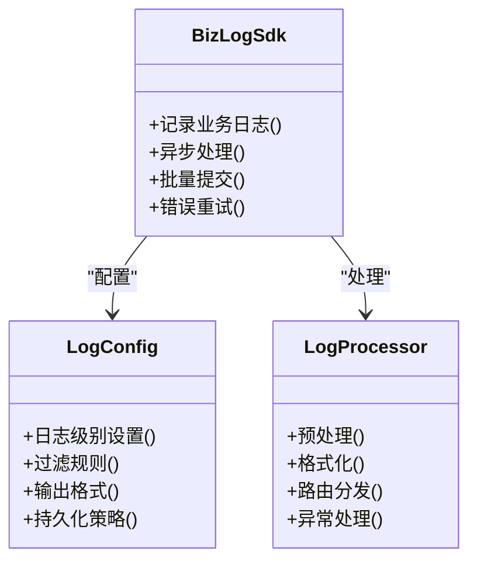

**图表来源**
- [pandora-dependencies/pom.xml:143-153](file://pandora-dependencies/pom.xml#L143-L153)

### 数据字典组件 (Data Dictionary)

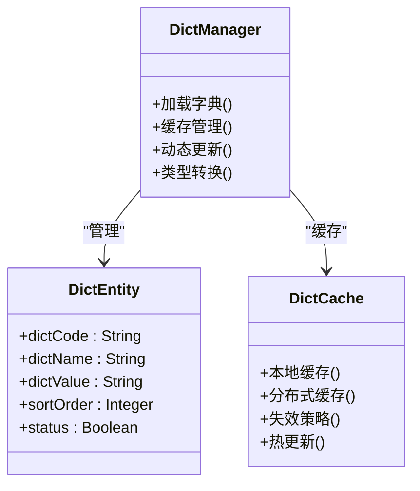

**图表来源**
- [pandora-dependencies/pom.xml:228-252](file://pandora-dependencies/pom.xml#L228-L252)

### 缓存管理组件 (Cache Management)

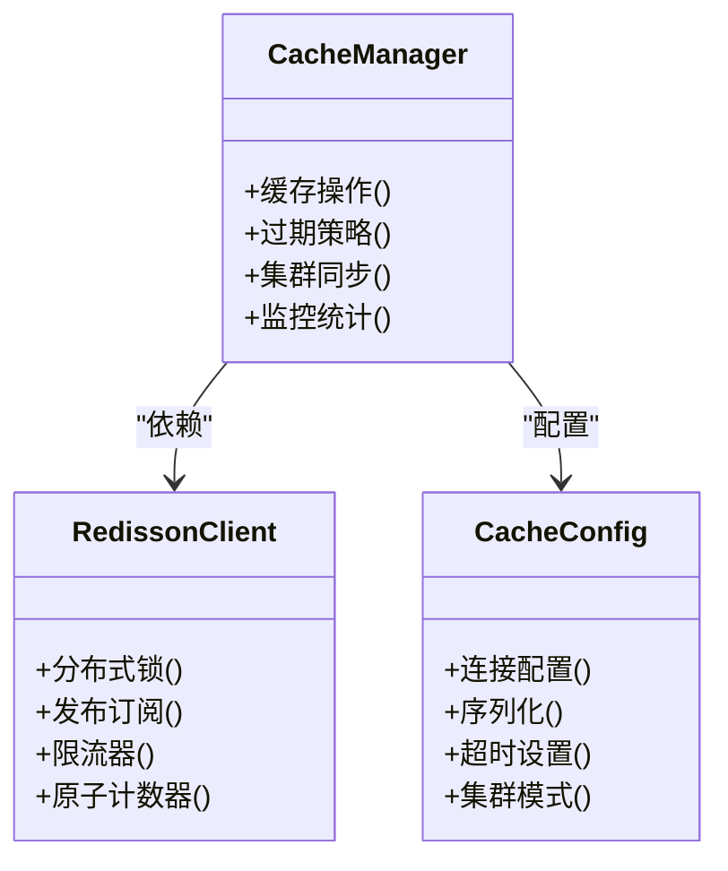

**图表来源**
- [pandora-dependencies/pom.xml:255-259](file://pandora-dependencies/pom.xml#L255-L259)

**章节来源**
- [pandora-dependencies/pom.xml:143-153](file://pandora-dependencies/pom.xml#L143-L153)
- [pandora-dependencies/pom.xml:228-252](file://pandora-dependencies/pom.xml#L228-L252)
- [pandora-dependencies/pom.xml:255-259](file://pandora-dependencies/pom.xml#L255-L259)

## 架构概览

Pandora Cloud采用分层架构设计，确保各组件之间的松耦合和高内聚：

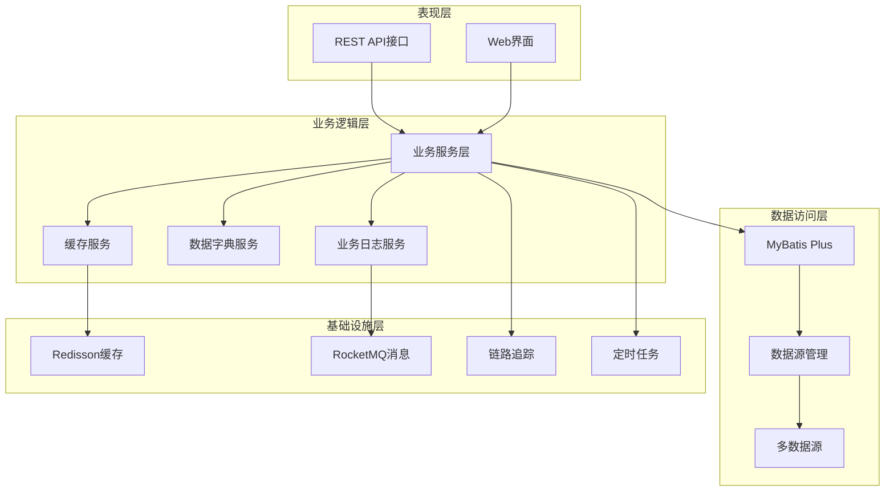

**图表来源**
- [pandora-dependencies/pom.xml:190-226](file://pandora-dependencies/pom.xml#L190-L226)
- [pandora-dependencies/pom.xml:255-259](file://pandora-dependencies/pom.xml#L255-L259)
- [pandora-dependencies/pom.xml:278-282](file://pandora-dependencies/pom.xml#L278-L282)

### 组件交互流程

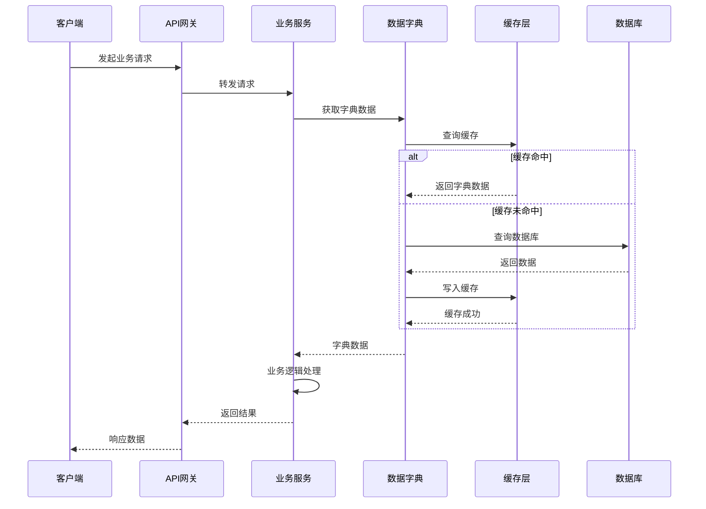

**图表来源**
- [pandora-dependencies/pom.xml:228-252](file://pandora-dependencies/pom.xml#L228-L252)
- [pandora-dependencies/pom.xml:255-259](file://pandora-dependencies/pom.xml#L255-L259)

## 详细组件分析

### 业务日志组件 (BizLog)

#### 设计理念

业务日志组件采用异步处理和批量提交的设计理念，确保业务系统的高性能运行。组件支持多种日志级别、灵活的过滤规则和可扩展的输出格式。

#### 核心功能

1. **异步日志处理**：使用线程池异步处理日志，避免阻塞主线程
2. **批量提交**：支持批量日志提交，减少IO操作次数
3. **错误重试机制**：具备自动重试和降级处理能力
4. **日志聚合**：支持多实例日志聚合和分析

#### 配置选项

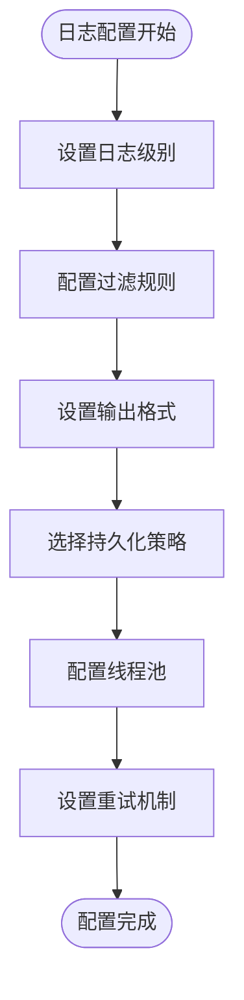

**图表来源**
- [pandora-dependencies/pom.xml:143-153](file://pandora-dependencies/pom.xml#L143-L153)

### 数据字典组件 (Dict Manager)

#### 设计理念

数据字典组件采用缓存优先的设计理念，结合本地缓存和分布式缓存，确保数据访问的高性能和一致性。

#### 核心功能

1. **多级缓存**：支持本地缓存和Redis缓存的多级缓存架构
2. **动态更新**：支持字典数据的实时更新和缓存失效
3. **类型转换**：提供强类型的数据转换和验证
4. **排序管理**：支持字典项的排序和分组管理

#### 数据模型

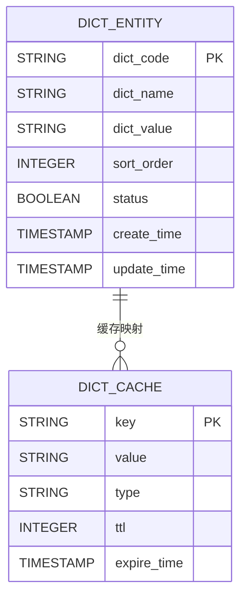

**图表来源**
- [pandora-dependencies/pom.xml:228-252](file://pandora-dependencies/pom.xml#L228-L252)

### 缓存管理组件 (Cache Manager)

#### 设计理念

缓存管理组件基于Redisson实现，提供分布式缓存、分布式锁、发布订阅等功能，确保在微服务架构下的缓存一致性。

#### 核心功能

1. **分布式缓存**：支持Redis集群和哨兵模式
2. **分布式锁**：提供公平锁和读写锁支持
3. **发布订阅**：支持消息的发布和订阅机制
4. **限流控制**：内置令牌桶和漏桶算法

#### 扩展机制

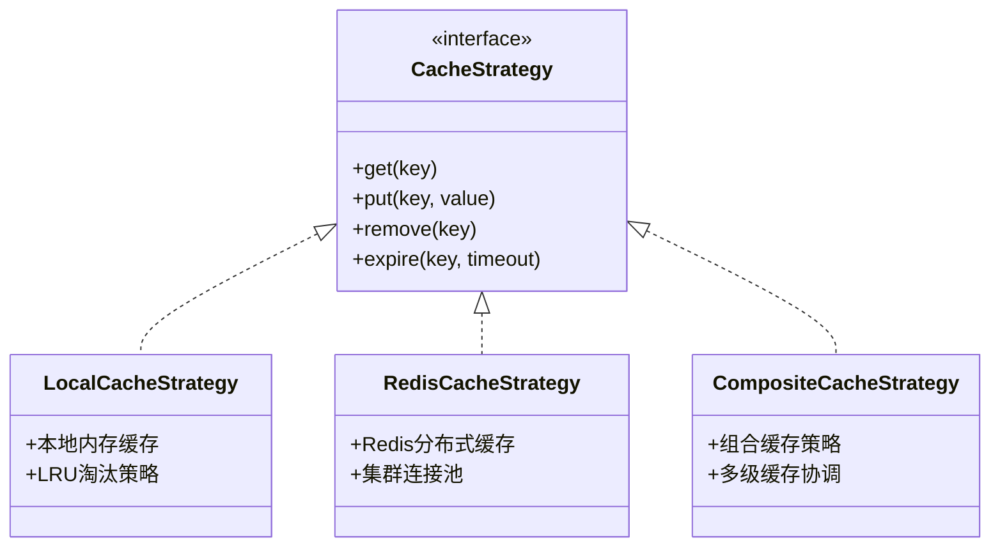

**图表来源**
- [pandora-dependencies/pom.xml:255-259](file://pandora-dependencies/pom.xml#L255-L259)

**章节来源**
- [pandora-dependencies/pom.xml:143-153](file://pandora-dependencies/pom.xml#L143-L153)
- [pandora-dependencies/pom.xml:228-252](file://pandora-dependencies/pom.xml#L228-L252)
- [pandora-dependencies/pom.xml:255-259](file://pandora-dependencies/pom.xml#L255-L259)

## 依赖分析

### 技术栈依赖

Pandora Cloud采用了现代化的企业级技术栈，确保项目的稳定性和可扩展性：

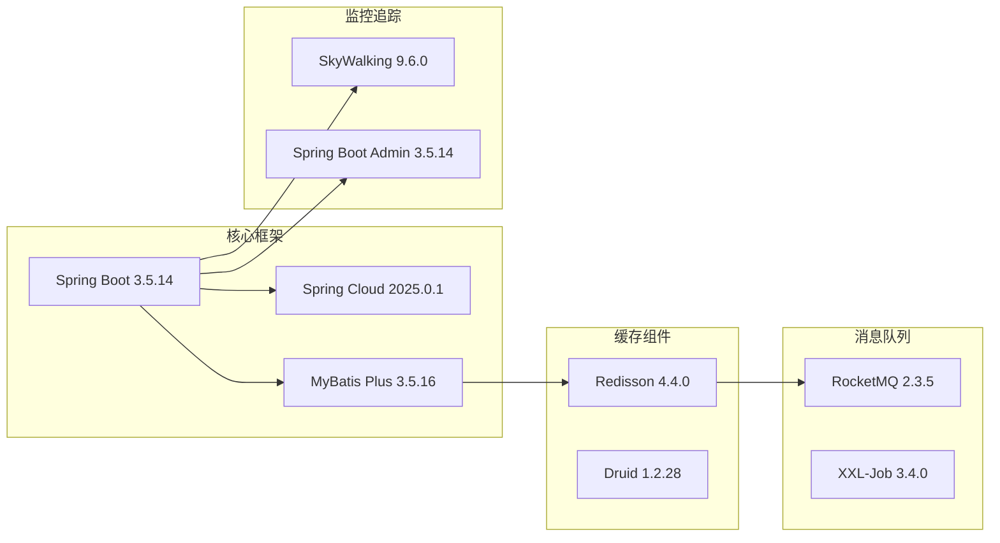

**图表来源**
- [pandora-dependencies/pom.xml:60-91](file://pandora-dependencies/pom.xml#L60-L91)
- [pandora-dependencies/pom.xml:190-226](file://pandora-dependencies/pom.xml#L190-L226)
- [pandora-dependencies/pom.xml:255-259](file://pandora-dependencies/pom.xml#L255-L259)
- [pandora-dependencies/pom.xml:278-282](file://pandora-dependencies/pom.xml#L278-L282)
- [pandora-dependencies/pom.xml:298-338](file://pandora-dependencies/pom.xml#L298-L338)

### 组件耦合度分析

项目采用低耦合的设计原则，各组件之间通过接口和抽象类进行交互：

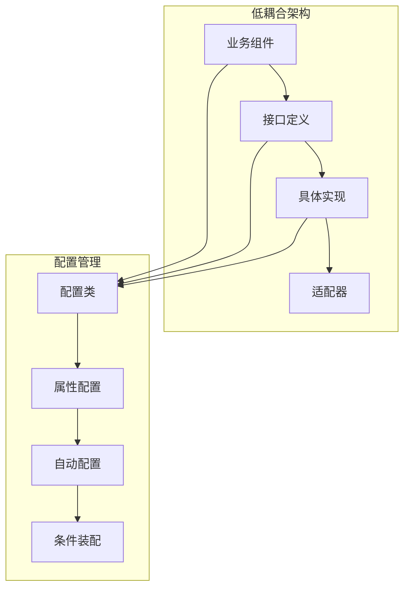

**图表来源**
- [pandora-framework/pom.xml:15-24](file://pandora-framework/pom.xml#L15-L24)

**章节来源**
- [pandora-dependencies/pom.xml:60-91](file://pandora-dependencies/pom.xml#L60-L91)
- [pandora-dependencies/pom.xml:190-226](file://pandora-dependencies/pom.xml#L190-L226)
- [pandora-dependencies/pom.xml:255-259](file://pandora-dependencies/pom.xml#L255-L259)
- [pandora-dependencies/pom.xml:278-282](file://pandora-dependencies/pom.xml#L278-L282)
- [pandora-dependencies/pom.xml:298-338](file://pandora-dependencies/pom.xml#L298-L338)

## 性能考虑

### 缓存策略优化

1. **多级缓存架构**：本地缓存 + Redis缓存 + 数据库三级缓存
2. **预热机制**：启动时预加载常用字典数据到缓存
3. **智能过期**：基于访问频率的智能过期策略
4. **批量操作**：支持批量缓存操作，减少网络开销

### 日志系统优化

1. **异步处理**：日志写入采用异步非阻塞方式
2. **批量提交**：每批100条日志进行批量提交
3. **内存缓冲**：使用环形缓冲区减少GC压力
4. **压缩传输**：日志数据压缩传输，节省带宽

### 数据库优化

1. **连接池管理**：Druid连接池配置优化
2. **SQL优化**：MyBatis Plus SQL优化和缓存
3. **分页查询**：大数据量场景下的分页查询优化
4. **索引策略**：合理的索引设计和维护

## 故障排除指南

### 常见问题及解决方案

#### 缓存相关问题

| 问题类型 | 症状描述 | 可能原因 | 解决方案 |
|---------|---------|---------|---------|
| 缓存穿透 | 查询不存在的数据导致数据库压力增大 | 缓存中无数据且未做空值缓存 | 设置空值缓存，添加布隆过滤器 |
| 缓存雪崩 | 大量缓存在同一时间过期 | 缓存过期时间相同 | 添加随机过期时间，设置不同的过期策略 |
| 缓存击穿 | 热点数据过期导致数据库压力 | 热点数据过期且大量并发访问 | 设置热点数据永不过期，使用互斥锁 |

#### 日志系统问题

| 问题类型 | 症状描述 | 可能原因 | 解决方案 |
|---------|---------|---------|---------|
| 日志丢失 | 部分日志未记录 | 异步处理异常或队列满 | 检查线程池配置，增加队列容量 |
| 日志重复 | 同一条日志多次记录 | 幂等性处理不当 | 添加幂等性标识，使用去重机制 |
| 性能下降 | 日志写入影响业务性能 | 同步写入或批量过大 | 调整异步配置，优化批量大小 |

#### 数据字典问题

| 问题类型 | 症状描述 | 可能原因 | 解决方案 |
|---------|---------|---------|---------|
| 数据不同步 | 不同服务节点字典数据不一致 | 缓存更新不及时 | 实现缓存失效通知机制 |
| 查询缓慢 | 字典查询响应时间长 | 缺少索引或查询优化不足 | 添加必要索引，优化查询语句 |
| 内存占用高 | 应用内存使用过高 | 缓存数据过多 | 调整缓存策略，设置合理的TTL |

### 监控和诊断

1. **性能监控**：使用SkyWalking监控系统性能指标
2. **日志分析**：通过日志聚合工具分析系统运行状态
3. **缓存监控**：监控缓存命中率和内存使用情况
4. **数据库监控**：监控SQL执行时间和连接池状态

**章节来源**
- [pandora-dependencies/pom.xml:298-338](file://pandora-dependencies/pom.xml#L298-L338)

## 结论

Pandora Cloud的业务组件设计体现了现代企业级应用开发的最佳实践。通过模块化的架构设计、完善的依赖管理体系和高性能的技术选型，为构建复杂的企业级应用提供了坚实的基础。

项目的主要优势包括：

1. **模块化设计**：清晰的组件划分和职责分离
2. **技术先进性**：采用最新的Spring Boot和相关生态技术
3. **性能优化**：从缓存、日志、数据库等多个层面进行优化
4. **可扩展性**：良好的扩展机制和插件化设计
5. **运维友好**：完善的监控、日志和故障排除机制

随着业务组件的逐步完善和实现，Pandora Cloud将成为一个功能完整、性能优异的企业级云平台解决方案。

## 附录

### 开发环境要求

- **JDK版本**：Java 25+
- **Maven版本**：3.6.0+
- **数据库**：MySQL 8.0+
- **缓存**：Redis 6.0+
- **消息队列**：RocketMQ 5.0+

### 快速开始

1. 克隆项目到本地
2. 配置数据库连接信息
3. 启动Redis服务
4. 运行`mvn clean install`
5. 启动业务组件服务

### 社区贡献

欢迎通过以下方式参与项目贡献：

- 提交Bug报告和功能建议
- 提交代码改进和新功能
- 提供文档和示例代码
- 参与社区讨论和技术交流