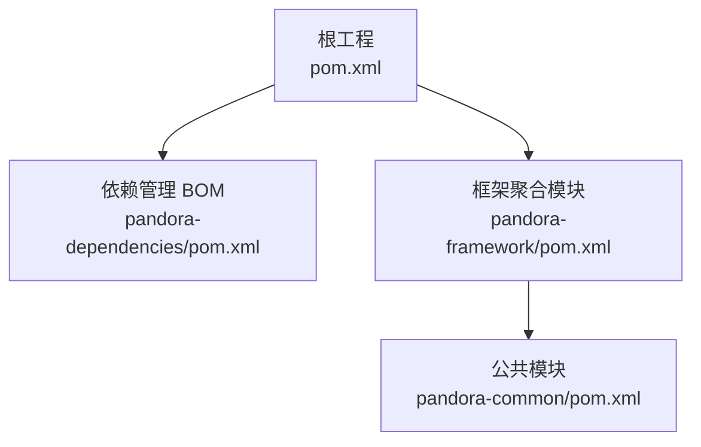
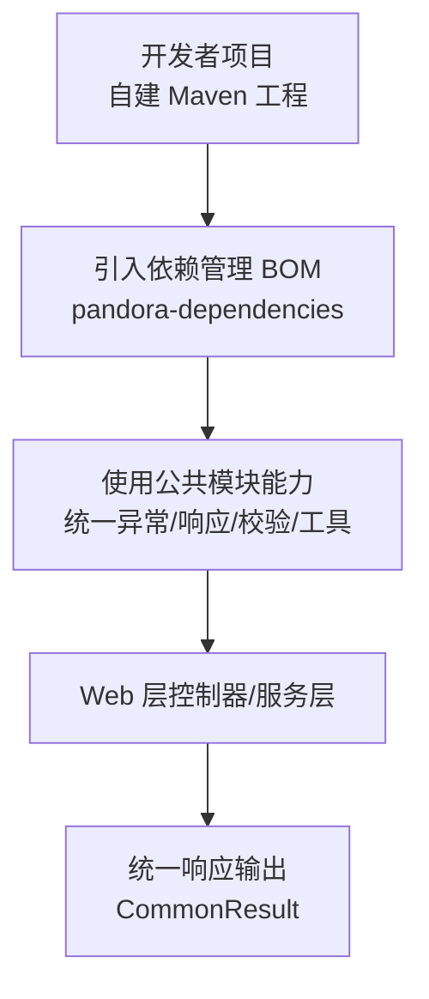
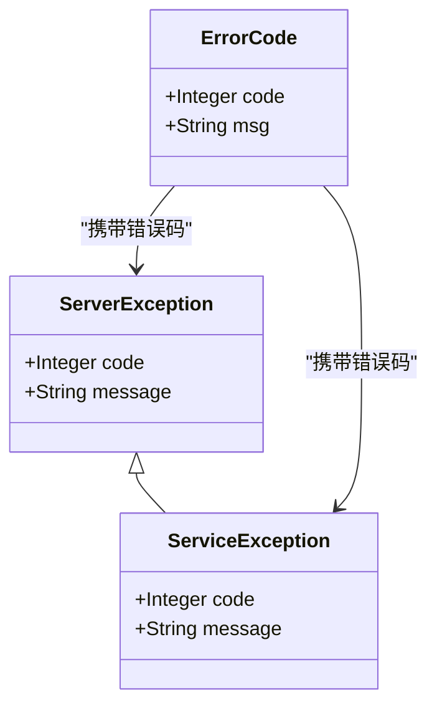
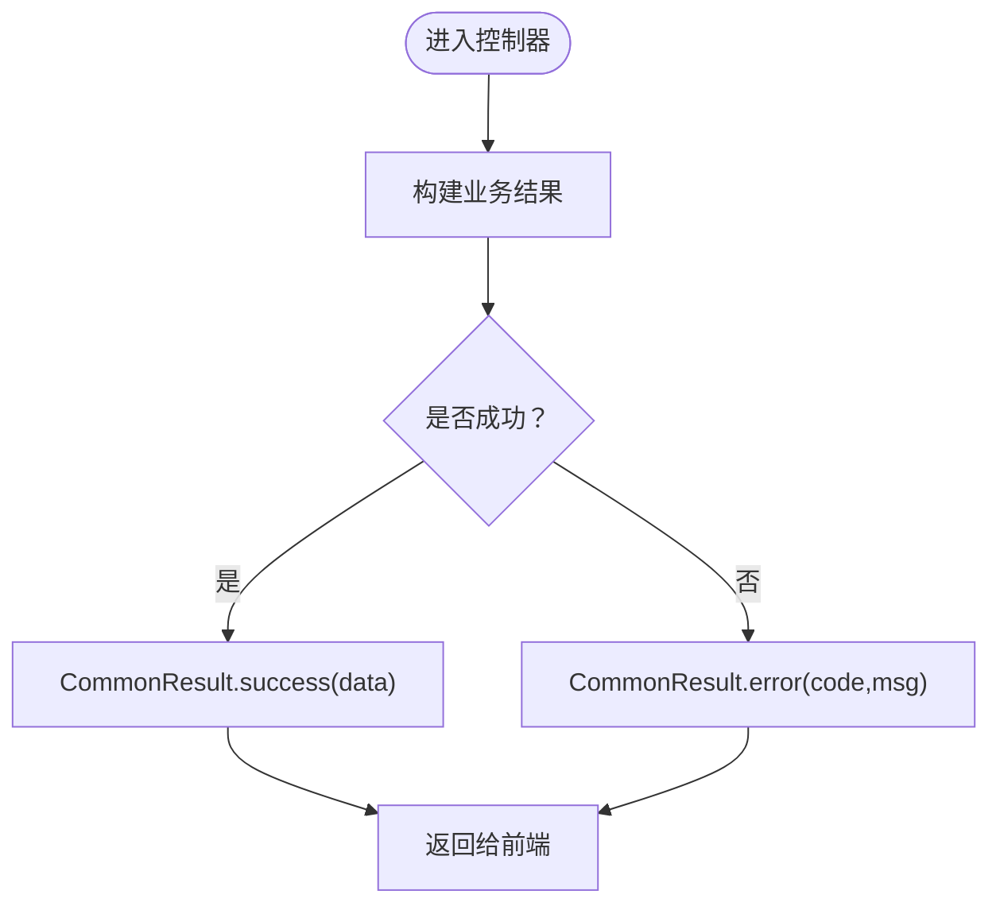
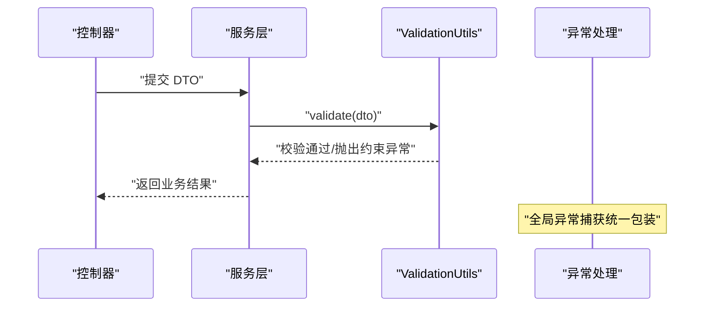
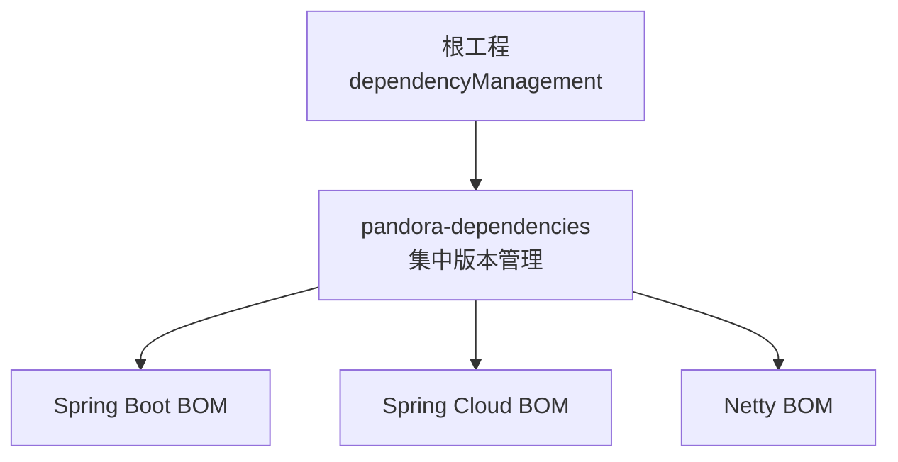

# 快速开始

<cite>
**本文引用的文件**   
- [根工程 POM](file://pom.xml)
- [依赖管理 BOM](file://pandora-dependencies/pom.xml)
- [框架聚合 POM](file://pandora-framework/pom.xml)
- [公共模块 POM](file://pandora-framework/pandora-common/pom.xml)
- [统一异常基类：ServerException](file://pandora-framework/pandora-common/src/main/java/net/ittimeline/pandora/framework/common/exception/ServerException.java)
- [统一异常基类：ServiceException](file://pandora-framework/pandora-common/src/main/java/net/ittimeline/pandora/framework/common/exception/ServiceException.java)
- [错误码载体：ErrorCode](file://pandora-framework/pandora-common/src/main/java/net/ittimeline/pandora/framework/common/exception/ErrorCode.java)
- [统一响应体：CommonResult](file://pandora-framework/pandora-common/src/main/java/net/ittimeline/pandora/framework/common/pojo/CommonResult.java)
- [手机号校验注解：Mobile](file://pandora-framework/pandora-common/src/main/java/net/ittimeline/pandora/framework/common/validation/Mobile.java)
- [校验工具类：ValidationUtils](file://pandora-framework/pandora-common/src/main/java/net/ittimeline/pandora/framework/common/util/web/validation/ValidationUtils.java)
- [终端枚举：TerminalEnum](file://pandora-framework/pandora-common/src/main/java/net/ittimeline/pandora/framework/common/enums/TerminalEnum.java)
- [自动翻译接口：AutoTransable](file://pandora-framework/pandora-common/src/main/java/com/fhs/trans/service/AutoTransable.java)
- [Web 工具类：ServletUtils](file://pandora-framework/pandora-common/src/main/java/net/ittimeline/pandora/framework/common/util/web/servlet/ServletUtils.java)
- [项目总览说明](file://README.md)
</cite>

## 目录
1. [简介](#简介)
2. [项目结构](#项目结构)
3. [核心组件](#核心组件)
4. [架构概览](#架构概览)
5. [详细组件分析](#详细组件分析)
6. [依赖分析](#依赖分析)
7. [性能考虑](#性能考虑)
8. [故障排查指南](#故障排查指南)
9. [结论](#结论)
10. [附录](#附录)

## 简介
本指南面向首次接触 Pandora Cloud 框架的新手，帮助你在约 15 分钟内完成环境准备、依赖引入与第一个 Hello World 示例的运行。你将学习到：
- 环境要求（Java 25、Maven）
- 如何在新项目中通过 BOM 引入 pandora-dependencies 统一管理依赖版本
- 如何使用统一异常处理、工具类与校验注解
- 常见项目结构配置与最佳实践

## 项目结构
Pandora Cloud 采用多模块聚合结构，核心由“依赖管理 BOM”和“框架公共模块”组成：
- 根工程负责统一版本与插件配置，并聚合依赖管理模块
- 依赖管理 BOM 提供统一的第三方组件版本与依赖导入
- 框架公共模块提供统一异常、响应体、校验注解、工具类等基础能力

图表来源
- [根工程 POM:1-150](file://pom.xml#L1-L150)
- [依赖管理 BOM:1-612](file://pandora-dependencies/pom.xml#L1-L612)
- [框架聚合 POM:1-37](file://pandora-framework/pom.xml#L1-L37)
- [公共模块 POM:1-101](file://pandora-framework/pandora-common/pom.xml#L1-L101)

章节来源
- [根工程 POM:1-150](file://pom.xml#L1-L150)
- [项目总览说明:1-15](file://README.md#L1-L15)

## 核心组件
- 统一异常与错误码
  - 通过统一异常基类与错误码载体，规范后端异常与返回
  - 参考：[统一异常基类：ServerException:1-65](file://pandora-framework/pandora-common/src/main/java/net/ittimeline/pandora/framework/common/exception/ServerException.java#L1-L65)、[统一异常基类：ServiceException:1-64](file://pandora-framework/pandora-common/src/main/java/net/ittimeline/pandora/framework/common/exception/ServiceException.java#L1-L64)、[错误码载体：ErrorCode:1-33](file://pandora-framework/pandora-common/src/main/java/net/ittimeline/pandora/framework/common/exception/ErrorCode.java#L1-L33)
- 统一响应体
  - 规范接口返回结构，支持成功/失败、断言与异常转换
  - 参考：[统一响应体：CommonResult:1-123](file://pandora-framework/pandora-common/src/main/java/net/ittimeline/pandora/framework/common/pojo/CommonResult.java#L1-L123)
- 校验注解与工具
  - 提供常用校验注解（如手机号）与校验工具类
  - 参考：[手机号校验注解：Mobile:1-35](file://pandora-framework/pandora-common/src/main/java/net/ittimeline/pandora/framework/common/validation/Mobile.java#L1-L35)、[校验工具类：ValidationUtils:1-56](file://pandora-framework/pandora-common/src/main/java/net/ittimeline/pandora/framework/common/util/web/validation/ValidationUtils.java#L1-L56)
- Web 工具类
  - 提供 JSON 输出、请求上下文、客户端 IP、UA 等便捷方法
  - 参考：[Web 工具类：ServletUtils:1-105](file://pandora-framework/pandora-common/src/main/java/net/ittimeline/pandora/framework/common/util/web/servlet/ServletUtils.java#L1-L105)
- 枚举与自动翻译
  - 提供常用枚举与自动翻译接口，便于字典/状态码翻译
  - 参考：[终端枚举：TerminalEnum:1-43](file://pandora-framework/pandora-common/src/main/java/net/ittimeline/pandora/framework/common/enums/TerminalEnum.java#L1-L43)、[自动翻译接口：AutoTransable:1-61](file://pandora-framework/pandora-common/src/main/java/com/fhs/trans/service/AutoTransable.java#L1-L61)

章节来源
- [统一异常基类：ServerException:1-65](file://pandora-framework/pandora-common/src/main/java/net/ittimeline/pandora/framework/common/exception/ServerException.java#L1-L65)
- [统一异常基类：ServiceException:1-64](file://pandora-framework/pandora-common/src/main/java/net/ittimeline/pandora/framework/common/exception/ServiceException.java#L1-L64)
- [错误码载体：ErrorCode:1-33](file://pandora-framework/pandora-common/src/main/java/net/ittimeline/pandora/framework/common/exception/ErrorCode.java#L1-L33)
- [统一响应体：CommonResult:1-123](file://pandora-framework/pandora-common/src/main/java/net/ittimeline/pandora/framework/common/pojo/CommonResult.java#L1-L123)
- [手机号校验注解：Mobile:1-35](file://pandora-framework/pandora-common/src/main/java/net/ittimeline/pandora/framework/common/validation/Mobile.java#L1-L35)
- [校验工具类：ValidationUtils:1-56](file://pandora-framework/pandora-common/src/main/java/net/ittimeline/pandora/framework/common/util/web/validation/ValidationUtils.java#L1-L56)
- [Web 工具类：ServletUtils:1-105](file://pandora-framework/pandora-common/src/main/java/net/ittimeline/pandora/framework/common/util/web/servlet/ServletUtils.java#L1-L105)
- [终端枚举：TerminalEnum:1-43](file://pandora-framework/pandora-common/src/main/java/net/ittimeline/pandora/framework/common/enums/TerminalEnum.java#L1-L43)
- [自动翻译接口：AutoTransable:1-61](file://pandora-framework/pandora-common/src/main/java/com/fhs/trans/service/AutoTransable.java#L1-L61)

## 架构概览
下图展示了从“引入依赖管理 BOM”到“使用统一异常与工具”的整体流程。

图表来源
- [根工程 POM:40-50](file://pom.xml#L40-L50)
- [依赖管理 BOM:106-146](file://pandora-dependencies/pom.xml#L106-L146)
- [公共模块 POM:26-98](file://pandora-framework/pandora-common/pom.xml#L26-L98)

## 详细组件分析

### 组件一：统一异常与错误码
- 设计要点
  - 通过统一异常基类承载错误码与消息，保证前后端一致的错误语义
  - 错误码载体封装 code/msg，便于集中管理与扩展
- 使用建议
  - 在业务层抛出 ServiceException，网关或拦截器捕获并转为统一响应
- 关键路径
  - [统一异常基类：ServerException:1-65](file://pandora-framework/pandora-common/src/main/java/net/ittimeline/pandora/framework/common/exception/ServerException.java#L1-L65)
  - [统一异常基类：ServiceException:1-64](file://pandora-framework/pandora-common/src/main/java/net/ittimeline/pandora/framework/common/exception/ServiceException.java#L1-L64)
  - [错误码载体：ErrorCode:1-33](file://pandora-framework/pandora-common/src/main/java/net/ittimeline/pandora/framework/common/exception/ErrorCode.java#L1-L33)

图表来源
- [错误码载体：ErrorCode:1-33](file://pandora-framework/pandora-common/src/main/java/net/ittimeline/pandora/framework/common/exception/ErrorCode.java#L1-L33)
- [统一异常基类：ServerException:1-65](file://pandora-framework/pandora-common/src/main/java/net/ittimeline/pandora/framework/common/exception/ServerException.java#L1-L65)
- [统一异常基类：ServiceException:1-64](file://pandora-framework/pandora-common/src/main/java/net/ittimeline/pandora/framework/common/exception/ServiceException.java#L1-L64)

章节来源
- [统一异常基类：ServerException:1-65](file://pandora-framework/pandora-common/src/main/java/net/ittimeline/pandora/framework/common/exception/ServerException.java#L1-L65)
- [统一异常基类：ServiceException:1-64](file://pandora-framework/pandora-common/src/main/java/net/ittimeline/pandora/framework/common/exception/ServiceException.java#L1-L64)
- [错误码载体：ErrorCode:1-33](file://pandora-framework/pandora-common/src/main/java/net/ittimeline/pandora/framework/common/exception/ErrorCode.java#L1-L33)

### 组件二：统一响应体
- 设计要点
  - 统一返回结构 code/msg/data，内置成功/失败工厂方法
  - 提供断言与异常转换，简化调用方判断
- 使用建议
  - 控制器统一返回 CommonResult.success(data) 或 CommonResult.error(...)
- 关键路径
  - [统一响应体：CommonResult:1-123](file://pandora-framework/pandora-common/src/main/java/net/ittimeline/pandora/framework/common/pojo/CommonResult.java#L1-L123)

图表来源
- [统一响应体：CommonResult:74-84](file://pandora-framework/pandora-common/src/main/java/net/ittimeline/pandora/framework/common/pojo/CommonResult.java#L74-L84)

章节来源
- [统一响应体：CommonResult:1-123](file://pandora-framework/pandora-common/src/main/java/net/ittimeline/pandora/framework/common/pojo/CommonResult.java#L1-L123)

### 组件三：校验注解与工具
- 设计要点
  - 提供常用校验注解（如手机号），并配套校验工具类
  - 支持对对象进行分组校验，抛出约束异常
- 使用建议
  - 在 DTO 上标注校验注解，在服务层使用工具类执行校验
- 关键路径
  - [手机号校验注解：Mobile:1-35](file://pandora-framework/pandora-common/src/main/java/net/ittimeline/pandora/framework/common/validation/Mobile.java#L1-L35)
  - [校验工具类：ValidationUtils:1-56](file://pandora-framework/pandora-common/src/main/java/net/ittimeline/pandora/framework/common/util/web/validation/ValidationUtils.java#L1-L56)

图表来源
- [校验工具类：ValidationUtils:43-54](file://pandora-framework/pandora-common/src/main/java/net/ittimeline/pandora/framework/common/util/web/validation/ValidationUtils.java#L43-L54)

章节来源
- [手机号校验注解：Mobile:1-35](file://pandora-framework/pandora-common/src/main/java/net/ittimeline/pandora/framework/common/validation/Mobile.java#L1-L35)
- [校验工具类：ValidationUtils:1-56](file://pandora-framework/pandora-common/src/main/java/net/ittimeline/pandora/framework/common/util/web/validation/ValidationUtils.java#L1-L56)

### 组件四：Web 工具类
- 设计要点
  - 提供 JSON 输出、请求上下文获取、客户端 IP、UA、请求体读取等
- 使用建议
  - 在控制器中直接使用工具类进行响应输出与请求信息获取
- 关键路径
  - [Web 工具类：ServletUtils:1-105](file://pandora-framework/pandora-common/src/main/java/net/ittimeline/pandora/framework/common/util/web/servlet/ServletUtils.java#L1-L105)

章节来源
- [Web 工具类：ServletUtils:1-105](file://pandora-framework/pandora-common/src/main/java/net/ittimeline/pandora/framework/common/util/web/servlet/ServletUtils.java#L1-L105)

### 组件五：枚举与自动翻译
- 设计要点
  - 提供常用枚举（如终端类型），并提供自动翻译接口以支持字段翻译
- 使用建议
  - 在 VO 层配合翻译注解使用，减少手动查询字典的成本
- 关键路径
  - [终端枚举：TerminalEnum:1-43](file://pandora-framework/pandora-common/src/main/java/net/ittimeline/pandora/framework/common/enums/TerminalEnum.java#L1-L43)
  - [自动翻译接口：AutoTransable:1-61](file://pandora-framework/pandora-common/src/main/java/com/fhs/trans/service/AutoTransable.java#L1-L61)

章节来源
- [终端枚举：TerminalEnum:1-43](file://pandora-framework/pandora-common/src/main/java/net/ittimeline/pandora/framework/common/enums/TerminalEnum.java#L1-L43)
- [自动翻译接口：AutoTransable:1-61](file://pandora-framework/pandora-common/src/main/java/com/fhs/trans/service/AutoTransable.java#L1-L61)

## 依赖分析
- 依赖管理方式
  - 根工程通过 dependencyManagement 导入 pandora-dependencies，实现版本与依赖的集中管理
  - 依赖管理 BOM 内部再次导入 Spring Boot、Spring Cloud、Netty 等生态 BOM，形成稳定的版本矩阵
- 最佳实践
  - 新项目仅需在 dependencyManagement 中引入 pandora-dependencies，无需重复声明版本
  - 如需扩展第三方组件，优先在依赖管理 BOM 中统一升级版本

图表来源
- [根工程 POM:40-50](file://pom.xml#L40-L50)
- [依赖管理 BOM:117-146](file://pandora-dependencies/pom.xml#L117-L146)

章节来源
- [根工程 POM:40-50](file://pom.xml#L40-L50)
- [依赖管理 BOM:106-146](file://pandora-dependencies/pom.xml#L106-L146)

## 性能考虑
- 统一响应体与异常处理
  - 通过统一异常与响应体，减少分支判断与重复封装，提升开发效率与一致性
- 工具类与注解
  - 合理使用校验注解与工具类，避免在业务逻辑中重复编写校验代码
- 版本与依赖
  - 通过依赖管理 BOM 统一版本，降低冲突风险，间接提升构建稳定性

## 故障排查指南
- 依赖冲突
  - 若出现版本冲突，检查根工程是否正确导入依赖管理 BOM；确认未在子模块中覆盖版本
- 校验异常
  - 使用校验工具类时，若抛出约束异常，检查 DTO 上的校验注解与分组设置
- 响应不一致
  - 确保控制器统一返回统一响应体，避免直接返回原始对象

章节来源
- [根工程 POM:40-50](file://pom.xml#L40-L50)
- [校验工具类：ValidationUtils:43-54](file://pandora-framework/pandora-common/src/main/java/net/ittimeline/pandora/framework/common/util/web/validation/ValidationUtils.java#L43-L54)
- [统一响应体：CommonResult:74-84](file://pandora-framework/pandora-common/src/main/java/net/ittimeline/pandora/framework/common/pojo/CommonResult.java#L74-L84)

## 结论
通过引入 pandora-dependencies 作为依赖管理 BOM，结合统一异常、响应体、校验注解与工具类，你可以快速搭建稳定、规范的微服务项目骨架。建议在新项目中遵循本文档的结构与最佳实践，以获得更高效的开发体验。

## 附录

### 环境要求
- Java 版本：25
- 构建工具：Maven（推荐使用 3.6+）

章节来源
- [根工程 POM:20-26](file://pom.xml#L20-L26)

### 安装与配置步骤（15 分钟清单）
- 步骤 1：创建 Maven 工程
  - 使用任意 IDE 创建空 Maven 工程
- 步骤 2：引入依赖管理 BOM
  - 在 dependencyManagement 中添加对 pandora-dependencies 的导入
  - 参考：[根工程 POM:40-50](file://pom.xml#L40-L50)、[依赖管理 BOM:106-146](file://pandora-dependencies/pom.xml#L106-L146)
- 步骤 3：引入公共模块依赖
  - 在 dependencies 中添加对 pandora-common 的依赖
  - 参考：[公共模块 POM:26-98](file://pandora-framework/pandora-common/pom.xml#L26-L98)
- 步骤 4：创建 Hello World 控制器
  - 使用 Web 工具类输出 JSON，返回统一响应体
  - 参考：[Web 工具类：ServletUtils:22-33](file://pandora-framework/pandora-common/src/main/java/net/ittimeline/pandora/framework/common/util/web/servlet/ServletUtils.java#L22-L33)、[统一响应体：CommonResult:74-84](file://pandora-framework/pandora-common/src/main/java/net/ittimeline/pandora/framework/common/pojo/CommonResult.java#L74-L84)
- 步骤 5：添加校验注解与校验工具
  - 在 DTO 上添加校验注解，使用校验工具类进行校验
  - 参考：[手机号校验注解：Mobile:1-35](file://pandora-framework/pandora-common/src/main/java/net/ittimeline/pandora/framework/common/validation/Mobile.java#L1-L35)、[校验工具类：ValidationUtils:1-56](file://pandora-framework/pandora-common/src/main/java/net/ittimeline/pandora/framework/common/util/web/validation/ValidationUtils.java#L1-L56)
- 步骤 6：运行与验证
  - 启动应用，访问控制器接口，观察统一响应体与异常处理行为

章节来源
- [根工程 POM:40-50](file://pom.xml#L40-L50)
- [依赖管理 BOM:106-146](file://pandora-dependencies/pom.xml#L106-L146)
- [公共模块 POM:26-98](file://pandora-framework/pandora-common/pom.xml#L26-L98)
- [Web 工具类：ServletUtils:22-33](file://pandora-framework/pandora-common/src/main/java/net/ittimeline/pandora/framework/common/util/web/servlet/ServletUtils.java#L22-L33)
- [统一响应体：CommonResult:74-84](file://pandora-framework/pandora-common/src/main/java/net/ittimeline/pandora/framework/common/pojo/CommonResult.java#L74-L84)
- [手机号校验注解：Mobile:1-35](file://pandora-framework/pandora-common/src/main/java/net/ittimeline/pandora/framework/common/validation/Mobile.java#L1-L35)
- [校验工具类：ValidationUtils:1-56](file://pandora-framework/pandora-common/src/main/java/net/ittimeline/pandora/framework/common/util/web/validation/ValidationUtils.java#L1-L56)