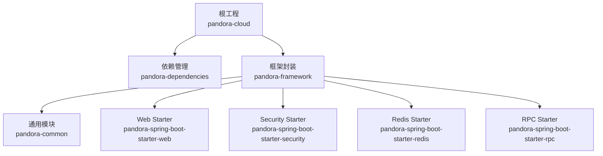
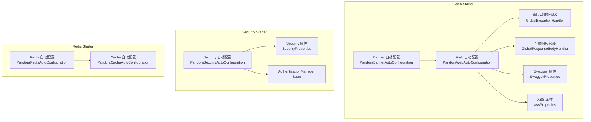
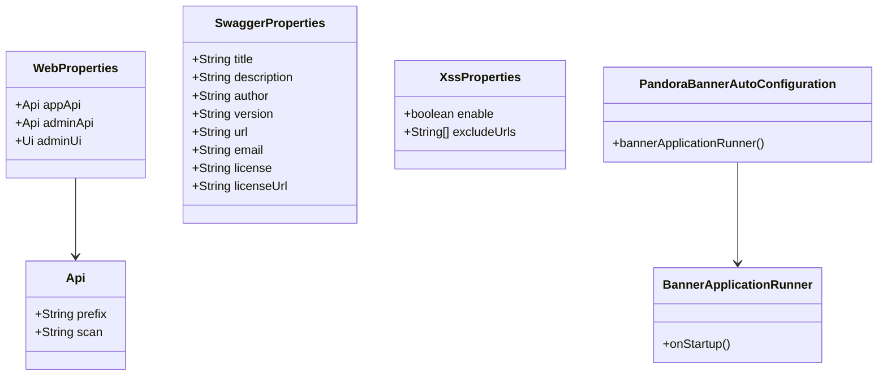
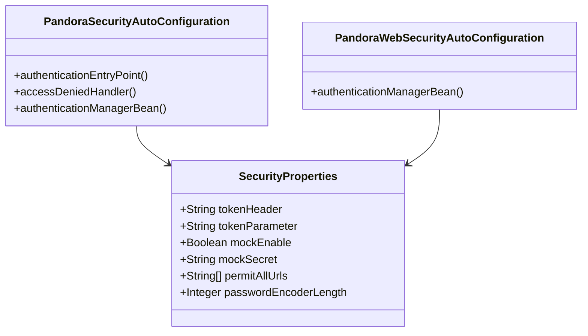
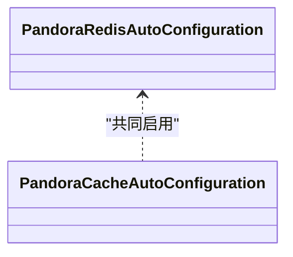
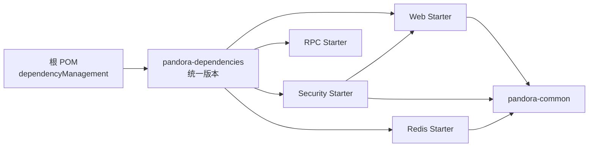

# 快速开始

<cite>
**本文引用的文件**
- [README.md](file://README.md)
- [pom.xml](file://pom.xml)
- [pandora-dependencies/pom.xml](file://pandora-dependencies/pom.xml)
- [pandora-framework/pandora-common/README.md](file://pandora-framework/pandora-common/README.md)
- [pandora-framework/pandora-spring-boot-starter-web/pom.xml](file://pandora-framework/pandora-spring-boot-starter-web/pom.xml)
- [pandora-framework/pandora-spring-boot-starter-web/src/main/resources/META-INF/spring/org.springframework.boot.autoconfigure.AutoConfiguration.imports](file://pandora-framework/pandora-spring-boot-starter-web/src/main/resources/META-INF/spring/org.springframework.boot.autoconfigure.AutoConfiguration.imports)
- [pandora-framework/pandora-spring-boot-starter-web/src/main/java/net/ittimeline/pandora/framework/web/config/WebProperties.java](file://pandora-framework/pandora-spring-boot-starter-web/src/main/java/net/ittimeline/pandora/framework/web/config/WebProperties.java)
- [pandora-framework/pandora-spring-boot-starter-web/src/main/java/net/ittimeline/pandora/framework/swagger/config/SwaggerProperties.java](file://pandora-framework/pandora-spring-boot-starter-web/src/main/java/net/ittimeline/pandora/framework/swagger/config/SwaggerProperties.java)
- [pandora-framework/pandora-spring-boot-starter-web/src/main/java/net/ittimeline/pandora/framework/xss/config/XssProperties.java](file://pandora-framework/pandora-spring-boot-starter-web/src/main/java/net/ittimeline/pandora/framework/xss/config/XssProperties.java)
- [pandora-framework/pandora-spring-boot-starter-web/src/main/java/net/ittimeline/pandora/framework/banner/config/PandoraBannerAutoConfiguration.java](file://pandora-framework/pandora-spring-boot-starter-web/src/main/java/net/ittimeline/pandora/framework/banner/config/PandoraBannerAutoConfiguration.java)
- [pandora-framework/pandora-spring-boot-starter-web/src/main/java/net/ittimeline/pandora/framework/banner/core/BannerApplicationRunner.java](file://pandora-framework/pandora-spring-boot-starter-web/src/main/java/net/ittimeline/pandora/framework/banner/core/BannerApplicationRunner.java)
- [pandora-framework/pandora-spring-boot-starter-security/pom.xml](file://pandora-framework/pandora-spring-boot-starter-security/pom.xml)
- [pandora-framework/pandora-spring-boot-starter-security/src/main/resources/META-INF/spring/org.springframework.boot.autoconfigure.AutoConfiguration.imports](file://pandora-framework/pandora-spring-boot-starter-security/src/main/resources/META-INF/spring/org.springframework.boot.autoconfigure.AutoConfiguration.imports)
- [pandora-framework/pandora-spring-boot-starter-security/src/main/java/net/ittimeline/pandora/framework/security/config/SecurityProperties.java](file://pandora-framework/pandora-spring-boot-starter-security/src/main/java/net/ittimeline/pandora/framework/security/config/SecurityProperties.java)
- [pandora-framework/pandora-spring-boot-starter-redis/pom.xml](file://pandora-framework/pandora-spring-boot-starter-redis/pom.xml)
- [pandora-framework/pandora-spring-boot-starter-redis/src/main/resources/META-INF/spring/org.springframework.boot.autoconfigure.AutoConfiguration.imports](file://pandora-framework/pandora-spring-boot-starter-redis/src/main/resources/META-INF/spring/org.springframework.boot.autoconfigure.AutoConfiguration.imports)
</cite>

## 目录
1. [简介](#简介)
2. [项目结构](#项目结构)
3. [核心组件](#核心组件)
4. [架构总览](#架构总览)
5. [详细组件分析](#详细组件分析)
6. [依赖分析](#依赖分析)
7. [性能考虑](#性能考虑)
8. [故障排除指南](#故障排除指南)
9. [结论](#结论)
10. [附录](#附录)

## 简介
本指南面向首次接触 Pandora Cloud 框架的新用户，帮助你在最短时间内完成环境准备、安装依赖、创建第一个微服务项目，并成功运行一个 Hello World 示例。你将学习如何引入必要的 Starter 组件、配置基础属性、启动服务并验证结果。

## 项目结构
Pandora Cloud 采用多模块 Maven 结构，核心由以下模块组成：
- pandora-dependencies：统一管理依赖版本与坐标，作为 BOM 导入
- pandora-framework：框架封装与 Starter 组件集合
  - pandora-common：通用工具与领域模型
  - pandora-spring-boot-starter-web：Web 层能力（全局异常、API 日志、脱敏、Swagger、XSS、Banner 等）
  - pandora-spring-boot-starter-security：安全与操作日志能力
  - pandora-spring-boot-starter-redis：缓存与 Redis 扩展
  - pandora-spring-boot-starter-rpc：RPC 能力（Feign/OpenFeign）

图表来源
- [pom.xml:11-14](file://pom.xml#L11-L14)
- [pandora-dependencies/pom.xml:106-171](file://pandora-dependencies/pom.xml#L106-L171)

章节来源
- [README.md:1-15](file://README.md#L1-L15)
- [pom.xml:11-14](file://pom.xml#L11-L14)

## 核心组件
- 依赖管理与版本锁定：通过 pandora-dependencies 统一导入 Spring Boot、Spring Cloud、Spring Cloud Alibaba 以及各类生态组件版本，确保一致性与可维护性。
- Web Starter：提供全局异常处理、响应包装、API 访问日志、XSS 过滤、Swagger/OpenAPI 文档、Banner 启动横幅等能力。
- Security Starter：提供认证入口、权限拒绝处理、操作日志记录、Mock 模式、免登录白名单、密码编码器复杂度等配置。
- Redis Starter：集成 Redisson、Spring Cache，提供缓存与分布式锁能力。
- RPC Starter：提供 Feign/OpenFeign 的远程调用能力，便于微服务间通信。

章节来源
- [pandora-dependencies/pom.xml:142-171](file://pandora-dependencies/pom.xml#L142-L171)
- [pandora-framework/pandora-spring-boot-starter-web/pom.xml:19-88](file://pandora-framework/pandora-spring-boot-starter-web/pom.xml#L19-L88)
- [pandora-framework/pandora-spring-boot-starter-security/pom.xml:23-70](file://pandora-framework/pandora-spring-boot-starter-security/pom.xml#L23-L70)
- [pandora-framework/pandora-spring-boot-starter-redis/pom.xml:19-40](file://pandora-framework/pandora-spring-boot-starter-redis/pom.xml#L19-L40)

## 架构总览
下图展示了 Web、Security、Redis 三个 Starter 的自动装配入口与关键 Bean：

图表来源
- [pandora-framework/pandora-spring-boot-starter-web/src/main/resources/META-INF/spring/org.springframework.boot.autoconfigure.AutoConfiguration.imports:1-8](file://pandora-framework/pandora-spring-boot-starter-web/src/main/resources/META-INF/spring/org.springframework.boot.autoconfigure.AutoConfiguration.imports#L1-L8)
- [pandora-framework/pandora-spring-boot-starter-security/src/main/resources/META-INF/spring/org.springframework.boot.autoconfigure.AutoConfiguration.imports:1-6](file://pandora-framework/pandora-spring-boot-starter-security/src/main/resources/META-INF/spring/org.springframework.boot.autoconfigure.AutoConfiguration.imports#L1-L6)
- [pandora-framework/pandora-spring-boot-starter-redis/src/main/resources/META-INF/spring/org.springframework.boot.autoconfigure.AutoConfiguration.imports:1-2](file://pandora-framework/pandora-spring-boot-starter-redis/src/main/resources/META-INF/spring/org.springframework.boot.autoconfigure.AutoConfiguration.imports#L1-L2)

## 详细组件分析

### Web Starter 组件
- 自动装配入口：通过 AutoConfiguration.imports 指定多个自动配置类，覆盖 Banner、Jackson、Web、API 日志、Swagger、XSS、加密等。
- 关键属性：
  - WebProperties：定义 API 前缀与扫描路径，用于统一 RESTful 前缀与安全隔离。
  - SwaggerProperties：定义文档元数据（标题、描述、作者、版本、许可证等）。
  - XssProperties：定义 XSS 过滤开关与排除 URL 列表。
- 关键 Bean：
  - 全局异常处理器与响应包装器，统一返回格式与错误处理。
  - BannerApplicationRunner：启动时输出模块教程链接提示。

图表来源
- [pandora-framework/pandora-spring-boot-starter-web/src/main/java/net/ittimeline/pandora/framework/web/config/WebProperties.java:18-45](file://pandora-framework/pandora-spring-boot-starter-web/src/main/java/net/ittimeline/pandora/framework/web/config/WebProperties.java#L18-L45)
- [pandora-framework/pandora-spring-boot-starter-web/src/main/java/net/ittimeline/pandora/framework/swagger/config/SwaggerProperties.java:14-59](file://pandora-framework/pandora-spring-boot-starter-web/src/main/java/net/ittimeline/pandora/framework/swagger/config/SwaggerProperties.java#L14-L59)
- [pandora-framework/pandora-spring-boot-starter-web/src/main/java/net/ittimeline/pandora/framework/xss/config/XssProperties.java:16-30](file://pandora-framework/pandora-spring-boot-starter-web/src/main/java/net/ittimeline/pandora/framework/xss/config/XssProperties.java#L16-L30)
- [pandora-framework/pandora-spring-boot-starter-web/src/main/java/net/ittimeline/pandora/framework/banner/config/PandoraBannerAutoConfiguration.java:13-19](file://pandora-framework/pandora-spring-boot-starter-web/src/main/java/net/ittimeline/pandora/framework/banner/config/PandoraBannerAutoConfiguration.java#L13-L19)
- [pandora-framework/pandora-spring-boot-starter-web/src/main/java/net/ittimeline/pandora/framework/banner/core/BannerApplicationRunner.java:34-52](file://pandora-framework/pandora-spring-boot-starter-web/src/main/java/net/ittimeline/pandora/framework/banner/core/BannerApplicationRunner.java#L34-L52)

章节来源
- [pandora-framework/pandora-spring-boot-starter-web/src/main/resources/META-INF/spring/org.springframework.boot.autoconfigure.AutoConfiguration.imports:1-8](file://pandora-framework/pandora-spring-boot-starter-web/src/main/resources/META-INF/spring/org.springframework.boot.autoconfigure.AutoConfiguration.imports#L1-L8)
- [pandora-framework/pandora-spring-boot-starter-web/pom.xml:19-88](file://pandora-framework/pandora-spring-boot-starter-web/pom.xml#L19-L88)

### Security Starter 组件
- 自动装配入口：Security、WebSecurity、RPC 相关配置与操作日志配置。
- 关键属性：SecurityProperties，包含 Token 请求头/参数、Mock 模式开关与密钥、免登录 URL 白名单、密码编码器复杂度等。
- 关键 Bean：认证管理器 Bean 注册，解决无 @Bean 声明导致无法注入的问题。

图表来源
- [pandora-framework/pandora-spring-boot-starter-security/src/main/java/net/ittimeline/pandora/framework/security/config/SecurityProperties.java:19-57](file://pandora-framework/pandora-spring-boot-starter-security/src/main/java/net/ittimeline/pandora/framework/security/config/SecurityProperties.java#L19-L57)
- [pandora-framework/pandora-spring-boot-starter-security/src/main/resources/META-INF/spring/org.springframework.boot.autoconfigure.AutoConfiguration.imports:1-6](file://pandora-framework/pandora-spring-boot-starter-security/src/main/resources/META-INF/spring/org.springframework.boot.autoconfigure.AutoConfiguration.imports#L1-L6)

章节来源
- [pandora-framework/pandora-spring-boot-starter-security/pom.xml:23-70](file://pandora-framework/pandora-spring-boot-starter-security/pom.xml#L23-L70)

### Redis Starter 组件
- 自动装配入口：Redis 与 Cache 相关自动配置。
- 依赖：Redisson、Spring Cache、Jackson JSR310 时间类型扩展。

图表来源
- [pandora-framework/pandora-spring-boot-starter-redis/src/main/resources/META-INF/spring/org.springframework.boot.autoconfigure.AutoConfiguration.imports:1-2](file://pandora-framework/pandora-spring-boot-starter-redis/src/main/resources/META-INF/spring/org.springframework.boot.autoconfigure.AutoConfiguration.imports#L1-L2)

章节来源
- [pandora-framework/pandora-spring-boot-starter-redis/pom.xml:19-40](file://pandora-framework/pandora-spring-boot-starter-redis/pom.xml#L19-L40)

## 依赖分析
- 版本统一：根 POM 通过 dependencyManagement 导入 pandora-dependencies，后者再统一导入 Spring Boot、Spring Cloud、Spring Cloud Alibaba 与各生态组件版本。
- Starter 依赖关系：
  - Web Starter 依赖 pandora-common 与 RPC Starter
  - Security Starter 依赖 pandora-common、Web Starter 与 RPC Starter
  - Redis Starter 依赖 pandora-common
- 自动装配清单：各 Starter 通过 META-INF/spring 文件声明 AutoConfiguration，Spring Boot 在启动时自动加载。

图表来源
- [pom.xml:40-50](file://pom.xml#L40-L50)
- [pandora-dependencies/pom.xml:106-171](file://pandora-dependencies/pom.xml#L106-L171)
- [pandora-framework/pandora-spring-boot-starter-web/pom.xml:19-35](file://pandora-framework/pandora-spring-boot-starter-web/pom.xml#L19-L35)
- [pandora-framework/pandora-spring-boot-starter-security/pom.xml:23-45](file://pandora-framework/pandora-spring-boot-starter-security/pom.xml#L23-L45)
- [pandora-framework/pandora-spring-boot-starter-redis/pom.xml:19-29](file://pandora-framework/pandora-spring-boot-starter-redis/pom.xml#L19-L29)

章节来源
- [pom.xml:40-50](file://pom.xml#L40-L50)
- [pandora-dependencies/pom.xml:106-171](file://pandora-dependencies/pom.xml#L106-L171)

## 性能考虑
- 编译参数：根 POM 配置了 -parameters 参数以支持 Spring Boot 3.2 的参数名发现，避免运行时反射参数名缺失带来的性能与兼容性问题。
- 注解处理器链：同时启用 spring-boot-configuration-processor、lombok、lombok-mapstruct-binding、mapstruct-processor，确保 Lombok 与 MapStruct 的配合正确，减少编译期错误与运行时开销。
- 缓存与序列化：Redis Starter 引入 Jackson JSR310，有助于时间类型的高效序列化；Security Starter 的密码编码器复杂度可按需调整以平衡安全与性能。

章节来源
- [pom.xml:94-98](file://pom.xml#L94-L98)
- [pom.xml:68-92](file://pom.xml#L68-L92)

## 故障排除指南
- 启动参数缺失导致的编译问题：若缺少 -parameters 或注解处理器配置不完整，可能出现参数名不可用或 MapStruct 映射失败。请确认编译插件配置与注解处理器路径正确。
- 自动装配冲突：Security Starter 与 WebSecurity 配置需分别注册 AuthenticationManager Bean，避免初始化报错。确保使用正确的自动配置类。
- XSS 与 API 前缀：如遇跨站脚本或接口暴露问题，请检查 XssProperties 与 WebProperties 的前缀与排除列表配置。
- Banner 提示：启动时 BannerApplicationRunner 会输出模块教程链接，便于快速上手其他模块。

章节来源
- [pandora-framework/pandora-spring-boot-starter-web/src/main/java/net/ittimeline/pandora/framework/xss/config/XssProperties.java:16-30](file://pandora-framework/pandora-spring-boot-starter-web/src/main/java/net/ittimeline/pandora/framework/xss/config/XssProperties.java#L16-L30)
- [pandora-framework/pandora-spring-boot-starter-web/src/main/java/net/ittimeline/pandora/framework/web/config/WebProperties.java:18-45](file://pandora-framework/pandora-spring-boot-starter-web/src/main/java/net/ittimeline/pandora/framework/web/config/WebProperties.java#L18-L45)
- [pandora-framework/pandora-spring-boot-starter-web/src/main/java/net/ittimeline/pandora/framework/banner/core/BannerApplicationRunner.java:34-52](file://pandora-framework/pandora-spring-boot-starter-web/src/main/java/net/ittimeline/pandora/framework/banner/core/BannerApplicationRunner.java#L34-L52)

## 结论
通过本指南，你已了解 Pandora Cloud 的模块划分、核心 Starter 组件及其自动装配机制，并掌握了基础配置项与启动流程。建议在本地完成一次 Hello World 示例的构建与运行，随后逐步引入 Redis、Security 等 Starter，完善缓存与安全策略。

## 附录

### 环境要求与安装步骤
- JDK 版本：Java 25
- Maven：3.6+
- 构建与仓库：根 POM 已配置阿里云与华为云 Maven 源，提升依赖下载速度

章节来源
- [pom.xml:20-26](file://pom.xml#L20-L26)
- [pom.xml:135-147](file://pom.xml#L135-L147)

### 创建你的第一个微服务项目
- 新建 Spring Boot 项目，引入 pandora-dependencies 作为 BOM 导入
- 在 dependencyManagement 中导入 pandora-dependencies
- 引入至少一个 Starter：
  - Web Starter：快速搭建 Web 层能力
  - Security Starter：引入安全与操作日志
  - Redis Starter：接入缓存与分布式锁
- 配置基础属性（见“基础配置”）

章节来源
- [pandora-dependencies/pom.xml:106-171](file://pandora-dependencies/pom.xml#L106-L171)
- [pandora-framework/pandora-spring-boot-starter-web/pom.xml:19-35](file://pandora-framework/pandora-spring-boot-starter-web/pom.xml#L19-L35)
- [pandora-framework/pandora-spring-boot-starter-security/pom.xml:23-45](file://pandora-framework/pandora-spring-boot-starter-security/pom.xml#L23-L45)
- [pandora-framework/pandora-spring-boot-starter-redis/pom.xml:19-29](file://pandora-framework/pandora-spring-boot-starter-redis/pom.xml#L19-L29)

### 基础配置
- Web 属性（WebProperties）
  - appApi/adminApi：定义 API 前缀与扫描路径
  - adminUi：管理界面相关配置
- Swagger 属性（SwaggerProperties）
  - 标题、描述、作者、版本、URL、邮箱、许可证与许可证地址
- XSS 属性（XssProperties）
  - enable：是否开启 XSS 过滤
  - excludeUrls：排除 URL 列表
- Security 属性（SecurityProperties）
  - tokenHeader/tokenParameter：令牌请求头与参数
  - mockEnable/mockSecret：Mock 模式开关与密钥
  - permitAllUrls：免登录白名单
  - passwordEncoderLength：BCrypt 密码编码复杂度

章节来源
- [pandora-framework/pandora-spring-boot-starter-web/src/main/java/net/ittimeline/pandora/framework/web/config/WebProperties.java:18-45](file://pandora-framework/pandora-spring-boot-starter-web/src/main/java/net/ittimeline/pandora/framework/web/config/WebProperties.java#L18-L45)
- [pandora-framework/pandora-spring-boot-starter-web/src/main/java/net/ittimeline/pandora/framework/swagger/config/SwaggerProperties.java:14-59](file://pandora-framework/pandora-spring-boot-starter-web/src/main/java/net/ittimeline/pandora/framework/swagger/config/SwaggerProperties.java#L14-L59)
- [pandora-framework/pandora-spring-boot-starter-web/src/main/java/net/ittimeline/pandora/framework/xss/config/XssProperties.java:16-30](file://pandora-framework/pandora-spring-boot-starter-web/src/main/java/net/ittimeline/pandora/framework/xss/config/XssProperties.java#L16-L30)
- [pandora-framework/pandora-spring-boot-starter-security/src/main/java/net/ittimeline/pandora/framework/security/config/SecurityProperties.java:19-57](file://pandora-framework/pandora-spring-boot-starter-security/src/main/java/net/ittimeline/pandora/framework/security/config/SecurityProperties.java#L19-L57)

### 运行第一个 Hello World 示例
- 在你的 Spring Boot 应用中引入 Web Starter
- 启动应用，观察 Banner 输出的模块教程链接
- 访问 Swagger/OpenAPI 文档页面，确认接口可用
- 如需安全保护，引入 Security Starter 并配置免登录白名单

章节来源
- [pandora-framework/pandora-spring-boot-starter-web/src/main/java/net/ittimeline/pandora/framework/banner/core/BannerApplicationRunner.java:34-52](file://pandora-framework/pandora-spring-boot-starter-web/src/main/java/net/ittimeline/pandora/framework/banner/core/BannerApplicationRunner.java#L34-L52)
- [pandora-framework/pandora-spring-boot-starter-web/src/main/resources/META-INF/spring/org.springframework.boot.autoconfigure.AutoConfiguration.imports:1-8](file://pandora-framework/pandora-spring-boot-starter-web/src/main/resources/META-INF/spring/org.springframework.boot.autoconfigure.AutoConfiguration.imports#L1-L8)

### 常见问题与解决方案
- 编译错误：确保注解处理器链完整（spring-boot-configuration-processor、lombok、lombok-mapstruct-binding、mapstruct-processor）
- 参数名不可用：确认编译插件启用 -parameters
- 自动装配冲突：使用正确的 Security 自动配置类，分别注册 AuthenticationManager Bean
- 接口暴露风险：通过 WebProperties 的 API 前缀与扫描路径限制暴露范围
- XSS 与输入过滤：根据业务场景调整 XssProperties.enable 与 excludeUrls

章节来源
- [pom.xml:68-98](file://pom.xml#L68-L98)
- [pandora-framework/pandora-spring-boot-starter-web/src/main/java/net/ittimeline/pandora/framework/web/config/WebProperties.java:18-45](file://pandora-framework/pandora-spring-boot-starter-web/src/main/java/net/ittimeline/pandora/framework/web/config/WebProperties.java#L18-L45)
- [pandora-framework/pandora-spring-boot-starter-web/src/main/java/net/ittimeline/pandora/framework/xss/config/XssProperties.java:16-30](file://pandora-framework/pandora-spring-boot-starter-web/src/main/java/net/ittimeline/pandora/framework/xss/config/XssProperties.java#L16-L30)
- [pandora-framework/pandora-spring-boot-starter-security/src/main/java/net/ittimeline/pandora/framework/security/config/SecurityProperties.java:19-57](file://pandora-framework/pandora-spring-boot-starter-security/src/main/java/net/ittimeline/pandora/framework/security/config/SecurityProperties.java#L19-L57)