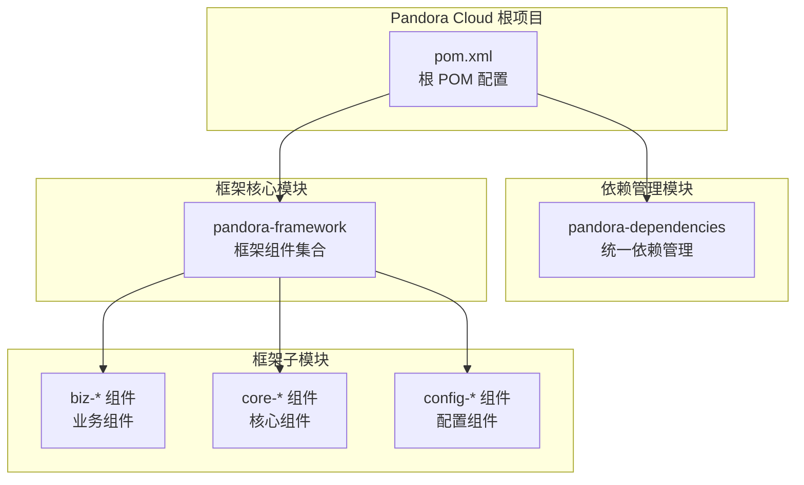
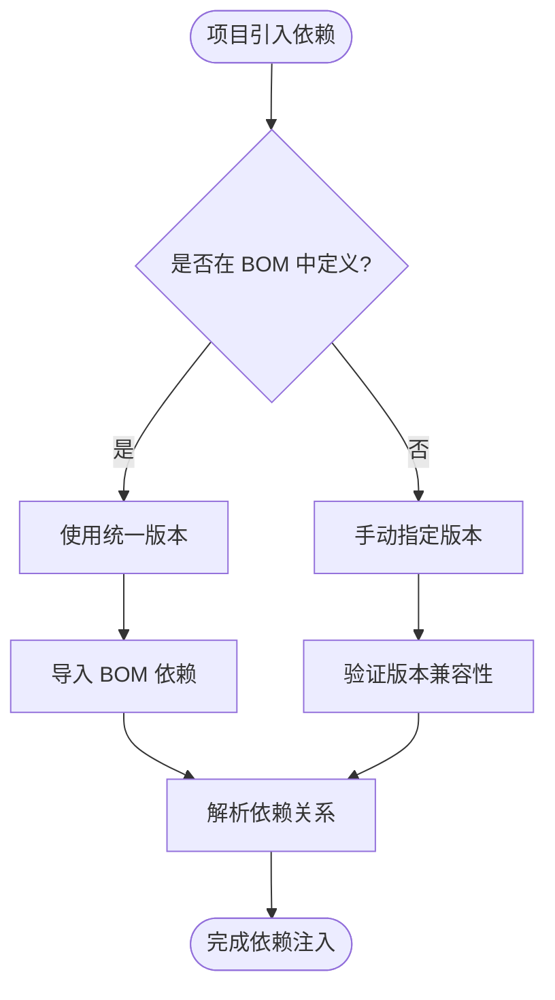
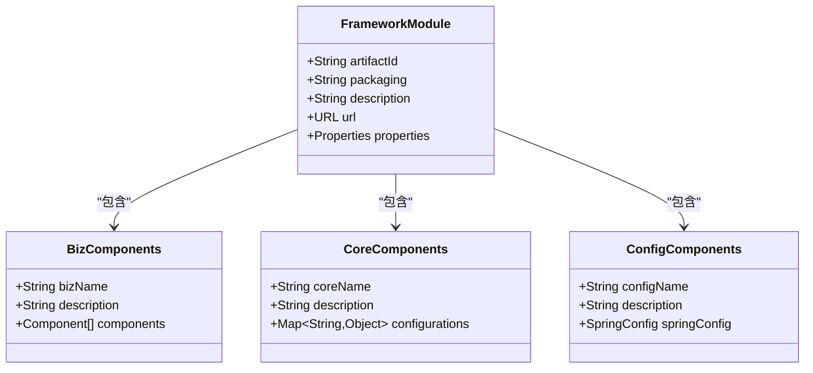
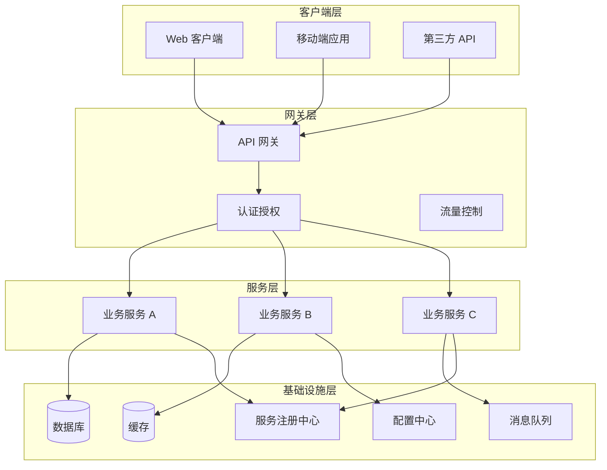
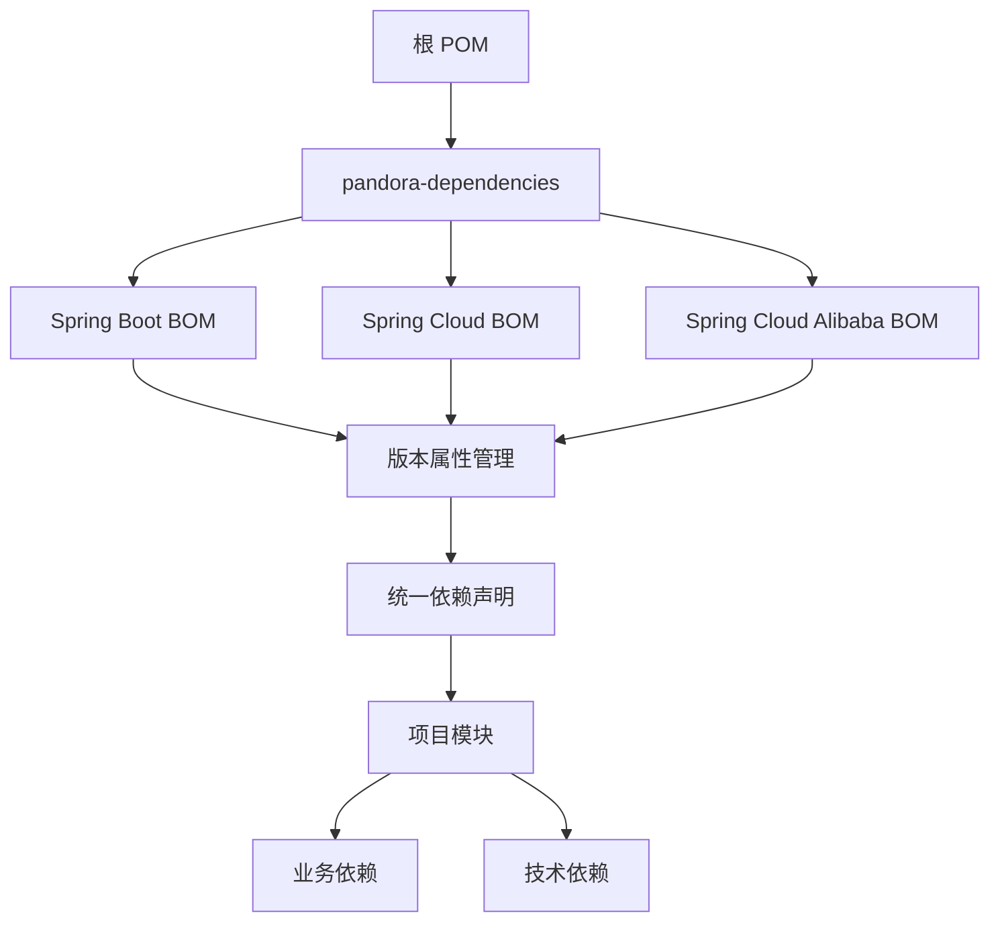
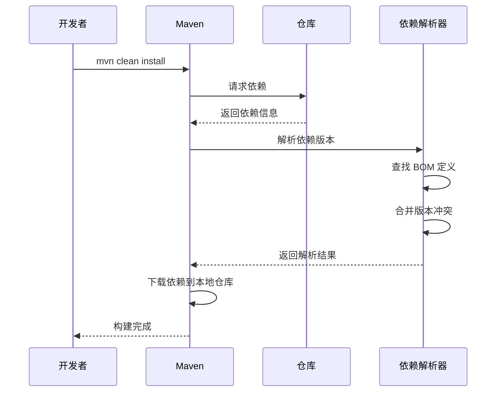
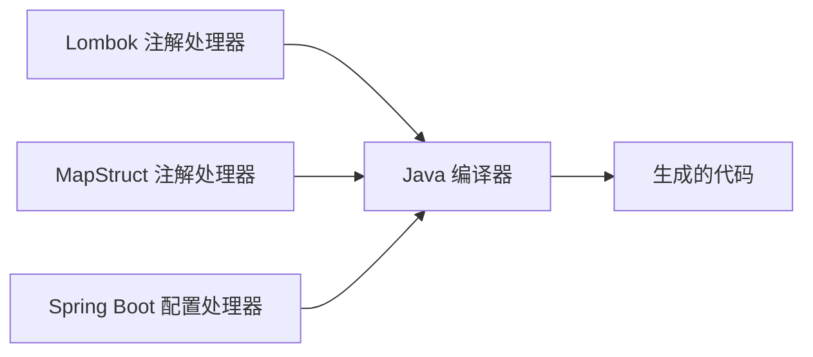
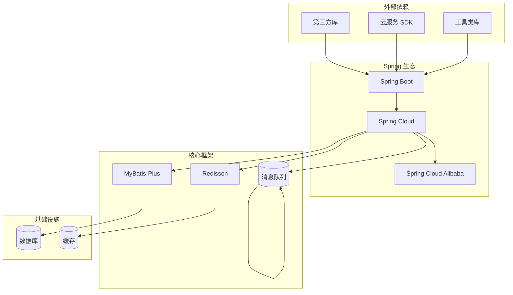
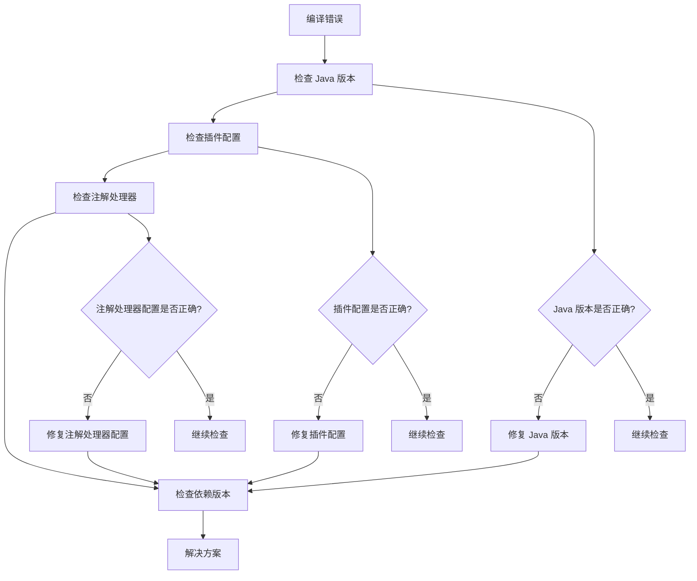

# 快速开始

<cite>
**本文引用的文件**
- [README.md](file://README.md)
- [pom.xml](file://pom.xml)
- [pandora-dependencies/pom.xml](file://pandora-dependencies/pom.xml)
- [pandora-framework/pom.xml](file://pandora-framework/pom.xml)
</cite>

## 目录
1. [简介](#简介)
2. [项目结构](#项目结构)
3. [核心组件](#核心组件)
4. [架构概览](#架构概览)
5. [详细组件分析](#详细组件分析)
6. [依赖分析](#依赖分析)
7. [性能考虑](#性能考虑)
8. [故障排除指南](#故障排除指南)
9. [结论](#结论)
10. [附录](#附录)

## 简介

Pandora Cloud（潘多拉云平台）是一个基于 Spring Boot 3.5.14 和 Spring Cloud 2025.0.1 构建的企业级微服务开发框架。该项目提供了完整的微服务基础设施，包括依赖管理、配置中心、注册发现、网关、监控告警等核心组件，旨在帮助开发者快速构建稳定、可扩展的分布式系统。

该项目采用 Maven 多模块架构设计，通过统一的依赖管理和版本控制，为微服务开发提供了标准化的解决方案。项目支持 Java 25，集成了丰富的第三方组件和工具库，涵盖了从数据库访问到消息队列、从缓存到定时任务的完整技术栈。

## 项目结构

Pandora Cloud 采用标准的 Maven 多模块项目结构，主要包含以下核心模块：



**图表来源**
- [pom.xml:11-14](file://pom.xml#L11-L14)
- [pandora-framework/pom.xml:15-24](file://pandora-framework/pom.xml#L15-L24)

### 核心特性

- **统一依赖管理**：通过 `pandora-dependencies` 模块集中管理所有依赖版本
- **模块化设计**：清晰的模块划分，便于维护和扩展
- **现代化技术栈**：基于最新的 Spring 生态系统版本
- **企业级功能**：集成监控、链路追踪、配置中心等生产环境必需功能

**章节来源**
- [pom.xml:1-150](file://pom.xml#L1-L150)
- [pandora-framework/pom.xml:1-34](file://pandora-framework/pom.xml#L1-L34)

## 核心组件

### 依赖管理系统

Pandora Cloud 的依赖管理采用 BOM（Bill of Materials）模式，通过 `pandora-dependencies` 模块统一管理所有依赖版本，确保项目中使用的组件版本一致性。

#### 主要依赖版本

| 组件类别 | 版本 | 用途 |
|---------|------|------|
| Spring Boot | 3.5.14 | 应用框架核心 |
| Spring Cloud | 2025.0.1 | 微服务治理 |
| Spring Cloud Alibaba | 2025.0.0.0 | 阿里巴巴生态集成 |
| MyBatis | 3.5.19 | ORM 映射 |
| MyBatis-Plus | 3.5.16 | 增强 ORM 功能 |
| Redisson | 4.4.0 | 分布式 Redis 客户端 |

#### 依赖管理策略



**图表来源**
- [pandora-dependencies/pom.xml:109-140](file://pandora-dependencies/pom.xml#L109-L140)

**章节来源**
- [pandora-dependencies/pom.xml:1-658](file://pandora-dependencies/pom.xml#L1-L658)

### 框架核心模块

`pandora-framework` 模块作为框架的核心，采用分层设计，将技术组件分为两大类：

#### 技术组件分类

1. **框架组件**：对现有技术栈的增强和扩展
   - MyBatis 扩展
   - Redis 缓存增强
   - 数据库连接池优化

2. **业务组件**：针对具体业务场景的封装
   - 数据字典管理
   - 操作日志记录
   - 权限控制

#### 组件组织结构



**图表来源**
- [pandora-framework/pom.xml:15-24](file://pandora-framework/pom.xml#L15-L24)

**章节来源**
- [pandora-framework/pom.xml:1-34](file://pandora-framework/pom.xml#L1-L34)

## 架构概览

Pandora Cloud 提供了完整的微服务架构解决方案，支持从单体应用到分布式系统的演进。

### 整体架构设计



### 技术栈集成

项目集成了丰富的企业级技术组件，形成完整的微服务生态系统：

#### 核心技术栈

| 技术类别 | 组件 | 版本 | 作用 |
|---------|------|------|------|
| Web 框架 | Spring MVC | 3.5.14 | Web 应用开发 |
| 数据访问 | MyBatis-Plus | 3.5.16 | ORM 映射 |
| 缓存 | Redisson | 4.4.0 | 分布式缓存 |
| 消息 | RocketMQ | 2.3.5 | 消息中间件 |
| 监控 | SkyWalking | 9.6.0 | 链路追踪 |
| 文档 | Knife4j | 4.5.0 | API 文档 |

**章节来源**
- [pandora-dependencies/pom.xml:59-104](file://pandora-dependencies/pom.xml#L59-L104)

## 详细组件分析

### 依赖管理机制

Pandora Cloud 的依赖管理采用了多层次的版本控制策略，确保项目在不同环境下的稳定性。

#### 版本管理层次



**图表来源**
- [pandora-dependencies/pom.xml:109-140](file://pandora-dependencies/pom.xml#L109-L140)

#### 依赖解析流程



**图表来源**
- [pandora-dependencies/pom.xml:109-140](file://pandora-dependencies/pom.xml#L109-L140)

**章节来源**
- [pandora-dependencies/pom.xml:109-624](file://pandora-dependencies/pom.xml#L109-L624)

### 构建配置分析

项目采用现代化的 Maven 构建配置，集成了多个插件以优化开发体验和构建效率。

#### 核心构建插件

| 插件名称 | 版本 | 作用 |
|---------|------|------|
| maven-compiler-plugin | 3.15.0 | Java 编译器 |
| maven-surefire-plugin | 3.5.5 | 单元测试执行 |
| flatten-maven-plugin | 1.7.3 | POM 展平处理 |

#### 编译器配置

项目特别配置了注解处理器路径，以支持 Lombok 和 MapStruct 的协同工作：



**图表来源**
- [pom.xml:64-98](file://pom.xml#L64-L98)

**章节来源**
- [pom.xml:52-132](file://pom.xml#L52-L132)

## 依赖分析

### 依赖层次结构

Pandora Cloud 的依赖关系呈现典型的三层架构：



### 版本兼容性矩阵

项目严格管理各组件间的版本兼容性，确保整体系统的稳定性：

| 组件 | 兼容版本范围 | 最佳实践 |
|------|-------------|----------|
| Spring Boot | 3.5.x | 保持最新补丁版本 |
| Spring Cloud | 2025.0.x | 与 Spring Boot 版本匹配 |
| MyBatis-Plus | 3.5.x | 与 MyBatis 版本同步 |
| Redisson | 4.4.x | 与 Redis 版本兼容 |

**章节来源**
- [pandora-dependencies/pom.xml:109-624](file://pandora-dependencies/pom.xml#L109-L624)

## 性能考虑

### 构建性能优化

项目在构建配置中考虑了多种性能优化策略：

#### 并行构建支持

- **多模块并行构建**：利用 Maven 的并行构建能力
- **依赖解析优化**：通过 BOM 减少版本冲突解析时间
- **缓存策略**：合理配置本地仓库缓存

#### 编译性能优化

- **增量编译**：启用 Maven 编译器插件的增量编译
- **注解处理器优化**：配置合理的注解处理器路径
- **编译参数优化**：设置合适的编译参数以提高编译速度

### 运行时性能

#### 内存管理

- **JVM 参数调优**：根据应用需求调整堆内存大小
- **垃圾回收优化**：选择合适的 GC 算法
- **连接池配置**：优化数据库和缓存连接池参数

#### 资源利用

- **线程池配置**：合理配置异步任务线程池
- **缓存策略**：实现多级缓存以提高响应速度
- **数据库优化**：使用连接池和查询优化

## 故障排除指南

### 常见构建问题

#### 依赖冲突解决

当遇到依赖冲突时，可以采取以下步骤：

1. **查看依赖树**：使用 `mvn dependency:tree` 命令查看完整的依赖关系
2. **排除传递依赖**：在 `pom.xml` 中使用 `<exclusions>` 标签排除不需要的依赖
3. **强制指定版本**：在 `<properties>` 中指定目标版本

#### 编译错误处理



**图表来源**
- [pom.xml:64-98](file://pom.xml#L64-L98)

### 环境配置问题

#### Java 环境配置

- **Java 版本要求**：确保使用 Java 25 或更高版本
- **Maven 版本**：建议使用 Maven 3.6.0 或更高版本
- **IDE 配置**：确保 IDE 使用正确的 JDK 和 Maven 版本

#### 网络配置

项目默认使用阿里云和华为云的 Maven 仓库以提升下载速度：

```xml
<repositories>
    <repository>
        <id>aliyunmaven</id>
        <name>aliyun</name>
        <url>https://maven.aliyun.com/repository/public</url>
    </repository>
    <repository>
        <id>huaweicloud</id>
        <name>huawei</name>
        <url>https://mirrors.huaweicloud.com/repository/maven/</url>
    </repository>
</repositories>
```

**章节来源**
- [pom.xml:134-147](file://pom.xml#L134-L147)

## 结论

Pandora Cloud 项目为企业级微服务开发提供了一个完整、稳定且易于扩展的基础设施。通过统一的依赖管理、清晰的模块划分和现代化的技术栈集成，开发者可以专注于业务逻辑的实现，而无需担心底层基础设施的复杂性。

### 主要优势

1. **标准化开发**：统一的依赖管理和版本控制
2. **模块化设计**：清晰的组件划分便于维护和扩展
3. **企业级功能**：集成监控、链路追踪、配置中心等生产环境必需功能
4. **现代化技术栈**：基于最新的 Spring 生态系统版本
5. **完善的文档**：清晰的架构设计和组件说明

### 发展方向

随着微服务架构的不断发展，Pandora Cloud 将持续更新和优化，包括：
- 支持更多云原生技术
- 增强可观测性功能
- 优化性能和资源利用率
- 扩展更多的业务组件

## 附录

### 快速开始步骤

#### 环境准备

1. **安装 Java 25 或更高版本**
2. **安装 Maven 3.6.0 或更高版本**
3. **配置 IDE（推荐 IntelliJ IDEA 或 Eclipse）**

#### 项目克隆和构建

```bash
# 克隆项目
git clone https://github.com/ittimeline/pandora-cloud.git
cd pandora-cloud

# 清理并构建项目
mvn clean install
```

#### 创建第一个微服务项目

1. **创建新的 Maven 项目**
2. **添加依赖管理**
3. **配置 Spring Boot 应用**
4. **实现简单的 REST API**

#### 依赖配置示例

在新项目的 `pom.xml` 中添加：

```xml
<dependencyManagement>
    <dependencies>
        <dependency>
            <groupId>net.ittimeline</groupId>
            <artifactId>pandora-dependencies</artifactId>
            <version>${revision}</version>
            <type>pom</type>
            <scope>import</scope>
        </dependency>
    </dependencies>
</dependencyManagement>
```

#### 基础配置文件

创建 `application.yml`：

```yaml
server:
  port: 8080

spring:
  application:
    name: my-first-service
```

### 开发最佳实践

#### 代码规范

- 遵循 Spring Boot 官方代码规范
- 使用 Lombok 简化实体类代码
- 实现接口文档化（使用 Knife4j）

#### 测试策略

- 单元测试覆盖率不低于 80%
- 集成测试覆盖核心业务流程
- 使用 Mockito 进行模拟测试

#### 部署建议

- 使用 Docker 容器化部署
- 配置健康检查和监控
- 实现灰度发布策略