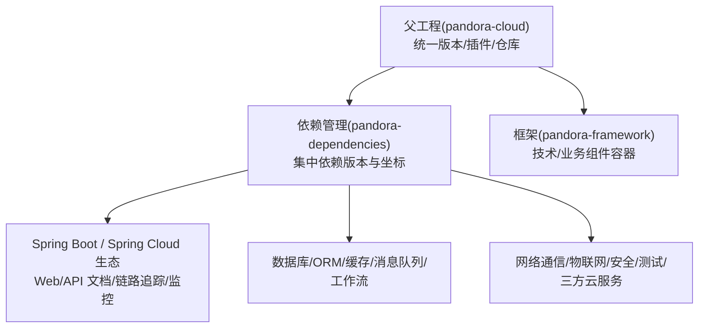
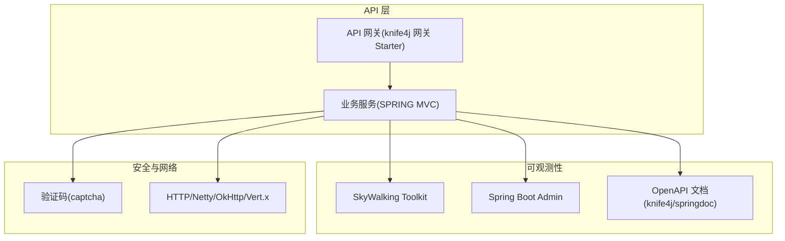
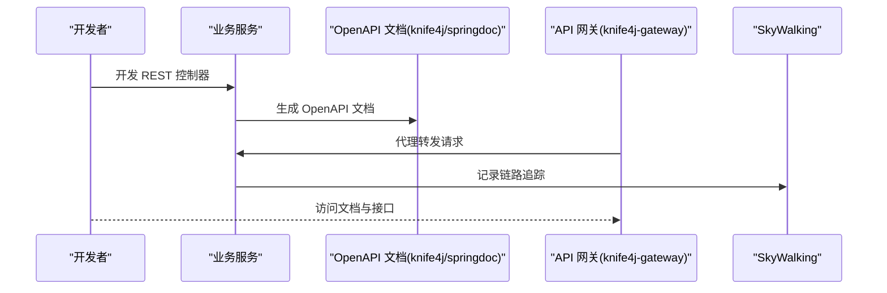
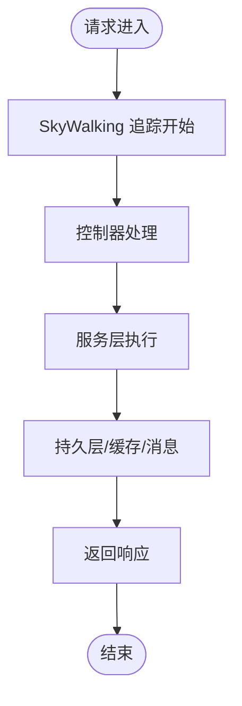
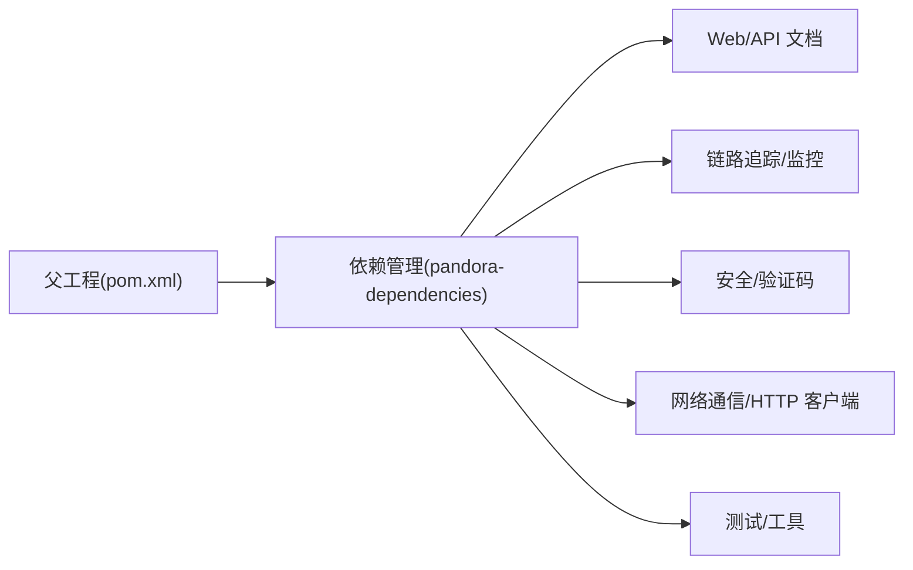

# API 扩展

<cite>
**本文引用的文件**
- [pom.xml](file://pom.xml)
- [README.md](file://README.md)
- [pandora-dependencies/pom.xml](file://pandora-dependencies/pom.xml)
- [pandora-framework/pom.xml](file://pandora-framework/pom.xml)
</cite>

## 目录
1. [简介](#简介)
2. [项目结构](#项目结构)
3. [核心组件](#核心组件)
4. [架构总览](#架构总览)
5. [详细组件分析](#详细组件分析)
6. [依赖分析](#依赖分析)
7. [性能考虑](#性能考虑)
8. [故障排查指南](#故障排查指南)
9. [结论](#结论)
10. [附录](#附录)

## 简介
本指南面向“Pandora Cloud API 扩展”的开发与演进，目标是帮助你在现有基础设施上：
- 扩展现有 API 接口
- 创建新的 API 服务
- 遵循 RESTful 设计原则与最佳实践
- 实施 API 版本管理、向后兼容与弃用策略
- 生成 API 文档、进行测试验证与性能监控
- 强化安全机制、权限控制与认证授权
- 集成 API 网关、负载均衡与熔断降级策略
- 规范错误处理、日志记录与调试技巧
- 提供可复用的扩展示例与配置模板

当前仓库为父工程与依赖管理模块，核心能力通过依赖清单与构建配置体现；后续可在实际业务模块中落地上述主题。

章节来源
- [README.md:1-2](file://README.md#L1-L2)

## 项目结构
仓库采用多模块聚合结构，核心由以下模块组成：
- 父工程 POM：统一版本、插件与仓库配置
- 依赖管理模块：集中管理各子系统依赖版本与坐标
- 框架组件模块：作为技术或业务组件的容器，按“core/config”分层组织

图表来源
- [pom.xml:1-150](file://pom.xml#L1-L150)
- [pandora-dependencies/pom.xml:106-618](file://pandora-dependencies/pom.xml#L106-L618)
- [pandora-framework/pom.xml:15-24](file://pandora-framework/pom.xml#L15-L24)

章节来源
- [pom.xml:1-150](file://pom.xml#L1-L150)
- [pandora-dependencies/pom.xml:106-618](file://pandora-dependencies/pom.xml#L106-L618)
- [pandora-framework/pom.xml:15-24](file://pandora-framework/pom.xml#L15-L24)

## 核心组件
围绕 API 扩展的关键能力，当前依赖清单已提供如下支撑：
- Web 与 API 文档
  - knife4j OpenAPI 3 Spring Boot Starter（含网关专用）
  - springdoc OpenAPI WebMVC UI Starter
- 链路追踪与监控
  - SkyWalking APM Toolkit（trace/logback/opentracing）
  - Spring Boot Admin（Server/Client）
- 安全与验证码
  - anji-plus captcha starter
- 网络通信与 HTTP 客户端
  - Netty、OkHttp、Vert.x、CoAP、MQTT、JSch
- 测试与工具
  - Mockito Inline、Jedis Mock、Podam 随机 POJO、Hutool、Guava、FastJSON2、Commons Lang3、Jsoup、Reflections

章节来源
- [pandora-dependencies/pom.xml:162-184](file://pandora-dependencies/pom.xml#L162-L184)
- [pandora-dependencies/pom.xml:295-335](file://pandora-dependencies/pom.xml#L295-L335)
- [pandora-dependencies/pom.xml:468-472](file://pandora-dependencies/pom.xml#L468-L472)
- [pandora-dependencies/pom.xml:492-527](file://pandora-dependencies/pom.xml#L492-L527)
- [pandora-dependencies/pom.xml:337-372](file://pandora-dependencies/pom.xml#L337-L372)
- [pandora-dependencies/pom.xml:386-490](file://pandora-dependencies/pom.xml#L386-L490)

## 架构总览
下图展示了 API 扩展的总体架构：以 Spring Boot 为基础，结合 API 文档、链路追踪与监控、安全与网络通信等能力，形成可扩展的 API 层。

图表来源
- [pandora-dependencies/pom.xml:162-184](file://pandora-dependencies/pom.xml#L162-L184)
- [pandora-dependencies/pom.xml:295-335](file://pandora-dependencies/pom.xml#L295-L335)
- [pandora-dependencies/pom.xml:468-472](file://pandora-dependencies/pom.xml#L468-L472)
- [pandora-dependencies/pom.xml:492-527](file://pandora-dependencies/pom.xml#L492-L527)

## 详细组件分析

### 组件 A：API 文档与网关集成
- 目标：通过 Knife4j 与 SpringDoc 生成 OpenAPI 文档，并在网关场景启用专用 Starter
- 关键点
  - 使用 knife4j-openapi3-jakarta-spring-boot-starter 与 springdoc-openapi-starter-webmvc-ui
  - 网关场景引入 knife4j-gateway-spring-boot-starter
  - 与 SkyWalking 链路追踪配合，便于定位接口调用路径

图表来源
- [pandora-dependencies/pom.xml:162-184](file://pandora-dependencies/pom.xml#L162-L184)
- [pandora-dependencies/pom.xml:295-309](file://pandora-dependencies/pom.xml#L295-L309)

章节来源
- [pandora-dependencies/pom.xml:162-184](file://pandora-dependencies/pom.xml#L162-L184)
- [pandora-dependencies/pom.xml:295-309](file://pandora-dependencies/pom.xml#L295-L309)

### 组件 B：链路追踪与监控
- 目标：对 API 调用进行全链路追踪与健康监控
- 关键点
  - SkyWalking Toolkit：trace、logback、opentracing
  - Spring Boot Admin：Server/Client，用于服务端与客户端监控
- 建议
  - 在 API 控制器与服务层埋点
  - 结合文档与监控仪表盘进行性能分析

图表来源
- [pandora-dependencies/pom.xml:295-335](file://pandora-dependencies/pom.xml#L295-L335)

章节来源
- [pandora-dependencies/pom.xml:295-335](file://pandora-dependencies/pom.xml#L295-L335)

### 组件 C：安全与验证码
- 目标：为登录与敏感接口提供验证码与安全防护
- 关键点
  - anji-plus captcha starter 用于图形验证码
  - 结合 Spring Security 或自定义拦截器实现鉴权
- 建议
  - 登录接口强制验证码校验
  - 对高频接口增加频率限制与滑动验证

章节来源
- [pandora-dependencies/pom.xml:468-472](file://pandora-dependencies/pom.xml#L468-L472)

### 组件 D：网络通信与 HTTP 客户端
- 目标：为 API 间调用与外部服务集成提供高性能网络能力
- 关键点
  - Netty、OkHttp、Vert.x、CoAP、MQTT、JSch
- 建议
  - 内部服务优先使用 Netty/Vert.x，对外暴露使用 OkHttp
  - 对物联网场景使用 CoAP/MQTT

章节来源
- [pandora-dependencies/pom.xml:492-527](file://pandora-dependencies/pom.xml#L492-L527)

### 组件 E：测试与工具
- 目标：提升 API 扩展的测试效率与质量
- 关键点
  - Mockito Inline、Jedis Mock、Podam 随机 POJO
  - Hutool、Guava、FastJSON2、Commons Lang3、Jsoup、Reflections
- 建议
  - 使用 Podam 快速构造测试数据
  - 使用 Jedis Mock 进行缓存层单元测试

章节来源
- [pandora-dependencies/pom.xml:337-372](file://pandora-dependencies/pom.xml#L337-L372)
- [pandora-dependencies/pom.xml:386-490](file://pandora-dependencies/pom.xml#L386-L490)

## 依赖分析
- 依赖管理
  - 父工程通过 dependencyManagement 导入依赖管理模块，确保版本一致性
  - 依赖管理模块集中定义 Spring Boot、Spring Cloud、Spring Cloud Alibaba 及生态组件版本
- 组件耦合
  - API 文档、链路追踪、监控、安全与网络通信均为横切能力，通过 Starter 方式接入，低耦合高内聚
- 外部依赖
  - 仓库配置了阿里云与华为云 Maven 源，提升依赖下载速度

图表来源
- [pom.xml:40-50](file://pom.xml#L40-L50)
- [pandora-dependencies/pom.xml:106-618](file://pandora-dependencies/pom.xml#L106-L618)

章节来源
- [pom.xml:40-50](file://pom.xml#L40-L50)
- [pandora-dependencies/pom.xml:106-618](file://pandora-dependencies/pom.xml#L106-L618)

## 性能考虑
- 文档与可观测性
  - 启用 OpenAPI 文档与 SkyWalking 追踪，有助于快速定位性能瓶颈
- 网络与序列化
  - 优先使用高性能网络栈（Netty/Vert.x），合理设置超时与重试
  - JSON 序列化选择 FastJSON2，注意字段命名与空值处理
- 监控与告警
  - 使用 Spring Boot Admin 与 SkyWalking 建立指标与告警体系
- 测试驱动
  - 使用 Jedis Mock 与 Podam 构造高覆盖度的单元测试，减少线上性能问题

章节来源
- [pandora-dependencies/pom.xml:162-184](file://pandora-dependencies/pom.xml#L162-L184)
- [pandora-dependencies/pom.xml:295-335](file://pandora-dependencies/pom.xml#L295-L335)
- [pandora-dependencies/pom.xml:492-527](file://pandora-dependencies/pom.xml#L492-L527)
- [pandora-dependencies/pom.xml:337-372](file://pandora-dependencies/pom.xml#L337-L372)
- [pandora-dependencies/pom.xml:432-437](file://pandora-dependencies/pom.xml#L432-L437)

## 故障排查指南
- 文档与调试
  - 通过 knife4j/springdoc 文档核对接口签名、参数与返回体
  - 使用 SkyWalking 查看链路拓扑与耗时
- 日志与监控
  - 结合 SkyWalking Toolkit 与 Spring Boot Admin 快速定位异常
- 安全与验证码
  - 若登录失败，检查验证码是否正确、是否过期
- 网络与外部依赖
  - 使用 OkHttp/Netty/Vert.x 的超时与重试策略，避免雪崩效应

章节来源
- [pandora-dependencies/pom.xml:162-184](file://pandora-dependencies/pom.xml#L162-L184)
- [pandora-dependencies/pom.xml:295-335](file://pandora-dependencies/pom.xml#L295-L335)
- [pandora-dependencies/pom.xml:468-472](file://pandora-dependencies/pom.xml#L468-L472)
- [pandora-dependencies/pom.xml:492-527](file://pandora-dependencies/pom.xml#L492-L527)

## 结论
本指南基于现有依赖与构建配置，给出了 API 扩展的系统化方法论与实施建议。通过统一的依赖管理、完善的文档与可观测性、安全与网络能力，以及测试与工具支撑，可以在保证质量与性能的前提下高效扩展 API 能力。

## 附录

### A. RESTful 设计原则与最佳实践
- 资源命名与层级清晰，使用名词而非动词
- 统一使用 HTTP 方法表达 CRUD 行为
- 返回标准状态码与错误信息
- 使用分页、排序、过滤参数，保持幂等性
- 明确请求与响应的数据结构，避免过度嵌套

### B. API 版本管理、向后兼容与弃用策略
- 版本策略
  - 使用路径前缀或媒体类型版本化
  - 严格遵循语义化版本（主.次.补丁）
- 向后兼容
  - 新增字段需可选，旧字段不可删除
  - 不破坏已有客户端行为
- 弃用策略
  - 提前发布弃用通知，保留过渡期
  - 提供迁移指引与替代方案

### C. API 文档生成与测试验证
- 文档生成
  - 使用 knife4j/springdoc 自动生成 OpenAPI 文档
  - 在网关场景启用 knife4j-gateway-starter
- 测试验证
  - 使用 OpenAPI/Swagger JSON 进行契约测试
  - 使用 JUnit 与 Mockito 构建单元测试
  - 使用 Jedis Mock 进行缓存层测试

章节来源
- [pandora-dependencies/pom.xml:162-184](file://pandora-dependencies/pom.xml#L162-L184)
- [pandora-dependencies/pom.xml:337-372](file://pandora-dependencies/pom.xml#L337-L372)

### D. 安全机制、权限控制与认证授权
- 认证
  - 登录接口启用验证码校验
  - 使用 HTTPS 传输，必要时引入 JWT/OAuth2
- 授权
  - 基于角色/资源的访问控制（RBAC）
  - 对敏感接口进行细粒度权限校验
- 安全加固
  - 限流与防刷、参数校验、SQL 注入与 XSS 防护

章节来源
- [pandora-dependencies/pom.xml:468-472](file://pandora-dependencies/pom.xml#L468-L472)

### E. API 网关集成、负载均衡与熔断降级
- 网关
  - 使用 knife4j 网关 Starter 提供统一入口与文档聚合
- 负载均衡
  - 与注册中心配合，实现客户端/服务端负载均衡
- 熔断降级
  - 引入熔断器（如 Resilience4j/Hystrix），在异常时快速失败并返回降级响应

章节来源
- [pandora-dependencies/pom.xml:162-184](file://pandora-dependencies/pom.xml#L162-L184)

### F. 错误处理、日志记录与调试技巧
- 错误处理
  - 统一异常处理器，返回标准化错误码与消息
- 日志记录
  - 使用 SkyWalking Toolkit 记录链路日志
  - 结合 Spring Boot Admin 查看服务健康状态
- 调试技巧
  - 使用 OpenAPI 文档与链路追踪快速定位问题
  - 对高频接口增加采样与慢查询日志

章节来源
- [pandora-dependencies/pom.xml:295-335](file://pandora-dependencies/pom.xml#L295-L335)

### G. 扩展示例与配置模板（步骤级指引）
- 扩展现有接口
  - 在业务模块新增或修改控制器，遵循 RESTful 设计
  - 更新 OpenAPI 文档，确保契约一致
  - 添加单元测试与集成测试
- 创建新 API 服务
  - 新建 Spring Boot 模块，引入依赖管理
  - 配置 Knife4j/SpringDoc、SkyWalking、Spring Boot Admin
  - 实现控制器与服务层，编写测试用例
- 版本管理
  - 在路径或媒体类型中引入版本号
  - 发布弃用通知，提供迁移指南
- 安全与监控
  - 在登录接口启用验证码
  - 配置限流与熔断策略，开启链路追踪与监控

章节来源
- [pandora-dependencies/pom.xml:162-184](file://pandora-dependencies/pom.xml#L162-L184)
- [pandora-dependencies/pom.xml:295-335](file://pandora-dependencies/pom.xml#L295-L335)
- [pandora-dependencies/pom.xml:468-472](file://pandora-dependencies/pom.xml#L468-L472)