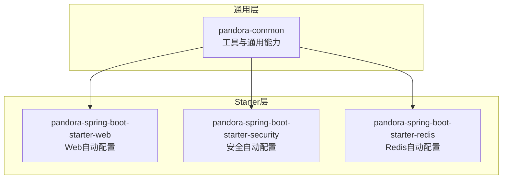
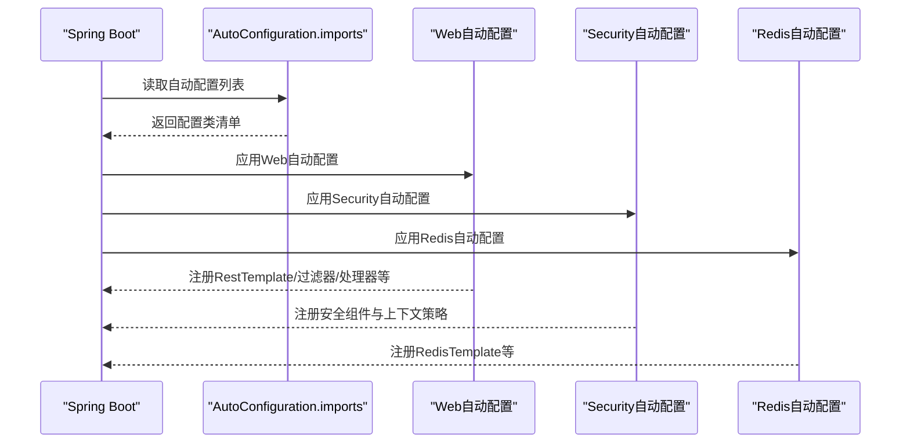
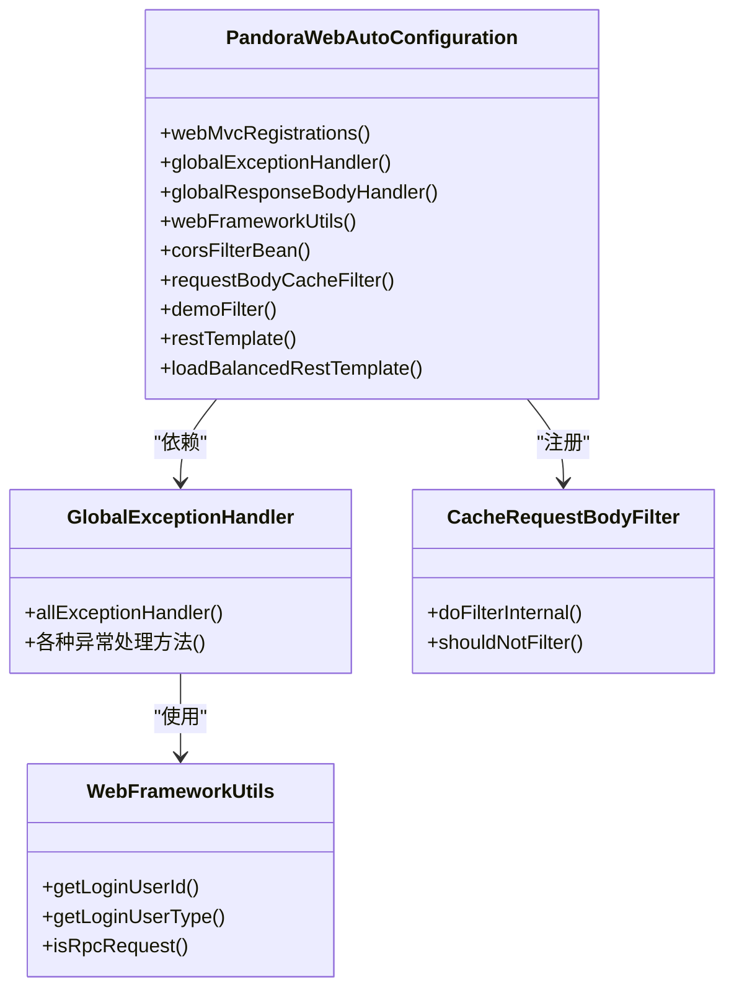
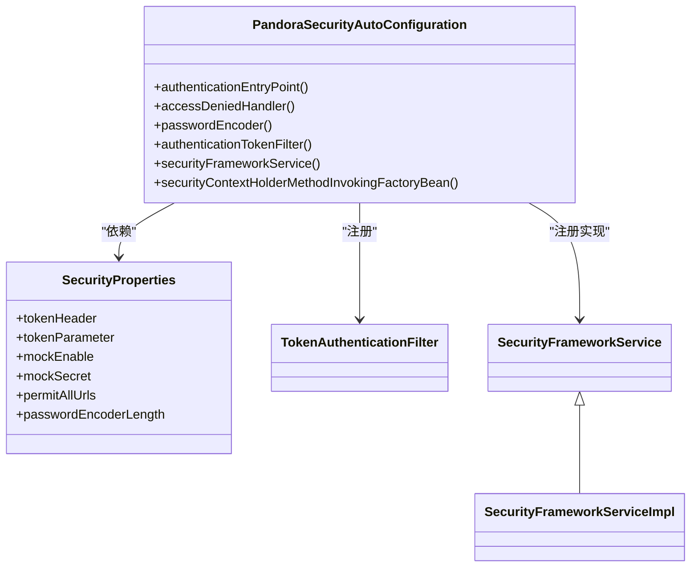
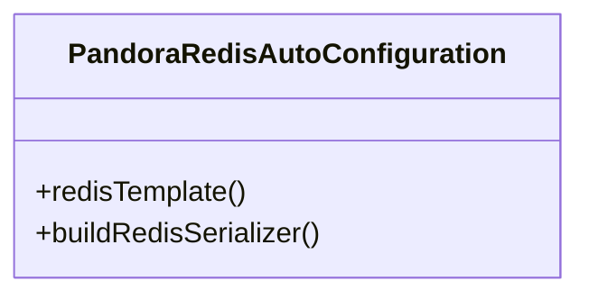
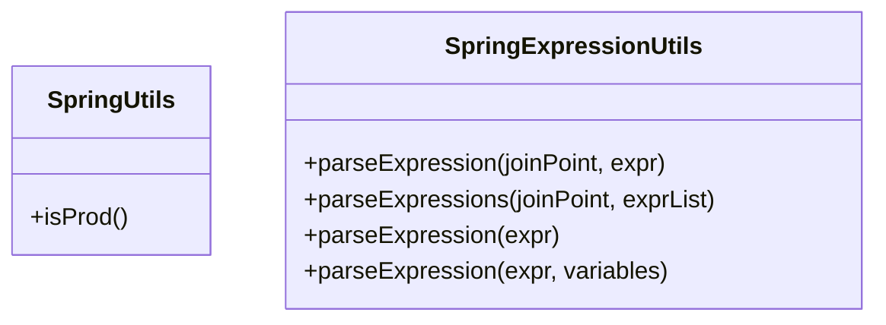
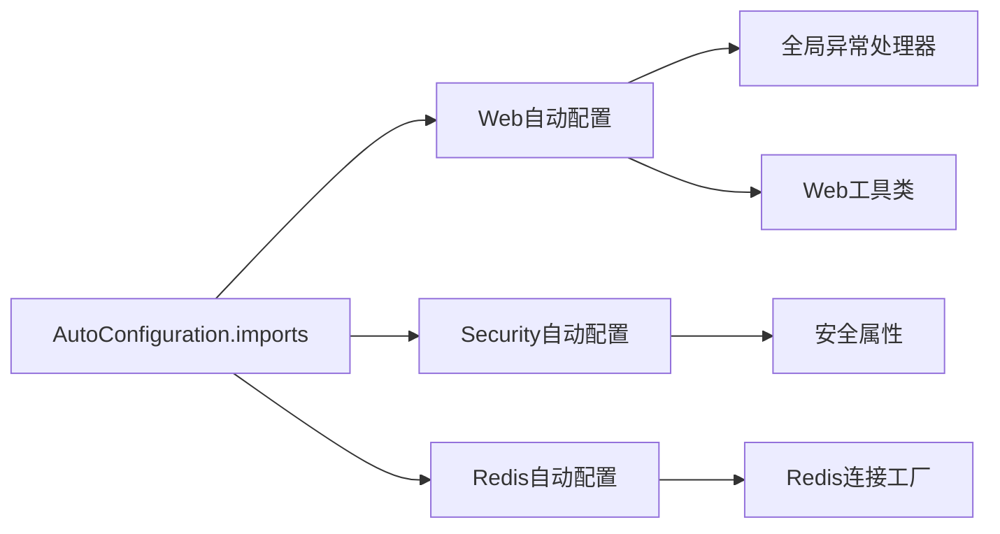

# Bean注入和扩展点

<cite>
**本文引用的文件**
- [SpringUtils.java](file://pandora-framework/pandora-common/src/main/java/net/ittimeline/pandora/framework/common/util/web/spring/SpringUtils.java)
- [SpringExpressionUtils.java](file://pandora-framework/pandora-common/src/main/java/net/ittimeline/pandora/framework/common/util/web/spring/SpringExpressionUtils.java)
- [PandoraWebAutoConfiguration.java](file://pandora-framework/pandora-spring-boot-starter-web/src/main/java/net/ittimeline/pandora/framework/web/config/PandoraWebAutoConfiguration.java)
- [PandoraSecurityAutoConfiguration.java](file://pandora-framework/pandora-spring-boot-starter-security/src/main/java/net/ittimeline/pandora/framework/security/config/PandoraSecurityAutoConfiguration.java)
- [PandoraRedisAutoConfiguration.java](file://pandora-framework/pandora-spring-boot-starter-redis/src/main/java/net/ittimeline/pandora/framework/redis/config/PandoraRedisAutoConfiguration.java)
- [WebProperties.java](file://pandora-framework/pandora-spring-boot-starter-web/src/main/java/net/ittimeline/pandora/framework/web/config/WebProperties.java)
- [SecurityProperties.java](file://pandora-framework/pandora-spring-boot-starter-security/src/main/java/net/ittimeline/pandora/framework/security/config/SecurityProperties.java)
- [CacheRequestBodyFilter.java](file://pandora-framework/pandora-spring-boot-starter-web/src/main/java/net/ittimeline/pandora/framework/web/core/filter/CacheRequestBodyFilter.java)
- [GlobalExceptionHandler.java](file://pandora-framework/pandora-spring-boot-starter-web/src/main/java/net/ittimeline/pandora/framework/web/core/handler/GlobalExceptionHandler.java)
- [WebFrameworkUtils.java](file://pandora-framework/pandora-spring-boot-starter-web/src/main/java/net/ittimeline/pandora/framework/web/core/util/WebFrameworkUtils.java)
- [org.springframework.boot.autoconfigure.AutoConfiguration.imports](file://pandora-framework/pandora-spring-boot-starter-web/src/main/resources/META-INF/spring/org.springframework.boot.autoconfigure.AutoConfiguration.imports)
</cite>

## 目录
1. [引言](#引言)
2. [项目结构](#项目结构)
3. [核心组件](#核心组件)
4. [架构总览](#架构总览)
5. [详细组件分析](#详细组件分析)
6. [依赖分析](#依赖分析)
7. [性能考虑](#性能考虑)
8. [故障排查指南](#故障排查指南)
9. [结论](#结论)
10. [附录](#附录)

## 引言
本指南围绕Spring容器的Bean生命周期与依赖注入机制，结合仓库中的自动配置与扩展点实践，系统讲解如何在现有组件中注入自定义Bean，如何利用条件化、作用域与懒加载等特性，以及如何通过SpEL表达式与动态Bean注册实现灵活扩展。同时提供扩展点识别与利用方法、循环依赖处理建议、测试与调试策略，帮助开发者在不破坏原有设计的前提下进行二次开发。

## 项目结构
本项目采用多模块分层组织，核心能力通过Spring Boot Starter模块提供自动装配与扩展点：
- pandora-common：通用工具与基础能力
- pandora-spring-boot-starter-web：Web相关自动配置与扩展点
- pandora-spring-boot-starter-security：安全相关自动配置与扩展点
- pandora-spring-boot-starter-redis：Redis相关自动配置与扩展点

图表来源
- [org.springframework.boot.autoconfigure.AutoConfiguration.imports:1-8](file://pandora-framework/pandora-spring-boot-starter-web/src/main/resources/META-INF/spring/org.springframework.boot.autoconfigure.AutoConfiguration.imports#L1-L8)

章节来源
- [org.springframework.boot.autoconfigure.AutoConfiguration.imports:1-8](file://pandora-framework/pandora-spring-boot-starter-web/src/main/resources/META-INF/spring/org.springframework.boot.autoconfigure.AutoConfiguration.imports#L1-L8)

## 核心组件
- 自动配置类：通过注解驱动的Bean定义与条件化装配，覆盖Web、安全、Redis等场景。
- 工具类：提供Spring上下文与SpEL表达式解析能力，便于在运行期动态获取Bean与计算表达式。
- 过滤器与全局异常处理器：作为扩展点，可被替换或增强。
- 属性配置类：通过@ConfigurationProperties绑定外部配置，驱动Bean行为。

章节来源
- [PandoraWebAutoConfiguration.java:1-177](file://pandora-framework/pandora-spring-boot-starter-web/src/main/java/net/ittimeline/pandora/framework/web/config/PandoraWebAutoConfiguration.java#L1-L177)
- [PandoraSecurityAutoConfiguration.java:1-99](file://pandora-framework/pandora-spring-boot-starter-security/src/main/java/net/ittimeline/pandora/framework/security/config/PandoraSecurityAutoConfiguration.java#L1-L99)
- [PandoraRedisAutoConfiguration.java:1-50](file://pandora-framework/pandora-spring-boot-starter-redis/src/main/java/net/ittimeline/pandora/framework/redis/config/PandoraRedisAutoConfiguration.java#L1-L50)
- [SpringUtils.java:1-25](file://pandora-framework/pandora-common/src/main/java/net/ittimeline/pandora/framework/common/util/web/spring/SpringUtils.java#L1-L25)
- [SpringExpressionUtils.java:1-124](file://pandora-framework/pandora-common/src/main/java/net/ittimeline/pandora/framework/common/util/web/spring/SpringExpressionUtils.java#L1-L124)
- [WebProperties.java:1-68](file://pandora-framework/pandora-spring-boot-starter-web/src/main/java/net/ittimeline/pandora/framework/web/config/WebProperties.java#L1-L68)
- [SecurityProperties.java:1-58](file://pandora-framework/pandora-spring-boot-starter-security/src/main/java/net/ittimeline/pandora/framework/security/config/SecurityProperties.java#L1-L58)

## 架构总览
自动配置通过META-INF/spring导入机制被Spring Boot发现并应用，随后在运行期由各Starter模块按需注册Bean、过滤器、处理器等扩展点。

图表来源
- [org.springframework.boot.autoconfigure.AutoConfiguration.imports:1-8](file://pandora-framework/pandora-spring-boot-starter-web/src/main/resources/META-INF/spring/org.springframework.boot.autoconfigure.AutoConfiguration.imports#L1-L8)
- [PandoraWebAutoConfiguration.java:43-46](file://pandora-framework/pandora-spring-boot-starter-web/src/main/java/net/ittimeline/pandora/framework/web/config/PandoraWebAutoConfiguration.java#L43-L46)
- [PandoraSecurityAutoConfiguration.java:36-38](file://pandora-framework/pandora-spring-boot-starter-security/src/main/java/net/ittimeline/pandora/framework/security/config/PandoraSecurityAutoConfiguration.java#L36-L38)
- [PandoraRedisAutoConfiguration.java](file://pandora-framework/pandora-spring-boot-starter-redis/src/main/java/net/ittimeline/pandora/framework/redis/config/PandoraRedisAutoConfiguration.java#L19)

## 详细组件分析

### Web自动配置与扩展点
- WebMvcRegistrations定制：通过RequestMappingHandlerMapping设置路径前缀，实现按包与前缀的路由隔离。
- 全局异常处理器：@RestControllerAdvice统一捕获各类异常，转换为统一响应。
- 过滤器链：注册CORS、请求体缓存、演示模式等过滤器，支持顺序控制与条件化启用。
- RestTemplate注册：提供@ConditionalOnMissingBean与@Primary确保唯一性与优先级；支持带负载均衡的RestTemplate。

图表来源
- [PandoraWebAutoConfiguration.java:47-177](file://pandora-framework/pandora-spring-boot-starter-web/src/main/java/net/ittimeline/pandora/framework/web/config/PandoraWebAutoConfiguration.java#L47-L177)
- [GlobalExceptionHandler.java:57-454](file://pandora-framework/pandora-spring-boot-starter-web/src/main/java/net/ittimeline/pandora/framework/web/core/handler/GlobalExceptionHandler.java#L57-L454)
- [CacheRequestBodyFilter.java:20-49](file://pandora-framework/pandora-spring-boot-starter-web/src/main/java/net/ittimeline/pandora/framework/web/core/filter/CacheRequestBodyFilter.java#L20-L49)
- [WebFrameworkUtils.java:22-182](file://pandora-framework/pandora-spring-boot-starter-web/src/main/java/net/ittimeline/pandora/framework/web/core/util/WebFrameworkUtils.java#L22-L182)

章节来源
- [PandoraWebAutoConfiguration.java:43-177](file://pandora-framework/pandora-spring-boot-starter-web/src/main/java/net/ittimeline/pandora/framework/web/config/PandoraWebAutoConfiguration.java#L43-L177)
- [GlobalExceptionHandler.java:57-454](file://pandora-framework/pandora-spring-boot-starter-web/src/main/java/net/ittimeline/pandora/framework/web/core/handler/GlobalExceptionHandler.java#L57-L454)
- [CacheRequestBodyFilter.java:20-49](file://pandora-framework/pandora-spring-boot-starter-web/src/main/java/net/ittimeline/pandora/framework/web/core/filter/CacheRequestBodyFilter.java#L20-L49)
- [WebFrameworkUtils.java:22-182](file://pandora-framework/pandora-spring-boot-starter-web/src/main/java/net/ittimeline/pandora/framework/web/core/util/WebFrameworkUtils.java#L22-L182)

### 安全自动配置与扩展点
- 安全上下文策略：通过MethodInvokingFactoryBean设置TransmittableThreadLocalSecurityContextHolderStrategy，实现线程上下文传递。
- 安全组件：认证入口、权限拒绝处理器、密码编码器、Token认证过滤器、安全服务接口实现等。
- 属性驱动：SecurityProperties提供安全相关配置项，如Token头、参数名、免登录URL、加密复杂度等。

图表来源
- [PandoraSecurityAutoConfiguration.java:36-99](file://pandora-framework/pandora-spring-boot-starter-security/src/main/java/net/ittimeline/pandora/framework/security/config/PandoraSecurityAutoConfiguration.java#L36-L99)
- [SecurityProperties.java:19-58](file://pandora-framework/pandora-spring-boot-starter-security/src/main/java/net/ittimeline/pandora/framework/security/config/SecurityProperties.java#L19-L58)

章节来源
- [PandoraSecurityAutoConfiguration.java:36-99](file://pandora-framework/pandora-spring-boot-starter-security/src/main/java/net/ittimeline/pandora/framework/security/config/PandoraSecurityAutoConfiguration.java#L36-L99)
- [SecurityProperties.java:19-58](file://pandora-framework/pandora-spring-boot-starter-security/src/main/java/net/ittimeline/pandora/framework/security/config/SecurityProperties.java#L19-L58)

### Redis自动配置与扩展点
- RedisTemplate定制：统一KEY序列化为String，VALUE序列化为JSON，并注册JavaTimeModule解决时间序列化问题。
- 与第三方自动配置协作：通过before声明确保自定义RedisTemplate优先于其他版本。

图表来源
- [PandoraRedisAutoConfiguration.java:19-50](file://pandora-framework/pandora-spring-boot-starter-redis/src/main/java/net/ittimeline/pandora/framework/redis/config/PandoraRedisAutoConfiguration.java#L19-L50)

章节来源
- [PandoraRedisAutoConfiguration.java:19-50](file://pandora-framework/pandora-spring-boot-starter-redis/src/main/java/net/ittimeline/pandora/framework/redis/config/PandoraRedisAutoConfiguration.java#L19-L50)

### Spring上下文与SpEL工具
- SpringUtils：基于SpringUtil扩展，提供环境判断等便捷方法。
- SpringExpressionUtils：支持从切面与Bean工厂解析SpEL表达式，支持参数变量与Bean解析器。

图表来源
- [SpringUtils.java:13-25](file://pandora-framework/pandora-common/src/main/java/net/ittimeline/pandora/framework/common/util/web/spring/SpringUtils.java#L13-L25)
- [SpringExpressionUtils.java:31-124](file://pandora-framework/pandora-common/src/main/java/net/ittimeline/pandora/framework/common/util/web/spring/SpringExpressionUtils.java#L31-L124)

章节来源
- [SpringUtils.java:13-25](file://pandora-framework/pandora-common/src/main/java/net/ittimeline/pandora/framework/common/util/web/spring/SpringUtils.java#L13-L25)
- [SpringExpressionUtils.java:31-124](file://pandora-framework/pandora-common/src/main/java/net/ittimeline/pandora/framework/common/util/web/spring/SpringExpressionUtils.java#L31-L124)

## 依赖分析
- 自动配置导入：Web Starter通过META-INF/spring导入多个自动配置类，确保按序装配。
- 组件耦合：Web自动配置依赖全局异常处理器与Web工具类；安全自动配置依赖属性类与安全组件；Redis自动配置依赖连接工厂与序列化策略。
- 外部依赖：使用Hutool、Guava、Spring Security、Spring Web、Redisson等。

图表来源
- [org.springframework.boot.autoconfigure.AutoConfiguration.imports:1-8](file://pandora-framework/pandora-spring-boot-starter-web/src/main/resources/META-INF/spring/org.springframework.boot.autoconfigure.AutoConfiguration.imports#L1-L8)
- [PandoraWebAutoConfiguration.java:47-177](file://pandora-framework/pandora-spring-boot-starter-web/src/main/java/net/ittimeline/pandora/framework/web/config/PandoraWebAutoConfiguration.java#L47-L177)
- [PandoraSecurityAutoConfiguration.java:36-99](file://pandora-framework/pandora-spring-boot-starter-security/src/main/java/net/ittimeline/pandora/framework/security/config/PandoraSecurityAutoConfiguration.java#L36-L99)
- [PandoraRedisAutoConfiguration.java:19-50](file://pandora-framework/pandora-spring-boot-starter-redis/src/main/java/net/ittimeline/pandora/framework/redis/config/PandoraRedisAutoConfiguration.java#L19-L50)

章节来源
- [org.springframework.boot.autoconfigure.AutoConfiguration.imports:1-8](file://pandora-framework/pandora-spring-boot-starter-web/src/main/resources/META-INF/spring/org.springframework.boot.autoconfigure.AutoConfiguration.imports#L1-L8)

## 性能考虑
- 过滤器链顺序：通过@Order控制执行顺序，避免跨域配置失效等问题。
- 序列化优化：Redis使用JSON序列化并注册JavaTimeModule，减少反序列化开销。
- RestTemplate复用：通过@Primary确保唯一实例，避免重复构造带来的资源浪费。
- 异常处理降噪：对常见异常进行快速分支处理，减少堆栈收集与日志输出成本。

## 故障排查指南
- 过滤器不生效：检查FilterRegistrationBean的order与shouldNotFilter逻辑，确认URI排除与请求类型匹配。
- 全局异常未触发：确认异常是否进入Spring MVC流程，Filter抛出的异常需通过全局异常处理器的入口方法兜底。
- 安全上下文丢失：核对MethodInvokingFactoryBean的策略设置，确保线程上下文传递正常。
- Redis序列化异常：确认JSON序列化器与JavaTimeModule注册，避免时间类型序列化失败。
- SpEL解析失败：检查表达式语法与上下文变量，确保BeanResolver可用。

章节来源
- [CacheRequestBodyFilter.java:30-49](file://pandora-framework/pandora-spring-boot-starter-web/src/main/java/net/ittimeline/pandora/framework/web/core/filter/CacheRequestBodyFilter.java#L30-L49)
- [GlobalExceptionHandler.java:79-120](file://pandora-framework/pandora-spring-boot-starter-web/src/main/java/net/ittimeline/pandora/framework/web/core/handler/GlobalExceptionHandler.java#L79-L120)
- [PandoraSecurityAutoConfiguration.java:89-96](file://pandora-framework/pandora-spring-boot-starter-security/src/main/java/net/ittimeline/pandora/framework/security/config/PandoraSecurityAutoConfiguration.java#L89-L96)
- [PandoraRedisAutoConfiguration.java:25-46](file://pandora-framework/pandora-spring-boot-starter-redis/src/main/java/net/ittimeline/pandora/framework/redis/config/PandoraRedisAutoConfiguration.java#L25-L46)
- [SpringExpressionUtils.java:111-122](file://pandora-framework/pandora-common/src/main/java/net/ittimeline/pandora/framework/common/util/web/spring/SpringExpressionUtils.java#L111-L122)

## 结论
本项目通过自动配置与扩展点设计，提供了Web、安全、Redis等领域的即插即用能力。开发者可通过条件化Bean、作用域与懒加载策略、SpEL表达式与动态注册等方式，在不侵入核心逻辑的前提下进行灵活扩展。建议在扩展时遵循“最小变更、明确契约、可观测”的原则，并结合单元测试与集成测试验证行为一致性。

## 附录

### Bean注入与扩展点实践清单
- 替换默认Bean
  - 使用@ConditionalOnMissingBean与@Primary确保唯一性与优先级
  - 示例路径：[PandoraWebAutoConfiguration.java:159-164](file://pandora-framework/pandora-spring-boot-starter-web/src/main/java/net/ittimeline/pandora/framework/web/config/PandoraWebAutoConfiguration.java#L159-L164)
- 指定作用域与懒加载
  - 使用@Scope与@Lazy控制Bean生命周期与初始化时机
  - 参考：Spring标准注解
- 按名称精准注入
  - 使用@Qualifier指定具体Bean名称
  - 参考：Spring标准注解
- 条件化装配
  - 使用@ConditionalOnProperty控制扩展点启用
  - 示例路径：[PandoraWebAutoConfiguration.java:142-146](file://pandora-framework/pandora-spring-boot-starter-web/src/main/java/net/ittimeline/pandora/framework/web/config/PandoraWebAutoConfiguration.java#L142-L146)
- 动态Bean注册
  - 使用@Import、@ImportResource或实现ImportBeanDefinitionRegistrar
  - 参考：Spring标准扩展点
- SpEL表达式使用
  - 在工具类中解析表达式，支持参数变量与Bean解析器
  - 示例路径：[SpringExpressionUtils.java:63-92](file://pandora-framework/pandora-common/src/main/java/net/ittimeline/pandora/framework/common/util/web/spring/SpringExpressionUtils.java#L63-L92)

### 扩展点示例
- 自定义服务实现
  - 实现SecurityFrameworkService接口，替换默认实现
  - 示例路径：[PandoraSecurityAutoConfiguration.java:80-83](file://pandora-framework/pandora-spring-boot-starter-security/src/main/java/net/ittimeline/pandora/framework/security/config/PandoraSecurityAutoConfiguration.java#L80-L83)
- 配置类扩展
  - 通过@EnableConfigurationProperties引入自定义属性类
  - 示例路径：[WebProperties.java:18-25](file://pandora-framework/pandora-spring-boot-starter-web/src/main/java/net/ittimeline/pandora/framework/web/config/WebProperties.java#L18-L25)
- 事件监听器注册
  - 使用@EventListener或实现ApplicationListener接口
  - 参考：Spring标准事件模型
- 过滤器链扩展
  - 通过FilterRegistrationBean注册新过滤器并设置顺序
  - 示例路径：[PandoraWebAutoConfiguration.java:148-152](file://pandora-framework/pandora-spring-boot-starter-web/src/main/java/net/ittimeline/pandora/framework/web/config/PandoraWebAutoConfiguration.java#L148-L152)

### 测试策略与调试技巧
- 单元测试
  - 使用@ExtendWith(MockitoExtension.class)与@MockBean模拟外部依赖
  - 参考：Spring Boot Test与Mockito
- 集成测试
  - 使用@Import引入自定义配置，验证Bean装配与行为
  - 参考：Spring Boot Test
- 调试技巧
  - 启用Bean定义日志：logging.level.org.springframework.beans.factory=DEBUG
  - 使用断点观察条件注解生效与过滤器链执行顺序
  - 参考：Spring Boot Actuator与日志配置