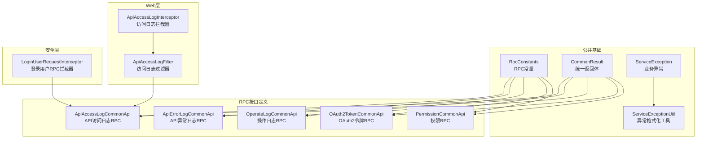
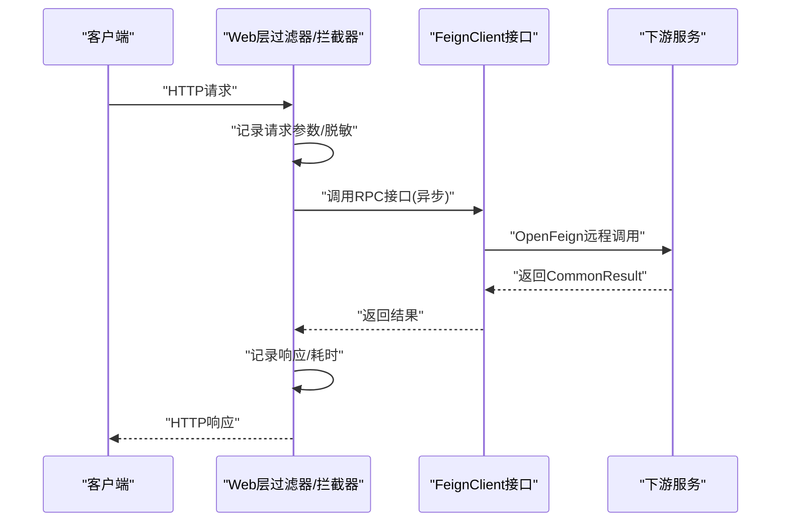
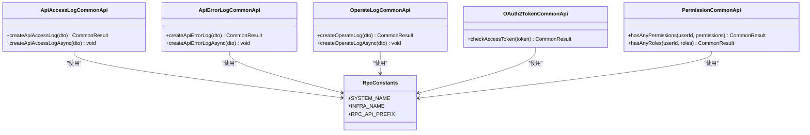
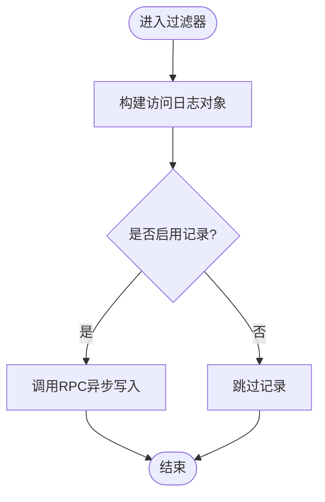
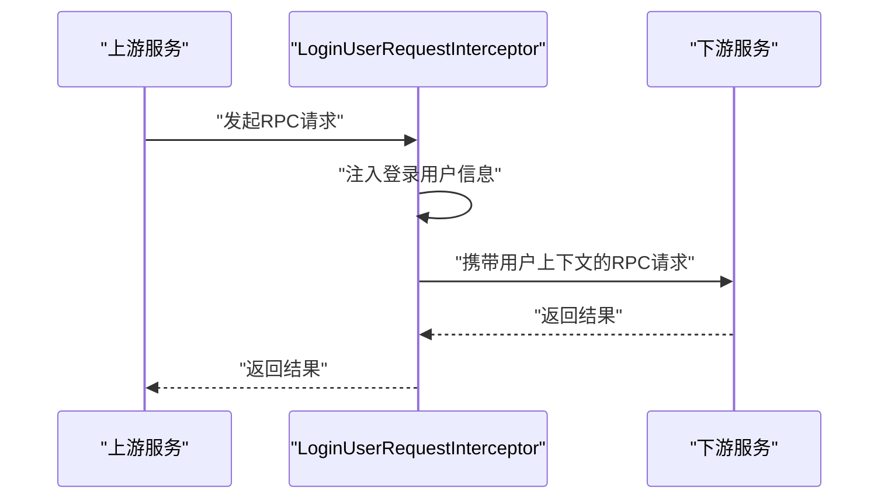
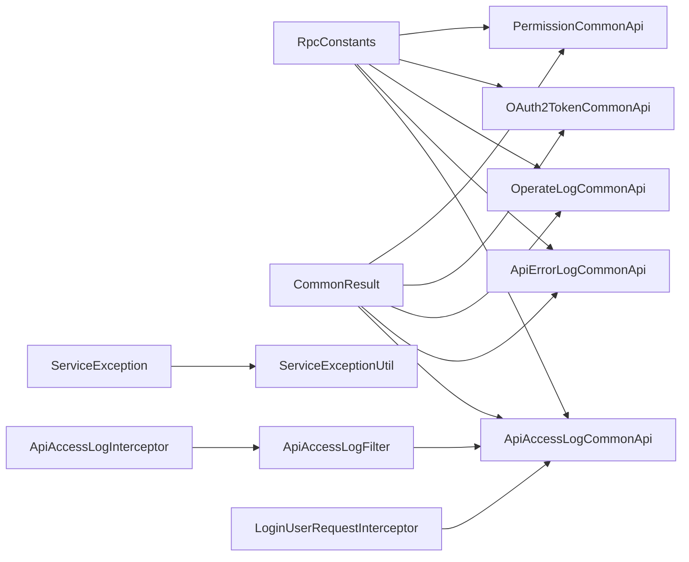

# RPC服务扩展

<cite>
**本文引用的文件**
- [pandora-common/src/main/java/com/fhs/trans/service/AutoTransable.java](file://pandora-framework/pandora-common/src/main/java/com/fhs/trans/service/AutoTransable.java)
- [pandora-common/src/main/java/net/ittimeline/pandora/framework/common/constants/RpcConstants.java](file://pandora-framework/pandora-common/src/main/java/net/ittimeline/pandora/framework/common/constants/RpcConstants.java)
- [pandora-common/src/main/java/net/ittimeline/pandora/framework/common/pojo/CommonResult.java](file://pandora-framework/pandora-common/src/main/java/net/ittimeline/pandora/framework/common/pojo/CommonResult.java)
- [pandora-common/src/main/java/net/ittimeline/pandora/framework/common/exception/ServiceException.java](file://pandora-framework/pandora-common/src/main/java/net/ittimeline/pandora/framework/common/exception/ServiceException.java)
- [pandora-common/src/main/java/net/ittimeline/pandora/framework/common/exception/util/ServiceExceptionUtil.java](file://pandora-framework/pandora-common/src/main/java/net/ittimeline/pandora/framework/common/exception/util/ServiceExceptionUtil.java)
- [pandora-common/src/main/java/net/ittimeline/pandora/framework/common/biz/infra/logger/ApiAccessLogCommonApi.java](file://pandora-framework/pandora-common/src/main/java/net/ittimeline/pandora/framework/common/biz/infra/logger/ApiAccessLogCommonApi.java)
- [pandora-common/src/main/java/net/ittimeline/pandora/framework/common/biz/infra/logger/ApiErrorLogCommonApi.java](file://pandora-framework/pandora-common/src/main/java/net/ittimeline/pandora/framework/common/biz/infra/logger/ApiErrorLogCommonApi.java)
- [pandora-common/src/main/java/net/ittimeline/pandora/framework/common/biz/system/logger/OperateLogCommonApi.java](file://pandora-framework/pandora-common/src/main/java/net/ittimeline/pandora/framework/common/biz/system/logger/OperateLogCommonApi.java)
- [pandora-common/src/main/java/net/ittimeline/pandora/framework/common/biz/system/oauth2/OAuth2TokenCommonApi.java](file://pandora-framework/pandora-common/src/main/java/net/ittimeline/pandora/framework/common/biz/system/oauth2/OAuth2TokenCommonApi.java)
- [pandora-common/src/main/java/net/ittimeline/pandora/framework/common/biz/system/permission/PermissionCommonApi.java](file://pandora-framework/pandora-common/src/main/java/net/ittimeline/pandora/framework/common/biz/system/permission/PermissionCommonApi.java)
- [pandora-spring-boot-starter-web/src/main/java/net/ittimeline/pandora/framework/apilog/core/filter/ApiAccessLogFilter.java](file://pandora-framework/pandora-spring-boot-starter-web/src/main/java/net/ittimeline/pandora/framework/apilog/core/filter/ApiAccessLogFilter.java)
- [pandora-spring-boot-starter-web/src/main/java/net/ittimeline/pandora/framework/apilog/core/interceptor/ApiAccessLogInterceptor.java](file://pandora-framework/pandora-spring-boot-starter-web/src/main/java/net/ittimeline/pandora/framework/apilog/core/interceptor/ApiAccessLogInterceptor.java)
- [pandora-spring-boot-starter-security/src/main/java/net/ittimeline/pandora/framework/security/core/rpc/LoginUserRequestInterceptor.java](file://pandora-framework/pandora-spring-boot-starter-security/src/main/java/net/ittimeline/pandora/framework/security/core/rpc/LoginUserRequestInterceptor.java)
</cite>

## 目录
1. [简介](#简介)
2. [项目结构](#项目结构)
3. [核心组件](#核心组件)
4. [架构总览](#架构总览)
5. [详细组件分析](#详细组件分析)
6. [依赖分析](#依赖分析)
7. [性能考虑](#性能考虑)
8. [故障排查指南](#故障排查指南)
9. [结论](#结论)
10. [附录](#附录)

## 简介
本指南面向在Pandora Cloud微服务体系上进行RPC服务扩展的开发者，系统讲解远程调用机制、接口设计原则与扩展方法，覆盖以下主题：
- 基于OpenFeign的RPC接口定义与参数传递
- 服务发现、负载均衡与熔断降级的实现思路
- 性能优化、超时与重试策略
- 分布式事务、消息队列与异步调用模式
- 典型扩展示例：自定义认证服务、权限验证接口、日志收集服务
- 监控指标、日志记录与错误处理策略
- 版本管理、向后兼容与迁移方案

## 项目结构
本仓库采用多模块分层组织，RPC相关能力主要集中在公共模块与启动器模块中：
- pandora-common：通用常量、返回体、异常体系、RPC接口定义（FeignClient）
- pandora-spring-boot-starter-web：Web层能力与API日志拦截/过滤
- pandora-spring-boot-starter-security：安全与RPC上下文透传
- pandora-spring-boot-starter-redis：缓存与超时管理（示例）

图表来源
- [RpcConstants.java:12-41](file://pandora-framework/pandora-common/src/main/java/net/ittimeline/pandora/framework/common/constants/RpcConstants.java#L12-L41)
- [CommonResult.java:21-122](file://pandora-framework/pandora-common/src/main/java/net/ittimeline/pandora/framework/common/pojo/CommonResult.java#L21-L122)
- [ServiceException.java:13-63](file://pandora-framework/pandora-common/src/main/java/net/ittimeline/pandora/framework/common/exception/ServiceException.java#L13-L63)
- [ServiceExceptionUtil.java:18-84](file://pandora-framework/pandora-common/src/main/java/net/ittimeline/pandora/framework/common/exception/util/ServiceExceptionUtil.java#L18-L84)
- [ApiAccessLogCommonApi.java:21-39](file://pandora-framework/pandora-common/src/main/java/net/ittimeline/pandora/framework/common/biz/infra/logger/ApiAccessLogCommonApi.java#L21-L39)
- [ApiErrorLogCommonApi.java:21-40](file://pandora-framework/pandora-common/src/main/java/net/ittimeline/pandora/framework/common/biz/infra/logger/ApiErrorLogCommonApi.java#L21-L40)
- [OperateLogCommonApi.java:21-40](file://pandora-framework/pandora-common/src/main/java/net/ittimeline/pandora/framework/common/biz/system/logger/OperateLogCommonApi.java#L21-L40)
- [OAuth2TokenCommonApi.java:20-33](file://pandora-framework/pandora-common/src/main/java/net/ittimeline/pandora/framework/common/biz/system/oauth2/OAuth2TokenCommonApi.java#L20-L33)
- [PermissionCommonApi.java:20-45](file://pandora-framework/pandora-common/src/main/java/net/ittimeline/pandora/framework/common/biz/system/permission/PermissionCommonApi.java#L20-L45)
- [ApiAccessLogFilter.java:51-100](file://pandora-framework/pandora-spring-boot-starter-web/src/main/java/net/ittimeline/pandora/framework/apilog/core/filter/ApiAccessLogFilter.java#L51-L100)
- [ApiAccessLogInterceptor.java:31-75](file://pandora-framework/pandora-spring-boot-starter-web/src/main/java/net/ittimeline/pandora/framework/apilog/core/interceptor/ApiAccessLogInterceptor.java#L31-L75)
- [LoginUserRequestInterceptor.java](file://pandora-framework/pandora-spring-boot-starter-security/src/main/java/net/ittimeline/pandora/framework/security/core/rpc/LoginUserRequestInterceptor.java)

章节来源
- [RpcConstants.java:12-41](file://pandora-framework/pandora-common/src/main/java/net/ittimeline/pandora/framework/common/constants/RpcConstants.java#L12-L41)
- [CommonResult.java:21-122](file://pandora-framework/pandora-common/src/main/java/net/ittimeline/pandora/framework/common/pojo/CommonResult.java#L21-L122)
- [ServiceException.java:13-63](file://pandora-framework/pandora-common/src/main/java/net/ittimeline/pandora/framework/common/exception/ServiceException.java#L13-L63)
- [ServiceExceptionUtil.java:18-84](file://pandora-framework/pandora-common/src/main/java/net/ittimeline/pandora/framework/common/exception/util/ServiceExceptionUtil.java#L18-L84)
- [ApiAccessLogCommonApi.java:21-39](file://pandora-framework/pandora-common/src/main/java/net/ittimeline/pandora/framework/common/biz/infra/logger/ApiAccessLogCommonApi.java#L21-L39)
- [ApiErrorLogCommonApi.java:21-40](file://pandora-framework/pandora-common/src/main/java/net/ittimeline/pandora/framework/common/biz/infra/logger/ApiErrorLogCommonApi.java#L21-L40)
- [OperateLogCommonApi.java:21-40](file://pandora-framework/pandora-common/src/main/java/net/ittimeline/pandora/framework/common/biz/system/logger/OperateLogCommonApi.java#L21-L40)
- [OAuth2TokenCommonApi.java:20-33](file://pandora-framework/pandora-common/src/main/java/net/ittimeline/pandora/framework/common/biz/system/oauth2/OAuth2TokenCommonApi.java#L20-L33)
- [PermissionCommonApi.java:20-45](file://pandora-framework/pandora-common/src/main/java/net/ittimeline/pandora/framework/common/biz/system/permission/PermissionCommonApi.java#L20-L45)
- [ApiAccessLogFilter.java:51-100](file://pandora-framework/pandora-spring-boot-starter-web/src/main/java/net/ittimeline/pandora/framework/apilog/core/filter/ApiAccessLogFilter.java#L51-L100)
- [ApiAccessLogInterceptor.java:31-75](file://pandora-framework/pandora-spring-boot-starter-web/src/main/java/net/ittimeline/pandora/framework/apilog/core/interceptor/ApiAccessLogInterceptor.java#L31-L75)
- [LoginUserRequestInterceptor.java](file://pandora-framework/pandora-spring-boot-starter-security/src/main/java/net/ittimeline/pandora/framework/security/core/rpc/LoginUserRequestInterceptor.java)

## 核心组件
- RPC常量与前缀：通过RpcConstants集中管理服务名与API前缀，确保跨模块一致性。
- 统一返回体：CommonResult封装code/msg/data，提供success/error/checkError等便捷方法。
- 异常体系：ServiceException与ServiceExceptionUtil提供统一的异常编码与格式化能力。
- FeignClient接口：以ApiAccessLogCommonApi、ApiErrorLogCommonApi、OperateLogCommonApi、OAuth2TokenCommonApi、PermissionCommonApi为代表，定义RPC调用契约。
- Web层日志：ApiAccessLogFilter与ApiAccessLogInterceptor负责请求前后日志采集与脱敏。
- 安全上下文透传：LoginUserRequestInterceptor在RPC请求中注入登录用户信息。

章节来源
- [RpcConstants.java:12-41](file://pandora-framework/pandora-common/src/main/java/net/ittimeline/pandora/framework/common/constants/RpcConstants.java#L12-L41)
- [CommonResult.java:21-122](file://pandora-framework/pandora-common/src/main/java/net/ittimeline/pandora/framework/common/pojo/CommonResult.java#L21-L122)
- [ServiceException.java:13-63](file://pandora-framework/pandora-common/src/main/java/net/ittimeline/pandora/framework/common/exception/ServiceException.java#L13-L63)
- [ServiceExceptionUtil.java:18-84](file://pandora-framework/pandora-common/src/main/java/net/ittimeline/pandora/framework/common/exception/util/ServiceExceptionUtil.java#L18-L84)
- [ApiAccessLogCommonApi.java:21-39](file://pandora-framework/pandora-common/src/main/java/net/ittimeline/pandora/framework/common/biz/infra/logger/ApiAccessLogCommonApi.java#L21-L39)
- [ApiAccessLogFilter.java:51-100](file://pandora-framework/pandora-spring-boot-starter-web/src/main/java/net/ittimeline/pandora/framework/apilog/core/filter/ApiAccessLogFilter.java#L51-L100)
- [ApiAccessLogInterceptor.java:31-75](file://pandora-framework/pandora-spring-boot-starter-web/src/main/java/net/ittimeline/pandora/framework/apilog/core/interceptor/ApiAccessLogInterceptor.java#L31-L75)
- [LoginUserRequestInterceptor.java](file://pandora-framework/pandora-spring-boot-starter-security/src/main/java/net/ittimeline/pandora/framework/security/core/rpc/LoginUserRequestInterceptor.java)

## 架构总览
下图展示了RPC调用在Web层、RPC接口层与下游服务之间的交互流程，以及日志与安全上下文的贯穿。

图表来源
- [ApiAccessLogFilter.java:66-100](file://pandora-framework/pandora-spring-boot-starter-web/src/main/java/net/ittimeline/pandora/framework/apilog/core/filter/ApiAccessLogFilter.java#L66-L100)
- [ApiAccessLogCommonApi.java:21-39](file://pandora-framework/pandora-common/src/main/java/net/ittimeline/pandora/framework/common/biz/infra/logger/ApiAccessLogCommonApi.java#L21-L39)
- [CommonResult.java:21-122](file://pandora-framework/pandora-common/src/main/java/net/ittimeline/pandora/framework/common/pojo/CommonResult.java#L21-L122)

## 详细组件分析

### FeignClient接口设计与扩展
- 接口命名与前缀：统一使用RpcConstants中的服务名与前缀，便于服务发现与路由。
- 方法签名：返回类型统一为CommonResult<T>，便于前端与调用方统一处理。
- 异步调用：通过@Async提供默认异步实现，内部仍调用同步接口并checkError，保障异常传播。
- 参数传递：支持@RequestBody与@RequestParam，注意对敏感字段的脱敏策略。

图表来源
- [ApiAccessLogCommonApi.java:21-39](file://pandora-framework/pandora-common/src/main/java/net/ittimeline/pandora/framework/common/biz/infra/logger/ApiAccessLogCommonApi.java#L21-L39)
- [ApiErrorLogCommonApi.java:21-40](file://pandora-framework/pandora-common/src/main/java/net/ittimeline/pandora/framework/common/biz/infra/logger/ApiErrorLogCommonApi.java#L21-L40)
- [OperateLogCommonApi.java:21-40](file://pandora-framework/pandora-common/src/main/java/net/ittimeline/pandora/framework/common/biz/system/logger/OperateLogCommonApi.java#L21-L40)
- [OAuth2TokenCommonApi.java:20-33](file://pandora-framework/pandora-common/src/main/java/net/ittimeline/pandora/framework/common/biz/system/oauth2/OAuth2TokenCommonApi.java#L20-L33)
- [PermissionCommonApi.java:20-45](file://pandora-framework/pandora-common/src/main/java/net/ittimeline/pandora/framework/common/biz/system/permission/PermissionCommonApi.java#L20-L45)
- [RpcConstants.java:12-41](file://pandora-framework/pandora-common/src/main/java/net/ittimeline/pandora/framework/common/constants/RpcConstants.java#L12-L41)

章节来源
- [ApiAccessLogCommonApi.java:21-39](file://pandora-framework/pandora-common/src/main/java/net/ittimeline/pandora/framework/common/biz/infra/logger/ApiAccessLogCommonApi.java#L21-L39)
- [ApiErrorLogCommonApi.java:21-40](file://pandora-framework/pandora-common/src/main/java/net/ittimeline/pandora/framework/common/biz/infra/logger/ApiErrorLogCommonApi.java#L21-L40)
- [OperateLogCommonApi.java:21-40](file://pandora-framework/pandora-common/src/main/java/net/ittimeline/pandora/framework/common/biz/system/logger/OperateLogCommonApi.java#L21-L40)
- [OAuth2TokenCommonApi.java:20-33](file://pandora-framework/pandora-common/src/main/java/net/ittimeline/pandora/framework/common/biz/system/oauth2/OAuth2TokenCommonApi.java#L20-L33)
- [PermissionCommonApi.java:20-45](file://pandora-framework/pandora-common/src/main/java/net/ittimeline/pandora/framework/common/biz/system/permission/PermissionCommonApi.java#L20-L45)
- [RpcConstants.java:12-41](file://pandora-framework/pandora-common/src/main/java/net/ittimeline/pandora/framework/common/constants/RpcConstants.java#L12-L41)

### Web层日志与脱敏
- 过滤器职责：在请求前后记录访问日志，构建ApiAccessLogCreateReqDTO并调用RPC异步写入。
- 拦截器职责：在非生产环境打印请求/响应参数与耗时，辅助调试。
- 脱敏策略：对密码、token等敏感字段进行移除或屏蔽，避免日志泄露。

图表来源
- [ApiAccessLogFilter.java:88-100](file://pandora-framework/pandora-spring-boot-starter-web/src/main/java/net/ittimeline/pandora/framework/apilog/core/filter/ApiAccessLogFilter.java#L88-L100)
- [ApiAccessLogInterceptor.java:38-75](file://pandora-framework/pandora-spring-boot-starter-web/src/main/java/net/ittimeline/pandora/framework/apilog/core/interceptor/ApiAccessLogInterceptor.java#L38-L75)

章节来源
- [ApiAccessLogFilter.java:51-100](file://pandora-framework/pandora-spring-boot-starter-web/src/main/java/net/ittimeline/pandora/framework/apilog/core/filter/ApiAccessLogFilter.java#L51-L100)
- [ApiAccessLogInterceptor.java:31-75](file://pandora-framework/pandora-spring-boot-starter-web/src/main/java/net/ittimeline/pandora/framework/apilog/core/interceptor/ApiAccessLogInterceptor.java#L31-L75)

### 安全上下文透传与认证
- 登录用户RPC拦截器：在RPC请求中注入当前登录用户信息，确保下游服务可感知调用者身份。
- OAuth2令牌校验：通过OAuth2TokenCommonApi对外暴露令牌校验RPC，供其他服务调用。

图表来源
- [LoginUserRequestInterceptor.java](file://pandora-framework/pandora-spring-boot-starter-security/src/main/java/net/ittimeline/pandora/framework/security/core/rpc/LoginUserRequestInterceptor.java)
- [OAuth2TokenCommonApi.java:20-33](file://pandora-framework/pandora-common/src/main/java/net/ittimeline/pandora/framework/common/biz/system/oauth2/OAuth2TokenCommonApi.java#L20-L33)

章节来源
- [LoginUserRequestInterceptor.java](file://pandora-framework/pandora-spring-boot-starter-security/src/main/java/net/ittimeline/pandora/framework/security/core/rpc/LoginUserRequestInterceptor.java)
- [OAuth2TokenCommonApi.java:20-33](file://pandora-framework/pandora-common/src/main/java/net/ittimeline/pandora/framework/common/biz/system/oauth2/OAuth2TokenCommonApi.java#L20-L33)

### 扩展实践：自定义认证服务
- 目标：新增认证服务的RPC接口，提供令牌签发、刷新、校验等能力。
- 设计要点：
  - 接口命名遵循RpcConstants约定的服务名与前缀。
  - 返回体统一使用CommonResult<T>。
  - 对外暴露异步写入日志的RPC接口，确保审计链路完整。
- 实施步骤：
  1) 在认证服务侧定义FeignClient接口，参考OAuth2TokenCommonApi。
  2) 在调用方引入该接口，按需调用。
  3) 在Web层通过过滤器/拦截器记录相关操作日志。

章节来源
- [RpcConstants.java:12-41](file://pandora-framework/pandora-common/src/main/java/net/ittimeline/pandora/framework/common/constants/RpcConstants.java#L12-L41)
- [CommonResult.java:21-122](file://pandora-framework/pandora-common/src/main/java/net/ittimeline/pandora/framework/common/pojo/CommonResult.java#L21-L122)
- [OAuth2TokenCommonApi.java:20-33](file://pandora-framework/pandora-common/src/main/java/net/ittimeline/pandora/framework/common/biz/system/oauth2/OAuth2TokenCommonApi.java#L20-L33)

### 扩展实践：权限验证接口
- 目标：为业务模块提供细粒度权限校验RPC，支持角色与权限组合判断。
- 设计要点：
  - 接口返回CommonResult<Boolean>，简洁明确。
  - 支持多参数权限/角色数组，便于前端传参。
- 实施步骤：
  1) 在权限服务侧定义FeignClient接口，参考PermissionCommonApi。
  2) 在业务服务侧注入接口，调用hasAnyPermissions/hasAnyRoles进行鉴权。
  3) 结合安全拦截器与异常体系，统一处理鉴权失败场景。

章节来源
- [PermissionCommonApi.java:20-45](file://pandora-framework/pandora-common/src/main/java/net/ittimeline/pandora/framework/common/biz/system/permission/PermissionCommonApi.java#L20-L45)
- [CommonResult.java:21-122](file://pandora-framework/pandora-common/src/main/java/net/ittimeline/pandora/framework/common/pojo/CommonResult.java#L21-L122)

### 扩展实践：日志收集服务
- 目标：将API访问日志与异常日志统一通过RPC上报至日志服务。
- 设计要点：
  - 使用@Async提供异步写入，避免阻塞主流程。
  - 在Web层过滤器中构建日志对象并调用RPC接口。
  - 对敏感字段进行脱敏，确保合规。
- 实施步骤：
  1) 在日志服务侧定义FeignClient接口，参考ApiAccessLogCommonApi与ApiErrorLogCommonApi。
  2) 在Web层过滤器中注入接口并调用异步写入。
  3) 在非生产环境通过拦截器输出请求/响应参数，辅助定位问题。

章节来源
- [ApiAccessLogCommonApi.java:21-39](file://pandora-framework/pandora-common/src/main/java/net/ittimeline/pandora/framework/common/biz/infra/logger/ApiAccessLogCommonApi.java#L21-L39)
- [ApiErrorLogCommonApi.java:21-40](file://pandora-framework/pandora-common/src/main/java/net/ittimeline/pandora/framework/common/biz/infra/logger/ApiErrorLogCommonApi.java#L21-L40)
- [ApiAccessLogFilter.java:51-100](file://pandora-framework/pandora-spring-boot-starter-web/src/main/java/net/ittimeline/pandora/framework/apilog/core/filter/ApiAccessLogFilter.java#L51-L100)
- [ApiAccessLogInterceptor.java:31-75](file://pandora-framework/pandora-spring-boot-starter-web/src/main/java/net/ittimeline/pandora/framework/apilog/core/interceptor/ApiAccessLogInterceptor.java#L31-L75)

## 依赖分析
- 组件内聚与耦合：
  - FeignClient接口高度内聚于各自领域（日志、权限、认证），降低耦合。
  - Web层与RPC层通过CommonResult与异常工具类解耦。
- 外部依赖：
  - OpenFeign用于声明式HTTP客户端。
  - Spring Web MVC用于Web层过滤器与拦截器。
  - 日志与脱敏工具来自Hutool等常用库。

图表来源
- [RpcConstants.java:12-41](file://pandora-framework/pandora-common/src/main/java/net/ittimeline/pandora/framework/common/constants/RpcConstants.java#L12-L41)
- [CommonResult.java:21-122](file://pandora-framework/pandora-common/src/main/java/net/ittimeline/pandora/framework/common/pojo/CommonResult.java#L21-L122)
- [ServiceException.java:13-63](file://pandora-framework/pandora-common/src/main/java/net/ittimeline/pandora/framework/common/exception/ServiceException.java#L13-L63)
- [ServiceExceptionUtil.java:18-84](file://pandora-framework/pandora-common/src/main/java/net/ittimeline/pandora/framework/common/exception/util/ServiceExceptionUtil.java#L18-L84)
- [ApiAccessLogCommonApi.java:21-39](file://pandora-framework/pandora-common/src/main/java/net/ittimeline/pandora/framework/common/biz/infra/logger/ApiAccessLogCommonApi.java#L21-L39)
- [ApiAccessLogFilter.java:51-100](file://pandora-framework/pandora-spring-boot-starter-web/src/main/java/net/ittimeline/pandora/framework/apilog/core/filter/ApiAccessLogFilter.java#L51-L100)
- [ApiAccessLogInterceptor.java:31-75](file://pandora-framework/pandora-spring-boot-starter-web/src/main/java/net/ittimeline/pandora/framework/apilog/core/interceptor/ApiAccessLogInterceptor.java#L31-L75)
- [LoginUserRequestInterceptor.java](file://pandora-framework/pandora-spring-boot-starter-security/src/main/java/net/ittimeline/pandora/framework/security/core/rpc/LoginUserRequestInterceptor.java)

章节来源
- [RpcConstants.java:12-41](file://pandora-framework/pandora-common/src/main/java/net/ittimeline/pandora/framework/common/constants/RpcConstants.java#L12-L41)
- [CommonResult.java:21-122](file://pandora-framework/pandora-common/src/main/java/net/ittimeline/pandora/framework/common/pojo/CommonResult.java#L21-L122)
- [ServiceException.java:13-63](file://pandora-framework/pandora-common/src/main/java/net/ittimeline/pandora/framework/common/exception/ServiceException.java#L13-L63)
- [ServiceExceptionUtil.java:18-84](file://pandora-framework/pandora-common/src/main/java/net/ittimeline/pandora/framework/common/exception/util/ServiceExceptionUtil.java#L18-L84)
- [ApiAccessLogCommonApi.java:21-39](file://pandora-framework/pandora-common/src/main/java/net/ittimeline/pandora/framework/common/biz/infra/logger/ApiAccessLogCommonApi.java#L21-L39)
- [ApiAccessLogFilter.java:51-100](file://pandora-framework/pandora-spring-boot-starter-web/src/main/java/net/ittimeline/pandora/framework/apilog/core/filter/ApiAccessLogFilter.java#L51-L100)
- [ApiAccessLogInterceptor.java:31-75](file://pandora-framework/pandora-spring-boot-starter-web/src/main/java/net/ittimeline/pandora/framework/apilog/core/interceptor/ApiAccessLogInterceptor.java#L31-L75)
- [LoginUserRequestInterceptor.java](file://pandora-framework/pandora-spring-boot-starter-security/src/main/java/net/ittimeline/pandora/framework/security/core/rpc/LoginUserRequestInterceptor.java)

## 性能考虑
- 异步RPC调用：通过@Async在Web层异步写入日志，降低主流程延迟。
- 脱敏与序列化：对敏感字段进行脱敏，避免大对象序列化带来的开销。
- 超时与重试：建议在Feign配置中设置合理的连接/读取超时与重试策略，结合熔断器实现降级。
- 缓存与预热：对高频查询结果进行缓存，减少RPC调用次数。
- 监控与追踪：利用TracerUtils生成traceId，串联请求链路，便于性能分析。

## 故障排查指南
- 统一异常处理：通过CommonResult.checkError与ServiceExceptionUtil.format，快速定位业务异常。
- 日志定位：在非生产环境开启拦截器输出请求/响应参数；生产环境通过过滤器异步写入日志。
- 调用链追踪：确保LoginUserRequestInterceptor正确注入用户上下文，避免权限校验失败。
- 常见问题：
  - Feign调用失败：检查服务名与前缀是否与RpcConstants一致。
  - 参数脱敏导致信息缺失：确认脱敏键值配置与业务需求一致。
  - 异步写入失败：关注过滤器中的异常日志，避免影响主流程。

章节来源
- [CommonResult.java:96-122](file://pandora-framework/pandora-common/src/main/java/net/ittimeline/pandora/framework/common/pojo/CommonResult.java#L96-L122)
- [ServiceExceptionUtil.java:30-82](file://pandora-framework/pandora-common/src/main/java/net/ittimeline/pandora/framework/common/exception/util/ServiceExceptionUtil.java#L30-L82)
- [ApiAccessLogFilter.java:88-100](file://pandora-framework/pandora-spring-boot-starter-web/src/main/java/net/ittimeline/pandora/framework/apilog/core/filter/ApiAccessLogFilter.java#L88-L100)
- [LoginUserRequestInterceptor.java](file://pandora-framework/pandora-spring-boot-starter-security/src/main/java/net/ittimeline/pandora/framework/security/core/rpc/LoginUserRequestInterceptor.java)

## 结论
本指南基于现有Pandora Cloud框架，总结了RPC服务扩展的关键点：以RpcConstants为契约、以CommonResult为标准返回体、以FeignClient为调用载体、以Web层过滤器与拦截器为可观测性支撑、以安全拦截器为上下文透传保障。按照上述原则与实践，可高效、安全地扩展认证、权限、日志等RPC能力，并在性能、可靠性与可观测性之间取得平衡。

## 附录
- 版本管理与兼容：
  - 通过RpcConstants集中管理服务名与前缀，确保跨模块一致性。
  - 对于接口变更，优先采用向后兼容策略（新增字段、保留旧字段），并提供迁移指引。
- 迁移方案：
  - 逐步替换旧接口为新接口，期间双写日志与数据，验证一致性后再切换流量。
  - 对外部依赖（如第三方认证服务）制定灰度发布与回滚预案。