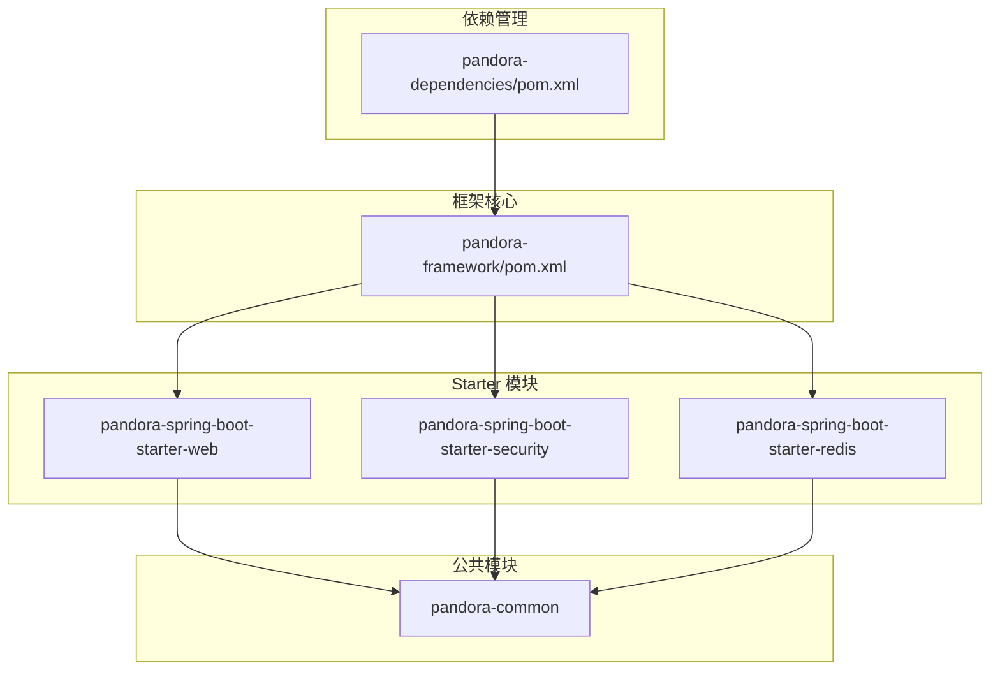
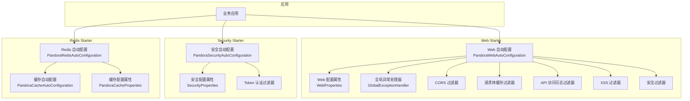
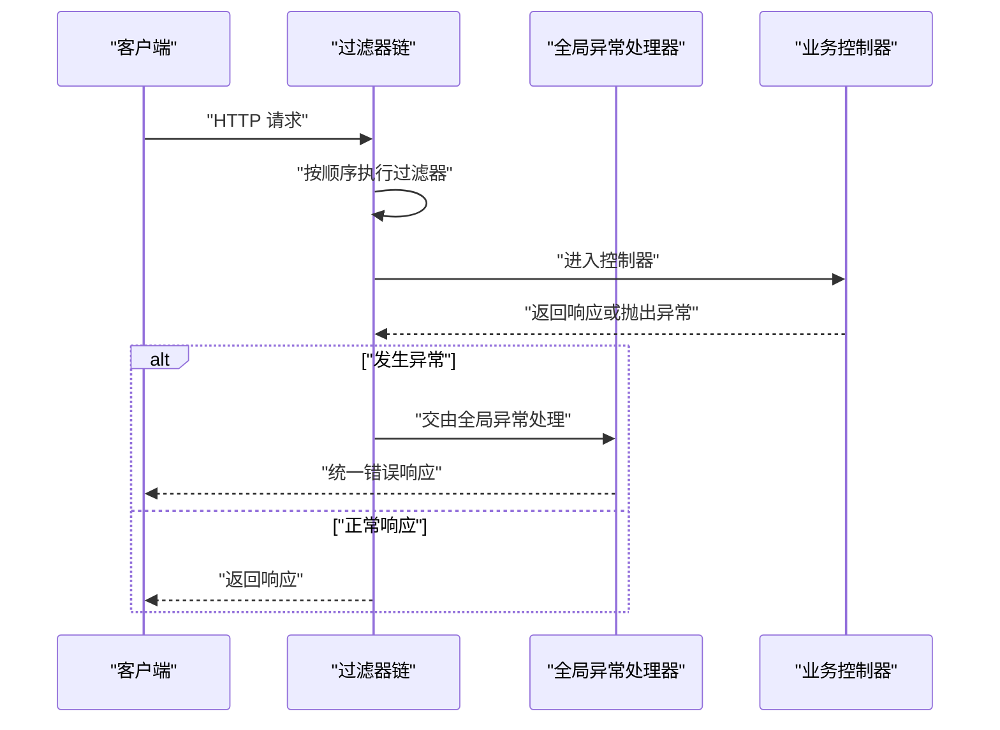
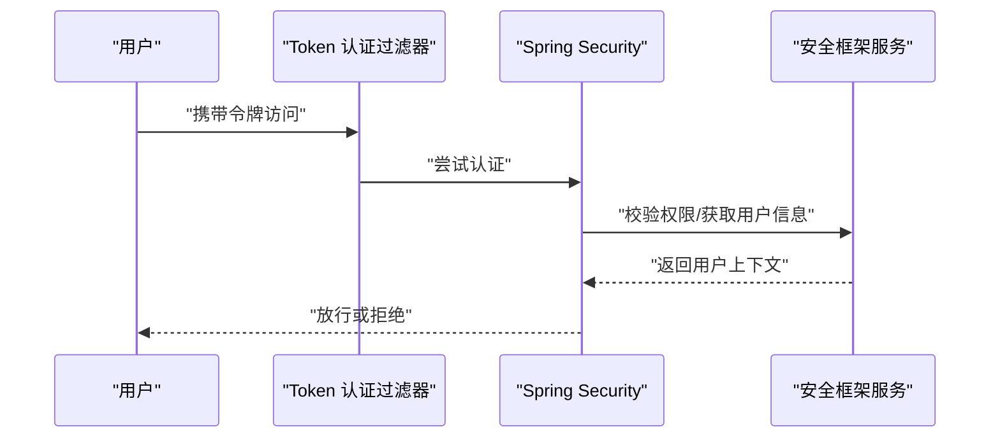
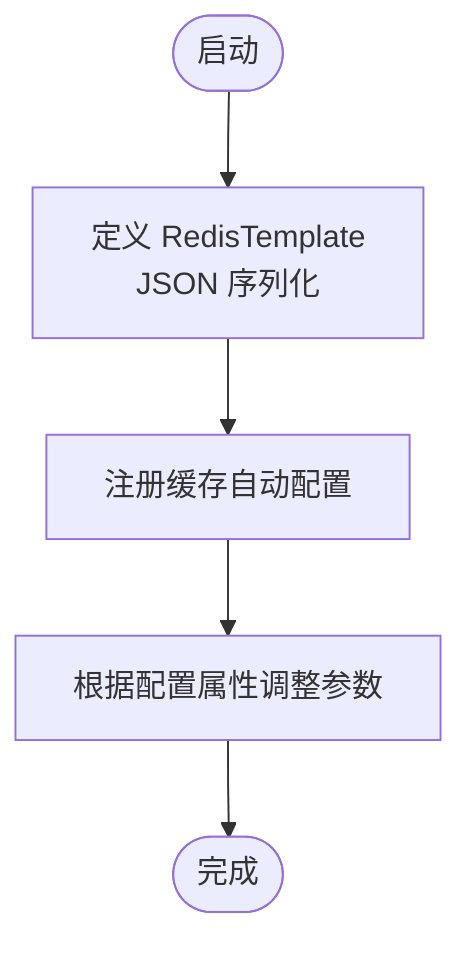
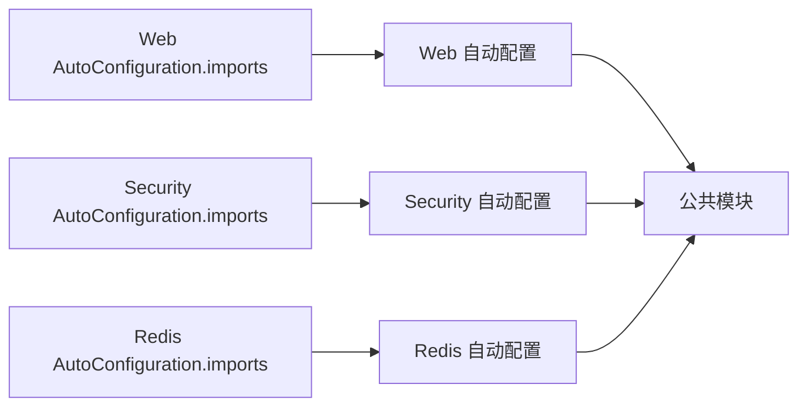

# 扩展开发

<cite>
**本文引用的文件**
- [README.md](file://README.md)
- [pom.xml](file://pandora-dependencies/pom.xml)
- [pandora-framework/pom.xml](file://pandora-framework/pom.xml)
- [Web 过滤器顺序常量](file://pandora-framework/pandora-common/src/main/java/net/ittimeline/pandora/framework/common/constants/WebFilterOrderConstants.java)
- [Web 自动配置](file://pandora-framework/pandora-spring-boot-starter-web/src/main/java/net/ittimeline/pandora/framework/web/config/PandoraWebAutoConfiguration.java)
- [Web 配置属性](file://pandora-framework/pandora-spring-boot-starter-web/src/main/java/net/ittimeline/pandora/framework/web/config/WebProperties.java)
- [全局异常处理器](file://pandora-framework/pandora-spring-boot-starter-web/src/main/java/net/ittimeline/pandora/framework/web/core/handler/GlobalExceptionHandler.java)
- [API 请求过滤器基类](file://pandora-framework/pandora-spring-boot-starter-web/src/main/java/net/ittimeline/pandora/framework/web/core/filter/ApiRequestFilter.java)
- [安全自动配置](file://pandora-framework/pandora-spring-boot-starter-security/src/main/java/net/ittimeline/pandora/framework/security/config/PandoraSecurityAutoConfiguration.java)
- [安全配置属性](file://pandora-framework/pandora-spring-boot-starter-security/src/main/java/net/ittimeline/pandora/framework/security/config/SecurityProperties.java)
- [Redis 自动配置](file://pandora-framework/pandora-spring-boot-starter-redis/src/main/java/net/ittimeline/pandora/framework/redis/config/PandoraRedisAutoConfiguration.java)
- [Redis 缓存自动配置](file://pandora-framework/pandora-spring-boot-starter-redis/src/main/java/net/ittimeline/pandora/framework/redis/config/PandoraCacheAutoConfiguration.java)
- [Redis 缓存配置属性](file://pandora-framework/pandora-spring-boot-starter-redis/src/main/java/net/ittimeline/pandora/framework/redis/config/PandoraCacheProperties.java)
- [Web Starter 自动配置导入](file://pandora-framework/pandora-spring-boot-starter-web/src/main/resources/META-INF/spring/org.springframework.boot.autoconfigure.AutoConfiguration.imports)
- [Security Starter 自动配置导入](file://pandora-framework/pandora-spring-boot-starter-security/src/main/resources/META-INF/spring/org.springframework.boot.autoconfigure.AutoConfiguration.imports)
- [Redis Starter 自动配置导入](file://pandora-framework/pandora-spring-boot-starter-redis/src/main/resources/META-INF/spring/org.springframework.boot.autoconfigure.AutoConfiguration.imports)
</cite>

## 目录
1. [简介](#简介)
2. [项目结构](#项目结构)
3. [核心组件](#核心组件)
4. [架构总览](#架构总览)
5. [详细组件分析](#详细组件分析)
6. [依赖分析](#依赖分析)
7. [性能考虑](#性能考虑)
8. [故障排查指南](#故障排查指南)
9. [结论](#结论)
10. [附录](#附录)

## 简介
本指南面向希望基于 Pandora Cloud 框架进行扩展开发的工程师，覆盖以下主题：
- 如何开发自定义 Starter（自动配置、过滤器链、拦截器、Bean 注入）
- 如何扩展现有功能与集成第三方服务
- 自动配置扩展、过滤器链扩展、拦截器扩展与 Bean 注入机制
- 公共接口的实现方法、扩展点的使用与最佳实践
- 具体扩展示例：自定义认证方式、日志记录扩展、缓存策略定制
- 测试策略、部署方法与维护建议
- 常见问题与解决方案

## 项目结构
Pandora Cloud 采用多模块分层设计，核心由“公共基础模块”和“各功能 Starter 模块”组成。Starter 通过 Spring Boot 的自动配置机制与 META-INF/spring 文件声明自动装配入口，实现按需启用。

图表来源
- [pandora-framework/pom.xml](file://pandora-framework/pom.xml)
- [pandora-dependencies/pom.xml](file://pandora-dependencies/pom.xml)

章节来源
- [pandora-framework/pom.xml](file://pandora-framework/pom.xml)
- [pandora-dependencies/pom.xml](file://pandora-dependencies/pom.xml)

## 核心组件
本节聚焦于扩展开发的关键构件：自动配置、过滤器链、拦截器、全局异常处理、配置属性与 Bean 注入。

- 自动配置入口
  - Web Starter 通过自动配置导入文件声明多个自动配置类，用于启用横切能力（CORS、请求体缓存、API 日志、XSS、加密、Swagger、Banner、Jackson 等）。
  - Security Starter 通过自动配置导入文件声明安全相关自动配置类，用于启用认证、授权、上下文策略等。
  - Redis Starter 通过自动配置导入文件声明 Redis 与缓存自动配置类，用于提供 RedisTemplate 与缓存管理器。

- 过滤器链与顺序
  - Web 过滤器顺序常量集中定义了各过滤器的优先级，确保跨域、请求体缓存、API 访问日志、XSS、安全过滤器等按预期顺序执行。

- 全局异常处理
  - 全局异常处理器统一捕获各类异常，转换为统一响应格式，并异步记录错误日志。

- 配置属性
  - WebProperties、SecurityProperties、PandoraCacheProperties 提供可配置项，便于在应用侧灵活调整行为。

- Bean 注入与条件装配
  - 自动配置类通过 @Bean 定义组件；通过 @ConditionalOnProperty、@ConditionalOnMissingBean 等条件注解实现按需装配。

章节来源
- [Web Starter 自动配置导入](file://pandora-framework/pandora-spring-boot-starter-web/src/main/resources/META-INF/spring/org.springframework.boot.autoconfigure.AutoConfiguration.imports)
- [Security Starter 自动配置导入](file://pandora-framework/pandora-spring-boot-starter-security/src/main/resources/META-INF/spring/org.springframework.boot.autoconfigure.AutoConfiguration.imports)
- [Redis Starter 自动配置导入](file://pandora-framework/pandora-spring-boot-starter-redis/src/main/resources/META-INF/spring/org.springframework.boot.autoconfigure.AutoConfiguration.imports)
- [Web 过滤器顺序常量](file://pandora-framework/pandora-common/src/main/java/net/ittimeline/pandora/framework/common/constants/WebFilterOrderConstants.java)
- [全局异常处理器](file://pandora-framework/pandora-spring-boot-starter-web/src/main/java/net/ittimeline/pandora/framework/web/core/handler/GlobalExceptionHandler.java)
- [Web 配置属性](file://pandora-framework/pandora-spring-boot-starter-web/src/main/java/net/ittimeline/pandora/framework/web/config/WebProperties.java)
- [安全配置属性](file://pandora-framework/pandora-spring-boot-starter-security/src/main/java/net/ittimeline/pandora/framework/security/config/SecurityProperties.java)
- [Redis 缓存配置属性](file://pandora-framework/pandora-spring-boot-starter-redis/src/main/java/net/ittimeline/pandora/framework/redis/config/PandoraCacheProperties.java)

## 架构总览
下图展示了 Web、Security、Redis Starter 的自动配置如何被发现与装配，以及它们之间的依赖关系。

图表来源
- [Web 自动配置](file://pandora-framework/pandora-spring-boot-starter-web/src/main/java/net/ittimeline/pandora/framework/web/config/PandoraWebAutoConfiguration.java)
- [安全自动配置](file://pandora-framework/pandora-spring-boot-starter-security/src/main/java/net/ittimeline/pandora/framework/security/config/PandoraSecurityAutoConfiguration.java)
- [Redis 自动配置](file://pandora-framework/pandora-spring-boot-starter-redis/src/main/java/net/ittimeline/pandora/framework/redis/config/PandoraRedisAutoConfiguration.java)
- [Web 配置属性](file://pandora-framework/pandora-spring-boot-starter-web/src/main/java/net/ittimeline/pandora/framework/web/config/WebProperties.java)
- [安全配置属性](file://pandora-framework/pandora-spring-boot-starter-security/src/main/java/net/ittimeline/pandora/framework/security/config/SecurityProperties.java)
- [Redis 缓存配置属性](file://pandora-framework/pandora-spring-boot-starter-redis/src/main/java/net/ittimeline/pandora/framework/redis/config/PandoraCacheProperties.java)

## 详细组件分析

### Web 自动配置与过滤器链扩展
- 自动配置职责
  - 注册 WebMvcRegistrations，按配置为不同包下的控制器统一添加路径前缀。
  - 注册全局异常处理器、响应体包装处理器、Web 工具类等。
  - 注册过滤器链：CORS、请求体缓存、演示过滤器等，并通过顺序常量保证执行顺序。
  - 提供 RestTemplate Bean（普通与负载均衡）。

- 过滤器链扩展要点
  - 新增过滤器时，应在 Web 过滤器顺序常量中定义新的顺序值，或复用现有常量。
  - 使用 FilterRegistrationBean 注册过滤器，并设置 order。
  - 若需对特定 API 前缀生效，可参考 API 请求过滤器基类的判断逻辑。

图表来源
- [Web 自动配置](file://pandora-framework/pandora-spring-boot-starter-web/src/main/java/net/ittimeline/pandora/framework/web/config/PandoraWebAutoConfiguration.java)
- [全局异常处理器](file://pandora-framework/pandora-spring-boot-starter-web/src/main/java/net/ittimeline/pandora/framework/web/core/handler/GlobalExceptionHandler.java)
- [Web 过滤器顺序常量](file://pandora-framework/pandora-common/src/main/java/net/ittimeline/pandora/framework/common/constants/WebFilterOrderConstants.java)

章节来源
- [Web 自动配置](file://pandora-framework/pandora-spring-boot-starter-web/src/main/java/net/ittimeline/pandora/framework/web/config/PandoraWebAutoConfiguration.java)
- [Web 过滤器顺序常量](file://pandora-framework/pandora-common/src/main/java/net/ittimeline/pandora/framework/common/constants/WebFilterOrderConstants.java)
- [API 请求过滤器基类](file://pandora-framework/pandora-spring-boot-starter-web/src/main/java/net/ittimeline/pandora/framework/web/core/filter/ApiRequestFilter.java)

### 安全自动配置与认证扩展
- 自动配置职责
  - 注册认证入口点、权限不足处理器、密码编码器、Token 认证过滤器、安全框架服务。
  - 设置 Security 上下文策略为可在线程本地传播的策略，以适配分布式场景。

- 认证扩展要点
  - 可通过自定义 Token 认证过滤器替换默认实现，或在现有过滤器中扩展校验逻辑。
  - 结合安全配置属性，控制 Token 头部、参数、免登录 URL 列表、Mock 模式等。

图表来源
- [安全自动配置](file://pandora-framework/pandora-spring-boot-starter-security/src/main/java/net/ittimeline/pandora/framework/security/config/PandoraSecurityAutoConfiguration.java)
- [安全配置属性](file://pandora-framework/pandora-spring-boot-starter-security/src/main/java/net/ittimeline/pandora/framework/security/config/SecurityProperties.java)

章节来源
- [安全自动配置](file://pandora-framework/pandora-spring-boot-starter-security/src/main/java/net/ittimeline/pandora/framework/security/config/PandoraSecurityAutoConfiguration.java)
- [安全配置属性](file://pandora-framework/pandora-spring-boot-starter-security/src/main/java/net/ittimeline/pandora/framework/security/config/SecurityProperties.java)

### Redis 自动配置与缓存扩展
- 自动配置职责
  - 定义 JSON 序列化的 RedisTemplate，解决时间类型序列化问题。
  - 提供缓存自动配置与缓存配置属性，支持扫描批大小等参数。

- 缓存扩展要点
  - 可基于 TimeoutRedisCacheManager 或自定义 CacheManager 实现超时策略。
  - 通过缓存配置属性调整 Redis Scan 批量大小等参数。

图表来源
- [Redis 自动配置](file://pandora-framework/pandora-spring-boot-starter-redis/src/main/java/net/ittimeline/pandora/framework/redis/config/PandoraRedisAutoConfiguration.java)
- [Redis 缓存自动配置](file://pandora-framework/pandora-spring-boot-starter-redis/src/main/java/net/ittimeline/pandora/framework/redis/config/PandoraCacheAutoConfiguration.java)
- [Redis 缓存配置属性](file://pandora-framework/pandora-spring-boot-starter-redis/src/main/java/net/ittimeline/pandora/framework/redis/config/PandoraCacheProperties.java)

章节来源
- [Redis 自动配置](file://pandora-framework/pandora-spring-boot-starter-redis/src/main/java/net/ittimeline/pandora/framework/redis/config/PandoraRedisAutoConfiguration.java)
- [Redis 缓存配置属性](file://pandora-framework/pandora-spring-boot-starter-redis/src/main/java/net/ittimeline/pandora/framework/redis/config/PandoraCacheProperties.java)

### 拦截器扩展（概念性说明）
- 拦截器扩展通常通过 WebMvcConfigurer 注册 HandlerInterceptor，在自动配置中可参考全局异常处理器与过滤器注册的方式进行扩展。
- 建议：
  - 明确拦截范围（如仅对特定前缀或路径匹配）。
  - 控制拦截顺序，避免与现有过滤器链冲突。
  - 将拦截器注册为 @Bean 并置于合适的位置，确保与自动配置的装配顺序一致。

（本节为概念性说明，不直接分析具体文件）

## 依赖分析
- 自动配置导入
  - Web、Security、Redis Starter 分别通过 AutoConfiguration.imports 文件声明自动配置类，Spring Boot 在启动时自动发现并装配。
- 组件耦合
  - Web Starter 依赖公共模块提供的常量与工具类；Security Starter 依赖公共模块的异常与业务接口；Redis Starter 提供基础设施 Bean。
- 条件装配
  - 通过 @ConditionalOnProperty、@ConditionalOnMissingBean 等注解实现按需启用，降低对业务应用的侵入。

图表来源
- [Web Starter 自动配置导入](file://pandora-framework/pandora-spring-boot-starter-web/src/main/resources/META-INF/spring/org.springframework.boot.autoconfigure.AutoConfiguration.imports)
- [Security Starter 自动配置导入](file://pandora-framework/pandora-spring-boot-starter-security/src/main/resources/META-INF/spring/org.springframework.boot.autoconfigure.AutoConfiguration.imports)
- [Redis Starter 自动配置导入](file://pandora-framework/pandora-spring-boot-starter-redis/src/main/resources/META-INF/spring/org.springframework.boot.autoconfigure.AutoConfiguration.imports)

章节来源
- [Web Starter 自动配置导入](file://pandora-framework/pandora-spring-boot-starter-web/src/main/resources/META-INF/spring/org.springframework.boot.autoconfigure.AutoConfiguration.imports)
- [Security Starter 自动配置导入](file://pandora-framework/pandora-spring-boot-starter-security/src/main/resources/META-INF/spring/org.springframework.boot.autoconfigure.AutoConfiguration.imports)
- [Redis Starter 自动配置导入](file://pandora-framework/pandora-spring-boot-starter-redis/src/main/resources/META-INF/spring/org.springframework.boot.autoconfigure.AutoConfiguration.imports)

## 性能考虑
- 过滤器顺序与短路
  - 合理设置过滤器顺序，避免重复处理与不必要的 IO。例如，将快速失败的过滤器前置，减少后续处理成本。
- 序列化与网络
  - Redis 使用 JSON 序列化，注意时间类型的序列化开销；必要时对热点键进行压缩或选择更高效的序列化策略。
- 全局异常处理
  - 异常日志异步落库，避免阻塞主线程；同时对频繁发生的异常进行聚合与降噪。

（本节提供一般性指导，不直接分析具体文件）

## 故障排查指南
- 跨域配置不生效
  - 检查 CORS 过滤器是否按顺序正确注册；确认跨域配置是否覆盖目标路径。
- 请求体无法重复读取
  - 确认请求体缓存过滤器已注册且顺序正确；检查上游是否提前消费了 InputStream。
- 认证失败或权限不足
  - 检查 Token 头部/参数配置、免登录 URL 列表、Mock 模式开关；查看安全上下文策略是否正确设置。
- 缓存读写异常
  - 检查 RedisTemplate 序列化配置与时间类型模块注册；核对缓存配置属性是否合理。
- 全局异常未统一返回
  - 确认全局异常处理器已注册；检查是否有自定义异常未覆盖到处理器分支。

章节来源
- [Web 过滤器顺序常量](file://pandora-framework/pandora-common/src/main/java/net/ittimeline/pandora/framework/common/constants/WebFilterOrderConstants.java)
- [全局异常处理器](file://pandora-framework/pandora-spring-boot-starter-web/src/main/java/net/ittimeline/pandora/framework/web/core/handler/GlobalExceptionHandler.java)
- [安全配置属性](file://pandora-framework/pandora-spring-boot-starter-security/src/main/java/net/ittimeline/pandora/framework/security/config/SecurityProperties.java)
- [Redis 自动配置](file://pandora-framework/pandora-spring-boot-starter-redis/src/main/java/net/ittimeline/pandora/framework/redis/config/PandoraRedisAutoConfiguration.java)

## 结论
通过遵循自动配置导入约定、利用配置属性与条件装配、严格控制过滤器顺序与 Bean 注入，开发者可以在 Pandora Cloud 框架上高效地扩展自定义 Starter、增强认证与日志能力、定制缓存策略，并与第三方服务无缝集成。建议在扩展过程中始终关注性能与可观测性，确保变更可测试、可回滚、可监控。

## 附录

### 扩展开发示例清单
- 自定义认证方式
  - 在安全自动配置中注册自定义认证过滤器或替换默认 Token 认证过滤器；通过安全配置属性控制头部/参数与免登录 URL。
  - 参考路径：[安全自动配置](file://pandora-framework/pandora-spring-boot-starter-security/src/main/java/net/ittimeline/pandora/framework/security/config/PandoraSecurityAutoConfiguration.java)，[安全配置属性](file://pandora-framework/pandora-spring-boot-starter-security/src/main/java/net/ittimeline/pandora/framework/security/config/SecurityProperties.java)

- 日志记录扩展
  - 在全局异常处理器中扩展异常日志记录逻辑；或新增 API 访问日志拦截器/过滤器，结合 WebProperties 的前缀配置实现精准记录。
  - 参考路径：[全局异常处理器](file://pandora-framework/pandora-spring-boot-starter-web/src/main/java/net/ittimeline/pandora/framework/web/core/handler/GlobalExceptionHandler.java)，[Web 配置属性](file://pandora-framework/pandora-spring-boot-starter-web/src/main/java/net/ittimeline/pandora/framework/web/config/WebProperties.java)

- 缓存策略定制
  - 基于 Redis 自动配置扩展 CacheManager；通过缓存配置属性调整扫描批大小等参数。
  - 参考路径：[Redis 自动配置](file://pandora-framework/pandora-spring-boot-starter-redis/src/main/java/net/ittimeline/pandora/framework/redis/config/PandoraRedisAutoConfiguration.java)，[Redis 缓存配置属性](file://pandora-framework/pandora-spring-boot-starter-redis/src/main/java/net/ittimeline/pandora/framework/redis/config/PandoraCacheProperties.java)

### 测试策略
- 单元测试
  - 针对自动配置类的关键 Bean 进行条件装配验证；对过滤器/拦截器的匹配逻辑进行边界测试。
- 集成测试
  - 使用 WebTestClient 或 MockMvc 验证过滤器链顺序与异常处理行为；模拟认证失败、权限不足等场景。
- 性能测试
  - 对缓存读写、序列化开销、异常日志异步落库等关键路径进行压测，评估吞吐与延迟。

（本节为通用指导，不直接分析具体文件）

### 部署方法与维护建议
- 部署
  - 将扩展 Starter 打包为独立 Maven 模块，发布至私有仓库；在业务应用中引入依赖并启用自动配置。
- 维护
  - 保持与框架版本兼容；对配置属性进行向后兼容设计；提供清晰的变更日志与升级指引。

（本节为通用指导，不直接分析具体文件）