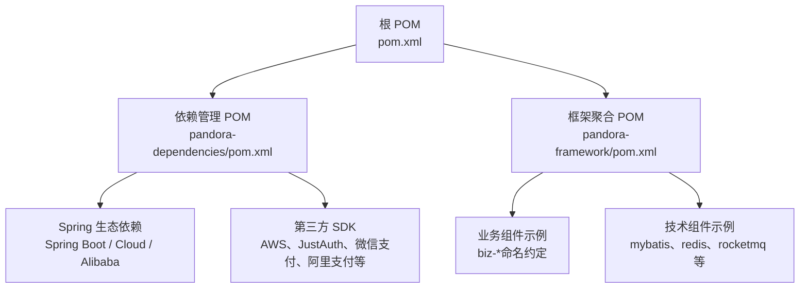
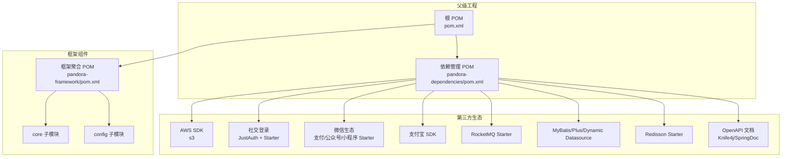
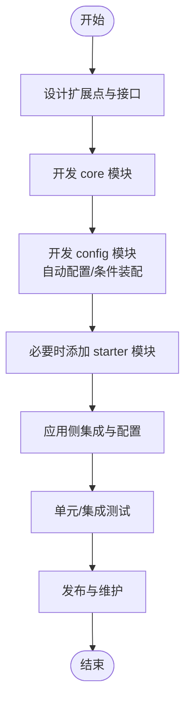
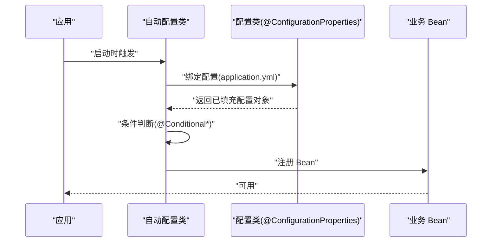
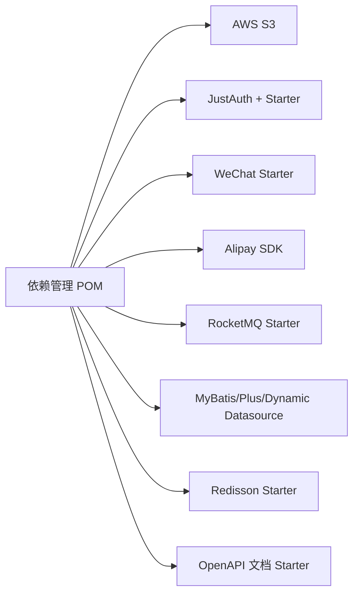
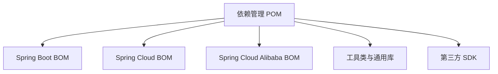

# 扩展开发

<cite>
**本文引用的文件**
- [根 POM](file://pom.xml)
- [框架聚合 POM](file://pandora-framework/pom.xml)
- [依赖管理 POM](file://pandora-dependencies/pom.xml)
- [lombok 配置](file://lombok.config)
- [项目说明](file://README.md)
</cite>

## 目录
1. [简介](#简介)
2. [项目结构](#项目结构)
3. [核心组件](#核心组件)
4. [架构总览](#架构总览)
5. [详细组件分析](#详细组件分析)
6. [依赖分析](#依赖分析)
7. [性能考虑](#性能考虑)
8. [故障排查指南](#故障排查指南)
9. [结论](#结论)
10. [附录](#附录)

## 简介
本指南面向希望在 Pandora Cloud 平台上进行扩展开发的工程师，覆盖以下主题：
- 如何开发自定义组件与扩展现有功能
- 如何集成第三方服务（SDK、API、配置）
- Spring Boot Starter 开发与自动配置原理
- 扩展点识别、接口设计与向后兼容性
- 代码规范、测试要求与贡献流程
- 从概念到实现的完整开发流程

当前仓库为父级聚合工程，提供统一的依赖版本管理与构建配置；框架模块以“组件”为单位组织，每个组件通常包含 core 与 config 两个子模块，分别负责核心封装与 Spring 配置。

章节来源
- [项目说明:1-2](file://README.md#L1-L2)

## 项目结构
仓库采用多模块聚合结构，核心模块如下：
- 根 POM：定义版本属性、构建插件与仓库镜像，聚合子模块
- pandora-dependencies：BOM 管理所有依赖版本，统一 Spring Boot、Spring Cloud、Spring Cloud Alibaba 及各类第三方 SDK 版本
- pandora-framework：框架组件聚合，每个子模块代表一个技术或业务组件，组件内部按 core/config 划分职责
- lombok.config：全局 Lombok 配置，统一生成 toString/equals/hashCode/链式调用等行为

图表来源
- [根 POM:11-14](file://pom.xml#L11-L14)
- [框架聚合 POM:15-24](file://pandora-framework/pom.xml#L15-L24)
- [依赖管理 POM:109-141](file://pandora-dependencies/pom.xml#L109-L141)

章节来源
- [根 POM:1-150](file://pom.xml#L1-L150)
- [框架聚合 POM:1-34](file://pandora-framework/pom.xml#L1-L34)
- [依赖管理 POM:1-658](file://pandora-dependencies/pom.xml#L1-L658)

## 核心组件
- 模块化组织：每个组件由 core 与 config 两部分组成，core 负责核心能力封装，config 提供 Spring 配置与自动装配
- 组件类型：分为“框架组件”（如数据库、缓存、消息队列等基础设施）与“业务组件”（如数据字典、操作日志等业务域封装），业务组件命名中包含 biz
- 构建与工具链：统一使用 Maven，启用 spring-boot-configuration-processor、Lombok、MapStruct 等注解处理器，确保配置元数据与映射生成正确

章节来源
- [框架聚合 POM:15-24](file://pandora-framework/pom.xml#L15-L24)
- [根 POM:52-101](file://pom.xml#L52-L101)
- [lombok 配置:1-4](file://lombok.config#L1-L4)

## 架构总览
下图展示扩展开发的整体架构：父级工程通过 BOM 管理版本，框架组件模块提供可插拔的 core/config 结构，第三方 SDK 通过 starter 或直接依赖接入，最终在应用侧通过自动配置完成装配。

图表来源
- [根 POM:40-50](file://pom.xml#L40-L50)
- [依赖管理 POM:109-141](file://pandora-dependencies/pom.xml#L109-L141)
- [依赖管理 POM:548-598](file://pandora-dependencies/pom.xml#L548-L598)

## 详细组件分析

### 组件开发流程（从零到一）
- 设计阶段
  - 明确扩展点：识别现有系统中的 SPI/接口扩展点，或新增领域抽象
  - 接口设计：遵循单一职责与开闭原则，保持向后兼容
  - 命名规范：业务组件使用 biz 前缀，技术组件按领域命名
- 开发阶段
  - core 模块：实现核心逻辑，尽量无 Spring 依赖，便于复用
  - config 模块：提供 @ConfigurationProperties、@ConditionalOnProperty/Bean、@EnableAutoConfiguration 等自动装配
  - Starter：若需外部依赖，提供 starter 模块并在 BOM 中统一版本
- 集成阶段
  - 在应用侧引入组件 starter 或直接依赖 core/config
  - 通过 application.yml 配置启用与参数化
- 测试阶段
  - 单元测试：使用 Mockito、Jedis-Mock、Podam 等
  - 集成测试：结合 starter 的最小环境验证
- 发布与维护
  - 通过 BOM 统一版本，确保依赖一致性
  - 严格语义化版本与变更日志

### Spring Boot Starter 开发与自动配置原理
- @ConfigurationProperties：在 config 模块中定义配置类，配合 spring-boot-configuration-processor 生成元数据
- 条件装配：使用 @ConditionalOnProperty、@ConditionalOnMissingBean、@ConditionalOnClass 等控制装配时机
- 启动器装配：通过 META-INF/spring/org.springframework.boot.autoconfigure.AutoConfiguration.imports 或 @EnableAutoConfiguration 触发
- Starter 依赖：在 starter 模块中仅声明运行期依赖，避免污染用户项目

图表来源
- [根 POM:64-99](file://pom.xml#L64-L99)
- [依赖管理 POM:157-162](file://pandora-dependencies/pom.xml#L157-L162)

章节来源
- [根 POM:52-101](file://pom.xml#L52-L101)
- [依赖管理 POM:109-141](file://pandora-dependencies/pom.xml#L109-L141)

### 第三方 SDK 集成方案
- AWS S3：通过软件包管理引入 s3 依赖，按需封装客户端与配置
- JustAuth 社交登录：引入 JustAuth 与 justauth-spring-boot-starter，统一配置与自动装配
- 微信生态：引入 weixin-java-* 系列 starter，按场景选择公众号/小程序/支付
- 支付宝：引入 alipay-sdk-java，按需封装对外 API
- RocketMQ：引入 rocketmq-spring-boot-starter，简化生产者/消费者配置
- MyBatis/Plus/Dynamic Datasource：引入对应 starter，统一多数据源与联表查询
- Redisson：引入 redisson-spring-boot-starter，提供分布式能力
- OpenAPI 文档：引入 knife4j 或 springdoc starter，统一接口文档

图表来源
- [依赖管理 POM:548-620](file://pandora-dependencies/pom.xml#L548-L620)

章节来源
- [依赖管理 POM:548-620](file://pandora-dependencies/pom.xml#L548-L620)

### 扩展点识别与接口设计
- 扩展点识别
  - 查看现有组件是否暴露 @ConfigurationProperties、@Conditional 条件、@Import/META-INF 配置入口
  - 关注 Starter 是否提供默认 Bean 与可替换策略
- 接口设计
  - 优先使用接口隔离与策略模式，保证可替换性
  - 对外 API 保持稳定，内部实现可演进
- 向后兼容
  - 新增字段建议使用默认值或可选配置
  - 避免破坏性变更，必要时提供迁移指引

章节来源
- [框架聚合 POM:15-24](file://pandora-framework/pom.xml#L15-L24)

### 代码规范与测试要求
- 代码规范
  - 使用 Lombok 简化样板代码，统一 toString/equals/hashCode 行为
  - 使用 MapStruct 进行对象映射，确保类型安全
  - 使用 Spring Boot Configuration Processor 生成配置元数据
- 测试要求
  - 单测：Mockito inline、Jedis-Mock、Podam 随机对象
  - 集成测试：结合 Starter 最小环境验证
  - 覆盖率：核心路径与异常分支

章节来源
- [根 POM:64-99](file://pom.xml#L64-L99)
- [依赖管理 POM:340-376](file://pandora-dependencies/pom.xml#L340-L376)
- [lombok 配置:1-4](file://lombok.config#L1-L4)

### 贡献与社区协作
- 版本与发布
  - 通过 BOM 统一版本，确保依赖一致性
  - 使用 flatten-maven-plugin 规范 POM
- 提交流程
  - Fork 仓库，提交 PR，遵循变更日志与语义化版本
  - 保持与 Spring Boot/Cloud 版本同步，避免冲突

章节来源
- [根 POM:102-129](file://pom.xml#L102-L129)
- [依赖管理 POM:627-655](file://pandora-dependencies/pom.xml#L627-L655)

## 依赖分析
- Spring 生态：通过 spring-boot-dependencies、spring-cloud-dependencies、spring-cloud-alibaba-dependencies 管理版本
- 第三方 SDK：集中于 pandora-dependencies，统一版本号与排除冲突依赖
- 工具链：Lombok、MapStruct、Hutool、Guava、Commons 等

图表来源
- [依赖管理 POM:109-141](file://pandora-dependencies/pom.xml#L109-L141)

章节来源
- [依赖管理 POM:109-141](file://pandora-dependencies/pom.xml#L109-L141)

## 性能考虑
- 启动性能：合理使用条件装配，避免不必要的 Bean 创建
- 连接池与缓存：使用 Redisson、Druid 等 Starter 默认优化参数
- 序列化与映射：MapStruct 减少反射成本，Lombok 降低样板代码带来的编译负担
- 日志与追踪：SkyWalking、OpenTracing 工具链按需启用

## 故障排查指南
- 配置元数据缺失
  - 确认已启用 spring-boot-configuration-processor
  - 检查 @ConfigurationProperties 注解与前缀
- Bean 冲突或未加载
  - 检查 @ConditionalOnProperty/@ConditionalOnMissingBean
  - 确认 Starter 依赖与版本
- 第三方 SDK 初始化失败
  - 核对 AK/SK、Endpoint、超时等参数
  - 检查 Starter 是否正确引入与排除冲突依赖
- 测试失败
  - 使用 Jedis-Mock、Mockito Inline 等工具准备测试环境
  - Podam 生成随机对象辅助边界测试

章节来源
- [根 POM:64-99](file://pom.xml#L64-L99)
- [依赖管理 POM:340-376](file://pandora-dependencies/pom.xml#L340-L376)

## 结论
Pandora Cloud 通过 BOM 统一依赖、模块化组件与 Spring Boot Starter 机制，提供了清晰的扩展路径。开发者应遵循“core/config/starter”的分层设计，结合条件装配与配置元数据，实现可插拔、可演进且向后兼容的扩展能力。同时，依托完善的第三方 SDK 集成方案与测试工具链，能够快速、稳健地交付高质量扩展。

## 附录
- 快速清单
  - 设计扩展点 → 编写 core → 实现 config → 可选 starter → 应用集成 → 测试 → 发布
  - 在 BOM 中统一版本，避免依赖冲突
  - 使用 Lombok/MapStruct/Configuration Processor 提升开发效率
  - 通过 Knife4j/SpringDoc 统一接口文档