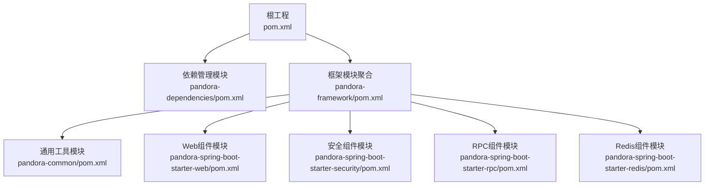
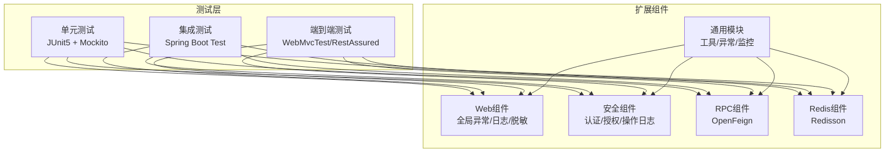
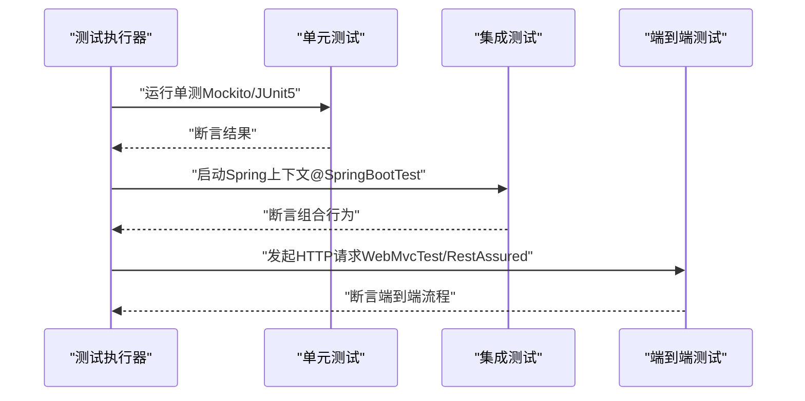
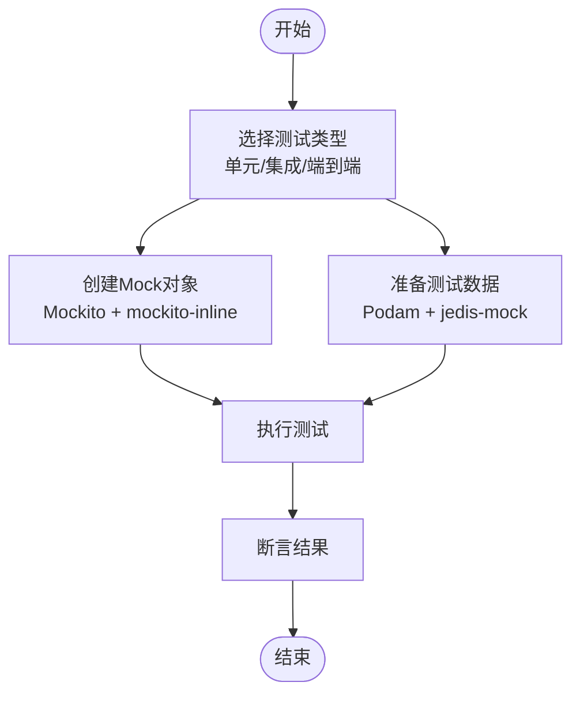
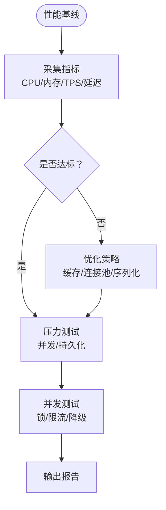
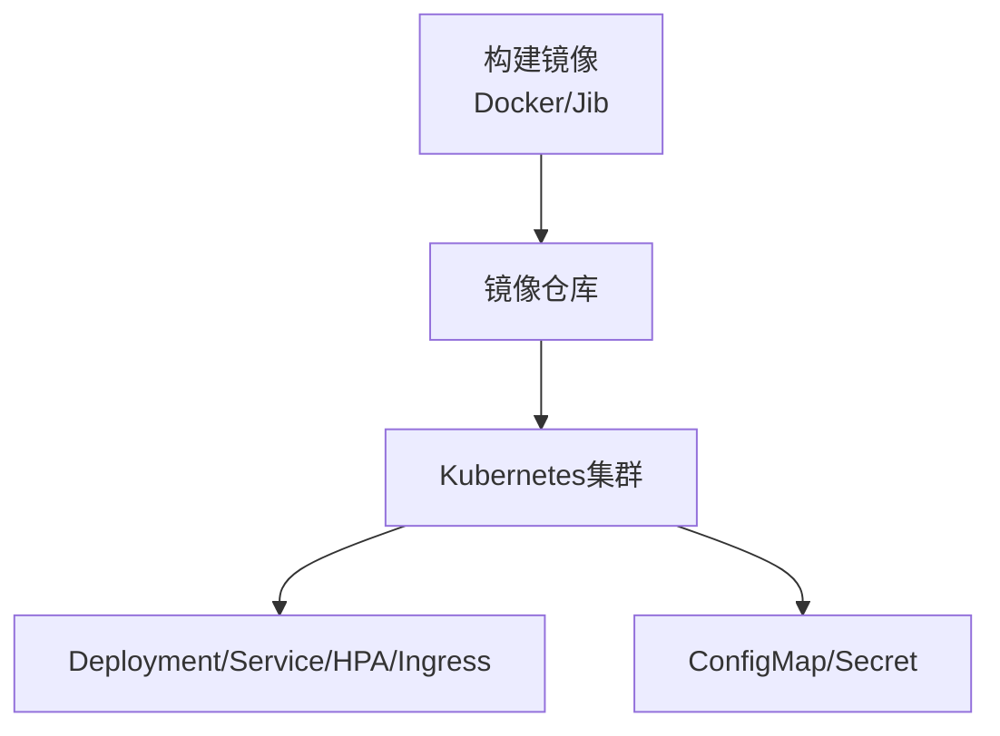
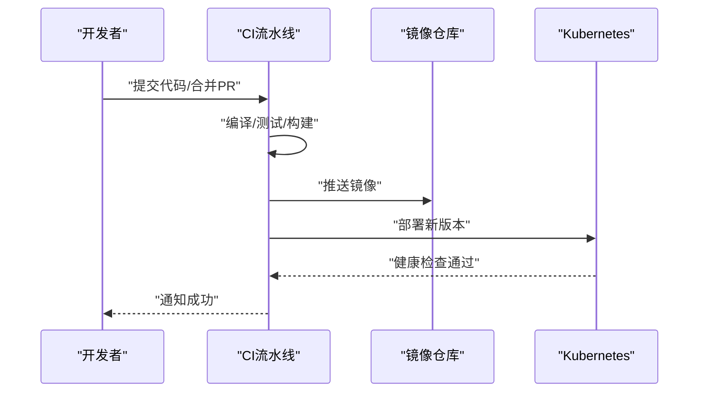
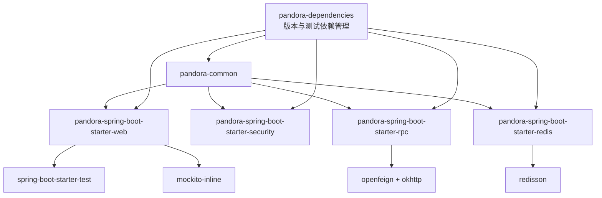

# 扩展测试和部署

<cite>
**本文引用的文件**
- [pom.xml](file://pom.xml)
- [README.md](file://README.md)
- [pandora-dependencies/pom.xml](file://pandora-dependencies/pom.xml)
- [pandora-framework/pandora-common/pom.xml](file://pandora-framework/pandora-common/pom.xml)
- [pandora-framework/pandora-spring-boot-starter-web/pom.xml](file://pandora-framework/pandora-spring-boot-starter-web/pom.xml)
- [pandora-framework/pandora-spring-boot-starter-security/pom.xml](file://pandora-framework/pandora-spring-boot-starter-security/pom.xml)
- [pandora-framework/pandora-spring-boot-starter-redis/pom.xml](file://pandora-framework/pandora-spring-boot-starter-redis/pom.xml)
- [pandora-framework/pandora-spring-boot-starter-rpc/pom.xml](file://pandora-framework/pandora-spring-boot-starter-rpc/pom.xml)
- [pandora-framework/pandora-common/src/main/java/net/ittimeline/pandora/framework/common/util/web/spring/SpringUtils.java](file://pandora-framework/pandora-common/src/main/java/net/ittimeline/pandora/framework/common/util/web/spring/SpringUtils.java)
- [pandora-framework/pandora-spring-boot-starter-web/src/main/java/net/ittimeline/pandora/framework/web/config/PandoraWebAutoConfiguration.java](file://pandora-framework/pandora-spring-boot-starter-web/src/main/java/net/ittimeline/pandora/framework/web/config/PandoraWebAutoConfiguration.java)
- [pandora-framework/pandora-spring-boot-starter-security/src/main/java/net/ittimeline/pandora/framework/security/config/PandoraWebSecurityAutoConfiguration.java](file://pandora-framework/pandora-spring-boot-starter-security/src/main/java/net/ittimeline/pandora/framework/security/config/PandoraWebSecurityAutoConfiguration.java)
- [pandora-framework/pandora-common/src/main/java/net/ittimeline/pandora/framework/common/biz/infra/logger/ApiErrorLogCommonApi.java](file://pandora-framework/pandora-common/src/main/java/net/ittimeline/pandora/framework/common/biz/infra/logger/ApiErrorLogCommonApi.java)
</cite>

## 目录
1. [引言](#引言)
2. [项目结构](#项目结构)
3. [核心组件](#核心组件)
4. [架构总览](#架构总览)
5. [详细组件分析](#详细组件分析)
6. [依赖分析](#依赖分析)
7. [性能考虑](#性能考虑)
8. [故障排查指南](#故障排查指南)
9. [结论](#结论)
10. [附录](#附录)

## 引言
本指南面向扩展开发团队，围绕“测试与部署”主题，系统阐述如何在当前多模块Maven工程中落地测试策略与自动化部署流程。项目采用Spring Boot 3与Spring Cloud生态，模块化封装了Web、安全、RPC、缓存等能力，具备良好的可测试性与可观测性基础。本文将从测试金字塔（单元、集成、端到端）、Mock与测试数据、性能与并发测试、容器化与编排、CI/CD与版本发布等方面给出可操作的实践建议与参考路径。

## 项目结构
项目采用多模块Maven结构，顶层聚合根负责统一版本与构建插件；框架子模块按功能拆分，便于独立测试与演进。

图表来源
- [pom.xml:1-150](file://pom.xml#L1-L150)
- [pandora-dependencies/pom.xml:106-601](file://pandora-dependencies/pom.xml#L106-L601)

章节来源
- [README.md:1-15](file://README.md#L1-L15)
- [pom.xml:1-150](file://pom.xml#L1-L150)

## 核心组件
- 通用工具与基础能力：提供POJO、枚举、异常体系、工具类与监控埋点能力，作为各模块公共依赖。
- Web组件：封装全局异常、API日志、脱敏、XSS防护、OpenAPI文档等，适合进行端到端与集成测试。
- 安全组件：提供认证、授权、操作日志能力，适合集成测试与安全场景验证。
- RPC组件：基于OpenFeign，便于对外部服务进行Mock与契约测试。
- Redis组件：基于Redisson，便于缓存与分布式锁的集成测试与压测。

章节来源
- [pandora-framework/pandora-common/pom.xml:19-114](file://pandora-framework/pandora-common/pom.xml#L19-L114)
- [pandora-framework/pandora-spring-boot-starter-web/pom.xml:19-91](file://pandora-framework/pandora-spring-boot-starter-web/pom.xml#L19-L91)
- [pandora-framework/pandora-spring-boot-starter-security/pom.xml:23-73](file://pandora-framework/pandora-spring-boot-starter-security/pom.xml#L23-L73)
- [pandora-framework/pandora-spring-boot-starter-rpc/pom.xml:22-60](file://pandora-framework/pandora-spring-boot-starter-rpc/pom.xml#L22-L60)
- [pandora-framework/pandora-spring-boot-starter-redis/pom.xml:19-43](file://pandora-framework/pandora-spring-boot-starter-redis/pom.xml#L19-L43)

## 架构总览
下图展示扩展组件在测试与部署中的交互关系：测试侧通过Spring Boot Test与Mockito进行单元与集成测试；Web与RPC模块承担对外接口与远程调用职责；安全模块提供鉴权与审计；Redis模块支撑缓存与并发控制；依赖管理模块统一版本与测试工具。

图表来源
- [pandora-framework/pandora-spring-boot-starter-web/pom.xml:77-88](file://pandora-framework/pandora-spring-boot-starter-web/pom.xml#L77-L88)
- [pandora-framework/pandora-spring-boot-starter-security/pom.xml:40-55](file://pandora-framework/pandora-spring-boot-starter-security/pom.xml#L40-L55)
- [pandora-framework/pandora-spring-boot-starter-rpc/pom.xml:28-51](file://pandora-framework/pandora-spring-boot-starter-rpc/pom.xml#L28-L51)
- [pandora-framework/pandora-spring-boot-starter-redis/pom.xml:25-39](file://pandora-framework/pandora-spring-boot-starter-redis/pom.xml#L25-L39)
- [pandora-framework/pandora-common/pom.xml:26-110](file://pandora-framework/pandora-common/pom.xml#L26-L110)

## 详细组件分析

### 测试策略与框架使用
- 单元测试
  - 使用JUnit 5与Mockito进行纯逻辑与边界条件验证，优先针对无外部依赖的工具类与服务层方法。
  - 对final类或静态方法，使用mockito-inline以满足Mock需求。
  - 参考路径：[pandora-framework/pandora-spring-boot-starter-web/pom.xml:77-88](file://pandora-framework/pandora-spring-boot-starter-web/pom.xml#L77-L88)、[pandora-dependencies/pom.xml:501-531](file://pandora-dependencies/pom.xml#L501-L531)
- 集成测试
  - 使用Spring Boot Test启动最小上下文，验证Web、安全、RPC、Redis等模块组合行为。
  - 通过@AutoConfigureTestDatabase与内嵌数据库/缓存进行数据一致性测试。
  - 参考路径：[pandora-framework/pandora-spring-boot-starter-web/pom.xml:77-88](file://pandora-framework/pandora-spring-boot-starter-web/pom.xml#L77-L88)
- 端到端测试
  - 使用WebMvcTest或RestAssured对HTTP接口进行完整链路验证，覆盖认证、日志、异常处理与响应格式。
  - 参考路径：[pandora-framework/pandora-spring-boot-starter-web/pom.xml:37-62](file://pandora-framework/pandora-spring-boot-starter-web/pom.xml#L37-L62)

图表来源
- [pandora-framework/pandora-spring-boot-starter-web/pom.xml:77-88](file://pandora-framework/pandora-spring-boot-starter-web/pom.xml#L77-L88)
- [pandora-framework/pandora-spring-boot-starter-web/pom.xml:37-62](file://pandora-framework/pandora-spring-boot-starter-web/pom.xml#L37-L62)

章节来源
- [pandora-framework/pandora-spring-boot-starter-web/pom.xml:77-88](file://pandora-framework/pandora-spring-boot-starter-web/pom.xml#L77-L88)
- [pandora-dependencies/pom.xml:501-531](file://pandora-dependencies/pom.xml#L501-L531)

### Mock对象与测试数据
- Mock对象
  - 使用Mockito对RPC接口（如Feign Client）与外部依赖进行隔离，确保测试稳定性。
  - 对于final类与静态方法，启用mockito-inline。
  - 参考路径：[pandora-dependencies/pom.xml:501-531](file://pandora-dependencies/pom.xml#L501-L531)、[pandora-framework/pandora-common/src/main/java/net/ittimeline/pandora/framework/common/biz/infra/logger/ApiErrorLogCommonApi.java:21-41](file://pandora-framework/pandora-common/src/main/java/net/ittimeline/pandora/framework/common/biz/infra/logger/ApiErrorLogCommonApi.java#L21-L41)
- 测试数据
  - 使用Podam生成随机POJO数据，减少手工构造成本。
  - 使用jedis-mock模拟Redis行为，便于缓存相关测试。
  - 参考路径：[pandora-dependencies/pom.xml:527-531](file://pandora-dependencies/pom.xml#L527-L531)

图表来源
- [pandora-dependencies/pom.xml:501-531](file://pandora-dependencies/pom.xml#L501-L531)
- [pandora-dependencies/pom.xml:527-531](file://pandora-dependencies/pom.xml#L527-L531)

章节来源
- [pandora-dependencies/pom.xml:501-531](file://pandora-dependencies/pom.xml#L501-L531)
- [pandora-dependencies/pom.xml:527-531](file://pandora-dependencies/pom.xml#L527-L531)

### 性能测试、压力测试与并发测试
- 性能测试
  - 使用JMH或Spring Boot Actuator指标评估关键路径耗时与内存占用。
- 压力测试
  - 使用Gatling或JMeter对Web接口施加并发负载，观察吞吐、延迟与错误率。
- 并发测试
  - 针对Redis分布式锁与缓存更新场景，结合jedis-mock与线程池模拟高并发。
- 参考路径：[pandora-framework/pandora-spring-boot-starter-redis/pom.xml:25-39](file://pandora-framework/pandora-spring-boot-starter-redis/pom.xml#L25-L39)

图表来源
- [pandora-framework/pandora-spring-boot-starter-redis/pom.xml:25-39](file://pandora-framework/pandora-spring-boot-starter-redis/pom.xml#L25-L39)

章节来源
- [pandora-framework/pandora-spring-boot-starter-redis/pom.xml:25-39](file://pandora-framework/pandora-spring-boot-starter-redis/pom.xml#L25-L39)

### Docker容器化与Kubernetes编排
- 容器化
  - 为每个扩展模块构建独立镜像，使用多阶段构建减少体积。
  - 在模块级pom中引入dockerfile或使用Jib插件，统一镜像标签与入口。
- Kubernetes
  - 使用Deployment/Service/HPA/Ingress管理扩展服务，结合探针与资源限制。
  - 通过ConfigMap/Secret注入配置，结合Spring Profiles区分环境。
- 参考路径：[pom.xml:52-101](file://pom.xml#L52-L101)（构建插件与版本管理）

图表来源
- [pom.xml:52-101](file://pom.xml#L52-L101)

章节来源
- [pom.xml:52-101](file://pom.xml#L52-L101)

### CI/CD流水线与版本发布
- 流水线
  - 触发：PR/MR合并后触发构建；分支保护策略保证质量门禁。
  - 步骤：代码检查、单元测试、集成测试、打包、镜像构建与推送、K8s部署。
- 版本管理
  - 使用maven flatten插件与revision变量统一版本，避免漂移。
- 回滚机制
  - K8s滚动回滚；镜像tag固定策略；灰度发布与蓝绿部署。
- 参考路径：[pom.xml:102-128](file://pom.xml#L102-L128)（flatten插件）、[pandora-dependencies/pom.xml:15-103](file://pandora-dependencies/pom.xml#L15-L103)（版本属性）

图表来源
- [pom.xml:102-128](file://pom.xml#L102-L128)
- [pandora-dependencies/pom.xml:15-103](file://pandora-dependencies/pom.xml#L15-L103)

章节来源
- [pom.xml:102-128](file://pom.xml#L102-L128)
- [pandora-dependencies/pom.xml:15-103](file://pandora-dependencies/pom.xml#L15-L103)

### 部署脚本与配置管理
- 部署脚本
  - Helm Chart或Kustomize模板，参数化环境差异；使用kubectl/k9s进行部署与验证。
- 配置管理
  - 通过Spring Profiles与外部配置中心（如Nacos/ConfigMap）动态下发配置。
- 监控告警
  - 结合SkyWalking链路追踪与Spring Boot Admin，设置阈值告警与日志聚合。

章节来源
- [pandora-dependencies/pom.xml:299-339](file://pandora-dependencies/pom.xml#L299-L339)

### 生产故障排查、日志分析与性能调优
- 故障排查
  - 通过SkyWalking查看调用链，定位慢调用与异常；结合业务日志SDK记录操作轨迹。
- 日志分析
  - 使用集中式日志收集与检索，结合Trace ID串联请求全链路。
- 性能调优
  - 优化Redis连接池与序列化策略；调整Web线程池与超时配置；对RPC调用增加熔断与重试。

章节来源
- [pandora-dependencies/pom.xml:299-339](file://pandora-dependencies/pom.xml#L299-L339)
- [pandora-framework/pandora-common/pom.xml:87-91](file://pandora-framework/pandora-common/pom.xml#L87-L91)

## 依赖分析
下图展示扩展组件与测试依赖的关系，以及版本由依赖管理模块统一约束。

图表来源
- [pandora-framework/pandora-common/pom.xml:26-110](file://pandora-framework/pandora-common/pom.xml#L26-L110)
- [pandora-framework/pandora-spring-boot-starter-web/pom.xml:19-91](file://pandora-framework/pandora-spring-boot-starter-web/pom.xml#L19-L91)
- [pandora-framework/pandora-spring-boot-starter-security/pom.xml:23-73](file://pandora-framework/pandora-spring-boot-starter-security/pom.xml#L23-L73)
- [pandora-framework/pandora-spring-boot-starter-rpc/pom.xml:22-60](file://pandora-framework/pandora-spring-boot-starter-rpc/pom.xml#L22-L60)
- [pandora-framework/pandora-spring-boot-starter-redis/pom.xml:19-43](file://pandora-framework/pandora-spring-boot-starter-redis/pom.xml#L19-L43)
- [pandora-dependencies/pom.xml:106-601](file://pandora-dependencies/pom.xml#L106-L601)

章节来源
- [pandora-dependencies/pom.xml:106-601](file://pandora-dependencies/pom.xml#L106-L601)

## 性能考虑
- 构建性能
  - 使用阿里云/华为云Maven镜像加速依赖下载。
  - 合理划分模块，避免循环依赖，缩短增量编译时间。
- 运行性能
  - 通过Actuator暴露指标，结合Prometheus/Grafana观测关键指标。
  - 对RPC调用增加超时与重试策略，避免级联故障。

章节来源
- [pom.xml:135-147](file://pom.xml#L135-L147)

## 故障排查指南
- 环境判断
  - 通过工具类判断当前是否为生产环境，以便在不同环境采取差异化策略。
  - 参考路径：[pandora-framework/pandora-common/src/main/java/net/ittimeline/pandora/framework/common/util/web/spring/SpringUtils.java:13-24](file://pandora-framework/pandora-common/src/main/java/net/ittimeline/pandora/framework/common/util/web/spring/SpringUtils.java#L13-L24)
- 安全与认证
  - 若认证失败，检查WebSecurity自动配置与AuthenticationManager Bean注册。
  - 参考路径：[pandora-framework/pandora-spring-boot-starter-security/src/main/java/net/ittimeline/pandora/framework/security/config/PandoraWebSecurityAutoConfiguration.java:82-92](file://pandora-framework/pandora-spring-boot-starter-security/src/main/java/net/ittimeline/pandora/framework/security/config/PandoraWebSecurityAutoConfiguration.java#L82-L92)
- Web与日志
  - 若API日志缺失，检查Web自动配置与拦截器链路。
  - 参考路径：[pandora-framework/pandora-spring-boot-starter-web/src/main/java/net/ittimeline/pandora/framework/web/config/PandoraWebAutoConfiguration.java](file://pandora-framework/pandora-spring-boot-starter-web/src/main/java/net/ittimeline/pandora/framework/web/config/PandoraWebAutoConfiguration.java)

章节来源
- [pandora-framework/pandora-common/src/main/java/net/ittimeline/pandora/framework/common/util/web/spring/SpringUtils.java:13-24](file://pandora-framework/pandora-common/src/main/java/net/ittimeline/pandora/framework/common/util/web/spring/SpringUtils.java#L13-L24)
- [pandora-framework/pandora-spring-boot-starter-security/src/main/java/net/ittimeline/pandora/framework/security/config/PandoraWebSecurityAutoConfiguration.java:82-92](file://pandora-framework/pandora-spring-boot-starter-security/src/main/java/net/ittimeline/pandora/framework/security/config/PandoraWebSecurityAutoConfiguration.java#L82-L92)

## 结论
本指南基于现有Maven模块与依赖管理，给出了从测试到部署的完整实践路径。通过合理利用Spring Boot Test、Mockito、OkHttp Mock与Redis Mock，结合性能与并发测试，配合容器化与Kubernetes编排，可形成稳定高效的CI/CD流水线。建议在实际项目中逐步完善监控告警与灰度发布策略，持续迭代测试覆盖率与部署可靠性。

## 附录
- 示例参考路径
  - Web自动配置：[pandora-framework/pandora-spring-boot-starter-web/src/main/java/net/ittimeline/pandora/framework/web/config/PandoraWebAutoConfiguration.java](file://pandora-framework/pandora-spring-boot-starter-web/src/main/java/net/ittimeline/pandora/framework/web/config/PandoraWebAutoConfiguration.java)
  - 安全自动配置：[pandora-framework/pandora-spring-boot-starter-security/src/main/java/net/ittimeline/pandora/framework/security/config/PandoraWebSecurityAutoConfiguration.java:82-92](file://pandora-framework/pandora-spring-boot-starter-security/src/main/java/net/ittimeline/pandora/framework/security/config/PandoraWebSecurityAutoConfiguration.java#L82-L92)
  - RPC接口示例：[pandora-framework/pandora-common/src/main/java/net/ittimeline/pandora/framework/common/biz/infra/logger/ApiErrorLogCommonApi.java:21-41](file://pandora-framework/pandora-common/src/main/java/net/ittimeline/pandora/framework/common/biz/infra/logger/ApiErrorLogCommonApi.java#L21-L41)