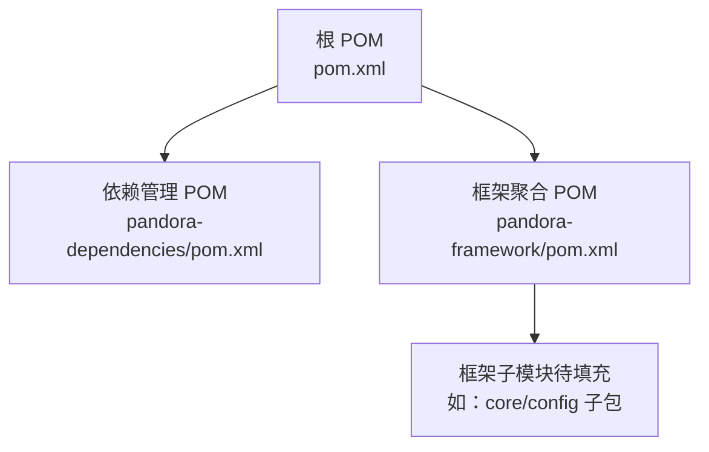
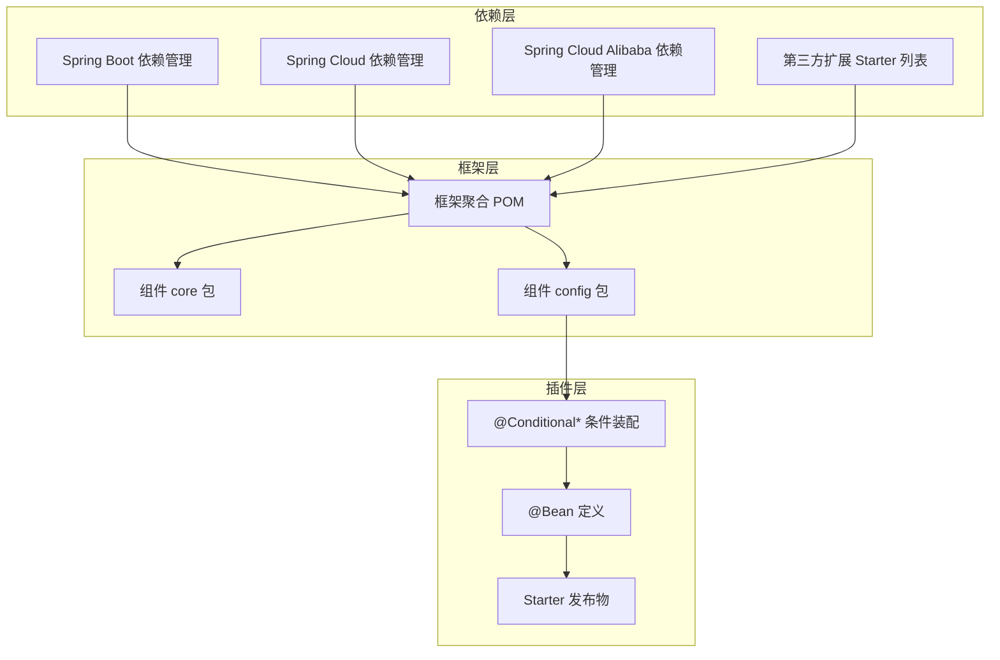
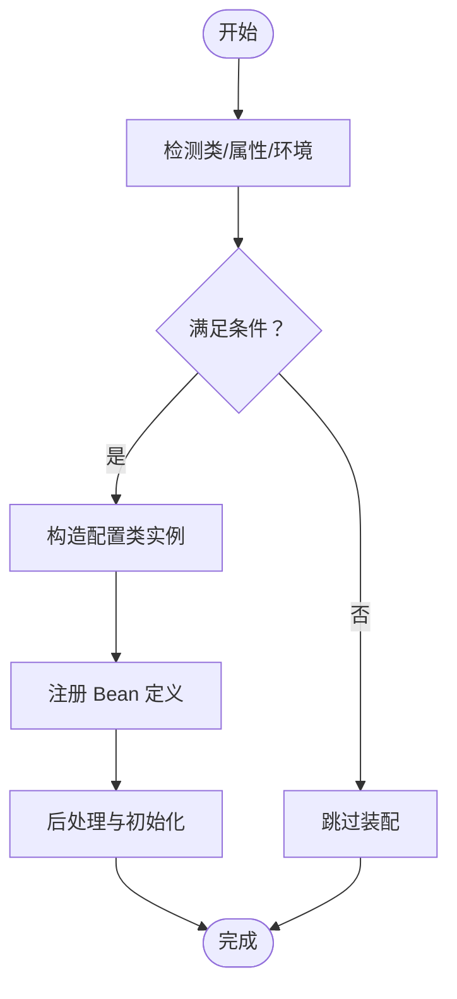
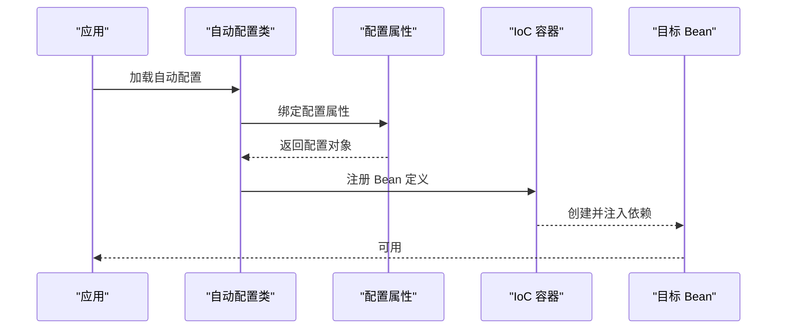
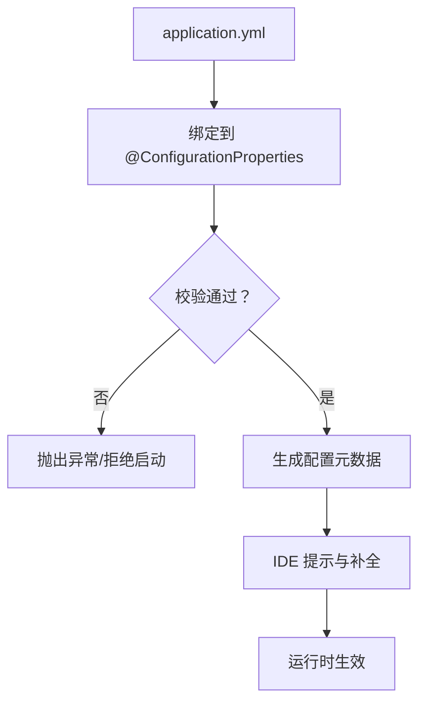
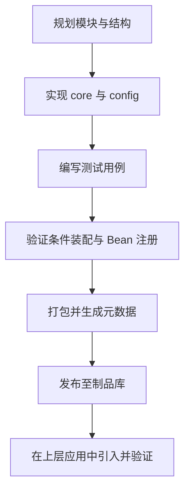
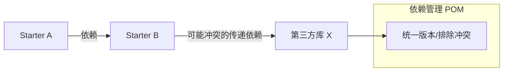
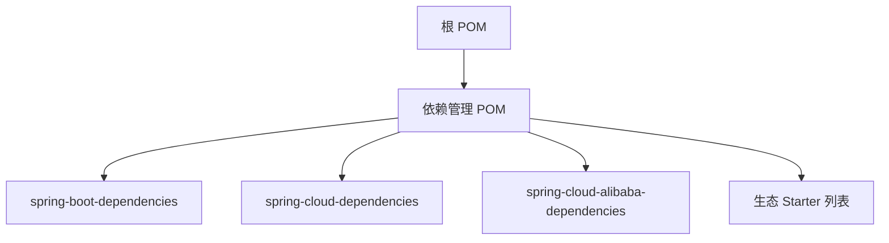

# 插件机制

<cite>
**本文引用的文件**
- [根 POM](file://pom.xml)
- [依赖管理 POM](file://pandora-dependencies/pom.xml)
- [框架聚合 POM](file://pandora-framework/pom.xml)
- [项目说明](file://README.md)
</cite>

## 目录
1. [引言](#引言)
2. [项目结构](#项目结构)
3. [核心组件](#核心组件)
4. [架构总览](#架构总览)
5. [详细组件分析](#详细组件分析)
6. [依赖分析](#依赖分析)
7. [性能考虑](#性能考虑)
8. [故障排查指南](#故障排查指南)
9. [结论](#结论)
10. [附录](#附录)

## 引言
本指南面向希望在 Pandora Cloud 平台上开发 Spring Boot 插件（Starter）的开发者，系统讲解插件机制的设计思路、自动配置原理、条件装配、Bean 定义、生命周期管理、插件发现与依赖注入、配置文件与元数据、版本管理、测试策略、性能优化与调试技巧，并给出从项目结构到发布部署的完整流程建议。由于当前仓库尚未包含具体 Starter 实现，本文以现有多模块结构为基础，结合依赖管理与构建配置，提供可直接落地的开发蓝图。

## 项目结构
当前仓库为 Maven 多模块工程，采用父子 POM 结构组织，顶层 POM 负责版本与插件管理，依赖管理模块集中统一第三方组件版本，框架聚合模块作为技术组件的容器，便于后续拆分出独立 Starter。

图表来源
- [根 POM:1-150](file://pom.xml#L1-L150)
- [依赖管理 POM:1-658](file://pandora-dependencies/pom.xml#L1-L658)
- [框架聚合 POM:1-34](file://pandora-framework/pom.xml#L1-L34)

章节来源
- [根 POM:1-150](file://pom.xml#L1-L150)
- [依赖管理 POM:1-658](file://pandora-dependencies/pom.xml#L1-L658)
- [框架聚合 POM:1-34](file://pandora-framework/pom.xml#L1-L34)

## 核心组件
- 顶层 POM：负责统一版本号、编译参数、测试插件、仓库镜像与 flatten 插件，确保子模块一致性与可发布性。
- 依赖管理 POM：集中管理 Spring Boot、Spring Cloud、Spring Cloud Alibaba 及众多生态组件版本，避免版本冲突。
- 框架聚合 POM：作为技术组件的容器，约定“core + config”双包结构，便于拆分为独立 Starter。

章节来源
- [根 POM:20-132](file://pom.xml#L20-L132)
- [依赖管理 POM:109-624](file://pandora-dependencies/pom.xml#L109-L624)
- [框架聚合 POM:15-24](file://pandora-framework/pom.xml#L15-L24)

## 架构总览
下图展示插件开发的总体架构：以依赖管理 POM 为基石，通过框架聚合 POM 组织技术组件；每个组件拆分为 core（核心封装）与 config（Spring 自动配置）两部分，最终形成可独立发布的 Starter。

图表来源
- [依赖管理 POM:112-621](file://pandora-dependencies/pom.xml#L112-L621)
- [框架聚合 POM:15-24](file://pandora-framework/pom.xml#L15-L24)

## 详细组件分析

### 组件 A：自动配置与条件装配
- 设计原则
  - 将“能力封装”与“自动装配”分离：core 负责能力实现，config 负责条件判断与 Bean 注册。
  - 使用条件注解控制装配时机，避免对未引入 Starter 的应用产生副作用。
- 关键点
  - 条件注解：@ConditionalOnClass、@ConditionalOnMissingBean、@ConditionalOnProperty、@ConditionalOnWebApplication 等。
  - 配置类：@Configuration + @EnableConfigurationProperties 或 @ConstructorBinding。
  - Bean 定义：优先级与覆盖规则，避免重复注册。
- 生命周期
  - @PostConstruct 初始化、SmartInitializingSingleton 延迟初始化、DisposableBean 销毁回调。
  - ApplicationContextAware 获取上下文，EventListener 监听事件。

图表来源
- [依赖管理 POM:157-162](file://pandora-dependencies/pom.xml#L157-L162)

章节来源
- [依赖管理 POM:157-162](file://pandora-dependencies/pom.xml#L157-L162)

### 组件 B：插件发现与依赖注入
- 发现机制
  - META-INF/spring/org.springframework.boot.autoconfigure.AutoConfiguration.imports：声明自动配置类。
  - META-INF/spring/org.springframework.boot.actuate.autoconfigure.health.HealthContributor.imports：声明健康检查贡献者。
  - 反射扫描：配合 @ComponentScan 或 @ImportResource。
- 依赖注入
  - 构造器注入优先，减少空指针风险。
  - @Lazy 延迟加载，避免循环依赖与启动时序问题。
  - @Primary 明确首选 Bean，避免歧义。
- 生命周期管理
  - SmartLifecycle：可控启动/停止顺序。
  - ApplicationListener：监听应用事件（ContextRefreshedEvent 等）。

图表来源
- [依赖管理 POM:157-162](file://pandora-dependencies/pom.xml#L157-L162)

章节来源
- [依赖管理 POM:157-162](file://pandora-dependencies/pom.xml#L157-L162)

### 组件 C：配置文件与元数据
- application.yml 配置
  - 命名空间隔离：使用前缀区分不同 Starter 的配置项。
  - 默认值与校验：结合 @Validated 与 JSR-303 校验。
- 元数据生成
  - spring-boot-configuration-processor 自动生成配置元数据 JSON，IDE 友好提示。
- 版本管理
  - 使用顶层 POM 的 revision 属性统一版本，依赖管理 POM 统一第三方版本。

图表来源
- [根 POM:62-99](file://pom.xml#L62-L99)
- [依赖管理 POM:157-162](file://pandora-dependencies/pom.xml#L157-L162)

章节来源
- [根 POM:62-99](file://pom.xml#L62-L99)
- [依赖管理 POM:157-162](file://pandora-dependencies/pom.xml#L157-L162)

### 组件 D：插件开发流程（从零到发布）
- 项目结构
  - 新建模块：artifactId 以 -starter 结尾，遵循 Spring Boot Starter 规范。
  - 双包结构：core（核心能力）、config（自动配置与条件装配）。
- 开发步骤
  - 定义配置属性类，标注 @ConfigurationProperties 或 @ConstructorBinding。
  - 编写自动配置类，使用条件注解与 Bean 定义。
  - 在 resources/META-INF/spring 下暴露自动配置与导入文件。
  - 编写单元测试与集成测试，覆盖条件装配与 Bean 注册。
- 发布部署
  - 使用顶层 POM 的 flatten 插件统一版本，确保发布一致性。
  - 配置仓库镜像加速依赖下载，提升 CI/CD 效率。

图表来源
- [根 POM:102-128](file://pom.xml#L102-L128)
- [框架聚合 POM:15-24](file://pandora-framework/pom.xml#L15-L24)

章节来源
- [根 POM:102-128](file://pom.xml#L102-L128)
- [框架聚合 POM:15-24](file://pandora-framework/pom.xml#L15-L24)

### 组件 E：插件间依赖与冲突解决
- 依赖关系
  - Starter 之间通过 Maven 依赖声明，避免硬编码耦合。
  - 使用 @DependsOn 控制装配顺序，必要时通过 @Primary 解决歧义。
- 冲突解决
  - 依赖管理 POM 统一版本，避免子模块各自指定导致的冲突。
  - 使用 <exclusions> 排除不需要的传递依赖，或替换为兼容版本。
  - 对于常见冲突（如工具类库），在依赖管理中显式锁定版本。

图表来源
- [依赖管理 POM:109-621](file://pandora-dependencies/pom.xml#L109-L621)

章节来源
- [依赖管理 POM:109-621](file://pandora-dependencies/pom.xml#L109-L621)

## 依赖分析
- 版本统一
  - 顶层 POM 使用 ${revision} 统一版本号，依赖管理 POM 通过 bom 导入 Spring Boot、Cloud、Alibaba 版本坐标。
- 插件化生态
  - 依赖管理 POM 中已包含大量 Starter（如数据库、缓存、消息队列、监控、安全等），可作为插件开发的参考与复用基础。
- 构建插件
  - maven-compiler-plugin 配置 annotationProcessorPaths，启用 spring-boot-configuration-processor 与 mapstruct-processor，确保元数据与映射生成正常。

图表来源
- [根 POM:40-50](file://pom.xml#L40-L50)
- [依赖管理 POM:112-140](file://pandora-dependencies/pom.xml#L112-L140)

章节来源
- [根 POM:40-50](file://pom.xml#L40-L50)
- [依赖管理 POM:112-140](file://pandora-dependencies/pom.xml#L112-L140)

## 性能考虑
- 启动性能
  - 减少不必要的条件装配与 Bean 创建，延迟初始化非关键组件。
  - 合理使用 @Lazy 与 @Scope("prototype")，避免单例 Bean 过大。
- 运行性能
  - 对外部依赖进行连接池配置与超时设置，避免阻塞。
  - 使用异步与限流策略，降低热点路径压力。
- 资源占用
  - 控制日志级别与采样率，避免过多 IO。
  - 合理缓存策略，避免内存泄漏。

## 故障排查指南
- 自动配置未生效
  - 检查是否正确暴露自动配置导入文件与条件注解是否满足。
  - 使用 debug 日志观察条件评估结果。
- Bean 注册冲突
  - 使用 @Primary 明确首选 Bean，或通过 @Qualifier 精确注入。
- 配置绑定失败
  - 核对 application.yml 命名空间与属性名，确保类型匹配。
  - 启用 spring-boot-configuration-processor 生成元数据，IDE 提示更准确。
- 版本冲突
  - 在依赖管理 POM 中统一版本或排除冲突传递依赖。

章节来源
- [根 POM:62-99](file://pom.xml#L62-L99)
- [依赖管理 POM:157-162](file://pandora-dependencies/pom.xml#L157-L162)

## 结论
Pandora Cloud 通过顶层 POM 与依赖管理 POM 提供了稳定的版本与生态支撑，框架聚合 POM 则为插件化开发提供了清晰的模块边界与结构规范。按照“core + config”的双包设计与条件装配最佳实践，可以快速构建高质量、可维护、可复用的 Spring Boot Starter，并通过统一的版本与发布流程融入整体平台。

## 附录
- 快速清单
  - 模块命名：artifactId 以 -starter 结尾。
  - 结构：core（能力封装）、config（自动配置与条件装配）。
  - 元数据：启用 spring-boot-configuration-processor。
  - 条件装配：合理使用 @Conditional* 注解。
  - 测试：覆盖条件装配与 Bean 注册。
  - 发布：使用顶层 POM 的 flatten 插件统一版本。