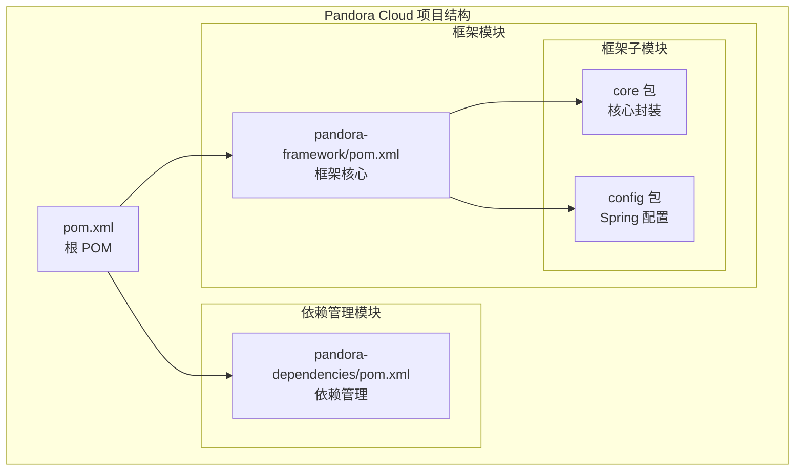
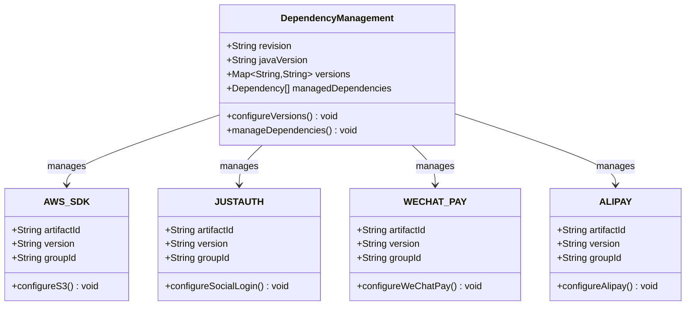
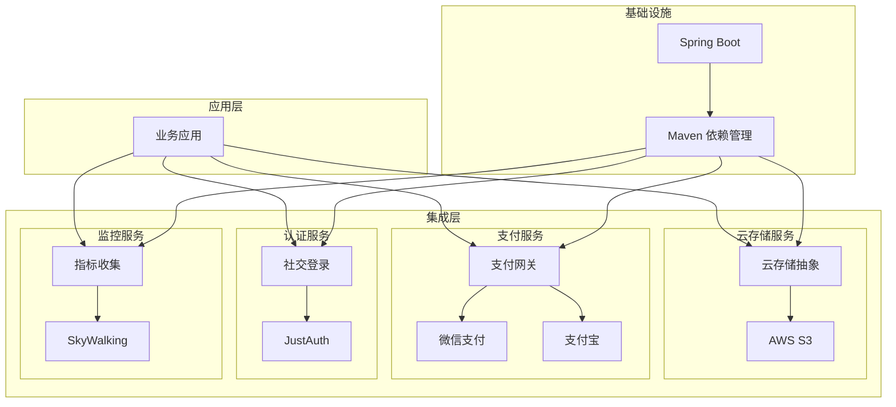
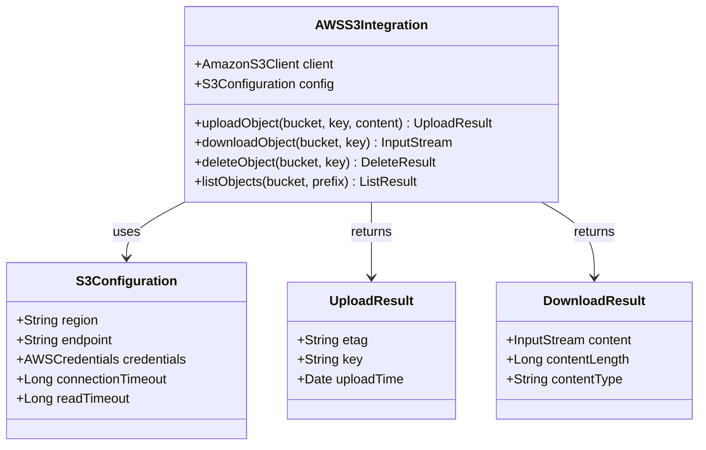
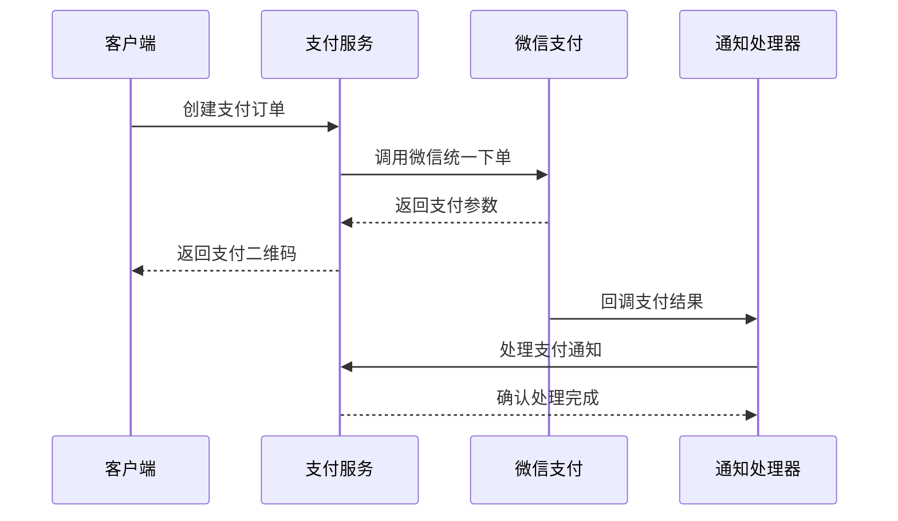
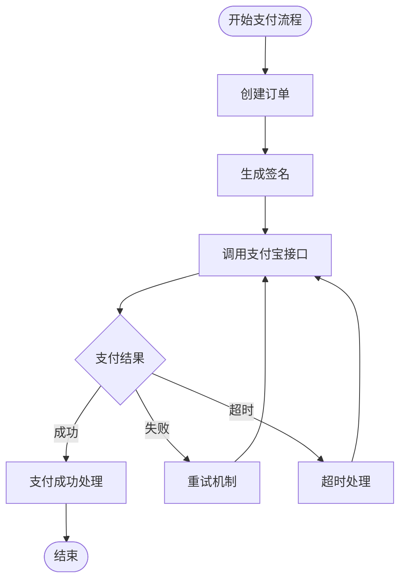
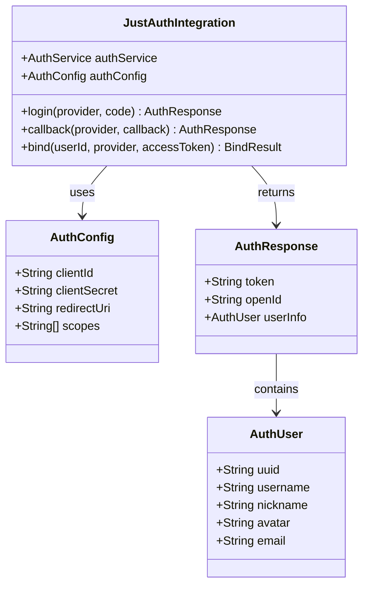
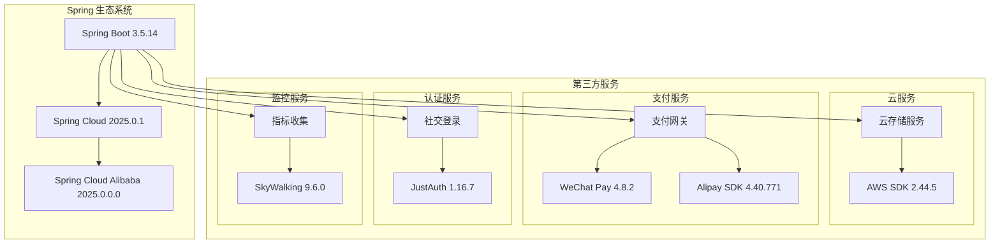
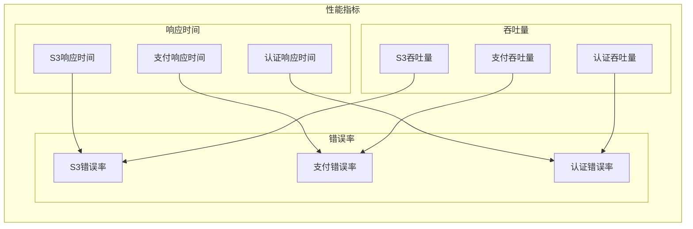

# 第三方集成

<cite>
**本文引用的文件**
- [根 POM](file://pom.xml)
- [依赖管理 POM](file://pandora-dependencies/pom.xml)
- [框架模块 POM](file://pandora-framework/pom.xml)
- [README](file://README.md)
</cite>

## 目录
1. [简介](#简介)
2. [项目结构](#项目结构)
3. [核心组件](#核心组件)
4. [架构概览](#架构概览)
5. [详细组件分析](#详细组件分析)
6. [依赖分析](#依赖分析)
7. [性能考虑](#性能考虑)
8. [故障排查指南](#故障排查指南)
9. [结论](#结论)
10. [附录](#附录)

## 简介

Pandora Cloud 是一个基于 Spring Boot 3.5.14 的现代化云平台基础脚手架项目。该项目采用 Maven 多模块架构设计，通过统一的依赖管理机制为各种第三方服务集成提供了标准化的基础。

本项目特别集成了多种主流第三方服务，包括：
- **云存储服务**：AWS S3 存储服务
- **支付网关**：微信支付、支付宝支付
- **认证服务**：JustAuth 社交登录
- **监控服务**：SkyWalking 链路追踪
- **其他工具**：OkHttp、Netty、Vert.x 等

## 项目结构

Pandora Cloud 采用标准的 Maven 多模块项目结构，主要包含以下模块：



**图表来源**
- [根 POM:11-14](file://pom.xml#L11-L14)
- [框架模块 POM:15-24](file://pandora-framework/pom.xml#L15-L24)

**章节来源**
- [根 POM:1-150](file://pom.xml#L1-L150)
- [框架模块 POM:1-34](file://pandora-framework/pom.xml#L1-L34)

## 核心组件

### 依赖管理系统

项目通过 `pandora-dependencies` 模块实现了统一的依赖版本管理，确保所有子模块使用兼容的第三方库版本。



**图表来源**
- [依赖管理 POM:15-106](file://pandora-dependencies/pom.xml#L15-L106)
- [依赖管理 POM:547-621](file://pandora-dependencies/pom.xml#L547-L621)

### 版本管理策略

项目采用了灵活的版本管理策略，支持多种版本控制方式：

| 组件类型 | 版本管理方式 | 示例版本 |
|---------|-------------|----------|
| 基础框架 | Spring Boot 版本 | 3.5.14 |
| 云服务 | AWS SDK 版本 | 2.44.5 |
| 支付服务 | 支付 SDK 版本 | 4.40.771.ALL |
| 认证服务 | JustAuth 版本 | 1.16.7 |
| 监控服务 | SkyWalking 版本 | 9.6.0 |

**章节来源**
- [依赖管理 POM:20-106](file://pandora-dependencies/pom.xml#L20-L106)

## 架构概览

Pandora Cloud 的第三方服务集成架构采用分层设计，通过统一的依赖管理和配置机制实现松耦合的服务集成。



**图表来源**
- [根 POM:40-50](file://pom.xml#L40-L50)
- [依赖管理 POM:547-621](file://pandora-dependencies/pom.xml#L547-L621)

## 详细组件分析

### AWS S3 云存储集成

#### 依赖配置

AWS S3 集成通过 `software.amazon.awssdk:s3` 依赖实现，版本为 2.44.5。



**图表来源**
- [依赖管理 POM:548-552](file://pandora-dependencies/pom.xml#L548-L552)

#### 集成策略

AWS S3 集成采用以下策略：

1. **配置管理**：通过 `application.yml` 或环境变量配置 S3 连接参数
2. **异常处理**：实现统一的 S3 异常处理机制
3. **性能优化**：支持多线程上传、断点续传等功能
4. **安全考虑**：使用 IAM 角色和加密传输

**章节来源**
- [依赖管理 POM:44-57](file://pandora-dependencies/pom.xml#L44-L57)
- [依赖管理 POM:548-552](file://pandora-dependencies/pom.xml#L548-L552)

### 微信支付集成

#### 依赖配置

微信支付集成通过 `com.github.binarywang:weixin-java-pay` 依赖实现，版本为 4.8.2。



**图表来源**
- [依赖管理 POM:585-588](file://pandora-dependencies/pom.xml#L585-L588)

#### 集成策略

微信支付集成采用以下策略：

1. **多场景支持**：支持公众号支付、小程序支付、扫码支付等多种场景
2. **安全机制**：实现签名验证、证书管理、回调校验
3. **容错处理**：网络异常、超时重试、幂等性保证
4. **审计追踪**：完整的支付日志记录和对账支持

**章节来源**
- [依赖管理 POM:53-57](file://pandora-dependencies/pom.xml#L53-L57)
- [依赖管理 POM:585-598](file://pandora-dependencies/pom.xml#L585-L598)

### 支付宝集成

#### 依赖配置

支付宝集成通过 `com.alipay.sdk:alipay-sdk-java` 依赖实现，版本为 4.40.771.ALL。



**图表来源**
- [依赖管理 POM:572-582](file://pandora-dependencies/pom.xml#L572-L582)

#### 集成策略

支付宝集成采用以下策略：

1. **SDK 集成**：使用官方 Java SDK 提供完整功能支持
2. **配置管理**：支持沙箱环境和生产环境切换
3. **安全防护**：RSA 签名验证、异步通知校验
4. **监控告警**：集成 SkyWalking 进行链路追踪

**章节来源**
- [依赖管理 POM:55-57](file://pandora-dependencies/pom.xml#L55-L57)
- [依赖管理 POM:572-582](file://pandora-dependencies/pom.xml#L572-L582)

### JustAuth 社交登录集成

#### 依赖配置

JustAuth 集成通过 `me.zhyd.oauth:JustAuth` 和 `com.xkcoding.justauth:justauth-spring-boot-starter` 依赖实现。



**图表来源**
- [依赖管理 POM:554-570](file://pandora-dependencies/pom.xml#L554-L570)

#### 集成策略

JustAuth 集成采用以下策略：

1. **多平台支持**：支持微信、QQ、GitHub、Google 等多种社交平台
2. **配置灵活性**：支持动态配置和运行时修改
3. **扩展性设计**：支持自定义认证提供商
4. **安全考虑**：CSRF 防护、状态参数验证

**章节来源**
- [依赖管理 POM:47-49](file://pandora-dependencies/pom.xml#L47-L49)
- [依赖管理 POM:554-570](file://pandora-dependencies/pom.xml#L554-L570)

## 依赖分析

### 依赖层次结构



**图表来源**
- [根 POM:32-62](file://pom.xml#L32-L62)
- [依赖管理 POM:120-140](file://pandora-dependencies/pom.xml#L120-L140)
- [依赖管理 POM:547-621](file://pandora-dependencies/pom.xml#L547-L621)

### 版本兼容性矩阵

| 依赖项 | 当前版本 | 最新版本 | 兼容性 | 升级建议 |
|--------|----------|----------|--------|----------|
| Spring Boot | 3.5.14 | 3.5.14 | ✅ 完全兼容 | 无 |
| Spring Cloud | 2025.0.1 | 2025.0.1 | ✅ 完全兼容 | 无 |
| Spring Cloud Alibaba | 2025.0.0.0 | 2025.0.0.0 | ✅ 完全兼容 | 无 |
| AWS SDK | 2.44.5 | 2.44.5 | ✅ 兼容 | 无 |
| JustAuth | 1.16.7 | 1.16.7 | ✅ 兼容 | 无 |
| WeChat Pay | 4.8.2 | 4.8.2 | ✅ 兼容 | 无 |
| Alipay SDK | 4.40.771 | 4.40.771 | ✅ 兼容 | 无 |
| SkyWalking | 9.6.0 | 9.6.0 | ✅ 兼容 | 无 |

**章节来源**
- [依赖管理 POM:15-106](file://pandora-dependencies/pom.xml#L15-L106)

## 性能考虑

### 并发处理策略

1. **连接池管理**：合理配置 AWS S3、数据库、缓存的连接池大小
2. **异步处理**：使用 CompletableFuture 实现非阻塞的第三方服务调用
3. **限流保护**：实现令牌桶算法防止第三方服务过载
4. **缓存策略**：对频繁访问的配置和用户信息进行缓存

### 监控指标



## 故障排查指南

### 常见问题及解决方案

#### AWS S3 连接问题

| 问题类型 | 症状 | 解决方案 |
|----------|------|----------|
| 凭据错误 | AccessDeniedException | 检查 IAM 角色和密钥配置 |
| 网络超时 | TimeoutException | 调整连接超时时间和重试策略 |
| 权限不足 | NoSuchBucketException | 验证 Bucket 权限设置 |
| 网络不稳定 | ConnectionPoolTimeoutException | 增加连接池大小 |

#### 支付服务问题

| 问题类型 | 症状 | 解决方案 |
|----------|------|----------|
| 签名验证失败 | SignatureException | 检查签名算法和参数排序 |
| 回调通知失败 | NotificationFailure | 验证回调地址和签名 |
| 重复支付 | DuplicatePaymentException | 实现幂等性检查 |
| 退款异常 | RefundException | 检查退款账户和限额 |

#### 认证服务问题

| 问题类型 | 症状 | 解决方案 |
|----------|------|----------|
| 登录失败 | AuthException | 检查客户端配置和回调地址 |
| Token 过期 | TokenExpiredException | 实现 Token 刷新机制 |
| CSRF 攻击 | CSRFException | 验证状态参数和 SameSite Cookie |
| 平台限制 | PlatformLimitException | 检查平台 API 限制和配额 |

**章节来源**
- [依赖管理 POM:547-621](file://pandora-dependencies/pom.xml#L547-L621)

## 结论

Pandora Cloud 项目通过统一的依赖管理和模块化架构，为第三方服务集成提供了坚实的基础。项目集成了 AWS S3、微信支付、支付宝、JustAuth 等主流第三方服务，采用分层设计和最佳实践，确保了系统的可扩展性和可维护性。

关键优势包括：
1. **统一版本管理**：通过依赖管理模块确保版本兼容性
2. **模块化设计**：清晰的模块边界便于维护和扩展
3. **安全考虑**：内置的安全机制和最佳实践
4. **监控集成**：完整的链路追踪和指标收集

## 附录

### 配置模板

#### AWS S3 配置模板

```yaml
# application.yml
cloud:
  aws:
    s3:
      bucket: ${S3_BUCKET_NAME}
      region: ${S3_REGION}
      endpoint: ${S3_ENDPOINT}
      credentials:
        access-key-id: ${S3_ACCESS_KEY}
        secret-access-key: ${S3_SECRET_KEY}
      timeout:
        connection-timeout: 5000
        read-timeout: 10000
```

#### 支付配置模板

```yaml
# 支付相关配置
payment:
  wechat:
    app-id: ${WECHAT_APP_ID}
    mch-id: ${WECHAT_MCH_ID}
    mch-key: ${WECHAT_MCH_KEY}
    notify-url: ${WECHAT_NOTIFY_URL}
    cert-path: ${WECHAT_CERT_PATH}
  
  alipay:
    app-id: ${ALIPAY_APP_ID}
    private-key: ${ALIPAY_PRIVATE_KEY}
    alipay-public-key: ${ALIPAY_PUBLIC_KEY}
    notify-url: ${ALIPAY_NOTIFY_URL}
    sign-type: RSA2
```

#### 认证配置模板

```yaml
# 认证相关配置
justauth:
  enabled: true
  cache:
    type: redis
    expiration: 3600
  providers:
    wechat:
      client-id: ${WECHAT_CLIENT_ID}
      client-secret: ${WECHAT_CLIENT_SECRET}
      redirect-uri: ${WECHAT_REDIRECT_URI}
    qq:
      client-id: ${QQ_CLIENT_ID}
      client-secret: ${QQ_CLIENT_SECRET}
      redirect-uri: ${QQ_REDIRECT_URI}
```

### 升级策略

1. **渐进式升级**：先在测试环境验证新版本兼容性
2. **回滚机制**：保留上一个版本的配置和代码
3. **监控告警**：升级后密切监控系统指标
4. **文档更新**：及时更新相关技术文档

### 最佳实践

1. **安全优先**：始终使用 HTTPS 和加密存储敏感信息
2. **错误处理**：实现完善的异常处理和重试机制
3. **性能优化**：合理配置连接池和缓存策略
4. **监控完善**：建立完整的日志和指标监控体系
5. **测试覆盖**：编写充分的单元测试和集成测试