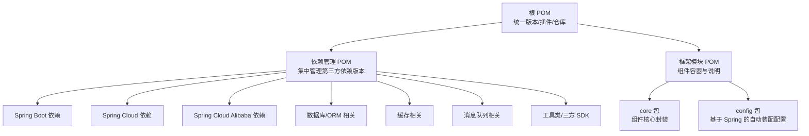
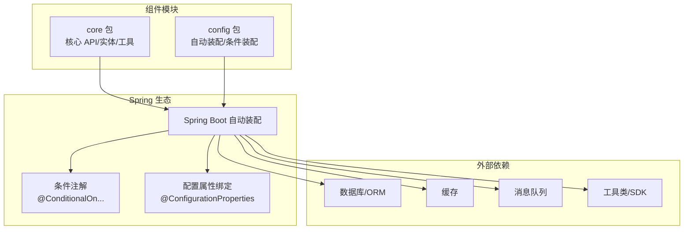
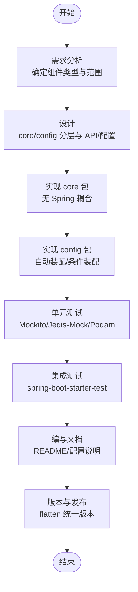
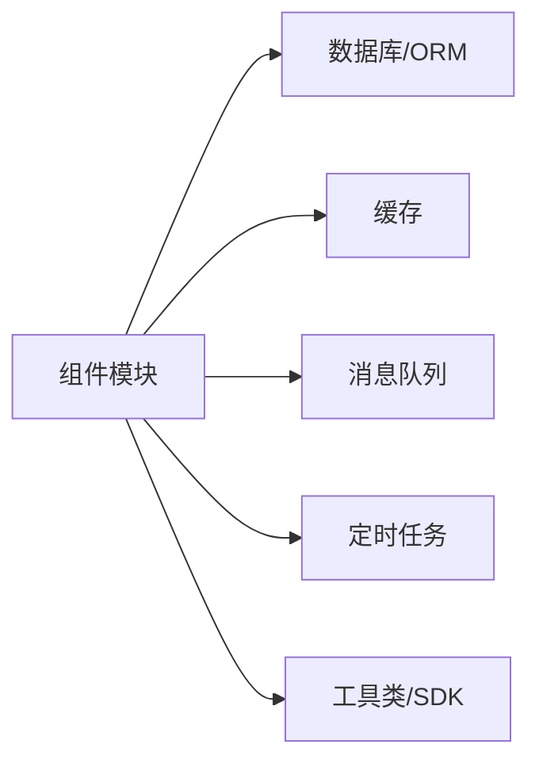

# 组件开发

<cite>
**本文引用的文件**
- [根 POM](file://pom.xml)
- [依赖管理 POM](file://pandora-dependencies/pom.xml)
- [框架模块 POM](file://pandora-framework/pom.xml)
- [lombok 配置](file://lombok.config)
- [README](file://README.md)
</cite>

## 目录
1. [简介](#简介)
2. [项目结构](#项目结构)
3. [核心组件](#核心组件)
4. [架构总览](#架构总览)
5. [详细组件分析](#详细组件分析)
6. [依赖分析](#依赖分析)
7. [性能考虑](#性能考虑)
8. [故障排查指南](#故障排查指南)
9. [结论](#结论)
10. [附录](#附录)

## 简介
本指南面向“Pandora Cloud”组件开发者，系统阐述如何在该多模块 Maven 体系中开发新的技术组件与业务组件，重点覆盖以下方面：
- 组件分层与包结构：core 包（核心封装）、config 包（Spring 配置）
- 框架组件与业务组件的差异与边界
- 开发流程：从需求分析到测试验证
- 命名规范、包组织与模块依赖
- 最佳实践、代码规范与性能优化
- 测试策略、文档编写与版本管理

## 项目结构
该项目采用多模块聚合结构，顶层 POM 负责版本与插件统一，pandora-dependencies 提供统一依赖版本管理，pandora-framework 作为技术/业务组件的容器模块，定义组件的通用结构与分类。

图表来源
- [根 POM:1-150](file://pom.xml#L1-L150)
- [依赖管理 POM:109-624](file://pandora-dependencies/pom.xml#L109-L624)
- [框架模块 POM:15-24](file://pandora-framework/pom.xml#L15-L24)

章节来源
- [根 POM:1-150](file://pom.xml#L1-L150)
- [依赖管理 POM:109-624](file://pandora-dependencies/pom.xml#L109-L624)
- [框架模块 POM:15-24](file://pandora-framework/pom.xml#L15-L24)

## 核心组件
- 组件容器：pandora-framework 作为技术/业务组件的父模块，统一约束组件的结构与分类。
- 结构规范：
  - core 包：组件的核心能力封装，提供 API、实体、工具方法、异常等。
  - config 包：基于 Spring 的自动装配配置，暴露 @EnableXxx 或 @ConfigurationProperties 等。
- 组件类型：
  - 框架组件：对常见基础设施（数据库、缓存、消息队列等）进行扩展与封装。
  - 业务组件：面向业务域的可复用能力（如数据字典、操作日志等），命名通常包含 biz。

章节来源
- [框架模块 POM:15-24](file://pandora-framework/pom.xml#L15-L24)

## 架构总览
下图展示组件开发的整体架构与关键交互点，强调 core 与 config 的职责分离，以及与 Spring 生态的集成方式。

图表来源
- [框架模块 POM:15-24](file://pandora-framework/pom.xml#L15-L24)
- [依赖管理 POM:109-624](file://pandora-dependencies/pom.xml#L109-L624)

## 详细组件分析

### 组件命名规范与包结构
- 组件命名
  - 框架组件：以功能域命名，如 db、cache、mq 等，体现对基础设施的封装。
  - 业务组件：名称包含 biz，如 biz-dict、biz-log 等，突出业务语义。
- 包结构
  - core 包：按领域拆分子包，如 api、entity、service、exception、util；避免跨领域耦合。
  - config 包：按装配粒度拆分，如 autoconfigure、condition、properties；保持单一职责。

章节来源
- [框架模块 POM:15-24](file://pandora-framework/pom.xml#L15-L24)

### 开发流程（从需求到测试）
- 需求分析
  - 明确是框架组件还是业务组件，确定对外暴露的 API 与配置项。
  - 评估是否需要引入新依赖，优先在依赖管理 POM 中统一版本。
- 设计阶段
  - 在 core 包中定义接口、实体与异常；在 config 包中设计自动装配入口与条件装配。
  - 使用 @ConfigurationProperties 绑定配置，必要时提供默认值与校验。
- 实现阶段
  - core 包：实现核心逻辑，确保无 Spring 特性耦合；提供清晰的 SPI。
  - config 包：实现 @EnableXxx 或 @Configuration，注册 Bean 并应用条件装配。
- 测试阶段
  - 单元测试：使用 Mockito、Jedis-Mock、Podam 等工具进行隔离测试。
  - 集成测试：通过 spring-boot-starter-test 启动最小上下文，验证自动装配。
- 文档与发布
  - 编写 README，说明功能、配置项、使用示例与注意事项。
  - 使用 flatten-maven-plugin 统一版本，遵循仓库镜像配置。

图表来源
- [根 POM:52-132](file://pom.xml#L52-L132)
- [依赖管理 POM:340-376](file://pandora-dependencies/pom.xml#L340-L376)

章节来源
- [根 POM:52-132](file://pom.xml#L52-L132)
- [依赖管理 POM:340-376](file://pandora-dependencies/pom.xml#L340-L376)

### 框架组件 vs 业务组件
- 框架组件
  - 关注基础设施抽象与扩展，如数据库连接池、缓存客户端、消息队列生产者/消费者封装。
  - 通过 starter 与自动装配降低接入成本，配置项以通用场景为主。
- 业务组件
  - 面向具体业务域，如数据字典、操作日志、工作流引擎等。
  - 更贴近业务规则与流程，配置项可能更细粒度且与业务耦合更强。

章节来源
- [框架模块 POM:20-24](file://pandora-framework/pom.xml#L20-L24)

### 代码规范与最佳实践
- Lombok 使用
  - 通过 lombok.config 统一链式风格与超类调用策略，减少样板代码。
- MapStruct 与 Lombok 组合
  - 在根 POM 的 maven-compiler-plugin 中配置 annotationProcessorPaths，确保 MapStruct 可正确识别 Lombok 生成的方法。
- 参数名发现
  - 通过 -parameters 参数启用参数名发现，便于 Spring Boot 3.x 的参数绑定与文档生成。
- 条件装配与配置属性
  - 使用 @ConditionalOnProperty、@ConditionalOnMissingBean 等注解，保证组件可选与可替换。
  - 对外暴露的配置项使用 @ConstructorBinding 或 @ConfigurationProperties，提供默认值与校验。

章节来源
- [lombok 配置:1-4](file://lombok.config#L1-L4)
- [根 POM:64-99](file://pom.xml#L64-L99)

### 性能优化建议
- 缓存与连接池
  - 合理设置连接池大小、空闲超时与最大生命周期，避免资源泄露。
- 序列化与反序列化
  - 优先使用高性能序列化方案，避免大对象频繁拷贝。
- 异步与限流
  - 对高并发场景使用异步处理与限流策略，结合分布式锁防止超卖。
- 监控与追踪
  - 集成 SkyWalking 或 OpenTracing，定位慢调用与异常路径。

## 依赖分析
- 依赖管理
  - 通过 pandora-dependencies 统一管理 Spring Boot、Spring Cloud、Spring Cloud Alibaba 以及各类第三方组件版本，避免版本冲突。
- 组件依赖
  - 组件内部仅依赖 core 所需的最小集合；config 依赖 Spring Boot 自动装配相关 API。
- 外部依赖
  - 数据库：MyBatis、MyBatis-Plus、Dynamic-Datasource、Easy-Trans。
  - 缓存：Redisson。
  - 消息队列：RocketMQ。
  - 定时任务：XXL-Job。
  - 工具类与 SDK：Hutool、FastJSON、OkHttp、Vert.x、MQTT、CoAP、Modbus、JustAuth、阿里云 SDK、积木报表等。

图表来源
- [依赖管理 POM:109-624](file://pandora-dependencies/pom.xml#L109-L624)

章节来源
- [依赖管理 POM:109-624](file://pandora-dependencies/pom.xml#L109-L624)

## 性能考虑
- 构建性能
  - 使用阿里云/华为云 Maven 源加速依赖下载。
  - 使用 flatten-maven-plugin 在构建期统一版本，减少重复解析。
- 运行性能
  - 合理配置 JVM 参数与 GC 策略，结合 SkyWalking 观测热点。
  - 对热点接口进行压测，关注延迟与吞吐指标。

章节来源
- [根 POM:134-147](file://pom.xml#L134-L147)
- [依赖管理 POM:298-327](file://pandora-dependencies/pom.xml#L298-L327)

## 故障排查指南
- 编译期问题
  - Lombok 与 MapStruct 组合导致的 No property named 错误：确认 maven-compiler-plugin 的 annotationProcessorPaths 配置。
  - 参数名发现失败：确认编译参数包含 -parameters。
- 运行期问题
  - 自动装配未生效：检查 @ConditionalOn* 条件、配置项是否存在且正确。
  - 依赖冲突：在依赖管理 POM 中锁定版本，避免子模块覆盖。
- 测试问题
  - 单元测试失败：使用 Jedis-Mock 替代真实 Redis，使用 Podam 生成随机对象。
  - 集成测试启动失败：确保 spring-boot-starter-test 版本与 Spring Boot 主版本匹配。

章节来源
- [根 POM:64-99](file://pom.xml#L64-L99)
- [依赖管理 POM:340-376](file://pandora-dependencies/pom.xml#L340-L376)

## 结论
本指南明确了 Pandora Cloud 组件开发的结构、流程与规范，强调了 core 与 config 的职责分离，以及与 Spring 生态的集成方式。遵循本文的命名、包结构、依赖管理与测试策略，可高效产出高质量的技术/业务组件，并确保与平台整体的一致性与可维护性。

## 附录

### A. 组件开发清单
- [ ] 需求评审与设计
- [ ] 创建 core 包与 config 包
- [ ] 实现 core 逻辑（无 Spring 耦合）
- [ ] 实现 config 自动装配与条件装配
- [ ] 编写配置属性与默认值
- [ ] 单元测试与集成测试
- [ ] 编写 README 与变更记录
- [ ] 版本统一与发布

### B. 关键配置参考
- Lombok 配置：见 [lombok 配置:1-4](file://lombok.config#L1-L4)
- 编译插件与参数：见 [根 POM:64-99](file://pom.xml#L64-L99)
- 依赖版本管理：见 [依赖管理 POM:109-624](file://pandora-dependencies/pom.xml#L109-L624)