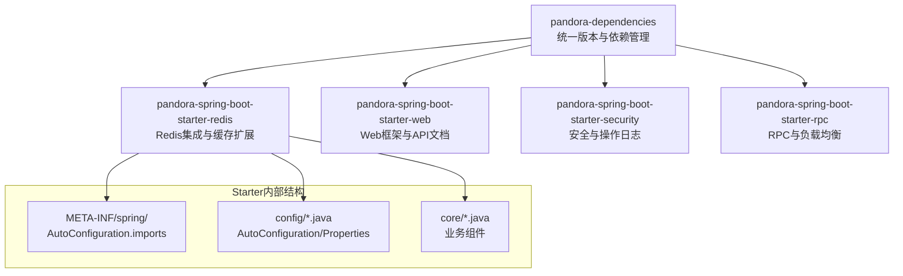
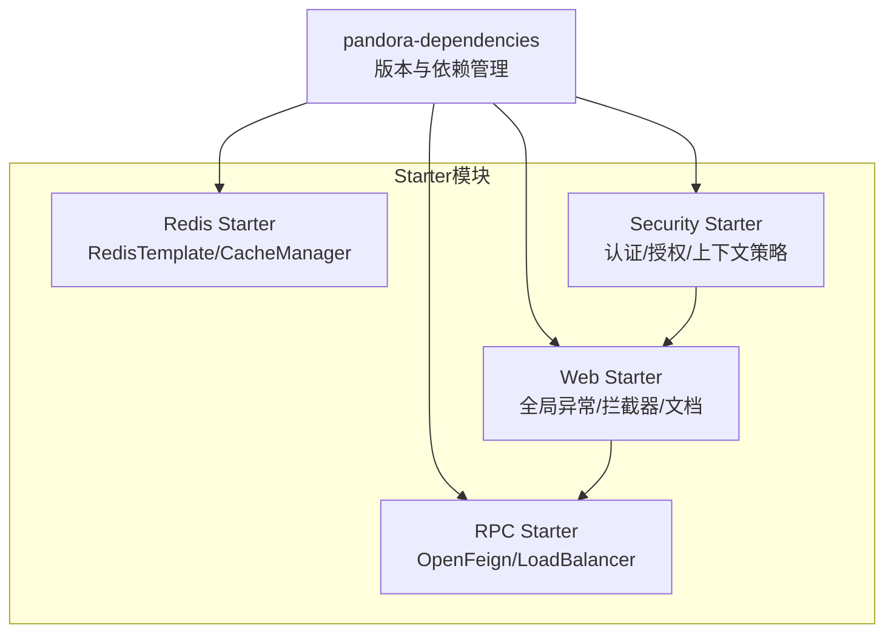
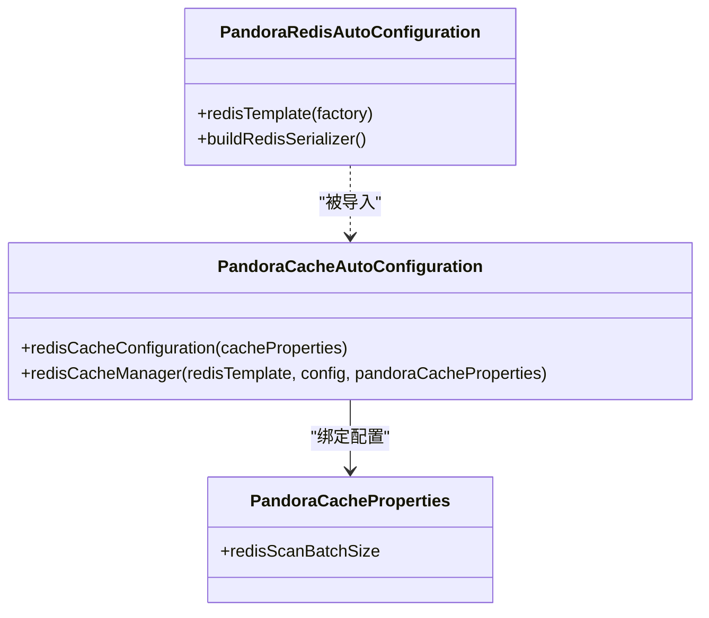
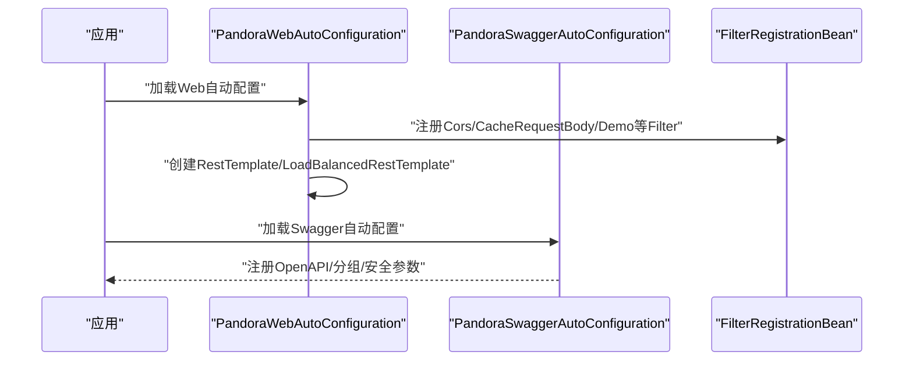
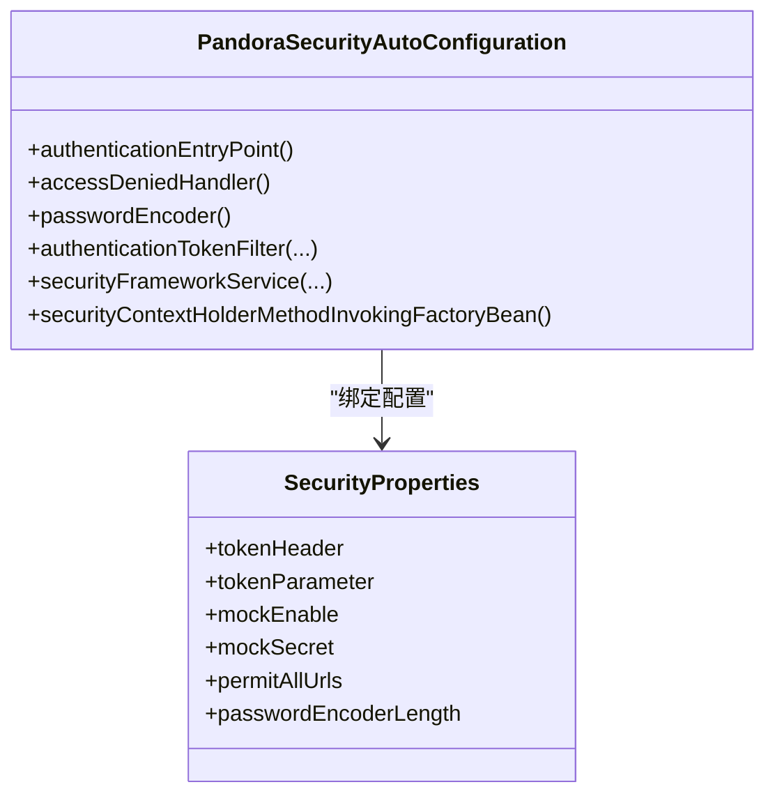
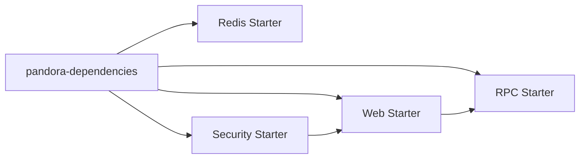

# 自定义Starter开发

<cite>
**本文引用的文件**
- [pandora-dependencies/pom.xml](file://pandora-dependencies/pom.xml)
- [pandora-framework/pandora-spring-boot-starter-redis/pom.xml](file://pandora-framework/pandora-spring-boot-starter-redis/pom.xml)
- [pandora-framework/pandora-spring-boot-starter-web/pom.xml](file://pandora-framework/pandora-spring-boot-starter-web/pom.xml)
- [pandora-framework/pandora-spring-boot-starter-security/pom.xml](file://pandora-framework/pandora-spring-boot-starter-security/pom.xml)
- [pandora-framework/pandora-spring-boot-starter-rpc/pom.xml](file://pandora-framework/pandora-spring-boot-starter-rpc/pom.xml)
- [pandora-framework/pandora-spring-boot-starter-redis/src/main/resources/META-INF/spring/org.springframework.boot.autoconfigure.AutoConfiguration.imports](file://pandora-framework/pandora-spring-boot-starter-redis/src/main/resources/META-INF/spring/org.springframework.boot.autoconfigure.AutoConfiguration.imports)
- [pandora-framework/pandora-spring-boot-starter-web/src/main/resources/META-INF/spring/org.springframework.boot.autoconfigure.AutoConfiguration.imports](file://pandora-framework/pandora-spring-boot-starter-web/src/main/resources/META-INF/spring/org.springframework.boot.autoconfigure.AutoConfiguration.imports)
- [pandora-framework/pandora-spring-boot-starter-security/src/main/resources/META-INF/spring/org.springframework.boot.autoconfigure.AutoConfiguration.imports](file://pandora-framework/pandora-spring-boot-starter-security/src/main/resources/META-INF/spring/org.springframework.boot.autoconfigure.AutoConfiguration.imports)
- [pandora-framework/pandora-spring-boot-starter-redis/src/main/java/net/ittimeline/pandora/framework/redis/config/PandoraRedisAutoConfiguration.java](file://pandora-framework/pandora-spring-boot-starter-redis/src/main/java/net/ittimeline/pandora/framework/redis/config/PandoraRedisAutoConfiguration.java)
- [pandora-framework/pandora-spring-boot-starter-redis/src/main/java/net/ittimeline/pandora/framework/redis/config/PandoraCacheAutoConfiguration.java](file://pandora-framework/pandora-spring-boot-starter-redis/src/main/java/net/ittimeline/pandora/framework/redis/config/PandoraCacheAutoConfiguration.java)
- [pandora-framework/pandora-spring-boot-starter-redis/src/main/java/net/ittimeline/pandora/framework/redis/config/PandoraCacheProperties.java](file://pandora-framework/pandora-spring-boot-starter-redis/src/main/java/net/ittimeline/pandora/framework/redis/config/PandoraCacheProperties.java)
- [pandora-framework/pandora-spring-boot-starter-web/src/main/java/net/ittimeline/pandora/framework/web/config/PandoraWebAutoConfiguration.java](file://pandora-framework/pandora-spring-boot-starter-web/src/main/java/net/ittimeline/pandora/framework/web/config/PandoraWebAutoConfiguration.java)
- [pandora-framework/pandora-spring-boot-starter-web/src/main/java/net/ittimeline/pandora/framework/swagger/config/PandoraSwaggerAutoConfiguration.java](file://pandora-framework/pandora-spring-boot-starter-web/src/main/java/net/ittimeline/pandora/framework/swagger/config/PandoraSwaggerAutoConfiguration.java)
- [pandora-framework/pandora-spring-boot-starter-security/src/main/java/net/ittimeline/pandora/framework/security/config/PandoraSecurityAutoConfiguration.java](file://pandora-framework/pandora-spring-boot-starter-security/src/main/java/net/ittimeline/pandora/framework/security/config/PandoraSecurityAutoConfiguration.java)
- [pandora-framework/pandora-spring-boot-starter-security/src/main/java/net/ittimeline/pandora/framework/security/config/SecurityProperties.java](file://pandora-framework/pandora-spring-boot-starter-security/src/main/java/net/ittimeline/pandora/framework/security/config/SecurityProperties.java)
</cite>

## 目录
1. [引言](#引言)
2. [项目结构](#项目结构)
3. [核心组件](#核心组件)
4. [架构总览](#架构总览)
5. [详细组件分析](#详细组件分析)
6. [依赖分析](#依赖分析)
7. [性能考虑](#性能考虑)
8. [故障排查指南](#故障排查指南)
9. [结论](#结论)
10. [附录](#附录)

## 引言
本指南面向希望基于Spring Boot开发自定义Starter的工程师，系统讲解自动配置原理、Starter开发模式与最佳实践。结合仓库中的Redis、Web、Security、RPC等Starter的实际实现，给出从项目结构设计、AutoConfiguration编写、条件注解使用、Bean定义与配置属性绑定，到AutoConfiguration.imports配置、条件装配、依赖管理、测试与发布全流程的完整指导。

## 项目结构
该仓库采用多模块Maven工程组织，核心由“依赖管理BOM”和多个Spring Boot Starter组成：
- 依赖管理BOM：统一版本与依赖坐标，确保各Starter版本一致性
- Starter模块：按功能拆分，每个Starter包含AutoConfiguration、配置属性、资源导入等

图表来源
- [pandora-dependencies/pom.xml:106-601](file://pandora-dependencies/pom.xml#L106-L601)
- [pandora-framework/pandora-spring-boot-starter-redis/pom.xml:19-40](file://pandora-framework/pandora-spring-boot-starter-redis/pom.xml#L19-L40)
- [pandora-framework/pandora-spring-boot-starter-web/pom.xml:19-89](file://pandora-framework/pandora-spring-boot-starter-web/pom.xml#L19-L89)
- [pandora-framework/pandora-spring-boot-starter-security/pom.xml:23-70](file://pandora-framework/pandora-spring-boot-starter-security/pom.xml#L23-L70)
- [pandora-framework/pandora-spring-boot-starter-rpc/pom.xml:22-58](file://pandora-framework/pandora-spring-boot-starter-rpc/pom.xml#L22-L58)

章节来源
- [pandora-dependencies/pom.xml:106-601](file://pandora-dependencies/pom.xml#L106-L601)
- [pandora-framework/pandora-spring-boot-starter-redis/pom.xml:19-40](file://pandora-framework/pandora-spring-boot-starter-redis/pom.xml#L19-L40)
- [pandora-framework/pandora-spring-boot-starter-web/pom.xml:19-89](file://pandora-framework/pandora-spring-boot-starter-web/pom.xml#L19-L89)
- [pandora-framework/pandora-spring-boot-starter-security/pom.xml:23-70](file://pandora-framework/pandora-spring-boot-starter-security/pom.xml#L23-L70)
- [pandora-framework/pandora-spring-boot-starter-rpc/pom.xml:22-58](file://pandora-framework/pandora-spring-boot-starter-rpc/pom.xml#L22-L58)

## 核心组件
- AutoConfiguration类：负责条件装配与Bean定义，通常配合@EnableConfigurationProperties与@ConfigurationProperties绑定配置
- AutoConfiguration.imports：声明自动配置类，替代旧版spring.factories
- 配置属性类：通过@ConfigurationProperties绑定命名空间下的配置项
- 条件注解：@ConditionalOnClass、@ConditionalOnMissingBean、@ConditionalOnProperty等控制装配时机
- 资源导入：META-INF/spring目录下的自动配置声明文件

章节来源
- [pandora-framework/pandora-spring-boot-starter-redis/src/main/resources/META-INF/spring/org.springframework.boot.autoconfigure.AutoConfiguration.imports:1-2](file://pandora-framework/pandora-spring-boot-starter-redis/src/main/resources/META-INF/spring/org.springframework.boot.autoconfigure.AutoConfiguration.imports#L1-L2)
- [pandora-framework/pandora-spring-boot-starter-web/src/main/resources/META-INF/spring/org.springframework.boot.autoconfigure.AutoConfiguration.imports:1-8](file://pandora-framework/pandora-spring-boot-starter-web/src/main/resources/META-INF/spring/org.springframework.boot.autoconfigure.AutoConfiguration.imports#L1-L8)
- [pandora-framework/pandora-spring-boot-starter-security/src/main/resources/META-INF/spring/org.springframework.boot.autoconfigure.AutoConfiguration.imports:1-6](file://pandora-framework/pandora-spring-boot-starter-security/src/main/resources/META-INF/spring/org.springframework.boot.autoconfigure.AutoConfiguration.imports#L1-L6)

## 架构总览
Starter的装配遵循“约定优于配置”的原则：当满足条件时，自动装配类会注册必要的Bean；同时通过配置属性实现可定制化。下图展示了Starter模块与其依赖的关系：

图表来源
- [pandora-dependencies/pom.xml:106-601](file://pandora-dependencies/pom.xml#L106-L601)
- [pandora-framework/pandora-spring-boot-starter-redis/pom.xml:19-40](file://pandora-framework/pandora-spring-boot-starter-redis/pom.xml#L19-L40)
- [pandora-framework/pandora-spring-boot-starter-web/pom.xml:19-89](file://pandora-framework/pandora-spring-boot-starter-web/pom.xml#L19-L89)
- [pandora-framework/pandora-spring-boot-starter-security/pom.xml:23-70](file://pandora-framework/pandora-spring-boot-starter-security/pom.xml#L23-L70)
- [pandora-framework/pandora-spring-boot-starter-rpc/pom.xml:22-58](file://pandora-framework/pandora-spring-boot-starter-rpc/pom.xml#L22-L58)

## 详细组件分析

### Redis Starter（缓存与Redis模板）
- 自动配置类职责
  - 定义RedisTemplate，使用JSON序列化，兼容时间类型
  - 定义RedisCacheConfiguration与RedisCacheManager，支持TTL、空值缓存、键前缀、scan批大小等
- 关键点
  - 通过@EnableConfigurationProperties绑定CacheProperties与自定义PandoraCacheProperties
  - 使用@AutoConfiguration(before=...)确保优先级，避免第三方RedisTemplate覆盖
  - 通过AutoConfiguration.imports声明两个自动配置类

图表来源
- [pandora-framework/pandora-spring-boot-starter-redis/src/main/java/net/ittimeline/pandora/framework/redis/config/PandoraRedisAutoConfiguration.java:19-49](file://pandora-framework/pandora-spring-boot-starter-redis/src/main/java/net/ittimeline/pandora/framework/redis/config/PandoraRedisAutoConfiguration.java#L19-L49)
- [pandora-framework/pandora-spring-boot-starter-redis/src/main/java/net/ittimeline/pandora/framework/redis/config/PandoraCacheAutoConfiguration.java:31-84](file://pandora-framework/pandora-spring-boot-starter-redis/src/main/java/net/ittimeline/pandora/framework/redis/config/PandoraCacheAutoConfiguration.java#L31-L84)
- [pandora-framework/pandora-spring-boot-starter-redis/src/main/java/net/ittimeline/pandora/framework/redis/config/PandoraCacheProperties.java:14-29](file://pandora-framework/pandora-spring-boot-starter-redis/src/main/java/net/ittimeline/pandora/framework/redis/config/PandoraCacheProperties.java#L14-L29)

章节来源
- [pandora-framework/pandora-spring-boot-starter-redis/src/main/resources/META-INF/spring/org.springframework.boot.autoconfigure.AutoConfiguration.imports:1-2](file://pandora-framework/pandora-spring-boot-starter-redis/src/main/resources/META-INF/spring/org.springframework.boot.autoconfigure.AutoConfiguration.imports#L1-L2)
- [pandora-framework/pandora-spring-boot-starter-redis/src/main/java/net/ittimeline/pandora/framework/redis/config/PandoraRedisAutoConfiguration.java:19-49](file://pandora-framework/pandora-spring-boot-starter-redis/src/main/java/net/ittimeline/pandora/framework/redis/config/PandoraRedisAutoConfiguration.java#L19-L49)
- [pandora-framework/pandora-spring-boot-starter-redis/src/main/java/net/ittimeline/pandora/framework/redis/config/PandoraCacheAutoConfiguration.java:31-84](file://pandora-framework/pandora-spring-boot-starter-redis/src/main/java/net/ittimeline/pandora/framework/redis/config/PandoraCacheAutoConfiguration.java#L31-L84)
- [pandora-framework/pandora-spring-boot-starter-redis/src/main/java/net/ittimeline/pandora/framework/redis/config/PandoraCacheProperties.java:14-29](file://pandora-framework/pandora-spring-boot-starter-redis/src/main/java/net/ittimeline/pandora/framework/redis/config/PandoraCacheProperties.java#L14-L29)

### Web Starter（全局异常、拦截器、API文档）
- 自动配置类职责
  - 注册全局异常处理器、响应体包装器、Web工具类
  - 注册跨域、请求体缓存、演示模式等Filter
  - 提供RestTemplate与带负载均衡的RestTemplate
  - 基于Knife4j/OpenAPI集成API文档，支持安全参数注入与分组
- 关键点
  - 使用@ConditionalOnProperty控制演示Filter的启用
  - 使用@ConditionalOnMissingBean避免与外部配置冲突
  - 通过beforeName调整装配顺序，避免第三方包初始化问题

图表来源
- [pandora-framework/pandora-spring-boot-starter-web/src/main/java/net/ittimeline/pandora/framework/web/config/PandoraWebAutoConfiguration.java:43-177](file://pandora-framework/pandora-spring-boot-starter-web/src/main/java/net/ittimeline/pandora/framework/web/config/PandoraWebAutoConfiguration.java#L43-L177)
- [pandora-framework/pandora-spring-boot-starter-web/src/main/java/net/ittimeline/pandora/framework/swagger/config/PandoraSwaggerAutoConfiguration.java:50-190](file://pandora-framework/pandora-spring-boot-starter-web/src/main/java/net/ittimeline/pandora/framework/swagger/config/PandoraSwaggerAutoConfiguration.java#L50-L190)

章节来源
- [pandora-framework/pandora-spring-boot-starter-web/src/main/resources/META-INF/spring/org.springframework.boot.autoconfigure.AutoConfiguration.imports:1-8](file://pandora-framework/pandora-spring-boot-starter-web/src/main/resources/META-INF/spring/org.springframework.boot.autoconfigure.AutoConfiguration.imports#L1-L8)
- [pandora-framework/pandora-spring-boot-starter-web/src/main/java/net/ittimeline/pandora/framework/web/config/PandoraWebAutoConfiguration.java:43-177](file://pandora-framework/pandora-spring-boot-starter-web/src/main/java/net/ittimeline/pandora/framework/web/config/PandoraWebAutoConfiguration.java#L43-L177)
- [pandora-framework/pandora-spring-boot-starter-web/src/main/java/net/ittimeline/pandora/framework/swagger/config/PandoraSwaggerAutoConfiguration.java:50-190](file://pandora-framework/pandora-spring-boot-starter-web/src/main/java/net/ittimeline/pandora/framework/swagger/config/PandoraSwaggerAutoConfiguration.java#L50-L190)

### Security Starter（认证、授权、上下文策略）
- 自动配置类职责
  - 注册认证入口、权限不足处理器、BCrypt密码编码器
  - 注册Token认证过滤器、安全框架服务
  - 设置Security上下文策略为线程本地传递
- 关键点
  - 通过@EnableConfigurationProperties绑定SecurityProperties
  - 使用@AutoConfigureOrder确保在Spring Security之前装配
  - 与Web/Starter-RPC联动，提供OAuth2与权限校验能力

图表来源
- [pandora-framework/pandora-spring-boot-starter-security/src/main/java/net/ittimeline/pandora/framework/security/config/PandoraSecurityAutoConfiguration.java:36-99](file://pandora-framework/pandora-spring-boot-starter-security/src/main/java/net/ittimeline/pandora/framework/security/config/PandoraSecurityAutoConfiguration.java#L36-L99)
- [pandora-framework/pandora-spring-boot-starter-security/src/main/java/net/ittimeline/pandora/framework/security/config/SecurityProperties.java:19-57](file://pandora-framework/pandora-spring-boot-starter-security/src/main/java/net/ittimeline/pandora/framework/security/config/SecurityProperties.java#L19-L57)

章节来源
- [pandora-framework/pandora-spring-boot-starter-security/src/main/resources/META-INF/spring/org.springframework.boot.autoconfigure.AutoConfiguration.imports:1-6](file://pandora-framework/pandora-spring-boot-starter-security/src/main/resources/META-INF/spring/org.springframework.boot.autoconfigure.AutoConfiguration.imports#L1-L6)
- [pandora-framework/pandora-spring-boot-starter-security/src/main/java/net/ittimeline/pandora/framework/security/config/PandoraSecurityAutoConfiguration.java:36-99](file://pandora-framework/pandora-spring-boot-starter-security/src/main/java/net/ittimeline/pandora/framework/security/config/PandoraSecurityAutoConfiguration.java#L36-L99)
- [pandora-framework/pandora-spring-boot-starter-security/src/main/java/net/ittimeline/pandora/framework/security/config/SecurityProperties.java:19-57](file://pandora-framework/pandora-spring-boot-starter-security/src/main/java/net/ittimeline/pandora/framework/security/config/SecurityProperties.java#L19-L57)

### RPC Starter（OpenFeign与负载均衡）
- 依赖要点
  - 引入spring-cloud-starter-openfeign与spring-cloud-starter-loadbalancer
  - 提供HTTP客户端与验证API依赖
- 适用场景
  - 作为Web/Security等上层Starter的依赖，提供远程调用能力

章节来源
- [pandora-framework/pandora-spring-boot-starter-rpc/pom.xml:22-58](file://pandora-framework/pandora-spring-boot-starter-rpc/pom.xml#L22-L58)

## 依赖分析
- 版本与依赖管理
  - 通过pandora-dependencies集中管理Spring Boot、Cloud、Cloud Alibaba以及各类生态组件版本
  - Starter模块仅需声明artifactId即可复用BOM中版本
- 模块间依赖
  - Web Starter依赖RPC Starter
  - Security Starter依赖Web Starter
  - Redis Starter独立，但可与Web/Security协作

图表来源
- [pandora-dependencies/pom.xml:106-601](file://pandora-dependencies/pom.xml#L106-L601)
- [pandora-framework/pandora-spring-boot-starter-web/pom.xml:25-28](file://pandora-framework/pandora-spring-boot-starter-web/pom.xml#L25-L28)
- [pandora-framework/pandora-spring-boot-starter-security/pom.xml:37-38](file://pandora-framework/pandora-spring-boot-starter-security/pom.xml#L37-L38)

章节来源
- [pandora-dependencies/pom.xml:106-601](file://pandora-dependencies/pom.xml#L106-L601)
- [pandora-framework/pandora-spring-boot-starter-web/pom.xml:25-28](file://pandora-framework/pandora-spring-boot-starter-web/pom.xml#L25-L28)
- [pandora-framework/pandora-spring-boot-starter-security/pom.xml:37-38](file://pandora-framework/pandora-spring-boot-starter-security/pom.xml#L37-L38)

## 性能考虑
- 缓存扫描批大小：通过PandoraCacheProperties控制Redis SCAN批大小，平衡内存与CPU
- 序列化优化：Redis使用JSON序列化并注册JavaTimeModule，减少反序列化开销
- 过滤器顺序：Web Starter中为跨域过滤器设置固定顺序，避免因顺序不当导致的配置失效
- RestTemplate复用：通过条件装配与@Primary确保唯一实例，减少容器内Bean数量

章节来源
- [pandora-framework/pandora-spring-boot-starter-redis/src/main/java/net/ittimeline/pandora/framework/redis/config/PandoraCacheProperties.java:14-29](file://pandora-framework/pandora-spring-boot-starter-redis/src/main/java/net/ittimeline/pandora/framework/redis/config/PandoraCacheProperties.java#L14-L29)
- [pandora-framework/pandora-spring-boot-starter-redis/src/main/java/net/ittimeline/pandora/framework/redis/config/PandoraRedisAutoConfiguration.java:40-46](file://pandora-framework/pandora-spring-boot-starter-redis/src/main/java/net/ittimeline/pandora/framework/redis/config/PandoraRedisAutoConfiguration.java#L40-L46)
- [pandora-framework/pandora-spring-boot-starter-web/src/main/java/net/ittimeline/pandora/framework/web/config/PandoraWebAutoConfiguration.java:116-152](file://pandora-framework/pandora-spring-boot-starter-web/src/main/java/net/ittimeline/pandora/framework/web/config/PandoraWebAutoConfiguration.java#L116-L152)
- [pandora-framework/pandora-spring-boot-starter-web/src/main/java/net/ittimeline/pandora/framework/web/config/PandoraWebAutoConfiguration.java:159-175](file://pandora-framework/pandora-spring-boot-starter-web/src/main/java/net/ittimeline/pandora/framework/web/config/PandoraWebAutoConfiguration.java#L159-L175)

## 故障排查指南
- 条件装配不生效
  - 检查@ConditionalOnClass/@ConditionalOnProperty/@ConditionalOnMissingBean是否满足
  - 确认AutoConfiguration.imports是否正确声明
- Bean冲突或覆盖
  - 使用@AutoConfiguration(before=...)或@AutoConfigureOrder调整装配顺序
  - 使用@Primary指定主Bean
- 配置属性未绑定
  - 确保@EnableConfigurationProperties已启用对应属性类
  - 检查命名空间与属性名是否一致
- 文档参数缺失
  - Swagger自动配置中检查Knife4j与OpenAPI的导入顺序与自定义参数注入逻辑

章节来源
- [pandora-framework/pandora-spring-boot-starter-web/src/main/java/net/ittimeline/pandora/framework/swagger/config/PandoraSwaggerAutoConfiguration.java:50-190](file://pandora-framework/pandora-spring-boot-starter-web/src/main/java/net/ittimeline/pandora/framework/swagger/config/PandoraSwaggerAutoConfiguration.java#L50-L190)
- [pandora-framework/pandora-spring-boot-starter-web/src/main/java/net/ittimeline/pandora/framework/web/config/PandoraWebAutoConfiguration.java:142-146](file://pandora-framework/pandora-spring-boot-starter-web/src/main/java/net/ittimeline/pandora/framework/web/config/PandoraWebAutoConfiguration.java#L142-L146)
- [pandora-framework/pandora-spring-boot-starter-redis/src/main/resources/META-INF/spring/org.springframework.boot.autoconfigure.AutoConfiguration.imports:1-2](file://pandora-framework/pandora-spring-boot-starter-redis/src/main/resources/META-INF/spring/org.springframework.boot.autoconfigure.AutoConfiguration.imports#L1-L2)

## 结论
通过本指南，你可以基于Spring Boot自动配置机制快速开发自定义Starter。建议遵循以下最佳实践：
- 明确模块边界与职责，合理拆分Starter
- 使用AutoConfiguration.imports声明自动配置类，避免spring.factories
- 通过@ConfigurationProperties与@EnableConfigurationProperties绑定配置
- 合理使用条件注解与装配顺序，确保Starter在不同环境下稳定工作
- 在BOM中统一管理版本，模块间通过依赖传递共享能力

## 附录

### 开发流程（从零到一）
- 项目结构设计
  - 新建Starter模块，添加pom.xml与src/main/resources/META-INF/spring目录
- 编写AutoConfiguration
  - 定义@AutoConfiguration类，使用@EnableConfigurationProperties绑定属性
  - 使用条件注解控制装配时机
  - 在@Bean方法中注册必要组件
- 配置属性绑定
  - 定义@ConfigurationProperties类，设置命名空间
  - 在pom.xml中引入spring-boot-configuration-processor（可选）
- AutoConfiguration.imports配置
  - 在META-INF/spring/org.springframework.boot.autoconfigure.AutoConfiguration.imports中声明自动配置类
- 依赖管理
  - 在pandora-dependencies中统一版本与坐标
  - Starter之间通过依赖传递能力
- 测试与发布
  - 编写单元测试与集成测试
  - 使用BOM统一版本，发布至私有仓库或公共仓库

章节来源
- [pandora-dependencies/pom.xml:106-601](file://pandora-dependencies/pom.xml#L106-L601)
- [pandora-framework/pandora-spring-boot-starter-redis/pom.xml:19-40](file://pandora-framework/pandora-spring-boot-starter-redis/pom.xml#L19-L40)
- [pandora-framework/pandora-spring-boot-starter-web/pom.xml:19-89](file://pandora-framework/pandora-spring-boot-starter-web/pom.xml#L19-L89)
- [pandora-framework/pandora-spring-boot-starter-security/pom.xml:23-70](file://pandora-framework/pandora-spring-boot-starter-security/pom.xml#L23-L70)
- [pandora-framework/pandora-spring-boot-starter-rpc/pom.xml:22-58](file://pandora-framework/pandora-spring-boot-starter-rpc/pom.xml#L22-L58)