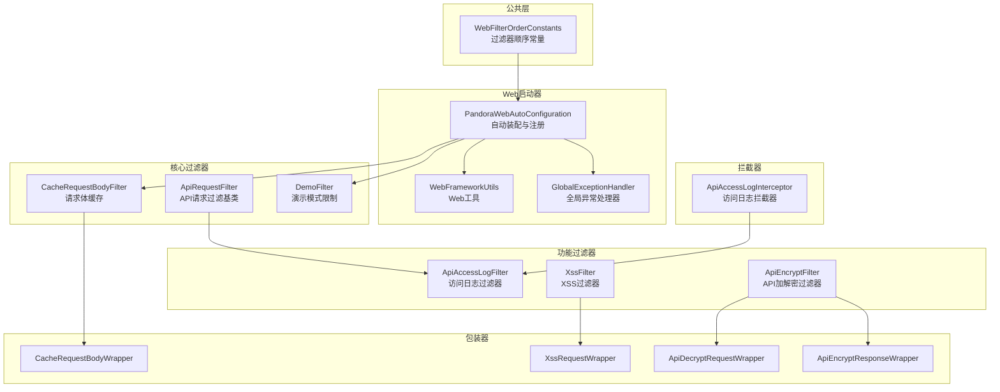
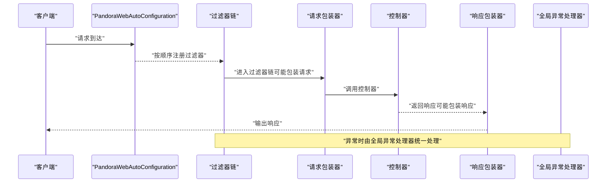
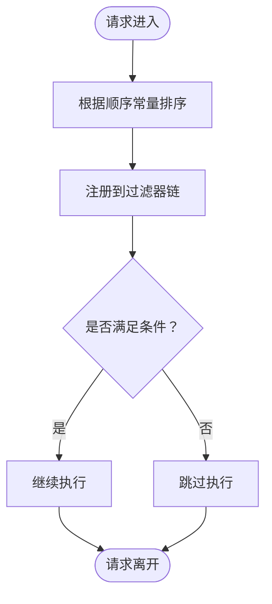
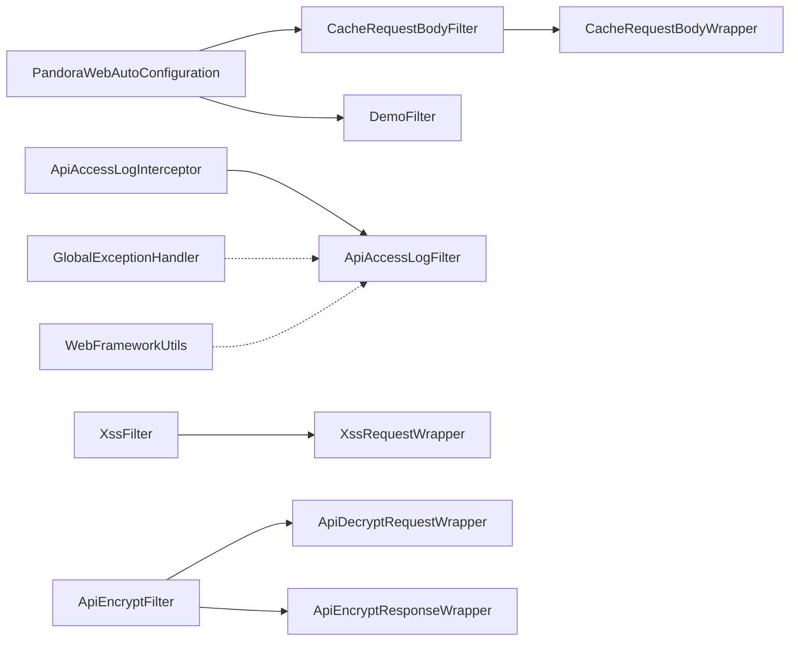

# 过滤器和拦截器扩展

<cite>
**本文引用的文件**
- [WebFilterOrderConstants.java](file://pandora-framework/pandora-common/src/main/java/net/ittimeline/pandora/framework/common/constants/WebFilterOrderConstants.java)
- [PandoraWebAutoConfiguration.java](file://pandora-framework/pandora-spring-boot-starter-web/src/main/java/net/ittimeline/pandora/framework/web/config/PandoraWebAutoConfiguration.java)
- [ApiRequestFilter.java](file://pandora-framework/pandora-spring-boot-starter-web/src/main/java/net/ittimeline/pandora/framework/web/core/filter/ApiRequestFilter.java)
- [DemoFilter.java](file://pandora-framework/pandora-spring-boot-starter-web/src/main/java/net/ittimeline/pandora/framework/web/core/filter/DemoFilter.java)
- [CacheRequestBodyFilter.java](file://pandora-framework/pandora-spring-boot-starter-web/src/main/java/net/ittimeline/pandora/framework/web/core/filter/CacheRequestBodyFilter.java)
- [CacheRequestBodyWrapper.java](file://pandora-framework/pandora-spring-boot-starter-web/src/main/java/net/ittimeline/pandora/framework/web/core/filter/CacheRequestBodyWrapper.java)
- [ApiAccessLogFilter.java](file://pandora-framework/pandora-spring-boot-starter-web/src/main/java/net/ittimeline/pandora/framework/apilog/core/filter/ApiAccessLogFilter.java)
- [ApiAccessLogInterceptor.java](file://pandora-framework/pandora-spring-boot-starter-web/src/main/java/net/ittimeline/pandora/framework/apilog/core/interceptor/ApiAccessLogInterceptor.java)
- [XssFilter.java](file://pandora-framework/pandora-spring-boot-starter-web/src/main/java/net/ittimeline/pandora/framework/xss/core/filter/XssFilter.java)
- [XssRequestWrapper.java](file://pandora-framework/pandora-spring-boot-starter-web/src/main/java/net/ittimeline/pandora/framework/xss/core/filter/XssRequestWrapper.java)
- [ApiEncryptFilter.java](file://pandora-framework/pandora-spring-boot-starter-web/src/main/java/net/ittimeline/pandora/framework/encrypt/core/filter/ApiEncryptFilter.java)
- [ApiDecryptRequestWrapper.java](file://pandora-framework/pandora-spring-boot-starter-web/src/main/java/net/ittimeline/pandora/framework/encrypt/core/filter/ApiDecryptRequestWrapper.java)
- [ApiEncryptResponseWrapper.java](file://pandora-framework/pandora-spring-boot-starter-web/src/main/java/net/ittimeline/pandora/framework/encrypt/core/filter/ApiEncryptResponseWrapper.java)
- [GlobalExceptionHandler.java](file://pandora-framework/pandora-spring-boot-starter-web/src/main/java/net/ittimeline/pandora/framework/web/core/handler/GlobalExceptionHandler.java)
- [WebFrameworkUtils.java](file://pandora-framework/pandora-spring-boot-starter-web/src/main/java/net/ittimeline/pandora/framework/web/core/util/WebFrameworkUtils.java)
</cite>

## 目录
1. [引言](#引言)
2. [项目结构](#项目结构)
3. [核心组件](#核心组件)
4. [架构总览](#架构总览)
5. [详细组件分析](#详细组件分析)
6. [依赖分析](#依赖分析)
7. [性能考虑](#性能考虑)
8. [故障排查指南](#故障排查指南)
9. [结论](#结论)
10. [附录](#附录)

## 引言
本指南面向需要在Pandora Cloud框架上扩展“过滤器”和“拦截器”的开发者，系统讲解Web过滤器链的执行顺序与控制、如何扩展现有过滤器能力（请求预处理、响应后处理、异常拦截）、过滤器注册与优先级、条件启用策略，以及拦截器的实现方式与HandlerInterceptor接口使用。文档同时提供可落地的扩展示例（自定义认证过滤器、请求参数验证过滤器、响应压缩拦截器），并解释过滤器与拦截器的区别及适用场景。

## 项目结构
围绕Web过滤器与拦截器的关键模块分布如下：
- 公共常量：定义过滤器执行顺序的优先级常量
- 自动装配：负责注册各类Filter与拦截器Bean，统一管理执行顺序与条件启用
- 核心过滤器：请求体缓存、演示模式限制、API请求过滤基类
- 功能过滤器：访问日志过滤器、XSS过滤器、API加解密过滤器
- 拦截器：API访问日志拦截器（开发环境打印请求/响应）
- 工具与异常：Web工具类、全局异常处理器

图表来源
- [WebFilterOrderConstants.java:11-37](file://pandora-framework/pandora-common/src/main/java/net/ittimeline/pandora/framework/common/constants/WebFilterOrderConstants.java#L11-L37)
- [PandoraWebAutoConfiguration.java:116-152](file://pandora-framework/pandora-spring-boot-starter-web/src/main/java/net/ittimeline/pandora/framework/web/config/PandoraWebAutoConfiguration.java#L116-L152)
- [ApiRequestFilter.java:15-27](file://pandora-framework/pandora-spring-boot-starter-web/src/main/java/net/ittimeline/pandora/framework/web/core/filter/ApiRequestFilter.java#L15-L27)
- [CacheRequestBodyFilter.java:20-49](file://pandora-framework/pandora-spring-boot-starter-web/src/main/java/net/ittimeline/pandora/framework/web/core/filter/CacheRequestBodyFilter.java#L20-L49)
- [DemoFilter.java:21-37](file://pandora-framework/pandora-spring-boot-starter-web/src/main/java/net/ittimeline/pandora/framework/web/core/filter/DemoFilter.java#L21-L37)
- [ApiAccessLogFilter.java:52-86](file://pandora-framework/pandora-spring-boot-starter-web/src/main/java/net/ittimeline/pandora/framework/apilog/core/filter/ApiAccessLogFilter.java#L52-L86)
- [XssFilter.java:22-55](file://pandora-framework/pandora-spring-boot-starter-web/src/main/java/net/ittimeline/pandora/framework/xss/core/filter/XssFilter.java#L22-L55)
- [ApiEncryptFilter.java:40-121](file://pandora-framework/pandora-spring-boot-starter-web/src/main/java/net/ittimeline/pandora/framework/encrypt/core/filter/ApiEncryptFilter.java#L40-L121)
- [ApiAccessLogInterceptor.java:32-75](file://pandora-framework/pandora-spring-boot-starter-web/src/main/java/net/ittimeline/pandora/framework/apilog/core/interceptor/ApiAccessLogInterceptor.java#L32-L75)

章节来源
- [WebFilterOrderConstants.java:11-37](file://pandora-framework/pandora-common/src/main/java/net/ittimeline/pandora/framework/common/constants/WebFilterOrderConstants.java#L11-L37)
- [PandoraWebAutoConfiguration.java:116-152](file://pandora-framework/pandora-spring-boot-starter-web/src/main/java/net/ittimeline/pandora/framework/web/config/PandoraWebAutoConfiguration.java#L116-L152)

## 核心组件
- 过滤器顺序常量：通过统一常量定义各过滤器的执行顺序，确保链路稳定可控
- 自动装配：集中注册过滤器与拦截器，设置优先级与条件启用
- 过滤器基类：抽象出API请求过滤的通用逻辑，便于按前缀过滤
- 核心过滤器：请求体缓存、演示模式限制
- 功能过滤器：访问日志、XSS防护、API加解密
- 拦截器：开发环境打印请求/响应日志，统计耗时
- 包装器：对请求/响应进行包装以实现可重复读取或清洗

章节来源
- [WebFilterOrderConstants.java:11-37](file://pandora-framework/pandora-common/src/main/java/net/ittimeline/pandora/framework/common/constants/WebFilterOrderConstants.java#L11-L37)
- [PandoraWebAutoConfiguration.java:116-152](file://pandora-framework/pandora-spring-boot-starter-web/src/main/java/net/ittimeline/pandora/framework/web/config/PandoraWebAutoConfiguration.java#L116-L152)
- [ApiRequestFilter.java:15-27](file://pandora-framework/pandora-spring-boot-starter-web/src/main/java/net/ittimeline/pandora/framework/web/core/filter/ApiRequestFilter.java#L15-L27)
- [CacheRequestBodyFilter.java:20-49](file://pandora-framework/pandora-spring-boot-starter-web/src/main/java/net/ittimeline/pandora/framework/web/core/filter/CacheRequestBodyFilter.java#L20-L49)
- [DemoFilter.java:21-37](file://pandora-framework/pandora-spring-boot-starter-web/src/main/java/net/ittimeline/pandora/framework/web/core/filter/DemoFilter.java#L21-L37)
- [ApiAccessLogFilter.java:52-86](file://pandora-framework/pandora-spring-boot-starter-web/src/main/java/net/ittimeline/pandora/framework/apilog/core/filter/ApiAccessLogFilter.java#L52-L86)
- [XssFilter.java:22-55](file://pandora-framework/pandora-spring-boot-starter-web/src/main/java/net/ittimeline/pandora/framework/xss/core/filter/XssFilter.java#L22-L55)
- [ApiEncryptFilter.java:40-121](file://pandora-framework/pandora-spring-boot-starter-web/src/main/java/net/ittimeline/pandora/framework/encrypt/core/filter/ApiEncryptFilter.java#L40-L121)
- [ApiAccessLogInterceptor.java:32-75](file://pandora-framework/pandora-spring-boot-starter-web/src/main/java/net/ittimeline/pandora/framework/apilog/core/interceptor/ApiAccessLogInterceptor.java#L32-L75)

## 架构总览
下图展示了过滤器链与拦截器在请求生命周期中的交互关系，以及与工具类、异常处理器的协作：

图表来源
- [PandoraWebAutoConfiguration.java:116-152](file://pandora-framework/pandora-spring-boot-starter-web/src/main/java/net/ittimeline/pandora/framework/web/config/PandoraWebAutoConfiguration.java#L116-L152)
- [CacheRequestBodyWrapper.java](file://pandora-framework/pandora-spring-boot-starter-web/src/main/java/net/ittimeline/pandora/framework/web/core/filter/CacheRequestBodyWrapper.java)
- [XssRequestWrapper.java](file://pandora-framework/pandora-spring-boot-starter-web/src/main/java/net/ittimeline/pandora/framework/xss/core/filter/XssRequestWrapper.java)
- [ApiDecryptRequestWrapper.java](file://pandora-framework/pandora-spring-boot-starter-web/src/main/java/net/ittimeline/pandora/framework/encrypt/core/filter/ApiDecryptRequestWrapper.java)
- [ApiEncryptResponseWrapper.java](file://pandora-framework/pandora-spring-boot-starter-web/src/main/java/net/ittimeline/pandora/framework/encrypt/core/filter/ApiEncryptResponseWrapper.java)
- [GlobalExceptionHandler.java](file://pandora-framework/pandora-spring-boot-starter-web/src/main/java/net/ittimeline/pandora/framework/web/core/handler/GlobalExceptionHandler.java)

## 详细组件分析

### 过滤器链执行顺序与控制
- 顺序常量：通过统一的常量类定义各过滤器的执行顺序，避免硬编码导致的顺序混乱
- 注册机制：自动装配中使用FilterRegistrationBean注册过滤器，并通过setOrder设置优先级
- 条件启用：基于配置属性进行条件注册，如演示模式开关
- 顺序建议：跨域过滤器需最先执行；请求体缓存需在XSS之前；业务日志需在安全之后；演示过滤器放在最后

图表来源
- [WebFilterOrderConstants.java:11-37](file://pandora-framework/pandora-common/src/main/java/net/ittimeline/pandora/framework/common/constants/WebFilterOrderConstants.java#L11-L37)
- [PandoraWebAutoConfiguration.java:116-152](file://pandora-framework/pandora-spring-boot-starter-web/src/main/java/net/ittimeline/pandora/framework/web/config/PandoraWebAutoConfiguration.java#L116-L152)

章节来源
- [WebFilterOrderConstants.java:11-37](file://pandora-framework/pandora-common/src/main/java/net/ittimeline/pandora/framework/common/constants/WebFilterOrderConstants.java#L11-L37)
- [PandoraWebAutoConfiguration.java:116-152](file://pandora-framework/pandora-spring-boot-starter-web/src/main/java/net/ittimeline/pandora/framework/web/config/PandoraWebAutoConfiguration.java#L116-L152)

### 过滤器注册机制、优先级与条件启用
- 注册Bean：通过@Bean方法创建FilterRegistrationBean，传入具体过滤器实例与顺序常量
- 优先级设置：使用setOrder设置整型顺序值，数值越小优先级越高
- 条件启用：使用@ConditionalOnProperty按配置项动态启用/禁用过滤器
- 典型注册点：跨域过滤器、请求体缓存过滤器、演示过滤器

章节来源
- [PandoraWebAutoConfiguration.java:116-152](file://pandora-framework/pandora-spring-boot-starter-web/src/main/java/net/ittimeline/pandora/framework/web/config/PandoraWebAutoConfiguration.java#L116-L152)

### 请求预处理、响应后处理与异常拦截
- 请求预处理：在过滤器doFilterInternal中对请求进行包装或参数解析，如请求体缓存、XSS清洗、请求解密
- 响应后处理：在过滤器链执行完成后对响应进行包装或加密，如响应加密
- 异常拦截：在过滤器内部捕获异常并交由全局异常处理器统一处理

章节来源
- [CacheRequestBodyFilter.java:30-47](file://pandora-framework/pandora-spring-boot-starter-web/src/main/java/net/ittimeline/pandora/framework/web/core/filter/CacheRequestBodyFilter.java#L30-L47)
- [XssFilter.java:36-53](file://pandora-framework/pandora-spring-boot-starter-web/src/main/java/net/ittimeline/pandora/framework/xss/core/filter/XssFilter.java#L36-L53)
- [ApiEncryptFilter.java:78-121](file://pandora-framework/pandora-spring-boot-starter-web/src/main/java/net/ittimeline/pandora/framework/encrypt/core/filter/ApiEncryptFilter.java#L78-L121)
- [GlobalExceptionHandler.java](file://pandora-framework/pandora-spring-boot-starter-web/src/main/java/net/ittimeline/pandora/framework/web/core/handler/GlobalExceptionHandler.java)

### 拦截器实现与HandlerInterceptor接口使用
- 拦截器职责：在控制器前后进行日志打印与耗时统计（开发环境）
- 关键方法：preHandle记录请求参数与开始计时；afterCompletion输出耗时
- 与过滤器配合：拦截器记录的HandlerMethod可通过请求属性传递给过滤器，用于日志标注

章节来源
- [ApiAccessLogInterceptor.java:32-75](file://pandora-framework/pandora-spring-boot-starter-web/src/main/java/net/ittimeline/pandora/framework/apilog/core/interceptor/ApiAccessLogInterceptor.java#L32-L75)

### 扩展点与最佳实践
- 自定义认证过滤器：参考ApiRequestFilter基类，结合WebProperties限定API前缀，实现鉴权逻辑
- 请求参数验证过滤器：在请求体缓存后读取参数，结合校验工具进行参数合法性检查
- 响应压缩拦截器：在拦截器中对响应流进行压缩包装（需注意与现有响应包装器的兼容性）

章节来源
- [ApiRequestFilter.java:15-27](file://pandora-framework/pandora-spring-boot-starter-web/src/main/java/net/ittimeline/pandora/framework/web/core/filter/ApiRequestFilter.java#L15-L27)
- [CacheRequestBodyFilter.java:30-47](file://pandora-framework/pandora-spring-boot-starter-web/src/main/java/net/ittimeline/pandora/framework/web/core/filter/CacheRequestBodyFilter.java#L30-L47)

### 过滤器与拦截器的区别与适用场景
- 过滤器：基于Servlet规范，作用于请求/响应的字节流层面，适合做输入输出的预处理与后处理
- 拦截器：基于Spring MVC，作用于控制器方法前后，适合做业务无关的日志与性能统计
- 选择建议：需要对原始请求/响应进行包装或加密解密时用过滤器；需要打印请求/响应参数与耗时统计时用拦截器

## 依赖分析
- 过滤器链依赖：过滤器之间通过FilterRegistrationBean注册并按顺序执行；部分过滤器依赖包装器实现可重复读取或清洗
- 拦截器依赖：拦截器依赖Spring MVC的HandlerInterceptor接口；与过滤器通过请求属性共享元数据
- 工具与异常：WebFrameworkUtils提供常用Web工具；GlobalExceptionHandler统一处理异常

图表来源
- [PandoraWebAutoConfiguration.java:116-152](file://pandora-framework/pandora-spring-boot-starter-web/src/main/java/net/ittimeline/pandora/framework/web/config/PandoraWebAutoConfiguration.java#L116-L152)
- [CacheRequestBodyFilter.java:30-47](file://pandora-framework/pandora-spring-boot-starter-web/src/main/java/net/ittimeline/pandora/framework/web/core/filter/CacheRequestBodyFilter.java#L30-L47)
- [DemoFilter.java:21-37](file://pandora-framework/pandora-spring-boot-starter-web/src/main/java/net/ittimeline/pandora/framework/web/core/filter/DemoFilter.java#L21-L37)
- [ApiAccessLogInterceptor.java:32-75](file://pandora-framework/pandora-spring-boot-starter-web/src/main/java/net/ittimeline/pandora/framework/apilog/core/interceptor/ApiAccessLogInterceptor.java#L32-L75)
- [ApiAccessLogFilter.java:52-86](file://pandora-framework/pandora-spring-boot-starter-web/src/main/java/net/ittimeline/pandora/framework/apilog/core/filter/ApiAccessLogFilter.java#L52-L86)
- [XssFilter.java:22-55](file://pandora-framework/pandora-spring-boot-starter-web/src/main/java/net/ittimeline/pandora/framework/xss/core/filter/XssFilter.java#L22-L55)
- [XssRequestWrapper.java:17-94](file://pandora-framework/pandora-spring-boot-starter-web/src/main/java/net/ittimeline/pandora/framework/xss/core/filter/XssRequestWrapper.java#L17-L94)
- [ApiEncryptFilter.java:40-121](file://pandora-framework/pandora-spring-boot-starter-web/src/main/java/net/ittimeline/pandora/framework/encrypt/core/filter/ApiEncryptFilter.java#L40-L121)
- [ApiDecryptRequestWrapper.java:25-89](file://pandora-framework/pandora-spring-boot-starter-web/src/main/java/net/ittimeline/pandora/framework/encrypt/core/filter/ApiDecryptRequestWrapper.java#L25-L89)
- [ApiEncryptResponseWrapper.java](file://pandora-framework/pandora-spring-boot-starter-web/src/main/java/net/ittimeline/pandora/framework/encrypt/core/filter/ApiEncryptResponseWrapper.java)
- [GlobalExceptionHandler.java](file://pandora-framework/pandora-spring-boot-starter-web/src/main/java/net/ittimeline/pandora/framework/web/core/handler/GlobalExceptionHandler.java)
- [WebFrameworkUtils.java](file://pandora-framework/pandora-spring-boot-starter-web/src/main/java/net/ittimeline/pandora/framework/web/core/util/WebFrameworkUtils.java)

## 性能考虑
- 请求体缓存：仅对JSON请求进行缓存，避免对静态资源或非JSON请求造成额外开销
- XSS清洗：按配置白名单/黑名单进行路径匹配，减少不必要的清洗成本
- 加解密：仅在开启相应开关或存在加密头时才进行包装与加解密，避免无效计算
- 日志记录：生产环境默认关闭详细日志，开发环境才打印请求/响应参数

章节来源
- [CacheRequestBodyFilter.java:36-46](file://pandora-framework/pandora-spring-boot-starter-web/src/main/java/net/ittimeline/pandora/framework/web/core/filter/CacheRequestBodyFilter.java#L36-L46)
- [XssFilter.java:42-52](file://pandora-framework/pandora-spring-boot-starter-web/src/main/java/net/ittimeline/pandora/framework/xss/core/filter/XssFilter.java#L42-L52)
- [ApiEncryptFilter.java:78-121](file://pandora-framework/pandora-spring-boot-starter-web/src/main/java/net/ittimeline/pandora/framework/encrypt/core/filter/ApiEncryptFilter.java#L78-L121)
- [ApiAccessLogInterceptor.java:46-75](file://pandora-framework/pandora-spring-boot-starter-web/src/main/java/net/ittimeline/pandora/framework/apilog/core/interceptor/ApiAccessLogInterceptor.java#L46-L75)

## 故障排查指南
- 跨域配置不生效：确保跨域过滤器顺序在最前
- 请求体为空：确认请求体缓存过滤器是否对目标URL生效，以及是否为JSON请求
- XSS未生效：检查XSS开关与排除URL配置
- 加解密异常：核对加密算法与密钥配置，查看全局异常处理器返回的错误信息
- 日志缺失：确认开发环境开关与注解配置，检查过滤器链是否被提前终止

章节来源
- [PandoraWebAutoConfiguration.java:116-152](file://pandora-framework/pandora-spring-boot-starter-web/src/main/java/net/ittimeline/pandora/framework/web/config/PandoraWebAutoConfiguration.java#L116-L152)
- [CacheRequestBodyFilter.java:36-46](file://pandora-framework/pandora-spring-boot-starter-web/src/main/java/net/ittimeline/pandora/framework/web/core/filter/CacheRequestBodyFilter.java#L36-L46)
- [XssFilter.java:42-52](file://pandora-framework/pandora-spring-boot-starter-web/src/main/java/net/ittimeline/pandora/framework/xss/core/filter/XssFilter.java#L42-L52)
- [ApiEncryptFilter.java:78-121](file://pandora-framework/pandora-spring-boot-starter-web/src/main/java/net/ittimeline/pandora/framework/encrypt/core/filter/ApiEncryptFilter.java#L78-L121)
- [GlobalExceptionHandler.java](file://pandora-framework/pandora-spring-boot-starter-web/src/main/java/net/ittimeline/pandora/framework/web/core/handler/GlobalExceptionHandler.java)

## 结论
通过统一的顺序常量、自动装配注册与条件启用机制，Pandora Cloud为过滤器与拦截器提供了清晰、可扩展的执行链路。开发者可在不破坏既有链路的前提下，基于现有基类与包装器实现自定义过滤器与拦截器，覆盖认证、参数校验、响应压缩等常见需求，并结合工具类与异常处理器实现一致性的日志与错误处理体验。

## 附录
- 扩展示例清单
  - 自定义认证过滤器：继承ApiRequestFilter，结合WebProperties限定API前缀，实现鉴权逻辑
  - 请求参数验证过滤器：在请求体缓存后读取参数，结合校验工具进行参数合法性检查
  - 响应压缩拦截器：在拦截器中对响应流进行压缩包装（需注意与现有响应包装器的兼容性）
- 安全注意事项
  - 严格控制过滤器顺序，确保安全相关过滤器位于链路靠前位置
  - 对敏感字段进行脱敏处理，避免日志泄露
  - 在生产环境谨慎开启详细日志与调试开关