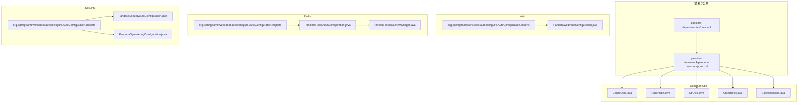
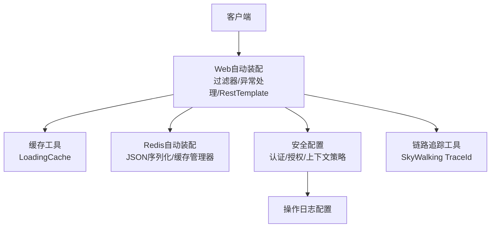
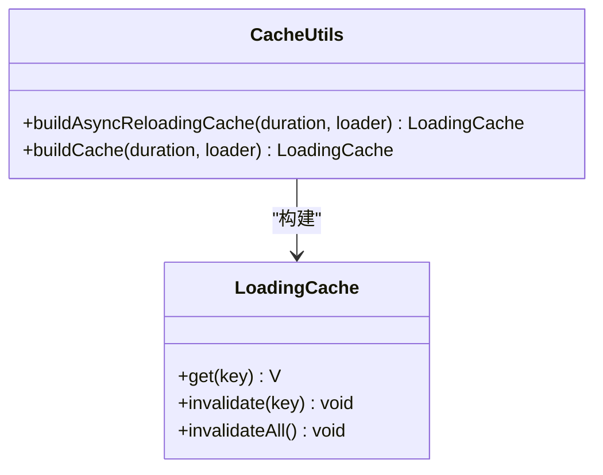
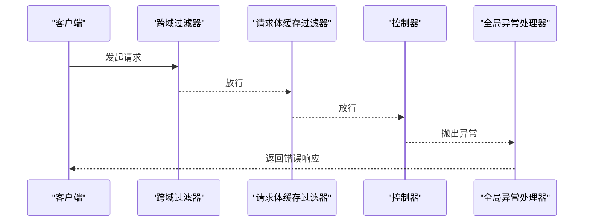
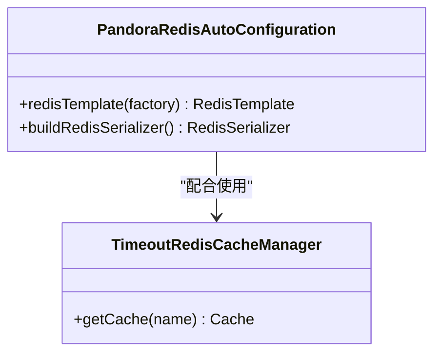
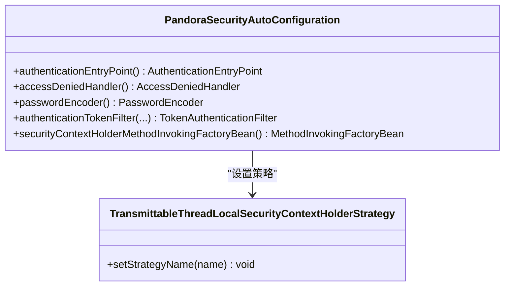
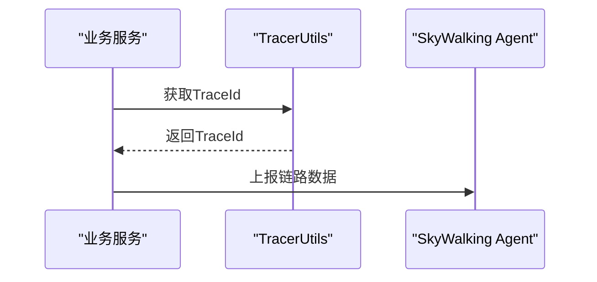
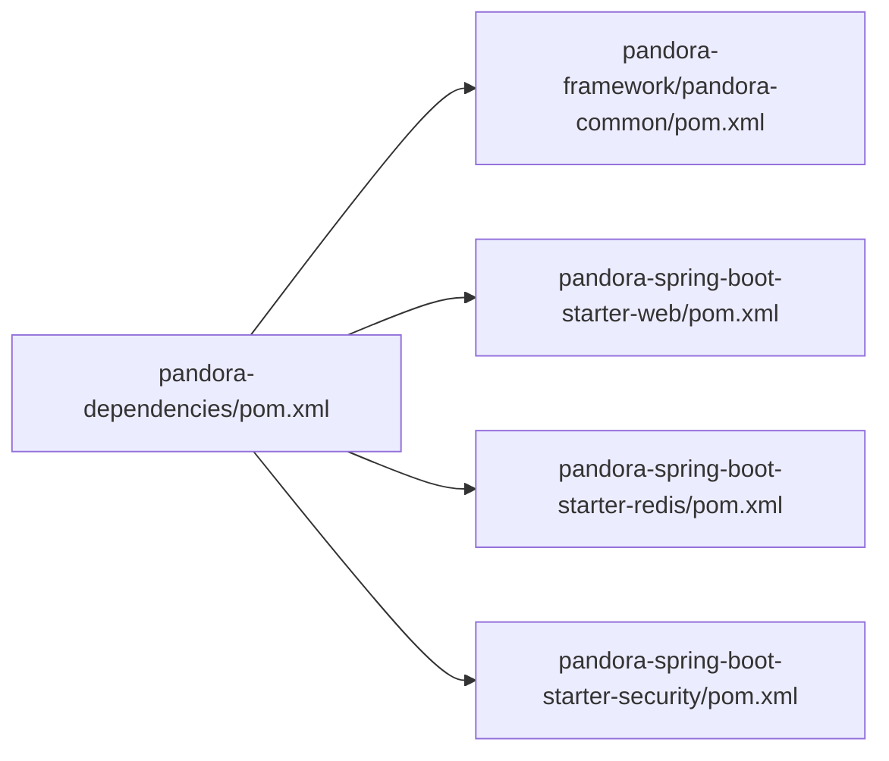

# 内存性能问题

<cite>
**本文引用的文件**
- [README.md](file://README.md)
- [pandora-dependencies/pom.xml](file://pandora-dependencies/pom.xml)
- [pandora-framework/pandora-common/pom.xml](file://pandora-framework/pandora-common/pom.xml)
- [pandora-framework/pandora-common/src/main/java/net/ittimeline/pandora/framework/common/util/web/cache/CacheUtils.java](file://pandora-framework/pandora-common/src/main/java/net/ittimeline/pandora/framework/common/util/web/cache/CacheUtils.java)
- [pandora-framework/pandora-common/src/main/java/net/ittimeline/pandora/framework/common/util/web/monitor/TracerUtils.java](file://pandora-framework/pandora-common/src/main/java/net/ittimeline/pandora/framework/common/util/web/monitor/TracerUtils.java)
- [pandora-framework/pandora-common/src/main/java/net/ittimeline/pandora/framework/common/util/foundational/string/StrUtils.java](file://pandora-framework/pandora-common/src/main/java/net/ittimeline/pandora/framework/common/util/foundational/string/StrUtils.java)
- [pandora-framework/pandora-common/src/main/java/net/ittimeline/pandora/framework/common/util/foundational/object/ObjectUtils.java](file://pandora-framework/pandora-common/src/main/java/net/ittimeline/pandora/framework/common/util/foundational/object/ObjectUtils.java)
- [pandora-framework/pandora-common/src/main/java/net/ittimeline/pandora/framework/common/util/foundational/collection/CollectionUtils.java](file://pandora-framework/pandora-common/src/main/java/net/ittimeline/pandora/framework/common/util/foundational/collection/CollectionUtils.java)
- [pandora-framework/pandora-spring-boot-starter-web/src/main/resources/META-INF/spring/org.springframework.boot.autoconfigure.AutoConfiguration.imports](file://pandora-framework/pandora-spring-boot-starter-web/src/main/resources/META-INF/spring/org.springframework.boot.autoconfigure.AutoConfiguration.imports)
- [pandora-framework/pandora-spring-boot-starter-web/src/main/java/net/ittimeline/pandora/framework/web/config/PandoraWebAutoConfiguration.java](file://pandora-framework/pandora-spring-boot-starter-web/src/main/java/net/ittimeline/pandora/framework/web/config/PandoraWebAutoConfiguration.java)
- [pandora-framework/pandora-spring-boot-starter-redis/src/main/resources/META-INF/spring/org.springframework.boot.autoconfigure.AutoConfiguration.imports](file://pandora-framework/pandora-spring-boot-starter-redis/src/main/resources/META-INF/spring/org.springframework.boot.autoconfigure.AutoConfiguration.imports)
- [pandora-framework/pandora-spring-boot-starter-redis/src/main/java/net/ittimeline/pandora/framework/redis/config/PandoraRedisAutoConfiguration.java](file://pandora-framework/pandora-spring-boot-starter-redis/src/main/java/net/ittimeline/pandora/framework/redis/config/PandoraRedisAutoConfiguration.java)
- [pandora-framework/pandora-spring-boot-starter-redis/src/main/java/net/ittimeline/pandora/framework/redis/core/TimeoutRedisCacheManager.java](file://pandora-framework/pandora-spring-boot-starter-redis/src/main/java/net/ittimeline/pandora/framework/redis/core/TimeoutRedisCacheManager.java)
- [pandora-framework/pandora-spring-boot-starter-security/src/main/resources/META-INF/spring/org.springframework.boot.autoconfigure.AutoConfiguration.imports](file://pandora-framework/pandora-spring-boot-starter-security/src/main/resources/META-INF/spring/org.springframework.boot.autoconfigure.AutoConfiguration.imports)
- [pandora-framework/pandora-spring-boot-starter-security/src/main/java/net/ittimeline/pandora/framework/security/config/PandoraSecurityAutoConfiguration.java](file://pandora-framework/pandora-spring-boot-starter-security/src/main/java/net/ittimeline/pandora/framework/security/config/PandoraSecurityAutoConfiguration.java)
- [pandora-framework/pandora-spring-boot-starter-security/src/main/java/net/ittimeline/pandora/framework/operatelog/config/PandoraOperateLogConfiguration.java](file://pandora-framework/pandora-spring-boot-starter-security/src/main/java/net/ittimeline/pandora/framework/operatelog/config/PandoraOperateLogConfiguration.java)
</cite>

## 目录
1. [简介](#简介)
2. [项目结构](#项目结构)
3. [核心组件](#核心组件)
4. [架构总览](#架构总览)
5. [详细组件分析](#详细组件分析)
6. [依赖分析](#依赖分析)
7. [性能考虑](#性能考虑)
8. [故障排除指南](#故障排除指南)
9. [结论](#结论)
10. [附录](#附录)

## 简介
本指南聚焦于Pandora Cloud框架在Spring Boot环境中的内存性能问题与优化实践，围绕以下目标展开：
- 内存泄漏常见原因与检测：对象生命周期管理、循环引用规避、静态资源清理
- JVM内存模型在Spring Boot中的表现：堆内存、栈内存、元空间的使用特点
- 内存使用优化策略：对象复用、字符串常量池利用、大对象处理
- 内存监控工具使用、垃圾回收调优与内存性能基准测试方法

本指南结合仓库中已实现的通用工具、自动装配模块与监控集成，给出可落地的排查步骤与优化建议。

## 项目结构
Pandora Cloud采用多模块组织，核心与Web、安全、缓存等能力通过Spring Boot自动装配机制注入。关键模块与职责概览如下：
- pandora-dependencies：统一版本与依赖管理
- pandora-framework/pandora-common：通用工具与监控集成（含链路追踪、缓存工具）
- pandora-spring-boot-starter-web：Web层自动装配（过滤器、异常处理、响应包装、RestTemplate等）
- pandora-spring-boot-starter-redis：Redis自动装配（JSON序列化、缓存管理器）
- pandora-spring-boot-starter-security：安全与操作日志自动装配

图表来源
- [pandora-dependencies/pom.xml](file://pandora-dependencies/pom.xml)
- [pandora-framework/pandora-common/pom.xml](file://pandora-framework/pandora-common/pom.xml)
- [pandora-framework/pandora-common/src/main/java/net/ittimeline/pandora/framework/common/util/web/cache/CacheUtils.java](file://pandora-framework/pandora-common/src/main/java/net/ittimeline/pandora/framework/common/util/web/cache/CacheUtils.java)
- [pandora-framework/pandora-common/src/main/java/net/ittimeline/pandora/framework/common/util/web/monitor/TracerUtils.java](file://pandora-framework/pandora-common/src/main/java/net/ittimeline/pandora/framework/common/util/web/monitor/TracerUtils.java)
- [pandora-framework/pandora-common/src/main/java/net/ittimeline/pandora/framework/common/util/foundational/string/StrUtils.java](file://pandora-framework/pandora-common/src/main/java/net/ittimeline/pandora/framework/common/util/foundational/string/StrUtils.java)
- [pandora-framework/pandora-common/src/main/java/net/ittimeline/pandora/framework/common/util/foundational/object/ObjectUtils.java](file://pandora-framework/pandora-common/src/main/java/net/ittimeline/pandora/framework/common/util/foundational/object/ObjectUtils.java)
- [pandora-framework/pandora-common/src/main/java/net/ittimeline/pandora/framework/common/util/foundational/collection/CollectionUtils.java](file://pandora-framework/pandora-common/src/main/java/net/ittimeline/pandora/framework/common/util/foundational/collection/CollectionUtils.java)
- [pandora-framework/pandora-spring-boot-starter-web/src/main/resources/META-INF/spring/org.springframework.boot.autoconfigure.AutoConfiguration.imports](file://pandora-framework/pandora-spring-boot-starter-web/src/main/resources/META-INF/spring/org.springframework.boot.autoconfigure.AutoConfiguration.imports)
- [pandora-framework/pandora-spring-boot-starter-web/src/main/java/net/ittimeline/pandora/framework/web/config/PandoraWebAutoConfiguration.java](file://pandora-framework/pandora-spring-boot-starter-web/src/main/java/net/ittimeline/pandora/framework/web/config/PandoraWebAutoConfiguration.java)
- [pandora-framework/pandora-spring-boot-starter-redis/src/main/resources/META-INF/spring/org.springframework.boot.autoconfigure.AutoConfiguration.imports](file://pandora-framework/pandora-spring-boot-starter-redis/src/main/resources/META-INF/spring/org.springframework.boot.autoconfigure.AutoConfiguration.imports)
- [pandora-framework/pandora-spring-boot-starter-redis/src/main/java/net/ittimeline/pandora/framework/redis/config/PandoraRedisAutoConfiguration.java](file://pandora-framework/pandora-spring-boot-starter-redis/src/main/java/net/ittimeline/pandora/framework/redis/config/PandoraRedisAutoConfiguration.java)
- [pandora-framework/pandora-spring-boot-starter-redis/src/main/java/net/ittimeline/pandora/framework/redis/core/TimeoutRedisCacheManager.java](file://pandora-framework/pandora-spring-boot-starter-redis/src/main/java/net/ittimeline/pandora/framework/redis/core/TimeoutRedisCacheManager.java)
- [pandora-framework/pandora-spring-boot-starter-security/src/main/resources/META-INF/spring/org.springframework.boot.autoconfigure.AutoConfiguration.imports](file://pandora-framework/pandora-spring-boot-starter-security/src/main/resources/META-INF/spring/org.springframework.boot.autoconfigure.AutoConfiguration.imports)
- [pandora-framework/pandora-spring-boot-starter-security/src/main/java/net/ittimeline/pandora/framework/security/config/PandoraSecurityAutoConfiguration.java](file://pandora-framework/pandora-spring-boot-starter-security/src/main/java/net/ittimeline/pandora/framework/security/config/PandoraSecurityAutoConfiguration.java)
- [pandora-framework/pandora-spring-boot-starter-security/src/main/java/net/ittimeline/pandora/framework/operatelog/config/PandoraOperateLogConfiguration.java](file://pandora-framework/pandora-spring-boot-starter-security/src/main/java/net/ittimeline/pandora/framework/operatelog/config/PandoraOperateLogConfiguration.java)

章节来源
- [README.md](file://README.md)
- [pandora-dependencies/pom.xml](file://pandora-dependencies/pom.xml)
- [pandora-framework/pandora-common/pom.xml](file://pandora-framework/pandora-common/pom.xml)

## 核心组件
- 缓存工具与本地缓存：提供基于Guava的LoadingCache构建方法，支持同步/异步刷新与最大容量限制，便于控制内存占用与命中率。
- 链路追踪工具：基于SkyWalking的TraceId获取，便于定位高延迟或异常请求路径，辅助定位内存热点。
- 字符串与集合工具：提供字符串截断、前缀匹配、集合聚合等常用操作，减少不必要的临时对象创建。
- Web自动装配：注册全局异常处理器、跨域过滤器、请求体缓存过滤器、RestTemplate等，避免重复读取与异常传播导致的资源滞留。
- Redis自动装配：自定义JSON序列化与缓存管理器，支持过期策略与扫描批大小，降低网络与序列化开销。
- 安全与操作日志：提供认证入口点、权限不足处理器、密码编码器与操作日志记录器，确保上下文传递与日志开销可控。

章节来源
- [pandora-framework/pandora-common/src/main/java/net/ittimeline/pandora/framework/common/util/web/cache/CacheUtils.java](file://pandora-framework/pandora-common/src/main/java/net/ittimeline/pandora/framework/common/util/web/cache/CacheUtils.java)
- [pandora-framework/pandora-common/src/main/java/net/ittimeline/pandora/framework/common/util/web/monitor/TracerUtils.java](file://pandora-framework/pandora-common/src/main/java/net/ittimeline/pandora/framework/common/util/web/monitor/TracerUtils.java)
- [pandora-framework/pandora-common/src/main/java/net/ittimeline/pandora/framework/common/util/foundational/string/StrUtils.java](file://pandora-framework/pandora-common/src/main/java/net/ittimeline/pandora/framework/common/util/foundational/string/StrUtils.java)
- [pandora-framework/pandora-common/src/main/java/net/ittimeline/pandora/framework/common/util/foundational/collection/CollectionUtils.java](file://pandora-framework/pandora-common/src/main/java/net/ittimeline/pandora/framework/common/util/foundational/collection/CollectionUtils.java)
- [pandora-framework/pandora-spring-boot-starter-web/src/main/java/net/ittimeline/pandora/framework/web/config/PandoraWebAutoConfiguration.java](file://pandora-framework/pandora-spring-boot-starter-web/src/main/java/net/ittimeline/pandora/framework/web/config/PandoraWebAutoConfiguration.java)
- [pandora-framework/pandora-spring-boot-starter-redis/src/main/java/net/ittimeline/pandora/framework/redis/config/PandoraRedisAutoConfiguration.java](file://pandora-framework/pandora-spring-boot-starter-redis/src/main/java/net/ittimeline/pandora/framework/redis/config/PandoraRedisAutoConfiguration.java)
- [pandora-framework/pandora-spring-boot-starter-security/src/main/java/net/ittimeline/pandora/framework/security/config/PandoraSecurityAutoConfiguration.java](file://pandora-framework/pandora-spring-boot-starter-security/src/main/java/net/ittimeline/pandora/framework/security/config/PandoraSecurityAutoConfiguration.java)
- [pandora-framework/pandora-spring-boot-starter-security/src/main/java/net/ittimeline/pandora/framework/operatelog/config/PandoraOperateLogConfiguration.java](file://pandora-framework/pandora-spring-boot-starter-security/src/main/java/net/ittimeline/pandora/framework/operatelog/config/PandoraOperateLogConfiguration.java)

## 架构总览
下图展示与内存性能相关的关键组件交互：Web层负责请求过滤与异常处理；缓存工具与Redis配置负责数据缓存与序列化；安全配置负责上下文策略与日志记录；监控工具用于链路追踪与问题定位。

图表来源
- [pandora-framework/pandora-spring-boot-starter-web/src/main/java/net/ittimeline/pandora/framework/web/config/PandoraWebAutoConfiguration.java](file://pandora-framework/pandora-spring-boot-starter-web/src/main/java/net/ittimeline/pandora/framework/web/config/PandoraWebAutoConfiguration.java)
- [pandora-framework/pandora-common/src/main/java/net/ittimeline/pandora/framework/common/util/web/cache/CacheUtils.java](file://pandora-framework/pandora-common/src/main/java/net/ittimeline/pandora/framework/common/util/web/cache/CacheUtils.java)
- [pandora-framework/pandora-spring-boot-starter-redis/src/main/java/net/ittimeline/pandora/framework/redis/config/PandoraRedisAutoConfiguration.java](file://pandora-framework/pandora-spring-boot-starter-redis/src/main/java/net/ittimeline/pandora/framework/redis/config/PandoraRedisAutoConfiguration.java)
- [pandora-framework/pandora-spring-boot-starter-security/src/main/java/net/ittimeline/pandora/framework/security/config/PandoraSecurityAutoConfiguration.java](file://pandora-framework/pandora-spring-boot-starter-security/src/main/java/net/ittimeline/pandora/framework/security/config/PandoraSecurityAutoConfiguration.java)
- [pandora-framework/pandora-spring-boot-starter-security/src/main/java/net/ittimeline/pandora/framework/operatelog/config/PandoraOperateLogConfiguration.java](file://pandora-framework/pandora-spring-boot-starter-security/src/main/java/net/ittimeline/pandora/framework/operatelog/config/PandoraOperateLogConfiguration.java)
- [pandora-framework/pandora-common/src/main/java/net/ittimeline/pandora/framework/common/util/web/monitor/TracerUtils.java](file://pandora-framework/pandora-common/src/main/java/net/ittimeline/pandora/framework/common/util/web/monitor/TracerUtils.java)

## 详细组件分析

### 缓存工具与内存控制
- 设计要点
  - 通过最大容量限制与过期刷新策略控制堆内存增长
  - 同步/异步刷新兼顾一致性与吞吐
  - 与线程上下文传递场景的注意事项提示
- 内存风险与对策
  - 避免无界缓存：通过maximumSize限制条目数
  - 控制刷新频率：合理设置refreshAfterWrite，避免频繁重建
  - 异步刷新：在高并发场景下减少主线程阻塞
- 适用场景
  - 全局配置、字典、规则等只增不减的数据
  - 不适合与ThreadLocal强绑定的用户态数据

图表来源
- [pandora-framework/pandora-common/src/main/java/net/ittimeline/pandora/framework/common/util/web/cache/CacheUtils.java](file://pandora-framework/pandora-common/src/main/java/net/ittimeline/pandora/framework/common/util/web/cache/CacheUtils.java)

章节来源
- [pandora-framework/pandora-common/src/main/java/net/ittimeline/pandora/framework/common/util/web/cache/CacheUtils.java](file://pandora-framework/pandora-common/src/main/java/net/ittimeline/pandora/framework/common/util/web/cache/CacheUtils.java)

### Web自动装配与内存
- 设计要点
  - 注册全局异常处理器，避免异常链路中对象滞留
  - 跨域过滤器与请求体缓存过滤器，减少重复读取与中间对象
  - RestTemplate按需装配，避免默认实例造成上下文污染
- 内存风险与对策
  - 避免在过滤器中持有大对象引用
  - 使用可重用的RestTemplate实例，减少GC压力
  - 全局异常处理器应避免捕获与保留大型异常树

图表来源
- [pandora-framework/pandora-spring-boot-starter-web/src/main/java/net/ittimeline/pandora/framework/web/config/PandoraWebAutoConfiguration.java](file://pandora-framework/pandora-spring-boot-starter-web/src/main/java/net/ittimeline/pandora/framework/web/config/PandoraWebAutoConfiguration.java)

章节来源
- [pandora-framework/pandora-spring-boot-starter-web/src/main/java/net/ittimeline/pandora/framework/web/config/PandoraWebAutoConfiguration.java](file://pandora-framework/pandora-spring-boot-starter-web/src/main/java/net/ittimeline/pandora/framework/web/config/PandoraWebAutoConfiguration.java)

### Redis自动装配与序列化
- 设计要点
  - 使用JSON序列化VALUE，保证类型安全与跨语言兼容
  - 注册JavaTimeModule，避免时间类型序列化异常
  - 自定义缓存管理器支持超时与扫描批大小
- 内存风险与对策
  - 避免存储超大对象，优先拆分或压缩
  - 合理设置TTL，防止无限增长
  - 批量扫描时注意内存峰值

图表来源
- [pandora-framework/pandora-spring-boot-starter-redis/src/main/java/net/ittimeline/pandora/framework/redis/config/PandoraRedisAutoConfiguration.java](file://pandora-framework/pandora-spring-boot-starter-redis/src/main/java/net/ittimeline/pandora/framework/redis/config/PandoraRedisAutoConfiguration.java)
- [pandora-framework/pandora-spring-boot-starter-redis/src/main/java/net/ittimeline/pandora/framework/redis/core/TimeoutRedisCacheManager.java](file://pandora-framework/pandora-spring-boot-starter-redis/src/main/java/net/ittimeline/pandora/framework/redis/core/TimeoutRedisCacheManager.java)

章节来源
- [pandora-framework/pandora-spring-boot-starter-redis/src/main/java/net/ittimeline/pandora/framework/redis/config/PandoraRedisAutoConfiguration.java](file://pandora-framework/pandora-spring-boot-starter-redis/src/main/java/net/ittimeline/pandora/framework/redis/config/PandoraRedisAutoConfiguration.java)
- [pandora-framework/pandora-spring-boot-starter-redis/src/main/java/net/ittimeline/pandora/framework/redis/core/TimeoutRedisCacheManager.java](file://pandora-framework/pandora-spring-boot-starter-redis/src/main/java/net/ittimeline/pandora/framework/redis/core/TimeoutRedisCacheManager.java)

### 安全配置与上下文策略
- 设计要点
  - 使用可传递的ThreadLocal策略，避免上下文丢失
  - 提供认证入口点与权限不足处理器，减少异常链路中的对象残留
- 内存风险与对策
  - 上下文清理：在请求结束时清理ThreadLocal
  - 日志记录器应避免记录敏感大对象

图表来源
- [pandora-framework/pandora-spring-boot-starter-security/src/main/java/net/ittimeline/pandora/framework/security/config/PandoraSecurityAutoConfiguration.java](file://pandora-framework/pandora-spring-boot-starter-security/src/main/java/net/ittimeline/pandora/framework/security/config/PandoraSecurityAutoConfiguration.java)

章节来源
- [pandora-framework/pandora-spring-boot-starter-security/src/main/java/net/ittimeline/pandora/framework/security/config/PandoraSecurityAutoConfiguration.java](file://pandora-framework/pandora-spring-boot-starter-security/src/main/java/net/ittimeline/pandora/framework/security/config/PandoraSecurityAutoConfiguration.java)

### 链路追踪与问题定位
- 设计要点
  - 通过TracerUtils获取TraceId，便于关联日志与指标
- 内存风险与对策
  - 避免在追踪上下文中携带大对象
  - 结合GC日志与JFR进行热点分析

图表来源
- [pandora-framework/pandora-common/src/main/java/net/ittimeline/pandora/framework/common/util/web/monitor/TracerUtils.java](file://pandora-framework/pandora-common/src/main/java/net/ittimeline/pandora/framework/common/util/web/monitor/TracerUtils.java)

章节来源
- [pandora-framework/pandora-common/src/main/java/net/ittimeline/pandora/framework/common/util/web/monitor/TracerUtils.java](file://pandora-framework/pandora-common/src/main/java/net/ittimeline/pandora/framework/common/util/web/monitor/TracerUtils.java)

## 依赖分析
- 依赖管理
  - 通过pandora-dependencies集中管理版本，确保各模块依赖一致
- 监控与运维
  - 引入SkyWalking追踪工具，便于定位内存热点与慢请求
  - Spring Boot Admin客户端/服务端依赖，便于集中监控

图表来源
- [pandora-dependencies/pom.xml](file://pandora-dependencies/pom.xml)
- [pandora-framework/pandora-common/pom.xml](file://pandora-framework/pandora-common/pom.xml)

章节来源
- [pandora-dependencies/pom.xml](file://pandora-dependencies/pom.xml)
- [pandora-framework/pandora-common/pom.xml](file://pandora-framework/pandora-common/pom.xml)

## 性能考虑
- 对象复用
  - 使用缓存工具的LoadingCache复用热点对象，避免频繁创建
  - 在Web层复用RestTemplate实例，减少GC压力
- 字符串常量池利用
  - 使用字符串工具进行前缀匹配与截断，减少临时字符串拼接
- 大对象处理
  - Redis序列化采用JSON，避免大对象序列化开销；必要时拆分字段或压缩
  - Web层避免在过滤器中持有大对象引用
- GC与内存模型
  - 堆内存：通过缓存容量与刷新策略控制
  - 栈内存：避免深层递归与大局部变量
  - 元空间：避免动态生成类过多，关注类加载器泄漏

## 故障排除指南

### 一、内存泄漏常见原因与检测
- 对象生命周期管理
  - 检查是否在单例Bean中持有请求级或会话级对象引用
  - 确认过滤器与拦截器在请求结束后释放资源
- 循环引用避免
  - 避免容器内Bean相互持有导致的强引用链
  - 使用弱引用或软引用处理缓存键或监听器
- 静态资源清理
  - 清理静态缓存与定时任务线程池
  - 关闭未使用的连接与线程池

### 二、JVM内存模型在Spring Boot中的表现
- 堆内存
  - 通过缓存工具与Redis配置控制对象存活时间
- 栈内存
  - 减少深度递归与大对象局部变量
- 元空间
  - 避免动态代理与ASM生成类过多

### 三、内存使用优化策略
- 对象复用
  - 使用缓存工具的同步/异步刷新策略
  - 复用RestTemplate与序列化器
- 字符串常量池利用
  - 使用字符串工具进行前缀匹配与截断
- 大对象处理
  - Redis序列化采用JSON并注册JavaTimeModule
  - 控制缓存条目大小与TTL

### 四、内存监控工具使用
- SkyWalking链路追踪
  - 通过TracerUtils获取TraceId，定位异常请求
- Spring Boot Admin
  - 集成客户端/服务端，集中查看应用内存与线程状态

章节来源
- [pandora-framework/pandora-common/src/main/java/net/ittimeline/pandora/framework/common/util/web/monitor/TracerUtils.java](file://pandora-framework/pandora-common/src/main/java/net/ittimeline/pandora/framework/common/util/web/monitor/TracerUtils.java)
- [pandora-dependencies/pom.xml](file://pandora-dependencies/pom.xml)

### 五、垃圾回收调优与内存性能基准测试
- GC调优
  - 观察Full GC频率与停顿时间，调整堆大小与新生代比例
  - 对于长尾请求，优先优化对象分配速率而非等待GC回收
- 基准测试
  - 使用JMH或Gatling对热点路径进行压测，观察堆内存增长趋势
  - 对比不同缓存策略（同步/异步刷新）对内存与吞吐的影响

## 结论
通过合理的缓存策略、Web层资源管理、Redis序列化与安全上下文策略，以及SkyWalking链路追踪与Spring Boot Admin监控，Pandora Cloud框架可在Spring Boot环境中有效控制内存占用并提升稳定性。建议在生产环境持续观测GC日志与指标，结合本指南的优化策略与基准测试方法，逐步完善内存性能治理。

## 附录
- 常用工具与配置参考
  - 缓存工具：LoadingCache构建与刷新策略
  - Web自动装配：过滤器、异常处理、RestTemplate
  - Redis自动装配：JSON序列化与缓存管理器
  - 安全配置：上下文策略与日志记录
  - 监控集成：SkyWalking与Spring Boot Admin