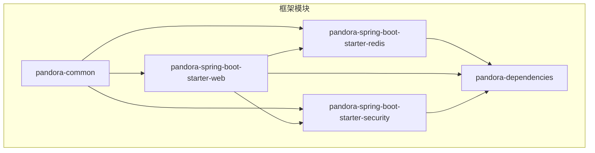
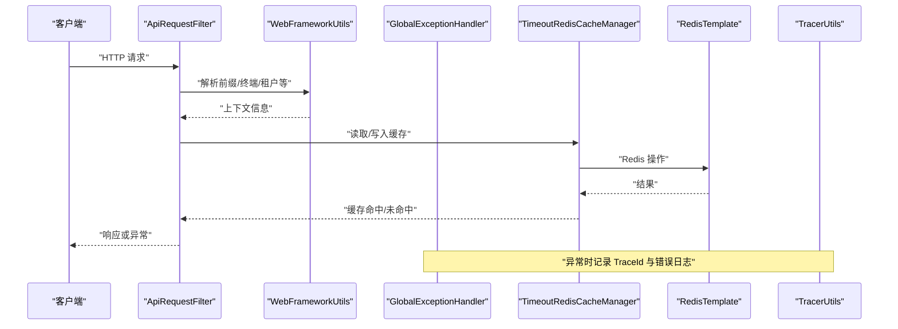
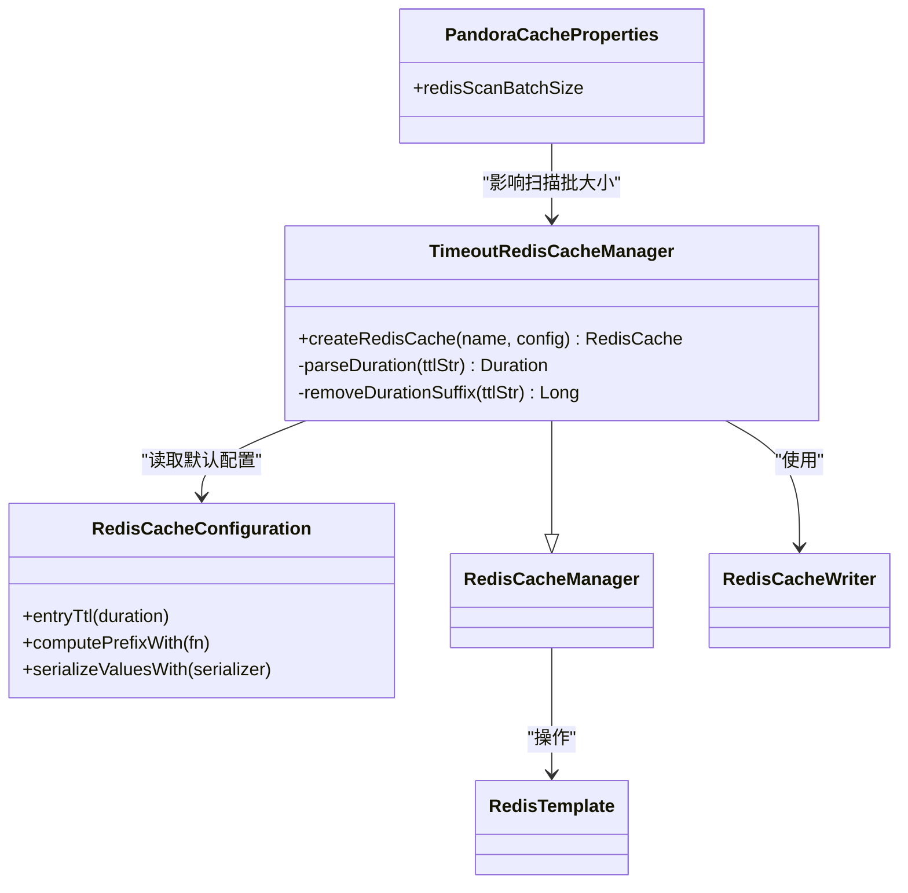
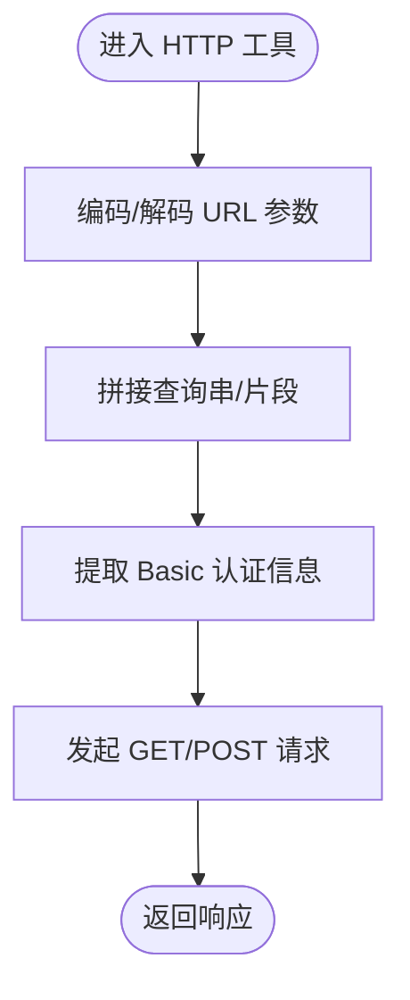
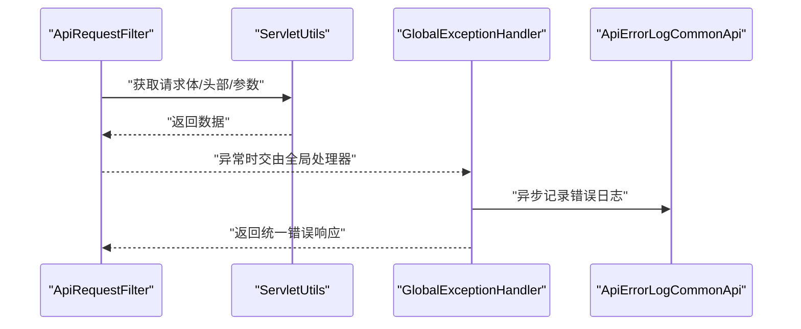
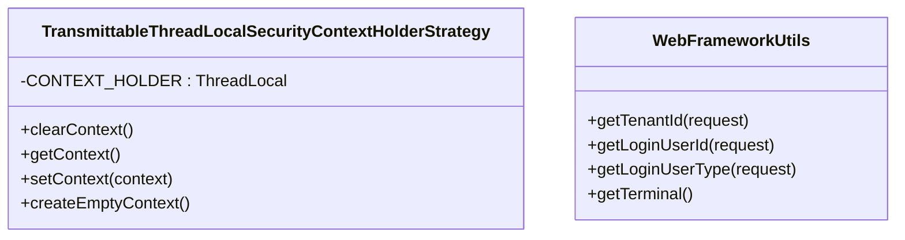
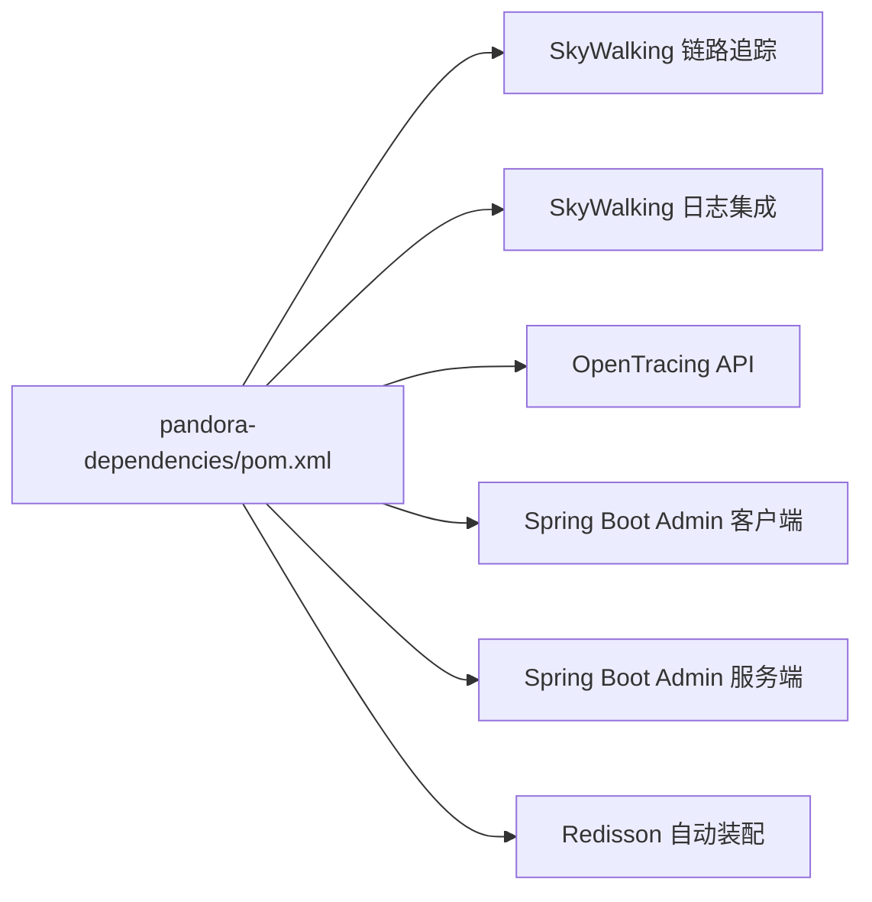

# 性能问题

<cite>
**本文引用的文件**
- [README.md](file://README.md)
- [CacheUtils.java](file://pandora-framework/pandora-common/src/main/java/net/ittimeline/pandora/framework/common/util/web/cache/CacheUtils.java)
- [PandoraCacheAutoConfiguration.java](file://pandora-framework/pandora-spring-boot-starter-redis/src/main/java/net/ittimeline/pandora/framework/redis/config/PandoraCacheAutoConfiguration.java)
- [PandoraRedisAutoConfiguration.java](file://pandora-framework/pandora-spring-boot-starter-redis/src/main/java/net/ittimeline/pandora/framework/redis/config/PandoraRedisAutoConfiguration.java)
- [PandoraCacheProperties.java](file://pandora-framework/pandora-spring-boot-starter-redis/src/main/java/net/ittimeline/pandora/framework/redis/config/PandoraCacheProperties.java)
- [TimeoutRedisCacheManager.java](file://pandora-framework/pandora-spring-boot-starter-redis/src/main/java/net/ittimeline/pandora/framework/redis/core/TimeoutRedisCacheManager.java)
- [HttpUtils.java](file://pandora-framework/pandora-common/src/main/java/net/ittimeline/pandora/framework/common/util/web/http/HttpUtils.java)
- [ServletUtils.java](file://pandora-framework/pandora-common/src/main/java/net/ittimeline/pandora/framework/common/util/web/servlet/ServletUtils.java)
- [WebProperties.java](file://pandora-framework/pandora-spring-boot-starter-web/src/main/java/net/ittimeline/pandora/framework/web/config/WebProperties.java)
- [ApiRequestFilter.java](file://pandora-framework/pandora-spring-boot-starter-web/src/main/java/net/ittimeline/pandora/framework/web/core/filter/ApiRequestFilter.java)
- [GlobalExceptionHandler.java](file://pandora-framework/pandora-spring-boot-starter-web/src/main/java/net/ittimeline/pandora/framework/web/core/handler/GlobalExceptionHandler.java)
- [WebFrameworkUtils.java](file://pandora-framework/pandora-spring-boot-starter-web/src/main/java/net/ittimeline/pandora/framework/web/core/util/WebFrameworkUtils.java)
- [TracerUtils.java](file://pandora-framework/pandora-common/src/main/java/net/ittimeline/pandora/framework/common/util/web/monitor/TracerUtils.java)
- [TransmittableThreadLocalSecurityContextHolderStrategy.java](file://pandora-framework/pandora-spring-boot-starter-security/src/main/java/net/ittimeline/pandora/framework/security/core/context/TransmittableThreadLocalSecurityContextHolderStrategy.java)
- [pom.xml](file://pandora-dependencies/pom.xml)
</cite>

## 目录
1. [简介](#简介)
2. [项目结构](#项目结构)
3. [核心组件](#核心组件)
4. [架构总览](#架构总览)
5. [详细组件分析](#详细组件分析)
6. [依赖分析](#依赖分析)
7. [性能考量](#性能考量)
8. [故障排除指南](#故障排除指南)
9. [结论](#结论)
10. [附录](#附录)

## 简介
本指南面向 Pandora Cloud 框架使用者，聚焦于性能问题的识别与优化。内容覆盖 CPU 使用率高、内存占用异常、网络延迟大等常见症状的诊断方法；针对 Redis 缓存、HTTP 请求处理、数据库访问等关键环节给出优化建议；同时涵盖并发问题排查、线程池与连接池配置要点、性能监控指标解读、基准测试方法与最佳实践，并提供具体问题案例与解决思路。

## 项目结构
Pandora Cloud 采用多模块组织，核心能力由以下模块构成：
- pandora-common：通用工具与基础能力（缓存、HTTP、Servlet、监控等）
- pandora-spring-boot-starter-web：Web 层能力（过滤器、异常处理、Web 配置等）
- pandora-spring-boot-starter-redis：Redis 缓存自动装配与配置
- pandora-spring-boot-starter-security：安全上下文与线程本地传递
- pandora-dependencies：依赖版本与监控集成（SkyWalking、Spring Boot Admin）

图表来源
- [README.md:1-15](file://README.md#L1-L15)

章节来源
- [README.md:1-15](file://README.md#L1-L15)

## 核心组件
- 缓存工具与 Redis 自动装配：提供本地缓存构建、异步刷新策略、Redis 序列化、键前缀与 TTL 配置、扫描批大小等能力，支撑热点数据快速命中与低延迟访问。
- Web 层过滤与异常处理：统一 API 前缀过滤、请求体缓存复用、全局异常翻译与错误日志落库，保障请求处理稳定与可观测性。
- 监控与链路追踪：集成 SkyWalking 链路追踪与日志采集，结合 TraceId 统一定位请求路径。
- 并发与线程本地：基于 TransmittableThreadLocal 的安全上下文传递，避免异步场景丢失认证上下文。

章节来源
- [CacheUtils.java:16-60](file://pandora-framework/pandora-common/src/main/java/net/ittimeline/pandora/framework/common/util/web/cache/CacheUtils.java#L16-L60)
- [PandoraCacheAutoConfiguration.java:31-84](file://pandora-framework/pandora-spring-boot-starter-redis/src/main/java/net/ittimeline/pandora/framework/redis/config/PandoraCacheAutoConfiguration.java#L31-L84)
- [PandoraRedisAutoConfiguration.java:19-49](file://pandora-framework/pandora-spring-boot-starter-redis/src/main/java/net/ittimeline/pandora/framework/redis/config/PandoraRedisAutoConfiguration.java#L19-L49)
- [PandoraCacheProperties.java:14-29](file://pandora-framework/pandora-spring-boot-starter-redis/src/main/java/net/ittimeline/pandora/framework/redis/config/PandoraCacheProperties.java#L14-L29)
- [TimeoutRedisCacheManager.java:19-85](file://pandora-framework/pandora-spring-boot-starter-redis/src/main/java/net/ittimeline/pandora/framework/redis/core/TimeoutRedisCacheManager.java#L19-L85)
- [ApiRequestFilter.java:15-27](file://pandora-framework/pandora-spring-boot-starter-web/src/main/java/net/ittimeline/pandora/framework/web/core/filter/ApiRequestFilter.java#L15-L27)
- [GlobalExceptionHandler.java:57-453](file://pandora-framework/pandora-spring-boot-starter-web/src/main/java/net/ittimeline/pandora/framework/web/core/handler/GlobalExceptionHandler.java#L57-L453)
- [TracerUtils.java:12-29](file://pandora-framework/pandora-common/src/main/java/net/ittimeline/pandora/framework/common/util/web/monitor/TracerUtils.java#L12-L29)
- [TransmittableThreadLocalSecurityContextHolderStrategy.java:17-50](file://pandora-framework/pandora-spring-boot-starter-security/src/main/java/net/ittimeline/pandora/framework/security/core/context/TransmittableThreadLocalSecurityContextHolderStrategy.java#L17-L50)

## 架构总览
下图展示 Web 请求在框架内的处理路径，以及与缓存、Redis、监控的交互关系。

图表来源
- [ApiRequestFilter.java:15-27](file://pandora-framework/pandora-spring-boot-starter-web/src/main/java/net/ittimeline/pandora/framework/web/core/filter/ApiRequestFilter.java#L15-L27)
- [WebFrameworkUtils.java:22-181](file://pandora-framework/pandora-spring-boot-starter-web/src/main/java/net/ittimeline/pandora/framework/web/core/util/WebFrameworkUtils.java#L22-L181)
- [TimeoutRedisCacheManager.java:19-85](file://pandora-framework/pandora-spring-boot-starter-redis/src/main/java/net/ittimeline/pandora/framework/redis/core/TimeoutRedisCacheManager.java#L19-L85)
- [PandoraRedisAutoConfiguration.java:19-49](file://pandora-framework/pandora-spring-boot-starter-redis/src/main/java/net/ittimeline/pandora/framework/redis/config/PandoraRedisAutoConfiguration.java#L19-L49)
- [GlobalExceptionHandler.java:57-453](file://pandora-framework/pandora-spring-boot-starter-web/src/main/java/net/ittimeline/pandora/framework/web/core/handler/GlobalExceptionHandler.java#L57-L453)
- [TracerUtils.java:12-29](file://pandora-framework/pandora-common/src/main/java/net/ittimeline/pandora/framework/common/util/web/monitor/TracerUtils.java#L12-L29)

## 详细组件分析

### Redis 缓存与 TTL 管理
- 自定义过期时间：通过缓存名称携带“名称#TTL单位”的约定，动态解析 TTL 并应用到具体缓存配置，实现灵活的过期策略。
- 序列化与键前缀：统一使用 JSON 序列化存储值，避免跨语言兼容问题；键前缀按配置计算，减少键冲突。
- 扫描批大小：通过配置项控制 SCAN 批量大小，平衡内存与 CPU 开销。
- 异步刷新：本地缓存支持异步刷新，降低热键更新对主线程的影响。

图表来源
- [TimeoutRedisCacheManager.java:19-85](file://pandora-framework/pandora-spring-boot-starter-redis/src/main/java/net/ittimeline/pandora/framework/redis/core/TimeoutRedisCacheManager.java#L19-L85)
- [PandoraCacheAutoConfiguration.java:40-83](file://pandora-framework/pandora-spring-boot-starter-redis/src/main/java/net/ittimeline/pandora/framework/redis/config/PandoraCacheAutoConfiguration.java#L40-L83)
- [PandoraCacheProperties.java:14-29](file://pandora-framework/pandora-spring-boot-starter-redis/src/main/java/net/ittimeline/pandora/framework/redis/config/PandoraCacheProperties.java#L14-L29)

章节来源
- [TimeoutRedisCacheManager.java:19-85](file://pandora-framework/pandora-spring-boot-starter-redis/src/main/java/net/ittimeline/pandora/framework/redis/core/TimeoutRedisCacheManager.java#L19-L85)
- [PandoraCacheAutoConfiguration.java:40-83](file://pandora-framework/pandora-spring-boot-starter-redis/src/main/java/net/ittimeline/pandora/framework/redis/config/PandoraCacheAutoConfiguration.java#L40-L83)
- [PandoraRedisAutoConfiguration.java:25-46](file://pandora-framework/pandora-spring-boot-starter-redis/src/main/java/net/ittimeline/pandora/framework/redis/config/PandoraRedisAutoConfiguration.java#L25-L46)
- [PandoraCacheProperties.java:14-29](file://pandora-framework/pandora-spring-boot-starter-redis/src/main/java/net/ittimeline/pandora/framework/redis/config/PandoraCacheProperties.java#L14-L29)

### HTTP 请求处理与工具
- URL 编解码与参数拼接：提供安全的 URL 参数编码、查询串与片段处理，避免因特殊字符引发的解析错误。
- 基础认证提取：支持从 Header 或参数中提取 Basic 认证信息，便于鉴权前置处理。
- GET/POST 请求封装：支持自定义请求头与请求体，便于内部服务间调用与第三方集成。

图表来源
- [HttpUtils.java:26-203](file://pandora-framework/pandora-common/src/main/java/net/ittimeline/pandora/framework/common/util/web/http/HttpUtils.java#L26-L203)

章节来源
- [HttpUtils.java:26-203](file://pandora-framework/pandora-common/src/main/java/net/ittimeline/pandora/framework/common/util/web/http/HttpUtils.java#L26-L203)

### Web 过滤与异常处理
- API 前缀过滤：仅对配置的 /admin-api、/app-api 等前缀生效，减少无关请求开销。
- 请求体复用：配合请求缓存包装器，支持 JSON 请求体重复读取，避免下游消费后无法再次读取。
- 全局异常翻译：将各类异常转换为统一的返回结构，记录异常日志并附带 TraceId，便于定位问题。

图表来源
- [ApiRequestFilter.java:15-27](file://pandora-framework/pandora-spring-boot-starter-web/src/main/java/net/ittimeline/pandora/framework/web/core/filter/ApiRequestFilter.java#L15-L27)
- [ServletUtils.java:22-104](file://pandora-framework/pandora-common/src/main/java/net/ittimeline/pandora/framework/common/util/web/servlet/ServletUtils.java#L22-L104)
- [GlobalExceptionHandler.java:57-453](file://pandora-framework/pandora-spring-boot-starter-web/src/main/java/net/ittimeline/pandora/framework/web/core/handler/GlobalExceptionHandler.java#L57-L453)

章节来源
- [ApiRequestFilter.java:15-27](file://pandora-framework/pandora-spring-boot-starter-web/src/main/java/net/ittimeline/pandora/framework/web/core/filter/ApiRequestFilter.java#L15-L27)
- [ServletUtils.java:22-104](file://pandora-framework/pandora-common/src/main/java/net/ittimeline/pandora/framework/common/util/web/servlet/ServletUtils.java#L22-L104)
- [GlobalExceptionHandler.java:57-453](file://pandora-framework/pandora-spring-boot-starter-web/src/main/java/net/ittimeline/pandora/framework/web/core/handler/GlobalExceptionHandler.java#L57-L453)

### 并发与线程本地传递
- 安全上下文传递：使用 TransmittableThreadLocal 替代 ThreadLocal，确保异步任务（如 @Async）中仍可获取认证上下文。
- Web 上下文：提供登录用户 ID/类型、终端类型、租户 ID 等上下文读取方法，便于业务侧按需使用。

图表来源
- [TransmittableThreadLocalSecurityContextHolderStrategy.java:17-50](file://pandora-framework/pandora-spring-boot-starter-security/src/main/java/net/ittimeline/pandora/framework/security/core/context/TransmittableThreadLocalSecurityContextHolderStrategy.java#L17-L50)
- [WebFrameworkUtils.java:22-181](file://pandora-framework/pandora-spring-boot-starter-web/src/main/java/net/ittimeline/pandora/framework/web/core/util/WebFrameworkUtils.java#L22-L181)

章节来源
- [TransmittableThreadLocalSecurityContextHolderStrategy.java:17-50](file://pandora-framework/pandora-spring-boot-starter-security/src/main/java/net/ittimeline/pandora/framework/security/core/context/TransmittableThreadLocalSecurityContextHolderStrategy.java#L17-L50)
- [WebFrameworkUtils.java:22-181](file://pandora-framework/pandora-spring-boot-starter-web/src/main/java/net/ittimeline/pandora/framework/web/core/util/WebFrameworkUtils.java#L22-L181)

## 依赖分析
- SkyWalking 链路追踪与日志集成：提供 OpenTracing API、Logback 集成与 OpenTracing 桥接，便于统一观测。
- Spring Boot Admin 客户端/服务端：用于服务端发现与可视化监控。
- Redisson 自动装配：在 Redis 配置之前初始化，确保自定义 RedisTemplate 生效。

图表来源
- [pom.xml:299-339](file://pandora-dependencies/pom.xml#L299-L339)

章节来源
- [pom.xml:299-339](file://pandora-dependencies/pom.xml#L299-L339)

## 性能考量
- 缓存策略
  - 本地缓存：使用异步刷新与最大容量限制，降低热点键更新对主线程的影响；注意避免与 ThreadLocal 相关的状态共享。
  - Redis 缓存：合理设置 TTL 与键前缀，避免冷键堆积；根据业务热点调整扫描批大小，平衡内存与 CPU。
- HTTP 请求
  - 使用工具类进行参数编码与拼接，减少错误重试与解析失败带来的额外开销。
  - 对第三方调用统一设置超时与重试策略，避免阻塞线程池。
- Web 层
  - 仅对目标前缀启用过滤，减少无关请求处理成本。
  - 异常统一处理与日志落库，避免异常堆栈传播造成 GC 压力。
- 并发与线程池
  - 使用 TransmittableThreadLocal 保证异步上下文传递，避免重复鉴权与上下文重建。
  - 控制异步线程池大小与队列长度，防止任务积压导致延迟放大。
- 监控与可观测性
  - 使用 TraceId 关联请求全链路，结合 SkyWalking 与日志定位慢调用与异常点。

[本节为通用指导，无需特定文件引用]

## 故障排除指南

### CPU 使用率高
- 识别步骤
  - 通过监控系统查看 CPU 使用率曲线，定位峰值时段与热点线程。
  - 检查是否存在大量缓存失效与重建，确认 TTL 设置是否合理。
  - 观察 Redis 扫描批大小是否过大，导致 CPU 占用上升。
- 优化建议
  - 调整 Redis 扫描批大小，降低峰值 CPU。
  - 优化热点键的异步刷新策略，避免集中刷新。
  - 减少不必要的 JSON 序列化与字符串拼接，使用工具类进行高效处理。
- 相关组件
  - Redis 扫描批大小：[PandoraCacheProperties.java:14-29](file://pandora-framework/pandora-spring-boot-starter-redis/src/main/java/net/ittimeline/pandora/framework/redis/config/PandoraCacheProperties.java#L14-L29)
  - 异步刷新缓存：[CacheUtils.java:37-44](file://pandora-framework/pandora-common/src/main/java/net/ittimeline/pandora/framework/common/util/web/cache/CacheUtils.java#L37-L44)

章节来源
- [PandoraCacheProperties.java:14-29](file://pandora-framework/pandora-spring-boot-starter-redis/src/main/java/net/ittimeline/pandora/framework/redis/config/PandoraCacheProperties.java#L14-L29)
- [CacheUtils.java:37-44](file://pandora-framework/pandora-common/src/main/java/net/ittimeline/pandora/framework/common/util/web/cache/CacheUtils.java#L37-L44)

### 内存占用异常
- 识别步骤
  - 观察堆外内存与元空间使用，检查是否存在序列化对象过大或缓存键值膨胀。
  - 检查 Redis 内存占用，确认是否存在未过期或过期策略不当的键。
- 优化建议
  - 缩小缓存条目体积，必要时拆分键值或压缩存储。
  - 调整 Redis 过期策略与键前缀，定期清理无用键。
  - 控制请求体大小与上传限制，避免内存峰值。
- 相关组件
  - Redis 序列化与键前缀：[PandoraRedisAutoConfiguration.java:25-46](file://pandora-framework/pandora-spring-boot-starter-redis/src/main/java/net/ittimeline/pandora/framework/redis/config/PandoraRedisAutoConfiguration.java#L25-L46)
  - TTL 动态解析：[TimeoutRedisCacheManager.java:58-82](file://pandora-framework/pandora-spring-boot-starter-redis/src/main/java/net/ittimeline/pandora/framework/redis/core/TimeoutRedisCacheManager.java#L58-L82)

章节来源
- [PandoraRedisAutoConfiguration.java:25-46](file://pandora-framework/pandora-spring-boot-starter-redis/src/main/java/net/ittimeline/pandora/framework/redis/config/PandoraRedisAutoConfiguration.java#L25-L46)
- [TimeoutRedisCacheManager.java:58-82](file://pandora-framework/pandora-spring-boot-starter-redis/src/main/java/net/ittimeline/pandora/framework/redis/core/TimeoutRedisCacheManager.java#L58-L82)

### 网络延迟大
- 识别步骤
  - 使用链路追踪查看慢调用与跨服务调用耗时，定位瓶颈环节。
  - 检查 HTTP 请求的编码与拼接是否正确，避免重复重试。
- 优化建议
  - 统一使用工具类进行 URL 参数处理，减少错误与重试。
  - 对第三方调用设置合理的超时与重试上限，避免阻塞线程。
- 相关组件
  - 链路追踪：[TracerUtils.java:12-29](file://pandora-framework/pandora-common/src/main/java/net/ittimeline/pandora/framework/common/util/web/monitor/TracerUtils.java#L12-L29)
  - HTTP 工具：[HttpUtils.java:26-203](file://pandora-framework/pandora-common/src/main/java/net/ittimeline/pandora/framework/common/util/web/http/HttpUtils.java#L26-L203)

章节来源
- [TracerUtils.java:12-29](file://pandora-framework/pandora-common/src/main/java/net/ittimeline/pandora/framework/common/util/web/monitor/TracerUtils.java#L12-L29)
- [HttpUtils.java:26-203](file://pandora-framework/pandora-common/src/main/java/net/ittimeline/pandora/framework/common/util/web/http/HttpUtils.java#L26-L203)

### Redis 缓存性能
- 识别步骤
  - 观察命中率与过期键比例，确认 TTL 与键前缀是否合理。
  - 检查扫描批大小对 CPU 的影响，评估是否需要降低批大小。
- 优化建议
  - 为不同业务场景设置差异化 TTL，避免全局一致策略导致的抖动。
  - 适当提高扫描批大小以提升批量操作效率，但需关注峰值 CPU。
- 相关组件
  - TTL 解析与动态配置：[TimeoutRedisCacheManager.java:27-50](file://pandora-framework/pandora-spring-boot-starter-redis/src/main/java/net/ittimeline/pandora/framework/redis/core/TimeoutRedisCacheManager.java#L27-L50)
  - 扫描批大小配置：[PandoraCacheProperties.java:21-26](file://pandora-framework/pandora-spring-boot-starter-redis/src/main/java/net/ittimeline/pandora/framework/redis/config/PandoraCacheProperties.java#L21-L26)

章节来源
- [TimeoutRedisCacheManager.java:27-50](file://pandora-framework/pandora-spring-boot-starter-redis/src/main/java/net/ittimeline/pandora/framework/redis/core/TimeoutRedisCacheManager.java#L27-L50)
- [PandoraCacheProperties.java:21-26](file://pandora-framework/pandora-spring-boot-starter-redis/src/main/java/net/ittimeline/pandora/framework/redis/config/PandoraCacheProperties.java#L21-L26)

### HTTP 请求处理
- 识别步骤
  - 检查请求体是否被正确缓存与复用，避免重复读取失败。
  - 观察异常处理是否频繁触发，导致日志写入与 TraceId 生成增加 CPU 压力。
- 优化建议
  - 确保 JSON 请求体通过缓存包装器支持重复读取。
  - 将异常转换为统一结构并异步记录日志，减少同步阻塞。
- 相关组件
  - 请求体缓存与读取：[ServletUtils.java:73-91](file://pandora-framework/pandora-common/src/main/java/net/ittimeline/pandora/framework/common/util/web/servlet/ServletUtils.java#L73-L91)
  - 全局异常处理：[GlobalExceptionHandler.java:57-453](file://pandora-framework/pandora-spring-boot-starter-web/src/main/java/net/ittimeline/pandora/framework/web/core/handler/GlobalExceptionHandler.java#L57-L453)

章节来源
- [ServletUtils.java:73-91](file://pandora-framework/pandora-common/src/main/java/net/ittimeline/pandora/framework/common/util/web/servlet/ServletUtils.java#L73-L91)
- [GlobalExceptionHandler.java:57-453](file://pandora-framework/pandora-spring-boot-starter-web/src/main/java/net/ittimeline/pandora/framework/web/core/handler/GlobalExceptionHandler.java#L57-L453)

### 数据库访问
- 识别步骤
  - 通过慢查询日志与链路追踪定位慢 SQL 与高延迟调用。
  - 检查是否存在频繁的序列化与反序列化导致的 CPU 压力。
- 优化建议
  - 使用合适的序列化策略与键前缀，减少序列化开销。
  - 对热点数据引入本地缓存与异步刷新，降低数据库压力。
- 相关组件
  - Redis 序列化与键前缀：[PandoraRedisAutoConfiguration.java:25-46](file://pandora-framework/pandora-spring-boot-starter-redis/src/main/java/net/ittimeline/pandora/framework/redis/config/PandoraRedisAutoConfiguration.java#L25-L46)
  - 本地缓存异步刷新：[CacheUtils.java:37-44](file://pandora-framework/pandora-common/src/main/java/net/ittimeline/pandora/framework/common/util/web/cache/CacheUtils.java#L37-L44)

章节来源
- [PandoraRedisAutoConfiguration.java:25-46](file://pandora-framework/pandora-spring-boot-starter-redis/src/main/java/net/ittimeline/pandora/framework/redis/config/PandoraRedisAutoConfiguration.java#L25-L46)
- [CacheUtils.java:37-44](file://pandora-framework/pandora-common/src/main/java/net/ittimeline/pandora/framework/common/util/web/cache/CacheUtils.java#L37-L44)

### 并发问题排查
- 识别步骤
  - 检查异步任务是否丢失认证上下文，确认是否使用 TransmittableThreadLocal。
  - 观察线程池队列长度与拒绝策略，避免任务积压。
- 优化建议
  - 使用 TransmittableThreadLocal 保证上下文传递。
  - 合理设置线程池大小与队列容量，避免过度阻塞。
- 相关组件
  - 上下文传递策略：[TransmittableThreadLocalSecurityContextHolderStrategy.java:17-50](file://pandora-framework/pandora-spring-boot-starter-security/src/main/java/net/ittimeline/pandora/framework/security/core/context/TransmittableThreadLocalSecurityContextHolderStrategy.java#L17-L50)

章节来源
- [TransmittableThreadLocalSecurityContextHolderStrategy.java:17-50](file://pandora-framework/pandora-spring-boot-starter-security/src/main/java/net/ittimeline/pandora/framework/security/core/context/TransmittableThreadLocalSecurityContextHolderStrategy.java#L17-L50)

### 线程池与连接池管理
- 识别步骤
  - 检查 Redis 连接池配置与批处理策略，避免连接争用与 CPU 占用。
  - 观察 HTTP 客户端连接池状态，确认是否出现连接泄漏或超时。
- 优化建议
  - 根据实例规模与 QPS 调整连接池大小与超时时间。
  - 对高频调用引入连接复用与限流策略。
- 相关组件
  - Redis 批处理与连接工厂：[PandoraCacheAutoConfiguration.java:74-83](file://pandora-framework/pandora-spring-boot-starter-redis/src/main/java/net/ittimeline/pandora/framework/redis/config/PandoraCacheAutoConfiguration.java#L74-L83)

章节来源
- [PandoraCacheAutoConfiguration.java:74-83](file://pandora-framework/pandora-spring-boot-starter-redis/src/main/java/net/ittimeline/pandora/framework/redis/config/PandoraCacheAutoConfiguration.java#L74-L83)

### 性能监控指标解读
- 关键指标
  - CPU 使用率、GC 次数与停顿时间、内存占用、Redis 命中率、慢查询数、异常率、请求延迟分布。
- 指标来源
  - SkyWalking 链路追踪与日志采集：[pom.xml:299-339](file://pandora-dependencies/pom.xml#L299-L339)
  - TraceId 获取：[TracerUtils.java:12-29](file://pandora-framework/pandora-common/src/main/java/net/ittimeline/pandora/framework/common/util/web/monitor/TracerUtils.java#L12-L29)

章节来源
- [pom.xml:299-339](file://pandora-dependencies/pom.xml#L299-L339)
- [TracerUtils.java:12-29](file://pandora-framework/pandora-common/src/main/java/net/ittimeline/pandora/framework/common/util/web/monitor/TracerUtils.java#L12-L29)

### 基准测试方法
- 测试维度
  - 并发场景：不同线程数与请求速率下的吞吐与延迟。
  - 压力场景：逐步提升负载直至系统出现明显退化。
  - 场景覆盖：缓存命中/未命中、Redis 连接池满载、异常路径。
- 工具与指标
  - 使用压测工具（如 JMeter/Grinder/Locust）模拟真实流量。
  - 关注 P50/P95/P99 延迟、错误率、资源使用率与链路追踪慢调用。
- 相关组件
  - Web 过滤与异常处理：[ApiRequestFilter.java:15-27](file://pandora-framework/pandora-spring-boot-starter-web/src/main/java/net/ittimeline/pandora/framework/web/core/filter/ApiRequestFilter.java#L15-L27)
  - 全局异常处理：[GlobalExceptionHandler.java:57-453](file://pandora-framework/pandora-spring-boot-starter-web/src/main/java/net/ittimeline/pandora/framework/web/core/handler/GlobalExceptionHandler.java#L57-L453)

章节来源
- [ApiRequestFilter.java:15-27](file://pandora-framework/pandora-spring-boot-starter-web/src/main/java/net/ittimeline/pandora/framework/web/core/filter/ApiRequestFilter.java#L15-L27)
- [GlobalExceptionHandler.java:57-453](file://pandora-framework/pandora-spring-boot-starter-web/src/main/java/net/ittimeline/pandora/framework/web/core/handler/GlobalExceptionHandler.java#L57-L453)

### 性能调优最佳实践
- 缓存层
  - 热点键本地缓存 + 异步刷新；Redis TTL 精细化配置；键前缀与序列化统一。
- 网络层
  - URL 参数安全编解码；统一超时与重试；请求体缓存复用。
- 并发层
  - 上下文透传；线程池容量与队列长度平衡；异步任务限流。
- 监控层
  - TraceId 统一关联；异常日志异步落库；慢调用与异常可视化。

[本节为通用指导，无需特定文件引用]

### 典型问题案例与解决
- 案例：Redis 命中率低
  - 症状：QPS 下降、延迟升高。
  - 排查：检查 TTL 设置与键前缀，确认是否存在过期策略不当。
  - 解决：为不同业务设置差异化 TTL，优化键前缀与序列化。
  - 参考组件：[TimeoutRedisCacheManager.java:27-50](file://pandora-framework/pandora-spring-boot-starter-redis/src/main/java/net/ittimeline/pandora/framework/redis/core/TimeoutRedisCacheManager.java#L27-L50)
- 案例：HTTP 请求异常增多
  - 症状：错误率上升、日志写入激增。
  - 排查：确认异常是否被统一处理与异步记录。
  - 解决：优化异常处理流程，减少同步阻塞。
  - 参考组件：[GlobalExceptionHandler.java:57-453](file://pandora-framework/pandora-spring-boot-starter-web/src/main/java/net/ittimeline/pandora/framework/web/core/handler/GlobalExceptionHandler.java#L57-L453)
- 案例：异步任务上下文丢失
  - 症状：鉴权失败或用户信息为空。
  - 排查：确认是否使用 TransmittableThreadLocal。
  - 解决：替换 ThreadLocal 为 TransmittableThreadLocal。
  - 参考组件：[TransmittableThreadLocalSecurityContextHolderStrategy.java:17-50](file://pandora-framework/pandora-spring-boot-starter-security/src/main/java/net/ittimeline/pandora/framework/security/core/context/TransmittableThreadLocalSecurityContextHolderStrategy.java#L17-L50)

章节来源
- [TimeoutRedisCacheManager.java:27-50](file://pandora-framework/pandora-spring-boot-starter-redis/src/main/java/net/ittimeline/pandora/framework/redis/core/TimeoutRedisCacheManager.java#L27-L50)
- [GlobalExceptionHandler.java:57-453](file://pandora-framework/pandora-spring-boot-starter-web/src/main/java/net/ittimeline/pandora/framework/web/core/handler/GlobalExceptionHandler.java#L57-L453)
- [TransmittableThreadLocalSecurityContextHolderStrategy.java:17-50](file://pandora-framework/pandora-spring-boot-starter-security/src/main/java/net/ittimeline/pandora/framework/security/core/context/TransmittableThreadLocalSecurityContextHolderStrategy.java#L17-L50)

## 结论
通过明确的性能诊断流程、针对性的优化策略与完善的监控体系，Pandora Cloud 框架可在高并发场景下保持稳定与高效。建议在生产环境中持续关注缓存命中率、Redis 扫描批大小、线程池与连接池配置，并结合链路追踪与日志进行闭环优化。

[本节为总结性内容，无需特定文件引用]

## 附录
- 配置项速查
  - Redis 扫描批大小：pandora.cache.redis-scan-batch-size
  - Redis TTL 与键前缀：RedisCacheConfiguration
  - Web API 前缀与包路径：pandora.web.app-api.prefix、pandora.web.admin-api.prefix
- 相关组件清单
  - 缓存工具与本地缓存：[CacheUtils.java:16-60](file://pandora-framework/pandora-common/src/main/java/net/ittimeline/pandora/framework/common/util/web/cache/CacheUtils.java#L16-L60)
  - Redis 自动装配与配置：[PandoraCacheAutoConfiguration.java:31-84](file://pandora-framework/pandora-spring-boot-starter-redis/src/main/java/net/ittimeline/pandora/framework/redis/config/PandoraCacheAutoConfiguration.java#L31-L84)
  - Redis 序列化与模板：[PandoraRedisAutoConfiguration.java:19-49](file://pandora-framework/pandora-spring-boot-starter-redis/src/main/java/net/ittimeline/pandora/framework/redis/config/PandoraRedisAutoConfiguration.java#L19-L49)
  - Redis TTL 管理：[TimeoutRedisCacheManager.java:19-85](file://pandora-framework/pandora-spring-boot-starter-redis/src/main/java/net/ittimeline/pandora/framework/redis/core/TimeoutRedisCacheManager.java#L19-L85)
  - Web 配置与过滤：[WebProperties.java:18-68](file://pandora-framework/pandora-spring-boot-starter-web/src/main/java/net/ittimeline/pandora/framework/web/config/WebProperties.java#L18-L68)，[ApiRequestFilter.java:15-27](file://pandora-framework/pandora-spring-boot-starter-web/src/main/java/net/ittimeline/pandora/framework/web/core/filter/ApiRequestFilter.java#L15-L27)
  - 异常处理与日志：[GlobalExceptionHandler.java:57-453](file://pandora-framework/pandora-spring-boot-starter-web/src/main/java/net/ittimeline/pandora/framework/web/core/handler/GlobalExceptionHandler.java#L57-L453)
  - 监控与链路追踪：[TracerUtils.java:12-29](file://pandora-framework/pandora-common/src/main/java/net/ittimeline/pandora/framework/common/util/web/monitor/TracerUtils.java#L12-L29)
  - 并发与上下文传递：[TransmittableThreadLocalSecurityContextHolderStrategy.java:17-50](file://pandora-framework/pandora-spring-boot-starter-security/src/main/java/net/ittimeline/pandora/framework/security/core/context/TransmittableThreadLocalSecurityContextHolderStrategy.java#L17-L50)

[本节为附录性内容，无需特定文件引用]