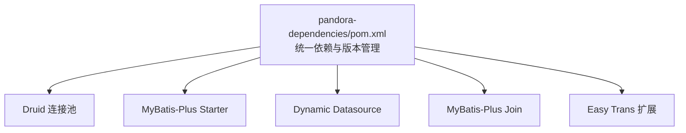
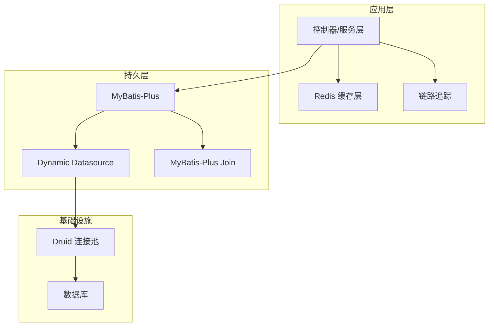
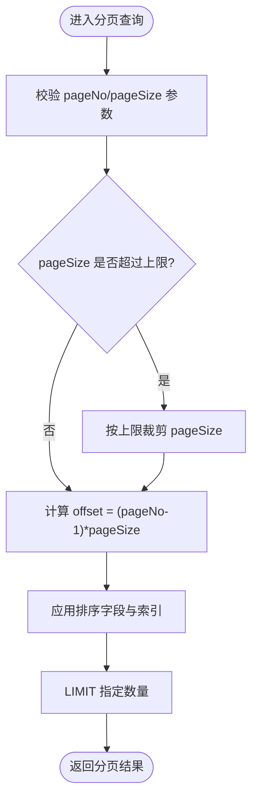
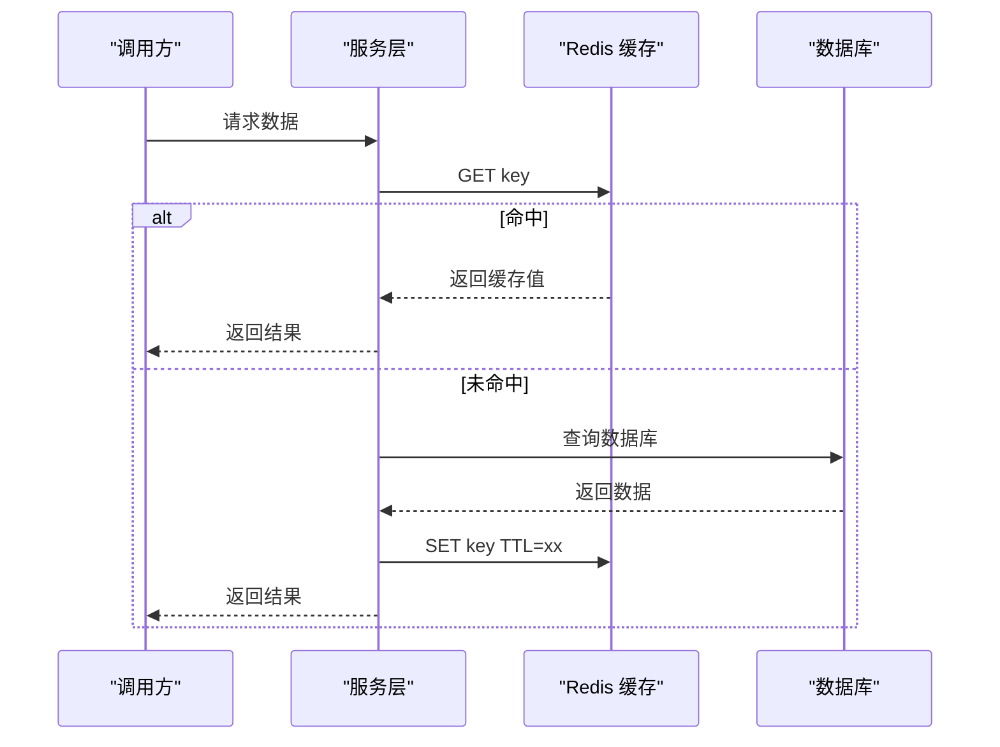
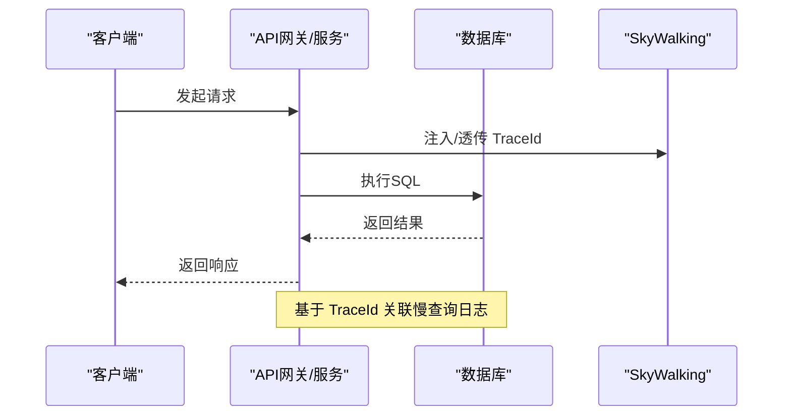
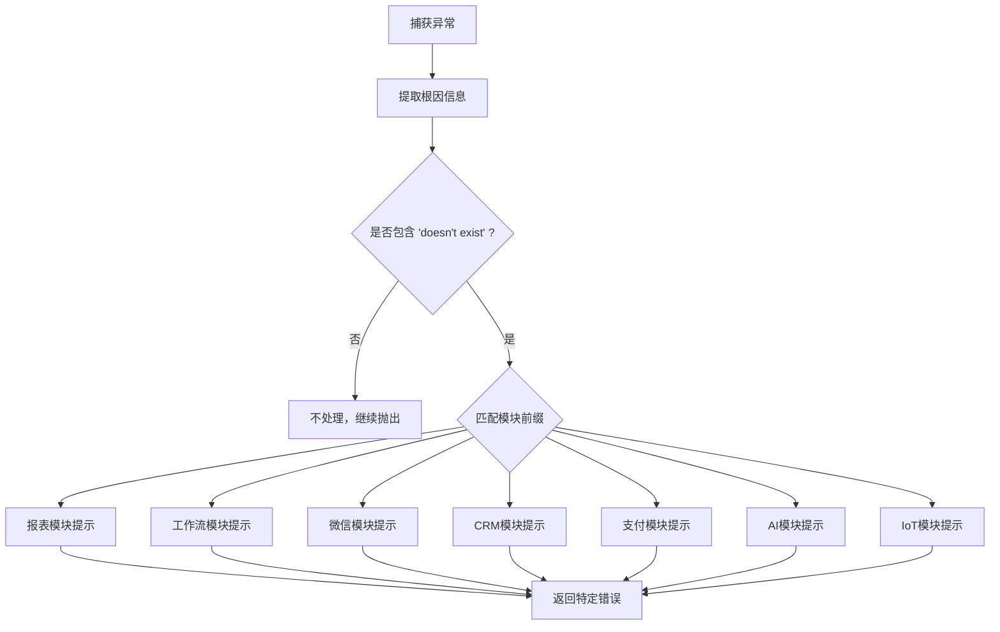
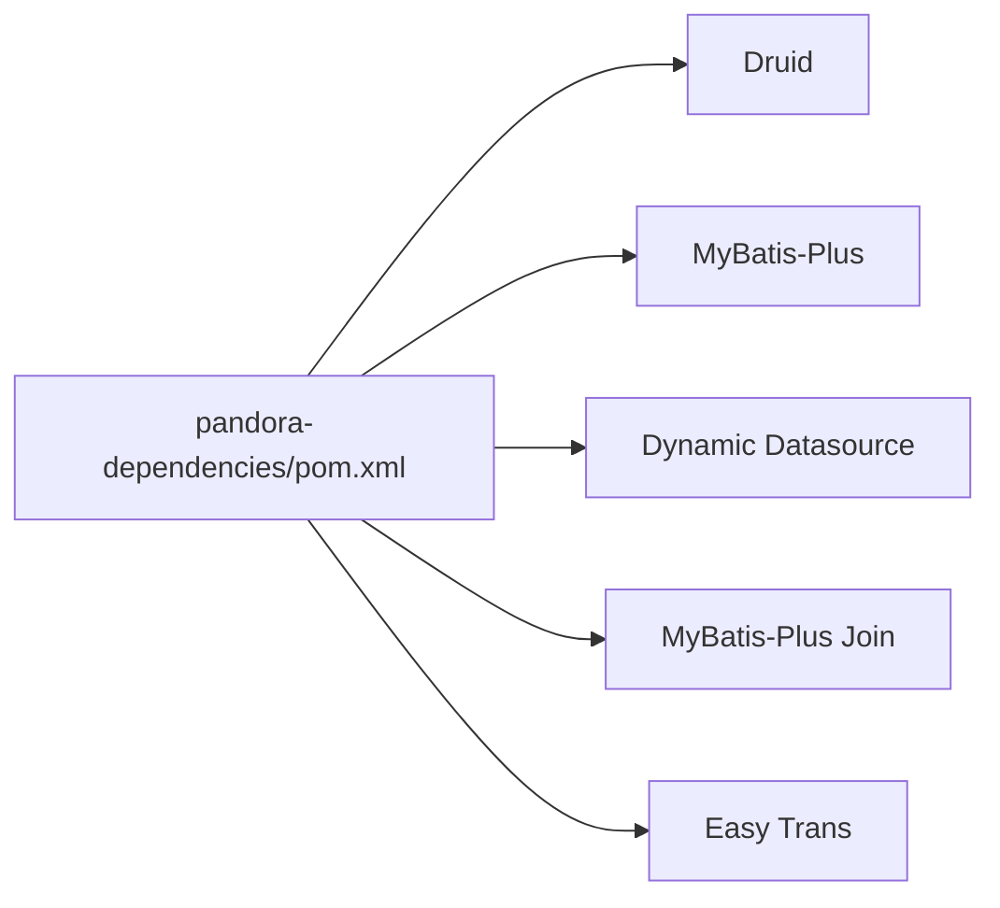

# 数据库性能优化

<cite>
**本文引用的文件**
- [pandora-dependencies/pom.xml](file://pandora-dependencies/pom.xml)
- [pandora-common/src/main/java/net/ittimeline/pandora/framework/common/pojo/PageParam.java](file://pandora-common/src/main/java/net/ittimeline/pandora/framework/common/pojo/PageParam.java)
- [pandora-common/src/main/java/net/ittimeline/pandora/framework/common/pojo/SortablePageParam.java](file://pandora-common/src/main/java/net/ittimeline/pandora/framework/common/pojo/SortablePageParam.java)
- [pandora-common/src/main/java/net/ittimeline/pandora/framework/common/util/foundational/object/PageUtils.java](file://pandora-common/src/main/java/net/ittimeline/pandora/framework/common/util/foundational/object/PageUtils.java)
- [pandora-common/src/main/java/net/ittimeline/pandora/framework/common/util/web/monitor/TracerUtils.java](file://pandora-common/src/main/java/net/ittimeline/pandora/framework/common/util/web/monitor/TracerUtils.java)
- [pandora-framework/pandora-spring-boot-starter-redis/src/main/java/net/ittimeline/pandora/framework/redis/config/PandoraCacheAutoConfiguration.java](file://pandora-framework/pandora-spring-boot-starter-redis/src/main/java/net/ittimeline/pandora/framework/redis/config/PandoraCacheAutoConfiguration.java)
- [pandora-framework/pandora-spring-boot-starter-redis/src/main/java/net/ittimeline/pandora/framework/redis/config/PandoraCacheProperties.java](file://pandora-framework/pandora-spring-boot-starter-redis/src/main/java/net/ittimeline/pandora/framework/redis/config/PandoraCacheProperties.java)
- [pandora-framework/pandora-spring-boot-starter-redis/src/main/java/net/ittimeline/pandora/framework/redis/core/TimeoutRedisCacheManager.java](file://pandora-framework/pandora-spring-boot-starter-redis/src/main/java/net/ittimeline/pandora/framework/redis/core/TimeoutRedisCacheManager.java)
- [pandora-framework/pandora-spring-boot-starter-web/src/main/java/net/ittimeline/pandora/framework/web/core/handler/GlobalExceptionHandler.java](file://pandora-framework/pandora-spring-boot-starter-web/src/main/java/net/ittimeline/pandora/framework/web/core/handler/GlobalExceptionHandler.java)
</cite>

## 目录
1. [简介](#简介)
2. [项目结构](#项目结构)
3. [核心组件](#核心组件)
4. [架构总览](#架构总览)
5. [详细组件分析](#详细组件分析)
6. [依赖分析](#依赖分析)
7. [性能考量](#性能考量)
8. [故障排查指南](#故障排查指南)
9. [结论](#结论)
10. [附录](#附录)

## 简介
本指南面向Pandora Cloud框架的数据库性能优化，聚焦以下关键主题：
- 数据库连接池配置与调优
- SQL查询优化与索引策略
- MyBatis-Plus在性能方面的最佳实践（批量操作、分页查询、懒加载等）
- 慢查询识别与优化（执行计划分析、查询重写、数据库参数调优）
- 数据库监控指标解读、性能基准测试方法
- 常见数据库性能问题的定位与解决方案

本指南结合仓库中已有的依赖与通用工具，给出可落地的优化建议与实施路径。

## 项目结构
Pandora Cloud通过BOM统一管理依赖，数据库相关能力由以下组件构成：
- 连接池：Druid（阿里系）
- ORM：MyBatis-Plus（Spring Boot 3 Starter）
- 多数据源：Dynamic Datasource
- 联表查询扩展：MyBatis-Plus Join
- 数据翻译：Easy Trans（与MyBatis-Plus扩展配合）

图表来源
- [pandora-dependencies/pom.xml:202-257](file://pandora-dependencies/pom.xml#L202-L257)

章节来源
- [pandora-dependencies/pom.xml:202-257](file://pandora-dependencies/pom.xml#L202-L257)

## 核心组件
- 分页参数与工具：提供标准分页参数与排序字段构建，便于在服务层控制SQL分页与排序，减少一次性拉取大量数据带来的压力。
- Redis缓存：提供缓存配置、序列化策略、动态TTL与异步刷新机制，降低数据库访问频次。
- 链路追踪：基于SkyWalking的TraceId采集，便于跨服务定位慢查询根因。
- 全局异常处理：对“表不存在”等数据库异常进行分类处理，辅助定位DDL缺失或模块未启用问题。

章节来源
- [pandora-common/src/main/java/net/ittimeline/pandora/framework/common/pojo/PageParam.java:1-43](file://pandora-common/src/main/java/net/ittimeline/pandora/framework/common/pojo/PageParam.java#L1-L43)
- [pandora-common/src/main/java/net/ittimeline/pandora/framework/common/pojo/SortablePageParam.java:1-26](file://pandora-common/src/main/java/net/ittimeline/pandora/framework/common/pojo/SortablePageParam.java#L1-L26)
- [pandora-common/src/main/java/net/ittimeline/pandora/framework/common/util/foundational/object/PageUtils.java:1-39](file://pandora-common/src/main/java/net/ittimeline/pandora/framework/common/util/foundational/object/PageUtils.java#L1-L39)
- [pandora-framework/pandora-spring-boot-starter-redis/src/main/java/net/ittimeline/pandora/framework/redis/config/PandoraCacheAutoConfiguration.java:27-57](file://pandora-framework/pandora-spring-boot-starter-redis/src/main/java/net/ittimeline/pandora/framework/redis/config/PandoraCacheAutoConfiguration.java#L27-L57)
- [pandora-framework/pandora-spring-boot-starter-redis/src/main/java/net/ittimeline/pandora/framework/redis/config/PandoraCacheProperties.java:1-29](file://pandora-framework/pandora-spring-boot-starter-redis/src/main/java/net/ittimeline/pandora/framework/redis/config/PandoraCacheProperties.java#L1-L29)
- [pandora-framework/pandora-spring-boot-starter-redis/src/main/java/net/ittimeline/pandora/framework/redis/core/TimeoutRedisCacheManager.java:38-85](file://pandora-framework/pandora-spring-boot-starter-redis/src/main/java/net/ittimeline/pandora/framework/redis/core/TimeoutRedisCacheManager.java#L38-L85)
- [pandora-common/src/main/java/net/ittimeline/pandora/framework/common/util/web/monitor/TracerUtils.java:1-29](file://pandora-common/src/main/java/net/ittimeline/pandora/framework/common/util/web/monitor/TracerUtils.java#L1-L29)
- [pandora-framework/pandora-spring-boot-starter-web/src/main/java/net/ittimeline/pandora/framework/web/core/handler/GlobalExceptionHandler.java:386-446](file://pandora-framework/pandora-spring-boot-starter-web/src/main/java/net/ittimeline/pandora/framework/web/core/handler/GlobalExceptionHandler.java#L386-L446)

## 架构总览
数据库层整体采用“连接池 + ORM + 缓存 + 监控”的组合方案，结合多数据源与联表查询扩展，满足复杂业务场景下的性能与可维护性需求。

图表来源
- [pandora-dependencies/pom.xml:202-257](file://pandora-dependencies/pom.xml#L202-L257)
- [pandora-framework/pandora-spring-boot-starter-redis/src/main/java/net/ittimeline/pandora/framework/redis/config/PandoraCacheAutoConfiguration.java:27-57](file://pandora-framework/pandora-spring-boot-starter-redis/src/main/java/net/ittimeline/pandora/framework/redis/config/PandoraCacheAutoConfiguration.java#L27-L57)
- [pandora-common/src/main/java/net/ittimeline/pandora/framework/common/util/web/monitor/TracerUtils.java:1-29](file://pandora-common/src/main/java/net/ittimeline/pandora/framework/common/util/web/monitor/TracerUtils.java#L1-L29)

## 详细组件分析

### 分页查询与排序
- 分页参数：提供页码、每页大小、最大限制等约束，避免超大分页导致全表扫描。
- 排序字段：支持多字段排序，结合PageUtils构建起始偏移量，确保SQL分页可控。
- 最佳实践：
  - 明确排序键，优先使用覆盖索引，避免回表与排序开销。
  - 大数据量分页建议使用“游标翻页”或“基于索引的limit优化”替代传统offset。
  - 控制每页大小上限，防止内存与连接池压力过大。

图表来源
- [pandora-common/src/main/java/net/ittimeline/pandora/framework/common/pojo/PageParam.java:1-43](file://pandora-common/src/main/java/net/ittimeline/pandora/framework/common/ppojo/PageParam.java#L1-L43)
- [pandora-common/src/main/java/net/ittimeline/pandora/framework/common/pojo/SortablePageParam.java:1-26](file://pandora-common/src/main/java/net/ittimeline/pandora/framework/common/pojo/SortablePageParam.java#L1-L26)
- [pandora-common/src/main/java/net/ittimeline/pandora/framework/common/util/foundational/object/PageUtils.java:1-39](file://pandora-common/src/main/java/net/ittimeline/pandora/framework/common/util/foundational/object/PageUtils.java#L1-L39)

章节来源
- [pandora-common/src/main/java/net/ittimeline/pandora/framework/common/pojo/PageParam.java:1-43](file://pandora-common/src/main/java/net/ittimeline/pandora/framework/common/pojo/PageParam.java#L1-L43)
- [pandora-common/src/main/java/net/ittimeline/pandora/framework/common/pojo/SortablePageParam.java:1-26](file://pandora-common/src/main/java/net/ittimeline/pandora/framework/common/pojo/SortablePageParam.java#L1-L26)
- [pandora-common/src/main/java/net/ittimeline/pandora/framework/common/util/foundational/object/PageUtils.java:1-39](file://pandora-common/src/main/java/net/ittimeline/pandora/framework/common/util/foundational/object/PageUtils.java#L1-L39)

### 缓存与热点数据
- 缓存配置：统一Key前缀、JSON序列化策略，提升命中率与一致性。
- 动态TTL：通过自定义CacheManager支持按命名空间动态设置过期时间。
- 异步刷新：LoadingCache异步重载，降低热key抖动对延迟的影响。
- 最佳实践：
  - 将高频只读数据放入缓存，设定合理TTL与并发刷新策略。
  - 对热点key增加本地缓存（如Guava）作为第一层，减轻Redis压力。
  - 使用批量获取与批量失效，减少网络往返与原子性操作。

图表来源
- [pandora-framework/pandora-spring-boot-starter-redis/src/main/java/net/ittimeline/pandora/framework/redis/config/PandoraCacheAutoConfiguration.java:27-57](file://pandora-framework/pandora-spring-boot-starter-redis/src/main/java/net/ittimeline/pandora/framework/redis/config/PandoraCacheAutoConfiguration.java#L27-L57)
- [pandora-framework/pandora-spring-boot-starter-redis/src/main/java/net/ittimeline/pandora/framework/redis/core/TimeoutRedisCacheManager.java:38-85](file://pandora-framework/pandora-spring-boot-starter-redis/src/main/java/net/ittimeline/pandora/framework/redis/core/TimeoutRedisCacheManager.java#L38-L85)
- [pandora-framework/pandora-spring-boot-starter-redis/src/main/java/net/ittimeline/pandora/framework/redis/config/PandoraCacheProperties.java:1-29](file://pandora-framework/pandora-spring-boot-starter-redis/src/main/java/net/ittimeline/pandora/framework/redis/config/PandoraCacheProperties.java#L1-L29)

章节来源
- [pandora-framework/pandora-spring-boot-starter-redis/src/main/java/net/ittimeline/pandora/framework/redis/config/PandoraCacheAutoConfiguration.java:27-57](file://pandora-framework/pandora-spring-boot-starter-redis/src/main/java/net/ittimeline/pandora/framework/redis/config/PandoraCacheAutoConfiguration.java#L27-L57)
- [pandora-framework/pandora-spring-boot-starter-redis/src/main/java/net/ittimeline/pandora/framework/redis/core/TimeoutRedisCacheManager.java:38-85](file://pandora-framework/pandora-spring-boot-starter-redis/src/main/java/net/ittimeline/pandora/framework/redis/core/TimeoutRedisCacheManager.java#L38-L85)
- [pandora-framework/pandora-spring-boot-starter-redis/src/main/java/net/ittimeline/pandora/framework/redis/config/PandoraCacheProperties.java:1-29](file://pandora-framework/pandora-spring-boot-starter-redis/src/main/java/net/ittimeline/pandora/framework/redis/config/PandoraCacheProperties.java#L1-L29)

### 链路追踪与慢查询定位
- TraceId采集：通过工具类获取SkyWalking TraceId，串联请求链路。
- 最佳实践：
  - 在SQL执行前后埋点，记录耗时与参数，结合TraceId快速定位慢查询根因。
  - 对批量操作与复杂联表查询开启独立Span，便于拆分评估。

图表来源
- [pandora-common/src/main/java/net/ittimeline/pandora/framework/common/util/web/monitor/TracerUtils.java:1-29](file://pandora-common/src/main/java/net/ittimeline/pandora/framework/common/util/web/monitor/TracerUtils.java#L1-L29)

章节来源
- [pandora-common/src/main/java/net/ittimeline/pandora/framework/common/util/web/monitor/TracerUtils.java:1-29](file://pandora-common/src/main/java/net/ittimeline/pandora/framework/common/util/web/monitor/TracerUtils.java#L1-L29)

### 全局异常处理与DDL缺失
- 表不存在异常：针对不同模块（报表、工作流、微信、CRM、支付、AI、IoT等）进行分类提示，帮助快速定位缺失的DDL或模块未启用。
- 最佳实践：
  - 在上线流程中增加DDL校验步骤，避免运行期出现“表不存在”异常。
  - 对关键模块建立自动化检查清单，结合CI/CD进行强制校验。

图表来源
- [pandora-framework/pandora-spring-boot-starter-web/src/main/java/net/ittimeline/pandora/framework/web/core/handler/GlobalExceptionHandler.java:386-446](file://pandora-framework/pandora-spring-boot-starter-web/src/main/java/net/ittimeline/pandora/framework/web/core/handler/GlobalExceptionHandler.java#L386-L446)

章节来源
- [pandora-framework/pandora-spring-boot-starter-web/src/main/java/net/ittimeline/pandora/framework/web/core/handler/GlobalExceptionHandler.java:386-446](file://pandora-framework/pandora-spring-boot-starter-web/src/main/java/net/ittimeline/pandora/framework/web/core/handler/GlobalExceptionHandler.java#L386-L446)

## 依赖分析
- 连接池：Druid（阿里系），具备强大的监控与SQL防火墙能力，适合生产环境。
- ORM：MyBatis-Plus（Spring Boot 3 Starter），提供代码生成、分页、条件构造器等，简化SQL编写并提升性能。
- 多数据源：Dynamic Datasource，支持读写分离与多租户场景，需配合连接池与SQL路由策略。
- 联表查询：MyBatis-Plus Join，简化复杂联表SQL，但需关注JOIN代价与索引设计。
- 数据翻译：Easy Trans + MyBatis-Plus扩展，将字典/外键翻译下沉至ORM层，减少多次查询，但需注意缓存与批量翻译策略。

图表来源
- [pandora-dependencies/pom.xml:202-257](file://pandora-dependencies/pom.xml#L202-L257)

章节来源
- [pandora-dependencies/pom.xml:202-257](file://pandora-dependencies/pom.xml#L202-L257)

## 性能考量
- 连接池配置
  - 核心参数：初始连接数、最小空闲、最大活跃、最大等待时间、空闲超时回收。
  - 建议：根据QPS与事务持续时间估算最大活跃，设置合理的超时与回收策略，避免连接泄漏。
  - 监控：开启Druid StatView与Wall过滤器，观察慢查询、拦截与异常统计。
- SQL与索引
  - 优先使用覆盖索引，避免SELECT *与回表。
  - 复合索引遵循“最左前缀原则”，将高选择性字段放在前面。
  - 避免在WHERE中对列进行函数运算或隐式类型转换。
- MyBatis-Plus最佳实践
  - 批量操作：使用批量插入/更新，减少JDBC往返；注意分批大小与事务边界。
  - 分页查询：明确排序键，避免OFFSET过大；必要时采用游标翻页。
  - 懒加载：谨慎使用关联查询的懒加载，避免N+1查询；优先使用JOIN或批量预加载。
- 缓存策略
  - 读多写少场景：提升缓存命中率，设置合理TTL与并发刷新。
  - 热点key：考虑本地缓存与多级缓存（本地+Redis）。
- 监控与基准测试
  - 指标：QPS、P99延迟、连接池活跃数、慢查询数、缓存命中率、GC与堆内存。
  - 基准：使用JMH或sysbench进行读写混合压测，逐步加压定位瓶颈。
- 常见问题
  - 表不存在：通过全局异常处理快速定位模块DDL缺失。
  - 索引失效：检查是否误用函数、模糊匹配或范围查询导致索引回退。
  - 连接池耗尽：检查慢事务、未关闭的连接与超时设置。

## 故障排查指南
- 慢查询定位
  - 通过链路追踪（TraceId）关联数据库慢日志，确认SQL与参数。
  - 使用EXPLAIN分析执行计划，关注是否走全表扫描、是否使用临时表或文件排序。
- SQL重写建议
  - 将OR拆分为UNION/UNION ALL，避免索引失效。
  - 将IN替换为EXISTS或JOIN，减少大集合扫描。
  - 使用LIMIT限制结果集，避免一次性返回过多数据。
- 数据库参数调优
  - innodb_buffer_pool_size：根据可用内存与表大小设定，建议不低于总物理内存的50%-70%。
  - innodb_log_file_size：增大可降低频繁刷盘，但会延长崩溃恢复时间。
  - max_connections：与连接池最大活跃保持安全冗余。
- 连接池问题
  - 连接泄漏：排查未关闭的Statement/ResultSet/Connection。
  - 超时堆积：调整最大等待时间与超时阈值，避免长时间阻塞。
- 缓存问题
  - 缓存穿透：对空结果设置短TTL或布隆过滤。
  - 缓存雪崩：随机TTL与异步刷新，避免同时过期。
  - 缓存击穿：热点key加互斥锁或永不过期+异步刷新。

章节来源
- [pandora-common/src/main/java/net/ittimeline/pandora/framework/common/util/web/monitor/TracerUtils.java:1-29](file://pandora-common/src/main/java/net/ittimeline/pandora/framework/common/util/web/monitor/TracerUtils.java#L1-L29)
- [pandora-framework/pandora-spring-boot-starter-web/src/main/java/net/ittimeline/pandora/framework/web/core/handler/GlobalExceptionHandler.java:386-446](file://pandora-framework/pandora-spring-boot-starter-web/src/main/java/net/ittimeline/pandora/framework/web/core/handler/GlobalExceptionHandler.java#L386-L446)

## 结论
Pandora Cloud在数据库侧提供了完善的基础设施：Druid连接池、MyBatis-Plus ORM、多数据源与联表扩展、缓存与链路追踪。结合本文的优化建议与排障方法，可在保证功能完整性的同时显著提升数据库性能与稳定性。建议将连接池、SQL与索引、缓存策略纳入日常巡检与压测流程，形成闭环。

## 附录
- 术语
  - QPS：每秒查询数
  - P99：99分位延迟
  - N+1：查询N次主实体后，再查询N次关联实体
- 参考实现位置
  - 连接池与ORM依赖：[pandora-dependencies/pom.xml:202-257](file://pandora-dependencies/pom.xml#L202-L257)
  - 分页参数与排序：[PageParam.java:1-43](file://pandora-common/src/main/java/net/ittimeline/pandora/framework/common/pojo/PageParam.java#L1-L43)、[SortablePageParam.java:1-26](file://pandora-common/src/main/java/net/ittimeline/pandora/framework/common/pojo/SortablePageParam.java#L1-L26)、[PageUtils.java:1-39](file://pandora-common/src/main/java/net/ittimeline/pandora/framework/common/util/foundational/object/PageUtils.java#L1-L39)
  - 缓存配置与TTL：[PandoraCacheAutoConfiguration.java:27-57](file://pandora-framework/pandora-spring-boot-starter-redis/src/main/java/net/ittimeline/pandora/framework/redis/config/PandoraCacheAutoConfiguration.java#L27-L57)、[TimeoutRedisCacheManager.java:38-85](file://pandora-framework/pandora-spring-boot-starter-redis/src/main/java/net/ittimeline/pandora/framework/redis/core/TimeoutRedisCacheManager.java#L38-L85)、[PandoraCacheProperties.java:1-29](file://pandora-framework/pandora-spring-boot-starter-redis/src/main/java/net/ittimeline/pandora/framework/redis/config/PandoraCacheProperties.java#L1-L29)
  - 链路追踪：[TracerUtils.java:1-29](file://pandora-common/src/main/java/net/ittimeline/pandora/framework/common/util/web/monitor/TracerUtils.java#L1-L29)
  - 全局异常处理：[GlobalExceptionHandler.java:386-446](file://pandora-framework/pandora-spring-boot-starter-web/src/main/java/net/ittimeline/pandora/framework/web/core/handler/GlobalExceptionHandler.java#L386-L446)