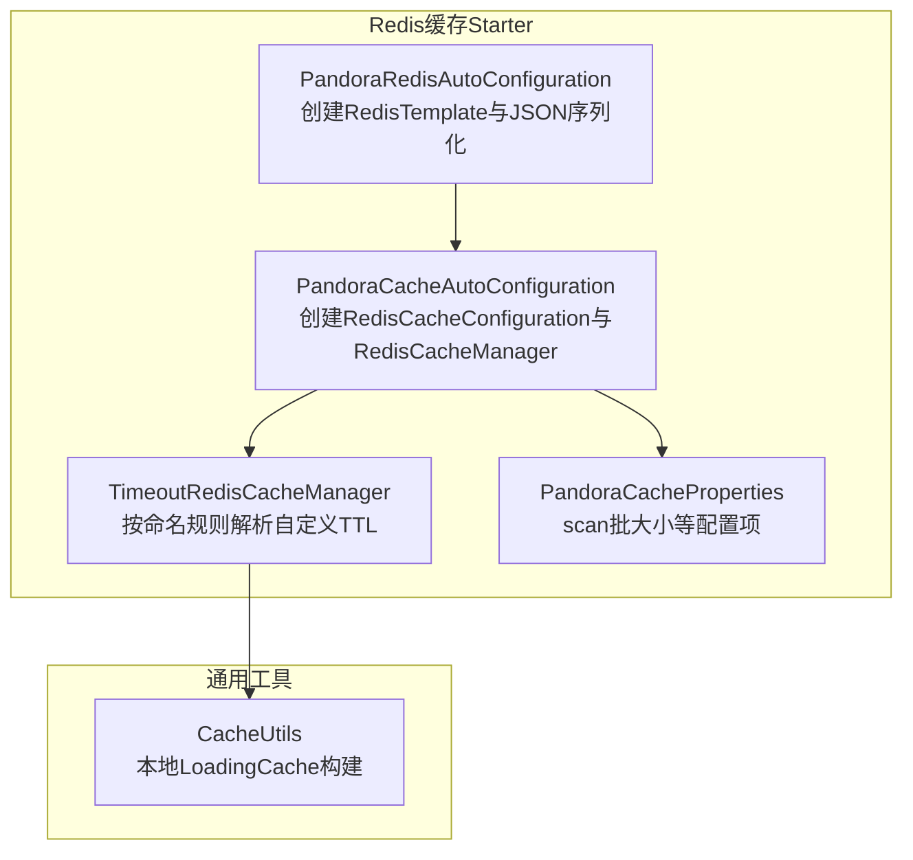
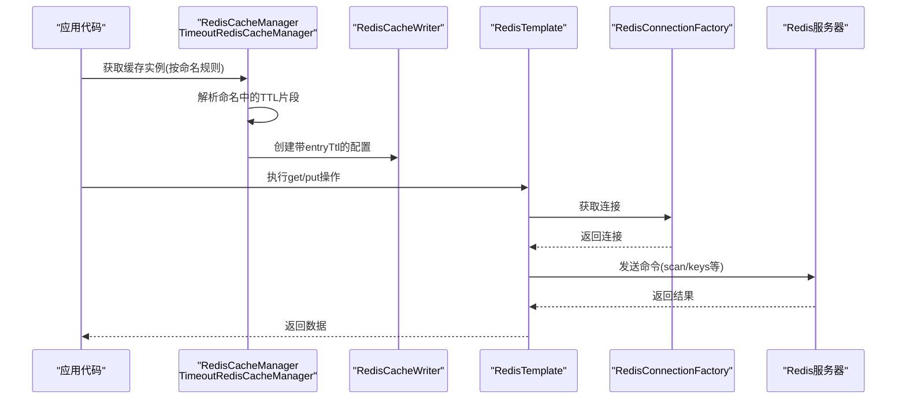
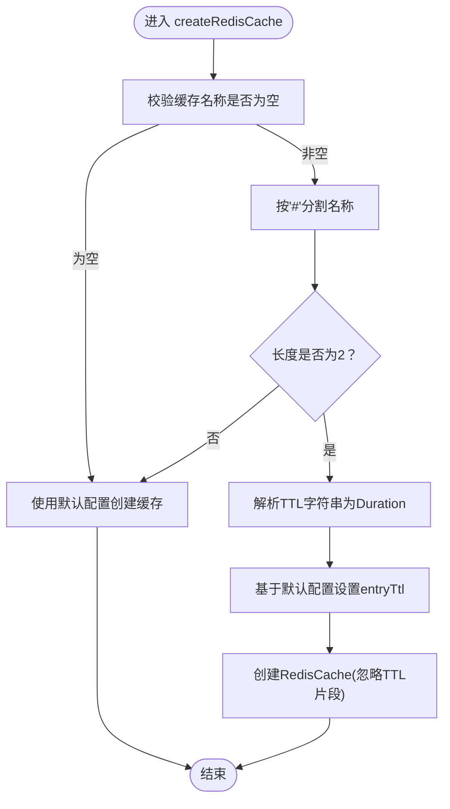
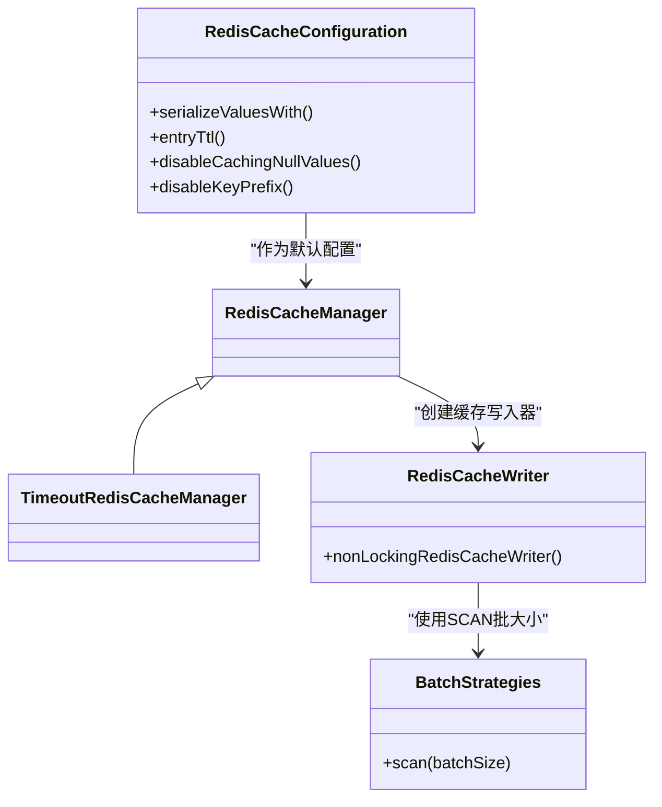
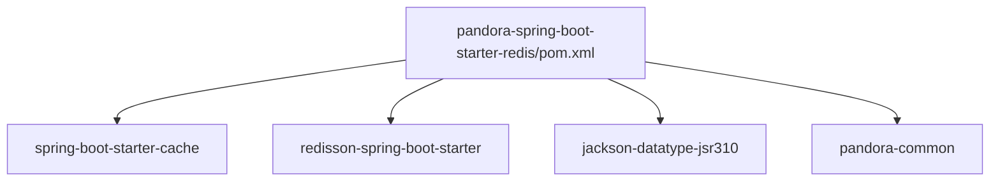

# 缓存性能优化

<cite>
**本文引用的文件**
- [TimeoutRedisCacheManager.java](file://pandora-framework/pandora-spring-boot-starter-redis/src/main/java/net/ittimeline/pandora/framework/redis/core/TimeoutRedisCacheManager.java)
- [PandoraCacheAutoConfiguration.java](file://pandora-framework/pandora-spring-boot-starter-redis/src/main/java/net/ittimeline/pandora/framework/redis/config/PandoraCacheAutoConfiguration.java)
- [PandoraCacheProperties.java](file://pandora-framework/pandora-spring-boot-starter-redis/src/main/java/net/ittimeline/pandora/framework/redis/config/PandoraCacheProperties.java)
- [PandoraRedisAutoConfiguration.java](file://pandora-framework/pandora-spring-boot-starter-redis/src/main/java/net/ittimeline/pandora/framework/redis/config/PandoraRedisAutoConfiguration.java)
- [CacheUtils.java](file://pandora-framework/pandora-common/src/main/java/net/ittimeline/pandora/framework/common/util/web/cache/CacheUtils.java)
- [pandora-spring-boot-starter-redis/pom.xml](file://pandora-framework/pandora-spring-boot-starter-redis/pom.xml)
- [AutoConfiguration.imports](file://pandora-framework/pandora-spring-boot-starter-redis/src/main/resources/META-INF/spring/org.springframework.boot.autoconfigure.AutoConfiguration.imports)
</cite>

## 目录
1. [简介](#简介)
2. [项目结构](#项目结构)
3. [核心组件](#核心组件)
4. [架构总览](#架构总览)
5. [详细组件分析](#详细组件分析)
6. [依赖分析](#依赖分析)
7. [性能考量](#性能考量)
8. [故障排除指南](#故障排除指南)
9. [结论](#结论)
10. [附录](#附录)

## 简介
本指南聚焦于Pandora Cloud框架中Redis缓存子系统的性能问题与优化路径，围绕TimeoutRedisCacheManager的设计与实现，系统阐述缓存命中率优化、过期时间策略、内存使用监控、连接池配置、序列化性能、批量操作最佳实践，并给出缓存穿透、击穿、雪崩的预防与处置方案，以及可落地的性能测试方法、监控指标与调优参数示例。

## 项目结构
Redis缓存相关能力由独立的Spring Boot Starter模块提供，核心包括：
- 自动配置：Redis与Cache的自动装配、序列化器构建、默认TTL与前缀策略
- 缓存管理器扩展：支持按命名规则动态指定过期时间
- 本地缓存工具：提供基于Guava的LoadingCache构建工具，便于热点数据的本地加速

图表来源
- [PandoraRedisAutoConfiguration.java:19-49](file://pandora-framework/pandora-spring-boot-starter-redis/src/main/java/net/ittimeline/pandora/framework/redis/config/PandoraRedisAutoConfiguration.java#L19-L49)
- [PandoraCacheAutoConfiguration.java:31-84](file://pandora-framework/pandora-spring-boot-starter-redis/src/main/java/net/ittimeline/pandora/framework/redis/config/PandoraCacheAutoConfiguration.java#L31-L84)
- [TimeoutRedisCacheManager.java:19-85](file://pandora-framework/pandora-spring-boot-starter-redis/src/main/java/net/ittimeline/pandora/framework/redis/core/TimeoutRedisCacheManager.java#L19-L85)
- [PandoraCacheProperties.java:14-29](file://pandora-framework/pandora-spring-boot-starter-redis/src/main/java/net/ittimeline/pandora/framework/redis/config/PandoraCacheProperties.java#L14-L29)
- [CacheUtils.java:16-60](file://pandora-framework/pandora-common/src/main/java/net/ittimeline/pandora/framework/common/util/web/cache/CacheUtils.java#L16-L60)

章节来源
- [PandoraRedisAutoConfiguration.java:19-49](file://pandora-framework/pandora-spring-boot-starter-redis/src/main/java/net/ittimeline/pandora/framework/redis/config/PandoraRedisAutoConfiguration.java#L19-L49)
- [PandoraCacheAutoConfiguration.java:31-84](file://pandora-framework/pandora-spring-boot-starter-redis/src/main/java/net/ittimeline/pandora/framework/redis/config/PandoraCacheAutoConfiguration.java#L31-L84)
- [TimeoutRedisCacheManager.java:19-85](file://pandora-framework/pandora-spring-boot-starter-redis/src/main/java/net/ittimeline/pandora/framework/redis/core/TimeoutRedisCacheManager.java#L19-L85)
- [PandoraCacheProperties.java:14-29](file://pandora-framework/pandora-spring-boot-starter-redis/src/main/java/net/ittimeline/pandora/framework/redis/config/PandoraCacheProperties.java#L14-L29)
- [CacheUtils.java:16-60](file://pandora-framework/pandora-common/src/main/java/net/ittimeline/pandora/framework/common/util/web/cache/CacheUtils.java#L16-L60)

## 核心组件
- TimeoutRedisCacheManager：在标准RedisCacheManager基础上，支持以特定命名约定为每个缓存分区动态设置TTL，提升过期控制灵活性与命中率稳定性。
- PandoraCacheAutoConfiguration：负责RedisCacheConfiguration的默认构建、键前缀策略、序列化策略、null值缓存开关、默认TTL注入；并基于RedisTemplate创建RedisCacheWriter与TimeoutRedisCacheManager。
- PandoraCacheProperties：提供Redis SCAN批大小等可调参数，默认值为30。
- PandoraRedisAutoConfiguration：统一构建RedisTemplate，采用JSON序列化（含JavaTimeModule）以保证复杂对象的稳定序列化。
- CacheUtils：提供本地LoadingCache构建工具，支持同步/异步刷新，适合热点数据的本地加速与降压。

章节来源
- [TimeoutRedisCacheManager.java:19-85](file://pandora-framework/pandora-spring-boot-starter-redis/src/main/java/net/ittimeline/pandora/framework/redis/core/TimeoutRedisCacheManager.java#L19-L85)
- [PandoraCacheAutoConfiguration.java:31-84](file://pandora-framework/pandora-spring-boot-starter-redis/src/main/java/net/ittimeline/pandora/framework/redis/config/PandoraCacheAutoConfiguration.java#L31-L84)
- [PandoraCacheProperties.java:14-29](file://pandora-framework/pandora-spring-boot-starter-redis/src/main/java/net/ittimeline/pandora/framework/redis/config/PandoraCacheProperties.java#L14-L29)
- [PandoraRedisAutoConfiguration.java:19-49](file://pandora-framework/pandora-spring-boot-starter-redis/src/main/java/net/ittimeline/pandora/framework/redis/config/PandoraRedisAutoConfiguration.java#L19-L49)
- [CacheUtils.java:16-60](file://pandora-framework/pandora-common/src/main/java/net/ittimeline/pandora/framework/common/util/web/cache/CacheUtils.java#L16-L60)

## 架构总览
下图展示从应用到Redis的缓存调用链路及关键组件交互：

图表来源
- [PandoraCacheAutoConfiguration.java:73-83](file://pandora-framework/pandora-spring-boot-starter-redis/src/main/java/net/ittimeline/pandora/framework/redis/config/PandoraCacheAutoConfiguration.java#L73-L83)
- [TimeoutRedisCacheManager.java:27-50](file://pandora-framework/pandora-spring-boot-starter-redis/src/main/java/net/ittimeline/pandora/framework/redis/core/TimeoutRedisCacheManager.java#L27-L50)
- [PandoraRedisAutoConfiguration.java:25-38](file://pandora-framework/pandora-spring-boot-starter-redis/src/main/java/net/ittimeline/pandora/framework/redis/config/PandoraRedisAutoConfiguration.java#L25-L38)

## 详细组件分析

### TimeoutRedisCacheManager：命名驱动的TTL解析与缓存创建
- 命名约定：使用“#”分隔符，格式为“分区名#TTL片段”，其中TTL片段支持“数字+单位”或纯数字秒。
- TTL解析：根据末位字符识别单位（天/d、小时/h、分钟/m、秒/s），其余数字作为数值解析。
- 缓存创建：在创建RedisCache时，将entryTtl替换为解析出的Duration，从而实现按分区的差异化过期策略。
- 兼容性：若命名不符合约定或为空，回退至默认配置。

图表来源
- [TimeoutRedisCacheManager.java:27-50](file://pandora-framework/pandora-spring-boot-starter-redis/src/main/java/net/ittimeline/pandora/framework/redis/core/TimeoutRedisCacheManager.java#L27-L50)
- [TimeoutRedisCacheManager.java:58-82](file://pandora-framework/pandora-spring-boot-starter-redis/src/main/java/net/ittimeline/pandora/framework/redis/core/TimeoutRedisCacheManager.java#L58-L82)

章节来源
- [TimeoutRedisCacheManager.java:19-85](file://pandora-framework/pandora-spring-boot-starter-redis/src/main/java/net/ittimeline/pandora/framework/redis/core/TimeoutRedisCacheManager.java#L19-L85)

### PandoraCacheAutoConfiguration：默认配置、键前缀与序列化
- 键前缀策略：通过computePrefixWith自定义前缀拼接逻辑，确保key前缀规范且可读，避免Redis桌面工具的显示问题。
- 序列化策略：统一使用JSON序列化（基于Jackson），并在RedisCacheConfiguration中应用，保证复杂类型稳定持久化。
- 默认TTL与行为：读取CacheProperties.Redis的配置，设置entryTtl、禁用空值缓存、禁用key前缀等。
- 批量策略：基于RedisCacheWriter的nonLockingRedisCacheWriter与SCAN批大小，提升批量操作效率。

图表来源
- [PandoraCacheAutoConfiguration.java:40-71](file://pandora-framework/pandora-spring-boot-starter-redis/src/main/java/net/ittimeline/pandora/framework/redis/config/PandoraCacheAutoConfiguration.java#L40-L71)
- [PandoraCacheAutoConfiguration.java:73-83](file://pandora-framework/pandora-spring-boot-starter-redis/src/main/java/net/ittimeline/pandora/framework/redis/config/PandoraCacheAutoConfiguration.java#L73-L83)
- [TimeoutRedisCacheManager.java:19-25](file://pandora-framework/pandora-spring-boot-starter-redis/src/main/java/net/ittimeline/pandora/framework/redis/core/TimeoutRedisCacheManager.java#L19-L25)

章节来源
- [PandoraCacheAutoConfiguration.java:31-84](file://pandora-framework/pandora-spring-boot-starter-redis/src/main/java/net/ittimeline/pandora/framework/redis/config/PandoraCacheAutoConfiguration.java#L31-L84)

### PandoraCacheProperties：可调参数
- redisScanBatchSize：默认30，用于SCAN批扫描的每次返回数量，直接影响批量操作的吞吐与延迟权衡。

章节来源
- [PandoraCacheProperties.java:14-29](file://pandora-framework/pandora-spring-boot-starter-redis/src/main/java/net/ittimeline/pandora/framework/redis/config/PandoraCacheProperties.java#L14-L29)

### PandoraRedisAutoConfiguration：RedisTemplate与JSON序列化
- RedisTemplate：统一设置Key/HashKey为String序列化，Value/HashValue为JSON序列化（含JavaTimeModule），保证日期时间类型的正确序列化。
- 自定义序列化器：通过反射获取底层ObjectMapper并注册JavaTimeModule，避免时间类型序列化异常。

章节来源
- [PandoraRedisAutoConfiguration.java:19-49](file://pandora-framework/pandora-spring-boot-starter-redis/src/main/java/net/ittimeline/pandora/framework/redis/config/PandoraRedisAutoConfiguration.java#L19-L49)

### CacheUtils：本地LoadingCache构建
- 提供同步与异步刷新两种LoadingCache构建方法，最大容量固定，支持按Duration刷新。
- 适用于热点数据的本地缓存，降低对远端Redis的访问压力，提高响应速度。

章节来源
- [CacheUtils.java:16-60](file://pandora-framework/pandora-common/src/main/java/net/ittimeline/pandora/framework/common/util/web/cache/CacheUtils.java#L16-L60)

## 依赖分析
- 模块依赖：pandora-spring-boot-starter-redis依赖spring-boot-starter-cache、Redisson starter、Jackson JSR310模块、pandora-common。
- 自动装配：通过META-INF下的AutoConfiguration.imports声明，确保Redis与Cache自动配置生效。

图表来源
- [pandora-spring-boot-starter-redis/pom.xml:19-40](file://pandora-framework/pandora-spring-boot-starter-redis/pom.xml#L19-L40)

章节来源
- [pandora-spring-boot-starter-redis/pom.xml:19-40](file://pandora-framework/pandora-spring-boot-starter-redis/pom.xml#L19-L40)
- [AutoConfiguration.imports:1-2](file://pandora-framework/pandora-spring-boot-starter-redis/src/main/resources/META-INF/spring/org.springframework.boot.autoconfigure.AutoConfiguration.imports#L1-L2)

## 性能考量
- 命名驱动的TTL策略
  - 建议为高频分区设置较短TTL，低频分区设置较长TTL，结合业务峰值与冷数据比例，动态调整分区命名中的TTL片段，提升命中率与资源利用率。
  - 对于热点数据，可在应用层引入本地LoadingCache（参考CacheUtils），进一步降低远端访问压力。
- 序列化性能
  - 统一使用JSON序列化，避免二进制序列化的兼容性问题；对于频繁更新的对象，尽量保持字段稳定，减少序列化体积。
  - 复杂对象建议拆分存储或采用更紧凑的表示形式，必要时在业务侧做轻量化封装。
- 批量操作
  - 利用SCAN批大小参数（默认30）平衡吞吐与延迟；在大规模键空间场景下，适当增大批大小以减少迭代次数。
  - 在批量删除/过期场景中，优先使用Lua脚本或原子命令组合，减少网络往返。
- 连接池与网络
  - Redis连接池大小应与CPU核数、QPS峰值、请求延迟目标匹配；建议开启TCP keepalive与合理的超时参数。
  - 使用pipeline合并命令，减少RTT；对只读场景启用只读副本分流。
- 内存使用监控
  - 关注key数量、平均TTL分布、内存占用与碎片率；定期清理过期但未被回收的key，避免内存泄漏。
  - 对热key进行分片或迁移，避免单节点内存压力过大。

## 故障排除指南
- 缓存穿透（查询不存在的数据）
  - 现象：大量空值请求直达数据库，导致DB压力骤增。
  - 预防与处置：
    - 对空值也做短TTL缓存（默认配置已可禁用空值缓存，需按需开启）。
    - 引入布隆过滤器或白名单前置校验，拦截明显不存在的key。
- 缓存击穿（热点Key过期）
  - 现象：同一热点Key在同一时刻过期，大量并发请求同时打到DB。
  - 预防与处置：
    - 为热点Key设置随机抖动TTL，避免集体过期。
    - 引入互斥锁（如Redis SET NX EX）或本地互斥，仅允许一个请求重建缓存。
    - 使用本地LoadingCache（参考CacheUtils）作为二级缓冲，平滑瞬时流量。
- 缓存雪崩（大面积过期或Redis宕机）
  - 现象：大量缓存同时失效或Redis不可用，DB瞬间崩溃。
  - 预防与处置：
    - 为不同分区设置差异化TTL与随机抖动，避免集中过期。
    - 预热热点数据，启动阶段提前填充缓存。
    - 多级缓存（本地+远程）与限流熔断，保护下游DB。
- 命名解析异常
  - 现象：自定义TTL未生效或回退默认配置。
  - 排查要点：
    - 确认缓存名称符合“分区名#TTL片段”的格式，且TTL片段末位为合法单位字符。
    - 检查TTL数值是否为有效整数，避免解析失败。
- 序列化异常
  - 现象：复杂对象无法正确序列化或反序列化。
  - 排查要点：
    - 确保对象具备默认构造函数与可序列化字段。
    - 检查是否遗漏JavaTimeModule注册（已在Redis自动配置中完成）。

章节来源
- [PandoraCacheAutoConfiguration.java:64-69](file://pandora-framework/pandora-spring-boot-starter-redis/src/main/java/net/ittimeline/pandora/framework/redis/config/PandoraCacheAutoConfiguration.java#L64-L69)
- [PandoraRedisAutoConfiguration.java:40-46](file://pandora-framework/pandora-spring-boot-starter-redis/src/main/java/net/ittimeline/pandora/framework/redis/config/PandoraRedisAutoConfiguration.java#L40-L46)
- [CacheUtils.java:37-59](file://pandora-framework/pandora-common/src/main/java/net/ittimeline/pandora/framework/common/util/web/cache/CacheUtils.java#L37-L59)

## 结论
通过命名驱动的TTL策略、统一JSON序列化、合理的批量扫描与连接池配置，以及本地LoadingCache的配合，Pandora Cloud框架在Redis缓存场景下具备良好的可调性与稳定性。建议结合业务特点持续优化TTL分布、热点保护与监控告警，以获得更优的命中率与更低的尾延迟。

## 附录
- 性能测试方法
  - 基准测试：使用JMH或Gatling模拟不同TTL分布与并发场景，记录命中率、P99延迟、Redis内存占用。
  - 压力测试：逐步提升QPS，观察Redis CPU、内存、网络带宽与丢包情况，定位瓶颈点。
- 监控指标
  - 缓存命中率、未命中率、过期率、淘汰率
  - Redis内存使用、碎片率、客户端连接数、阻塞事件
  - 命令耗时分布（GET/SET/SCAN）、错误计数
- 调优参数示例
  - TTL策略：热点分区使用“分区#10m”，冷数据使用“分区#7d”
  - SCAN批大小：根据键空间规模调整（默认30）
  - 本地缓存：对高频读取对象启用LoadingCache，refresh间隔与容量按业务设定