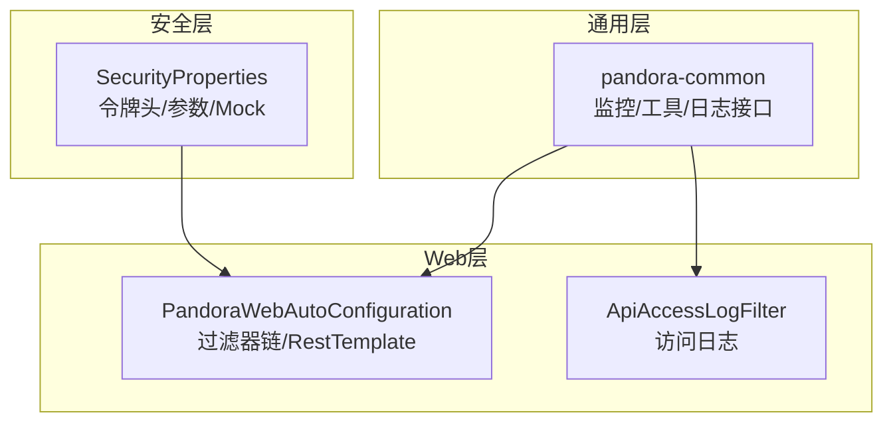
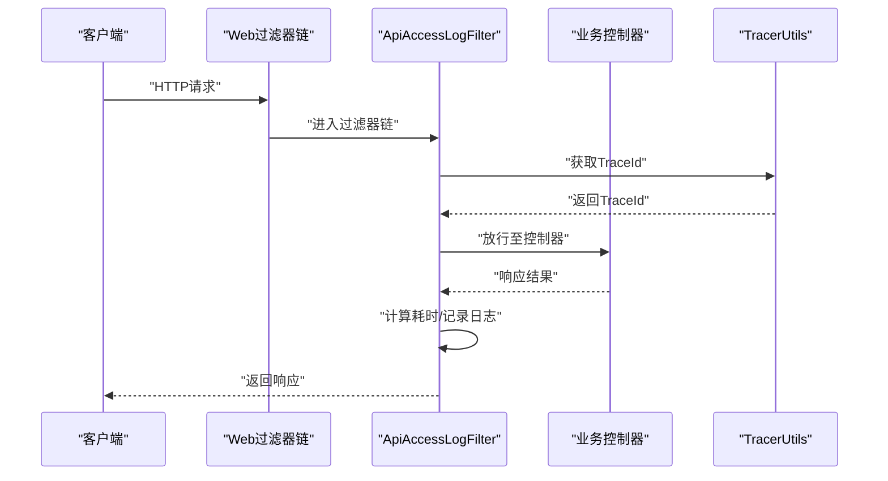
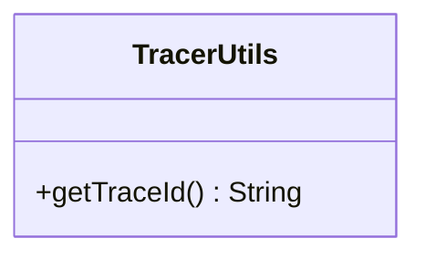
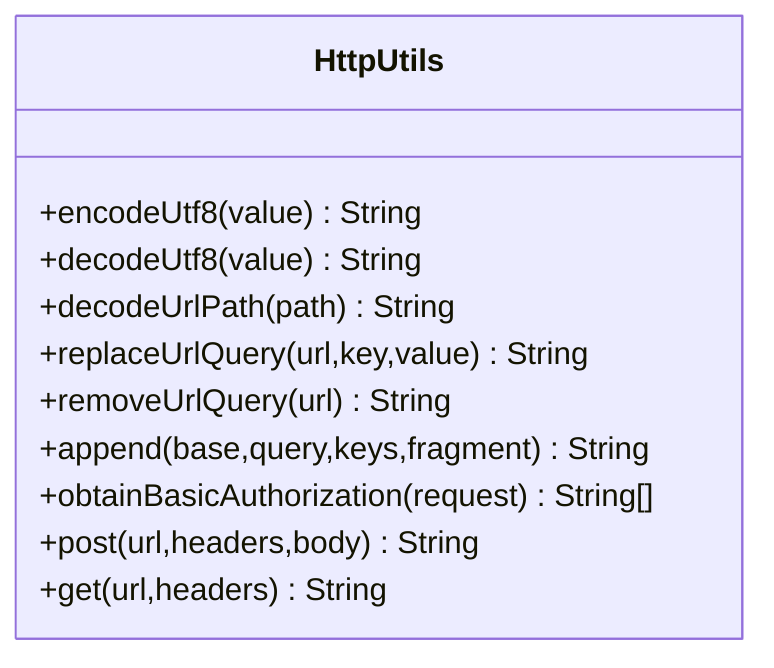
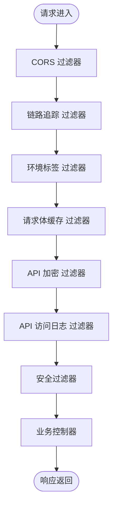
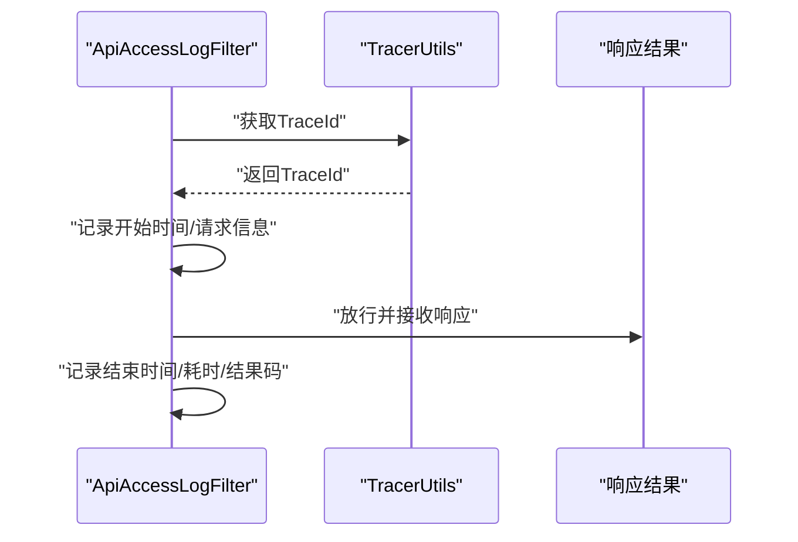
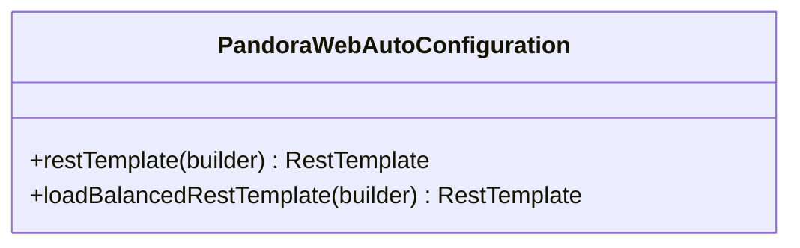
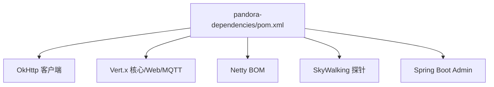

# 网络性能诊断

<cite>
**本文引用的文件**
- [TracerUtils.java](file://pandora-framework/pandora-common/src/main/java/net/ittimeline/pandora/framework/common/util/web/monitor/TracerUtils.java)
- [HttpUtils.java](file://pandora-framework/pandora-common/src/main/java/net/ittimeline/pandora/framework/common/util/web/http/HttpUtils.java)
- [PandoraWebAutoConfiguration.java](file://pandora-framework/pandora-spring-boot-starter-web/src/main/java/net/ittimeline/pandora/framework/web/config/PandoraWebAutoConfiguration.java)
- [WebFilterOrderConstants.java](file://pandora-framework/pandora-common/src/main/java/net/ittimeline/pandora/framework/common/constants/WebFilterOrderConstants.java)
- [ApiAccessLogFilter.java](file://pandora-framework/pandora-spring-boot-starter-web/src/main/java/net/ittimeline/pandora/framework/apilog/core/filter/ApiAccessLogFilter.java)
- [ApiAccessLogCommonApi.java](file://pandora-framework/pandora-common/src/main/java/net/ittimeline/pandora/framework/common/biz/infra/logger/ApiAccessLogCommonApi.java)
- [SecurityProperties.java](file://pandora-framework/pandora-spring-boot-starter-security/src/main/java/net/ittimeline/pandora/framework/security/config/SecurityProperties.java)
- [ApiEncryptProperties.java](file://pandora-framework/pandora-spring-boot-starter-web/src/main/java/net/ittimeline/pandora/framework/encrypt/config/ApiEncryptProperties.java)
- [ApiDecryptRequestWrapper.java](file://pandora-framework/pandora-spring-boot-starter-web/src/main/java/net/ittimeline/pandora/framework/encrypt/core/filter/ApiDecryptRequestWrapper.java)
- [pandora-dependencies/pom.xml](file://pandora-dependencies/pom.xml)
</cite>

## 目录
1. [简介](#简介)
2. [项目结构](#项目结构)
3. [核心组件](#核心组件)
4. [架构总览](#架构总览)
5. [详细组件分析](#详细组件分析)
6. [依赖分析](#依赖分析)
7. [性能考量](#性能考量)
8. [故障排查指南](#故障排查指南)
9. [结论](#结论)
10. [附录](#附录)

## 简介
本指南聚焦于Pandora Cloud框架在HTTP请求处理过程中的网络性能问题，围绕请求响应时间、连接建立耗时、数据传输效率等关键指标进行系统性诊断与优化。文档重点讲解TracerUtils在分布式链路追踪中的作用，并结合框架内过滤器链、日志与监控集成点，给出HTTP客户端配置、连接池参数调优、SSL握手优化的实操建议。同时提供网络监控工具使用、性能基准测试方法与常见网络问题的排查步骤，帮助快速定位与缓解网络延迟。

## 项目结构
Pandora Cloud采用多模块组织方式，网络相关能力主要分布在以下模块：
- pandora-common：通用工具与监控（如TracerUtils、HttpUtils、日志接口）
- pandora-spring-boot-starter-web：Web自动装配、过滤器链、全局异常与响应处理器、RestTemplate配置
- pandora-spring-boot-starter-security：安全配置（含令牌头、Mock模式等）

**图表来源**
- [PandoraWebAutoConfiguration.java:116-176](file://pandora-framework/pandora-spring-boot-starter-web/src/main/java/net/ittimeline/pandora/framework/web/config/PandoraWebAutoConfiguration.java#L116-L176)
- [ApiAccessLogFilter.java:114-145](file://pandora-framework/pandora-spring-boot-starter-web/src/main/java/net/ittimeline/pandora/framework/apilog/core/filter/ApiAccessLogFilter.java#L114-L145)
- [TracerUtils.java:26-28](file://pandora-framework/pandora-common/src/main/java/net/ittimeline/pandora/framework/common/util/web/monitor/TracerUtils.java#L26-L28)
- [SecurityProperties.java:24-34](file://pandora-framework/pandora-spring-boot-starter-security/src/main/java/net/ittimeline/pandora/framework/security/config/SecurityProperties.java#L24-L34)

**章节来源**
- [PandoraWebAutoConfiguration.java:43-91](file://pandora-framework/pandora-spring-boot-starter-web/src/main/java/net/ittimeline/pandora/framework/web/config/PandoraWebAutoConfiguration.java#L43-L91)
- [WebFilterOrderConstants.java:11-37](file://pandora-framework/pandora-common/src/main/java/net/ittimeline/pandora/framework/common/constants/WebFilterOrderConstants.java#L11-L37)

## 核心组件
- TracerUtils：提供SkyWalking TraceId获取，贯穿请求生命周期，便于跨服务链路定位网络延迟。
- HttpUtils：封装URL编解码、参数拼接、Basic认证提取与HTTP GET/POST调用，便于在业务中统一网络请求行为。
- Web过滤器链：CORS、请求体缓存、API访问日志、XSS防护、安全过滤器等，顺序由常量控制，直接影响请求处理时延。
- API访问日志：在过滤器中采集traceId、请求耗时、结果码等，形成性能观测基线。
- RestTemplate配置：提供普通与负载均衡两种实例，便于外部HTTP调用的统一与可扩展。

**章节来源**
- [TracerUtils.java:20-28](file://pandora-framework/pandora-common/src/main/java/net/ittimeline/pandora/framework/common/util/web/monitor/TracerUtils.java#L20-L28)
- [HttpUtils.java:167-201](file://pandora-framework/pandora-common/src/main/java/net/ittimeline/pandora/framework/common/util/web/http/HttpUtils.java#L167-L201)
- [PandoraWebAutoConfiguration.java:116-176](file://pandora-framework/pandora-spring-boot-starter-web/src/main/java/net/ittimeline/pandora/framework/web/config/PandoraWebAutoConfiguration.java#L116-L176)
- [ApiAccessLogFilter.java:114-145](file://pandora-framework/pandora-spring-boot-starter-web/src/main/java/net/ittimeline/pandora/framework/apilog/core/filter/ApiAccessLogFilter.java#L114-L145)

## 架构总览
下图展示一次典型HTTP请求在Pandora框架内的处理流程，强调TracerId注入、过滤器链顺序与访问日志采集的关键节点。

**图表来源**
- [ApiAccessLogFilter.java:114-145](file://pandora-framework/pandora-spring-boot-starter-web/src/main/java/net/ittimeline/pandora/framework/apilog/core/filter/ApiAccessLogFilter.java#L114-L145)
- [TracerUtils.java:26-28](file://pandora-framework/pandora-common/src/main/java/net/ittimeline/pandora/framework/common/util/web/monitor/TracerUtils.java#L26-L28)

## 详细组件分析

### 组件一：TracerUtils与链路追踪
- 作用：提供SkyWalking TraceId获取，贯穿请求生命周期，便于跨服务链路定位网络延迟。
- 使用场景：在访问日志、操作日志、异步任务等处注入traceId，形成端到端链路。
- 性能意义：通过统一traceId，可在APM面板按Trace维度聚合请求耗时，快速识别慢调用环节。

**图表来源**
- [TracerUtils.java:20-28](file://pandora-framework/pandora-common/src/main/java/net/ittimeline/pandora/framework/common/util/web/monitor/TracerUtils.java#L20-L28)

**章节来源**
- [TracerUtils.java:20-28](file://pandora-framework/pandora-common/src/main/java/net/ittimeline/pandora/framework/common/util/web/monitor/TracerUtils.java#L20-L28)
- [ApiAccessLogFilter.java:128-128](file://pandora-framework/pandora-spring-boot-starter-web/src/main/java/net/ittimeline/pandora/framework/apilog/core/filter/ApiAccessLogFilter.java#L128-L128)

### 组件二：HTTP客户端与工具（HttpUtils）
- 功能要点：
  - URL参数编码/解码、路径解码、URL拼接与查询参数替换。
  - Basic认证提取（Header或参数）。
  - HTTP GET/POST封装，支持自定义headers与请求体。
- 性能意义：统一HTTP调用入口，便于集中优化连接复用、超时与压缩策略。

**图表来源**
- [HttpUtils.java:27-201](file://pandora-framework/pandora-common/src/main/java/net/ittimeline/pandora/framework/common/util/web/http/HttpUtils.java#L27-L201)

**章节来源**
- [HttpUtils.java:27-201](file://pandora-framework/pandora-common/src/main/java/net/ittimeline/pandora/framework/common/util/web/http/HttpUtils.java#L27-L201)

### 组件三：Web过滤器链与顺序（WebFilterOrderConstants）
- 关键点：过滤器顺序严格定义，确保CORS、请求体缓存、API访问日志、安全过滤器等按预期执行。
- 性能意义：错误的顺序可能导致重复读取、日志缺失或安全风险，进而影响整体时延与可观测性。

**图表来源**
- [WebFilterOrderConstants.java:11-37](file://pandora-framework/pandora-common/src/main/java/net/ittimeline/pandora/framework/common/constants/WebFilterOrderConstants.java#L11-L37)
- [PandoraWebAutoConfiguration.java:116-176](file://pandora-framework/pandora-spring-boot-starter-web/src/main/java/net/ittimeline/pandora/framework/web/config/PandoraWebAutoConfiguration.java#L116-L176)

**章节来源**
- [WebFilterOrderConstants.java:11-37](file://pandora-framework/pandora-common/src/main/java/net/ittimeline/pandora/framework/common/constants/WebFilterOrderConstants.java#L11-L37)
- [PandoraWebAutoConfiguration.java:116-176](file://pandora-framework/pandora-spring-boot-starter-web/src/main/java/net/ittimeline/pandora/framework/web/config/PandoraWebAutoConfiguration.java#L116-L176)

### 组件四：API访问日志（ApiAccessLogFilter）
- 关键采集项：traceId、应用名、请求URL、方法、UA、IP、开始/结束时间、耗时、结果码/消息。
- 性能意义：为定位网络延迟提供“时间轴”，结合TraceId可跨服务对比各阶段耗时。

**图表来源**
- [ApiAccessLogFilter.java:114-145](file://pandora-framework/pandora-spring-boot-starter-web/src/main/java/net/ittimeline/pandora/framework/apilog/core/filter/ApiAccessLogFilter.java#L114-L145)
- [TracerUtils.java:26-28](file://pandora-framework/pandora-common/src/main/java/net/ittimeline/pandora/framework/common/util/web/monitor/TracerUtils.java#L26-L28)

**章节来源**
- [ApiAccessLogFilter.java:114-145](file://pandora-framework/pandora-spring-boot-starter-web/src/main/java/net/ittimeline/pandora/framework/apilog/core/filter/ApiAccessLogFilter.java#L114-L145)

### 组件五：RestTemplate与负载均衡
- 提供普通与带负载均衡的RestTemplate Bean，便于对外部服务发起HTTP请求时统一配置与复用。
- 性能意义：通过共享连接池、合理超时与重试策略，降低连接建立与TLS握手成本。

**图表来源**
- [PandoraWebAutoConfiguration.java:159-175](file://pandora-framework/pandora-spring-boot-starter-web/src/main/java/net/ittimeline/pandora/framework/web/config/PandoraWebAutoConfiguration.java#L159-L175)

**章节来源**
- [PandoraWebAutoConfiguration.java:159-175](file://pandora-framework/pandora-spring-boot-starter-web/src/main/java/net/ittimeline/pandora/framework/web/config/PandoraWebAutoConfiguration.java#L159-L175)

### 组件六：安全与令牌传递（SecurityProperties）
- 关键配置：令牌请求头、令牌参数、Mock开关与密钥、免登录URL列表、密码编码复杂度。
- 性能意义：合理的令牌传递与校验策略可减少无效请求与鉴权失败重试，间接提升吞吐。

**章节来源**
- [SecurityProperties.java:24-56](file://pandora-framework/pandora-spring-boot-starter-security/src/main/java/net/ittimeline/pandora/framework/security/config/SecurityProperties.java#L24-L56)

### 组件七：API加解密（ApiEncryptProperties 与 ApiDecryptRequestWrapper）
- 关键配置：是否启用、加密算法（对称/非对称）、请求/响应密钥头名。
- 请求包装：对请求体进行对称或非对称解密，影响首包处理时延。
- 性能意义：加密/解密CPU开销显著，需结合算法选择与密钥长度平衡安全与性能。

**章节来源**
- [ApiEncryptProperties.java:22-72](file://pandora-framework/pandora-spring-boot-starter-web/src/main/java/net/ittimeline/pandora/framework/encrypt/config/ApiEncryptProperties.java#L22-L72)
- [ApiDecryptRequestWrapper.java:25-40](file://pandora-framework/pandora-spring-boot-starter-web/src/main/java/net/ittimeline/pandora/framework/encrypt/core/filter/ApiDecryptRequestWrapper.java#L25-L40)

## 依赖分析
- 网络通信栈：OkHttp、Vert.x、Netty、CoAP、MQTT、SSH/SFTP等，满足多样化网络需求。
- 链路追踪：SkyWalking探针版本管理，TracerUtils基于SkyWalking Toolkit。
- 监控：Spring Boot Admin版本管理，配合APM进行端到端观测。

**图表来源**
- [pandora-dependencies/pom.xml:341-387](file://pandora-dependencies/pom.xml#L341-L387)
- [pandora-dependencies/pom.xml:50-54](file://pandora-dependencies/pom.xml#L50-L54)

**章节来源**
- [pandora-dependencies/pom.xml:341-387](file://pandora-dependencies/pom.xml#L341-L387)
- [pandora-dependencies/pom.xml:50-54](file://pandora-dependencies/pom.xml#L50-L54)

## 性能考量
- 请求响应时间
  - 通过ApiAccessLogFilter记录开始/结束时间与耗时，结合TracerId在APM中定位慢调用。
  - 优化建议：减少过滤器链中阻塞操作、避免重复读取请求体、合理缓存静态资源。
- 连接建立耗时
  - 使用RestTemplate共享连接池，设置合理的连接超时、读取超时与最大空闲连接数。
  - 优化建议：启用HTTP/2（若服务端支持）、复用连接、减少不必要的短连接。
- 数据传输效率
  - 在HttpUtils中统一参数编码与URL拼接，避免冗余参数导致包体增大。
  - 优化建议：启用Gzip压缩、合理分页与字段裁剪、避免大对象序列化。
- SSL握手优化
  - 使用OkHttp/Netty的TLS优化参数（如启用会话复用、设置合适的协议与密码套件）。
  - 优化建议：预热TLS会话、减少握手次数、升级到更高效的密码套件。
- HTTP客户端配置
  - 通过RestTemplate Bean集中配置连接池、超时、重试与拦截器。
  - 优化建议：针对上游服务设置差异化超时与重试策略，避免级联阻塞。
- 过滤器链顺序
  - 严格遵循WebFilterOrderConstants定义的顺序，避免重复处理与日志缺失。
  - 优化建议：将轻量过滤器前置，重过滤器（如加解密）按需启用并缓存结果。

[本节为通用指导，无需特定文件引用]

## 故障排查指南
- 链路追踪缺失
  - 确认TracerUtils可用且SkyWalking探针已加载。
  - 检查ApiAccessLogFilter是否正确注入traceId并记录耗时。
- 请求体读取异常
  - 确认请求体缓存过滤器顺序正确，避免多次读取失败。
  - 若启用API加解密，检查密钥与算法配置是否一致。
- 令牌传递问题
  - 核对SecurityProperties中的tokenHeader与tokenParameter配置。
  - 检查Mock模式开关与密钥，避免误判为生产环境。
- 日志未记录或耗时不准确
  - 检查ApiAccessLogFilter是否启用，确认过滤器顺序与异常处理器未提前中断。
  - 确认时间计算逻辑与数据库写入异步策略（异步写日志不影响请求耗时统计）。

**章节来源**
- [TracerUtils.java:26-28](file://pandora-framework/pandora-common/src/main/java/net/ittimeline/pandora/framework/common/util/web/monitor/TracerUtils.java#L26-L28)
- [ApiAccessLogFilter.java:114-145](file://pandora-framework/pandora-spring-boot-starter-web/src/main/java/net/ittimeline/pandora/framework/apilog/core/filter/ApiAccessLogFilter.java#L114-L145)
- [WebFilterOrderConstants.java:11-37](file://pandora-framework/pandora-common/src/main/java/net/ittimeline/pandora/framework/common/constants/WebFilterOrderConstants.java#L11-L37)
- [SecurityProperties.java:24-56](file://pandora-framework/pandora-spring-boot-starter-security/src/main/java/net/ittimeline/pandora/framework/security/config/SecurityProperties.java#L24-L56)
- [ApiEncryptProperties.java:22-72](file://pandora-framework/pandora-spring-boot-starter-web/src/main/java/net/ittimeline/pandora/framework/encrypt/config/ApiEncryptProperties.java#L22-L72)

## 结论
通过对Pandora Cloud框架的过滤器链、链路追踪与HTTP工具的系统梳理，可以将网络性能问题的定位与优化聚焦在“请求生命周期观测—过滤器链顺序—HTTP客户端配置—TLS与连接池优化”四个关键维度。结合TracerUtils与ApiAccessLogFilter，能够快速形成端到端的性能画像；通过RestTemplate与OkHttp的统一配置，可有效降低连接建立与传输成本；在安全与加解密方面，合理的算法与密钥配置能在保障安全的同时兼顾性能。

[本节为总结性内容，无需特定文件引用]

## 附录
- 性能基准测试方法
  - 使用JMeter/LoadRunner等工具模拟并发请求，关注P95/P99延迟与错误率。
  - 在不同网络环境下（本地/跨机房/跨地域）对比链路耗时与连接建立时间。
- 监控工具使用
  - 结合SkyWalking查看Trace详情，定位慢SQL、慢外部调用与慢过滤器。
  - 使用Spring Boot Admin与Prometheus/Grafana观察JVM与HTTP指标。
- 常见问题清单
  - 过滤器顺序不当导致日志缺失或重复处理。
  - 令牌头/参数配置错误引发鉴权失败与重试。
  - 加解密算法过于保守导致首包延迟显著增加。
  - TLS握手频繁导致连接建立耗时高。

[本节为通用指导，无需特定文件引用]