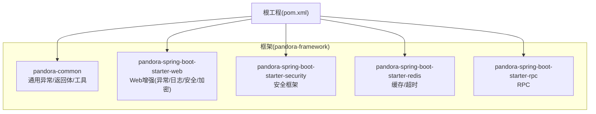
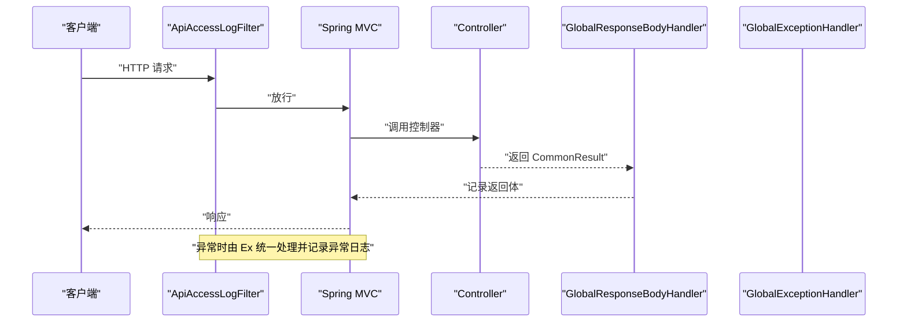
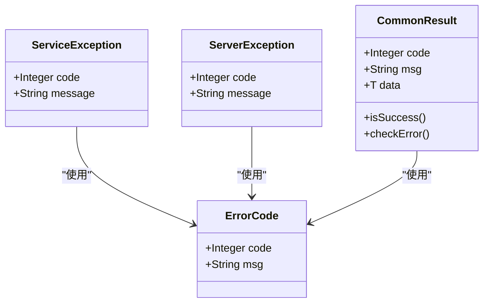
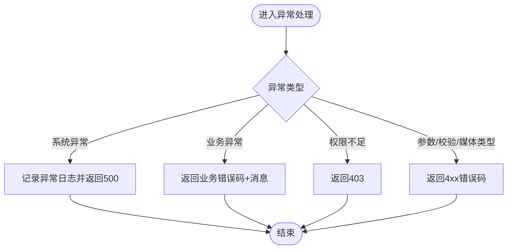
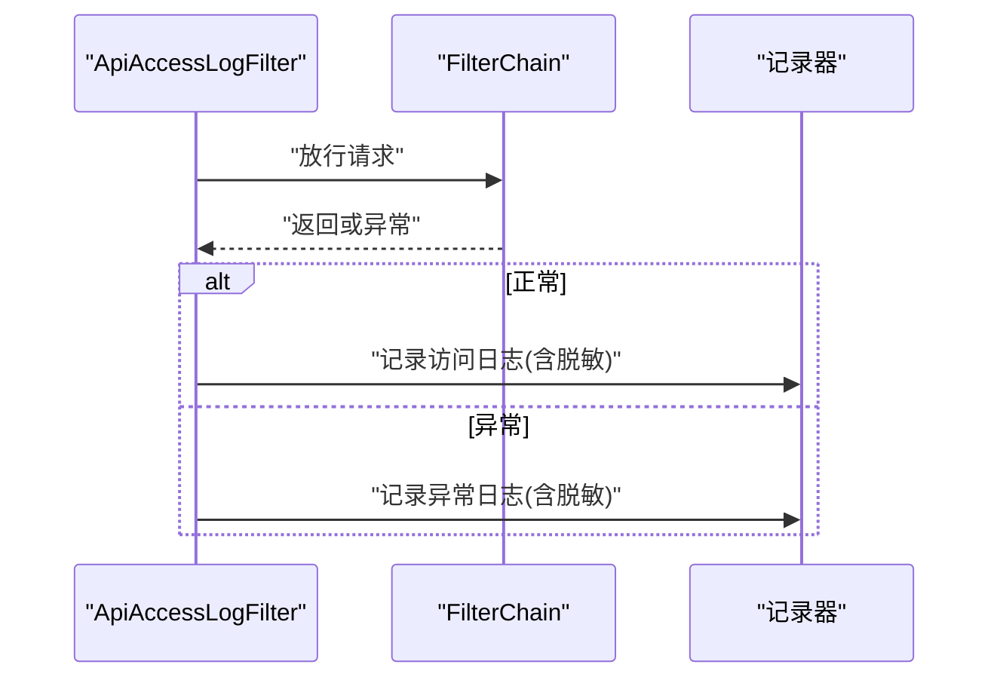
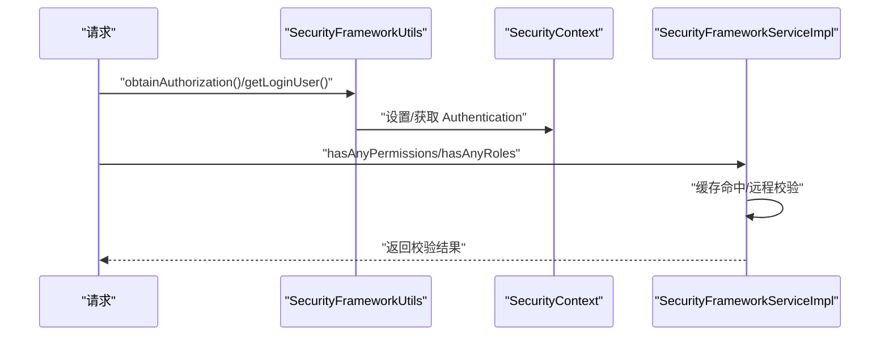
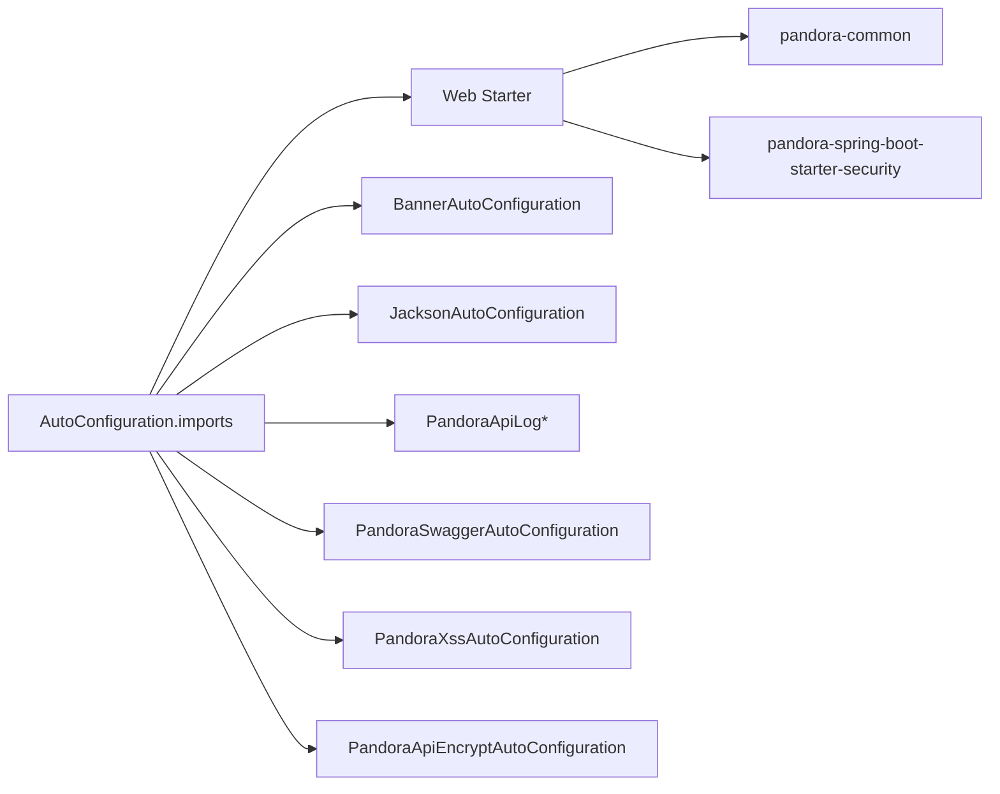

# 故障排除

<cite>
**本文引用的文件**
- [README.md](file://README.md)
- [AutoTransable.java](file://pandora-framework/pandora-common/src/main/java/com/fhs/trans/service/AutoTransable.java)
- [ErrorCode.java](file://pandora-framework/pandora-common/src/main/java/net/ittimeline/pandora/framework/common/exception/ErrorCode.java)
- [ServerException.java](file://pandora-framework/pandora-common/src/main/java/net/ittimeline/pandora/framework/common/exception/ServerException.java)
- [ServiceException.java](file://pandora-framework/pandora-common/src/main/java/net/ittimeline/pandora/framework/common/exception/ServiceException.java)
- [CommonResult.java](file://pandora-framework/pandora-common/src/main/java/net/ittimeline/pandora/framework/common/pojo/CommonResult.java)
- [GlobalErrorCodeConstants.java](file://pandora-framework/pandora-common/src/main/java/net/ittimeline/pandora/framework/common/exception/enums/GlobalErrorCodeConstants.java)
- [ServiceExceptionUtil.java](file://pandora-framework/pandora-common/src/main/java/net/ittimeline/pandora/framework/common/exception/util/ServiceExceptionUtil.java)
- [GlobalExceptionHandler.java](file://pandora-framework/pandora-spring-boot-starter-web/src/main/java/net/ittimeline/pandora/framework/web/core/handler/GlobalExceptionHandler.java)
- [GlobalResponseBodyHandler.java](file://pandora-framework/pandora-spring-boot-starter-web/src/main/java/net/ittimeline/pandora/framework/web/core/handler/GlobalResponseBodyHandler.java)
- [ApiAccessLogFilter.java](file://pandora-framework/pandora-spring-boot-starter-web/src/main/java/net/ittimeline/pandora/framework/apilog/core/filter/ApiAccessLogFilter.java)
- [ApiRequestFilter.java](file://pandora-framework/pandora-spring-boot-starter-web/src/main/java/net/ittimeline/pandora/framework/web/core/filter/ApiRequestFilter.java)
- [SecurityFrameworkServiceImpl.java](file://pandora-framework/pandora-spring-boot-starter-security/src/main/java/net/ittimeline/pandora/framework/security/core/service/SecurityFrameworkServiceImpl.java)
- [SecurityFrameworkUtils.java](file://pandora-framework/pandora-spring-boot-starter-security/src/main/java/net/ittimeline/pandora/framework/security/core/util/SecurityFrameworkUtils.java)
- [TracerUtils.java](file://pandora-framework/pandora-common/src/main/java/net/ittimeline/pandora/framework/common/util/web/monitor/TracerUtils.java)
- [org.springframework.boot.autoconfigure.AutoConfiguration.imports](file://pandora-framework/pandora-spring-boot-starter-web/src/main/resources/META-INF/spring/org.springframework.boot.autoconfigure.AutoConfiguration.imports)
</cite>

## 目录
1. [简介](#简介)
2. [项目结构](#项目结构)
3. [核心组件](#核心组件)
4. [架构总览](#架构总览)
5. [详细组件分析](#详细组件分析)
6. [依赖分析](#依赖分析)
7. [性能考虑](#性能考虑)
8. [故障排除指南](#故障排除指南)
9. [结论](#结论)
10. [附录](#附录)

## 简介
本指南面向使用 Pandora Cloud 框架的开发者与运维人员，聚焦于常见问题的定位与解决，覆盖配置错误、运行时异常、性能问题与集成故障；提供调试技巧、日志分析方法、问题诊断流程、错误码解释、可能原因与修复步骤，并区分开发与生产环境的差异策略。同时给出性能瓶颈识别、内存泄漏检测与并发问题排查建议，以及监控指标与告警处理最佳实践。

## 项目结构
Pandora Cloud 采用多模块分层设计：
- pandora-dependencies：BOM 管理依赖版本
- pandora-framework：框架封装与各子启动器
  - pandora-common：通用异常、返回体、工具类
  - pandora-spring-boot-starter-web：Web 增强（全局异常、访问日志、XSS、加密、Swagger、Banner 等）
  - pandora-spring-boot-starter-security：安全框架（鉴权、权限、登录用户上下文）
  - pandora-spring-boot-starter-redis：缓存与超时策略
  - pandora-spring-boot-starter-rpc：RPC 相关（占位）

图表来源
- [README.md:1-15](file://README.md#L1-L15)

章节来源
- [README.md:1-15](file://README.md#L1-L15)

## 核心组件
- 通用异常与返回体
  - 错误码对象与全局错误码常量，统一错误语义与范围
  - 业务异常与服务端异常，支持格式化消息模板
  - 通用返回体，封装 code/msg/data，并提供检查与转换
- Web 层增强
  - 全局异常处理器，统一捕获各类异常并转为通用返回
  - 全局响应处理器，记录返回体供访问日志使用
  - API 访问日志过滤器，异步落库并脱敏敏感字段
  - 请求过滤基类，按路径前缀过滤 API 请求
- 安全框架
  - 权限/角色/域校验服务，含缓存与跨租户跳权限逻辑
  - 安全上下文工具，提取 Token、当前用户、设置登录用户
- 链路追踪
  - 统一获取 SkyWalking TraceId，贯穿日志与访问日志

章节来源
- [ErrorCode.java:1-33](file://pandora-framework/pandora-common/src/main/java/net/ittimeline/pandora/framework/common/exception/ErrorCode.java#L1-L33)
- [GlobalErrorCodeConstants.java:1-42](file://pandora-framework/pandora-common/src/main/java/net/ittimeline/pandora/framework/common/exception/enums/GlobalErrorCodeConstants.java#L1-L42)
- [ServiceException.java:1-64](file://pandora-framework/pandora-common/src/main/java/net/ittimeline/pandora/framework/common/exception/ServiceException.java#L1-L64)
- [ServerException.java:1-65](file://pandora-framework/pandora-common/src/main/java/net/ittimeline/pandora/framework/common/exception/ServerException.java#L1-L65)
- [CommonResult.java:1-123](file://pandora-framework/pandora-common/src/main/java/net/ittimeline/pandora/framework/common/pojo/CommonResult.java#L1-L123)
- [ServiceExceptionUtil.java:1-85](file://pandora-framework/pandora-common/src/main/java/net/ittimeline/pandora/framework/common/exception/util/ServiceExceptionUtil.java#L1-L85)
- [GlobalExceptionHandler.java:1-454](file://pandora-framework/pandora-spring-boot-starter-web/src/main/java/net/ittimeline/pandora/framework/web/core/handler/GlobalExceptionHandler.java#L1-L454)
- [GlobalResponseBodyHandler.java:1-47](file://pandora-framework/pandora-spring-boot-starter-web/src/main/java/net/ittimeline/pandora/framework/web/core/handler/GlobalResponseBodyHandler.java#L1-L47)
- [ApiAccessLogFilter.java:1-255](file://pandora-framework/pandora-spring-boot-starter-web/src/main/java/net/ittimeline/pandora/framework/apilog/core/filter/ApiAccessLogFilter.java#L1-L255)
- [ApiRequestFilter.java:1-27](file://pandora-framework/pandora-spring-boot-starter-web/src/main/java/net/ittimeline/pandora/framework/web/core/filter/ApiRequestFilter.java#L1-L27)
- [SecurityFrameworkServiceImpl.java:1-124](file://pandora-framework/pandora-spring-boot-starter-security/src/main/java/net/ittimeline/pandora/framework/security/core/service/SecurityFrameworkServiceImpl.java#L1-L124)
- [SecurityFrameworkUtils.java:1-163](file://pandora-framework/pandora-spring-boot-starter-security/src/main/java/net/ittimeline/pandora/framework/security/core/util/SecurityFrameworkUtils.java#L1-L163)
- [TracerUtils.java:1-30](file://pandora-framework/pandora-common/src/main/java/net/ittimeline/pandora/framework/common/util/web/monitor/TracerUtils.java#L1-L30)

## 架构总览
Web 请求在进入控制器前经过一系列过滤器与拦截器，异常由全局异常处理器统一捕获并格式化返回；访问日志在请求完成后异步记录，包含脱敏与耗时统计；安全上下文在登录后注入，权限校验基于缓存与远程接口；链路追踪 ID 统一采集，便于跨服务串联。

图表来源
- [ApiAccessLogFilter.java:66-86](file://pandora-framework/pandora-spring-boot-starter-web/src/main/java/net/ittimeline/pandora/framework/apilog/core/filter/ApiAccessLogFilter.java#L66-L86)
- [GlobalResponseBodyHandler.java:25-46](file://pandora-framework/pandora-spring-boot-starter-web/src/main/java/net/ittimeline/pandora/framework/web/core/handler/GlobalResponseBodyHandler.java#L25-L46)
- [GlobalExceptionHandler.java:57-120](file://pandora-framework/pandora-spring-boot-starter-web/src/main/java/net/ittimeline/pandora/framework/web/core/handler/GlobalExceptionHandler.java#L57-L120)

## 详细组件分析

### 异常与返回体体系
- 错误码与异常
  - 全局错误码常量定义了客户端/服务端/自定义错误区间
  - 业务异常与服务端异常承载 code/message，支持从错误码对象构造
  - 通用返回体封装 code/msg/data，提供检查与转换方法，便于统一对外输出
- 异常格式化
  - 工具类支持占位符格式化，避免参数不匹配导致异常，同时记录日志便于定位

图表来源
- [ErrorCode.java:18-32](file://pandora-framework/pandora-common/src/main/java/net/ittimeline/pandora/framework/common/exception/ErrorCode.java#L18-L32)
- [ServiceException.java:15-63](file://pandora-framework/pandora-common/src/main/java/net/ittimeline/pandora/framework/common/exception/ServiceException.java#L15-L63)
- [ServerException.java:16-64](file://pandora-framework/pandora-common/src/main/java/net/ittimeline/pandora/framework/common/exception/ServerException.java#L16-L64)
- [CommonResult.java:22-122](file://pandora-framework/pandora-common/src/main/java/net/ittimeline/pandora/framework/common/pojo/CommonResult.java#L22-L122)

章节来源
- [GlobalErrorCodeConstants.java:16-41](file://pandora-framework/pandora-common/src/main/java/net/ittimeline/pandora/framework/common/exception/enums/GlobalErrorCodeConstants.java#L16-L41)
- [ServiceExceptionUtil.java:30-82](file://pandora-framework/pandora-common/src/main/java/net/ittimeline/pandora/framework/common/exception/util/ServiceExceptionUtil.java#L30-L82)
- [CommonResult.java:50-122](file://pandora-framework/pandora-common/src/main/java/net/ittimeline/pandora/framework/common/pojo/CommonResult.java#L50-L122)

### 全局异常处理流程
- 捕获范围广：参数缺失/类型不匹配/校验失败/上传超限/资源不存在/方法/媒体类型不支持/权限不足/业务异常/系统异常
- 业务异常：仅记录一次关键堆栈，避免日志刷屏
- 系统异常：记录异常日志并返回统一错误码
- 特殊场景：根据根因消息匹配模块未启用/表不存在等提示

图表来源
- [GlobalExceptionHandler.java:127-341](file://pandora-framework/pandora-spring-boot-starter-web/src/main/java/net/ittimeline/pandora/framework/web/core/handler/GlobalExceptionHandler.java#L127-L341)

章节来源
- [GlobalExceptionHandler.java:57-454](file://pandora-framework/pandora-spring-boot-starter-web/src/main/java/net/ittimeline/pandora/framework/web/core/handler/GlobalExceptionHandler.java#L57-L454)

### 访问日志与脱敏
- 记录维度：用户、请求、响应、耗时、操作类型、模块名称、TraceId
- 脱敏策略：移除 password/token 等关键字，支持注解指定额外脱敏键
- 异常与正常路径均记录，避免遗漏

图表来源
- [ApiAccessLogFilter.java:66-100](file://pandora-framework/pandora-spring-boot-starter-web/src/main/java/net/ittimeline/pandora/framework/apilog/core/filter/ApiAccessLogFilter.java#L66-L100)
- [ApiAccessLogFilter.java:187-252](file://pandora-framework/pandora-spring-boot-starter-web/src/main/java/net/ittimeline/pandora/framework/apilog/core/filter/ApiAccessLogFilter.java#L187-L252)

章节来源
- [ApiAccessLogFilter.java:52-255](file://pandora-framework/pandora-spring-boot-starter-web/src/main/java/net/ittimeline/pandora/framework/apilog/core/filter/ApiAccessLogFilter.java#L52-L255)

### 安全上下文与权限校验
- 登录用户上下文：从请求中解析 Token，构建 Authentication 并放入 SecurityContext 与请求属性
- 权限校验：支持角色/权限/域校验，含跨租户跳权限逻辑与缓存
- 工具类：提供获取当前用户、用户ID、昵称、部门ID等便捷方法

图表来源
- [SecurityFrameworkUtils.java:44-136](file://pandora-framework/pandora-spring-boot-starter-security/src/main/java/net/ittimeline/pandora/framework/security/core/util/SecurityFrameworkUtils.java#L44-L136)
- [SecurityFrameworkServiceImpl.java:36-101](file://pandora-framework/pandora-spring-boot-starter-security/src/main/java/net/ittimeline/pandora/framework/security/core/service/SecurityFrameworkServiceImpl.java#L36-L101)

章节来源
- [SecurityFrameworkUtils.java:26-163](file://pandora-framework/pandora-spring-boot-starter-security/src/main/java/net/ittimeline/pandora/framework/security/core/util/SecurityFrameworkUtils.java#L26-L163)
- [SecurityFrameworkServiceImpl.java:29-124](file://pandora-framework/pandora-spring-boot-starter-security/src/main/java/net/ittimeline/pandora/framework/security/core/service/SecurityFrameworkServiceImpl.java#L29-L124)

### 链路追踪
- 统一获取 TraceId，便于日志与访问日志关联
- 与访问日志、异常日志共同形成端到端追踪

章节来源
- [TracerUtils.java:12-28](file://pandora-framework/pandora-common/src/main/java/net/ittimeline/pandora/framework/common/util/web/monitor/TracerUtils.java#L12-L28)
- [ApiAccessLogFilter.java:128](file://pandora-framework/pandora-spring-boot-starter-web/src/main/java/net/ittimeline/pandora/framework/apilog/core/filter/ApiAccessLogFilter.java#L128)
- [GlobalExceptionHandler.java:374](file://pandora-framework/pandora-spring-boot-starter-web/src/main/java/net/ittimeline/pandora/framework/web/core/handler/GlobalExceptionHandler.java#L374)

## 依赖分析
- Web 启动器自动装配清单包含 Banner、Jackson、Web、API 日志、Swagger、XSS、加密等配置
- Web 层依赖 common 的异常与返回体、工具类；安全层依赖 web 的上下文工具与权限 API

图表来源
- [org.springframework.boot.autoconfigure.AutoConfiguration.imports:1-8](file://pandora-framework/pandora-spring-boot-starter-web/src/main/resources/META-INF/spring/org.springframework.boot.autoconfigure.AutoConfiguration.imports#L1-L8)

章节来源
- [org.springframework.boot.autoconfigure.AutoConfiguration.imports:1-8](file://pandora-framework/pandora-spring-boot-starter-web/src/main/resources/META-INF/spring/org.springframework.boot.autoconfigure.AutoConfiguration.imports#L1-L8)

## 性能考虑
- 异常处理
  - 业务异常仅记录一次关键堆栈，避免日志风暴
  - 系统异常统一兜底并异步记录异常日志
- 访问日志
  - 异步落库，避免阻塞主线程
  - 脱敏处理在 JSON 层进行，失败则降级忽略，不影响请求
- 权限校验
  - 使用 LoadingCache 缓存权限/角色校验结果，减少远程调用
  - 跨租户访问时跳过权限校验，降低分支成本
- 序列化与格式化
  - 通用返回体与异常格式化采用预分配容量的字符串构建，减少扩容开销

章节来源
- [GlobalExceptionHandler.java:300-316](file://pandora-framework/pandora-spring-boot-starter-web/src/main/java/net/ittimeline/pandora/framework/web/core/handler/GlobalExceptionHandler.java#L300-L316)
- [ApiAccessLogFilter.java:96-99](file://pandora-framework/pandora-spring-boot-starter-web/src/main/java/net/ittimeline/pandora/framework/apilog/core/filter/ApiAccessLogFilter.java#L96-L99)
- [SecurityFrameworkServiceImpl.java:36-59](file://pandora-framework/pandora-spring-boot-starter-security/src/main/java/net/ittimeline/pandora/framework/security/core/service/SecurityFrameworkServiceImpl.java#L36-L59)
- [ServiceExceptionUtil.java:50-82](file://pandora-framework/pandora-common/src/main/java/net/ittimeline/pandora/framework/common/exception/util/ServiceExceptionUtil.java#L50-L82)

## 故障排除指南

### 一、配置错误
- 症状
  - 请求方法不正确、媒体类型不支持、参数缺失/类型不匹配、参数校验失败
  - 资源不存在、上传文件过大
- 诊断
  - 查看全局异常处理器对相应异常类型的处理分支
  - 核对 Web 层自动装配与相关开关
- 修复
  - 调整客户端请求方法/Content-Type/参数类型/必填项
  - 配置允许的静态路径与异常抛出开关
  - 调整上传大小限制

章节来源
- [GlobalExceptionHandler.java:127-269](file://pandora-framework/pandora-spring-boot-starter-web/src/main/java/net/ittimeline/pandora/framework/web/core/handler/GlobalExceptionHandler.java#L127-L269)
- [org.springframework.boot.autoconfigure.AutoConfiguration.imports:1-8](file://pandora-framework/pandora-spring-boot-starter-web/src/main/resources/META-INF/spring/org.springframework.boot.autoconfigure.AutoConfiguration.imports#L1-L8)

### 二、运行时异常
- 症状
  - 业务异常：返回业务错误码与消息
  - 权限不足：返回 403
  - 系统异常：返回 500 并记录异常日志
- 诊断
  - 通过通用返回体中的 code/msg 定位
  - 查看异常日志记录与 TraceId 关联
- 修复
  - 业务异常：修正上游输入或业务规则
  - 权限不足：确认登录态与权限/域配置
  - 系统异常：查看异常堆栈与根因消息，必要时开启更详细日志

章节来源
- [CommonResult.java:74-122](file://pandora-framework/pandora-common/src/main/java/net/ittimeline/pandora/framework/common/pojo/CommonResult.java#L74-L122)
- [GlobalExceptionHandler.java:276-341](file://pandora-framework/pandora-spring-boot-starter-web/src/main/java/net/ittimeline/pandora/framework/web/core/handler/GlobalExceptionHandler.java#L276-L341)
- [TracerUtils.java:26-28](file://pandora-framework/pandora-common/src/main/java/net/ittimeline/pandora/framework/common/util/web/monitor/TracerUtils.java#L26-L28)

### 三、性能问题
- 症状
  - 接口响应慢、CPU/内存升高、线程池排队
- 诊断
  - 通过访问日志耗时字段定位慢接口
  - 结合 TraceId 串联链路，定位慢点
  - 观察异常日志频率，避免业务异常导致的重试风暴
- 优化
  - 减少不必要的脱敏与序列化
  - 优化权限校验路径，合理利用缓存
  - 控制异常日志量，避免日志 IO 成为瓶颈

章节来源
- [ApiAccessLogFilter.java:143-145](file://pandora-framework/pandora-spring-boot-starter-web/src/main/java/net/ittimeline/pandora/framework/apilog/core/filter/ApiAccessLogFilter.java#L143-L145)
- [SecurityFrameworkServiceImpl.java:36-59](file://pandora-framework/pandora-spring-boot-starter-security/src/main/java/net/ittimeline/pandora/framework/security/core/service/SecurityFrameworkServiceImpl.java#L36-L59)
- [GlobalExceptionHandler.java:336-341](file://pandora-framework/pandora-spring-boot-starter-web/src/main/java/net/ittimeline/pandora/framework/web/core/handler/GlobalExceptionHandler.java#L336-L341)

### 四、集成故障
- 症状
  - 权限校验不生效、跨租户访问异常、Token 解析失败
- 诊断
  - 检查安全上下文工具是否正确设置登录用户
  - 核对 Token 提取逻辑与头部/参数名
  - 检查跨租户访问的跳权限逻辑
- 修复
  - 确保登录流程正确设置 Authentication 与请求属性
  - 统一 Token 命名与传递方式
  - 明确跨租户场景下的权限策略

章节来源
- [SecurityFrameworkUtils.java:44-136](file://pandora-framework/pandora-spring-boot-starter-security/src/main/java/net/ittimeline/pandora/framework/security/core/util/SecurityFrameworkUtils.java#L44-L136)
- [SecurityFrameworkServiceImpl.java:69-101](file://pandora-framework/pandora-spring-boot-starter-security/src/main/java/net/ittimeline/pandora/framework/security/core/service/SecurityFrameworkServiceImpl.java#L69-L101)

### 五、开发与生产差异策略
- 开发环境
  - 打开更详细的日志级别，便于快速定位
  - 使用本地缓存与简化权限校验
- 生产环境
  - 控制异常日志量，避免刷屏
  - 强化访问日志脱敏与异步落库
  - 明确跨租户访问策略，避免误放行

章节来源
- [GlobalExceptionHandler.java:300-316](file://pandora-framework/pandora-spring-boot-starter-web/src/main/java/net/ittimeline/pandora/framework/web/core/handler/GlobalExceptionHandler.java#L300-L316)
- [ApiAccessLogFilter.java:187-252](file://pandora-framework/pandora-spring-boot-starter-web/src/main/java/net/ittimeline/pandora/framework/apilog/core/filter/ApiAccessLogFilter.java#L187-L252)

### 六、调试技巧与日志分析
- 调试技巧
  - 使用 TraceId 在日志中串联请求链路
  - 通过访问日志的请求/响应参数与耗时定位问题
  - 在业务异常路径使用格式化工具确保消息可读
- 日志分析
  - 异常日志包含异常名、根因、堆栈、请求上下文
  - 访问日志包含用户、模块、操作类型、耗时、脱敏后的参数
- 常见问题定位
  - 参数缺失/类型不匹配：查看全局异常处理器对应分支
  - 权限不足：确认登录态与权限/域配置
  - 系统异常：结合 TraceId 与异常日志根因消息

章节来源
- [GlobalExceptionHandler.java:343-384](file://pandora-framework/pandora-spring-boot-starter-web/src/main/java/net/ittimeline/pandora/framework/web/core/handler/GlobalExceptionHandler.java#L343-L384)
- [ApiAccessLogFilter.java:102-162](file://pandora-framework/pandora-spring-boot-starter-web/src/main/java/net/ittimeline/pandora/framework/apilog/core/filter/ApiAccessLogFilter.java#L102-L162)
- [ServiceExceptionUtil.java:50-82](file://pandora-framework/pandora-common/src/main/java/net/ittimeline/pandora/framework/common/exception/util/ServiceExceptionUtil.java#L50-L82)

### 七、错误码解释与修复步骤
- 全局错误码区间
  - 客户端错误：400/401/403/404/405/423/429
  - 服务端错误：500/501/502
  - 自定义错误：900/901/999
- 修复步骤
  - 4xx：修正客户端请求参数/方法/媒体类型/权限
  - 500：查看异常日志与 TraceId，定位根因
  - 502：检查配置项有效性
  - 9xx：根据具体业务含义调整业务逻辑或参数

章节来源
- [GlobalErrorCodeConstants.java:16-41](file://pandora-framework/pandora-common/src/main/java/net/ittimeline/pandora/framework/common/exception/enums/GlobalErrorCodeConstants.java#L16-L41)

### 八、性能瓶颈识别、内存泄漏检测与并发问题排查
- 性能瓶颈
  - 通过访问日志耗时排序识别慢接口
  - 结合链路追踪定位慢点与热点
- 内存泄漏
  - 关注异常日志与堆栈，避免持有大对象引用
  - 脱敏与序列化失败降级，避免异常传播导致的资源占用
- 并发问题
  - 权限校验使用缓存，避免高并发下的重复远程调用
  - 异常日志异步化，避免阻塞请求线程

章节来源
- [ApiAccessLogFilter.java:143-145](file://pandora-framework/pandora-spring-boot-starter-web/src/main/java/net/ittimeline/pandora/framework/apilog/core/filter/ApiAccessLogFilter.java#L143-L145)
- [SecurityFrameworkServiceImpl.java:36-59](file://pandora-framework/pandora-spring-boot-starter-security/src/main/java/net/ittimeline/pandora/framework/security/core/service/SecurityFrameworkServiceImpl.java#L36-L59)
- [GlobalExceptionHandler.java:336-341](file://pandora-framework/pandora-spring-boot-starter-web/src/main/java/net/ittimeline/pandora/framework/web/core/handler/GlobalExceptionHandler.java#L336-L341)

### 九、监控指标解读与告警处理最佳实践
- 指标建议
  - QPS/错误率/耗时分布/P95/P99
  - 异常日志速率/业务异常占比
  - 访问日志异步队列长度
- 告警策略
  - 错误率突增触发告警
  - 耗时 P95/P99 超阈值触发告警
  - 异常日志速率异常触发告警
- 最佳实践
  - 将 TraceId 与业务指标关联
  - 对业务异常进行分类统计，避免“黑箱”告警

[本节为通用指导，无需特定文件来源]

## 结论
通过统一的异常与返回体、完善的全局异常处理、异步访问日志与脱敏、安全上下文与权限校验、链路追踪与自动装配，Pandora Cloud 框架提供了清晰的问题定位与修复路径。遵循本指南的诊断流程与最佳实践，可在开发与生产环境中高效地发现并解决问题。

## 附录
- 常用排查清单
  - 请求参数/方法/媒体类型是否正确
  - 登录态与权限/域是否有效
  - 配置项是否正确（静态路径、异常抛出开关、上传大小）
  - 异常日志与访问日志是否正常
  - TraceId 是否贯穿链路
  - 缓存与权限校验路径是否命中

[本节为通用指导，无需特定文件来源]